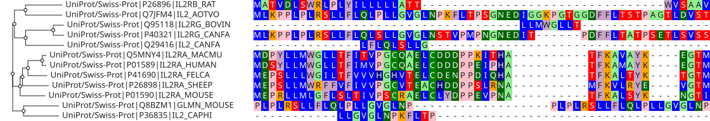
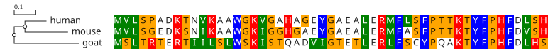

# react-msaview (JBrowseMSA)

An interactive multiple sequence alignment viewer.



## Features

- Tree and alignment rendered together, tiled to stay fast on large inputs
- Parses FASTA, Stockholm, Clustal, A3M, and EMF alignments and Newick/EMF trees
- Protein domain overlays from GFF3, such as InterProScan output (generate them
  with the [CLI](packages/cli/))
- Protein and nucleotide color schemes, including per-column dynamic schemes
- Conservation, property-conservation and sequence-logo tracks over the columns
- React component, UMD-in-HTML, and R htmlwidget entry points
- Shareable view state and SVG export

## Documentation

Jump to what you need:

| You want to…                                                           | Start here                                                                                                                                                |
| ---------------------------------------------------------------------- | --------------------------------------------------------------------------------------------------------------------------------------------------------- |
| **Use the viewer**: load data, explore, export an image                | [User guide](docs/user_guide.md) · [live app](https://gmod.org/JBrowseMSA/demo/) · [docs site](https://gmod.org/JBrowseMSA)                               |
| **Build the files to open**: sequences to alignment, tree, annotations | [Tutorials](docs/tutorials/) · [live](https://gmod.org/JBrowseMSA/tutorials)                                                                              |
| **Embed the React component** in your own app                          | [Usage & embedding guide](USAGE.md) · [live code examples](https://gmod.org/JBrowseMSA/examples) · [model API reference](packages/lib/apidocs/MsaView.md) |
| **Use it from R** (ape, Biostrings, ggtree, Shiny)                     | [R package README](packages/r-msaview/README.md)                                                                                                          |
| **Annotate protein domains or exons**, or render a figure headlessly   | [CLI README](packages/cli/): `interpro`, `interproscan`, `genestructure`, `export-svg`                                                                    |
| **Contribute / hack on the code**                                      | [Development](#development)                                                                                                                               |

## Quick start (React)

```tsx
import { MSAViewer } from 'react-msaview'

export default function App() {
  // backticks (template literal) so the \n become real newlines
  return (
    <MSAViewer
      msa={`>human\nMKAANSE\n>mouse\nMKA-NSE`}
      tree="(human:0.1,mouse:0.2);"
      colorScheme="clustal"
    />
  )
}
```

`MSAViewer` creates the model, measures width and provides the theme. The
install line is in [USAGE.md](USAGE.md#zero-config-component-recommended); it
pins the mobx, mobx-state-tree and MUI majors the viewer shares with
`@jbrowse/core`. That guide also covers the model-based API, the UMD bundle, and
every prop. The [live examples](https://gmod.org/JBrowseMSA/examples) have
runnable snippets.

## Quick start (R)

```r
library(msaviewr)
msaview(msa = "alignment.fasta", tree = "tree.nwk", color_scheme = "clustal")
```



See the [R package README](packages/r-msaview/README.md) for ape, Biostrings,
ggtree, treeio, and Shiny usage.

## Protein domains

The viewer draws domain annotations, such as the GFF the [CLI](packages/cli/)
writes, as labelled boxes on the alignment:


## Packages

| Package                                       | Description                                                    |
| --------------------------------------------- | -------------------------------------------------------------- |
| [packages/lib](packages/lib/)                 | Main react-msaview React component                             |
| [website](website/)                           | Docs site (deployed at gmod.org/JBrowseMSA)                    |
| [packages/app](packages/app/)                 | Demo application (deployed at gmod.org/JBrowseMSA/demo)        |
| [packages/examples](packages/examples/)       | Live usage examples (deployed at gmod.org/JBrowseMSA/examples) |
| [packages/cli](packages/cli/)                 | Domain/exon GFFs and headless SVG export                       |
| [packages/msa-parsers](packages/msa-parsers/) | MSA file format parsers                                        |
| [packages/r-msaview](packages/r-msaview/)     | R htmlwidget (ape/ggtree/Biostrings/treeio interop)            |
| [packages/svgcanvas](packages/svgcanvas/)     | SVG canvas rendering (ESM fork of svgcanvas)                   |

## Development

```bash
git clone https://github.com/GMOD/JBrowseMSA
cd JBrowseMSA
pnpm install
```

| Command                              | What it does                                                                        |
| ------------------------------------ | ----------------------------------------------------------------------------------- |
| `pnpm dev`                           | Run the demo app with hot reload (edits in `packages/lib/src/`)                     |
| `pnpm build`                         | Build all packages                                                                  |
| `pnpm test`                          | Run the test suite                                                                  |
| `pnpm figures`                       | Regenerate the README figures (headless SVG, `packages/lib/scripts`)                |
| `pnpm screenshots`                   | Regenerate the user-guide app screenshots (diff-gated; only changed images rewrite) |
| `pnpm lint` / `format` / `typecheck` | Lint (oxlint), format (oxfmt, plus Prettier for `.astro`), typecheck all packages   |

The workspace is **pnpm-only**. `pnpm-lock.yaml` at the root is the single
lockfile, and a `preinstall` guard
([scripts/only-pnpm.mjs](scripts/only-pnpm.mjs)) stops an accidental
`npm install` or `yarn` from producing a second, unvetted dependency tree. Get
pnpm with `corepack enable`.

[CLAUDE.md](CLAUDE.md) has the architecture notes; the core state model is
`packages/lib/src/model.ts` (MobX-state-tree), and `observer`-wrapped components
re-render when observed model properties change.

## Deployment

- **Docs site → gmod.org/JBrowseMSA**, with the **demo app at
  gmod.org/JBrowseMSA/demo**. `pnpm build:pages` builds both into `pages-dist/`
  (docs at the root, app under `/demo`); the
  [Deploy docs site](.github/workflows/deploy-docs.yml) workflow deploys it via
  GitHub's native Pages action on every push to `main`. Trigger it by hand with
  `workflow_dispatch` for an out-of-band deploy.
- **Examples gallery → gmod.org/JBrowseMSA/examples**: the docs site's examples
  page renders `packages/examples`, so the same push deploys it. The package has
  no standalone site; jbrowse.org/storybook/msa no longer hosts a copy.

## Releasing

Run `scripts/release.js` to create and push a new git tag. We use npm trusted
publishing, so pushing a tag to GitHub launches the npm release automatically.

`scripts/release.js` also writes the release's [CHANGELOG](CHANGELOG.md) section
from its commits, with [git-cliff](https://git-cliff.org) and the groups in
[cliff.toml](cliff.toml). We automated the changelog after the hand-written one
stopped at v3.1.3 while the packages reached 6.5.0.

## Related projects

- [jbrowse-plugin-msaview](https://github.com/GMOD/jbrowse-plugin-msaview): a
  JBrowse 2 plugin for viewing MSAs, supported by this repo
- [ProteinBrowser](https://github.com/GMOD/proteinbrowser): a suite of protein
  analysis tools built on this viewer

Builds on [abrowse](https://github.com/ihh/abrowse) and
[phylo-react](https://www.npmjs.com/package/phylo-react).
