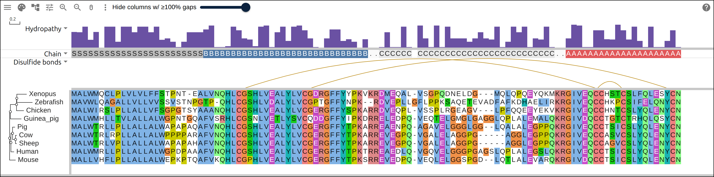
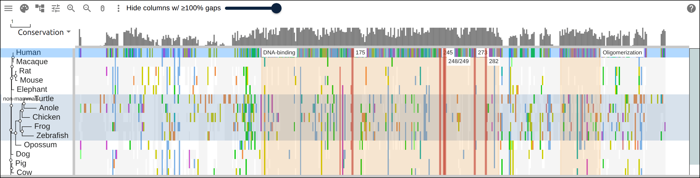
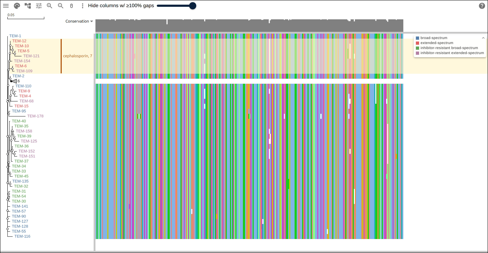
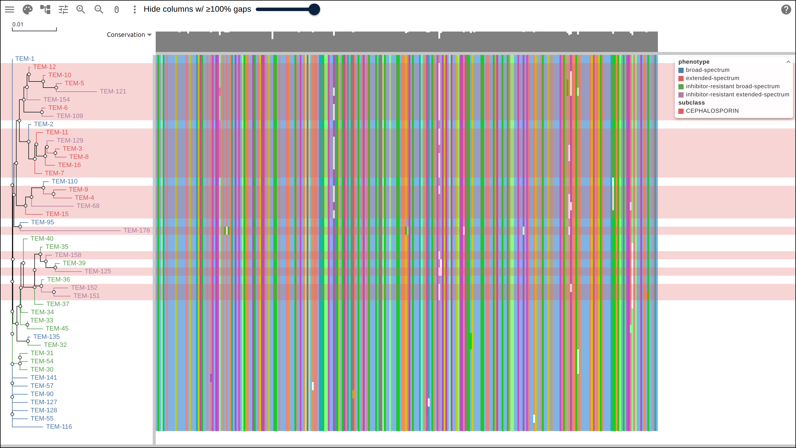
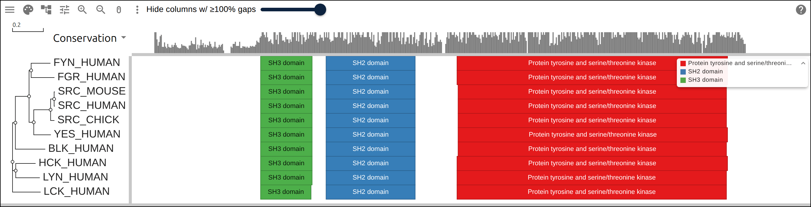
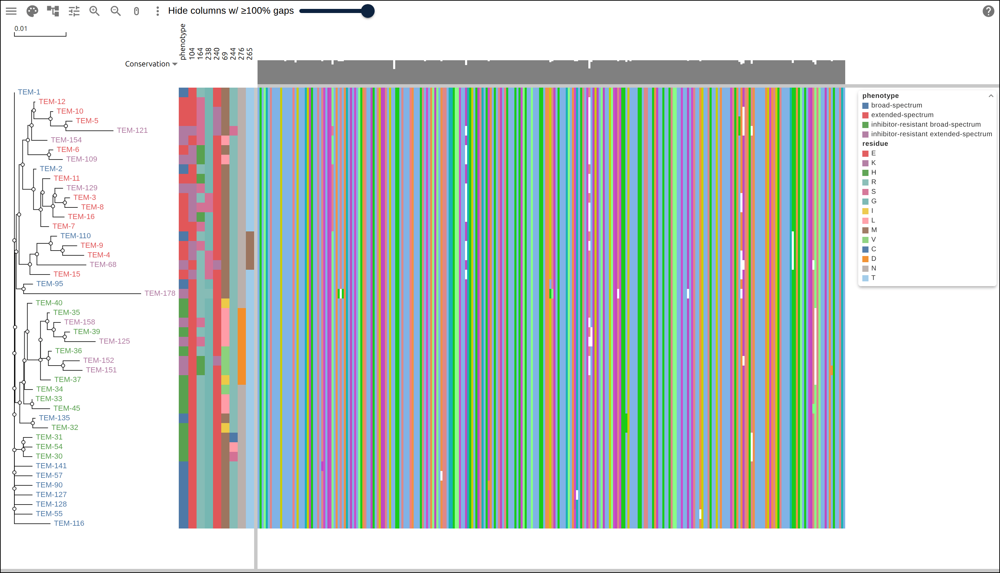
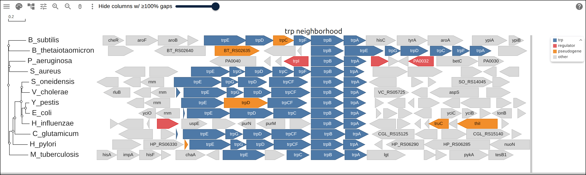
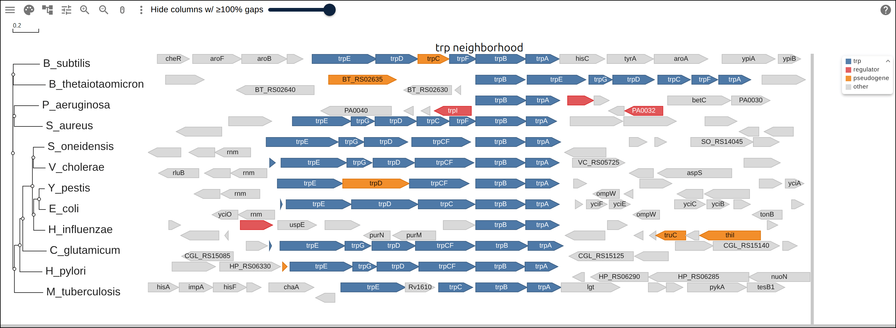

# Data layers

Every field below is a property of the `MsaView` model, so a host can write it
into the standalone app's `?data=` URL, pass it to `MSAModelF().create`, set it
through `MSAViewer` props, or give it to the R widget. The viewer draws each
layer as given, keeps it in a shared URL, and includes it in the SVG export.
Wherever a layer names a row, positions are that row's residues, 1-based and
inclusive, as in GFF, and the viewer projects them through the alignment's gaps.
Without a row, positions are alignment columns.

**Every figure below links to the app in the state it shows.** Each one is an
`MsaView` snapshot; to open one, URL-encode the JSON and put it in `?data=`,
either bare or wrapped as `{"msaview": {...}}`, the form the app writes back to
the address bar:

```js
const snapshot = {
  type: 'MsaView',
  data: { msa: '>human\nMKAANSE\n>mouse\nMKA-NSE' },
}
const url = `https://gmod.org/JBrowseMSA/demo/?data=${encodeURIComponent(JSON.stringify(snapshot))}`
```

The [user guide](https://gmod.org/JBrowseMSA/guide#link-to-a-view) covers what
else a link needs: file URIs, CORS, and the size limit on inline data.

## Shorthand

A link or a script can write a view in short forms, which `expandSpec` (exported
from `react-msaview`) turns into the snapshot. The app's `?data=` and
jbrowse-plugin-msaview's session spec both apply it, and a full snapshot passes
through unchanged.

```json
{
  "type": "MsaView",
  "msa": "https://gmod.org/JBrowseMSA/demo/data/p53/p53-vertebrates.afa",
  "tree": "https://gmod.org/JBrowseMSA/demo/data/p53/p53-vertebrates.nh",
  "query": "Human",
  "highlights": ["102-292 DNA-binding", 175, 248, 273],
  "region": "170-290",
  "columnTracks": [
    {
      "name": "ClinVar",
      "color": "#c0392b",
      "max": 8,
      "start": 104,
      "values": [2, 1, 0, 0, 2, 4]
    }
  ]
}
```

[Open this view in the app][live-layers-shorthand].

| Short form                 | Expands to                                                                              |
| -------------------------- | --------------------------------------------------------------------------------------- |
| `msa`                      | `msaFilehandle` for a url, `data.msa` for text spanning more than one line              |
| `tree`                     | `treeFilehandle` for a url, `data.tree` for newick text starting with `(`               |
| `query`                    | `relativeTo`, and the `row` of every highlight, region and column track that names none |
| a highlight `175`          | residue 175 of the query row, labeled with its letter and number, "R175"                |
| a highlight `"102-292 DB"` | residues 102-292 labeled "DB"; `"248"` is residue 248 and `"248 hotspot"` labels it     |
| `region: "170-290"`        | `{row, start: 170, end: 290}`                                                           |
| a column track's `id`      | taken from `name` when absent, "ClinVar pathogenic" becoming `clinvar-pathogenic`       |
| a column track's `kind`    | `bar` for `values`, `text` for `data`, `arc` for `arcs`                                 |
| a column track's `start`   | the position its `values` or `data` begins at, so leading zeros stay out of the link    |

Without `query`, the same highlight forms are alignment columns and a single one
gets no label. `"row": null` on an object entry takes it off the query row onto
alignment columns. A highlight's `label` may name `{residue}` and `{position}`,
which the viewer fills from the row's letter at `start`: `175` expands to the
label `{residue}{position}`. A malformed string, such as `"R175"` or
`"170..290"`, opens the view on an error naming it.

## columnTracks

A track above the alignment, supplied as data. `kind` picks what it draws: `bar`
reads `values`, `text` reads `data`, `arc` reads `arcs`. `row` makes any of them
index that row's residues instead of alignment columns, so the first one is
residue 1 and the viewer fills in the row's gaps. A data track appears in the
Tracks menu, toggles like any other, and exports to SVG.

[][live-layers-columntracks]

Preproinsulin across nine vertebrates, with all three kinds over the Human row:
Kyte-Doolittle hydropathy as bars, the chain each residue belongs to as
characters, and the three disulfide bonds of UniProt P01308 as arcs. B7-A7 and
B19-A20 reach across the C peptide that processing cuts out.

```json
{
  "type": "MsaView",
  "data": { "msa": ">human\nMKAANSE\n>mouse\nMKA-NSE" },
  "columnTracks": [
    {
      "id": "dnds",
      "name": "dN/dS",
      "kind": "bar",
      "values": [0.1, 0.4, 1.8, 0.2, 0.3, 0.1],
      "max": 2,
      "color": "#6a51a3",
      "row": "human"
    },
    {
      "id": "frame",
      "name": "Codon frame",
      "kind": "text",
      "data": "1231231",
      "colors": { "1": "#ddd", "2": "#bbb", "3": "#999" }
    },
    {
      "id": "disulfides",
      "name": "Disulfide bonds",
      "kind": "arc",
      "arcs": [
        { "start": 31, "end": 96 },
        { "start": 43, "end": 109 }
      ],
      "color": "#b8860b",
      "row": "human"
    }
  ]
}
```

| Field    | Kind | Meaning                                                                     |
| -------- | ---- | --------------------------------------------------------------------------- |
| `id`     | both | Unique key. The Tracks menu and `turnedOffTracks` use it                    |
| `name`   | both | Label beside the track                                                      |
| `values` | bar  | One number per column, or per residue of `row`                              |
| `max`    | bar  | Value drawn at full height (default 1)                                      |
| `color`  | bar  | Bar fill (default gray)                                                     |
| `data`   | text | One character per column, or per residue of `row`                           |
| `colors` | text | Upper-case character to background color; the active color scheme otherwise |
| `arcs`   | arc  | `{start, end, color?}` pairs; each end is a column or a residue             |
| `row`    | both | Row name whose residues the values or characters index                      |
| `height` | both | Pixel height (default 40 for a bar, 50 for an arc, the row height for text) |

A `row` on an arc track carries both ends of every arc, so a contact map
computed in a protein's own numbering lands on the alignment without conversion.
The viewer draws arcs on one baseline in the order given, and a `color` on an
individual arc overrides the track's, so one track can separate nested helices
from a pseudoknot.

An RNA Stockholm file needs no arc track, because `#=GC SS_cons` already pairs
the columns. The viewer draws a **Base pairs** track from it and gives
pseudoknot pairs their own color. WUSS writes a pseudoknot pair as `A`/`a`
because it crosses a helix, and brackets can only nest.

A track over 15 kB serialized stays in the live model but leaves the snapshot,
under the same [size rule](https://gmod.org/JBrowseMSA/guide#link-to-a-view)
that applies to inline alignments. To go past it, host the values and set them
at runtime with `model.setColumnTracks(...)`.

A `?data=` link has a tighter limit: the server in front of gmod.org answers a
request line over 8,192 characters with a 414 error. The demo app gzips the
snapshot into the link and drops `?data=` from the address bar once the encoded
URL passes 8,000 characters. The same app still opens a hand-written link of
plain JSON, which counts every character, so three tracks of a few hundred
values fit and much more does not. Scale the values to integers and record the
scale in `max`: `87,` takes three characters and `0.87,` takes five.

## highlights

A labeled band over a column range or a residue range, or a tint over a set of
rows. `label` and `color` are optional; `color` is any CSS color and paints the
band, its border, or the row tint.

[][live-layers-highlights]

p53 across fifteen vertebrates, read as a diff against Human. The two wide bands
are UniProt domains given as residue ranges of the Human row, the six narrow
ones are the IARC hotspot residues, and the blue wash is a `rows` entry over the
five non-mammals, labeled in the tree gutter.

```json
"highlights": [
  { "row": "human", "start": 248, "end": 248, "label": "R248Q · 651/658 R" },
  { "start": 40, "end": 60, "label": "NES", "color": "rgba(0,120,255,0.25)" },
  { "rows": ["beluga", "dolphin"], "label": "frameshift carriers" }
]
```

`row` plus `start`/`end` is a residue range of that row, `start`/`end` alone is
a column range, and `rows` marks whole rows across the tree labels and the
alignment. A range that lands entirely on hidden gappy columns draws nothing;
one that straddles them shrinks to the visible part. The viewer ignores row
names that match no row.

React: the `highlights` prop on `MSAViewer`, or `model.setHighlights(list)`. R:
`msaview(highlights = list(list(row = "human", start = 248, end = 248)))`.

For a transient highlight, such as one following a hover in a structure viewer
or a genome browser, call `model.applyHighlight(owner, list)` and
`model.clearHighlight(owner)`. They take the same shape, draw over the persisted
highlights, and stay out of the snapshot. `clearHighlight(owner)` removes only
that owner's highlights, so two sources can highlight at once.

`region` takes the same coordinates and names where the view opens:
`{"row": "Human", "start": 170, "end": 290}` zooms onto those residues once the
alignment and any tree file have loaded. The viewer then clears it, so a
reloaded session keeps the reader's own scroll. `model.zoomToRegion(region)`
does the same at runtime.

## clades

A clade of the tree with a mark over it. `mark` takes one of four values:

- `highlight` fills the rows behind the clade with a translucent rectangle,
  running from the clade's common ancestor to the right edge of the tree area
  and on across the alignment, which is ggtree's `geom_hilight`.
- `bracket` draws a vertical bar beside the clade's rows carrying the record's
  `label`, which is ggtree's `geom_cladelab` and, over a `range`, `geom_strip`.
- `collapse` collapses the clade at load, the way the branch menu's "Collapse
  this node" does.
- `focus` opens the viewer on the clade alone, the way "Show only this node"
  does.

[][live-layers-clades]

46 TEM beta-lactamase alleles. The seven-tip clade at the top carries a
`highlight` and a `bracket` over the same `mrca`; the clade under it carries a
`collapse` and draws as a triangle labeled with its six tips. Tip labels take
their color from an `encodings` entry over the phenotype field.

```json
"clades": [
  {
    "mrca": ["Gs/TW/TNC1/2015", "Ck/TW/a174/2015"],
    "tips": 47,
    "mark": "highlight",
    "color": "#fff3c4",
    "label": "2.3.4.4 H5Nx"
  },
  {
    "mrca": ["Gs/TW/TNC1/2015", "Ck/TW/a174/2015"],
    "tips": 47,
    "mark": "bracket",
    "color": "#b45309",
    "label": "2.3.4.4 H5Nx"
  },
  { "mrca": ["Dk/VN/1/2012", "Ck/VN/14/2012"], "tips": 6, "mark": "collapse" }
]
```

`mrca` names tips whose most recent common ancestor is the clade, and the mark
covers every tip under that ancestor. Two names are enough for a clade of any
size, and a name the tree does not have, or has twice, drops the record.

`tips` is the leaf count the producer measured. The viewer counts the leaves
under the ancestor it resolved, and a count that differs drops the clade, so a
re-rooted or re-estimated tree loses the mark instead of drawing it over a
different clade.

`range` takes the two ends of a run of tips in display order, in either order,
and covers every tip between them, monophyletic or not. Its `tips` is checked
against the length of the run:

```json
{ "range": ["Dk/VN/1/2012", "Ck/VN/14/2012"], "tips": 6, "mark": "highlight" }
```

`color` is any CSS color, defaulting to a light yellow. A highlight's color
carrying no alpha of its own draws at 60% opacity, so the branches and the
residues under it stay readable. A bracket draws its bar and its label in that
color at full strength, and takes the theme's text color without one.

The bracket gutter is at the right of the tree area, between the tip labels and
the first row panel or the alignment, as wide as the bar plus the widest label
at the tree font, to a limit of 140px, past which a label is cut with an
ellipsis. A label reads across the rows where they are taller than the font, and
runs up the bar where they are not. A `highlight` record carrying a `label`
draws it the same way, with no bar.

`collapse` and `focus` seed the viewer's own `collapsed` list and `showOnly`
once, when the tree resolves, so `hideGaps` counts the rows that remain exactly
as when the user collapses a clade by hand. Both marks name a node, so they need
`mrca`: a `range` record carrying one of them drops. Expanding a seeded clade or
clearing the focus holds for the rest of the session, and the record applies
again the next time the link is opened.

Every mark resolves against the tree as loaded, so collapsing a clade's ancestor
or focusing on part of the tree keeps the mark on the rows that remain on
screen.

React: the `clades` prop on `MSAViewer`, or `model.setClades(list)`. R:
`geom_msa_clade(c("Gs/TW/TNC1/2015", "Ck/TW/a174/2015"), tips = 47)`.

## rowData

A table of fields per row, keyed by row name: a lineage, a host, a collection
date, a kinase group. The `encodings` below color the viewer's marks by one of
these fields, the tree's node-info dialog lists a row's fields, and a `genome`
field replaces the row name in the tree labels.

The model keeps the table as the JSON string `data.treeMetadata`, the field name
that travels in existing links, so a snapshot carries it there:

```json
{
  "type": "MsaView",
  "data": {
    "msa": ">duck\nMKAANSE\n>chicken\nMKA-NSE",
    "treeMetadata": "{\"duck\":{\"clade\":\"2.3.4.4b\"},\"chicken\":{\"clade\":\"2.3.2.1c\"}}"
  }
}
```

[Open this snapshot in the app][live-layers-rowdata].

Everywhere else the table is an object: the `rowData` prop on `MSAViewer`,
`model.setRowData(table)`, `geom_msa_rowdata(df)` in R, and the `row_data` trait
in Python. R takes a data frame whose `label` or `row` column names each row and
whose other columns are the fields, the shape a ggtree
`tibble(label = , trait = )` has.

A real metadata table needs the filehandle. Five thousand rows with eight fields
run to roughly 700 kB, far past both the 15 kB inline limit and the
8,192-character request line, so the snapshot drops the table and
`unshareableData` reports the drop. Host the JSON and set
`treeMetadataFilehandle` to its URL, and the viewer fetches the table at
startup:

```json
{
  "type": "MsaView",
  "msaFilehandle": { "uri": "https://example.org/h5.fa" },
  "treeMetadataFilehandle": { "uri": "https://example.org/h5-lineages.json" }
}
```

## encodings

What the viewer's own marks read from a table. Each entry names a `channel`, the
`field` feeding it, and the `scale` that turns a field value into a color.

[][live-layers-encodings]

The same 46 alleles with three channels over the row table: `tipLabel` and
`branch` over the phenotype field, and `rowTint` over the subclass field through
a `{map}` that names one of its two values, so the alleles it leaves out take no
tint. Each field lists its own legend.

```json
{
  "type": "MsaView",
  "data": { "msa": ">duck\nMKAANSE\n>chicken\nMKA-NSE" },
  "encodings": [
    { "channel": "tipLabel", "field": "clade", "scale": { "palette": "set1" } },
    {
      "channel": "rowTint",
      "field": "clade",
      "scale": { "map": { "2.3.4.4b": "#e41a1c" } }
    }
  ]
}
```

| Field     | Meaning                                                            |
| --------- | ------------------------------------------------------------------ |
| `channel` | one of the five below                                              |
| `field`   | the field the channel reads                                        |
| `scale`   | `{palette}` or `{map}`; the ggplot palette when the entry omits it |

| Channel        | What it sets                                                  | Reads a field of |
| -------------- | ------------------------------------------------------------- | ---------------- |
| `tipLabel`     | the color of each tip label in the tree                       | `rowData`        |
| `rowTint`      | a wash over the row, across the tree gutter and the alignment | `rowData`        |
| `branch`       | the color of a tree edge whose tips all share one value       | `rowData`        |
| `featureFill`  | the fill of each span of the annotation overlay               | the `gff`        |
| `featureLabel` | the text drawn inside a span                                  | the `gff`        |

A `{palette}` names one of `ggplot` (the default), `set1`, `dark2`, `okabeito`
and `tableau`, and the scale hands its colors to the field's distinct values in
sorted order, so a value keeps its color as rows are collapsed, filtered or
re-ordered. Past the end of a palette every value takes an evenly spaced hue
instead, which keeps a forty-clade field readable. A `{map}` names a color per
value, and a value it leaves out keeps the plain mark: an uncolored tip label
draws in the theme's text color, an uncolored row takes no tint, and an
uncolored span draws grey.

A tint draws at 25% opacity so the residues under it stay readable. A color
carrying its own alpha, such as `rgba(228,26,28,0.5)`, draws at that alpha.

The `branch` channel gives an internal node the field's value when every tip
below it shares that value, and that node's edge and every edge inside the clade
draw in the scale's color for it. An edge whose tips disagree draws in the
default color, and a collapsed clade's triangle takes the color of the value its
tips agree on. This is ggtree's `groupClade` followed by `aes(color = group)`,
with the group read from the table.

Every field an encoding reads carries a legend of its scale, titled by the field
name, drawn by the overlay on screen and reserved as a column in the SVG export.
Two channels over one field list that field once.

### The feature channels

A feature channel reads any field of the feature table: `accession`, `name`,
`featureType`, or any GFF attribute of column 9, such as `Name` or `gene`.

[][live-layers-featurechannels]

Ten Src-family kinases with their InterPro Pfam matches, both feature channels
reading the GFF's `description` attribute: `featureFill` colors each span from a
`set1` scale and `featureLabel` draws the same value inside it.

```json
{
  "type": "MsaView",
  "data": {
    "msa": ">duck\nMKAANSE\n>chicken\nMKA-NSE",
    "gff": "##gff-version 3\nduck\tncbi\tgene\t1\t5\t.\t+\t.\tName=HA;class=surface\nchicken\tncbi\tgene\t1\t4\t.\t+\t.\tName=NP;class=internal;color=255,0,0"
  },
  "encodings": [
    {
      "channel": "featureFill",
      "field": "class",
      "scale": { "palette": "set1" }
    },
    { "channel": "featureLabel", "field": "Name" }
  ]
}
```

The `featureFill` scale replaces the accession palette the overlay colors spans
by, so a span whose value the scale gives no color draws grey, and the domain
legend lists that scale's values under the field's name. A feature carrying a
GFF3 `color=` attribute keeps that color whatever the scale says, and `255,0,0`
reads as `rgb(255,0,0)`, the convention JBrowse and IGV honor. A `featureLabel`
draws inside its span wherever the text fits, and it is a data channel, so it
draws whether or not the residue letters do.

## rowPanels

A panel beside the tree on the row scale, the counterpart of `columnTracks` on
the column scale. Each record names a `kind`. A `strip` reads a field of
`rowData` and colors each row's cell through `scale`, and eight strips make the
tip-aligned matrix ggtree draws with `gheatmap`. A `features` panel draws the
spans `gff` carries, one row per alignment row, which is gggenes.

[][live-layers-rowpanels]

Nine strips between the tree and the alignment: the phenotype of each allele,
then the residue it carries at each of eight Ambler positions. The eight
position strips share one `legend`, so the matrix carries a single key for its
residue colors.

```json
{
  "type": "MsaView",
  "data": {
    "msa": ">duck\nMKAANSE\n>chicken\nMKA-NSE",
    "treeMetadata": "{\"duck\":{\"HA\":\"H5\",\"NA\":\"N1\"},\"chicken\":{\"HA\":\"H5\",\"NA\":\"N8\"}}"
  },
  "rowPanels": [
    {
      "kind": "strip",
      "field": "HA",
      "scale": { "palette": "set1" },
      "width": 12
    },
    { "kind": "strip", "field": "NA", "header": "NA segment" }
  ]
}
```

| Field    | Meaning                                                              |
| -------- | -------------------------------------------------------------------- |
| `kind`   | `strip` or `features`                                                |
| `field`  | the `rowData` field a strip's cells read                             |
| `scale`  | `{palette}` or `{map}`; the ggplot palette when the record omits it  |
| `width`  | the column's pixel width: a row height for a strip, 200 for features |
| `header` | the name drawn above the column, defaulting to a strip's field       |
| `legend` | the title a strip's values list under, defaulting to its field       |

The panels take their width out of the alignment's, so the alignment scrolls and
fits within what is left. A strip scrolls with the tree and the alignment, and a
row the table gives no value leaves its cell empty.

Each header draws in the band the tree's scale bar and the minimap share, turned
on its side, and it exports with the figure. The band is as tall as the minimap,
so a longer header is clipped to it and the full name is the column's tooltip.

A panel's scale carries a legend of its own, titled by the field, and every
panel and encoding over one field lists that field once. Eight columns over one
set of colors read eight fields, so give them one `legend` and the figure
carries one key for the matrix:

```json
"rowPanels": [
  { "kind": "strip", "field": "PB2", "scale": { "map": { "am2.2": "#4e79a7" } }, "legend": "segment lineage" },
  { "kind": "strip", "field": "PB1", "scale": { "map": { "am4": "#f28e2b" } }, "legend": "segment lineage" }
]
```

A `features` panel taking the overlay's colors lists them under the same key the
overlay draws, and with no alignment behind it the panel's own entries are that
key.

React: the `rowPanels` prop on `MSAViewer`, or `model.setRowPanels(list)`. R:
`geom_msa_strip("HA", palette = "set1", width = 12, legend = "amino acid")` and
`geom_msa_features(color = "Name", label = "Name", align = "genE")`. Python: the
`row_panels` trait.

### The features panel

A `features` record draws the same spans the alignment's overlay draws, in a
column of its own: an arrow where the GFF gives a gene a strand, a box
otherwise, labeled where the text fits. Features that overlap within a row stack
into lanes, which divide the row's height between them.

[][live-layers-featurespanel]

Twelve bacterial genomes around `trpB`, with no alignment at all: a tree, a GFF
and one `features` panel under `x: "position"`. The `align` transform starts
`trpB` at one x down the panel, and `encoding.color` reads the GFF's `role`
attribute while `encoding.label` reads `Name`.

| Field       | Meaning                                                                                   |
| ----------- | ----------------------------------------------------------------------------------------- |
| `x`         | `column` draws in the alignment's columns; `position` in each row's own residue positions |
| `encoding`  | `{color: {field, scale}, label: field}` over a field of the features                      |
| `transform` | `[{type: "align", on: <Name value>}]`, only under `x: "position"`                         |
| `position`  | `identity` stacks overlapping features; `strandpile` splits the row by strand             |

`x: "position"` maps every row's features onto one linear scale across the
extent they cover, so a genome with no alignment has an x. With no `msa` the
alignment panel is zero columns wide, and the tree and the panel fill the view.

`{type: "align", on: "genE"}` shifts each row so that the first feature whose
`Name` is `genE` starts at zero, which is gggenes' `make_alignment_dummies`. A
row carrying no such feature keeps its own origin. An `align` under
`x: "column"` draws nothing different, since the columns are the alignment's.

`encoding.color` reads any field of the feature table, the same fields a
`featureFill` encoding reads. A record naming none takes the colors the overlay
gives the same features, and `encoding.label` falls back to the `featureLabel`
encoding the same way. A feature's own GFF `color=` wins over either.

[][live-layers-strandpile]

The same panel under `position: "strandpile"`, which separates the divergently
transcribed neighbours that read as one more arrow in a row under `identity`.

`position: "strandpile"` is gggenomes' `position_strandpile`. Each strand packs
on its own, and the deepest row on each side sets the grid every row lays out
on, so the line between the strands sits at one height down the panel. A row
using only one side leaves the other empty, and a feature with no strand piles
with the forward ones.

```json
{
  "type": "MsaView",
  "data": {
    "tree": "((genome1:0.1,genome2:0.1):0.2,genome3:0.3);",
    "gff": "##gff-version 3\ngenome1\tncbi\tgene\t1\t500\t.\t+\t.\tName=genD\ngenome1\tncbi\tgene\t600\t1000\t.\t+\t.\tName=genE\ngenome2\tncbi\tgene\t200\t700\t.\t+\t.\tName=genE\ngenome3\tncbi\tgene\t1\t400\t.\t-\t.\tName=genD"
  },
  "rowPanels": [
    {
      "kind": "features",
      "x": "position",
      "width": 320,
      "header": "neighborhood",
      "encoding": {
        "color": { "field": "Name", "scale": { "palette": "set1" } },
        "label": "Name"
      },
      "transform": [{ "type": "align", "on": "genE" }]
    }
  ]
}
```

## residueMappings

A residue mapping records which residue of which structure each residue of a row
corresponds to. Unlike the layers above, `residueMappings` draws nothing; the
model reads it to answer lookups. The host has to supply it, because matching a
row to a structure by sequence equality fails for a construct with an expression
tag, a truncation, an engineered residue, or a row that is a subsequence of the
entry. The highlight then lands on a real residue, just the wrong one. A
producer such as SIFTS, an AlphaFold model or a curator computes the
correspondence.

```json
"residueMappings": [
  {
    "row": "HBA_HUMAN/1-142",
    "accession": "P69905",
    "structure": {
      "id": "1A3N",
      "kind": "experimental",
      "asymId": "A",
      "url": "https://files.rcsb.org/download/1A3N.cif"
    },
    "segments": [
      { "rowStart": 1, "rowEnd": 141, "structStart": 2, "structEnd": 142 }
    ],
    "unobserved": [[60, 62]],
    "rowLength": 142,
    "generated": { "by": "sifts", "date": "2026-09-10" }
  }
]
```

| Field        | Meaning                                                              |
| ------------ | -------------------------------------------------------------------- |
| `row`        | The alignment row this maps                                          |
| `accession`  | The sequence database entry the mapping went through, for provenance |
| `structure`  | `id`, plus optional `kind`, `asymId` (the chain) and `url`           |
| `segments`   | Contiguous runs where the two sides line up 1:1                      |
| `unobserved` | Structure positions declared but not resolved, as `[start, end]`     |
| `rowLength`  | Ungapped length of the row it was computed against; always set it    |
| `generated`  | Who computed it, when, and from what                                 |

Positions are 1-based and inclusive on both sides, as everywhere else in this
document. Structure positions are `label_seq_id`, the index into the entity's
SEQRES. Author numbering carries insertion codes, which break integer
arithmetic, so the layer does not use it.

A mapping is a few contiguous runs, and the segments define what is unmapped, so
the layer needs no status field that could contradict them. A position is in one
of three states:

- covered by a segment and not in `unobserved`: mapped and observed
- covered and listed in `unobserved`: mapped, not observed
- anything else: unmapped

The middle state separates "the crystallographer could not see this residue"
from "this protein has no such residue".

Two model methods read it:

```ts
model.structureResidue(rowName, seqPos, structureId?) // -> {structure, position, observed} | undefined
model.rowResidue(structureId, position, asymId?) // -> {rowName, seqPos} | undefined
```

Both return `undefined` when no mapping covers the position, **and also when
more than one does**. A row commonly maps onto several structures, such as an
experimental entry and a couple of predicted models, and a homodimer maps two
rows onto two chains of one id. Returning the first mapping found would place
the answer on a wrong residue with no error. Name one structure or chain with
the optional argument, or read `mappedStructures` to see what is available.

### Staleness

A host can load a saved mapping against a re-aligned, revised or different
sequence, and every lookup would then return a wrong residue with no error.
Before answering, the viewer checks each mapping and stops using it when any of
these holds:

- The row it names is not in the alignment.
- `rowLength` is declared and does not match the row's ungapped length. No other
  check catches a same-length substitution, so a producer should always set it.
- A segment covers residues past the end of the row, which shows the same
  mismatch when `rowLength` is missing.

When a segment is malformed, its two sides differing in length so it cannot be a
1:1 run, the viewer drops only that segment and keeps using the rest of the
mapping.

`model.residueMappingProblems` lists each mapping or segment the viewer dropped,
with a `scope` (`mapping` or `segment`) and a reason, so a host can tell "there
is no structure for this row" from "this data no longer matches what is loaded".
`model.usableResidueMappings` holds the mappings that passed.

`packages/examples/src/examples/kinaseStructure.json` is a real mapping,
generated by `scripts/examples-gen/contacts.mjs` from SIFTS: the SRC_HUMAN row
against chain A of 2SRC, one segment putting row residue 86 at structure residue
2, one unobserved range, and `rowLength: 536`. The
[spike_structure tutorial](https://gmod.org/JBrowseMSA/tutorials/spike_structure)
builds another from scratch, against a construct whose numbering is offset by 19
and whose furin loop has no coordinates at all.

`seqPos` is 1-based, like the rest of this document, and composes directly with
`applyHighlight`. The column helpers on the model (`seqPosToVisibleCol`) take
0-based positions, so a structure hover reaches a column as
`model.seqPosToVisibleCol(rowName, seqPos - 1)`.

### Generating a mapping

`react-msaview-cli residue-mappings` writes this layer from SIFTS for a PDB
chain, or from AlphaFold DB for a predicted model. It checks each row against
its UniProt sequence first, maps a `/start-end` row as that fragment, and sets
`rowLength`, `unobserved` and `generated`. The
[CLI README](https://github.com/GMOD/JBrowseMSA/tree/main/packages/cli#residue-mappings)
lists its options.

```bash
react-msaview-cli residue-mappings --msa spike.afa --row SARS-CoV-2 \
  --accession P0DTC2 --pdb 6VXX --chain A -o mappings.json
```

<!-- live-demo links (generated by genGuideLinks.mjs) -->

[live-layers-shorthand]:
  https://gmod.org/JBrowseMSA/demo/?data=%7B%22msaview%22%3A%7B%22type%22%3A%22MsaView%22%2C%22msa%22%3A%22data%2Fp53%2Fp53-vertebrates.afa%22%2C%22tree%22%3A%22data%2Fp53%2Fp53-vertebrates.nh%22%2C%22query%22%3A%22Human%22%2C%22highlights%22%3A%5B%22102-292%20DNA-binding%22%2C175%2C248%2C273%5D%2C%22region%22%3A%22170-290%22%2C%22columnTracks%22%3A%5B%7B%22name%22%3A%22ClinVar%22%2C%22color%22%3A%22%23c0392b%22%2C%22max%22%3A8%2C%22start%22%3A104%2C%22values%22%3A%5B2%2C1%2C0%2C0%2C2%2C4%5D%7D%5D%7D%7D
[live-layers-columntracks]:
  https://gmod.org/JBrowseMSA/demo/?data=%7B%22msaview%22%3A%7B%22type%22%3A%22MsaView%22%2C%22height%22%3A380%2C%22treeAreaWidth%22%3A150%2C%22colWidth%22%3A12%2C%22rowHeight%22%3A18%2C%22colorSchemeName%22%3A%22clustalx_protein_dynamic%22%2C%22turnedOffTracks%22%3A%7B%22conservation%22%3Atrue%2C%22property-conservation%22%3Atrue%7D%2C%22columnTracks%22%3A%5B%7B%22id%22%3A%22hydropathy%22%2C%22name%22%3A%22Hydropathy%22%2C%22kind%22%3A%22bar%22%2C%22values%22%3A%5B6.4%2C6.3%2C8.3%2C3.6%2C6.4%2C0%2C8.3%2C8.3%2C2.9%2C8.3%2C8.3%2C6.3%2C8.3%2C8.3%2C6.3%2C8.3%2C3.6%2C4.1%2C2.9%2C1%2C2.9%2C6.3%2C6.3%2C6.3%2C7.3%2C8.7%2C1%2C1%2C1.2999999999999998%2C8.3%2C7%2C4.1%2C3.7%2C1.2999999999999998%2C8.3%2C8.7%2C1%2C6.3%2C8.3%2C3.2%2C8.3%2C8.7%2C7%2C4.1%2C1%2C0%2C4.1%2C7.3%2C7.3%2C3.2%2C3.8%2C2.9%2C0.6000000000000001%2C3.8%2C0%2C0%2C1%2C6.3%2C1%2C1%2C8.3%2C1%2C8.7%2C4.1%2C1%2C8.7%2C1%2C8.3%2C4.1%2C4.1%2C4.1%2C2.9%2C4.1%2C6.3%2C4.1%2C3.7%2C8.3%2C1%2C2.9%2C8.3%2C6.3%2C8.3%2C1%2C4.1%2C3.7%2C8.3%2C1%2C0.6000000000000001%2C0%2C4.1%2C9%2C8.7%2C1%2C1%2C7%2C7%2C3.8%2C3.7%2C9%2C7%2C3.7%2C8.3%2C3.2%2C1%2C8.3%2C1%2C1%2C3.2%2C7%2C1%5D%2C%22max%22%3A9%2C%22color%22%3A%22%236a51a3%22%2C%22row%22%3A%22Human%22%2C%22height%22%3A55%7D%2C%7B%22id%22%3A%22chain%22%2C%22name%22%3A%22Chain%22%2C%22kind%22%3A%22text%22%2C%22data%22%3A%22SSSSSSSSSSSSSSSSSSSSSSSSBBBBBBBBBBBBBBBBBBBBBBBBBBBBBB..CCCCCCCCCCCCCCCCCCCCCCCCCCCCCCC..AAAAAAAAAAAAAAAAAAAAA%22%2C%22colors%22%3A%7B%22S%22%3A%22%23bdbdbd%22%2C%22B%22%3A%22%234e79a7%22%2C%22C%22%3A%22%23e8e8e8%22%2C%22A%22%3A%22%23e15759%22%2C%22.%22%3A%22%23fafafa%22%7D%2C%22row%22%3A%22Human%22%7D%2C%7B%22id%22%3A%22disulfides%22%2C%22name%22%3A%22Disulfide%20bonds%22%2C%22kind%22%3A%22arc%22%2C%22arcs%22%3A%5B%7B%22start%22%3A31%2C%22end%22%3A96%7D%2C%7B%22start%22%3A43%2C%22end%22%3A109%7D%2C%7B%22start%22%3A95%2C%22end%22%3A100%7D%5D%2C%22color%22%3A%22%23b8860b%22%2C%22row%22%3A%22Human%22%2C%22height%22%3A70%7D%5D%2C%22msaFilehandle%22%3A%7B%22uri%22%3A%22data%2Finsulin.aln%22%7D%2C%22treeFilehandle%22%3A%7B%22uri%22%3A%22data%2Finsulin.nh%22%7D%7D%7D
[live-layers-highlights]:
  https://gmod.org/JBrowseMSA/demo/?data=%7B%22msaview%22%3A%7B%22type%22%3A%22MsaView%22%2C%22height%22%3A340%2C%22treeAreaWidth%22%3A140%2C%22colWidth%22%3A2.4%2C%22rowHeight%22%3A18%2C%22relativeTo%22%3A%22Human%22%2C%22colorSchemeName%22%3A%22clustalx_protein_dynamic%22%2C%22turnedOffTracks%22%3A%7B%22property-conservation%22%3Atrue%7D%2C%22highlights%22%3A%5B%7B%22row%22%3A%22Human%22%2C%22start%22%3A102%2C%22end%22%3A292%2C%22label%22%3A%22DNA-binding%22%2C%22color%22%3A%22rgba(255%2C140%2C0%2C0.15)%22%7D%2C%7B%22row%22%3A%22Human%22%2C%22start%22%3A325%2C%22end%22%3A356%2C%22label%22%3A%22Oligomerization%22%2C%22color%22%3A%22rgba(255%2C140%2C0%2C0.15)%22%7D%2C%7B%22row%22%3A%22Human%22%2C%22start%22%3A175%2C%22end%22%3A175%2C%22label%22%3A%22175%22%2C%22color%22%3A%22rgba(192%2C57%2C43%2C0.45)%22%7D%2C%7B%22row%22%3A%22Human%22%2C%22start%22%3A245%2C%22end%22%3A245%2C%22label%22%3A%22245%22%2C%22color%22%3A%22rgba(192%2C57%2C43%2C0.45)%22%7D%2C%7B%22row%22%3A%22Human%22%2C%22start%22%3A248%2C%22end%22%3A248%2C%22color%22%3A%22rgba(192%2C57%2C43%2C0.45)%22%7D%2C%7B%22row%22%3A%22Human%22%2C%22start%22%3A249%2C%22end%22%3A249%2C%22label%22%3A%22248%2F249%22%2C%22color%22%3A%22rgba(192%2C57%2C43%2C0.45)%22%7D%2C%7B%22row%22%3A%22Human%22%2C%22start%22%3A273%2C%22end%22%3A273%2C%22label%22%3A%22273%22%2C%22color%22%3A%22rgba(192%2C57%2C43%2C0.45)%22%7D%2C%7B%22row%22%3A%22Human%22%2C%22start%22%3A282%2C%22end%22%3A282%2C%22label%22%3A%22282%22%2C%22color%22%3A%22rgba(192%2C57%2C43%2C0.45)%22%7D%2C%7B%22rows%22%3A%5B%22Chicken%22%2C%22Turtle%22%2C%22Anole%22%2C%22Frog%22%2C%22Zebrafish%22%5D%2C%22label%22%3A%22non-mammals%22%2C%22color%22%3A%22rgba(78%2C121%2C167%2C0.22)%22%7D%5D%2C%22msaFilehandle%22%3A%7B%22uri%22%3A%22data%2Fp53%2Fp53-vertebrates.afa%22%7D%2C%22treeFilehandle%22%3A%7B%22uri%22%3A%22data%2Fp53%2Fp53-vertebrates.nh%22%7D%7D%7D
[live-layers-clades]:
  https://gmod.org/JBrowseMSA/demo/?data=%7B%22msaview%22%3A%7B%22type%22%3A%22MsaView%22%2C%22treeAreaWidth%22%3A260%2C%22colWidth%22%3A3%2C%22rowHeight%22%3A14%2C%22colorSchemeName%22%3A%22clustalx_protein_dynamic%22%2C%22turnedOffTracks%22%3A%7B%22property-conservation%22%3Atrue%7D%2C%22msaFilehandle%22%3A%7B%22uri%22%3A%22data%2Ftem%2Ftem.afa%22%7D%2C%22treeFilehandle%22%3A%7B%22uri%22%3A%22data%2Ftem%2Ftem.nwk%22%7D%2C%22treeMetadataFilehandle%22%3A%7B%22uri%22%3A%22data%2Ftem%2Ftem-rowdata.json%22%7D%2C%22height%22%3A700%2C%22encodings%22%3A%5B%7B%22channel%22%3A%22tipLabel%22%2C%22field%22%3A%22phenotype%22%2C%22scale%22%3A%7B%22map%22%3A%7B%22broad-spectrum%22%3A%22%234e79a7%22%2C%22extended-spectrum%22%3A%22%23e15759%22%2C%22inhibitor-resistant%20broad-spectrum%22%3A%22%2359a14f%22%2C%22inhibitor-resistant%20extended-spectrum%22%3A%22%23b07aa1%22%7D%7D%7D%5D%2C%22clades%22%3A%5B%7B%22mrca%22%3A%5B%22TEM-5%22%2C%22TEM-109%22%5D%2C%22tips%22%3A7%2C%22mark%22%3A%22highlight%22%2C%22color%22%3A%22%23fff3c4%22%7D%2C%7B%22mrca%22%3A%5B%22TEM-5%22%2C%22TEM-109%22%5D%2C%22tips%22%3A7%2C%22mark%22%3A%22bracket%22%2C%22color%22%3A%22%23b45309%22%2C%22label%22%3A%22cephalosporin%2C%207%22%7D%2C%7B%22mrca%22%3A%5B%22TEM-3%22%2C%22TEM-7%22%5D%2C%22tips%22%3A6%2C%22mark%22%3A%22collapse%22%7D%5D%7D%7D
[live-layers-rowdata]:
  https://gmod.org/JBrowseMSA/demo/?data=%7B%22msaview%22%3A%7B%22type%22%3A%22MsaView%22%2C%22data%22%3A%7B%22msa%22%3A%22%3Educk%5CnMKAANSE%5Cn%3Echicken%5CnMKA-NSE%22%2C%22treeMetadata%22%3A%22%7B%5C%22duck%5C%22%3A%7B%5C%22clade%5C%22%3A%5C%222.3.4.4b%5C%22%7D%2C%5C%22chicken%5C%22%3A%7B%5C%22clade%5C%22%3A%5C%222.3.2.1c%5C%22%7D%7D%22%7D%7D%7D
[live-layers-encodings]:
  https://gmod.org/JBrowseMSA/demo/?data=%7B%22msaview%22%3A%7B%22type%22%3A%22MsaView%22%2C%22treeAreaWidth%22%3A260%2C%22colWidth%22%3A3%2C%22rowHeight%22%3A14%2C%22colorSchemeName%22%3A%22clustalx_protein_dynamic%22%2C%22turnedOffTracks%22%3A%7B%22property-conservation%22%3Atrue%7D%2C%22msaFilehandle%22%3A%7B%22uri%22%3A%22data%2Ftem%2Ftem.afa%22%7D%2C%22treeFilehandle%22%3A%7B%22uri%22%3A%22data%2Ftem%2Ftem.nwk%22%7D%2C%22treeMetadataFilehandle%22%3A%7B%22uri%22%3A%22data%2Ftem%2Ftem-rowdata.json%22%7D%2C%22height%22%3A760%2C%22encodings%22%3A%5B%7B%22channel%22%3A%22tipLabel%22%2C%22field%22%3A%22phenotype%22%2C%22scale%22%3A%7B%22map%22%3A%7B%22broad-spectrum%22%3A%22%234e79a7%22%2C%22extended-spectrum%22%3A%22%23e15759%22%2C%22inhibitor-resistant%20broad-spectrum%22%3A%22%2359a14f%22%2C%22inhibitor-resistant%20extended-spectrum%22%3A%22%23b07aa1%22%7D%7D%7D%2C%7B%22channel%22%3A%22branch%22%2C%22field%22%3A%22phenotype%22%2C%22scale%22%3A%7B%22map%22%3A%7B%22broad-spectrum%22%3A%22%234e79a7%22%2C%22extended-spectrum%22%3A%22%23e15759%22%2C%22inhibitor-resistant%20broad-spectrum%22%3A%22%2359a14f%22%2C%22inhibitor-resistant%20extended-spectrum%22%3A%22%23b07aa1%22%7D%7D%7D%2C%7B%22channel%22%3A%22rowTint%22%2C%22field%22%3A%22subclass%22%2C%22scale%22%3A%7B%22map%22%3A%7B%22CEPHALOSPORIN%22%3A%22%23e15759%22%7D%7D%7D%5D%7D%7D
[live-layers-featurechannels]:
  https://gmod.org/JBrowseMSA/demo/?data=%7B%22msaview%22%3A%7B%22type%22%3A%22MsaView%22%2C%22height%22%3A340%2C%22treeAreaWidth%22%3A215%2C%22colWidth%22%3A1.8%2C%22rowHeight%22%3A24%2C%22colorSchemeName%22%3A%22clustalx_protein_dynamic%22%2C%22turnedOffTracks%22%3A%7B%22property-conservation%22%3Atrue%7D%2C%22encodings%22%3A%5B%7B%22channel%22%3A%22featureFill%22%2C%22field%22%3A%22description%22%2C%22scale%22%3A%7B%22palette%22%3A%22set1%22%7D%7D%2C%7B%22channel%22%3A%22featureLabel%22%2C%22field%22%3A%22description%22%7D%5D%2C%22msaFilehandle%22%3A%7B%22uri%22%3A%22data%2Fkinase.aln%22%7D%2C%22treeFilehandle%22%3A%7B%22uri%22%3A%22data%2Fkinase.nh%22%7D%2C%22gffFilehandle%22%3A%7B%22uri%22%3A%22data%2Fkinase-domains.gff%22%7D%7D%7D
[live-layers-rowpanels]:
  https://gmod.org/JBrowseMSA/demo/?data=%7B%22msaview%22%3A%7B%22type%22%3A%22MsaView%22%2C%22treeAreaWidth%22%3A260%2C%22colWidth%22%3A3%2C%22rowHeight%22%3A14%2C%22colorSchemeName%22%3A%22clustalx_protein_dynamic%22%2C%22turnedOffTracks%22%3A%7B%22property-conservation%22%3Atrue%7D%2C%22msaFilehandle%22%3A%7B%22uri%22%3A%22data%2Ftem%2Ftem.afa%22%7D%2C%22treeFilehandle%22%3A%7B%22uri%22%3A%22data%2Ftem%2Ftem.nwk%22%7D%2C%22treeMetadataFilehandle%22%3A%7B%22uri%22%3A%22data%2Ftem%2Ftem-rowdata.json%22%7D%2C%22height%22%3A830%2C%22encodings%22%3A%5B%7B%22channel%22%3A%22tipLabel%22%2C%22field%22%3A%22phenotype%22%2C%22scale%22%3A%7B%22map%22%3A%7B%22broad-spectrum%22%3A%22%234e79a7%22%2C%22extended-spectrum%22%3A%22%23e15759%22%2C%22inhibitor-resistant%20broad-spectrum%22%3A%22%2359a14f%22%2C%22inhibitor-resistant%20extended-spectrum%22%3A%22%23b07aa1%22%7D%7D%7D%5D%2C%22rowPanels%22%3A%5B%7B%22kind%22%3A%22strip%22%2C%22field%22%3A%22phenotype%22%2C%22scale%22%3A%7B%22map%22%3A%7B%22broad-spectrum%22%3A%22%234e79a7%22%2C%22extended-spectrum%22%3A%22%23e15759%22%2C%22inhibitor-resistant%20broad-spectrum%22%3A%22%2359a14f%22%2C%22inhibitor-resistant%20extended-spectrum%22%3A%22%23b07aa1%22%7D%7D%2C%22width%22%3A14%7D%2C%7B%22kind%22%3A%22strip%22%2C%22field%22%3A%22Ambler%20104%22%2C%22scale%22%3A%7B%22map%22%3A%7B%22C%22%3A%22%234e79a7%22%2C%22D%22%3A%22%23f28e2b%22%2C%22E%22%3A%22%23e15759%22%2C%22G%22%3A%22%2376b7b2%22%2C%22H%22%3A%22%2359a14f%22%2C%22I%22%3A%22%23edc948%22%2C%22K%22%3A%22%23b07aa1%22%2C%22L%22%3A%22%23ff9da7%22%2C%22M%22%3A%22%239c755f%22%2C%22N%22%3A%22%23bab0ac%22%2C%22R%22%3A%22%2386bcb6%22%2C%22S%22%3A%22%23d37295%22%2C%22T%22%3A%22%23a0cbe8%22%2C%22V%22%3A%22%238cd17d%22%7D%7D%2C%22width%22%3A12%2C%22header%22%3A%22104%22%2C%22legend%22%3A%22residue%22%7D%2C%7B%22kind%22%3A%22strip%22%2C%22field%22%3A%22Ambler%20164%22%2C%22scale%22%3A%7B%22map%22%3A%7B%22C%22%3A%22%234e79a7%22%2C%22D%22%3A%22%23f28e2b%22%2C%22E%22%3A%22%23e15759%22%2C%22G%22%3A%22%2376b7b2%22%2C%22H%22%3A%22%2359a14f%22%2C%22I%22%3A%22%23edc948%22%2C%22K%22%3A%22%23b07aa1%22%2C%22L%22%3A%22%23ff9da7%22%2C%22M%22%3A%22%239c755f%22%2C%22N%22%3A%22%23bab0ac%22%2C%22R%22%3A%22%2386bcb6%22%2C%22S%22%3A%22%23d37295%22%2C%22T%22%3A%22%23a0cbe8%22%2C%22V%22%3A%22%238cd17d%22%7D%7D%2C%22width%22%3A12%2C%22header%22%3A%22164%22%2C%22legend%22%3A%22residue%22%7D%2C%7B%22kind%22%3A%22strip%22%2C%22field%22%3A%22Ambler%20238%22%2C%22scale%22%3A%7B%22map%22%3A%7B%22C%22%3A%22%234e79a7%22%2C%22D%22%3A%22%23f28e2b%22%2C%22E%22%3A%22%23e15759%22%2C%22G%22%3A%22%2376b7b2%22%2C%22H%22%3A%22%2359a14f%22%2C%22I%22%3A%22%23edc948%22%2C%22K%22%3A%22%23b07aa1%22%2C%22L%22%3A%22%23ff9da7%22%2C%22M%22%3A%22%239c755f%22%2C%22N%22%3A%22%23bab0ac%22%2C%22R%22%3A%22%2386bcb6%22%2C%22S%22%3A%22%23d37295%22%2C%22T%22%3A%22%23a0cbe8%22%2C%22V%22%3A%22%238cd17d%22%7D%7D%2C%22width%22%3A12%2C%22header%22%3A%22238%22%2C%22legend%22%3A%22residue%22%7D%2C%7B%22kind%22%3A%22strip%22%2C%22field%22%3A%22Ambler%20240%22%2C%22scale%22%3A%7B%22map%22%3A%7B%22C%22%3A%22%234e79a7%22%2C%22D%22%3A%22%23f28e2b%22%2C%22E%22%3A%22%23e15759%22%2C%22G%22%3A%22%2376b7b2%22%2C%22H%22%3A%22%2359a14f%22%2C%22I%22%3A%22%23edc948%22%2C%22K%22%3A%22%23b07aa1%22%2C%22L%22%3A%22%23ff9da7%22%2C%22M%22%3A%22%239c755f%22%2C%22N%22%3A%22%23bab0ac%22%2C%22R%22%3A%22%2386bcb6%22%2C%22S%22%3A%22%23d37295%22%2C%22T%22%3A%22%23a0cbe8%22%2C%22V%22%3A%22%238cd17d%22%7D%7D%2C%22width%22%3A12%2C%22header%22%3A%22240%22%2C%22legend%22%3A%22residue%22%7D%2C%7B%22kind%22%3A%22strip%22%2C%22field%22%3A%22Ambler%2069%22%2C%22scale%22%3A%7B%22map%22%3A%7B%22C%22%3A%22%234e79a7%22%2C%22D%22%3A%22%23f28e2b%22%2C%22E%22%3A%22%23e15759%22%2C%22G%22%3A%22%2376b7b2%22%2C%22H%22%3A%22%2359a14f%22%2C%22I%22%3A%22%23edc948%22%2C%22K%22%3A%22%23b07aa1%22%2C%22L%22%3A%22%23ff9da7%22%2C%22M%22%3A%22%239c755f%22%2C%22N%22%3A%22%23bab0ac%22%2C%22R%22%3A%22%2386bcb6%22%2C%22S%22%3A%22%23d37295%22%2C%22T%22%3A%22%23a0cbe8%22%2C%22V%22%3A%22%238cd17d%22%7D%7D%2C%22width%22%3A12%2C%22header%22%3A%2269%22%2C%22legend%22%3A%22residue%22%7D%2C%7B%22kind%22%3A%22strip%22%2C%22field%22%3A%22Ambler%20244%22%2C%22scale%22%3A%7B%22map%22%3A%7B%22C%22%3A%22%234e79a7%22%2C%22D%22%3A%22%23f28e2b%22%2C%22E%22%3A%22%23e15759%22%2C%22G%22%3A%22%2376b7b2%22%2C%22H%22%3A%22%2359a14f%22%2C%22I%22%3A%22%23edc948%22%2C%22K%22%3A%22%23b07aa1%22%2C%22L%22%3A%22%23ff9da7%22%2C%22M%22%3A%22%239c755f%22%2C%22N%22%3A%22%23bab0ac%22%2C%22R%22%3A%22%2386bcb6%22%2C%22S%22%3A%22%23d37295%22%2C%22T%22%3A%22%23a0cbe8%22%2C%22V%22%3A%22%238cd17d%22%7D%7D%2C%22width%22%3A12%2C%22header%22%3A%22244%22%2C%22legend%22%3A%22residue%22%7D%2C%7B%22kind%22%3A%22strip%22%2C%22field%22%3A%22Ambler%20276%22%2C%22scale%22%3A%7B%22map%22%3A%7B%22C%22%3A%22%234e79a7%22%2C%22D%22%3A%22%23f28e2b%22%2C%22E%22%3A%22%23e15759%22%2C%22G%22%3A%22%2376b7b2%22%2C%22H%22%3A%22%2359a14f%22%2C%22I%22%3A%22%23edc948%22%2C%22K%22%3A%22%23b07aa1%22%2C%22L%22%3A%22%23ff9da7%22%2C%22M%22%3A%22%239c755f%22%2C%22N%22%3A%22%23bab0ac%22%2C%22R%22%3A%22%2386bcb6%22%2C%22S%22%3A%22%23d37295%22%2C%22T%22%3A%22%23a0cbe8%22%2C%22V%22%3A%22%238cd17d%22%7D%7D%2C%22width%22%3A12%2C%22header%22%3A%22276%22%2C%22legend%22%3A%22residue%22%7D%2C%7B%22kind%22%3A%22strip%22%2C%22field%22%3A%22Ambler%20265%22%2C%22scale%22%3A%7B%22map%22%3A%7B%22C%22%3A%22%234e79a7%22%2C%22D%22%3A%22%23f28e2b%22%2C%22E%22%3A%22%23e15759%22%2C%22G%22%3A%22%2376b7b2%22%2C%22H%22%3A%22%2359a14f%22%2C%22I%22%3A%22%23edc948%22%2C%22K%22%3A%22%23b07aa1%22%2C%22L%22%3A%22%23ff9da7%22%2C%22M%22%3A%22%239c755f%22%2C%22N%22%3A%22%23bab0ac%22%2C%22R%22%3A%22%2386bcb6%22%2C%22S%22%3A%22%23d37295%22%2C%22T%22%3A%22%23a0cbe8%22%2C%22V%22%3A%22%238cd17d%22%7D%7D%2C%22width%22%3A12%2C%22header%22%3A%22265%22%2C%22legend%22%3A%22residue%22%7D%5D%7D%7D
[live-layers-featurespanel]:
  https://gmod.org/JBrowseMSA/demo/?data=%7B%22msaview%22%3A%7B%22type%22%3A%22MsaView%22%2C%22treeAreaWidth%22%3A240%2C%22treeFilehandle%22%3A%7B%22uri%22%3A%22data%2Fneighborhoods%2FtrpB.nwk%22%7D%2C%22gffFilehandle%22%3A%7B%22uri%22%3A%22data%2Fneighborhoods%2Ftrp-neighborhoods.gff%22%7D%2C%22height%22%3A430%2C%22rowHeight%22%3A26%2C%22rowPanels%22%3A%5B%7B%22kind%22%3A%22features%22%2C%22x%22%3A%22position%22%2C%22width%22%3A1080%2C%22header%22%3A%22trp%20neighborhood%22%2C%22encoding%22%3A%7B%22color%22%3A%7B%22field%22%3A%22role%22%2C%22scale%22%3A%7B%22map%22%3A%7B%22trp%22%3A%22%234e79a7%22%2C%22regulator%22%3A%22%23e15759%22%2C%22pseudogene%22%3A%22%23f28e2b%22%2C%22other%22%3A%22%23d9d9d9%22%7D%7D%7D%2C%22label%22%3A%22Name%22%7D%2C%22transform%22%3A%5B%7B%22type%22%3A%22align%22%2C%22on%22%3A%22trpB%22%7D%5D%7D%5D%7D%7D
[live-layers-strandpile]:
  https://gmod.org/JBrowseMSA/demo/?data=%7B%22msaview%22%3A%7B%22type%22%3A%22MsaView%22%2C%22treeAreaWidth%22%3A240%2C%22treeFilehandle%22%3A%7B%22uri%22%3A%22data%2Fneighborhoods%2FtrpB.nwk%22%7D%2C%22gffFilehandle%22%3A%7B%22uri%22%3A%22data%2Fneighborhoods%2Ftrp-neighborhoods.gff%22%7D%2C%22height%22%3A530%2C%22rowHeight%22%3A34%2C%22rowPanels%22%3A%5B%7B%22kind%22%3A%22features%22%2C%22x%22%3A%22position%22%2C%22width%22%3A1080%2C%22header%22%3A%22trp%20neighborhood%22%2C%22encoding%22%3A%7B%22color%22%3A%7B%22field%22%3A%22role%22%2C%22scale%22%3A%7B%22map%22%3A%7B%22trp%22%3A%22%234e79a7%22%2C%22regulator%22%3A%22%23e15759%22%2C%22pseudogene%22%3A%22%23f28e2b%22%2C%22other%22%3A%22%23d9d9d9%22%7D%7D%7D%2C%22label%22%3A%22Name%22%7D%2C%22transform%22%3A%5B%7B%22type%22%3A%22align%22%2C%22on%22%3A%22trpB%22%7D%5D%2C%22position%22%3A%22strandpile%22%7D%5D%7D%7D
