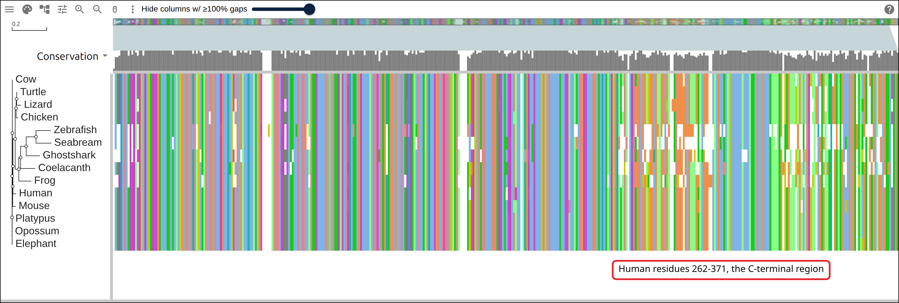
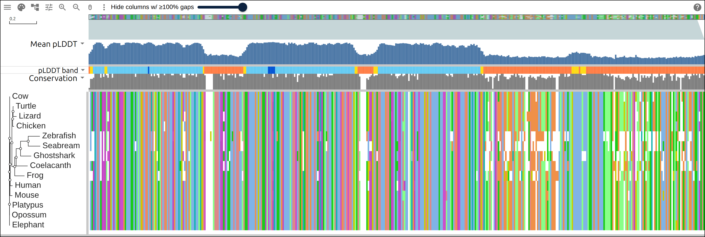
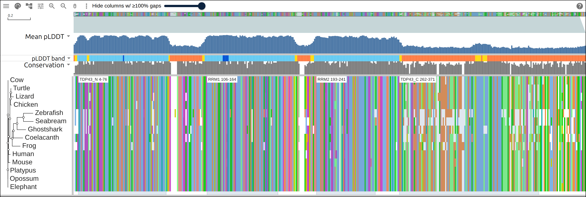
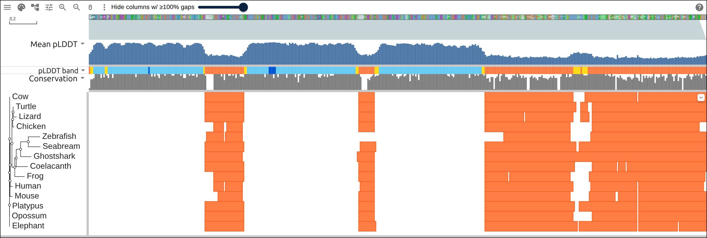
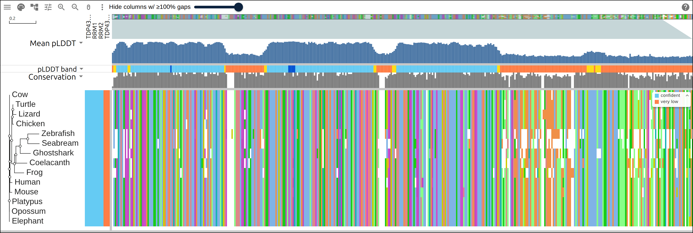
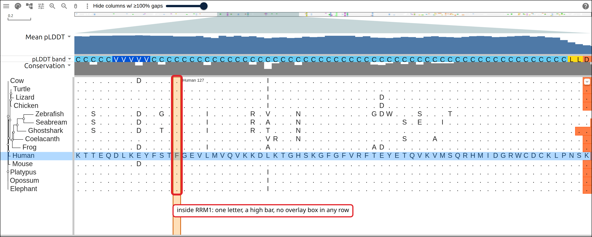
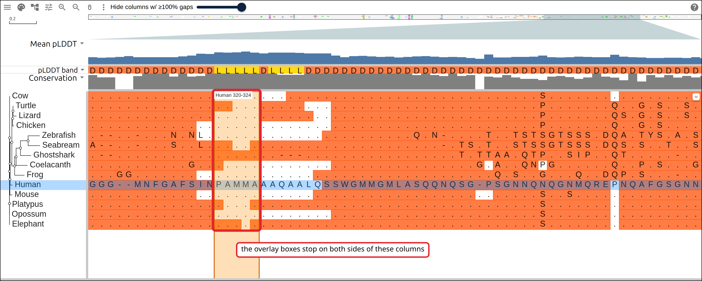
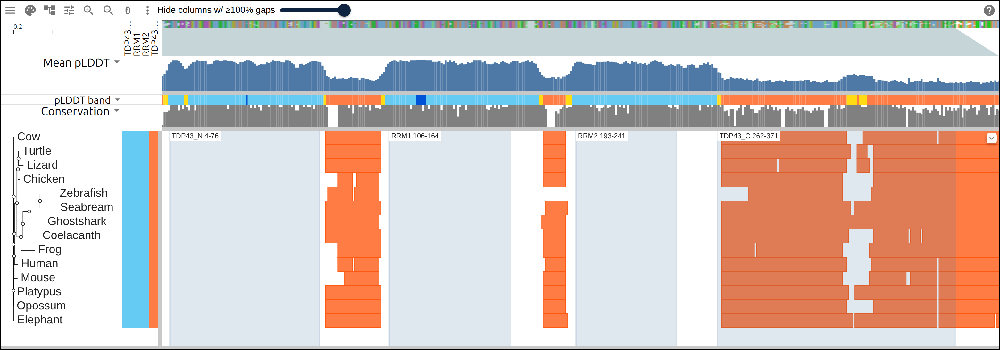

# AlphaFold confidence across a protein family

AlphaFold scores every residue it models with pLDDT, a number from 0 to 100 that
it writes into the B-factor column of the model file, and AlphaFold DB bands
those scores: above 90 very high, 70 to 90 confident, 50 to 70 low, below 50
very low. TDP-43, the protein the _TARDBP_ gene encodes, has three folded
domains and a 150-residue C-terminal region, so its models carry scores from
both ends of that range. This page takes fourteen vertebrate orthologs from
UniProt, aligns them, reads the pLDDT of each ortholog from its own AlphaFold
model, and puts the mean per alignment column on a bar track. The folded domains
are the control: the same track has to sit high there in every row, and the last
section reads two columns of the models residue by residue.

## Prerequisites

- `curl`
- ClustalW, `apt install clustalw` on Debian or Ubuntu, `brew install clustal-w`
  on macOS. ClustalW both aligns and infers a tree, so this page needs no other
  aligner.
- python3, standard library only

Every figure below links to the live view it captured.

## Where the data comes from

Fourteen UniProtKB entries and their AlphaFold models. AlphaFold DB is keyed on
UniProt accession, so one accession fetches the sequence and the model both.

- all fourteen sequences, one request:
  https://rest.uniprot.org/uniprotkb/accessions?accessions=Q13148,Q921F2&format=fasta
- the AlphaFold record for an accession, which names its files:
  https://alphafold.ebi.ac.uk/api/prediction/Q13148
- the model whose B-factor column holds the pLDDT:
  https://alphafold.ebi.ac.uk/files/AF-Q13148-F1-model_v6.pdb
- the Pfam matches of the human sequence:
  https://www.ebi.ac.uk/interpro/api/entry/pfam/protein/uniprot/Q13148
- the row table the commands below start from, hosted so the figures can link to
  it: https://gmod.org/JBrowseMSA/demo/data/tdp43/tardbp-rows.tsv
- the alignment they write:
  https://gmod.org/JBrowseMSA/demo/data/tdp43/tardbp.afa
- its tree: https://gmod.org/JBrowseMSA/demo/data/tdp43/tardbp.nwk
- the runs each model scores under 50:
  https://gmod.org/JBrowseMSA/demo/data/tdp43/tardbp-lowconf.gff
- the band each row falls in per domain:
  https://gmod.org/JBrowseMSA/demo/data/tdp43/tardbp-rowdata.json
- the tracks and the highlights, the layers the links below carry:
  https://gmod.org/JBrowseMSA/demo/data/tdp43/tardbp-layers.json

## 1. Name the rows

Write one species per line: the label the viewer draws, then the UniProtKB
accession. The label becomes the FASTA defline, the tree tip, the GFF seq_id and
the `row` of every layer.

```
Human	Q13148
Mouse	Q921F2
Cow	G3MX91
Elephant	G3TD75
Opossum	A0A5F8GU32
Platypus	F7EDX1
Chicken	Q5ZLN5
Turtle	K7FJ67
Lizard	A0A670IXJ6
Frog	Q28F51
Coelacanth	H3BC22
Zebrafish	Q802C7
Seabream	A0A671WI33
Ghostshark	A0A4W3GN84
```

Six mammals, three sauropsids, a frog, a coelacanth, two teleosts and a
chimaera. Both teleost entries are the `tardbpb` paralog, which runs the full
length of the protein.

## 2. Fetch the sequences

One request takes every accession, and a short script rewrites each defline to
the species label:

```bash
accessions=$(awk -F'\t' '{printf "%s%s", sep, $2; sep=","}' rows.tsv)
curl -sf "https://rest.uniprot.org/uniprotkb/accessions?accessions=$accessions&format=fasta" \
  -o tardbp-uniprot.fasta
```

```
  Human        Q13148       414 aa
  Mouse        Q921F2       414 aa
  Cow          G3MX91       414 aa
  Elephant     G3TD75       414 aa
  Opossum      A0A5F8GU32   414 aa
  Platypus     F7EDX1       414 aa
  Chicken      Q5ZLN5       414 aa
  Turtle       K7FJ67       414 aa
  Lizard       A0A670IXJ6   415 aa
  Frog         Q28F51       409 aa
  Coelacanth   H3BC22       412 aa
  Zebrafish    Q802C7       412 aa
  Seabream     A0A671WI33   406 aa
  Ghostshark   A0A4W3GN84   404 aa
```

Every ortholog is 404 to 415 residues, and eight of the nine amniotes are 414
apiece.

## 3. Align and infer a tree

```bash
clustalw -INFILE=tardbp.fasta -ALIGN -TYPE=PROTEIN -OUTORDER=INPUT \
  -OUTPUT=FASTA -OUTFILE=tardbp.afa
clustalw -INFILE=tardbp.afa -TREE -TYPE=PROTEIN -OUTPUTTREE=phylip
tr -d '[:space:]' < tardbp.ph > tardbp.nwk
```

```
14 rows, 431 columns
(((((Human:0.01799,((Chicken:0.01026,(Turtle:0.00330,Lizard:0.02575):0.00303):0.00546,
(Frog:0.07202,(Coelacanth:0.08469,((Zebrafish:0.08572,Seabream:0.08841):0.05655,
Ghostshark:0.07870):0.03228):0.01066):0.02077):0.01299):0.00134,Mouse:0.01773):0.00213,
Cow:0.00108):0.00132,Platypus:0.00236):0.00000,Elephant:0.00238,Opossum:0.00000);
```

The mammal rows sit on branches of 0.001 to 0.02 substitutions per site, and
neighbor joining places Human beside the sauropsids on those distances. The two
teleosts and the chimaera carry the long branches.

[](https://gmod.org/JBrowseMSA/demo/#data=%7B%22msaview%22%3A%7B%22type%22%3A%22MsaView%22%2C%22height%22%3A520%2C%22treeAreaWidth%22%3A190%2C%22colWidth%22%3A3.2%2C%22rowHeight%22%3A22%2C%22colorSchemeName%22%3A%22clustalx_protein_dynamic%22%2C%22turnedOffTracks%22%3A%7B%22property-conservation%22%3Atrue%7D%2C%22msaFilehandle%22%3A%7B%22uri%22%3A%22data%2Ftdp43%2Ftardbp.afa%22%7D%2C%22treeFilehandle%22%3A%7B%22uri%22%3A%22data%2Ftdp43%2Ftardbp.nwk%22%7D%7D%7D)

Fourteen rows of 431 columns, 387 of which carry a residue in every row. The
gaps cluster in the right third, right of the callout.

## 4. Read the pLDDT off the models

The API record for an accession names the model files. It answers a request with
no `User-Agent` header with a 403, so send one:

```bash
url=$(curl -sf -A "$UA" "https://alphafold.ebi.ac.uk/api/prediction/Q13148" |
  python3 -c 'import json,sys; print(json.load(sys.stdin)[0]["pdbUrl"])')
curl -sf -A "$UA" "$url" -o models/Q13148.pdb
```

The pLDDT of a residue is the B-factor of its CA atom, and the same line carries
the residue name, so one pass over the file reads the model's sequence and its
confidence together:

```python
def read_model(path):
    seq, plddt = '', []
    for line in open(path):
        if line.startswith('ATOM') and line[12:16].strip() == 'CA':
            seq += THREE_TO_ONE[line[17:20]]
            plddt.append(float(line[60:66]))
    return seq, plddt
```

A model is built from the UniProt sequence of the day it was made, so the script
compares it to the row letter by letter before reading a position off either:

```
  Human        Q13148       model 414 aa matches the row, mean pLDDT  65.2, 156 residues under 50
  Mouse        Q921F2       model 414 aa matches the row, mean pLDDT  63.8, 162 residues under 50
  Cow          G3MX91       model 414 aa matches the row, mean pLDDT  61.6, 172 residues under 50
  Elephant     G3TD75       model 414 aa matches the row, mean pLDDT  62.0, 178 residues under 50
  Opossum      A0A5F8GU32   model 414 aa matches the row, mean pLDDT  62.4, 169 residues under 50
  Platypus     F7EDX1       model 414 aa matches the row, mean pLDDT  61.9, 175 residues under 50
  Chicken      Q5ZLN5       model 414 aa matches the row, mean pLDDT  65.8, 155 residues under 50
  Turtle       K7FJ67       model 414 aa matches the row, mean pLDDT  61.4, 175 residues under 50
  Lizard       A0A670IXJ6   model 415 aa matches the row, mean pLDDT  62.3, 173 residues under 50
  Frog         Q28F51       model 409 aa matches the row, mean pLDDT  66.5, 156 residues under 50
  Coelacanth   H3BC22       model 412 aa matches the row, mean pLDDT  61.5, 167 residues under 50
  Zebrafish    Q802C7       model 412 aa matches the row, mean pLDDT  65.9, 149 residues under 50
  Seabream     A0A671WI33   model 406 aa matches the row, mean pLDDT  61.6, 170 residues under 50
  Ghostshark   A0A4W3GN84   model 404 aa matches the row, mean pLDDT  62.0, 172 residues under 50
```

Every model matches, and each one scores 149 to 178 of its residues under 50.
The column track is the mean over the rows that carry a residue in a column,
rounded to an integer, with a second `text` track giving each column the band
AlphaFold DB colors its models by: `V` above 90, `C` from 70 to 90, `L` from 50
to 70, `D` below 50.

```python
means = [round(sum(values) / len(values)) for values in by_column]
bands = ''.join(band(m) for m in means)
```

```
columns by mean pLDDT band: 6 very high, 214 confident, 24 low, 187 very low
```

[](https://gmod.org/JBrowseMSA/demo/#data=%7B%22msaview%22%3A%7B%22type%22%3A%22MsaView%22%2C%22height%22%3A520%2C%22treeAreaWidth%22%3A190%2C%22colWidth%22%3A3.2%2C%22rowHeight%22%3A22%2C%22colorSchemeName%22%3A%22clustalx_protein_dynamic%22%2C%22turnedOffTracks%22%3A%7B%22property-conservation%22%3Atrue%7D%2C%22msaFilehandle%22%3A%7B%22uri%22%3A%22data%2Ftdp43%2Ftardbp.afa%22%7D%2C%22treeFilehandle%22%3A%7B%22uri%22%3A%22data%2Ftdp43%2Ftardbp.nwk%22%7D%2C%22columnTracks%22%3A%5B%7B%22id%22%3A%22plddt-mean%22%2C%22name%22%3A%22Mean%20pLDDT%22%2C%22kind%22%3A%22bar%22%2C%22values%22%3A%5B48%2C55%2C63%2C80%2C84%2C89%2C89%2C89%2C88%2C83%2C75%2C67%2C68%2C76%2C81%2C85%2C86%2C89%2C88%2C87%2C87%2C87%2C79%2C80%2C81%2C88%2C89%2C89%2C88%2C87%2C89%2C89%2C87%2C88%2C87%2C86%2C82%2C80%2C85%2C85%2C88%2C90%2C89%2C88%2C84%2C81%2C76%2C78%2C80%2C79%2C79%2C84%2C83%2C86%2C89%2C88%2C88%2C87%2C85%2C84%2C89%2C89%2C87%2C83%2C79%2C71%2C71%2C80%2C81%2C78%2C80%2C83%2C86%2C88%2C88%2C88%2C86%2C84%2C76%2C64%2C49%2C46%2C40%2C44%2C47%2C41%2C42%2C42%2C44%2C41%2C40%2C43%2C45%2C44%2C43%2C43%2C39%2C43%2C44%2C41%2C40%2C38%2C37%2C35%2C39%2C40%2C49%2C55%2C60%2C72%2C81%2C85%2C87%2C89%2C87%2C86%2C89%2C87%2C87%2C87%2C86%2C89%2C89%2C89%2C90%2C90%2C90%2C91%2C90%2C89%2C89%2C89%2C86%2C86%2C86%2C88%2C82%2C79%2C89%2C85%2C89%2C85%2C87%2C82%2C78%2C81%2C82%2C79%2C80%2C85%2C83%2C84%2C89%2C89%2C89%2C89%2C84%2C87%2C81%2C80%2C79%2C81%2C84%2C83%2C80%2C85%2C87%2C84%2C83%2C81%2C84%2C87%2C88%2C87%2C83%2C84%2C86%2C88%2C89%2C85%2C87%2C82%2C81%2C70%2C60%2C52%2C47%2C44%2C43%2C44%2C46%2C46%2C40%2C45%2C42%2C47%2C47%2C51%2C55%2C62%2C74%2C83%2C86%2C86%2C86%2C82%2C81%2C80%2C80%2C79%2C78%2C77%2C86%2C85%2C85%2C86%2C86%2C87%2C86%2C86%2C85%2C84%2C83%2C80%2C81%2C84%2C87%2C83%2C81%2C87%2C85%2C86%2C81%2C82%2C80%2C82%2C77%2C81%2C86%2C87%2C89%2C88%2C85%2C86%2C80%2C76%2C76%2C77%2C80%2C77%2C75%2C79%2C79%2C75%2C70%2C71%2C77%2C78%2C79%2C77%2C71%2C71%2C77%2C77%2C83%2C80%2C84%2C77%2C80%2C71%2C70%2C58%2C56%2C44%2C38%2C40%2C41%2C46%2C43%2C42%2C43%2C42%2C44%2C41%2C39%2C42%2C38%2C38%2C36%2C39%2C42%2C35%2C34%2C36%2C36%2C37%2C39%2C34%2C33%2C35%2C36%2C37%2C35%2C33%2C38%2C36%2C36%2C35%2C36%2C36%2C35%2C37%2C35%2C38%2C38%2C38%2C34%2C36%2C35%2C34%2C34%2C32%2C33%2C35%2C38%2C34%2C34%2C34%2C34%2C34%2C37%2C40%2C47%2C46%2C52%2C51%2C52%2C55%2C51%2C48%2C51%2C51%2C51%2C50%2C48%2C48%2C48%2C40%2C34%2C38%2C39%2C37%2C35%2C36%2C33%2C35%2C37%2C38%2C36%2C34%2C35%2C34%2C31%2C28%2C44%2C33%2C33%2C35%2C35%2C36%2C40%2C34%2C33%2C34%2C36%2C35%2C34%2C34%2C43%2C36%2C34%2C33%2C31%2C31%2C32%2C32%2C31%2C34%2C30%2C33%2C31%2C31%2C33%2C33%2C35%2C33%2C33%2C34%2C34%2C29%2C32%2C32%2C33%2C32%2C35%2C34%2C37%2C33%2C35%2C37%2C34%2C35%2C33%2C35%2C34%2C35%2C33%2C36%2C34%2C39%2C37%2C40%2C39%2C40%2C41%2C43%2C45%2C43%2C44%2C52%2C46%5D%2C%22max%22%3A100%2C%22color%22%3A%22%234e79a7%22%2C%22height%22%3A60%7D%2C%7B%22id%22%3A%22plddt-band%22%2C%22name%22%3A%22pLDDT%20band%22%2C%22kind%22%3A%22text%22%2C%22data%22%3A%22DLLCCCCCCCCLLCCCCCCCCCCCCCCCCCCCCCCCCCCCCVCCCCCCCCCCCCCCCCCCCCCCCCCCCCCCCCCCCCCLDDDDDDDDDDDDDDDDDDDDDDDDDDDLLCCCCCCCCCCCCCCCVVVVVCCCCCCCCCCCCCCCCCCCCCCCCCCCCCCCCCCCCCCCCCCCCCCCCCCCCCCCLLDDDDDDDDDDDLLLCCCCCCCCCCCCCCCCCCCCCCCCCCCCCCCCCCCCCCCCCCCCCCCCCCCCCCCCCCCCCCCCCCCCCCCLLDDDDDDDDDDDDDDDDDDDDDDDDDDDDDDDDDDDDDDDDDDDDDDDDDDDDDDDDDDDDDLLLLLDLLLLDDDDDDDDDDDDDDDDDDDDDDDDDDDDDDDDDDDDDDDDDDDDDDDDDDDDDDDDDDDDDDDDDDDDDDDDDDDDDDDDDDDDDLD%22%2C%22colors%22%3A%7B%22V%22%3A%22%230053d6%22%2C%22C%22%3A%22%2365cbf3%22%2C%22L%22%3A%22%23ffdb13%22%2C%22D%22%3A%22%23ff7d45%22%7D%2C%22height%22%3A16%7D%5D%7D%7D)

The mean pLDDT per column as a bar, and its band below in AlphaFold DB's colors.
Three blue blocks of confident columns, separated by two dips, and a run of very
low columns from column 272 to the right edge.

## 5. Where the Pfam domains fall

The Pfam matches of the human sequence name its domains, and InterPro serves
them for one accession in one request:

```bash
curl -sf https://www.ebi.ac.uk/interpro/api/entry/pfam/protein/uniprot/Q13148 \
  -o tardbp-pfam.json
```

Each match becomes a highlight on the Human row, in that row's own residue
numbering:

```
TDP43_N  PF18694 Human 4-76: columns 5-77, mean pLDDT  84.0
RRM1     PF00076 Human 106-164: columns 112-170, mean pLDDT  85.5
RRM2     PF00076 Human 193-241: columns 203-251, mean pLDDT  82.7
TDP43_C  PF20910 Human 262-371: columns 272-387, mean pLDDT  38.4
```

The N-terminal domain and the two RNA recognition motifs land on the three high
blocks, each with a mean above 82. PF20910 covers the C-terminal region, where
the mean is 38.4.

[](<https://gmod.org/JBrowseMSA/demo/#data=%7B%22msaview%22%3A%7B%22type%22%3A%22MsaView%22%2C%22height%22%3A520%2C%22treeAreaWidth%22%3A190%2C%22colWidth%22%3A3.2%2C%22rowHeight%22%3A22%2C%22colorSchemeName%22%3A%22clustalx_protein_dynamic%22%2C%22turnedOffTracks%22%3A%7B%22property-conservation%22%3Atrue%7D%2C%22msaFilehandle%22%3A%7B%22uri%22%3A%22data%2Ftdp43%2Ftardbp.afa%22%7D%2C%22treeFilehandle%22%3A%7B%22uri%22%3A%22data%2Ftdp43%2Ftardbp.nwk%22%7D%2C%22columnTracks%22%3A%5B%7B%22id%22%3A%22plddt-mean%22%2C%22name%22%3A%22Mean%20pLDDT%22%2C%22kind%22%3A%22bar%22%2C%22values%22%3A%5B48%2C55%2C63%2C80%2C84%2C89%2C89%2C89%2C88%2C83%2C75%2C67%2C68%2C76%2C81%2C85%2C86%2C89%2C88%2C87%2C87%2C87%2C79%2C80%2C81%2C88%2C89%2C89%2C88%2C87%2C89%2C89%2C87%2C88%2C87%2C86%2C82%2C80%2C85%2C85%2C88%2C90%2C89%2C88%2C84%2C81%2C76%2C78%2C80%2C79%2C79%2C84%2C83%2C86%2C89%2C88%2C88%2C87%2C85%2C84%2C89%2C89%2C87%2C83%2C79%2C71%2C71%2C80%2C81%2C78%2C80%2C83%2C86%2C88%2C88%2C88%2C86%2C84%2C76%2C64%2C49%2C46%2C40%2C44%2C47%2C41%2C42%2C42%2C44%2C41%2C40%2C43%2C45%2C44%2C43%2C43%2C39%2C43%2C44%2C41%2C40%2C38%2C37%2C35%2C39%2C40%2C49%2C55%2C60%2C72%2C81%2C85%2C87%2C89%2C87%2C86%2C89%2C87%2C87%2C87%2C86%2C89%2C89%2C89%2C90%2C90%2C90%2C91%2C90%2C89%2C89%2C89%2C86%2C86%2C86%2C88%2C82%2C79%2C89%2C85%2C89%2C85%2C87%2C82%2C78%2C81%2C82%2C79%2C80%2C85%2C83%2C84%2C89%2C89%2C89%2C89%2C84%2C87%2C81%2C80%2C79%2C81%2C84%2C83%2C80%2C85%2C87%2C84%2C83%2C81%2C84%2C87%2C88%2C87%2C83%2C84%2C86%2C88%2C89%2C85%2C87%2C82%2C81%2C70%2C60%2C52%2C47%2C44%2C43%2C44%2C46%2C46%2C40%2C45%2C42%2C47%2C47%2C51%2C55%2C62%2C74%2C83%2C86%2C86%2C86%2C82%2C81%2C80%2C80%2C79%2C78%2C77%2C86%2C85%2C85%2C86%2C86%2C87%2C86%2C86%2C85%2C84%2C83%2C80%2C81%2C84%2C87%2C83%2C81%2C87%2C85%2C86%2C81%2C82%2C80%2C82%2C77%2C81%2C86%2C87%2C89%2C88%2C85%2C86%2C80%2C76%2C76%2C77%2C80%2C77%2C75%2C79%2C79%2C75%2C70%2C71%2C77%2C78%2C79%2C77%2C71%2C71%2C77%2C77%2C83%2C80%2C84%2C77%2C80%2C71%2C70%2C58%2C56%2C44%2C38%2C40%2C41%2C46%2C43%2C42%2C43%2C42%2C44%2C41%2C39%2C42%2C38%2C38%2C36%2C39%2C42%2C35%2C34%2C36%2C36%2C37%2C39%2C34%2C33%2C35%2C36%2C37%2C35%2C33%2C38%2C36%2C36%2C35%2C36%2C36%2C35%2C37%2C35%2C38%2C38%2C38%2C34%2C36%2C35%2C34%2C34%2C32%2C33%2C35%2C38%2C34%2C34%2C34%2C34%2C34%2C37%2C40%2C47%2C46%2C52%2C51%2C52%2C55%2C51%2C48%2C51%2C51%2C51%2C50%2C48%2C48%2C48%2C40%2C34%2C38%2C39%2C37%2C35%2C36%2C33%2C35%2C37%2C38%2C36%2C34%2C35%2C34%2C31%2C28%2C44%2C33%2C33%2C35%2C35%2C36%2C40%2C34%2C33%2C34%2C36%2C35%2C34%2C34%2C43%2C36%2C34%2C33%2C31%2C31%2C32%2C32%2C31%2C34%2C30%2C33%2C31%2C31%2C33%2C33%2C35%2C33%2C33%2C34%2C34%2C29%2C32%2C32%2C33%2C32%2C35%2C34%2C37%2C33%2C35%2C37%2C34%2C35%2C33%2C35%2C34%2C35%2C33%2C36%2C34%2C39%2C37%2C40%2C39%2C40%2C41%2C43%2C45%2C43%2C44%2C52%2C46%5D%2C%22max%22%3A100%2C%22color%22%3A%22%234e79a7%22%2C%22height%22%3A60%7D%2C%7B%22id%22%3A%22plddt-band%22%2C%22name%22%3A%22pLDDT%20band%22%2C%22kind%22%3A%22text%22%2C%22data%22%3A%22DLLCCCCCCCCLLCCCCCCCCCCCCCCCCCCCCCCCCCCCCVCCCCCCCCCCCCCCCCCCCCCCCCCCCCCCCCCCCCCLDDDDDDDDDDDDDDDDDDDDDDDDDDDLLCCCCCCCCCCCCCCCVVVVVCCCCCCCCCCCCCCCCCCCCCCCCCCCCCCCCCCCCCCCCCCCCCCCCCCCCCCCLLDDDDDDDDDDDLLLCCCCCCCCCCCCCCCCCCCCCCCCCCCCCCCCCCCCCCCCCCCCCCCCCCCCCCCCCCCCCCCCCCCCCCCLLDDDDDDDDDDDDDDDDDDDDDDDDDDDDDDDDDDDDDDDDDDDDDDDDDDDDDDDDDDDDDLLLLLDLLLLDDDDDDDDDDDDDDDDDDDDDDDDDDDDDDDDDDDDDDDDDDDDDDDDDDDDDDDDDDDDDDDDDDDDDDDDDDDDDDDDDDDDDLD%22%2C%22colors%22%3A%7B%22V%22%3A%22%230053d6%22%2C%22C%22%3A%22%2365cbf3%22%2C%22L%22%3A%22%23ffdb13%22%2C%22D%22%3A%22%23ff7d45%22%7D%2C%22height%22%3A16%7D%5D%2C%22highlights%22%3A%5B%7B%22row%22%3A%22Human%22%2C%22start%22%3A4%2C%22end%22%3A76%2C%22label%22%3A%22TDP43_N%204-76%22%2C%22color%22%3A%22rgba(78%2C121%2C167%2C0.18)%22%7D%2C%7B%22row%22%3A%22Human%22%2C%22start%22%3A106%2C%22end%22%3A164%2C%22label%22%3A%22RRM1%20106-164%22%2C%22color%22%3A%22rgba(78%2C121%2C167%2C0.18)%22%7D%2C%7B%22row%22%3A%22Human%22%2C%22start%22%3A193%2C%22end%22%3A241%2C%22label%22%3A%22RRM2%20193-241%22%2C%22color%22%3A%22rgba(78%2C121%2C167%2C0.18)%22%7D%2C%7B%22row%22%3A%22Human%22%2C%22start%22%3A262%2C%22end%22%3A371%2C%22label%22%3A%22TDP43_C%20262-371%22%2C%22color%22%3A%22rgba(78%2C121%2C167%2C0.18)%22%7D%5D%7D%7D>)

The four Pfam matches as bands over the alignment, against the same two tracks.
The first three bands sit under confident columns and the fourth under very low
ones.

## 6. Each row's own low-confidence runs

The mean is one number over fourteen models, so each model's own runs under 50
go into a GFF in that row's residue numbering, five residues and longer:

```python
gff.write(f'{label}\tAlphaFold\tpolypeptide_region\t{start + 1}\t{i}\t.\t.\t.\t'
          f'Name=pLDDT<50;color=%23ff7d45\n')
```

```
71 runs of 5 or more residues under pLDDT 50 across the 14 rows
```

[](https://gmod.org/JBrowseMSA/demo/#data=%7B%22msaview%22%3A%7B%22type%22%3A%22MsaView%22%2C%22height%22%3A520%2C%22treeAreaWidth%22%3A190%2C%22colWidth%22%3A3.2%2C%22rowHeight%22%3A22%2C%22colorSchemeName%22%3A%22clustalx_protein_dynamic%22%2C%22turnedOffTracks%22%3A%7B%22property-conservation%22%3Atrue%7D%2C%22msaFilehandle%22%3A%7B%22uri%22%3A%22data%2Ftdp43%2Ftardbp.afa%22%7D%2C%22treeFilehandle%22%3A%7B%22uri%22%3A%22data%2Ftdp43%2Ftardbp.nwk%22%7D%2C%22columnTracks%22%3A%5B%7B%22id%22%3A%22plddt-mean%22%2C%22name%22%3A%22Mean%20pLDDT%22%2C%22kind%22%3A%22bar%22%2C%22values%22%3A%5B48%2C55%2C63%2C80%2C84%2C89%2C89%2C89%2C88%2C83%2C75%2C67%2C68%2C76%2C81%2C85%2C86%2C89%2C88%2C87%2C87%2C87%2C79%2C80%2C81%2C88%2C89%2C89%2C88%2C87%2C89%2C89%2C87%2C88%2C87%2C86%2C82%2C80%2C85%2C85%2C88%2C90%2C89%2C88%2C84%2C81%2C76%2C78%2C80%2C79%2C79%2C84%2C83%2C86%2C89%2C88%2C88%2C87%2C85%2C84%2C89%2C89%2C87%2C83%2C79%2C71%2C71%2C80%2C81%2C78%2C80%2C83%2C86%2C88%2C88%2C88%2C86%2C84%2C76%2C64%2C49%2C46%2C40%2C44%2C47%2C41%2C42%2C42%2C44%2C41%2C40%2C43%2C45%2C44%2C43%2C43%2C39%2C43%2C44%2C41%2C40%2C38%2C37%2C35%2C39%2C40%2C49%2C55%2C60%2C72%2C81%2C85%2C87%2C89%2C87%2C86%2C89%2C87%2C87%2C87%2C86%2C89%2C89%2C89%2C90%2C90%2C90%2C91%2C90%2C89%2C89%2C89%2C86%2C86%2C86%2C88%2C82%2C79%2C89%2C85%2C89%2C85%2C87%2C82%2C78%2C81%2C82%2C79%2C80%2C85%2C83%2C84%2C89%2C89%2C89%2C89%2C84%2C87%2C81%2C80%2C79%2C81%2C84%2C83%2C80%2C85%2C87%2C84%2C83%2C81%2C84%2C87%2C88%2C87%2C83%2C84%2C86%2C88%2C89%2C85%2C87%2C82%2C81%2C70%2C60%2C52%2C47%2C44%2C43%2C44%2C46%2C46%2C40%2C45%2C42%2C47%2C47%2C51%2C55%2C62%2C74%2C83%2C86%2C86%2C86%2C82%2C81%2C80%2C80%2C79%2C78%2C77%2C86%2C85%2C85%2C86%2C86%2C87%2C86%2C86%2C85%2C84%2C83%2C80%2C81%2C84%2C87%2C83%2C81%2C87%2C85%2C86%2C81%2C82%2C80%2C82%2C77%2C81%2C86%2C87%2C89%2C88%2C85%2C86%2C80%2C76%2C76%2C77%2C80%2C77%2C75%2C79%2C79%2C75%2C70%2C71%2C77%2C78%2C79%2C77%2C71%2C71%2C77%2C77%2C83%2C80%2C84%2C77%2C80%2C71%2C70%2C58%2C56%2C44%2C38%2C40%2C41%2C46%2C43%2C42%2C43%2C42%2C44%2C41%2C39%2C42%2C38%2C38%2C36%2C39%2C42%2C35%2C34%2C36%2C36%2C37%2C39%2C34%2C33%2C35%2C36%2C37%2C35%2C33%2C38%2C36%2C36%2C35%2C36%2C36%2C35%2C37%2C35%2C38%2C38%2C38%2C34%2C36%2C35%2C34%2C34%2C32%2C33%2C35%2C38%2C34%2C34%2C34%2C34%2C34%2C37%2C40%2C47%2C46%2C52%2C51%2C52%2C55%2C51%2C48%2C51%2C51%2C51%2C50%2C48%2C48%2C48%2C40%2C34%2C38%2C39%2C37%2C35%2C36%2C33%2C35%2C37%2C38%2C36%2C34%2C35%2C34%2C31%2C28%2C44%2C33%2C33%2C35%2C35%2C36%2C40%2C34%2C33%2C34%2C36%2C35%2C34%2C34%2C43%2C36%2C34%2C33%2C31%2C31%2C32%2C32%2C31%2C34%2C30%2C33%2C31%2C31%2C33%2C33%2C35%2C33%2C33%2C34%2C34%2C29%2C32%2C32%2C33%2C32%2C35%2C34%2C37%2C33%2C35%2C37%2C34%2C35%2C33%2C35%2C34%2C35%2C33%2C36%2C34%2C39%2C37%2C40%2C39%2C40%2C41%2C43%2C45%2C43%2C44%2C52%2C46%5D%2C%22max%22%3A100%2C%22color%22%3A%22%234e79a7%22%2C%22height%22%3A60%7D%2C%7B%22id%22%3A%22plddt-band%22%2C%22name%22%3A%22pLDDT%20band%22%2C%22kind%22%3A%22text%22%2C%22data%22%3A%22DLLCCCCCCCCLLCCCCCCCCCCCCCCCCCCCCCCCCCCCCVCCCCCCCCCCCCCCCCCCCCCCCCCCCCCCCCCCCCCLDDDDDDDDDDDDDDDDDDDDDDDDDDDLLCCCCCCCCCCCCCCCVVVVVCCCCCCCCCCCCCCCCCCCCCCCCCCCCCCCCCCCCCCCCCCCCCCCCCCCCCCCLLDDDDDDDDDDDLLLCCCCCCCCCCCCCCCCCCCCCCCCCCCCCCCCCCCCCCCCCCCCCCCCCCCCCCCCCCCCCCCCCCCCCCCLLDDDDDDDDDDDDDDDDDDDDDDDDDDDDDDDDDDDDDDDDDDDDDDDDDDDDDDDDDDDDDLLLLLDLLLLDDDDDDDDDDDDDDDDDDDDDDDDDDDDDDDDDDDDDDDDDDDDDDDDDDDDDDDDDDDDDDDDDDDDDDDDDDDDDDDDDDDDDLD%22%2C%22colors%22%3A%7B%22V%22%3A%22%230053d6%22%2C%22C%22%3A%22%2365cbf3%22%2C%22L%22%3A%22%23ffdb13%22%2C%22D%22%3A%22%23ff7d45%22%7D%2C%22height%22%3A16%7D%5D%2C%22gffFilehandle%22%3A%7B%22uri%22%3A%22data%2Ftdp43%2Ftardbp-lowconf.gff%22%7D%2C%22showDomainLegend%22%3Afalse%7D%7D)

The overlay draws each row's own runs. Every row carries a block near Human
residues 80 to 101 and a block filling the C-terminal region, and thirteen of
the fourteen carry the short block near 181 to 187, and the Zebrafish row has
none there. The residue colors show through where no run covers them.

## 7. One band per row per domain

A row panel puts the same reading on the row scale. For each row the script
takes the mean over the columns a Pfam domain spans and writes the band it falls
in, one field per domain:

```json
{
  "Human": {
    "TDP43_N": "confident",
    "RRM1": "confident",
    "TDP43_C": "very low"
  }
}
```

```
TDP43_N  14 rows confident
RRM1     14 rows confident
RRM2     14 rows confident
TDP43_C  14 rows very low
```

Four `strip` panels read those fields, each through the same map from band name
to AlphaFold DB's color, so the four columns list one legend:

```json
"rowPanels": [
  {
    "kind": "strip",
    "field": "RRM1",
    "legend": "pLDDT band",
    "scale": { "map": { "confident": "#65cbf3", "very low": "#ff7d45" } }
  }
]
```

[](https://gmod.org/JBrowseMSA/demo/#data=%7B%22msaview%22%3A%7B%22type%22%3A%22MsaView%22%2C%22height%22%3A520%2C%22treeAreaWidth%22%3A190%2C%22colWidth%22%3A3.2%2C%22rowHeight%22%3A22%2C%22colorSchemeName%22%3A%22clustalx_protein_dynamic%22%2C%22turnedOffTracks%22%3A%7B%22property-conservation%22%3Atrue%7D%2C%22msaFilehandle%22%3A%7B%22uri%22%3A%22data%2Ftdp43%2Ftardbp.afa%22%7D%2C%22treeFilehandle%22%3A%7B%22uri%22%3A%22data%2Ftdp43%2Ftardbp.nwk%22%7D%2C%22columnTracks%22%3A%5B%7B%22id%22%3A%22plddt-mean%22%2C%22name%22%3A%22Mean%20pLDDT%22%2C%22kind%22%3A%22bar%22%2C%22values%22%3A%5B48%2C55%2C63%2C80%2C84%2C89%2C89%2C89%2C88%2C83%2C75%2C67%2C68%2C76%2C81%2C85%2C86%2C89%2C88%2C87%2C87%2C87%2C79%2C80%2C81%2C88%2C89%2C89%2C88%2C87%2C89%2C89%2C87%2C88%2C87%2C86%2C82%2C80%2C85%2C85%2C88%2C90%2C89%2C88%2C84%2C81%2C76%2C78%2C80%2C79%2C79%2C84%2C83%2C86%2C89%2C88%2C88%2C87%2C85%2C84%2C89%2C89%2C87%2C83%2C79%2C71%2C71%2C80%2C81%2C78%2C80%2C83%2C86%2C88%2C88%2C88%2C86%2C84%2C76%2C64%2C49%2C46%2C40%2C44%2C47%2C41%2C42%2C42%2C44%2C41%2C40%2C43%2C45%2C44%2C43%2C43%2C39%2C43%2C44%2C41%2C40%2C38%2C37%2C35%2C39%2C40%2C49%2C55%2C60%2C72%2C81%2C85%2C87%2C89%2C87%2C86%2C89%2C87%2C87%2C87%2C86%2C89%2C89%2C89%2C90%2C90%2C90%2C91%2C90%2C89%2C89%2C89%2C86%2C86%2C86%2C88%2C82%2C79%2C89%2C85%2C89%2C85%2C87%2C82%2C78%2C81%2C82%2C79%2C80%2C85%2C83%2C84%2C89%2C89%2C89%2C89%2C84%2C87%2C81%2C80%2C79%2C81%2C84%2C83%2C80%2C85%2C87%2C84%2C83%2C81%2C84%2C87%2C88%2C87%2C83%2C84%2C86%2C88%2C89%2C85%2C87%2C82%2C81%2C70%2C60%2C52%2C47%2C44%2C43%2C44%2C46%2C46%2C40%2C45%2C42%2C47%2C47%2C51%2C55%2C62%2C74%2C83%2C86%2C86%2C86%2C82%2C81%2C80%2C80%2C79%2C78%2C77%2C86%2C85%2C85%2C86%2C86%2C87%2C86%2C86%2C85%2C84%2C83%2C80%2C81%2C84%2C87%2C83%2C81%2C87%2C85%2C86%2C81%2C82%2C80%2C82%2C77%2C81%2C86%2C87%2C89%2C88%2C85%2C86%2C80%2C76%2C76%2C77%2C80%2C77%2C75%2C79%2C79%2C75%2C70%2C71%2C77%2C78%2C79%2C77%2C71%2C71%2C77%2C77%2C83%2C80%2C84%2C77%2C80%2C71%2C70%2C58%2C56%2C44%2C38%2C40%2C41%2C46%2C43%2C42%2C43%2C42%2C44%2C41%2C39%2C42%2C38%2C38%2C36%2C39%2C42%2C35%2C34%2C36%2C36%2C37%2C39%2C34%2C33%2C35%2C36%2C37%2C35%2C33%2C38%2C36%2C36%2C35%2C36%2C36%2C35%2C37%2C35%2C38%2C38%2C38%2C34%2C36%2C35%2C34%2C34%2C32%2C33%2C35%2C38%2C34%2C34%2C34%2C34%2C34%2C37%2C40%2C47%2C46%2C52%2C51%2C52%2C55%2C51%2C48%2C51%2C51%2C51%2C50%2C48%2C48%2C48%2C40%2C34%2C38%2C39%2C37%2C35%2C36%2C33%2C35%2C37%2C38%2C36%2C34%2C35%2C34%2C31%2C28%2C44%2C33%2C33%2C35%2C35%2C36%2C40%2C34%2C33%2C34%2C36%2C35%2C34%2C34%2C43%2C36%2C34%2C33%2C31%2C31%2C32%2C32%2C31%2C34%2C30%2C33%2C31%2C31%2C33%2C33%2C35%2C33%2C33%2C34%2C34%2C29%2C32%2C32%2C33%2C32%2C35%2C34%2C37%2C33%2C35%2C37%2C34%2C35%2C33%2C35%2C34%2C35%2C33%2C36%2C34%2C39%2C37%2C40%2C39%2C40%2C41%2C43%2C45%2C43%2C44%2C52%2C46%5D%2C%22max%22%3A100%2C%22color%22%3A%22%234e79a7%22%2C%22height%22%3A60%7D%2C%7B%22id%22%3A%22plddt-band%22%2C%22name%22%3A%22pLDDT%20band%22%2C%22kind%22%3A%22text%22%2C%22data%22%3A%22DLLCCCCCCCCLLCCCCCCCCCCCCCCCCCCCCCCCCCCCCVCCCCCCCCCCCCCCCCCCCCCCCCCCCCCCCCCCCCCLDDDDDDDDDDDDDDDDDDDDDDDDDDDLLCCCCCCCCCCCCCCCVVVVVCCCCCCCCCCCCCCCCCCCCCCCCCCCCCCCCCCCCCCCCCCCCCCCCCCCCCCCLLDDDDDDDDDDDLLLCCCCCCCCCCCCCCCCCCCCCCCCCCCCCCCCCCCCCCCCCCCCCCCCCCCCCCCCCCCCCCCCCCCCCCCLLDDDDDDDDDDDDDDDDDDDDDDDDDDDDDDDDDDDDDDDDDDDDDDDDDDDDDDDDDDDDDLLLLLDLLLLDDDDDDDDDDDDDDDDDDDDDDDDDDDDDDDDDDDDDDDDDDDDDDDDDDDDDDDDDDDDDDDDDDDDDDDDDDDDDDDDDDDDDLD%22%2C%22colors%22%3A%7B%22V%22%3A%22%230053d6%22%2C%22C%22%3A%22%2365cbf3%22%2C%22L%22%3A%22%23ffdb13%22%2C%22D%22%3A%22%23ff7d45%22%7D%2C%22height%22%3A16%7D%5D%2C%22treeMetadataFilehandle%22%3A%7B%22uri%22%3A%22data%2Ftdp43%2Ftardbp-rowdata.json%22%7D%2C%22rowPanels%22%3A%5B%7B%22kind%22%3A%22strip%22%2C%22field%22%3A%22TDP43_N%22%2C%22header%22%3A%22TDP43_N%22%2C%22legend%22%3A%22pLDDT%20band%22%2C%22scale%22%3A%7B%22map%22%3A%7B%22very%20high%22%3A%22%230053d6%22%2C%22confident%22%3A%22%2365cbf3%22%2C%22low%22%3A%22%23ffdb13%22%2C%22very%20low%22%3A%22%23ff7d45%22%7D%7D%2C%22width%22%3A14%7D%2C%7B%22kind%22%3A%22strip%22%2C%22field%22%3A%22RRM1%22%2C%22header%22%3A%22RRM1%22%2C%22legend%22%3A%22pLDDT%20band%22%2C%22scale%22%3A%7B%22map%22%3A%7B%22very%20high%22%3A%22%230053d6%22%2C%22confident%22%3A%22%2365cbf3%22%2C%22low%22%3A%22%23ffdb13%22%2C%22very%20low%22%3A%22%23ff7d45%22%7D%7D%2C%22width%22%3A14%7D%2C%7B%22kind%22%3A%22strip%22%2C%22field%22%3A%22RRM2%22%2C%22header%22%3A%22RRM2%22%2C%22legend%22%3A%22pLDDT%20band%22%2C%22scale%22%3A%7B%22map%22%3A%7B%22very%20high%22%3A%22%230053d6%22%2C%22confident%22%3A%22%2365cbf3%22%2C%22low%22%3A%22%23ffdb13%22%2C%22very%20low%22%3A%22%23ff7d45%22%7D%7D%2C%22width%22%3A14%7D%2C%7B%22kind%22%3A%22strip%22%2C%22field%22%3A%22TDP43_C%22%2C%22header%22%3A%22TDP43_C%22%2C%22legend%22%3A%22pLDDT%20band%22%2C%22scale%22%3A%7B%22map%22%3A%7B%22very%20high%22%3A%22%230053d6%22%2C%22confident%22%3A%22%2365cbf3%22%2C%22low%22%3A%22%23ffdb13%22%2C%22very%20low%22%3A%22%23ff7d45%22%7D%7D%2C%22width%22%3A14%7D%5D%7D%7D)

Four strips between the tree and the alignment, one per Pfam domain. Three read
confident in all fourteen rows and the fourth reads very low in all fourteen.

## 8. Check it against the models

The script prints the residue and the pLDDT every row carries at one column
inside RRM1 and one inside the C-terminal region, read from the B-factor column
of each model file:

```
RRM1, alignment column 133 (Human residue 127):
  Human        F  86.4
  Mouse        F  87.6
  Cow          F  84.4
  Elephant     F  85.2
  Opossum      F  84.9
  Platypus     F  85.1
  Chicken      F  87.9
  Turtle       F  84.8
  Lizard       F  85.5
  Frog         F  88.2
  Coelacanth   F  82.8
  Zebrafish    F  87.3
  Seabream     F  82.4
  Ghostshark   F  85.2
TDP43_C, alignment column 316 (Human residue 303):
  Human        Q  47.4
  Mouse        Q  40.7
  Cow          Q  31.6
  Elephant     Q  30.5
  Opossum      Q  33.3
  Platypus     Q  32.8
  Chicken      Q  45.2
  Turtle       Q  31.9
  Lizard       Q  32.9
  Frog         Q  46.6
  Coelacanth   Q  34.5
  Zebrafish    S  39.3
  Seabream     T  30.9
  Ghostshark   P  48.8
```

Column 133 is phenylalanine in all fourteen rows and scores 82.4 to 88.2. Column
316 scores 30.5 to 48.8, and three rows carry a different residue there.

[](https://gmod.org/JBrowseMSA/demo/#data=%7B%22msaview%22%3A%7B%22type%22%3A%22MsaView%22%2C%22height%22%3A620%2C%22treeAreaWidth%22%3A190%2C%22colWidth%22%3A20%2C%22rowHeight%22%3A22%2C%22scrollX%22%3A-2380%2C%22relativeTo%22%3A%22Human%22%2C%22colorSchemeName%22%3A%22clustalx_protein_dynamic%22%2C%22turnedOffTracks%22%3A%7B%22property-conservation%22%3Atrue%7D%2C%22msaFilehandle%22%3A%7B%22uri%22%3A%22data%2Ftdp43%2Ftardbp.afa%22%7D%2C%22treeFilehandle%22%3A%7B%22uri%22%3A%22data%2Ftdp43%2Ftardbp.nwk%22%7D%2C%22columnTracks%22%3A%5B%7B%22id%22%3A%22plddt-mean%22%2C%22name%22%3A%22Mean%20pLDDT%22%2C%22kind%22%3A%22bar%22%2C%22values%22%3A%5B48%2C55%2C63%2C80%2C84%2C89%2C89%2C89%2C88%2C83%2C75%2C67%2C68%2C76%2C81%2C85%2C86%2C89%2C88%2C87%2C87%2C87%2C79%2C80%2C81%2C88%2C89%2C89%2C88%2C87%2C89%2C89%2C87%2C88%2C87%2C86%2C82%2C80%2C85%2C85%2C88%2C90%2C89%2C88%2C84%2C81%2C76%2C78%2C80%2C79%2C79%2C84%2C83%2C86%2C89%2C88%2C88%2C87%2C85%2C84%2C89%2C89%2C87%2C83%2C79%2C71%2C71%2C80%2C81%2C78%2C80%2C83%2C86%2C88%2C88%2C88%2C86%2C84%2C76%2C64%2C49%2C46%2C40%2C44%2C47%2C41%2C42%2C42%2C44%2C41%2C40%2C43%2C45%2C44%2C43%2C43%2C39%2C43%2C44%2C41%2C40%2C38%2C37%2C35%2C39%2C40%2C49%2C55%2C60%2C72%2C81%2C85%2C87%2C89%2C87%2C86%2C89%2C87%2C87%2C87%2C86%2C89%2C89%2C89%2C90%2C90%2C90%2C91%2C90%2C89%2C89%2C89%2C86%2C86%2C86%2C88%2C82%2C79%2C89%2C85%2C89%2C85%2C87%2C82%2C78%2C81%2C82%2C79%2C80%2C85%2C83%2C84%2C89%2C89%2C89%2C89%2C84%2C87%2C81%2C80%2C79%2C81%2C84%2C83%2C80%2C85%2C87%2C84%2C83%2C81%2C84%2C87%2C88%2C87%2C83%2C84%2C86%2C88%2C89%2C85%2C87%2C82%2C81%2C70%2C60%2C52%2C47%2C44%2C43%2C44%2C46%2C46%2C40%2C45%2C42%2C47%2C47%2C51%2C55%2C62%2C74%2C83%2C86%2C86%2C86%2C82%2C81%2C80%2C80%2C79%2C78%2C77%2C86%2C85%2C85%2C86%2C86%2C87%2C86%2C86%2C85%2C84%2C83%2C80%2C81%2C84%2C87%2C83%2C81%2C87%2C85%2C86%2C81%2C82%2C80%2C82%2C77%2C81%2C86%2C87%2C89%2C88%2C85%2C86%2C80%2C76%2C76%2C77%2C80%2C77%2C75%2C79%2C79%2C75%2C70%2C71%2C77%2C78%2C79%2C77%2C71%2C71%2C77%2C77%2C83%2C80%2C84%2C77%2C80%2C71%2C70%2C58%2C56%2C44%2C38%2C40%2C41%2C46%2C43%2C42%2C43%2C42%2C44%2C41%2C39%2C42%2C38%2C38%2C36%2C39%2C42%2C35%2C34%2C36%2C36%2C37%2C39%2C34%2C33%2C35%2C36%2C37%2C35%2C33%2C38%2C36%2C36%2C35%2C36%2C36%2C35%2C37%2C35%2C38%2C38%2C38%2C34%2C36%2C35%2C34%2C34%2C32%2C33%2C35%2C38%2C34%2C34%2C34%2C34%2C34%2C37%2C40%2C47%2C46%2C52%2C51%2C52%2C55%2C51%2C48%2C51%2C51%2C51%2C50%2C48%2C48%2C48%2C40%2C34%2C38%2C39%2C37%2C35%2C36%2C33%2C35%2C37%2C38%2C36%2C34%2C35%2C34%2C31%2C28%2C44%2C33%2C33%2C35%2C35%2C36%2C40%2C34%2C33%2C34%2C36%2C35%2C34%2C34%2C43%2C36%2C34%2C33%2C31%2C31%2C32%2C32%2C31%2C34%2C30%2C33%2C31%2C31%2C33%2C33%2C35%2C33%2C33%2C34%2C34%2C29%2C32%2C32%2C33%2C32%2C35%2C34%2C37%2C33%2C35%2C37%2C34%2C35%2C33%2C35%2C34%2C35%2C33%2C36%2C34%2C39%2C37%2C40%2C39%2C40%2C41%2C43%2C45%2C43%2C44%2C52%2C46%5D%2C%22max%22%3A100%2C%22color%22%3A%22%234e79a7%22%2C%22height%22%3A60%7D%2C%7B%22id%22%3A%22plddt-band%22%2C%22name%22%3A%22pLDDT%20band%22%2C%22kind%22%3A%22text%22%2C%22data%22%3A%22DLLCCCCCCCCLLCCCCCCCCCCCCCCCCCCCCCCCCCCCCVCCCCCCCCCCCCCCCCCCCCCCCCCCCCCCCCCCCCCLDDDDDDDDDDDDDDDDDDDDDDDDDDDLLCCCCCCCCCCCCCCCVVVVVCCCCCCCCCCCCCCCCCCCCCCCCCCCCCCCCCCCCCCCCCCCCCCCCCCCCCCCLLDDDDDDDDDDDLLLCCCCCCCCCCCCCCCCCCCCCCCCCCCCCCCCCCCCCCCCCCCCCCCCCCCCCCCCCCCCCCCCCCCCCCCLLDDDDDDDDDDDDDDDDDDDDDDDDDDDDDDDDDDDDDDDDDDDDDDDDDDDDDDDDDDDDDLLLLLDLLLLDDDDDDDDDDDDDDDDDDDDDDDDDDDDDDDDDDDDDDDDDDDDDDDDDDDDDDDDDDDDDDDDDDDDDDDDDDDDDDDDDDDDDLD%22%2C%22colors%22%3A%7B%22V%22%3A%22%230053d6%22%2C%22C%22%3A%22%2365cbf3%22%2C%22L%22%3A%22%23ffdb13%22%2C%22D%22%3A%22%23ff7d45%22%7D%2C%22height%22%3A16%7D%5D%2C%22gffFilehandle%22%3A%7B%22uri%22%3A%22data%2Ftdp43%2Ftardbp-lowconf.gff%22%7D%2C%22showDomainLegend%22%3Afalse%2C%22highlights%22%3A%5B%7B%22row%22%3A%22Human%22%2C%22start%22%3A127%2C%22end%22%3A127%2C%22label%22%3A%22Human%20127%22%7D%5D%7D%7D)

The RRM1 column at residue resolution, every row read against the Human row: a
dot is the same residue, a letter a different one. The boxed column is Human
residue 127, and the orange boxes at the right edge are the runs under 50 that
begin near Human residue 181.

One stretch of the C-terminal region rises out of the very low band:

```
inside TDP43_C, columns 335-339 rise to a mean of 52, which is Human residues 320-324
```

[](https://gmod.org/JBrowseMSA/demo/#data=%7B%22msaview%22%3A%7B%22type%22%3A%22MsaView%22%2C%22height%22%3A620%2C%22treeAreaWidth%22%3A190%2C%22colWidth%22%3A20%2C%22rowHeight%22%3A22%2C%22scrollX%22%3A-6400%2C%22relativeTo%22%3A%22Human%22%2C%22colorSchemeName%22%3A%22clustalx_protein_dynamic%22%2C%22turnedOffTracks%22%3A%7B%22property-conservation%22%3Atrue%7D%2C%22msaFilehandle%22%3A%7B%22uri%22%3A%22data%2Ftdp43%2Ftardbp.afa%22%7D%2C%22treeFilehandle%22%3A%7B%22uri%22%3A%22data%2Ftdp43%2Ftardbp.nwk%22%7D%2C%22columnTracks%22%3A%5B%7B%22id%22%3A%22plddt-mean%22%2C%22name%22%3A%22Mean%20pLDDT%22%2C%22kind%22%3A%22bar%22%2C%22values%22%3A%5B48%2C55%2C63%2C80%2C84%2C89%2C89%2C89%2C88%2C83%2C75%2C67%2C68%2C76%2C81%2C85%2C86%2C89%2C88%2C87%2C87%2C87%2C79%2C80%2C81%2C88%2C89%2C89%2C88%2C87%2C89%2C89%2C87%2C88%2C87%2C86%2C82%2C80%2C85%2C85%2C88%2C90%2C89%2C88%2C84%2C81%2C76%2C78%2C80%2C79%2C79%2C84%2C83%2C86%2C89%2C88%2C88%2C87%2C85%2C84%2C89%2C89%2C87%2C83%2C79%2C71%2C71%2C80%2C81%2C78%2C80%2C83%2C86%2C88%2C88%2C88%2C86%2C84%2C76%2C64%2C49%2C46%2C40%2C44%2C47%2C41%2C42%2C42%2C44%2C41%2C40%2C43%2C45%2C44%2C43%2C43%2C39%2C43%2C44%2C41%2C40%2C38%2C37%2C35%2C39%2C40%2C49%2C55%2C60%2C72%2C81%2C85%2C87%2C89%2C87%2C86%2C89%2C87%2C87%2C87%2C86%2C89%2C89%2C89%2C90%2C90%2C90%2C91%2C90%2C89%2C89%2C89%2C86%2C86%2C86%2C88%2C82%2C79%2C89%2C85%2C89%2C85%2C87%2C82%2C78%2C81%2C82%2C79%2C80%2C85%2C83%2C84%2C89%2C89%2C89%2C89%2C84%2C87%2C81%2C80%2C79%2C81%2C84%2C83%2C80%2C85%2C87%2C84%2C83%2C81%2C84%2C87%2C88%2C87%2C83%2C84%2C86%2C88%2C89%2C85%2C87%2C82%2C81%2C70%2C60%2C52%2C47%2C44%2C43%2C44%2C46%2C46%2C40%2C45%2C42%2C47%2C47%2C51%2C55%2C62%2C74%2C83%2C86%2C86%2C86%2C82%2C81%2C80%2C80%2C79%2C78%2C77%2C86%2C85%2C85%2C86%2C86%2C87%2C86%2C86%2C85%2C84%2C83%2C80%2C81%2C84%2C87%2C83%2C81%2C87%2C85%2C86%2C81%2C82%2C80%2C82%2C77%2C81%2C86%2C87%2C89%2C88%2C85%2C86%2C80%2C76%2C76%2C77%2C80%2C77%2C75%2C79%2C79%2C75%2C70%2C71%2C77%2C78%2C79%2C77%2C71%2C71%2C77%2C77%2C83%2C80%2C84%2C77%2C80%2C71%2C70%2C58%2C56%2C44%2C38%2C40%2C41%2C46%2C43%2C42%2C43%2C42%2C44%2C41%2C39%2C42%2C38%2C38%2C36%2C39%2C42%2C35%2C34%2C36%2C36%2C37%2C39%2C34%2C33%2C35%2C36%2C37%2C35%2C33%2C38%2C36%2C36%2C35%2C36%2C36%2C35%2C37%2C35%2C38%2C38%2C38%2C34%2C36%2C35%2C34%2C34%2C32%2C33%2C35%2C38%2C34%2C34%2C34%2C34%2C34%2C37%2C40%2C47%2C46%2C52%2C51%2C52%2C55%2C51%2C48%2C51%2C51%2C51%2C50%2C48%2C48%2C48%2C40%2C34%2C38%2C39%2C37%2C35%2C36%2C33%2C35%2C37%2C38%2C36%2C34%2C35%2C34%2C31%2C28%2C44%2C33%2C33%2C35%2C35%2C36%2C40%2C34%2C33%2C34%2C36%2C35%2C34%2C34%2C43%2C36%2C34%2C33%2C31%2C31%2C32%2C32%2C31%2C34%2C30%2C33%2C31%2C31%2C33%2C33%2C35%2C33%2C33%2C34%2C34%2C29%2C32%2C32%2C33%2C32%2C35%2C34%2C37%2C33%2C35%2C37%2C34%2C35%2C33%2C35%2C34%2C35%2C33%2C36%2C34%2C39%2C37%2C40%2C39%2C40%2C41%2C43%2C45%2C43%2C44%2C52%2C46%5D%2C%22max%22%3A100%2C%22color%22%3A%22%234e79a7%22%2C%22height%22%3A60%7D%2C%7B%22id%22%3A%22plddt-band%22%2C%22name%22%3A%22pLDDT%20band%22%2C%22kind%22%3A%22text%22%2C%22data%22%3A%22DLLCCCCCCCCLLCCCCCCCCCCCCCCCCCCCCCCCCCCCCVCCCCCCCCCCCCCCCCCCCCCCCCCCCCCCCCCCCCCLDDDDDDDDDDDDDDDDDDDDDDDDDDDLLCCCCCCCCCCCCCCCVVVVVCCCCCCCCCCCCCCCCCCCCCCCCCCCCCCCCCCCCCCCCCCCCCCCCCCCCCCCLLDDDDDDDDDDDLLLCCCCCCCCCCCCCCCCCCCCCCCCCCCCCCCCCCCCCCCCCCCCCCCCCCCCCCCCCCCCCCCCCCCCCCCLLDDDDDDDDDDDDDDDDDDDDDDDDDDDDDDDDDDDDDDDDDDDDDDDDDDDDDDDDDDDDDLLLLLDLLLLDDDDDDDDDDDDDDDDDDDDDDDDDDDDDDDDDDDDDDDDDDDDDDDDDDDDDDDDDDDDDDDDDDDDDDDDDDDDDDDDDDDDDLD%22%2C%22colors%22%3A%7B%22V%22%3A%22%230053d6%22%2C%22C%22%3A%22%2365cbf3%22%2C%22L%22%3A%22%23ffdb13%22%2C%22D%22%3A%22%23ff7d45%22%7D%2C%22height%22%3A16%7D%5D%2C%22gffFilehandle%22%3A%7B%22uri%22%3A%22data%2Ftdp43%2Ftardbp-lowconf.gff%22%7D%2C%22showDomainLegend%22%3Afalse%2C%22highlights%22%3A%5B%7B%22row%22%3A%22Human%22%2C%22start%22%3A320%2C%22end%22%3A324%2C%22label%22%3A%22Human%20320-324%22%7D%5D%7D%7D)

Human residues 320 to 324, where the band track turns yellow. The overlay boxes
break on both sides of the boxed columns in most rows, so the run under 50 stops
there and starts again after it. Conicella et al. 2016 measured a transient
helix over Human residues 321 to 340 by NMR.

## 9. Open the whole thing

The view combines four hosted files and three layers. The files go behind URLs,
and the tracks, the highlights and the row panels go in the link:

```json
{
  "msaview": {
    "type": "MsaView",
    "colWidth": 3.2,
    "rowHeight": 22,
    "colorSchemeName": "clustalx_protein_dynamic",
    "msaFilehandle": { "uri": "https://example.org/tardbp.afa" },
    "treeFilehandle": { "uri": "https://example.org/tardbp.nwk" },
    "gffFilehandle": { "uri": "https://example.org/tardbp-lowconf.gff" },
    "treeMetadataFilehandle": {
      "uri": "https://example.org/tardbp-rowdata.json"
    }
  }
}
```

Add the `columnTracks`, `highlights` and `rowPanels` entries from
`tardbp-layers.json` beside those, URL-encode the whole object, and hang it off
the app as `#data=`. The two tracks and the four strips come to about 5,400
characters encoded.

[](<https://gmod.org/JBrowseMSA/demo/#data=%7B%22msaview%22%3A%7B%22type%22%3A%22MsaView%22%2C%22height%22%3A540%2C%22treeAreaWidth%22%3A190%2C%22colWidth%22%3A3.2%2C%22rowHeight%22%3A22%2C%22colorSchemeName%22%3A%22clustalx_protein_dynamic%22%2C%22turnedOffTracks%22%3A%7B%22property-conservation%22%3Atrue%7D%2C%22msaFilehandle%22%3A%7B%22uri%22%3A%22data%2Ftdp43%2Ftardbp.afa%22%7D%2C%22treeFilehandle%22%3A%7B%22uri%22%3A%22data%2Ftdp43%2Ftardbp.nwk%22%7D%2C%22columnTracks%22%3A%5B%7B%22id%22%3A%22plddt-mean%22%2C%22name%22%3A%22Mean%20pLDDT%22%2C%22kind%22%3A%22bar%22%2C%22values%22%3A%5B48%2C55%2C63%2C80%2C84%2C89%2C89%2C89%2C88%2C83%2C75%2C67%2C68%2C76%2C81%2C85%2C86%2C89%2C88%2C87%2C87%2C87%2C79%2C80%2C81%2C88%2C89%2C89%2C88%2C87%2C89%2C89%2C87%2C88%2C87%2C86%2C82%2C80%2C85%2C85%2C88%2C90%2C89%2C88%2C84%2C81%2C76%2C78%2C80%2C79%2C79%2C84%2C83%2C86%2C89%2C88%2C88%2C87%2C85%2C84%2C89%2C89%2C87%2C83%2C79%2C71%2C71%2C80%2C81%2C78%2C80%2C83%2C86%2C88%2C88%2C88%2C86%2C84%2C76%2C64%2C49%2C46%2C40%2C44%2C47%2C41%2C42%2C42%2C44%2C41%2C40%2C43%2C45%2C44%2C43%2C43%2C39%2C43%2C44%2C41%2C40%2C38%2C37%2C35%2C39%2C40%2C49%2C55%2C60%2C72%2C81%2C85%2C87%2C89%2C87%2C86%2C89%2C87%2C87%2C87%2C86%2C89%2C89%2C89%2C90%2C90%2C90%2C91%2C90%2C89%2C89%2C89%2C86%2C86%2C86%2C88%2C82%2C79%2C89%2C85%2C89%2C85%2C87%2C82%2C78%2C81%2C82%2C79%2C80%2C85%2C83%2C84%2C89%2C89%2C89%2C89%2C84%2C87%2C81%2C80%2C79%2C81%2C84%2C83%2C80%2C85%2C87%2C84%2C83%2C81%2C84%2C87%2C88%2C87%2C83%2C84%2C86%2C88%2C89%2C85%2C87%2C82%2C81%2C70%2C60%2C52%2C47%2C44%2C43%2C44%2C46%2C46%2C40%2C45%2C42%2C47%2C47%2C51%2C55%2C62%2C74%2C83%2C86%2C86%2C86%2C82%2C81%2C80%2C80%2C79%2C78%2C77%2C86%2C85%2C85%2C86%2C86%2C87%2C86%2C86%2C85%2C84%2C83%2C80%2C81%2C84%2C87%2C83%2C81%2C87%2C85%2C86%2C81%2C82%2C80%2C82%2C77%2C81%2C86%2C87%2C89%2C88%2C85%2C86%2C80%2C76%2C76%2C77%2C80%2C77%2C75%2C79%2C79%2C75%2C70%2C71%2C77%2C78%2C79%2C77%2C71%2C71%2C77%2C77%2C83%2C80%2C84%2C77%2C80%2C71%2C70%2C58%2C56%2C44%2C38%2C40%2C41%2C46%2C43%2C42%2C43%2C42%2C44%2C41%2C39%2C42%2C38%2C38%2C36%2C39%2C42%2C35%2C34%2C36%2C36%2C37%2C39%2C34%2C33%2C35%2C36%2C37%2C35%2C33%2C38%2C36%2C36%2C35%2C36%2C36%2C35%2C37%2C35%2C38%2C38%2C38%2C34%2C36%2C35%2C34%2C34%2C32%2C33%2C35%2C38%2C34%2C34%2C34%2C34%2C34%2C37%2C40%2C47%2C46%2C52%2C51%2C52%2C55%2C51%2C48%2C51%2C51%2C51%2C50%2C48%2C48%2C48%2C40%2C34%2C38%2C39%2C37%2C35%2C36%2C33%2C35%2C37%2C38%2C36%2C34%2C35%2C34%2C31%2C28%2C44%2C33%2C33%2C35%2C35%2C36%2C40%2C34%2C33%2C34%2C36%2C35%2C34%2C34%2C43%2C36%2C34%2C33%2C31%2C31%2C32%2C32%2C31%2C34%2C30%2C33%2C31%2C31%2C33%2C33%2C35%2C33%2C33%2C34%2C34%2C29%2C32%2C32%2C33%2C32%2C35%2C34%2C37%2C33%2C35%2C37%2C34%2C35%2C33%2C35%2C34%2C35%2C33%2C36%2C34%2C39%2C37%2C40%2C39%2C40%2C41%2C43%2C45%2C43%2C44%2C52%2C46%5D%2C%22max%22%3A100%2C%22color%22%3A%22%234e79a7%22%2C%22height%22%3A60%7D%2C%7B%22id%22%3A%22plddt-band%22%2C%22name%22%3A%22pLDDT%20band%22%2C%22kind%22%3A%22text%22%2C%22data%22%3A%22DLLCCCCCCCCLLCCCCCCCCCCCCCCCCCCCCCCCCCCCCVCCCCCCCCCCCCCCCCCCCCCCCCCCCCCCCCCCCCCLDDDDDDDDDDDDDDDDDDDDDDDDDDDLLCCCCCCCCCCCCCCCVVVVVCCCCCCCCCCCCCCCCCCCCCCCCCCCCCCCCCCCCCCCCCCCCCCCCCCCCCCCLLDDDDDDDDDDDLLLCCCCCCCCCCCCCCCCCCCCCCCCCCCCCCCCCCCCCCCCCCCCCCCCCCCCCCCCCCCCCCCCCCCCCCCLLDDDDDDDDDDDDDDDDDDDDDDDDDDDDDDDDDDDDDDDDDDDDDDDDDDDDDDDDDDDDDLLLLLDLLLLDDDDDDDDDDDDDDDDDDDDDDDDDDDDDDDDDDDDDDDDDDDDDDDDDDDDDDDDDDDDDDDDDDDDDDDDDDDDDDDDDDDDDLD%22%2C%22colors%22%3A%7B%22V%22%3A%22%230053d6%22%2C%22C%22%3A%22%2365cbf3%22%2C%22L%22%3A%22%23ffdb13%22%2C%22D%22%3A%22%23ff7d45%22%7D%2C%22height%22%3A16%7D%5D%2C%22gffFilehandle%22%3A%7B%22uri%22%3A%22data%2Ftdp43%2Ftardbp-lowconf.gff%22%7D%2C%22treeMetadataFilehandle%22%3A%7B%22uri%22%3A%22data%2Ftdp43%2Ftardbp-rowdata.json%22%7D%2C%22rowPanels%22%3A%5B%7B%22kind%22%3A%22strip%22%2C%22field%22%3A%22TDP43_N%22%2C%22header%22%3A%22TDP43_N%22%2C%22legend%22%3A%22pLDDT%20band%22%2C%22scale%22%3A%7B%22map%22%3A%7B%22very%20high%22%3A%22%230053d6%22%2C%22confident%22%3A%22%2365cbf3%22%2C%22low%22%3A%22%23ffdb13%22%2C%22very%20low%22%3A%22%23ff7d45%22%7D%7D%2C%22width%22%3A14%7D%2C%7B%22kind%22%3A%22strip%22%2C%22field%22%3A%22RRM1%22%2C%22header%22%3A%22RRM1%22%2C%22legend%22%3A%22pLDDT%20band%22%2C%22scale%22%3A%7B%22map%22%3A%7B%22very%20high%22%3A%22%230053d6%22%2C%22confident%22%3A%22%2365cbf3%22%2C%22low%22%3A%22%23ffdb13%22%2C%22very%20low%22%3A%22%23ff7d45%22%7D%7D%2C%22width%22%3A14%7D%2C%7B%22kind%22%3A%22strip%22%2C%22field%22%3A%22RRM2%22%2C%22header%22%3A%22RRM2%22%2C%22legend%22%3A%22pLDDT%20band%22%2C%22scale%22%3A%7B%22map%22%3A%7B%22very%20high%22%3A%22%230053d6%22%2C%22confident%22%3A%22%2365cbf3%22%2C%22low%22%3A%22%23ffdb13%22%2C%22very%20low%22%3A%22%23ff7d45%22%7D%7D%2C%22width%22%3A14%7D%2C%7B%22kind%22%3A%22strip%22%2C%22field%22%3A%22TDP43_C%22%2C%22header%22%3A%22TDP43_C%22%2C%22legend%22%3A%22pLDDT%20band%22%2C%22scale%22%3A%7B%22map%22%3A%7B%22very%20high%22%3A%22%230053d6%22%2C%22confident%22%3A%22%2365cbf3%22%2C%22low%22%3A%22%23ffdb13%22%2C%22very%20low%22%3A%22%23ff7d45%22%7D%7D%2C%22width%22%3A14%7D%5D%2C%22showDomainLegend%22%3Afalse%2C%22highlights%22%3A%5B%7B%22row%22%3A%22Human%22%2C%22start%22%3A4%2C%22end%22%3A76%2C%22label%22%3A%22TDP43_N%204-76%22%2C%22color%22%3A%22rgba(78%2C121%2C167%2C0.18)%22%7D%2C%7B%22row%22%3A%22Human%22%2C%22start%22%3A106%2C%22end%22%3A164%2C%22label%22%3A%22RRM1%20106-164%22%2C%22color%22%3A%22rgba(78%2C121%2C167%2C0.18)%22%7D%2C%7B%22row%22%3A%22Human%22%2C%22start%22%3A193%2C%22end%22%3A241%2C%22label%22%3A%22RRM2%20193-241%22%2C%22color%22%3A%22rgba(78%2C121%2C167%2C0.18)%22%7D%2C%7B%22row%22%3A%22Human%22%2C%22start%22%3A262%2C%22end%22%3A371%2C%22label%22%3A%22TDP43_C%20262-371%22%2C%22color%22%3A%22rgba(78%2C121%2C167%2C0.18)%22%7D%5D%7D%7D>)

The final view: the two tracks above, the four strips beside the tree, the Pfam
bands in blue and each row's runs under pLDDT 50 in orange.

## Reproduce it end to end

```bash
curl -O https://raw.githubusercontent.com/GMOD/JBrowseMSA/main/docs/tutorials/scripts/build_alphafold_confidence.sh
bash build_alphafold_confidence.sh
```

With no arguments the script writes the row table above and builds every file
beside it, printing every number on this page. Pass your own table of labels and
UniProt accessions to do the same for another family:

```bash
bash build_alphafold_confidence.sh my-rows.tsv out/
```

The reference row is the first `Human` line, and the Pfam short names in the
script's `SHORT` map name the domains the highlights and the strips carry.

## See also

- [Data layers](https://gmod.org/JBrowseMSA/layers)
- [Reading variant effect predictions on p53](https://gmod.org/JBrowseMSA/tutorials/p53_variant_effects)
- [Hemoglobin's two subunits and the interfaces between them](https://gmod.org/JBrowseMSA/tutorials/protein_complex)
- [User guide](https://gmod.org/JBrowseMSA/guide)

## References

- Jumper J, Evans R, Pritzel A, et al. Highly accurate protein structure
  prediction with AlphaFold. _Nature_ 596:583-589.
- Tunyasuvunakool K, Adler J, Wu Z, et al. Highly accurate protein structure
  prediction for the human proteome. _Nature_ 596:590-596.
- Varadi M, Anyango S, Deshpande M, et al. AlphaFold Protein Structure Database:
  massively expanding the structural coverage of protein-sequence space with
  high-accuracy models. _Nucleic Acids Res_ 50:D439-D444.
- Conicella AE, Zerze GH, Mittal J, Fawzi NL. ALS mutations disrupt phase
  separation mediated by alpha-helical structure in the TDP-43 low-complexity
  C-terminal domain. _Structure_ 24:1537-1549.
- Lukavsky PJ, Daujotyte D, Tollervey JR, et al. Molecular basis of UG-rich RNA
  recognition by the human splicing factor TDP-43. _Nat Struct Mol Biol_
  20:1443-1449.
- Thompson JD, Higgins DG, Gibson TJ. CLUSTAL W: improving the sensitivity of
  progressive multiple sequence alignment through sequence weighting,
  position-specific gap penalties and weight matrix choice. _Nucleic Acids Res_
  22:4673-4680.
