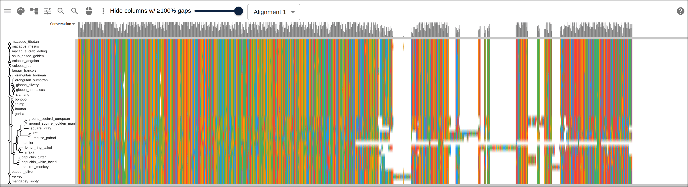
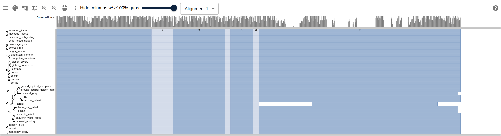
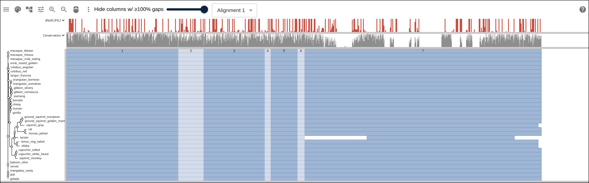
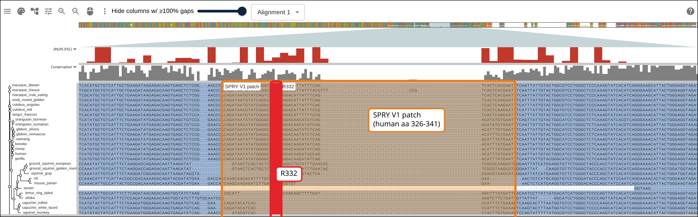
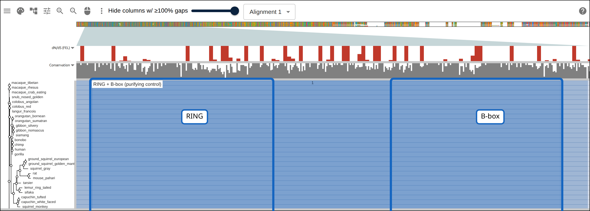
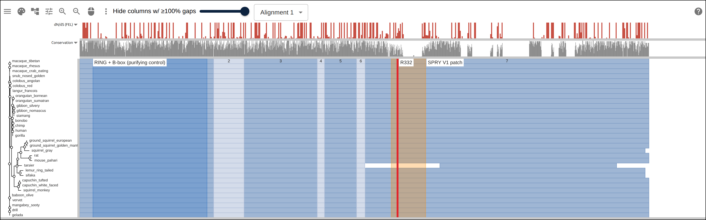

# TRIM5 and the primate antiviral arms race

_TRIM5_ is a restriction factor: a protein whose job is to recognize an
incoming retrovirus capsid and destroy it before the virus can establish an
infection. Every primate lineage carries a copy, and the copies disagree with
each other about which viruses to restrict. Human _TRIM5_ barely touches
HIV-1; rhesus macaque _TRIM5_ restricts it hard. A single substitution
(R332P) is enough to convert the human protein into an HIV-1 restrictor
(Stremlau et al. 2005; Yap et al. 2005), and the reason that one position
matters is that it sits in a patch of the protein that has been under
positive selection across the primates for tens of millions of years (Sawyer
et al. 2005): the pathogen changes its capsid, the restriction factor changes
its binding surface, and the arms race leaves a signature you can read
straight out of a codon alignment as an excess of amino-acid-changing
substitutions over silent ones.

This page builds that alignment for 32 _TRIM5_ orthologs, infers a tree, adds
the 7-exon gene structure and a per-codon dN/dS track from HyPhy, and ends on
a link that opens all of it together: the alignment, the tree, the exons, the
selection track and labels on the variable patch, on the single residue R332,
and on the RING/B-box zinc fingers as a built-in control that the same
analysis should call conserved.

## Prerequisites

- `curl`, `python3`
- `docker`, for MACSE, FastTree and HyPhy (each pulled from
  [biocontainers](https://biocontainers.pro) on first run)
- [NCBI Datasets command line tools](https://www.ncbi.nlm.nih.gov/datasets/docs/v2/download-and-install/)
- [react-msaview-cli](https://gmod.org/JBrowseMSA/cli),
  `npm install -g react-msaview-cli`, NodeJS v22+

## Where the data comes from

- _TRIM5_ orthologs for human Gene ID 85363, fetched with the NCBI Datasets
  CLI over the Datasets v2 API:
  https://api.ncbi.nlm.nih.gov/datasets/v2/gene/id/85363/download
- Domain boundaries on the canonical human _TRIM5_ protein (UniProtKB
  Q9C035), read from InterPro's precomputed matches: the RING and B-box zinc
  fingers from Pfam,
  https://www.ebi.ac.uk/interpro/api/entry/pfam/protein/uniprot/Q9C035/, and
  the full B30.2/SPRY domain from the wider PROSITE profile call,
  https://www.ebi.ac.uk/interpro/api/entry/profile/protein/uniprot/Q9C035/
  (Pfam's own SPRY entry stops short of the domain's N-terminal variable
  loops)

## 1. Every ortholog NCBI knows about

```bash
datasets download gene gene-id 85363 --ortholog all \
  --include gene,cds,protein --filename trim5_orthologs.zip
unzip -o trim5_orthologs.zip -d ortho
```

33 records: 28 primates and 5 rodents/squirrels (mouse relative _Mus
pahari_, rat, and three ground squirrels) as the outgroup. `cds.fna` in the
package carries every predicted transcript for every gene, not one row per
species, human alone has 21.

## 2. One coding sequence per species

Pick the curated (`NM_`) RefSeq transcript where the species has one; where
every transcript is a predicted (`XM_`) gene model, pick whichever is closest
in length to the well-annotated human isoform (1482 nt, 493 amino acids plus
the stop codon), since a gene with dozens of predicted splice variants has no
other principled way to choose "the" transcript to align:

```python
nm = [t for t in transcripts if t.accession.startswith('NM_')]
pool = nm if nm else transcripts
chosen = min(pool, key=lambda t: abs(len(t.seq) - 1482))
```

All 33 chosen sequences come out a multiple of 3. Translating each and
scanning for a stop codon before the last one catches a real problem
instead: the black snub-nosed monkey (_Rhinopithecus bieti_) has only one
transcript on file, `XM_017887309.1`, and it translates with two internal
stops, at codons 260 and 265. There is no second transcript for that species
to fall back on, so it is dropped, the same move as dropping pig from the
F12 alignment over a gappy region (`scripts/f12-cetacean`). 32 orthologs go
forward.

## 3. A codon-aware alignment

```bash
docker run --rm -v "$PWD":/data -w /data \
  quay.io/biocontainers/macse:2.07--hdfd78af_0 \
  macse -prog alignSequences -seq trim5_cds.fasta \
  -out_NT trim5_macse_NT.fasta -out_AA trim5_macse_AA.fasta
```

MACSE aligns in amino-acid space but writes back nucleotides, so every column
stays a whole codon: no aligner-introduced frameshift, ever. 1800 nucleotide
columns, 600 codons, in a few minutes for 32 sequences.

Every sequence's CDS includes its own stop codon, each landing in a different
alignment column once the gaps are in, so each row's own last codon needs
checking and blanking individually rather than trimming three columns off the
end of the whole alignment. All 32 pass the check clean: a real stop, once
each, nowhere else.

## 4. A tree

```bash
docker run --rm -v "$PWD":/data -w /data \
  quay.io/biocontainers/fasttree:2.2.0--h7b50bb2_1 \
  sh -c "FastTree trim5_macse_AA.fasta > trim5.nwk"
```

From the protein translation rather than the codons: more signal at this
depth of divergence. Read the support values before trusting the topology,
the same move as the neighbor-joining caveat in
[a protein family from a list of accessions](protein_family). The weakest
node in this tree has a local support of 0.135, the second-weakest 0.177,
both around the boundary between Old World monkey lineages, exactly where a
single gene's tree is expected to waver. Everything below only depends on
branch lengths, not on that part of the topology being right.

[](https://gmod.org/JBrowseMSA/demo/?data=%7B%22msaview%22%3A%7B%22type%22%3A%22MsaView%22%2C%22treeAreaWidth%22%3A170%2C%22rowHeight%22%3A11%2C%22colorSchemeName%22%3A%22nucleotide%22%2C%22msaFilehandle%22%3A%7B%22uri%22%3A%22data%2Ftrim5%2Ftrim5-cds.stock%22%7D%2C%22colWidth%22%3A0.7%2C%22height%22%3A420%7D%7D)

The 32-ortholog codon alignment with its tree, colored by nucleotide. Apes,
Old World monkeys, New World monkeys, a tarsier, two strepsirrhines and the
rodent/squirrel outgroup, all in one frame-correct alignment.

## 5. The exon structure

_TRIM5_'s MANE Select transcript, `NM_033034.3`, projected onto every row
from the human reference row, the same mechanism the F12 cetacean example
uses:

```bash
react-msaview-cli genestructure trim5_cds_aln.fasta \
  --gene-id 85363 --transcript NM_033034.3 --ref human \
  -o trim5-exons.gff
```

7 coding exons. Both zinc fingers this page uses as a control, RING and
B-box, project onto the gene's large first coding exon; the variable patch in
the SPRY domain sits in the last one.

[](https://gmod.org/JBrowseMSA/demo/?data=%7B%22msaview%22%3A%7B%22type%22%3A%22MsaView%22%2C%22treeAreaWidth%22%3A170%2C%22rowHeight%22%3A11%2C%22colorSchemeName%22%3A%22nucleotide%22%2C%22msaFilehandle%22%3A%7B%22uri%22%3A%22data%2Ftrim5%2Ftrim5-cds.stock%22%7D%2C%22colWidth%22%3A0.7%2C%22height%22%3A420%2C%22gffFilehandle%22%3A%7B%22uri%22%3A%22data%2Ftrim5%2Ftrim5-exons.gff%22%7D%7D%7D)

The same alignment with the 7-exon structure overlaid, one color per exon,
projected through every row's own gaps. Exon 7, the longest, carries the
whole SPRY domain.

## 6. Per-codon selection with HyPhy

[FEL](https://doi.org/10.1093/molbev/msi105) (Fixed Effects Likelihood) fits
a synonymous rate (alpha) and a non-synonymous rate (beta) at every codon and
tests beta against alpha with a likelihood ratio:

```bash
docker run --rm -v "$PWD":/data -w /data \
  quay.io/biocontainers/hyphy:2.5.101--h526e2cb_0 \
  hyphy fel --alignment trim5_fel_input.fasta --tree trim5.nwk \
  --output trim5_fel.json --branches All
```

HyPhy's own single ratio across the whole tree and every codon is 0.82: most
of _TRIM5_ is under mild purifying selection. FEL's per-site test (default
p<0.1, 32 taxa, all 600 codon columns, no subsampling needed, this ran in
about 3 minutes) calls 33 of 600 sites (5.5%) positively selected and 80
(13.3%) negatively selected. The strongest single positively selected site in
the whole gene is human residue 337 (alpha near zero, beta = 23.5, p =
0.0063), inside the variable patch this page is about to zoom into.

[MEME](https://doi.org/10.1371/journal.pgen.1002764) tests the same
alignment for episodic rather than pervasive selection, one branch at a time
per site:

```bash
docker run --rm -v "$PWD":/data -w /data \
  quay.io/biocontainers/hyphy:2.5.101--h526e2cb_0 \
  hyphy meme --alignment trim5_fel_input.fasta --tree trim5.nwk \
  --output trim5_meme.json --branches All
```

27 of 600 sites (p<0.05) show episodic diversifying selection, and 18 of
those 27 (two-thirds) fall inside the B30.2/SPRY domain. The second-strongest
MEME hit in the whole gene (p = 0.0022) is again human residue 337, agreeing
with FEL. The single strongest hit (p = 0.0011) is human residue 45, inside
the RING domain this page otherwise treats as a purifying control, one codon
out of RING's 45 with its own history worth a second look rather than
something the summary below smooths over.

The per-codon beta/alpha ratio is the number to draw as a track, but a site
with almost no synonymous substitutions at all makes alpha numerically close
to zero, and the ratio runs away: one site, human residue 371, comes back
with alpha = 5098 from an optimizer with nothing to anchor it. The values
below are clamped to 5 for exactly that reason, one nucleotide-column-wide
JSON array
(`packages/app/public/data/trim5/trim5-dnds-values.json`), repeated three
times per codon and passed as a `columnTracks` bar
(see [data layers](https://gmod.org/JBrowseMSA/layers)):

[](https://gmod.org/JBrowseMSA/demo/?data=%7B%22msaview%22%3A%7B%22type%22%3A%22MsaView%22%2C%22treeAreaWidth%22%3A170%2C%22rowHeight%22%3A11%2C%22colorSchemeName%22%3A%22nucleotide%22%2C%22msaFilehandle%22%3A%7B%22uri%22%3A%22data%2Ftrim5%2Ftrim5-cds.stock%22%7D%2C%22colWidth%22%3A0.7%2C%22height%22%3A480%2C%22gffFilehandle%22%3A%7B%22uri%22%3A%22data%2Ftrim5%2Ftrim5-exons.gff%22%7D%2C%22columnTracks%22%3A%5B%7B%22id%22%3A%22dnds%22%2C%22name%22%3A%22dN%2FdS%20(FEL)%22%2C%22kind%22%3A%22bar%22%2C%22values%22%3A%5B0%2C0%2C0%2C0%2C0%2C0%2C0.117%2C0.117%2C0.117%2C5%2C5%2C5%2C5%2C5%2C5%2C5%2C5%2C5%2C3.57%2C3.57%2C3.57%2C5%2C5%2C5%2C5%2C5%2C5%2C0%2C0%2C0%2C0%2C0%2C0%2C5%2C5%2C5%2C0%2C0%2C0%2C0%2C0%2C0%2C0%2C0%2C0%2C0%2C0%2C0%2C0%2C0%2C0%2C0%2C0%2C0%2C0%2C0%2C0%2C5%2C5%2C5%2C0.001%2C0.001%2C0.001%2C0.779%2C0.779%2C0.779%2C2.016%2C2.016%2C2.016%2C0.73%2C0.73%2C0.73%2C0%2C0%2C0%2C0.599%2C0.599%2C0.599%2C0%2C0%2C0%2C1.225%2C1.225%2C1.225%2C0.951%2C0.951%2C0.951%2C0%2C0%2C0%2C0%2C0%2C0%2C0%2C0%2C0%2C0%2C0%2C0%2C0%2C0%2C0%2C0%2C0%2C0%2C0%2C0%2C0%2C0.145%2C0.145%2C0.145%2C0%2C0%2C0%2C5%2C5%2C5%2C0%2C0%2C0%2C0.438%2C0.438%2C0.438%2C0%2C0%2C0%2C0.262%2C0.262%2C0.262%2C0.3%2C0.3%2C0.3%2C5%2C5%2C5%2C1.074%2C1.074%2C1.074%2C0.332%2C0.332%2C0.332%2C5%2C5%2C5%2C5%2C5%2C5%2C1.644%2C1.644%2C1.644%2C0%2C0%2C0%2C1.354%2C1.354%2C1.354%2C0.497%2C0.497%2C0.497%2C5%2C5%2C5%2C0.408%2C0.408%2C0.408%2C0%2C0%2C0%2C0%2C0%2C0%2C5%2C5%2C5%2C0%2C0%2C0%2C0%2C0%2C0%2C1.27%2C1.27%2C1.27%2C0.918%2C0.918%2C0.918%2C0%2C0%2C0%2C5%2C5%2C5%2C1.919%2C1.919%2C1.919%2C1.339%2C1.339%2C1.339%2C0.164%2C0.164%2C0.164%2C5%2C5%2C5%2C0.567%2C0.567%2C0.567%2C0%2C0%2C0%2C0%2C0%2C0%2C0%2C0%2C0%2C5%2C5%2C5%2C0.337%2C0.337%2C0.337%2C1.065%2C1.065%2C1.065%2C5%2C5%2C5%2C0.166%2C0.166%2C0.166%2C0%2C0%2C0%2C5%2C5%2C5%2C5%2C5%2C5%2C0.564%2C0.564%2C0.564%2C0.632%2C0.632%2C0.632%2C2.655%2C2.655%2C2.655%2C5%2C5%2C5%2C1%2C1%2C1%2C0.261%2C0.261%2C0.261%2C5%2C5%2C5%2C5%2C5%2C5%2C0%2C0%2C0%2C0.472%2C0.472%2C0.472%2C0.93%2C0.93%2C0.93%2C5%2C5%2C5%2C0.228%2C0.228%2C0.228%2C0.269%2C0.269%2C0.269%2C5%2C5%2C5%2C0.29%2C0.29%2C0.29%2C0%2C0%2C0%2C0%2C0%2C0%2C5%2C5%2C5%2C0%2C0%2C0%2C0%2C0%2C0%2C0%2C0%2C0%2C0%2C0%2C0%2C0%2C0%2C0%2C1.163%2C1.163%2C1.163%2C0.001%2C0.001%2C0.001%2C0%2C0%2C0%2C0%2C0%2C0%2C1.3%2C1.3%2C1.3%2C0.34%2C0.34%2C0.34%2C0%2C0%2C0%2C2.204%2C2.204%2C2.204%2C5%2C5%2C5%2C5%2C5%2C5%2C0%2C0%2C0%2C0%2C0%2C0%2C0%2C0%2C0%2C0%2C0%2C0%2C0%2C0%2C0%2C0%2C0%2C0%2C0%2C0%2C0%2C5%2C5%2C5%2C0%2C0%2C0%2C0%2C0%2C0%2C0%2C0%2C0%2C0.367%2C0.367%2C0.367%2C0.296%2C0.296%2C0.296%2C0%2C0%2C0%2C5%2C5%2C5%2C0%2C0%2C0%2C0.869%2C0.869%2C0.869%2C0.001%2C0.001%2C0.001%2C1.221%2C1.221%2C1.221%2C0%2C0%2C0%2C0.152%2C0.152%2C0.152%2C0%2C0%2C0%2C0.501%2C0.501%2C0.501%2C5%2C5%2C5%2C1.022%2C1.022%2C1.022%2C0.271%2C0.271%2C0.271%2C0.207%2C0.207%2C0.207%2C1.145%2C1.145%2C1.145%2C5%2C5%2C5%2C0.281%2C0.281%2C0.281%2C5%2C5%2C5%2C3.361%2C3.361%2C3.361%2C5%2C5%2C5%2C0%2C0%2C0%2C1.336%2C1.336%2C1.336%2C0.202%2C0.202%2C0.202%2C2.44%2C2.44%2C2.44%2C5%2C5%2C5%2C2.293%2C2.293%2C2.293%2C1.196%2C1.196%2C1.196%2C0.545%2C0.545%2C0.545%2C0.631%2C0.631%2C0.631%2C5%2C5%2C5%2C0.748%2C0.748%2C0.748%2C0.55%2C0.55%2C0.55%2C5%2C5%2C5%2C0.833%2C0.833%2C0.833%2C5%2C5%2C5%2C5%2C5%2C5%2C0.097%2C0.097%2C0.097%2C0.407%2C0.407%2C0.407%2C0.975%2C0.975%2C0.975%2C0.842%2C0.842%2C0.842%2C0.194%2C0.194%2C0.194%2C1.143%2C1.143%2C1.143%2C5%2C5%2C5%2C1.069%2C1.069%2C1.069%2C0%2C0%2C0%2C5%2C5%2C5%2C0.442%2C0.442%2C0.442%2C5%2C5%2C5%2C0%2C0%2C0%2C0.488%2C0.488%2C0.488%2C0.395%2C0.395%2C0.395%2C0.539%2C0.539%2C0.539%2C0.717%2C0.717%2C0.717%2C5%2C5%2C5%2C0.071%2C0.071%2C0.071%2C0.748%2C0.748%2C0.748%2C0.503%2C0.503%2C0.503%2C5%2C5%2C5%2C5%2C5%2C5%2C5%2C5%2C5%2C1.424%2C1.424%2C1.424%2C5%2C5%2C5%2C5%2C5%2C5%2C0%2C0%2C0%2C0.247%2C0.247%2C0.247%2C0%2C0%2C0%2C0.215%2C0.215%2C0.215%2C1.659%2C1.659%2C1.659%2C2.023%2C2.023%2C2.023%2C5%2C5%2C5%2C0%2C0%2C0%2C1.032%2C1.032%2C1.032%2C0.253%2C0.253%2C0.253%2C0%2C0%2C0%2C0.244%2C0.244%2C0.244%2C0.162%2C0.162%2C0.162%2C5%2C5%2C5%2C0%2C0%2C0%2C5%2C5%2C5%2C0.557%2C0.557%2C0.557%2C0%2C0%2C0%2C0.801%2C0.801%2C0.801%2C5%2C5%2C5%2C0.313%2C0.313%2C0.313%2C5%2C5%2C5%2C0.936%2C0.936%2C0.936%2C0.306%2C0.306%2C0.306%2C0.215%2C0.215%2C0.215%2C0.836%2C0.836%2C0.836%2C1.341%2C1.341%2C1.341%2C1.264%2C1.264%2C1.264%2C0%2C0%2C0%2C0%2C0%2C0%2C0.74%2C0.74%2C0.74%2C0.364%2C0.364%2C0.364%2C1.294%2C1.294%2C1.294%2C0.843%2C0.843%2C0.843%2C0.716%2C0.716%2C0.716%2C5%2C5%2C5%2C0.244%2C0.244%2C0.244%2C0.312%2C0.312%2C0.312%2C0.731%2C0.731%2C0.731%2C4.833%2C4.833%2C4.833%2C5%2C5%2C5%2C1.184%2C1.184%2C1.184%2C5%2C5%2C5%2C5%2C5%2C5%2C5%2C5%2C5%2C0.032%2C0.032%2C0.032%2C5%2C5%2C5%2C0.12%2C0.12%2C0.12%2C5%2C5%2C5%2C0.541%2C0.541%2C0.541%2C0%2C0%2C0%2C0.251%2C0.251%2C0.251%2C5%2C5%2C5%2C5%2C5%2C5%2C0.715%2C0.715%2C0.715%2C0.168%2C0.168%2C0.168%2C1.21%2C1.21%2C1.21%2C0.235%2C0.235%2C0.235%2C0%2C0%2C0%2C0%2C0%2C0%2C1.252%2C1.252%2C1.252%2C0.822%2C0.822%2C0.822%2C0.728%2C0.728%2C0.728%2C0.816%2C0.816%2C0.816%2C5%2C5%2C5%2C0.292%2C0.292%2C0.292%2C5%2C5%2C5%2C0%2C0%2C0%2C5%2C5%2C5%2C5%2C5%2C5%2C1.585%2C1.585%2C1.585%2C1.031%2C1.031%2C1.031%2C1.122%2C1.122%2C1.122%2C0.686%2C0.686%2C0.686%2C5%2C5%2C5%2C0.251%2C0.251%2C0.251%2C0%2C0%2C0%2C5%2C5%2C5%2C0.36%2C0.36%2C0.36%2C0.067%2C0.067%2C0.067%2C0.264%2C0.264%2C0.264%2C0.895%2C0.895%2C0.895%2C0.883%2C0.883%2C0.883%2C5%2C5%2C5%2C0%2C0%2C0%2C5%2C5%2C5%2C0.213%2C0.213%2C0.213%2C0%2C0%2C0%2C5%2C5%2C5%2C0%2C0%2C0%2C0.165%2C0.165%2C0.165%2C5%2C5%2C5%2C0%2C0%2C0%2C0.935%2C0.935%2C0.935%2C0.694%2C0.694%2C0.694%2C5%2C5%2C5%2C0%2C0%2C0%2C0.948%2C0.948%2C0.948%2C5%2C5%2C5%2C5%2C5%2C5%2C5%2C5%2C5%2C0%2C0%2C0%2C0.467%2C0.467%2C0.467%2C5%2C5%2C5%2C5%2C5%2C5%2C0.498%2C0.498%2C0.498%2C1.584%2C1.584%2C1.584%2C5%2C5%2C5%2C0%2C0%2C0%2C5%2C5%2C5%2C5%2C5%2C5%2C0.433%2C0.433%2C0.433%2C5%2C5%2C5%2C0.278%2C0.278%2C0.278%2C0.999%2C0.999%2C0.999%2C5%2C5%2C5%2C5%2C5%2C5%2C0.39%2C0.39%2C0.39%2C5%2C5%2C5%2C5%2C5%2C5%2C0.595%2C0.595%2C0.595%2C1.009%2C1.009%2C1.009%2C5%2C5%2C5%2C5%2C5%2C5%2C0%2C0%2C0%2C0.758%2C0.758%2C0.758%2C1.753%2C1.753%2C1.753%2C0%2C0%2C0%2C2.709%2C2.709%2C2.709%2C0%2C0%2C0%2C0.333%2C0.333%2C0.333%2C1.087%2C1.087%2C1.087%2C1.993%2C1.993%2C1.993%2C2.012%2C2.012%2C2.012%2C1.72%2C1.72%2C1.72%2C0%2C0%2C0%2C5%2C5%2C5%2C0.066%2C0.066%2C0.066%2C0.177%2C0.177%2C0.177%2C0.716%2C0.716%2C0.716%2C5%2C5%2C5%2C0.304%2C0.304%2C0.304%2C5%2C5%2C5%2C1.223%2C1.223%2C1.223%2C2.148%2C2.148%2C2.148%2C3.426%2C3.426%2C3.426%2C2.677%2C2.677%2C2.677%2C4.651%2C4.651%2C4.651%2C0.232%2C0.232%2C0.232%2C5%2C5%2C5%2C1.788%2C1.788%2C1.788%2C0%2C0%2C0%2C0%2C0%2C0%2C0%2C0%2C0%2C0%2C0%2C0%2C0%2C0%2C0%2C0%2C0%2C0%2C0%2C0%2C0%2C0%2C0%2C0%2C0%2C0%2C0%2C0%2C0%2C0%2C0%2C0%2C0%2C0%2C0%2C0%2C0%2C0%2C0%2C0%2C0%2C0%2C0%2C0%2C0%2C0%2C0%2C0%2C0%2C0%2C0%2C0%2C0%2C0%2C0%2C0%2C0%2C4.747%2C4.747%2C4.747%2C1.127%2C1.127%2C1.127%2C5%2C5%2C5%2C5%2C5%2C5%2C1.527%2C1.527%2C1.527%2C1.464%2C1.464%2C1.464%2C1.441%2C1.441%2C1.441%2C5%2C5%2C5%2C2.726%2C2.726%2C2.726%2C0.113%2C0.113%2C0.113%2C1.172%2C1.172%2C1.172%2C5%2C5%2C5%2C0%2C0%2C0%2C0.431%2C0.431%2C0.431%2C5%2C5%2C5%2C1.365%2C1.365%2C1.365%2C0%2C0%2C0%2C0.994%2C0.994%2C0.994%2C0%2C0%2C0%2C0%2C0%2C0%2C0%2C0%2C0%2C0%2C0%2C0%2C0%2C0%2C0%2C0%2C0%2C0%2C0.505%2C0.505%2C0.505%2C0%2C0%2C0%2C0.079%2C0.079%2C0.079%2C0.004%2C0.004%2C0.004%2C0.508%2C0.508%2C0.508%2C0.447%2C0.447%2C0.447%2C0%2C0%2C0%2C5%2C5%2C5%2C0.749%2C0.749%2C0.749%2C0%2C0%2C0%2C0.919%2C0.919%2C0.919%2C5%2C5%2C5%2C0%2C0%2C0%2C0.739%2C0.739%2C0.739%2C5%2C5%2C5%2C5%2C5%2C5%2C2.732%2C2.732%2C2.732%2C0.295%2C0.295%2C0.295%2C1.218%2C1.218%2C1.218%2C0%2C0%2C0%2C0%2C0%2C0%2C0%2C0%2C0%2C0%2C0%2C0%2C0%2C0%2C0%2C2.101%2C2.101%2C2.101%2C5%2C5%2C5%2C0.532%2C0.532%2C0.532%2C5%2C5%2C5%2C0.75%2C0.75%2C0.75%2C0%2C0%2C0%2C0%2C0%2C0%2C5%2C5%2C5%2C5%2C5%2C5%2C0%2C0%2C0%2C0%2C0%2C0%2C0%2C0%2C0%2C0%2C0%2C0%2C0%2C0%2C0%2C0%2C0%2C0%2C0%2C0%2C0%2C0%2C0%2C0%2C0%2C0%2C0%2C0%2C0%2C0%2C0%2C0%2C0%2C0%2C0%2C0%2C0%2C0%2C0%2C0%2C0%2C0%2C0%2C0%2C0%2C1.814%2C1.814%2C1.814%2C5%2C5%2C5%2C0.941%2C0.941%2C0.941%2C0%2C0%2C0%2C0%2C0%2C0%2C0%2C0%2C0%2C0%2C0%2C0%2C3.964%2C3.964%2C3.964%2C5%2C5%2C5%2C0%2C0%2C0%2C1.949%2C1.949%2C1.949%2C0.994%2C0.994%2C0.994%2C5%2C5%2C5%2C0%2C0%2C0%2C0%2C0%2C0%2C0%2C0%2C0%2C0%2C0%2C0%2C0%2C0%2C0%2C0%2C0%2C0%2C0%2C0%2C0%2C0%2C0%2C0%2C0%2C0%2C0%2C0%2C0%2C0%2C0%2C0%2C0%2C0%2C0%2C0%2C0%2C0%2C0%2C0%2C0%2C0%2C0%2C0%2C0%2C0%2C0%2C0%2C0%2C0%2C0%2C0%2C0%2C0%2C0%2C0%2C0%2C0%2C0%2C0%2C0%2C0%2C0%2C0%2C0%2C0%2C0%2C0%2C0%2C0%2C0%2C0%2C0%2C0%2C0%2C0%2C0%2C0%2C0%2C0%2C0%2C0%2C0%2C0%2C0.398%2C0.398%2C0.398%2C0%2C0%2C0%2C0%2C0%2C0%2C0%2C0%2C0%2C5%2C5%2C5%2C0.818%2C0.818%2C0.818%2C0%2C0%2C0%2C0.102%2C0.102%2C0.102%2C0%2C0%2C0%2C0%2C0%2C0%2C0%2C0%2C0%2C0%2C0%2C0%2C0%2C0%2C0%2C0.975%2C0.975%2C0.975%2C0.263%2C0.263%2C0.263%2C1.545%2C1.545%2C1.545%2C0.415%2C0.415%2C0.415%2C0%2C0%2C0%2C5%2C5%2C5%2C5%2C5%2C5%2C5%2C5%2C5%2C0%2C0%2C0%2C0%2C0%2C0%2C5%2C5%2C5%2C5%2C5%2C5%2C5%2C5%2C5%2C0%2C0%2C0%2C0%2C0%2C0%2C0%2C0%2C0%2C0%2C0%2C0%2C0%2C0%2C0%2C1.353%2C1.353%2C1.353%2C1.191%2C1.191%2C1.191%2C0.262%2C0.262%2C0.262%2C5%2C5%2C5%2C5%2C5%2C5%2C0%2C0%2C0%2C5%2C5%2C5%2C0.511%2C0.511%2C0.511%2C0%2C0%2C0%2C0.276%2C0.276%2C0.276%2C1.452%2C1.452%2C1.452%2C0%2C0%2C0%2C0%2C0%2C0%2C0%2C0%2C0%2C0%2C0%2C0%2C0%2C0%2C0%2C5%2C5%2C5%2C5%2C5%2C5%2C0.734%2C0.734%2C0.734%2C2.025%2C2.025%2C2.025%2C0.803%2C0.803%2C0.803%2C5%2C5%2C5%2C5%2C5%2C5%2C2.283%2C2.283%2C2.283%2C5%2C5%2C5%2C0%2C0%2C0%2C5%2C5%2C5%2C0.171%2C0.171%2C0.171%2C5%2C5%2C5%2C5%2C5%2C5%2C0%2C0%2C0%2C0.361%2C0.361%2C0.361%2C0.797%2C0.797%2C0.797%2C0.855%2C0.855%2C0.855%2C0.438%2C0.438%2C0.438%2C0.231%2C0.231%2C0.231%2C0%2C0%2C0%2C5%2C5%2C5%2C1.061%2C1.061%2C1.061%2C0.38%2C0.38%2C0.38%2C0%2C0%2C0%2C5%2C5%2C5%2C0%2C0%2C0%2C0.599%2C0.599%2C0.599%2C0%2C0%2C0%2C5%2C5%2C5%2C0.265%2C0.265%2C0.265%2C0%2C0%2C0%2C0.609%2C0.609%2C0.609%2C0.187%2C0.187%2C0.187%2C0.839%2C0.839%2C0.839%2C0%2C0%2C0%2C0%2C0%2C0%2C5%2C5%2C5%2C0%2C0%2C0%2C0.42%2C0.42%2C0.42%2C0.512%2C0.512%2C0.512%2C0.405%2C0.405%2C0.405%2C0.396%2C0.396%2C0.396%2C0.061%2C0.061%2C0.061%2C5%2C5%2C5%2C0%2C0%2C0%2C0%2C0%2C0%2C0%2C0%2C0%2C0.071%2C0.071%2C0.071%2C0%2C0%2C0%2C0.354%2C0.354%2C0.354%2C5%2C5%2C5%2C5%2C5%2C5%2C3.431%2C3.431%2C3.431%2C0%2C0%2C0%2C5%2C5%2C5%2C5%2C5%2C5%2C0.909%2C0.909%2C0.909%2C0%2C0%2C0%2C5%2C5%2C5%2C0%2C0%2C0%2C0%2C0%2C0%2C0.669%2C0.669%2C0.669%2C0.16%2C0.16%2C0.16%2C0.183%2C0.183%2C0.183%2C5%2C5%2C5%2C1.503%2C1.503%2C1.503%2C5%2C5%2C5%2C5%2C5%2C5%2C5%2C5%2C5%2C0.455%2C0.455%2C0.455%2C5%2C5%2C5%2C0.388%2C0.388%2C0.388%2C0.295%2C0.295%2C0.295%2C5%2C5%2C5%2C0.325%2C0.325%2C0.325%2C0%2C0%2C0%2C5%2C5%2C5%2C0%2C0%2C0%2C0%2C0%2C0%5D%2C%22max%22%3A5%2C%22color%22%3A%22%23c0392b%22%7D%5D%7D%7D)

Red bars are FEL's per-codon dN/dS, clamped at 5, above the exon-colored
alignment. The spikes cluster toward the SPRY-domain half on the right and
thin out over the first three exons on the left, which the next two figures
zoom into directly.

## 7. The SPRY variable patch

Sawyer et al. (2005) found a small patch of the SPRY domain carrying most of
the gene's positively selected sites, overlapping the "variable region 1"
(V1) loop later work narrowed the HIV-1 restriction specificity down to
(Stremlau et al. 2005; Yap et al. 2005; Ohkura et al. 2006), human residues
326-341. R332 sits in the middle of it, and R332P alone is the substitution
that converts human _TRIM5_ into an HIV-1 restrictor:

```json
"highlights": [
  { "row": "human", "start": 976, "end": 1023, "label": "SPRY V1 patch" },
  { "row": "human", "start": 994, "end": 996, "label": "R332" }
]
```

(`start`/`end` are the human row's own nucleotide positions: residue 326 is
nucleotide 976, `(326-1)*3+1`, and R332 is nucleotides 994-996.)

[](https://gmod.org/JBrowseMSA/demo/?data=%7B%22msaview%22%3A%7B%22type%22%3A%22MsaView%22%2C%22treeAreaWidth%22%3A170%2C%22rowHeight%22%3A11%2C%22colorSchemeName%22%3A%22nucleotide%22%2C%22msaFilehandle%22%3A%7B%22uri%22%3A%22data%2Ftrim5%2Ftrim5-cds.stock%22%7D%2C%22colWidth%22%3A6%2C%22height%22%3A480%2C%22gffFilehandle%22%3A%7B%22uri%22%3A%22data%2Ftrim5%2Ftrim5-exons.gff%22%7D%2C%22columnTracks%22%3A%5B%7B%22id%22%3A%22dnds%22%2C%22name%22%3A%22dN%2FdS%20(FEL)%22%2C%22kind%22%3A%22bar%22%2C%22values%22%3A%5B0%2C0%2C0%2C0%2C0%2C0%2C0.117%2C0.117%2C0.117%2C5%2C5%2C5%2C5%2C5%2C5%2C5%2C5%2C5%2C3.57%2C3.57%2C3.57%2C5%2C5%2C5%2C5%2C5%2C5%2C0%2C0%2C0%2C0%2C0%2C0%2C5%2C5%2C5%2C0%2C0%2C0%2C0%2C0%2C0%2C0%2C0%2C0%2C0%2C0%2C0%2C0%2C0%2C0%2C0%2C0%2C0%2C0%2C0%2C0%2C5%2C5%2C5%2C0.001%2C0.001%2C0.001%2C0.779%2C0.779%2C0.779%2C2.016%2C2.016%2C2.016%2C0.73%2C0.73%2C0.73%2C0%2C0%2C0%2C0.599%2C0.599%2C0.599%2C0%2C0%2C0%2C1.225%2C1.225%2C1.225%2C0.951%2C0.951%2C0.951%2C0%2C0%2C0%2C0%2C0%2C0%2C0%2C0%2C0%2C0%2C0%2C0%2C0%2C0%2C0%2C0%2C0%2C0%2C0%2C0%2C0%2C0.145%2C0.145%2C0.145%2C0%2C0%2C0%2C5%2C5%2C5%2C0%2C0%2C0%2C0.438%2C0.438%2C0.438%2C0%2C0%2C0%2C0.262%2C0.262%2C0.262%2C0.3%2C0.3%2C0.3%2C5%2C5%2C5%2C1.074%2C1.074%2C1.074%2C0.332%2C0.332%2C0.332%2C5%2C5%2C5%2C5%2C5%2C5%2C1.644%2C1.644%2C1.644%2C0%2C0%2C0%2C1.354%2C1.354%2C1.354%2C0.497%2C0.497%2C0.497%2C5%2C5%2C5%2C0.408%2C0.408%2C0.408%2C0%2C0%2C0%2C0%2C0%2C0%2C5%2C5%2C5%2C0%2C0%2C0%2C0%2C0%2C0%2C1.27%2C1.27%2C1.27%2C0.918%2C0.918%2C0.918%2C0%2C0%2C0%2C5%2C5%2C5%2C1.919%2C1.919%2C1.919%2C1.339%2C1.339%2C1.339%2C0.164%2C0.164%2C0.164%2C5%2C5%2C5%2C0.567%2C0.567%2C0.567%2C0%2C0%2C0%2C0%2C0%2C0%2C0%2C0%2C0%2C5%2C5%2C5%2C0.337%2C0.337%2C0.337%2C1.065%2C1.065%2C1.065%2C5%2C5%2C5%2C0.166%2C0.166%2C0.166%2C0%2C0%2C0%2C5%2C5%2C5%2C5%2C5%2C5%2C0.564%2C0.564%2C0.564%2C0.632%2C0.632%2C0.632%2C2.655%2C2.655%2C2.655%2C5%2C5%2C5%2C1%2C1%2C1%2C0.261%2C0.261%2C0.261%2C5%2C5%2C5%2C5%2C5%2C5%2C0%2C0%2C0%2C0.472%2C0.472%2C0.472%2C0.93%2C0.93%2C0.93%2C5%2C5%2C5%2C0.228%2C0.228%2C0.228%2C0.269%2C0.269%2C0.269%2C5%2C5%2C5%2C0.29%2C0.29%2C0.29%2C0%2C0%2C0%2C0%2C0%2C0%2C5%2C5%2C5%2C0%2C0%2C0%2C0%2C0%2C0%2C0%2C0%2C0%2C0%2C0%2C0%2C0%2C0%2C0%2C1.163%2C1.163%2C1.163%2C0.001%2C0.001%2C0.001%2C0%2C0%2C0%2C0%2C0%2C0%2C1.3%2C1.3%2C1.3%2C0.34%2C0.34%2C0.34%2C0%2C0%2C0%2C2.204%2C2.204%2C2.204%2C5%2C5%2C5%2C5%2C5%2C5%2C0%2C0%2C0%2C0%2C0%2C0%2C0%2C0%2C0%2C0%2C0%2C0%2C0%2C0%2C0%2C0%2C0%2C0%2C0%2C0%2C0%2C5%2C5%2C5%2C0%2C0%2C0%2C0%2C0%2C0%2C0%2C0%2C0%2C0.367%2C0.367%2C0.367%2C0.296%2C0.296%2C0.296%2C0%2C0%2C0%2C5%2C5%2C5%2C0%2C0%2C0%2C0.869%2C0.869%2C0.869%2C0.001%2C0.001%2C0.001%2C1.221%2C1.221%2C1.221%2C0%2C0%2C0%2C0.152%2C0.152%2C0.152%2C0%2C0%2C0%2C0.501%2C0.501%2C0.501%2C5%2C5%2C5%2C1.022%2C1.022%2C1.022%2C0.271%2C0.271%2C0.271%2C0.207%2C0.207%2C0.207%2C1.145%2C1.145%2C1.145%2C5%2C5%2C5%2C0.281%2C0.281%2C0.281%2C5%2C5%2C5%2C3.361%2C3.361%2C3.361%2C5%2C5%2C5%2C0%2C0%2C0%2C1.336%2C1.336%2C1.336%2C0.202%2C0.202%2C0.202%2C2.44%2C2.44%2C2.44%2C5%2C5%2C5%2C2.293%2C2.293%2C2.293%2C1.196%2C1.196%2C1.196%2C0.545%2C0.545%2C0.545%2C0.631%2C0.631%2C0.631%2C5%2C5%2C5%2C0.748%2C0.748%2C0.748%2C0.55%2C0.55%2C0.55%2C5%2C5%2C5%2C0.833%2C0.833%2C0.833%2C5%2C5%2C5%2C5%2C5%2C5%2C0.097%2C0.097%2C0.097%2C0.407%2C0.407%2C0.407%2C0.975%2C0.975%2C0.975%2C0.842%2C0.842%2C0.842%2C0.194%2C0.194%2C0.194%2C1.143%2C1.143%2C1.143%2C5%2C5%2C5%2C1.069%2C1.069%2C1.069%2C0%2C0%2C0%2C5%2C5%2C5%2C0.442%2C0.442%2C0.442%2C5%2C5%2C5%2C0%2C0%2C0%2C0.488%2C0.488%2C0.488%2C0.395%2C0.395%2C0.395%2C0.539%2C0.539%2C0.539%2C0.717%2C0.717%2C0.717%2C5%2C5%2C5%2C0.071%2C0.071%2C0.071%2C0.748%2C0.748%2C0.748%2C0.503%2C0.503%2C0.503%2C5%2C5%2C5%2C5%2C5%2C5%2C5%2C5%2C5%2C1.424%2C1.424%2C1.424%2C5%2C5%2C5%2C5%2C5%2C5%2C0%2C0%2C0%2C0.247%2C0.247%2C0.247%2C0%2C0%2C0%2C0.215%2C0.215%2C0.215%2C1.659%2C1.659%2C1.659%2C2.023%2C2.023%2C2.023%2C5%2C5%2C5%2C0%2C0%2C0%2C1.032%2C1.032%2C1.032%2C0.253%2C0.253%2C0.253%2C0%2C0%2C0%2C0.244%2C0.244%2C0.244%2C0.162%2C0.162%2C0.162%2C5%2C5%2C5%2C0%2C0%2C0%2C5%2C5%2C5%2C0.557%2C0.557%2C0.557%2C0%2C0%2C0%2C0.801%2C0.801%2C0.801%2C5%2C5%2C5%2C0.313%2C0.313%2C0.313%2C5%2C5%2C5%2C0.936%2C0.936%2C0.936%2C0.306%2C0.306%2C0.306%2C0.215%2C0.215%2C0.215%2C0.836%2C0.836%2C0.836%2C1.341%2C1.341%2C1.341%2C1.264%2C1.264%2C1.264%2C0%2C0%2C0%2C0%2C0%2C0%2C0.74%2C0.74%2C0.74%2C0.364%2C0.364%2C0.364%2C1.294%2C1.294%2C1.294%2C0.843%2C0.843%2C0.843%2C0.716%2C0.716%2C0.716%2C5%2C5%2C5%2C0.244%2C0.244%2C0.244%2C0.312%2C0.312%2C0.312%2C0.731%2C0.731%2C0.731%2C4.833%2C4.833%2C4.833%2C5%2C5%2C5%2C1.184%2C1.184%2C1.184%2C5%2C5%2C5%2C5%2C5%2C5%2C5%2C5%2C5%2C0.032%2C0.032%2C0.032%2C5%2C5%2C5%2C0.12%2C0.12%2C0.12%2C5%2C5%2C5%2C0.541%2C0.541%2C0.541%2C0%2C0%2C0%2C0.251%2C0.251%2C0.251%2C5%2C5%2C5%2C5%2C5%2C5%2C0.715%2C0.715%2C0.715%2C0.168%2C0.168%2C0.168%2C1.21%2C1.21%2C1.21%2C0.235%2C0.235%2C0.235%2C0%2C0%2C0%2C0%2C0%2C0%2C1.252%2C1.252%2C1.252%2C0.822%2C0.822%2C0.822%2C0.728%2C0.728%2C0.728%2C0.816%2C0.816%2C0.816%2C5%2C5%2C5%2C0.292%2C0.292%2C0.292%2C5%2C5%2C5%2C0%2C0%2C0%2C5%2C5%2C5%2C5%2C5%2C5%2C1.585%2C1.585%2C1.585%2C1.031%2C1.031%2C1.031%2C1.122%2C1.122%2C1.122%2C0.686%2C0.686%2C0.686%2C5%2C5%2C5%2C0.251%2C0.251%2C0.251%2C0%2C0%2C0%2C5%2C5%2C5%2C0.36%2C0.36%2C0.36%2C0.067%2C0.067%2C0.067%2C0.264%2C0.264%2C0.264%2C0.895%2C0.895%2C0.895%2C0.883%2C0.883%2C0.883%2C5%2C5%2C5%2C0%2C0%2C0%2C5%2C5%2C5%2C0.213%2C0.213%2C0.213%2C0%2C0%2C0%2C5%2C5%2C5%2C0%2C0%2C0%2C0.165%2C0.165%2C0.165%2C5%2C5%2C5%2C0%2C0%2C0%2C0.935%2C0.935%2C0.935%2C0.694%2C0.694%2C0.694%2C5%2C5%2C5%2C0%2C0%2C0%2C0.948%2C0.948%2C0.948%2C5%2C5%2C5%2C5%2C5%2C5%2C5%2C5%2C5%2C0%2C0%2C0%2C0.467%2C0.467%2C0.467%2C5%2C5%2C5%2C5%2C5%2C5%2C0.498%2C0.498%2C0.498%2C1.584%2C1.584%2C1.584%2C5%2C5%2C5%2C0%2C0%2C0%2C5%2C5%2C5%2C5%2C5%2C5%2C0.433%2C0.433%2C0.433%2C5%2C5%2C5%2C0.278%2C0.278%2C0.278%2C0.999%2C0.999%2C0.999%2C5%2C5%2C5%2C5%2C5%2C5%2C0.39%2C0.39%2C0.39%2C5%2C5%2C5%2C5%2C5%2C5%2C0.595%2C0.595%2C0.595%2C1.009%2C1.009%2C1.009%2C5%2C5%2C5%2C5%2C5%2C5%2C0%2C0%2C0%2C0.758%2C0.758%2C0.758%2C1.753%2C1.753%2C1.753%2C0%2C0%2C0%2C2.709%2C2.709%2C2.709%2C0%2C0%2C0%2C0.333%2C0.333%2C0.333%2C1.087%2C1.087%2C1.087%2C1.993%2C1.993%2C1.993%2C2.012%2C2.012%2C2.012%2C1.72%2C1.72%2C1.72%2C0%2C0%2C0%2C5%2C5%2C5%2C0.066%2C0.066%2C0.066%2C0.177%2C0.177%2C0.177%2C0.716%2C0.716%2C0.716%2C5%2C5%2C5%2C0.304%2C0.304%2C0.304%2C5%2C5%2C5%2C1.223%2C1.223%2C1.223%2C2.148%2C2.148%2C2.148%2C3.426%2C3.426%2C3.426%2C2.677%2C2.677%2C2.677%2C4.651%2C4.651%2C4.651%2C0.232%2C0.232%2C0.232%2C5%2C5%2C5%2C1.788%2C1.788%2C1.788%2C0%2C0%2C0%2C0%2C0%2C0%2C0%2C0%2C0%2C0%2C0%2C0%2C0%2C0%2C0%2C0%2C0%2C0%2C0%2C0%2C0%2C0%2C0%2C0%2C0%2C0%2C0%2C0%2C0%2C0%2C0%2C0%2C0%2C0%2C0%2C0%2C0%2C0%2C0%2C0%2C0%2C0%2C0%2C0%2C0%2C0%2C0%2C0%2C0%2C0%2C0%2C0%2C0%2C0%2C0%2C0%2C0%2C4.747%2C4.747%2C4.747%2C1.127%2C1.127%2C1.127%2C5%2C5%2C5%2C5%2C5%2C5%2C1.527%2C1.527%2C1.527%2C1.464%2C1.464%2C1.464%2C1.441%2C1.441%2C1.441%2C5%2C5%2C5%2C2.726%2C2.726%2C2.726%2C0.113%2C0.113%2C0.113%2C1.172%2C1.172%2C1.172%2C5%2C5%2C5%2C0%2C0%2C0%2C0.431%2C0.431%2C0.431%2C5%2C5%2C5%2C1.365%2C1.365%2C1.365%2C0%2C0%2C0%2C0.994%2C0.994%2C0.994%2C0%2C0%2C0%2C0%2C0%2C0%2C0%2C0%2C0%2C0%2C0%2C0%2C0%2C0%2C0%2C0%2C0%2C0%2C0.505%2C0.505%2C0.505%2C0%2C0%2C0%2C0.079%2C0.079%2C0.079%2C0.004%2C0.004%2C0.004%2C0.508%2C0.508%2C0.508%2C0.447%2C0.447%2C0.447%2C0%2C0%2C0%2C5%2C5%2C5%2C0.749%2C0.749%2C0.749%2C0%2C0%2C0%2C0.919%2C0.919%2C0.919%2C5%2C5%2C5%2C0%2C0%2C0%2C0.739%2C0.739%2C0.739%2C5%2C5%2C5%2C5%2C5%2C5%2C2.732%2C2.732%2C2.732%2C0.295%2C0.295%2C0.295%2C1.218%2C1.218%2C1.218%2C0%2C0%2C0%2C0%2C0%2C0%2C0%2C0%2C0%2C0%2C0%2C0%2C0%2C0%2C0%2C2.101%2C2.101%2C2.101%2C5%2C5%2C5%2C0.532%2C0.532%2C0.532%2C5%2C5%2C5%2C0.75%2C0.75%2C0.75%2C0%2C0%2C0%2C0%2C0%2C0%2C5%2C5%2C5%2C5%2C5%2C5%2C0%2C0%2C0%2C0%2C0%2C0%2C0%2C0%2C0%2C0%2C0%2C0%2C0%2C0%2C0%2C0%2C0%2C0%2C0%2C0%2C0%2C0%2C0%2C0%2C0%2C0%2C0%2C0%2C0%2C0%2C0%2C0%2C0%2C0%2C0%2C0%2C0%2C0%2C0%2C0%2C0%2C0%2C0%2C0%2C0%2C1.814%2C1.814%2C1.814%2C5%2C5%2C5%2C0.941%2C0.941%2C0.941%2C0%2C0%2C0%2C0%2C0%2C0%2C0%2C0%2C0%2C0%2C0%2C0%2C3.964%2C3.964%2C3.964%2C5%2C5%2C5%2C0%2C0%2C0%2C1.949%2C1.949%2C1.949%2C0.994%2C0.994%2C0.994%2C5%2C5%2C5%2C0%2C0%2C0%2C0%2C0%2C0%2C0%2C0%2C0%2C0%2C0%2C0%2C0%2C0%2C0%2C0%2C0%2C0%2C0%2C0%2C0%2C0%2C0%2C0%2C0%2C0%2C0%2C0%2C0%2C0%2C0%2C0%2C0%2C0%2C0%2C0%2C0%2C0%2C0%2C0%2C0%2C0%2C0%2C0%2C0%2C0%2C0%2C0%2C0%2C0%2C0%2C0%2C0%2C0%2C0%2C0%2C0%2C0%2C0%2C0%2C0%2C0%2C0%2C0%2C0%2C0%2C0%2C0%2C0%2C0%2C0%2C0%2C0%2C0%2C0%2C0%2C0%2C0%2C0%2C0%2C0%2C0%2C0%2C0%2C0.398%2C0.398%2C0.398%2C0%2C0%2C0%2C0%2C0%2C0%2C0%2C0%2C0%2C5%2C5%2C5%2C0.818%2C0.818%2C0.818%2C0%2C0%2C0%2C0.102%2C0.102%2C0.102%2C0%2C0%2C0%2C0%2C0%2C0%2C0%2C0%2C0%2C0%2C0%2C0%2C0%2C0%2C0%2C0.975%2C0.975%2C0.975%2C0.263%2C0.263%2C0.263%2C1.545%2C1.545%2C1.545%2C0.415%2C0.415%2C0.415%2C0%2C0%2C0%2C5%2C5%2C5%2C5%2C5%2C5%2C5%2C5%2C5%2C0%2C0%2C0%2C0%2C0%2C0%2C5%2C5%2C5%2C5%2C5%2C5%2C5%2C5%2C5%2C0%2C0%2C0%2C0%2C0%2C0%2C0%2C0%2C0%2C0%2C0%2C0%2C0%2C0%2C0%2C1.353%2C1.353%2C1.353%2C1.191%2C1.191%2C1.191%2C0.262%2C0.262%2C0.262%2C5%2C5%2C5%2C5%2C5%2C5%2C0%2C0%2C0%2C5%2C5%2C5%2C0.511%2C0.511%2C0.511%2C0%2C0%2C0%2C0.276%2C0.276%2C0.276%2C1.452%2C1.452%2C1.452%2C0%2C0%2C0%2C0%2C0%2C0%2C0%2C0%2C0%2C0%2C0%2C0%2C0%2C0%2C0%2C5%2C5%2C5%2C5%2C5%2C5%2C0.734%2C0.734%2C0.734%2C2.025%2C2.025%2C2.025%2C0.803%2C0.803%2C0.803%2C5%2C5%2C5%2C5%2C5%2C5%2C2.283%2C2.283%2C2.283%2C5%2C5%2C5%2C0%2C0%2C0%2C5%2C5%2C5%2C0.171%2C0.171%2C0.171%2C5%2C5%2C5%2C5%2C5%2C5%2C0%2C0%2C0%2C0.361%2C0.361%2C0.361%2C0.797%2C0.797%2C0.797%2C0.855%2C0.855%2C0.855%2C0.438%2C0.438%2C0.438%2C0.231%2C0.231%2C0.231%2C0%2C0%2C0%2C5%2C5%2C5%2C1.061%2C1.061%2C1.061%2C0.38%2C0.38%2C0.38%2C0%2C0%2C0%2C5%2C5%2C5%2C0%2C0%2C0%2C0.599%2C0.599%2C0.599%2C0%2C0%2C0%2C5%2C5%2C5%2C0.265%2C0.265%2C0.265%2C0%2C0%2C0%2C0.609%2C0.609%2C0.609%2C0.187%2C0.187%2C0.187%2C0.839%2C0.839%2C0.839%2C0%2C0%2C0%2C0%2C0%2C0%2C5%2C5%2C5%2C0%2C0%2C0%2C0.42%2C0.42%2C0.42%2C0.512%2C0.512%2C0.512%2C0.405%2C0.405%2C0.405%2C0.396%2C0.396%2C0.396%2C0.061%2C0.061%2C0.061%2C5%2C5%2C5%2C0%2C0%2C0%2C0%2C0%2C0%2C0%2C0%2C0%2C0.071%2C0.071%2C0.071%2C0%2C0%2C0%2C0.354%2C0.354%2C0.354%2C5%2C5%2C5%2C5%2C5%2C5%2C3.431%2C3.431%2C3.431%2C0%2C0%2C0%2C5%2C5%2C5%2C5%2C5%2C5%2C0.909%2C0.909%2C0.909%2C0%2C0%2C0%2C5%2C5%2C5%2C0%2C0%2C0%2C0%2C0%2C0%2C0.669%2C0.669%2C0.669%2C0.16%2C0.16%2C0.16%2C0.183%2C0.183%2C0.183%2C5%2C5%2C5%2C1.503%2C1.503%2C1.503%2C5%2C5%2C5%2C5%2C5%2C5%2C5%2C5%2C5%2C0.455%2C0.455%2C0.455%2C5%2C5%2C5%2C0.388%2C0.388%2C0.388%2C0.295%2C0.295%2C0.295%2C5%2C5%2C5%2C0.325%2C0.325%2C0.325%2C0%2C0%2C0%2C5%2C5%2C5%2C0%2C0%2C0%2C0%2C0%2C0%5D%2C%22max%22%3A5%2C%22color%22%3A%22%23c0392b%22%7D%5D%2C%22highlights%22%3A%5B%7B%22row%22%3A%22human%22%2C%22start%22%3A43%2C%22end%22%3A396%2C%22label%22%3A%22RING%20%2B%20B-box%20(purifying%20control)%22%2C%22color%22%3A%22rgba(21%2C101%2C192%2C0.25)%22%7D%2C%7B%22row%22%3A%22human%22%2C%22start%22%3A976%2C%22end%22%3A1023%2C%22label%22%3A%22SPRY%20V1%20patch%22%2C%22color%22%3A%22rgba(255%2C140%2C0%2C0.3)%22%7D%2C%7B%22row%22%3A%22human%22%2C%22start%22%3A994%2C%22end%22%3A996%2C%22label%22%3A%22R332%22%2C%22color%22%3A%22%23e3242b%22%7D%5D%2C%22scrollX%22%3A-5580%7D%7D)

The V1 patch (orange) and R332 (red) at base resolution, dN/dS track above
still showing the same dense red spikes. 16 codons make up this patch; FEL
calls 3 of them (18.8%) positively selected and none negatively selected,
the highest positive fraction and the only zero-negative region of any
comparable size in the gene. R332 itself is not one of the 3: alpha = 1.77,
beta = 3.80, an elevated ratio (about 2.1) but p = 0.52, short of FEL's
significance threshold in this 32-species set even though it is the residue
the published point mutation targets.

## 8. The purifying control

The same analysis has to call something conserved, or it is not measuring
anything. RING and B-box are the zinc-finger domains that fold the protein
and drive its E3 ubiquitin ligase activity; both were already visible as a
combined highlight in the figure above and get their own close-up here:

[](https://gmod.org/JBrowseMSA/demo/?data=%7B%22msaview%22%3A%7B%22type%22%3A%22MsaView%22%2C%22treeAreaWidth%22%3A170%2C%22rowHeight%22%3A11%2C%22colorSchemeName%22%3A%22nucleotide%22%2C%22msaFilehandle%22%3A%7B%22uri%22%3A%22data%2Ftrim5%2Ftrim5-cds.stock%22%7D%2C%22colWidth%22%3A3%2C%22height%22%3A480%2C%22gffFilehandle%22%3A%7B%22uri%22%3A%22data%2Ftrim5%2Ftrim5-exons.gff%22%7D%2C%22columnTracks%22%3A%5B%7B%22id%22%3A%22dnds%22%2C%22name%22%3A%22dN%2FdS%20(FEL)%22%2C%22kind%22%3A%22bar%22%2C%22values%22%3A%5B0%2C0%2C0%2C0%2C0%2C0%2C0.117%2C0.117%2C0.117%2C5%2C5%2C5%2C5%2C5%2C5%2C5%2C5%2C5%2C3.57%2C3.57%2C3.57%2C5%2C5%2C5%2C5%2C5%2C5%2C0%2C0%2C0%2C0%2C0%2C0%2C5%2C5%2C5%2C0%2C0%2C0%2C0%2C0%2C0%2C0%2C0%2C0%2C0%2C0%2C0%2C0%2C0%2C0%2C0%2C0%2C0%2C0%2C0%2C0%2C5%2C5%2C5%2C0.001%2C0.001%2C0.001%2C0.779%2C0.779%2C0.779%2C2.016%2C2.016%2C2.016%2C0.73%2C0.73%2C0.73%2C0%2C0%2C0%2C0.599%2C0.599%2C0.599%2C0%2C0%2C0%2C1.225%2C1.225%2C1.225%2C0.951%2C0.951%2C0.951%2C0%2C0%2C0%2C0%2C0%2C0%2C0%2C0%2C0%2C0%2C0%2C0%2C0%2C0%2C0%2C0%2C0%2C0%2C0%2C0%2C0%2C0.145%2C0.145%2C0.145%2C0%2C0%2C0%2C5%2C5%2C5%2C0%2C0%2C0%2C0.438%2C0.438%2C0.438%2C0%2C0%2C0%2C0.262%2C0.262%2C0.262%2C0.3%2C0.3%2C0.3%2C5%2C5%2C5%2C1.074%2C1.074%2C1.074%2C0.332%2C0.332%2C0.332%2C5%2C5%2C5%2C5%2C5%2C5%2C1.644%2C1.644%2C1.644%2C0%2C0%2C0%2C1.354%2C1.354%2C1.354%2C0.497%2C0.497%2C0.497%2C5%2C5%2C5%2C0.408%2C0.408%2C0.408%2C0%2C0%2C0%2C0%2C0%2C0%2C5%2C5%2C5%2C0%2C0%2C0%2C0%2C0%2C0%2C1.27%2C1.27%2C1.27%2C0.918%2C0.918%2C0.918%2C0%2C0%2C0%2C5%2C5%2C5%2C1.919%2C1.919%2C1.919%2C1.339%2C1.339%2C1.339%2C0.164%2C0.164%2C0.164%2C5%2C5%2C5%2C0.567%2C0.567%2C0.567%2C0%2C0%2C0%2C0%2C0%2C0%2C0%2C0%2C0%2C5%2C5%2C5%2C0.337%2C0.337%2C0.337%2C1.065%2C1.065%2C1.065%2C5%2C5%2C5%2C0.166%2C0.166%2C0.166%2C0%2C0%2C0%2C5%2C5%2C5%2C5%2C5%2C5%2C0.564%2C0.564%2C0.564%2C0.632%2C0.632%2C0.632%2C2.655%2C2.655%2C2.655%2C5%2C5%2C5%2C1%2C1%2C1%2C0.261%2C0.261%2C0.261%2C5%2C5%2C5%2C5%2C5%2C5%2C0%2C0%2C0%2C0.472%2C0.472%2C0.472%2C0.93%2C0.93%2C0.93%2C5%2C5%2C5%2C0.228%2C0.228%2C0.228%2C0.269%2C0.269%2C0.269%2C5%2C5%2C5%2C0.29%2C0.29%2C0.29%2C0%2C0%2C0%2C0%2C0%2C0%2C5%2C5%2C5%2C0%2C0%2C0%2C0%2C0%2C0%2C0%2C0%2C0%2C0%2C0%2C0%2C0%2C0%2C0%2C1.163%2C1.163%2C1.163%2C0.001%2C0.001%2C0.001%2C0%2C0%2C0%2C0%2C0%2C0%2C1.3%2C1.3%2C1.3%2C0.34%2C0.34%2C0.34%2C0%2C0%2C0%2C2.204%2C2.204%2C2.204%2C5%2C5%2C5%2C5%2C5%2C5%2C0%2C0%2C0%2C0%2C0%2C0%2C0%2C0%2C0%2C0%2C0%2C0%2C0%2C0%2C0%2C0%2C0%2C0%2C0%2C0%2C0%2C5%2C5%2C5%2C0%2C0%2C0%2C0%2C0%2C0%2C0%2C0%2C0%2C0.367%2C0.367%2C0.367%2C0.296%2C0.296%2C0.296%2C0%2C0%2C0%2C5%2C5%2C5%2C0%2C0%2C0%2C0.869%2C0.869%2C0.869%2C0.001%2C0.001%2C0.001%2C1.221%2C1.221%2C1.221%2C0%2C0%2C0%2C0.152%2C0.152%2C0.152%2C0%2C0%2C0%2C0.501%2C0.501%2C0.501%2C5%2C5%2C5%2C1.022%2C1.022%2C1.022%2C0.271%2C0.271%2C0.271%2C0.207%2C0.207%2C0.207%2C1.145%2C1.145%2C1.145%2C5%2C5%2C5%2C0.281%2C0.281%2C0.281%2C5%2C5%2C5%2C3.361%2C3.361%2C3.361%2C5%2C5%2C5%2C0%2C0%2C0%2C1.336%2C1.336%2C1.336%2C0.202%2C0.202%2C0.202%2C2.44%2C2.44%2C2.44%2C5%2C5%2C5%2C2.293%2C2.293%2C2.293%2C1.196%2C1.196%2C1.196%2C0.545%2C0.545%2C0.545%2C0.631%2C0.631%2C0.631%2C5%2C5%2C5%2C0.748%2C0.748%2C0.748%2C0.55%2C0.55%2C0.55%2C5%2C5%2C5%2C0.833%2C0.833%2C0.833%2C5%2C5%2C5%2C5%2C5%2C5%2C0.097%2C0.097%2C0.097%2C0.407%2C0.407%2C0.407%2C0.975%2C0.975%2C0.975%2C0.842%2C0.842%2C0.842%2C0.194%2C0.194%2C0.194%2C1.143%2C1.143%2C1.143%2C5%2C5%2C5%2C1.069%2C1.069%2C1.069%2C0%2C0%2C0%2C5%2C5%2C5%2C0.442%2C0.442%2C0.442%2C5%2C5%2C5%2C0%2C0%2C0%2C0.488%2C0.488%2C0.488%2C0.395%2C0.395%2C0.395%2C0.539%2C0.539%2C0.539%2C0.717%2C0.717%2C0.717%2C5%2C5%2C5%2C0.071%2C0.071%2C0.071%2C0.748%2C0.748%2C0.748%2C0.503%2C0.503%2C0.503%2C5%2C5%2C5%2C5%2C5%2C5%2C5%2C5%2C5%2C1.424%2C1.424%2C1.424%2C5%2C5%2C5%2C5%2C5%2C5%2C0%2C0%2C0%2C0.247%2C0.247%2C0.247%2C0%2C0%2C0%2C0.215%2C0.215%2C0.215%2C1.659%2C1.659%2C1.659%2C2.023%2C2.023%2C2.023%2C5%2C5%2C5%2C0%2C0%2C0%2C1.032%2C1.032%2C1.032%2C0.253%2C0.253%2C0.253%2C0%2C0%2C0%2C0.244%2C0.244%2C0.244%2C0.162%2C0.162%2C0.162%2C5%2C5%2C5%2C0%2C0%2C0%2C5%2C5%2C5%2C0.557%2C0.557%2C0.557%2C0%2C0%2C0%2C0.801%2C0.801%2C0.801%2C5%2C5%2C5%2C0.313%2C0.313%2C0.313%2C5%2C5%2C5%2C0.936%2C0.936%2C0.936%2C0.306%2C0.306%2C0.306%2C0.215%2C0.215%2C0.215%2C0.836%2C0.836%2C0.836%2C1.341%2C1.341%2C1.341%2C1.264%2C1.264%2C1.264%2C0%2C0%2C0%2C0%2C0%2C0%2C0.74%2C0.74%2C0.74%2C0.364%2C0.364%2C0.364%2C1.294%2C1.294%2C1.294%2C0.843%2C0.843%2C0.843%2C0.716%2C0.716%2C0.716%2C5%2C5%2C5%2C0.244%2C0.244%2C0.244%2C0.312%2C0.312%2C0.312%2C0.731%2C0.731%2C0.731%2C4.833%2C4.833%2C4.833%2C5%2C5%2C5%2C1.184%2C1.184%2C1.184%2C5%2C5%2C5%2C5%2C5%2C5%2C5%2C5%2C5%2C0.032%2C0.032%2C0.032%2C5%2C5%2C5%2C0.12%2C0.12%2C0.12%2C5%2C5%2C5%2C0.541%2C0.541%2C0.541%2C0%2C0%2C0%2C0.251%2C0.251%2C0.251%2C5%2C5%2C5%2C5%2C5%2C5%2C0.715%2C0.715%2C0.715%2C0.168%2C0.168%2C0.168%2C1.21%2C1.21%2C1.21%2C0.235%2C0.235%2C0.235%2C0%2C0%2C0%2C0%2C0%2C0%2C1.252%2C1.252%2C1.252%2C0.822%2C0.822%2C0.822%2C0.728%2C0.728%2C0.728%2C0.816%2C0.816%2C0.816%2C5%2C5%2C5%2C0.292%2C0.292%2C0.292%2C5%2C5%2C5%2C0%2C0%2C0%2C5%2C5%2C5%2C5%2C5%2C5%2C1.585%2C1.585%2C1.585%2C1.031%2C1.031%2C1.031%2C1.122%2C1.122%2C1.122%2C0.686%2C0.686%2C0.686%2C5%2C5%2C5%2C0.251%2C0.251%2C0.251%2C0%2C0%2C0%2C5%2C5%2C5%2C0.36%2C0.36%2C0.36%2C0.067%2C0.067%2C0.067%2C0.264%2C0.264%2C0.264%2C0.895%2C0.895%2C0.895%2C0.883%2C0.883%2C0.883%2C5%2C5%2C5%2C0%2C0%2C0%2C5%2C5%2C5%2C0.213%2C0.213%2C0.213%2C0%2C0%2C0%2C5%2C5%2C5%2C0%2C0%2C0%2C0.165%2C0.165%2C0.165%2C5%2C5%2C5%2C0%2C0%2C0%2C0.935%2C0.935%2C0.935%2C0.694%2C0.694%2C0.694%2C5%2C5%2C5%2C0%2C0%2C0%2C0.948%2C0.948%2C0.948%2C5%2C5%2C5%2C5%2C5%2C5%2C5%2C5%2C5%2C0%2C0%2C0%2C0.467%2C0.467%2C0.467%2C5%2C5%2C5%2C5%2C5%2C5%2C0.498%2C0.498%2C0.498%2C1.584%2C1.584%2C1.584%2C5%2C5%2C5%2C0%2C0%2C0%2C5%2C5%2C5%2C5%2C5%2C5%2C0.433%2C0.433%2C0.433%2C5%2C5%2C5%2C0.278%2C0.278%2C0.278%2C0.999%2C0.999%2C0.999%2C5%2C5%2C5%2C5%2C5%2C5%2C0.39%2C0.39%2C0.39%2C5%2C5%2C5%2C5%2C5%2C5%2C0.595%2C0.595%2C0.595%2C1.009%2C1.009%2C1.009%2C5%2C5%2C5%2C5%2C5%2C5%2C0%2C0%2C0%2C0.758%2C0.758%2C0.758%2C1.753%2C1.753%2C1.753%2C0%2C0%2C0%2C2.709%2C2.709%2C2.709%2C0%2C0%2C0%2C0.333%2C0.333%2C0.333%2C1.087%2C1.087%2C1.087%2C1.993%2C1.993%2C1.993%2C2.012%2C2.012%2C2.012%2C1.72%2C1.72%2C1.72%2C0%2C0%2C0%2C5%2C5%2C5%2C0.066%2C0.066%2C0.066%2C0.177%2C0.177%2C0.177%2C0.716%2C0.716%2C0.716%2C5%2C5%2C5%2C0.304%2C0.304%2C0.304%2C5%2C5%2C5%2C1.223%2C1.223%2C1.223%2C2.148%2C2.148%2C2.148%2C3.426%2C3.426%2C3.426%2C2.677%2C2.677%2C2.677%2C4.651%2C4.651%2C4.651%2C0.232%2C0.232%2C0.232%2C5%2C5%2C5%2C1.788%2C1.788%2C1.788%2C0%2C0%2C0%2C0%2C0%2C0%2C0%2C0%2C0%2C0%2C0%2C0%2C0%2C0%2C0%2C0%2C0%2C0%2C0%2C0%2C0%2C0%2C0%2C0%2C0%2C0%2C0%2C0%2C0%2C0%2C0%2C0%2C0%2C0%2C0%2C0%2C0%2C0%2C0%2C0%2C0%2C0%2C0%2C0%2C0%2C0%2C0%2C0%2C0%2C0%2C0%2C0%2C0%2C0%2C0%2C0%2C0%2C4.747%2C4.747%2C4.747%2C1.127%2C1.127%2C1.127%2C5%2C5%2C5%2C5%2C5%2C5%2C1.527%2C1.527%2C1.527%2C1.464%2C1.464%2C1.464%2C1.441%2C1.441%2C1.441%2C5%2C5%2C5%2C2.726%2C2.726%2C2.726%2C0.113%2C0.113%2C0.113%2C1.172%2C1.172%2C1.172%2C5%2C5%2C5%2C0%2C0%2C0%2C0.431%2C0.431%2C0.431%2C5%2C5%2C5%2C1.365%2C1.365%2C1.365%2C0%2C0%2C0%2C0.994%2C0.994%2C0.994%2C0%2C0%2C0%2C0%2C0%2C0%2C0%2C0%2C0%2C0%2C0%2C0%2C0%2C0%2C0%2C0%2C0%2C0%2C0.505%2C0.505%2C0.505%2C0%2C0%2C0%2C0.079%2C0.079%2C0.079%2C0.004%2C0.004%2C0.004%2C0.508%2C0.508%2C0.508%2C0.447%2C0.447%2C0.447%2C0%2C0%2C0%2C5%2C5%2C5%2C0.749%2C0.749%2C0.749%2C0%2C0%2C0%2C0.919%2C0.919%2C0.919%2C5%2C5%2C5%2C0%2C0%2C0%2C0.739%2C0.739%2C0.739%2C5%2C5%2C5%2C5%2C5%2C5%2C2.732%2C2.732%2C2.732%2C0.295%2C0.295%2C0.295%2C1.218%2C1.218%2C1.218%2C0%2C0%2C0%2C0%2C0%2C0%2C0%2C0%2C0%2C0%2C0%2C0%2C0%2C0%2C0%2C2.101%2C2.101%2C2.101%2C5%2C5%2C5%2C0.532%2C0.532%2C0.532%2C5%2C5%2C5%2C0.75%2C0.75%2C0.75%2C0%2C0%2C0%2C0%2C0%2C0%2C5%2C5%2C5%2C5%2C5%2C5%2C0%2C0%2C0%2C0%2C0%2C0%2C0%2C0%2C0%2C0%2C0%2C0%2C0%2C0%2C0%2C0%2C0%2C0%2C0%2C0%2C0%2C0%2C0%2C0%2C0%2C0%2C0%2C0%2C0%2C0%2C0%2C0%2C0%2C0%2C0%2C0%2C0%2C0%2C0%2C0%2C0%2C0%2C0%2C0%2C0%2C1.814%2C1.814%2C1.814%2C5%2C5%2C5%2C0.941%2C0.941%2C0.941%2C0%2C0%2C0%2C0%2C0%2C0%2C0%2C0%2C0%2C0%2C0%2C0%2C3.964%2C3.964%2C3.964%2C5%2C5%2C5%2C0%2C0%2C0%2C1.949%2C1.949%2C1.949%2C0.994%2C0.994%2C0.994%2C5%2C5%2C5%2C0%2C0%2C0%2C0%2C0%2C0%2C0%2C0%2C0%2C0%2C0%2C0%2C0%2C0%2C0%2C0%2C0%2C0%2C0%2C0%2C0%2C0%2C0%2C0%2C0%2C0%2C0%2C0%2C0%2C0%2C0%2C0%2C0%2C0%2C0%2C0%2C0%2C0%2C0%2C0%2C0%2C0%2C0%2C0%2C0%2C0%2C0%2C0%2C0%2C0%2C0%2C0%2C0%2C0%2C0%2C0%2C0%2C0%2C0%2C0%2C0%2C0%2C0%2C0%2C0%2C0%2C0%2C0%2C0%2C0%2C0%2C0%2C0%2C0%2C0%2C0%2C0%2C0%2C0%2C0%2C0%2C0%2C0%2C0%2C0.398%2C0.398%2C0.398%2C0%2C0%2C0%2C0%2C0%2C0%2C0%2C0%2C0%2C5%2C5%2C5%2C0.818%2C0.818%2C0.818%2C0%2C0%2C0%2C0.102%2C0.102%2C0.102%2C0%2C0%2C0%2C0%2C0%2C0%2C0%2C0%2C0%2C0%2C0%2C0%2C0%2C0%2C0%2C0.975%2C0.975%2C0.975%2C0.263%2C0.263%2C0.263%2C1.545%2C1.545%2C1.545%2C0.415%2C0.415%2C0.415%2C0%2C0%2C0%2C5%2C5%2C5%2C5%2C5%2C5%2C5%2C5%2C5%2C0%2C0%2C0%2C0%2C0%2C0%2C5%2C5%2C5%2C5%2C5%2C5%2C5%2C5%2C5%2C0%2C0%2C0%2C0%2C0%2C0%2C0%2C0%2C0%2C0%2C0%2C0%2C0%2C0%2C0%2C1.353%2C1.353%2C1.353%2C1.191%2C1.191%2C1.191%2C0.262%2C0.262%2C0.262%2C5%2C5%2C5%2C5%2C5%2C5%2C0%2C0%2C0%2C5%2C5%2C5%2C0.511%2C0.511%2C0.511%2C0%2C0%2C0%2C0.276%2C0.276%2C0.276%2C1.452%2C1.452%2C1.452%2C0%2C0%2C0%2C0%2C0%2C0%2C0%2C0%2C0%2C0%2C0%2C0%2C0%2C0%2C0%2C5%2C5%2C5%2C5%2C5%2C5%2C0.734%2C0.734%2C0.734%2C2.025%2C2.025%2C2.025%2C0.803%2C0.803%2C0.803%2C5%2C5%2C5%2C5%2C5%2C5%2C2.283%2C2.283%2C2.283%2C5%2C5%2C5%2C0%2C0%2C0%2C5%2C5%2C5%2C0.171%2C0.171%2C0.171%2C5%2C5%2C5%2C5%2C5%2C5%2C0%2C0%2C0%2C0.361%2C0.361%2C0.361%2C0.797%2C0.797%2C0.797%2C0.855%2C0.855%2C0.855%2C0.438%2C0.438%2C0.438%2C0.231%2C0.231%2C0.231%2C0%2C0%2C0%2C5%2C5%2C5%2C1.061%2C1.061%2C1.061%2C0.38%2C0.38%2C0.38%2C0%2C0%2C0%2C5%2C5%2C5%2C0%2C0%2C0%2C0.599%2C0.599%2C0.599%2C0%2C0%2C0%2C5%2C5%2C5%2C0.265%2C0.265%2C0.265%2C0%2C0%2C0%2C0.609%2C0.609%2C0.609%2C0.187%2C0.187%2C0.187%2C0.839%2C0.839%2C0.839%2C0%2C0%2C0%2C0%2C0%2C0%2C5%2C5%2C5%2C0%2C0%2C0%2C0.42%2C0.42%2C0.42%2C0.512%2C0.512%2C0.512%2C0.405%2C0.405%2C0.405%2C0.396%2C0.396%2C0.396%2C0.061%2C0.061%2C0.061%2C5%2C5%2C5%2C0%2C0%2C0%2C0%2C0%2C0%2C0%2C0%2C0%2C0.071%2C0.071%2C0.071%2C0%2C0%2C0%2C0.354%2C0.354%2C0.354%2C5%2C5%2C5%2C5%2C5%2C5%2C3.431%2C3.431%2C3.431%2C0%2C0%2C0%2C5%2C5%2C5%2C5%2C5%2C5%2C0.909%2C0.909%2C0.909%2C0%2C0%2C0%2C5%2C5%2C5%2C0%2C0%2C0%2C0%2C0%2C0%2C0.669%2C0.669%2C0.669%2C0.16%2C0.16%2C0.16%2C0.183%2C0.183%2C0.183%2C5%2C5%2C5%2C1.503%2C1.503%2C1.503%2C5%2C5%2C5%2C5%2C5%2C5%2C5%2C5%2C5%2C0.455%2C0.455%2C0.455%2C5%2C5%2C5%2C0.388%2C0.388%2C0.388%2C0.295%2C0.295%2C0.295%2C5%2C5%2C5%2C0.325%2C0.325%2C0.325%2C0%2C0%2C0%2C5%2C5%2C5%2C0%2C0%2C0%2C0%2C0%2C0%5D%2C%22max%22%3A5%2C%22color%22%3A%22%23c0392b%22%7D%5D%2C%22highlights%22%3A%5B%7B%22row%22%3A%22human%22%2C%22start%22%3A43%2C%22end%22%3A396%2C%22label%22%3A%22RING%20%2B%20B-box%20(purifying%20control)%22%2C%22color%22%3A%22rgba(21%2C101%2C192%2C0.25)%22%7D%2C%7B%22row%22%3A%22human%22%2C%22start%22%3A976%2C%22end%22%3A1023%2C%22label%22%3A%22SPRY%20V1%20patch%22%2C%22color%22%3A%22rgba(255%2C140%2C0%2C0.3)%22%7D%2C%7B%22row%22%3A%22human%22%2C%22start%22%3A994%2C%22end%22%3A996%2C%22label%22%3A%22R332%22%2C%22color%22%3A%22%23e3242b%22%7D%5D%2C%22scrollX%22%3A-90%7D%7D)

RING (human aa 15-59, 45 codons) and B-box (aa 90-132, 43 codons), same
color scale as every other figure on this page. FEL calls 1 RING codon and 2
B-box codons positively selected (2.2% and 4.7%), against 16 and 12
negatively selected (35.6% and 27.9%), the reverse of the V1 patch's ratio.
MEME agrees on B-box, no episodic hits there at all, but calls one RING
codon (human residue 45) its single strongest hit anywhere in the gene, the
one exception this control turns up.

## 9. Open it

Everything from the last three figures in one snapshot: alignment, tree,
exon structure, the dN/dS track and both highlights.

[](https://gmod.org/JBrowseMSA/demo/?data=%7B%22msaview%22%3A%7B%22type%22%3A%22MsaView%22%2C%22treeAreaWidth%22%3A170%2C%22rowHeight%22%3A11%2C%22colorSchemeName%22%3A%22nucleotide%22%2C%22msaFilehandle%22%3A%7B%22uri%22%3A%22data%2Ftrim5%2Ftrim5-cds.stock%22%7D%2C%22colWidth%22%3A0.7%2C%22height%22%3A480%2C%22gffFilehandle%22%3A%7B%22uri%22%3A%22data%2Ftrim5%2Ftrim5-exons.gff%22%7D%2C%22columnTracks%22%3A%5B%7B%22id%22%3A%22dnds%22%2C%22name%22%3A%22dN%2FdS%20(FEL)%22%2C%22kind%22%3A%22bar%22%2C%22values%22%3A%5B0%2C0%2C0%2C0%2C0%2C0%2C0.117%2C0.117%2C0.117%2C5%2C5%2C5%2C5%2C5%2C5%2C5%2C5%2C5%2C3.57%2C3.57%2C3.57%2C5%2C5%2C5%2C5%2C5%2C5%2C0%2C0%2C0%2C0%2C0%2C0%2C5%2C5%2C5%2C0%2C0%2C0%2C0%2C0%2C0%2C0%2C0%2C0%2C0%2C0%2C0%2C0%2C0%2C0%2C0%2C0%2C0%2C0%2C0%2C0%2C5%2C5%2C5%2C0.001%2C0.001%2C0.001%2C0.779%2C0.779%2C0.779%2C2.016%2C2.016%2C2.016%2C0.73%2C0.73%2C0.73%2C0%2C0%2C0%2C0.599%2C0.599%2C0.599%2C0%2C0%2C0%2C1.225%2C1.225%2C1.225%2C0.951%2C0.951%2C0.951%2C0%2C0%2C0%2C0%2C0%2C0%2C0%2C0%2C0%2C0%2C0%2C0%2C0%2C0%2C0%2C0%2C0%2C0%2C0%2C0%2C0%2C0.145%2C0.145%2C0.145%2C0%2C0%2C0%2C5%2C5%2C5%2C0%2C0%2C0%2C0.438%2C0.438%2C0.438%2C0%2C0%2C0%2C0.262%2C0.262%2C0.262%2C0.3%2C0.3%2C0.3%2C5%2C5%2C5%2C1.074%2C1.074%2C1.074%2C0.332%2C0.332%2C0.332%2C5%2C5%2C5%2C5%2C5%2C5%2C1.644%2C1.644%2C1.644%2C0%2C0%2C0%2C1.354%2C1.354%2C1.354%2C0.497%2C0.497%2C0.497%2C5%2C5%2C5%2C0.408%2C0.408%2C0.408%2C0%2C0%2C0%2C0%2C0%2C0%2C5%2C5%2C5%2C0%2C0%2C0%2C0%2C0%2C0%2C1.27%2C1.27%2C1.27%2C0.918%2C0.918%2C0.918%2C0%2C0%2C0%2C5%2C5%2C5%2C1.919%2C1.919%2C1.919%2C1.339%2C1.339%2C1.339%2C0.164%2C0.164%2C0.164%2C5%2C5%2C5%2C0.567%2C0.567%2C0.567%2C0%2C0%2C0%2C0%2C0%2C0%2C0%2C0%2C0%2C5%2C5%2C5%2C0.337%2C0.337%2C0.337%2C1.065%2C1.065%2C1.065%2C5%2C5%2C5%2C0.166%2C0.166%2C0.166%2C0%2C0%2C0%2C5%2C5%2C5%2C5%2C5%2C5%2C0.564%2C0.564%2C0.564%2C0.632%2C0.632%2C0.632%2C2.655%2C2.655%2C2.655%2C5%2C5%2C5%2C1%2C1%2C1%2C0.261%2C0.261%2C0.261%2C5%2C5%2C5%2C5%2C5%2C5%2C0%2C0%2C0%2C0.472%2C0.472%2C0.472%2C0.93%2C0.93%2C0.93%2C5%2C5%2C5%2C0.228%2C0.228%2C0.228%2C0.269%2C0.269%2C0.269%2C5%2C5%2C5%2C0.29%2C0.29%2C0.29%2C0%2C0%2C0%2C0%2C0%2C0%2C5%2C5%2C5%2C0%2C0%2C0%2C0%2C0%2C0%2C0%2C0%2C0%2C0%2C0%2C0%2C0%2C0%2C0%2C1.163%2C1.163%2C1.163%2C0.001%2C0.001%2C0.001%2C0%2C0%2C0%2C0%2C0%2C0%2C1.3%2C1.3%2C1.3%2C0.34%2C0.34%2C0.34%2C0%2C0%2C0%2C2.204%2C2.204%2C2.204%2C5%2C5%2C5%2C5%2C5%2C5%2C0%2C0%2C0%2C0%2C0%2C0%2C0%2C0%2C0%2C0%2C0%2C0%2C0%2C0%2C0%2C0%2C0%2C0%2C0%2C0%2C0%2C5%2C5%2C5%2C0%2C0%2C0%2C0%2C0%2C0%2C0%2C0%2C0%2C0.367%2C0.367%2C0.367%2C0.296%2C0.296%2C0.296%2C0%2C0%2C0%2C5%2C5%2C5%2C0%2C0%2C0%2C0.869%2C0.869%2C0.869%2C0.001%2C0.001%2C0.001%2C1.221%2C1.221%2C1.221%2C0%2C0%2C0%2C0.152%2C0.152%2C0.152%2C0%2C0%2C0%2C0.501%2C0.501%2C0.501%2C5%2C5%2C5%2C1.022%2C1.022%2C1.022%2C0.271%2C0.271%2C0.271%2C0.207%2C0.207%2C0.207%2C1.145%2C1.145%2C1.145%2C5%2C5%2C5%2C0.281%2C0.281%2C0.281%2C5%2C5%2C5%2C3.361%2C3.361%2C3.361%2C5%2C5%2C5%2C0%2C0%2C0%2C1.336%2C1.336%2C1.336%2C0.202%2C0.202%2C0.202%2C2.44%2C2.44%2C2.44%2C5%2C5%2C5%2C2.293%2C2.293%2C2.293%2C1.196%2C1.196%2C1.196%2C0.545%2C0.545%2C0.545%2C0.631%2C0.631%2C0.631%2C5%2C5%2C5%2C0.748%2C0.748%2C0.748%2C0.55%2C0.55%2C0.55%2C5%2C5%2C5%2C0.833%2C0.833%2C0.833%2C5%2C5%2C5%2C5%2C5%2C5%2C0.097%2C0.097%2C0.097%2C0.407%2C0.407%2C0.407%2C0.975%2C0.975%2C0.975%2C0.842%2C0.842%2C0.842%2C0.194%2C0.194%2C0.194%2C1.143%2C1.143%2C1.143%2C5%2C5%2C5%2C1.069%2C1.069%2C1.069%2C0%2C0%2C0%2C5%2C5%2C5%2C0.442%2C0.442%2C0.442%2C5%2C5%2C5%2C0%2C0%2C0%2C0.488%2C0.488%2C0.488%2C0.395%2C0.395%2C0.395%2C0.539%2C0.539%2C0.539%2C0.717%2C0.717%2C0.717%2C5%2C5%2C5%2C0.071%2C0.071%2C0.071%2C0.748%2C0.748%2C0.748%2C0.503%2C0.503%2C0.503%2C5%2C5%2C5%2C5%2C5%2C5%2C5%2C5%2C5%2C1.424%2C1.424%2C1.424%2C5%2C5%2C5%2C5%2C5%2C5%2C0%2C0%2C0%2C0.247%2C0.247%2C0.247%2C0%2C0%2C0%2C0.215%2C0.215%2C0.215%2C1.659%2C1.659%2C1.659%2C2.023%2C2.023%2C2.023%2C5%2C5%2C5%2C0%2C0%2C0%2C1.032%2C1.032%2C1.032%2C0.253%2C0.253%2C0.253%2C0%2C0%2C0%2C0.244%2C0.244%2C0.244%2C0.162%2C0.162%2C0.162%2C5%2C5%2C5%2C0%2C0%2C0%2C5%2C5%2C5%2C0.557%2C0.557%2C0.557%2C0%2C0%2C0%2C0.801%2C0.801%2C0.801%2C5%2C5%2C5%2C0.313%2C0.313%2C0.313%2C5%2C5%2C5%2C0.936%2C0.936%2C0.936%2C0.306%2C0.306%2C0.306%2C0.215%2C0.215%2C0.215%2C0.836%2C0.836%2C0.836%2C1.341%2C1.341%2C1.341%2C1.264%2C1.264%2C1.264%2C0%2C0%2C0%2C0%2C0%2C0%2C0.74%2C0.74%2C0.74%2C0.364%2C0.364%2C0.364%2C1.294%2C1.294%2C1.294%2C0.843%2C0.843%2C0.843%2C0.716%2C0.716%2C0.716%2C5%2C5%2C5%2C0.244%2C0.244%2C0.244%2C0.312%2C0.312%2C0.312%2C0.731%2C0.731%2C0.731%2C4.833%2C4.833%2C4.833%2C5%2C5%2C5%2C1.184%2C1.184%2C1.184%2C5%2C5%2C5%2C5%2C5%2C5%2C5%2C5%2C5%2C0.032%2C0.032%2C0.032%2C5%2C5%2C5%2C0.12%2C0.12%2C0.12%2C5%2C5%2C5%2C0.541%2C0.541%2C0.541%2C0%2C0%2C0%2C0.251%2C0.251%2C0.251%2C5%2C5%2C5%2C5%2C5%2C5%2C0.715%2C0.715%2C0.715%2C0.168%2C0.168%2C0.168%2C1.21%2C1.21%2C1.21%2C0.235%2C0.235%2C0.235%2C0%2C0%2C0%2C0%2C0%2C0%2C1.252%2C1.252%2C1.252%2C0.822%2C0.822%2C0.822%2C0.728%2C0.728%2C0.728%2C0.816%2C0.816%2C0.816%2C5%2C5%2C5%2C0.292%2C0.292%2C0.292%2C5%2C5%2C5%2C0%2C0%2C0%2C5%2C5%2C5%2C5%2C5%2C5%2C1.585%2C1.585%2C1.585%2C1.031%2C1.031%2C1.031%2C1.122%2C1.122%2C1.122%2C0.686%2C0.686%2C0.686%2C5%2C5%2C5%2C0.251%2C0.251%2C0.251%2C0%2C0%2C0%2C5%2C5%2C5%2C0.36%2C0.36%2C0.36%2C0.067%2C0.067%2C0.067%2C0.264%2C0.264%2C0.264%2C0.895%2C0.895%2C0.895%2C0.883%2C0.883%2C0.883%2C5%2C5%2C5%2C0%2C0%2C0%2C5%2C5%2C5%2C0.213%2C0.213%2C0.213%2C0%2C0%2C0%2C5%2C5%2C5%2C0%2C0%2C0%2C0.165%2C0.165%2C0.165%2C5%2C5%2C5%2C0%2C0%2C0%2C0.935%2C0.935%2C0.935%2C0.694%2C0.694%2C0.694%2C5%2C5%2C5%2C0%2C0%2C0%2C0.948%2C0.948%2C0.948%2C5%2C5%2C5%2C5%2C5%2C5%2C5%2C5%2C5%2C0%2C0%2C0%2C0.467%2C0.467%2C0.467%2C5%2C5%2C5%2C5%2C5%2C5%2C0.498%2C0.498%2C0.498%2C1.584%2C1.584%2C1.584%2C5%2C5%2C5%2C0%2C0%2C0%2C5%2C5%2C5%2C5%2C5%2C5%2C0.433%2C0.433%2C0.433%2C5%2C5%2C5%2C0.278%2C0.278%2C0.278%2C0.999%2C0.999%2C0.999%2C5%2C5%2C5%2C5%2C5%2C5%2C0.39%2C0.39%2C0.39%2C5%2C5%2C5%2C5%2C5%2C5%2C0.595%2C0.595%2C0.595%2C1.009%2C1.009%2C1.009%2C5%2C5%2C5%2C5%2C5%2C5%2C0%2C0%2C0%2C0.758%2C0.758%2C0.758%2C1.753%2C1.753%2C1.753%2C0%2C0%2C0%2C2.709%2C2.709%2C2.709%2C0%2C0%2C0%2C0.333%2C0.333%2C0.333%2C1.087%2C1.087%2C1.087%2C1.993%2C1.993%2C1.993%2C2.012%2C2.012%2C2.012%2C1.72%2C1.72%2C1.72%2C0%2C0%2C0%2C5%2C5%2C5%2C0.066%2C0.066%2C0.066%2C0.177%2C0.177%2C0.177%2C0.716%2C0.716%2C0.716%2C5%2C5%2C5%2C0.304%2C0.304%2C0.304%2C5%2C5%2C5%2C1.223%2C1.223%2C1.223%2C2.148%2C2.148%2C2.148%2C3.426%2C3.426%2C3.426%2C2.677%2C2.677%2C2.677%2C4.651%2C4.651%2C4.651%2C0.232%2C0.232%2C0.232%2C5%2C5%2C5%2C1.788%2C1.788%2C1.788%2C0%2C0%2C0%2C0%2C0%2C0%2C0%2C0%2C0%2C0%2C0%2C0%2C0%2C0%2C0%2C0%2C0%2C0%2C0%2C0%2C0%2C0%2C0%2C0%2C0%2C0%2C0%2C0%2C0%2C0%2C0%2C0%2C0%2C0%2C0%2C0%2C0%2C0%2C0%2C0%2C0%2C0%2C0%2C0%2C0%2C0%2C0%2C0%2C0%2C0%2C0%2C0%2C0%2C0%2C0%2C0%2C0%2C4.747%2C4.747%2C4.747%2C1.127%2C1.127%2C1.127%2C5%2C5%2C5%2C5%2C5%2C5%2C1.527%2C1.527%2C1.527%2C1.464%2C1.464%2C1.464%2C1.441%2C1.441%2C1.441%2C5%2C5%2C5%2C2.726%2C2.726%2C2.726%2C0.113%2C0.113%2C0.113%2C1.172%2C1.172%2C1.172%2C5%2C5%2C5%2C0%2C0%2C0%2C0.431%2C0.431%2C0.431%2C5%2C5%2C5%2C1.365%2C1.365%2C1.365%2C0%2C0%2C0%2C0.994%2C0.994%2C0.994%2C0%2C0%2C0%2C0%2C0%2C0%2C0%2C0%2C0%2C0%2C0%2C0%2C0%2C0%2C0%2C0%2C0%2C0%2C0.505%2C0.505%2C0.505%2C0%2C0%2C0%2C0.079%2C0.079%2C0.079%2C0.004%2C0.004%2C0.004%2C0.508%2C0.508%2C0.508%2C0.447%2C0.447%2C0.447%2C0%2C0%2C0%2C5%2C5%2C5%2C0.749%2C0.749%2C0.749%2C0%2C0%2C0%2C0.919%2C0.919%2C0.919%2C5%2C5%2C5%2C0%2C0%2C0%2C0.739%2C0.739%2C0.739%2C5%2C5%2C5%2C5%2C5%2C5%2C2.732%2C2.732%2C2.732%2C0.295%2C0.295%2C0.295%2C1.218%2C1.218%2C1.218%2C0%2C0%2C0%2C0%2C0%2C0%2C0%2C0%2C0%2C0%2C0%2C0%2C0%2C0%2C0%2C2.101%2C2.101%2C2.101%2C5%2C5%2C5%2C0.532%2C0.532%2C0.532%2C5%2C5%2C5%2C0.75%2C0.75%2C0.75%2C0%2C0%2C0%2C0%2C0%2C0%2C5%2C5%2C5%2C5%2C5%2C5%2C0%2C0%2C0%2C0%2C0%2C0%2C0%2C0%2C0%2C0%2C0%2C0%2C0%2C0%2C0%2C0%2C0%2C0%2C0%2C0%2C0%2C0%2C0%2C0%2C0%2C0%2C0%2C0%2C0%2C0%2C0%2C0%2C0%2C0%2C0%2C0%2C0%2C0%2C0%2C0%2C0%2C0%2C0%2C0%2C0%2C1.814%2C1.814%2C1.814%2C5%2C5%2C5%2C0.941%2C0.941%2C0.941%2C0%2C0%2C0%2C0%2C0%2C0%2C0%2C0%2C0%2C0%2C0%2C0%2C3.964%2C3.964%2C3.964%2C5%2C5%2C5%2C0%2C0%2C0%2C1.949%2C1.949%2C1.949%2C0.994%2C0.994%2C0.994%2C5%2C5%2C5%2C0%2C0%2C0%2C0%2C0%2C0%2C0%2C0%2C0%2C0%2C0%2C0%2C0%2C0%2C0%2C0%2C0%2C0%2C0%2C0%2C0%2C0%2C0%2C0%2C0%2C0%2C0%2C0%2C0%2C0%2C0%2C0%2C0%2C0%2C0%2C0%2C0%2C0%2C0%2C0%2C0%2C0%2C0%2C0%2C0%2C0%2C0%2C0%2C0%2C0%2C0%2C0%2C0%2C0%2C0%2C0%2C0%2C0%2C0%2C0%2C0%2C0%2C0%2C0%2C0%2C0%2C0%2C0%2C0%2C0%2C0%2C0%2C0%2C0%2C0%2C0%2C0%2C0%2C0%2C0%2C0%2C0%2C0%2C0%2C0.398%2C0.398%2C0.398%2C0%2C0%2C0%2C0%2C0%2C0%2C0%2C0%2C0%2C5%2C5%2C5%2C0.818%2C0.818%2C0.818%2C0%2C0%2C0%2C0.102%2C0.102%2C0.102%2C0%2C0%2C0%2C0%2C0%2C0%2C0%2C0%2C0%2C0%2C0%2C0%2C0%2C0%2C0%2C0.975%2C0.975%2C0.975%2C0.263%2C0.263%2C0.263%2C1.545%2C1.545%2C1.545%2C0.415%2C0.415%2C0.415%2C0%2C0%2C0%2C5%2C5%2C5%2C5%2C5%2C5%2C5%2C5%2C5%2C0%2C0%2C0%2C0%2C0%2C0%2C5%2C5%2C5%2C5%2C5%2C5%2C5%2C5%2C5%2C0%2C0%2C0%2C0%2C0%2C0%2C0%2C0%2C0%2C0%2C0%2C0%2C0%2C0%2C0%2C1.353%2C1.353%2C1.353%2C1.191%2C1.191%2C1.191%2C0.262%2C0.262%2C0.262%2C5%2C5%2C5%2C5%2C5%2C5%2C0%2C0%2C0%2C5%2C5%2C5%2C0.511%2C0.511%2C0.511%2C0%2C0%2C0%2C0.276%2C0.276%2C0.276%2C1.452%2C1.452%2C1.452%2C0%2C0%2C0%2C0%2C0%2C0%2C0%2C0%2C0%2C0%2C0%2C0%2C0%2C0%2C0%2C5%2C5%2C5%2C5%2C5%2C5%2C0.734%2C0.734%2C0.734%2C2.025%2C2.025%2C2.025%2C0.803%2C0.803%2C0.803%2C5%2C5%2C5%2C5%2C5%2C5%2C2.283%2C2.283%2C2.283%2C5%2C5%2C5%2C0%2C0%2C0%2C5%2C5%2C5%2C0.171%2C0.171%2C0.171%2C5%2C5%2C5%2C5%2C5%2C5%2C0%2C0%2C0%2C0.361%2C0.361%2C0.361%2C0.797%2C0.797%2C0.797%2C0.855%2C0.855%2C0.855%2C0.438%2C0.438%2C0.438%2C0.231%2C0.231%2C0.231%2C0%2C0%2C0%2C5%2C5%2C5%2C1.061%2C1.061%2C1.061%2C0.38%2C0.38%2C0.38%2C0%2C0%2C0%2C5%2C5%2C5%2C0%2C0%2C0%2C0.599%2C0.599%2C0.599%2C0%2C0%2C0%2C5%2C5%2C5%2C0.265%2C0.265%2C0.265%2C0%2C0%2C0%2C0.609%2C0.609%2C0.609%2C0.187%2C0.187%2C0.187%2C0.839%2C0.839%2C0.839%2C0%2C0%2C0%2C0%2C0%2C0%2C5%2C5%2C5%2C0%2C0%2C0%2C0.42%2C0.42%2C0.42%2C0.512%2C0.512%2C0.512%2C0.405%2C0.405%2C0.405%2C0.396%2C0.396%2C0.396%2C0.061%2C0.061%2C0.061%2C5%2C5%2C5%2C0%2C0%2C0%2C0%2C0%2C0%2C0%2C0%2C0%2C0.071%2C0.071%2C0.071%2C0%2C0%2C0%2C0.354%2C0.354%2C0.354%2C5%2C5%2C5%2C5%2C5%2C5%2C3.431%2C3.431%2C3.431%2C0%2C0%2C0%2C5%2C5%2C5%2C5%2C5%2C5%2C0.909%2C0.909%2C0.909%2C0%2C0%2C0%2C5%2C5%2C5%2C0%2C0%2C0%2C0%2C0%2C0%2C0.669%2C0.669%2C0.669%2C0.16%2C0.16%2C0.16%2C0.183%2C0.183%2C0.183%2C5%2C5%2C5%2C1.503%2C1.503%2C1.503%2C5%2C5%2C5%2C5%2C5%2C5%2C5%2C5%2C5%2C0.455%2C0.455%2C0.455%2C5%2C5%2C5%2C0.388%2C0.388%2C0.388%2C0.295%2C0.295%2C0.295%2C5%2C5%2C5%2C0.325%2C0.325%2C0.325%2C0%2C0%2C0%2C5%2C5%2C5%2C0%2C0%2C0%2C0%2C0%2C0%5D%2C%22max%22%3A5%2C%22color%22%3A%22%23c0392b%22%7D%5D%2C%22highlights%22%3A%5B%7B%22row%22%3A%22human%22%2C%22start%22%3A43%2C%22end%22%3A396%2C%22label%22%3A%22RING%20%2B%20B-box%20(purifying%20control)%22%2C%22color%22%3A%22rgba(21%2C101%2C192%2C0.25)%22%7D%2C%7B%22row%22%3A%22human%22%2C%22start%22%3A976%2C%22end%22%3A1023%2C%22label%22%3A%22SPRY%20V1%20patch%22%2C%22color%22%3A%22rgba(255%2C140%2C0%2C0.3)%22%7D%2C%7B%22row%22%3A%22human%22%2C%22start%22%3A994%2C%22end%22%3A996%2C%22label%22%3A%22R332%22%2C%22color%22%3A%22%23e3242b%22%7D%5D%7D%7D)

The full gene: the RING+B-box control on the left reading mostly quiet in
the dN/dS track above it, R332 and the SPRY V1 patch on the right reading
loud, the tree and the 7-color exon structure underneath.

## Reproduce it end to end

```bash
curl -O https://raw.githubusercontent.com/GMOD/JBrowseMSA/main/docs/tutorials/scripts/build_codon_selection.sh
bash build_codon_selection.sh
```

With no arguments it writes every file beside itself in the current
directory. Point it at another gene by editing the `GENE_ID` and the
`--transcript` argument to `genestructure`; the CDS-selection and stop-codon
QC steps are generic.

## See also

- [A protein family from a list of accessions](protein_family)
- [CLI](https://gmod.org/JBrowseMSA/cli)
- [Data layers](https://gmod.org/JBrowseMSA/layers)
- [User guide](https://gmod.org/JBrowseMSA/guide)

## References

- Sawyer SL, Wu LI, Emerman M, Malik HS. Positive selection of primate
  TRIM5alpha identifies a critical species-specific retroviral restriction
  domain. _Proceedings of the National Academy of Sciences_ 102:2832-2837
  (2005).
- Stremlau M, Perron M, Welikala S, Sodroski J. Species-specific variation
  in the B30.2(SPRY) domain of TRIM5alpha determines the potency of human
  immunodeficiency virus restriction. _Journal of Virology_ 79:3139-3145
  (2005).
- Yap MW, Nisole S, Stoye JP. A single amino acid change in the SPRY domain
  of human Trim5alpha leads to HIV-1 restriction. _Current Biology_
  15:73-78 (2005).
- Ohkura S, Yap MW, Sheldon T, Stoye JP. All three variable regions of the
  TRIM5alpha B30.2 domain can contribute to the specificity of retrovirus
  restriction. _Journal of Virology_ 80:8554-8565 (2006).
- Ranwez V, Douzery EJP, Cambon C, Chantret N, Delsuc F. MACSE v2: toolkit
  for the alignment of coding sequences accounting for frameshifts and stop
  codons. _Molecular Biology and Evolution_ 35:2582-2584 (2020).
- Price MN, Dehal PS, Arkin AP. FastTree 2: approximately maximum-likelihood
  trees for large alignments. _PLOS ONE_ 5:e9490 (2010).
- Kosakovsky Pond SL, Frost SDW. Not so different after all: a comparison of
  methods for detecting amino acid sites under selection. _Molecular Biology
  and Evolution_ 22:1208-1222 (2005).
- Murrell B, Wertheim JO, Moola S, Weighill T, Scheffler K, Kosakovsky Pond
  SL. Detecting individual sites subject to episodic diversifying selection.
  _PLOS Genetics_ 8:e1002764 (2012).
