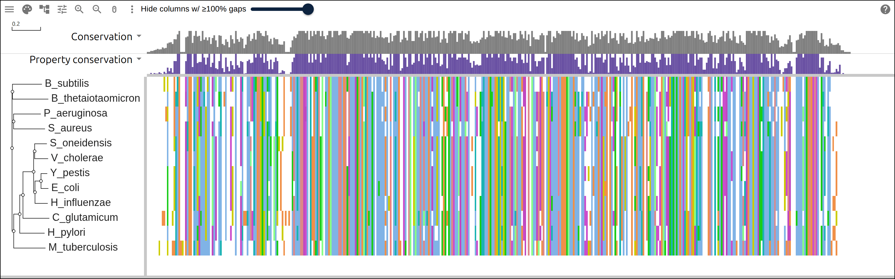
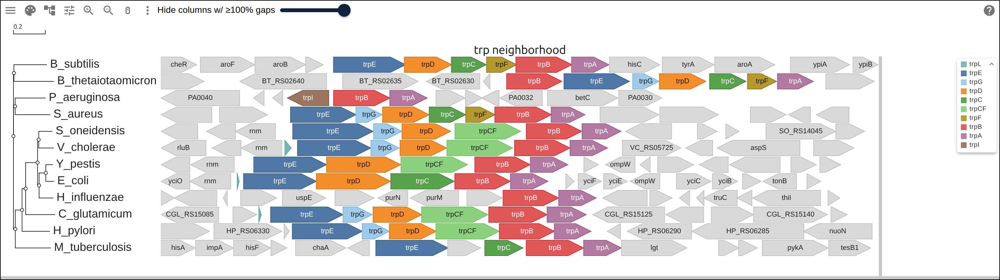
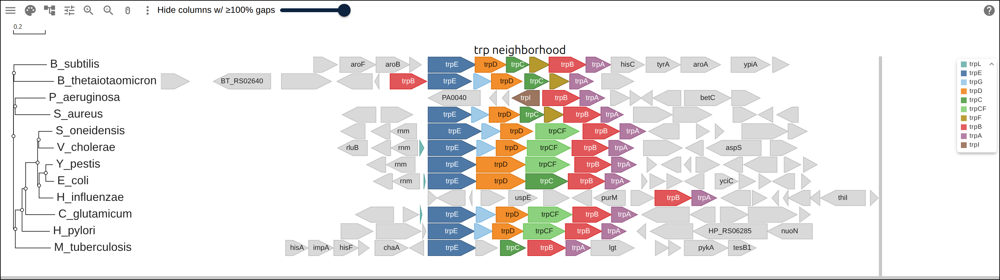
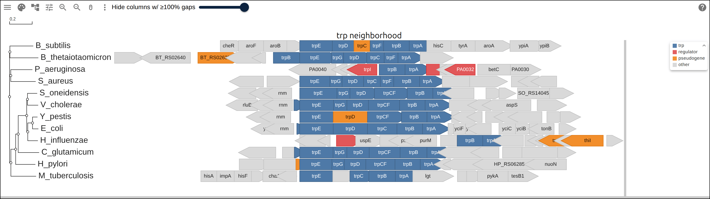
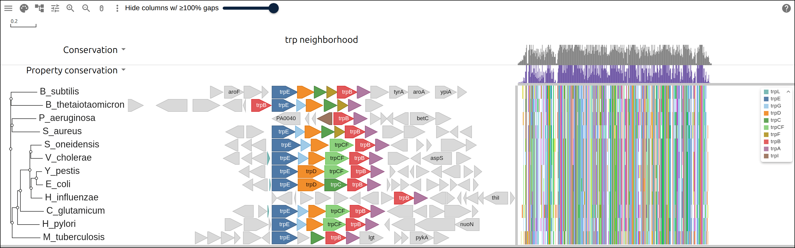

# Gene neighborhoods of the tryptophan operon

The tryptophan pathway is one operon in _Escherichia coli_ and a scattered set
of genes in others. This page takes twelve RefSeq bacterial genomes, cuts 8 kb
either side of _trpB_ out of each, and draws the result as one row of strand
arrows per genome beside a tree built from the TrpB protein. The panel reads
each row in that genome's own coordinates, so an `align` transform on _trpE_
brings the rows onto a common origin, and the two genomes that carry no _trpE_
stay where they were.

## Prerequisites

- `curl`, `python3`, and ClustalW (`apt install clustalw`)
- twelve whole-genome annotations, about 3 MB each; NCBI takes 20 to 30 seconds
  to serve one, and the script caches them
- nothing to read along: every figure below links to the live view it captured

## Where the data comes from

RefSeq's own annotation of each genome, and the three files this page writes
from it.

- one GFF3 per genome, from the NCBI sequence viewer, for example
  https://www.ncbi.nlm.nih.gov/sviewer/viewer.fcgi?id=NC_000913.3&report=gff3&retmode=text
- the TrpB proteins, from NCBI efetch by the `protein_id` on each _trpB_ CDS
  line
- the neighborhood GFF this page writes, 176 genes over twelve rows:
  https://gmod.org/JBrowseMSA/demo/data/neighborhoods/trp-neighborhoods.gff
- the TrpB alignment:
  https://gmod.org/JBrowseMSA/demo/data/neighborhoods/trpB.afa
- its tree: https://gmod.org/JBrowseMSA/demo/data/neighborhoods/trpB.nwk

## 1. The window around trpB

The row list is twelve accessions and the label each becomes:

```
NC_000913.3	E_coli
NC_003143.1	Y_pestis
NC_002505.1	V_cholerae
...
```

RefSeq serves the whole annotation for each, and the script cuts the window
itself. _trpB_ is the anchor because every genome here carries exactly one, and
the window is turned so that _trpB_ points right, so a genome whose operon runs
on the minus strand reads the same way as one on the plus strand:

```python
flip = b['strand'] == '-'
origin = b['end'] if flip else b['start']
lo, hi = origin - flank, origin + flank
inside = [g for g in genes if g['start'] >= lo and g['end'] <= hi]
```

Position 1 of each window is the first base of its first whole gene, not the
base 8,000 before _trpB_, so no row is placed by where the cut fell:

```python
base = rows[0][0] - 1
rows = [(s - base, e - base, strand, g) for s, e, strand, g in rows]
```

```bash
bash build_gene_neighborhoods.sh trp-rows.tsv .
```

```
  row                     genome genes window  trp genes, 5' to 3'
  E_coli                    4651    17  14150  trpL trpE trpD trpC trpB trpA
  Y_pestis                  4209    15  14581  trpE trpD* trpCF trpB trpA
  V_cholerae                2697    14  14865  trpL trpE trpG trpD trpCF trpB trpA
  S_oneidensis              4464    14  15092  trpE trpG trpD trpCF trpB trpA
  H_influenzae              1801    19  14560  trpB trpA
  P_aeruginosa              5697    12  10742  trpB trpA
  H_pylori                  1603    13  15251  trpE trpG trpD trpCF trpB trpA
  B_subtilis                4536    15  15382  trpE trpD trpC* trpF trpB trpA
  S_aureus                  2872    14  14755  trpE trpG trpD trpC trpF trpB trpA
  C_glutamicum              3079    14  14719  trpL trpE trpG trpD trpCF trpB trpA
  M_tuberculosis            4008    16  15224  trpE trpC trpB trpA
  B_thetaiotaomicron        4848    13  15298  trpB trpE trpG trpD trpC trpF trpA
  176 genes: trp 63, regulator 4, pseudogene 6, other 103
  16 names come from the product table, the rest from RefSeq
  * RefSeq annotates the gene as a pseudogene
```

Ten of the twelve windows hold both _trpE_ and _trpA_. _Haemophilus influenzae_
and _Pseudomonas aeruginosa_ hold _trpB_ and _trpA_ and nothing else of the
pathway, so the rest of their tryptophan genes sit somewhere the window does not
reach.

RefSeq gives many of these genes a product and no gene symbol, and the script
reads a symbol off eleven product strings, which names 16 of the 176 genes:

```python
PRODUCT_SYMBOL = [
    ('anthranilate synthase component II', 'trpG'),
    ('anthranilate synthase component I', 'trpE'),
    ('indole-3-glycerol phosphate synthase', 'trpC'),
    ('tryptophan synthase subunit beta', 'trpB'),
    ('tryptophan synthase subunit alpha', 'trpA'),
]
```

Each gene becomes a GFF3 line at its position inside the window, carrying its
name, its role and the locus tag it came from:

```
##gff-version 3
E_coli	RefSeq	gene	1	621	.	-	.	Name=yciO;role=other;locus_tag=b1267
E_coli	RefSeq	gene	618	1499	.	-	.	Name=rnm;role=other;locus_tag=b1266
```

## 2. The marker, and the tree

TrpB is the one protein every genome here carries, so it is both the anchor of
the window and the marker the tree is built from. The script fetches all twelve
by the `protein_id` on the _trpB_ CDS line and aligns them:

```bash
clustalw -INFILE=trpB.fasta -ALIGN -TYPE=PROTEIN -OUTPUT=FASTA -OUTFILE=trpB.afa
clustalw -INFILE=trpB.afa -TREE -TYPE=PROTEIN -OUTPUTTREE=phylip
```

```
  E_coli              NP_415777.1     397 aa
  Y_pestis            WP_002210633.1  396 aa
  ...
  C_glutamicum        WP_004567953.1  417 aa
Alignment Score 95830
  423 columns
```

The twelve proteins run 393 to 417 residues and align into 423 columns.

[](https://gmod.org/JBrowseMSA/demo/#data=%7B%22msaview%22%3A%7B%22type%22%3A%22MsaView%22%2C%22height%22%3A480%2C%22treeAreaWidth%22%3A250%2C%22rowHeight%22%3A26%2C%22msaFilehandle%22%3A%7B%22uri%22%3A%22data%2Fneighborhoods%2FtrpB.afa%22%7D%2C%22treeFilehandle%22%3A%7B%22uri%22%3A%22data%2Fneighborhoods%2FtrpB.nwk%22%7D%2C%22colWidth%22%3A2.9%2C%22colorSchemeName%22%3A%22clustalx_protein_dynamic%22%7D%7D)

The TrpB alignment with the neighbor-joining tree ClustalW built from it.
E_coli, Y_pestis and H_influenzae sit together on one clade with V_cholerae and
S_oneidensis beside them, and B_thetaiotaomicron carries the longest branch at
0.25 substitutions per site.

## 3. The neighborhood as a features panel

A `rowPanels` record of kind `features` draws the GFF's spans per row.
`x: "position"` reads each row in its own residue positions, which is the scale
a genome window is on, and the panel packs the spans into lanes per row:

```json
"rowPanels": [
  {
    "kind": "features",
    "x": "position",
    "width": 1120,
    "header": "trp neighborhood",
    "encoding": {
      "color": { "field": "Name", "scale": { "map": { "trpE": "#4e79a7" } } },
      "label": "Name"
    }
  }
]
```

The panel's `encoding` reads the feature table, so `color` names a GFF attribute
and a `map` over it. A gene the map leaves out draws grey, so a map of ten trp
names colors 66 of the 176 genes and leaves the other 110 as grey arrows.
`label` draws the same attribute inside each arrow wherever the text fits.

This view carries a tree and a GFF and no alignment at all. The alignment panel
is zero columns wide, and the conservation, logo and ruler tracks all measure
columns, so none of them draws.

[](https://gmod.org/JBrowseMSA/demo/#data=%7B%22msaview%22%3A%7B%22type%22%3A%22MsaView%22%2C%22height%22%3A430%2C%22treeAreaWidth%22%3A250%2C%22rowHeight%22%3A26%2C%22treeFilehandle%22%3A%7B%22uri%22%3A%22data%2Fneighborhoods%2FtrpB.nwk%22%7D%2C%22gffFilehandle%22%3A%7B%22uri%22%3A%22data%2Fneighborhoods%2Ftrp-neighborhoods.gff%22%7D%2C%22rowPanels%22%3A%5B%7B%22kind%22%3A%22features%22%2C%22x%22%3A%22position%22%2C%22width%22%3A1120%2C%22header%22%3A%22trp%20neighborhood%22%2C%22encoding%22%3A%7B%22color%22%3A%7B%22field%22%3A%22Name%22%2C%22scale%22%3A%7B%22map%22%3A%7B%22trpL%22%3A%22%2376b7b2%22%2C%22trpE%22%3A%22%234e79a7%22%2C%22trpG%22%3A%22%23a0cbe8%22%2C%22trpD%22%3A%22%23f28e2b%22%2C%22trpC%22%3A%22%2359a14f%22%2C%22trpCF%22%3A%22%238cd17d%22%2C%22trpF%22%3A%22%23b6992d%22%2C%22trpB%22%3A%22%23e15759%22%2C%22trpA%22%3A%22%23b07aa1%22%2C%22trpI%22%3A%22%239c755f%22%7D%7D%7D%2C%22label%22%3A%22Name%22%7D%7D%5D%7D%7D)

Twelve rows of gene arrows, each in its own window coordinates, with the tree
from the TrpB alignment beside them. The arrows point in the direction of the
gene, turned so that trpB points right in every row. Nothing lines up: E_coli
starts trpE at 1,773 and B_subtilis starts it at 3,702, so the same gene sits at
a different x from row to row.

## 4. Aligning every row on trpE

An `align` transform shifts each row so that the first feature named `on` starts
at zero, which is gggenes' `make_alignment_dummies`:

```json
"transform": [{ "type": "align", "on": "trpE" }]
```

The script computes the same shift per row, and prints where _trpD_ lands once
it is applied:

```
  E_coli              trpE at 1773, shift -1772: trpD starts at 1562 (genes between: none)
  Y_pestis            trpE at 1992, shift -1991: trpD starts at 1562 (genes between: none)
  V_cholerae          trpE at 2930, shift -2929: trpD starts at 2200 (genes between: trpG)
  S_oneidensis        trpE at 2828, shift -2827: trpD starts at 2343 (genes between: trpG)
  H_influenzae        no trpE in the window, keeps its own origin
  P_aeruginosa        no trpE in the window, keeps its own origin
  H_pylori            trpE at 2819, shift -2818: trpD starts at 2080 (genes between: trpG)
  B_subtilis          trpE at 3702, shift -3701: trpD starts at 1519 (genes between: none)
  S_aureus            trpE at 2780, shift -2779: trpD starts at 1975 (genes between: trpG)
  C_glutamicum        trpE at 2353, shift -2352: trpD starts at 2199 (genes between: trpG)
  M_tuberculosis      trpE at 4610, no trpD in the window
  B_thetaiotaomicron  trpE at 8644, shift -8643: trpD starts at 2046 (genes between: trpG)
```

_trpD_ starts at 1562 in _E. coli_ and in _Yersinia pestis_, where it follows
_trpE_ directly. In the six rows that carry a _trpG_ between them it starts
between 1975 and 2343, the length of that gene further along.

[](https://gmod.org/JBrowseMSA/demo/#data=%7B%22msaview%22%3A%7B%22type%22%3A%22MsaView%22%2C%22height%22%3A430%2C%22treeAreaWidth%22%3A250%2C%22rowHeight%22%3A26%2C%22treeFilehandle%22%3A%7B%22uri%22%3A%22data%2Fneighborhoods%2FtrpB.nwk%22%7D%2C%22gffFilehandle%22%3A%7B%22uri%22%3A%22data%2Fneighborhoods%2Ftrp-neighborhoods.gff%22%7D%2C%22rowPanels%22%3A%5B%7B%22kind%22%3A%22features%22%2C%22x%22%3A%22position%22%2C%22width%22%3A1120%2C%22header%22%3A%22trp%20neighborhood%22%2C%22encoding%22%3A%7B%22color%22%3A%7B%22field%22%3A%22Name%22%2C%22scale%22%3A%7B%22map%22%3A%7B%22trpL%22%3A%22%2376b7b2%22%2C%22trpE%22%3A%22%234e79a7%22%2C%22trpG%22%3A%22%23a0cbe8%22%2C%22trpD%22%3A%22%23f28e2b%22%2C%22trpC%22%3A%22%2359a14f%22%2C%22trpCF%22%3A%22%238cd17d%22%2C%22trpF%22%3A%22%23b6992d%22%2C%22trpB%22%3A%22%23e15759%22%2C%22trpA%22%3A%22%23b07aa1%22%2C%22trpI%22%3A%22%239c755f%22%7D%7D%7D%2C%22label%22%3A%22Name%22%7D%2C%22transform%22%3A%5B%7B%22type%22%3A%22align%22%2C%22on%22%3A%22trpE%22%7D%5D%7D%5D%7D%7D)

The same twelve rows with the align transform on trpE. Every trpE arrow starts
at one x, and trpD begins where the table above puts it: flush against trpE in
E_coli and Y_pestis, one trpG further along in the six rows that carry one.
H_influenzae and P_aeruginosa carry no trpE, so the transform leaves them on
their own origin and their trpB sits where the window put it.

## 5. The same spans colored by role

`encoding` is the panel's own, so a second figure over the same GFF reads a
different attribute. The script writes a `role` of `trp`, `regulator`,
`pseudogene` or `other` on every line:

```json
"encoding": {
  "color": { "field": "role", "scale": { "map": { "trp": "#4e79a7" } } },
  "label": "Name"
}
```

[](https://gmod.org/JBrowseMSA/demo/#data=%7B%22msaview%22%3A%7B%22type%22%3A%22MsaView%22%2C%22height%22%3A430%2C%22treeAreaWidth%22%3A250%2C%22rowHeight%22%3A26%2C%22treeFilehandle%22%3A%7B%22uri%22%3A%22data%2Fneighborhoods%2FtrpB.nwk%22%7D%2C%22gffFilehandle%22%3A%7B%22uri%22%3A%22data%2Fneighborhoods%2Ftrp-neighborhoods.gff%22%7D%2C%22rowPanels%22%3A%5B%7B%22kind%22%3A%22features%22%2C%22x%22%3A%22position%22%2C%22width%22%3A1120%2C%22header%22%3A%22trp%20neighborhood%22%2C%22encoding%22%3A%7B%22color%22%3A%7B%22field%22%3A%22role%22%2C%22scale%22%3A%7B%22map%22%3A%7B%22trp%22%3A%22%234e79a7%22%2C%22regulator%22%3A%22%23e15759%22%2C%22pseudogene%22%3A%22%23f28e2b%22%2C%22other%22%3A%22%23d9d9d9%22%7D%7D%7D%2C%22label%22%3A%22Name%22%7D%2C%22transform%22%3A%5B%7B%22type%22%3A%22align%22%2C%22on%22%3A%22trpE%22%7D%5D%7D%5D%7D%7D)

The same aligned rows colored by role: blue for the 63 trp genes, red for the
four regulators, orange for the six genes RefSeq annotates as pseudogenes, grey
for the other 103. RefSeq annotates Y_pestis trpD and B_subtilis trpC as
pseudogenes, each orange inside an otherwise blue run. P_aeruginosa's red trpI
sits beside its trpB, in a row with no trpE.

## 6. The panel beside the alignment it came from

The panel and the alignment are two views of the same twelve rows, so both fit
in one figure. The panel takes its width out of the alignment's, and the
alignment scrolls and fits within what is left:

```json
{
  "msaFilehandle": { "uri": "data/neighborhoods/trpB.afa" },
  "treeFilehandle": { "uri": "data/neighborhoods/trpB.nwk" },
  "gffFilehandle": { "uri": "data/neighborhoods/trp-neighborhoods.gff" },
  "showDomains": false,
  "rowPanels": [{ "kind": "features", "x": "position", "width": 760 }]
}
```

The GFF's positions are genome coordinates, so `showDomains` is off: the
alignment's own overlay reads a GFF span as residues of the row, and 1,562 would
land far past the 423rd column.

[](https://gmod.org/JBrowseMSA/demo/#data=%7B%22msaview%22%3A%7B%22type%22%3A%22MsaView%22%2C%22height%22%3A480%2C%22treeAreaWidth%22%3A250%2C%22rowHeight%22%3A26%2C%22msaFilehandle%22%3A%7B%22uri%22%3A%22data%2Fneighborhoods%2FtrpB.afa%22%7D%2C%22treeFilehandle%22%3A%7B%22uri%22%3A%22data%2Fneighborhoods%2FtrpB.nwk%22%7D%2C%22gffFilehandle%22%3A%7B%22uri%22%3A%22data%2Fneighborhoods%2Ftrp-neighborhoods.gff%22%7D%2C%22colWidth%22%3A0.9%2C%22colorSchemeName%22%3A%22clustalx_protein_dynamic%22%2C%22showDomains%22%3Afalse%2C%22rowPanels%22%3A%5B%7B%22kind%22%3A%22features%22%2C%22x%22%3A%22position%22%2C%22width%22%3A760%2C%22header%22%3A%22trp%20neighborhood%22%2C%22encoding%22%3A%7B%22color%22%3A%7B%22field%22%3A%22Name%22%2C%22scale%22%3A%7B%22map%22%3A%7B%22trpL%22%3A%22%2376b7b2%22%2C%22trpE%22%3A%22%234e79a7%22%2C%22trpG%22%3A%22%23a0cbe8%22%2C%22trpD%22%3A%22%23f28e2b%22%2C%22trpC%22%3A%22%2359a14f%22%2C%22trpCF%22%3A%22%238cd17d%22%2C%22trpF%22%3A%22%23b6992d%22%2C%22trpB%22%3A%22%23e15759%22%2C%22trpA%22%3A%22%23b07aa1%22%2C%22trpI%22%3A%22%239c755f%22%7D%7D%7D%2C%22label%22%3A%22Name%22%7D%2C%22transform%22%3A%5B%7B%22type%22%3A%22align%22%2C%22on%22%3A%22trpE%22%7D%5D%7D%5D%7D%7D)

The 423 TrpB columns and the trp neighborhood in one figure, with the tree from
the alignment on the left. The alignment gives the two conservation tracks
columns to measure, so both draw.

Two rows never moved. _H. influenzae_ and _P. aeruginosa_ carry _trpB_ and
_trpA_ in their windows and nothing else of the pathway, so they have no _trpE_
to align on. RefSeq places the rest of their tryptophan genes elsewhere in each
genome, past the 8 kb the window reaches, and the figure leaves both rows on
their own origin.

## Reproduce it end to end

```bash
curl -O https://raw.githubusercontent.com/GMOD/JBrowseMSA/main/docs/tutorials/scripts/build_gene_neighborhoods.sh
bash build_gene_neighborhoods.sh
```

The script writes the twelve-row TSV itself when none is given, so it runs with
no arguments. It fetches each annotation into `raw/`, where a rerun finds it,
and writes `trp-neighborhoods.gff`, `trpB.afa` and `trpB.nwk` beside it, along
with every number on this page.

## See also

- [Eight mitochondrial genomes and the genes on them](https://gmod.org/JBrowseMSA/tutorials/mitogenome_genes)
- [Data layers](https://gmod.org/JBrowseMSA/layers)
- [User guide](https://gmod.org/JBrowseMSA/guide)

## References

- Yu G, Smith DK, Zhu H, Guan Y, Lam TT. ggtree: an R package for visualization
  and annotation of phylogenetic trees with their covariates and other
  associated data. _Methods Ecol Evol_ 8:28-36.
- Thompson JD, Gibson TJ, Higgins DG. Multiple sequence alignment using ClustalW
  and ClustalX. _Curr Protoc Bioinformatics_ Chapter 2:Unit 2.3.
- O'Leary NA, Wright MW, Brister JR, et al. Reference sequence (RefSeq) database
  at NCBI: current status, taxonomic expansion, and functional annotation.
  _Nucleic Acids Res_ 44:D733-D745.
