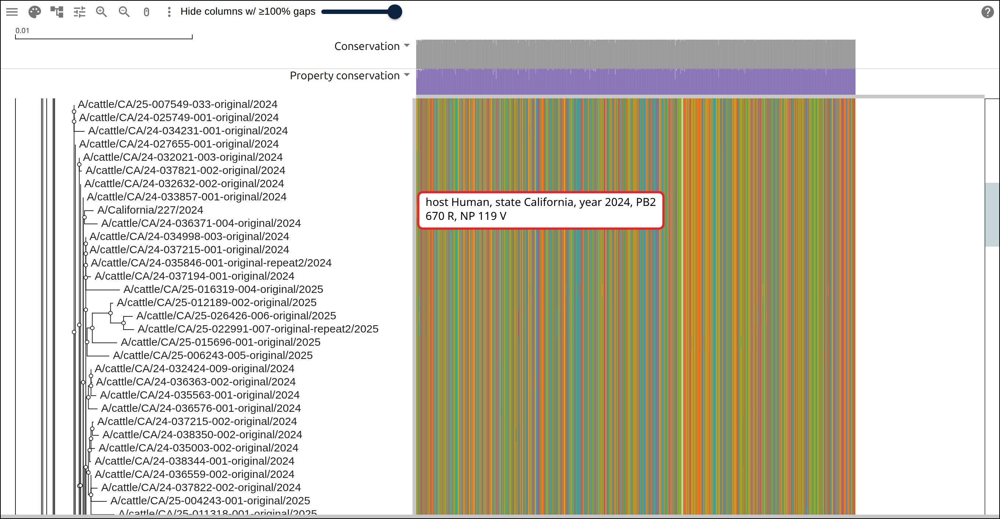
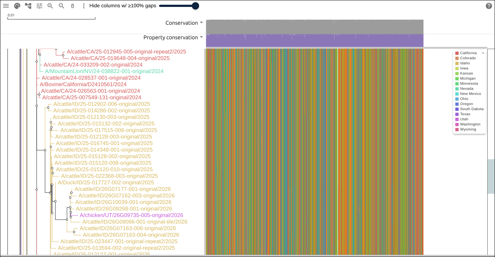
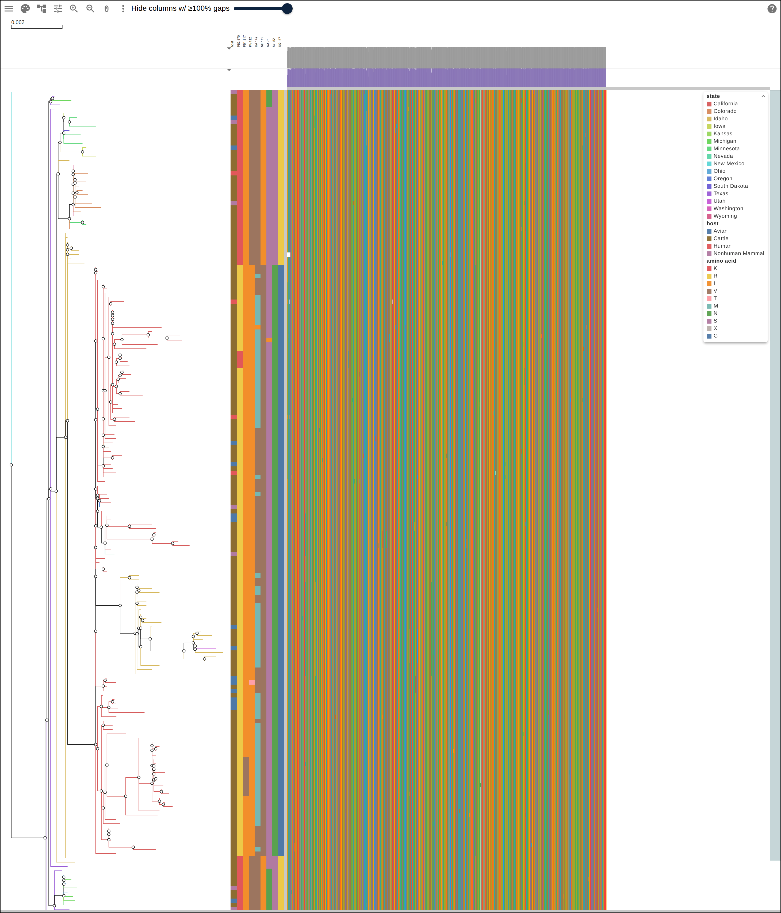
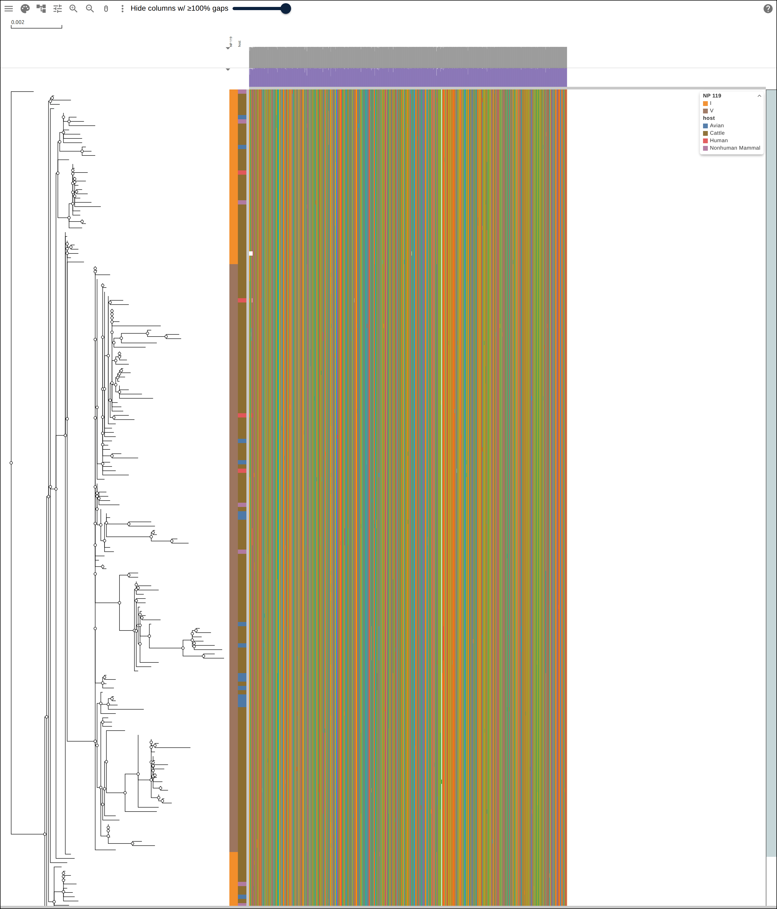
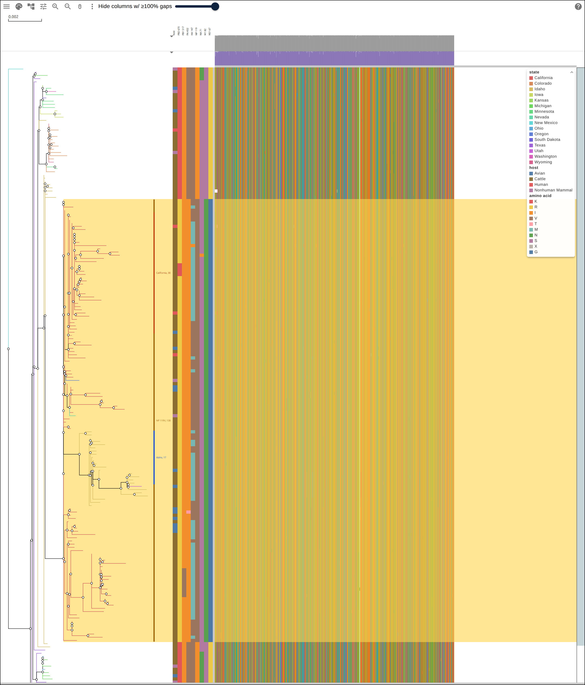
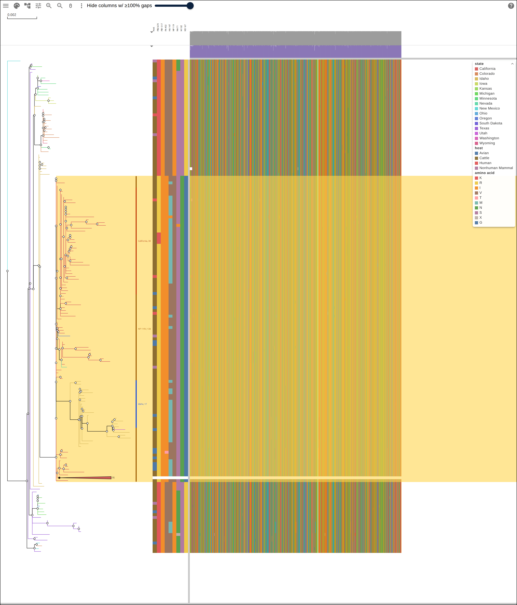
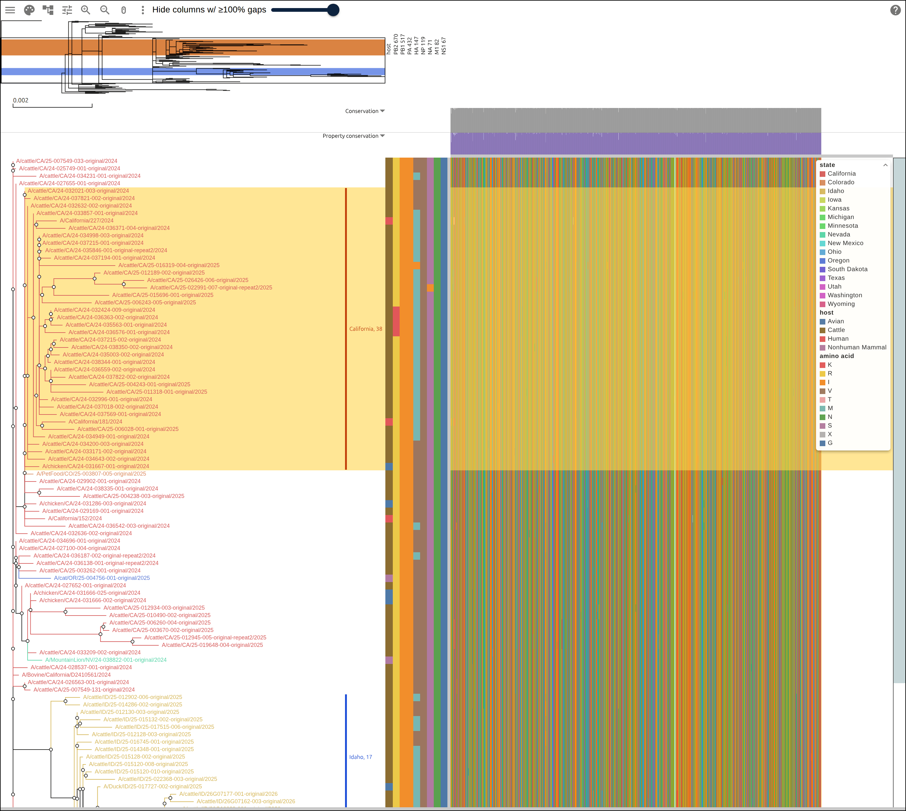
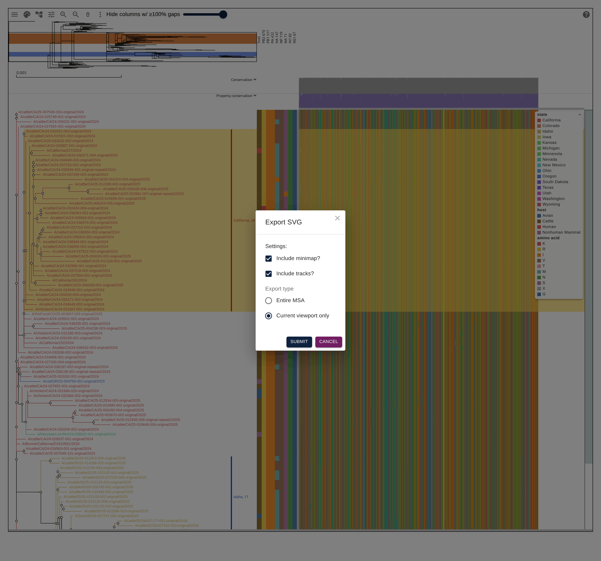

# An H5N1 surveillance figure

Nextstrain's H5N1 cattle-outbreak build places 5,608 genomes on one tree and
records a host, a collecting state, a collection date and a GenoFLU genotype for
each of them. This page subsamples that build to 204 genomes, writes those
fields and one amino-acid site per segment out as a row table, and composes the
result into one figure: tip labels and tree edges colored by state, nine strips
between the tree and the alignment, three groups marked in the gutter, a
collapsed clade, and the whole tree in an overview band above the view. Every
layer is a property of the view, so the finished figure is one link and one SVG
export.

## Prerequisites

- Python 3, standard library only, nothing to install
- nothing to read along: every figure below links to the live view it captured

## Where the data comes from

One dated Nextstrain build, plus the three files this page writes from it.

- the build every field and every sequence comes from, pinned to 2026-09-15:
  https://nextstrain.org/avian-flu/h5n1-cattle-outbreak/genome@2026-09-15
- the HA alignment this page writes, 204 rows:
  https://gmod.org/JBrowseMSA/demo/data/h5n1/h5n1-ha.fa
- its tree: https://gmod.org/JBrowseMSA/demo/data/h5n1/h5n1.nwk
- the row table: https://gmod.org/JBrowseMSA/demo/data/h5n1/h5n1-rowdata.json

## 1. The build, and the sample

The auspice JSON holds a root sequence and one mutation list per branch. Copying
the root down the tree and applying each branch's mutations reconstructs every
tip, and Nextstrain numbers every mutation against the same reference, so the
tips come out already aligned:

```python
def apply_muts(seq, muts):
    edited = bytearray(seq)
    for mut in muts or []:
        m = MUT_RE.match(mut)
        if m:
            _, pos, alt = m.groups()
            edited[int(pos) - 1] = ord(alt)
    return bytes(edited)
```

The sample is every 24th tip whose record names a GenBank accession and a
collecting state, which keeps the proportions of the whole build with no seed to
explain:

```bash
python3 build_influenza_surveillance_figure.py .
```

```
build updated 2026-09-14, genome 13590 nt
reconstructed 5608 tips
  data source: {'genbank': 4879, 'sra-via-andersen-lab': 729}
4878 tips have a GenBank accession and a reported state
sample: every 24th of them, 204 tips
  genotype: 1 values (B3.13 204)
  host: 4 values (Cattle 177, Avian 16, Nonhuman Mammal 7, Human 4)
  state: 16 values (California 111, Idaho 34, Texas 15, Colorado 14)
  year: 3 values (2024 139, 2025 57, 2026 8)
  cleavage site: 3 values (RRKR 185, RKKR 18, RRRR 1)
```

All 204 tips carry the same GenoFLU genotype, B3.13, because the build is the
cattle outbreak and GenoFLU names a genotype by its eight segment lineages. A
strip over that field would draw one color for every row, so the figure reads an
amino-acid site per segment instead.

## 2. The row table

For each segment's gene the script takes the amino-acid site whose minor state
the most sampled tips carry:

```python
for i in range(length):
    states = collections.Counter(
        chr(t["aa"][gene][i]) for t in sample if i < len(t["aa"][gene])
    )
    called = [(n, s) for s, n in states.items() if s not in ("X", "-")]
    if len(called) < 2:
        continue
    called.sort(reverse=True)
    minor = sum(n for n, _s in called[1:])
```

```
  PB2 670: R 134, K 70
  PB1 517: I 195, V 9
  PA 432: I 137, V 66, T 1
  HA 147: V 117, M 86, I 1
  NP 119: V 138, I 66
  NA 71: S 177, N 25, X 1, I 1
  M1 82: N 138, S 66
  NS1 67: G 138, R 66
```

Each site becomes a field named for its gene and its position, so a strip's
header names what its column reads. The five metadata fields and the eight
segment sites go into one file keyed by tip name:

```
wrote ./h5n1-rowdata.json: 204 rows, 53 kB
the eight segment columns hold 10 states: G I K M N R S T V X
wrote ./h5n1-ha.fa: 204 rows, 1707 columns (HA 6937-8643 of the genome), 348 kB
wrote ./h5n1.nwk: 204 tips, 149 internal nodes, 352 edges
```

The alignment is the HA coding sequence cut out of each reconstructed genome at
the coordinates the build annotates. The tree is the build's own topology pruned
to the 204 tips, with each surviving branch's length taken from the difference
in cumulative divergence. Nextstrain infers that topology with IQ-TREE and
publishes a divergence and an inferred date per node, so the Newick written here
carries no support values on its internal nodes. A 53 kB table runs past the
8,192-character request line a link fits in, so the snapshot names the three
files and the viewer fetches them at startup:

```json
{
  "type": "MsaView",
  "msaFilehandle": { "uri": "data/h5n1/h5n1-ha.fa" },
  "treeFilehandle": { "uri": "data/h5n1/h5n1.nwk" },
  "treeMetadataFilehandle": { "uri": "data/h5n1/h5n1-rowdata.json" }
}
```

[](https://gmod.org/JBrowseMSA/demo/?data=%7B%22msaview%22%3A%7B%22type%22%3A%22MsaView%22%2C%22height%22%3A700%2C%22treeAreaWidth%22%3A560%2C%22colWidth%22%3A0.35%2C%22rowHeight%22%3A18%2C%22drawLabels%22%3Atrue%2C%22scrollY%22%3A-738%2C%22colorSchemeName%22%3A%22nucleotide%22%2C%22msaFilehandle%22%3A%7B%22uri%22%3A%22data%2Fh5n1%2Fh5n1-ha.fa%22%7D%2C%22treeFilehandle%22%3A%7B%22uri%22%3A%22data%2Fh5n1%2Fh5n1.nwk%22%7D%2C%22treeMetadataFilehandle%22%3A%7B%22uri%22%3A%22data%2Fh5n1%2Fh5n1-rowdata.json%22%7D%7D%7D)

Thirty-eight of the 204 rows at a row height that draws labels, starting on
display row 41, with the table loaded and no channel reading it. Every tip label
is in the theme's text color, and the callout names five of the thirteen fields
the table gives the row it points at.

## 3. Labels and branches colored by state

An `encodings` record names the channel to paint and the field feeding it. The
`tipLabel` channel colors the label beside each tip, and the `branch` channel
gives an internal node the field value its tips agree on and colors the edge
above it:

```json
"encodings": [
  { "channel": "tipLabel", "field": "state" },
  { "channel": "branch", "field": "state" }
]
```

[](https://gmod.org/JBrowseMSA/demo/?data=%7B%22msaview%22%3A%7B%22type%22%3A%22MsaView%22%2C%22height%22%3A700%2C%22treeAreaWidth%22%3A560%2C%22colWidth%22%3A0.35%2C%22rowHeight%22%3A18%2C%22drawLabels%22%3Atrue%2C%22scrollY%22%3A-1890%2C%22colorSchemeName%22%3A%22nucleotide%22%2C%22encodings%22%3A%5B%7B%22channel%22%3A%22tipLabel%22%2C%22field%22%3A%22state%22%7D%2C%7B%22channel%22%3A%22branch%22%2C%22field%22%3A%22state%22%7D%5D%2C%22msaFilehandle%22%3A%7B%22uri%22%3A%22data%2Fh5n1%2Fh5n1-ha.fa%22%7D%2C%22treeFilehandle%22%3A%7B%22uri%22%3A%22data%2Fh5n1%2Fh5n1.nwk%22%7D%2C%22treeMetadataFilehandle%22%3A%7B%22uri%22%3A%22data%2Fh5n1%2Fh5n1-rowdata.json%22%7D%7D%7D)

Display rows 105 to 142, where the 17-row Idaho run starts. The California
labels at the top of the frame are red and the Idaho labels below them are
yellow, with one green Nevada tip among the California rows and one purple Utah
tip inside the Idaho block. The backbone above the Idaho rows draws black,
because the tips under those nodes carry both states between them. The legend in
the top right lists all 16 states.

## 4. Nine strips between the tree and the alignment

A `rowPanels` record draws a column of cells, one per row, in the space between
the tree and the alignment. The host field takes one strip and the eight segment
sites take eight more, all nine sharing a color map over amino acids so a state
keeps its color across the matrix:

```json
{
  "kind": "strip",
  "field": "PB2 670",
  "width": 11,
  "legend": "amino acid",
  "scale": {
    "map": {
      "G": "#4e79a7",
      "I": "#f28e2b",
      "K": "#e15759",
      "M": "#76b7b2",
      "N": "#59a14f",
      "R": "#edc948",
      "S": "#b07aa1",
      "T": "#ff9da7",
      "V": "#9c755f",
      "X": "#bab0ac"
    }
  }
}
```

The other seven segment strips repeat that record with their own `field`. The
host strip takes a map of its own over the four host values, at a width of 12.

`legend` names the legend a strip lists under. All eight segment strips name the
same one, so the ten amino-acid states are listed once instead of eight times.

[](https://gmod.org/JBrowseMSA/demo/?data=%7B%22msaview%22%3A%7B%22type%22%3A%22MsaView%22%2C%22height%22%3A1700%2C%22treeAreaWidth%22%3A430%2C%22colWidth%22%3A0.35%2C%22rowHeight%22%3A8%2C%22drawLabels%22%3Afalse%2C%22colorSchemeName%22%3A%22nucleotide%22%2C%22encodings%22%3A%5B%7B%22channel%22%3A%22branch%22%2C%22field%22%3A%22state%22%7D%5D%2C%22rowPanels%22%3A%5B%7B%22kind%22%3A%22strip%22%2C%22field%22%3A%22host%22%2C%22scale%22%3A%7B%22map%22%3A%7B%22Avian%22%3A%22%234e79a7%22%2C%22Cattle%22%3A%22%238c6d31%22%2C%22Human%22%3A%22%23e15759%22%2C%22Nonhuman%20Mammal%22%3A%22%23b07aa1%22%7D%7D%2C%22width%22%3A12%7D%2C%7B%22kind%22%3A%22strip%22%2C%22field%22%3A%22PB2%20670%22%2C%22scale%22%3A%7B%22map%22%3A%7B%22G%22%3A%22%234e79a7%22%2C%22I%22%3A%22%23f28e2b%22%2C%22K%22%3A%22%23e15759%22%2C%22M%22%3A%22%2376b7b2%22%2C%22N%22%3A%22%2359a14f%22%2C%22R%22%3A%22%23edc948%22%2C%22S%22%3A%22%23b07aa1%22%2C%22T%22%3A%22%23ff9da7%22%2C%22V%22%3A%22%239c755f%22%2C%22X%22%3A%22%23bab0ac%22%7D%7D%2C%22width%22%3A11%2C%22legend%22%3A%22amino%20acid%22%7D%2C%7B%22kind%22%3A%22strip%22%2C%22field%22%3A%22PB1%20517%22%2C%22scale%22%3A%7B%22map%22%3A%7B%22G%22%3A%22%234e79a7%22%2C%22I%22%3A%22%23f28e2b%22%2C%22K%22%3A%22%23e15759%22%2C%22M%22%3A%22%2376b7b2%22%2C%22N%22%3A%22%2359a14f%22%2C%22R%22%3A%22%23edc948%22%2C%22S%22%3A%22%23b07aa1%22%2C%22T%22%3A%22%23ff9da7%22%2C%22V%22%3A%22%239c755f%22%2C%22X%22%3A%22%23bab0ac%22%7D%7D%2C%22width%22%3A11%2C%22legend%22%3A%22amino%20acid%22%7D%2C%7B%22kind%22%3A%22strip%22%2C%22field%22%3A%22PA%20432%22%2C%22scale%22%3A%7B%22map%22%3A%7B%22G%22%3A%22%234e79a7%22%2C%22I%22%3A%22%23f28e2b%22%2C%22K%22%3A%22%23e15759%22%2C%22M%22%3A%22%2376b7b2%22%2C%22N%22%3A%22%2359a14f%22%2C%22R%22%3A%22%23edc948%22%2C%22S%22%3A%22%23b07aa1%22%2C%22T%22%3A%22%23ff9da7%22%2C%22V%22%3A%22%239c755f%22%2C%22X%22%3A%22%23bab0ac%22%7D%7D%2C%22width%22%3A11%2C%22legend%22%3A%22amino%20acid%22%7D%2C%7B%22kind%22%3A%22strip%22%2C%22field%22%3A%22HA%20147%22%2C%22scale%22%3A%7B%22map%22%3A%7B%22G%22%3A%22%234e79a7%22%2C%22I%22%3A%22%23f28e2b%22%2C%22K%22%3A%22%23e15759%22%2C%22M%22%3A%22%2376b7b2%22%2C%22N%22%3A%22%2359a14f%22%2C%22R%22%3A%22%23edc948%22%2C%22S%22%3A%22%23b07aa1%22%2C%22T%22%3A%22%23ff9da7%22%2C%22V%22%3A%22%239c755f%22%2C%22X%22%3A%22%23bab0ac%22%7D%7D%2C%22width%22%3A11%2C%22legend%22%3A%22amino%20acid%22%7D%2C%7B%22kind%22%3A%22strip%22%2C%22field%22%3A%22NP%20119%22%2C%22scale%22%3A%7B%22map%22%3A%7B%22G%22%3A%22%234e79a7%22%2C%22I%22%3A%22%23f28e2b%22%2C%22K%22%3A%22%23e15759%22%2C%22M%22%3A%22%2376b7b2%22%2C%22N%22%3A%22%2359a14f%22%2C%22R%22%3A%22%23edc948%22%2C%22S%22%3A%22%23b07aa1%22%2C%22T%22%3A%22%23ff9da7%22%2C%22V%22%3A%22%239c755f%22%2C%22X%22%3A%22%23bab0ac%22%7D%7D%2C%22width%22%3A11%2C%22legend%22%3A%22amino%20acid%22%7D%2C%7B%22kind%22%3A%22strip%22%2C%22field%22%3A%22NA%2071%22%2C%22scale%22%3A%7B%22map%22%3A%7B%22G%22%3A%22%234e79a7%22%2C%22I%22%3A%22%23f28e2b%22%2C%22K%22%3A%22%23e15759%22%2C%22M%22%3A%22%2376b7b2%22%2C%22N%22%3A%22%2359a14f%22%2C%22R%22%3A%22%23edc948%22%2C%22S%22%3A%22%23b07aa1%22%2C%22T%22%3A%22%23ff9da7%22%2C%22V%22%3A%22%239c755f%22%2C%22X%22%3A%22%23bab0ac%22%7D%7D%2C%22width%22%3A11%2C%22legend%22%3A%22amino%20acid%22%7D%2C%7B%22kind%22%3A%22strip%22%2C%22field%22%3A%22M1%2082%22%2C%22scale%22%3A%7B%22map%22%3A%7B%22G%22%3A%22%234e79a7%22%2C%22I%22%3A%22%23f28e2b%22%2C%22K%22%3A%22%23e15759%22%2C%22M%22%3A%22%2376b7b2%22%2C%22N%22%3A%22%2359a14f%22%2C%22R%22%3A%22%23edc948%22%2C%22S%22%3A%22%23b07aa1%22%2C%22T%22%3A%22%23ff9da7%22%2C%22V%22%3A%22%239c755f%22%2C%22X%22%3A%22%23bab0ac%22%7D%7D%2C%22width%22%3A11%2C%22legend%22%3A%22amino%20acid%22%7D%2C%7B%22kind%22%3A%22strip%22%2C%22field%22%3A%22NS1%2067%22%2C%22scale%22%3A%7B%22map%22%3A%7B%22G%22%3A%22%234e79a7%22%2C%22I%22%3A%22%23f28e2b%22%2C%22K%22%3A%22%23e15759%22%2C%22M%22%3A%22%2376b7b2%22%2C%22N%22%3A%22%2359a14f%22%2C%22R%22%3A%22%23edc948%22%2C%22S%22%3A%22%23b07aa1%22%2C%22T%22%3A%22%23ff9da7%22%2C%22V%22%3A%22%239c755f%22%2C%22X%22%3A%22%23bab0ac%22%7D%7D%2C%22width%22%3A11%2C%22legend%22%3A%22amino%20acid%22%7D%5D%2C%22msaFilehandle%22%3A%7B%22uri%22%3A%22data%2Fh5n1%2Fh5n1-ha.fa%22%7D%2C%22treeFilehandle%22%3A%7B%22uri%22%3A%22data%2Fh5n1%2Fh5n1.nwk%22%7D%2C%22treeMetadataFilehandle%22%3A%7B%22uri%22%3A%22data%2Fh5n1%2Fh5n1-rowdata.json%22%7D%7D%7D)

All 204 rows at a row height of 8, with the branches colored by state and the
nine strips drawn between the tree and the HA alignment. Each strip's header
runs up the band above it. The PB2 670, PA 432, NP 119, M1 82 and NS1 67 columns
each read one state over display rows 41 to 178 and another outside them:
exactly those 138 rows for NP 119, M1 82 and NS1 67, 134 of them for PB2 670 and
137 for PA 432. HA 147 and NA 71 change many times down the column. Three
legends stack in the top right, one per field name plus the shared amino-acid
one.

## 5. How far a field follows the tree

The build script counts, for each field, how many edges take a color and how
many maximal clades the field's values cut the tree into. A field that follows
the tree perfectly has one clade per value. Each line the script prints goes on
to name the largest clades per value, and the block below stops at the edge
counts:

```
host: 4 values in 112 clades, 285/352 edges colored, 81/148 of them above an internal node
state: 16 values in 86 clades, 297/352 edges colored, 93/148 of them above an internal node
NP 119: 2 values in 15 clades, 345/352 edges colored, 141/148 of them above an internal node
M1 82: 2 values in 15 clades, 345/352 edges colored, 141/148 of them above an internal node
NS1 67: 2 values in 15 clades, 345/352 edges colored, 141/148 of them above an internal node
```

Two strips put the two extremes side by side: NP 119, whose two states cut the
tree into 15 clades, and host, whose four values cut it into 112.

[](https://gmod.org/JBrowseMSA/demo/?data=%7B%22msaview%22%3A%7B%22type%22%3A%22MsaView%22%2C%22height%22%3A1700%2C%22treeAreaWidth%22%3A430%2C%22colWidth%22%3A0.35%2C%22rowHeight%22%3A8%2C%22drawLabels%22%3Afalse%2C%22colorSchemeName%22%3A%22nucleotide%22%2C%22rowPanels%22%3A%5B%7B%22kind%22%3A%22strip%22%2C%22field%22%3A%22NP%20119%22%2C%22scale%22%3A%7B%22map%22%3A%7B%22G%22%3A%22%234e79a7%22%2C%22I%22%3A%22%23f28e2b%22%2C%22K%22%3A%22%23e15759%22%2C%22M%22%3A%22%2376b7b2%22%2C%22N%22%3A%22%2359a14f%22%2C%22R%22%3A%22%23edc948%22%2C%22S%22%3A%22%23b07aa1%22%2C%22T%22%3A%22%23ff9da7%22%2C%22V%22%3A%22%239c755f%22%2C%22X%22%3A%22%23bab0ac%22%7D%7D%2C%22width%22%3A16%7D%2C%7B%22kind%22%3A%22strip%22%2C%22field%22%3A%22host%22%2C%22scale%22%3A%7B%22map%22%3A%7B%22Avian%22%3A%22%234e79a7%22%2C%22Cattle%22%3A%22%238c6d31%22%2C%22Human%22%3A%22%23e15759%22%2C%22Nonhuman%20Mammal%22%3A%22%23b07aa1%22%7D%7D%2C%22width%22%3A16%7D%5D%2C%22msaFilehandle%22%3A%7B%22uri%22%3A%22data%2Fh5n1%2Fh5n1-ha.fa%22%7D%2C%22treeFilehandle%22%3A%7B%22uri%22%3A%22data%2Fh5n1%2Fh5n1.nwk%22%7D%2C%22treeMetadataFilehandle%22%3A%7B%22uri%22%3A%22data%2Fh5n1%2Fh5n1-rowdata.json%22%7D%7D%7D)

The same 204 rows with two strips at a width of 16. NP 119 reads as three
blocks: 41 orange I rows, the 138 brown V rows of the clade, and 25 orange I
rows at the bottom. Host reads as a brown column of cattle speckled with the 16
avian, 7 nonhuman-mammal and 4 human rows, which sit wherever the sampling put
them.

## 6. Three groups marked in the gutter

A `clades` record marks a group of rows. `mrca` names two tips whose common
ancestor is the group and `tips` is the leaf count the producer measured under
that ancestor; `range` names the first and last row of a run that is not a
clade. `highlight` fills the rows, and `bracket` draws a bar with the record's
label in the gutter at the right of the tree area:

```json
"clades": [
  {
    "mrca": ["A/cattle/CA/24-027807-002-original/2024", "A/chicken/CA/24-031285-004-original/2024"],
    "tips": 138,
    "mark": "bracket",
    "color": "#a16207",
    "label": "NP 119V, 138"
  },
  {
    "range": ["A/cattle/ID/25-012902-006-original/2025", "A/cattle/ID/26G09268-001-original/2026"],
    "tips": 17,
    "mark": "bracket",
    "color": "#1d4ed8",
    "label": "Idaho, 17"
  }
]
```

The script finds all three groups on the pruned tree:

```
NP 119 I->V: a clade of 138 tips, display rows 41-178
  mrca tips: A/cattle/CA/24-027807-002-original/2024 and A/chicken/CA/24-031285-004-original/2024
largest all-California clade: 38 of the 111 California tips, display rows 45-82
  mrca tips: A/chicken/CA/24-031667-001-original/2024 and A/cattle/CA/24-037821-002-original/2024
  longest run of Idaho rows: 17 rows 113-129, not a clade
  range ends: A/cattle/ID/25-012902-006-original/2025 and A/cattle/ID/26G09268-001-original/2026
```

The same 138 tips carry NP 119V, M1 82N and NS1 67G, so one bracket covers all
three sites. The viewer resolves each `mrca` pair to their common ancestor,
counts the leaves under it and compares the count with the record's `tips`.
Writing 137 there drops the mark, so a re-estimated tree loses it rather than
moving it somewhere else.

[](https://gmod.org/JBrowseMSA/demo/?data=%7B%22msaview%22%3A%7B%22type%22%3A%22MsaView%22%2C%22height%22%3A1700%2C%22treeAreaWidth%22%3A430%2C%22colWidth%22%3A0.35%2C%22rowHeight%22%3A8%2C%22drawLabels%22%3Afalse%2C%22colorSchemeName%22%3A%22nucleotide%22%2C%22encodings%22%3A%5B%7B%22channel%22%3A%22branch%22%2C%22field%22%3A%22state%22%7D%5D%2C%22rowPanels%22%3A%5B%7B%22kind%22%3A%22strip%22%2C%22field%22%3A%22host%22%2C%22scale%22%3A%7B%22map%22%3A%7B%22Avian%22%3A%22%234e79a7%22%2C%22Cattle%22%3A%22%238c6d31%22%2C%22Human%22%3A%22%23e15759%22%2C%22Nonhuman%20Mammal%22%3A%22%23b07aa1%22%7D%7D%2C%22width%22%3A12%7D%2C%7B%22kind%22%3A%22strip%22%2C%22field%22%3A%22PB2%20670%22%2C%22scale%22%3A%7B%22map%22%3A%7B%22G%22%3A%22%234e79a7%22%2C%22I%22%3A%22%23f28e2b%22%2C%22K%22%3A%22%23e15759%22%2C%22M%22%3A%22%2376b7b2%22%2C%22N%22%3A%22%2359a14f%22%2C%22R%22%3A%22%23edc948%22%2C%22S%22%3A%22%23b07aa1%22%2C%22T%22%3A%22%23ff9da7%22%2C%22V%22%3A%22%239c755f%22%2C%22X%22%3A%22%23bab0ac%22%7D%7D%2C%22width%22%3A11%2C%22legend%22%3A%22amino%20acid%22%7D%2C%7B%22kind%22%3A%22strip%22%2C%22field%22%3A%22PB1%20517%22%2C%22scale%22%3A%7B%22map%22%3A%7B%22G%22%3A%22%234e79a7%22%2C%22I%22%3A%22%23f28e2b%22%2C%22K%22%3A%22%23e15759%22%2C%22M%22%3A%22%2376b7b2%22%2C%22N%22%3A%22%2359a14f%22%2C%22R%22%3A%22%23edc948%22%2C%22S%22%3A%22%23b07aa1%22%2C%22T%22%3A%22%23ff9da7%22%2C%22V%22%3A%22%239c755f%22%2C%22X%22%3A%22%23bab0ac%22%7D%7D%2C%22width%22%3A11%2C%22legend%22%3A%22amino%20acid%22%7D%2C%7B%22kind%22%3A%22strip%22%2C%22field%22%3A%22PA%20432%22%2C%22scale%22%3A%7B%22map%22%3A%7B%22G%22%3A%22%234e79a7%22%2C%22I%22%3A%22%23f28e2b%22%2C%22K%22%3A%22%23e15759%22%2C%22M%22%3A%22%2376b7b2%22%2C%22N%22%3A%22%2359a14f%22%2C%22R%22%3A%22%23edc948%22%2C%22S%22%3A%22%23b07aa1%22%2C%22T%22%3A%22%23ff9da7%22%2C%22V%22%3A%22%239c755f%22%2C%22X%22%3A%22%23bab0ac%22%7D%7D%2C%22width%22%3A11%2C%22legend%22%3A%22amino%20acid%22%7D%2C%7B%22kind%22%3A%22strip%22%2C%22field%22%3A%22HA%20147%22%2C%22scale%22%3A%7B%22map%22%3A%7B%22G%22%3A%22%234e79a7%22%2C%22I%22%3A%22%23f28e2b%22%2C%22K%22%3A%22%23e15759%22%2C%22M%22%3A%22%2376b7b2%22%2C%22N%22%3A%22%2359a14f%22%2C%22R%22%3A%22%23edc948%22%2C%22S%22%3A%22%23b07aa1%22%2C%22T%22%3A%22%23ff9da7%22%2C%22V%22%3A%22%239c755f%22%2C%22X%22%3A%22%23bab0ac%22%7D%7D%2C%22width%22%3A11%2C%22legend%22%3A%22amino%20acid%22%7D%2C%7B%22kind%22%3A%22strip%22%2C%22field%22%3A%22NP%20119%22%2C%22scale%22%3A%7B%22map%22%3A%7B%22G%22%3A%22%234e79a7%22%2C%22I%22%3A%22%23f28e2b%22%2C%22K%22%3A%22%23e15759%22%2C%22M%22%3A%22%2376b7b2%22%2C%22N%22%3A%22%2359a14f%22%2C%22R%22%3A%22%23edc948%22%2C%22S%22%3A%22%23b07aa1%22%2C%22T%22%3A%22%23ff9da7%22%2C%22V%22%3A%22%239c755f%22%2C%22X%22%3A%22%23bab0ac%22%7D%7D%2C%22width%22%3A11%2C%22legend%22%3A%22amino%20acid%22%7D%2C%7B%22kind%22%3A%22strip%22%2C%22field%22%3A%22NA%2071%22%2C%22scale%22%3A%7B%22map%22%3A%7B%22G%22%3A%22%234e79a7%22%2C%22I%22%3A%22%23f28e2b%22%2C%22K%22%3A%22%23e15759%22%2C%22M%22%3A%22%2376b7b2%22%2C%22N%22%3A%22%2359a14f%22%2C%22R%22%3A%22%23edc948%22%2C%22S%22%3A%22%23b07aa1%22%2C%22T%22%3A%22%23ff9da7%22%2C%22V%22%3A%22%239c755f%22%2C%22X%22%3A%22%23bab0ac%22%7D%7D%2C%22width%22%3A11%2C%22legend%22%3A%22amino%20acid%22%7D%2C%7B%22kind%22%3A%22strip%22%2C%22field%22%3A%22M1%2082%22%2C%22scale%22%3A%7B%22map%22%3A%7B%22G%22%3A%22%234e79a7%22%2C%22I%22%3A%22%23f28e2b%22%2C%22K%22%3A%22%23e15759%22%2C%22M%22%3A%22%2376b7b2%22%2C%22N%22%3A%22%2359a14f%22%2C%22R%22%3A%22%23edc948%22%2C%22S%22%3A%22%23b07aa1%22%2C%22T%22%3A%22%23ff9da7%22%2C%22V%22%3A%22%239c755f%22%2C%22X%22%3A%22%23bab0ac%22%7D%7D%2C%22width%22%3A11%2C%22legend%22%3A%22amino%20acid%22%7D%2C%7B%22kind%22%3A%22strip%22%2C%22field%22%3A%22NS1%2067%22%2C%22scale%22%3A%7B%22map%22%3A%7B%22G%22%3A%22%234e79a7%22%2C%22I%22%3A%22%23f28e2b%22%2C%22K%22%3A%22%23e15759%22%2C%22M%22%3A%22%2376b7b2%22%2C%22N%22%3A%22%2359a14f%22%2C%22R%22%3A%22%23edc948%22%2C%22S%22%3A%22%23b07aa1%22%2C%22T%22%3A%22%23ff9da7%22%2C%22V%22%3A%22%239c755f%22%2C%22X%22%3A%22%23bab0ac%22%7D%7D%2C%22width%22%3A11%2C%22legend%22%3A%22amino%20acid%22%7D%5D%2C%22clades%22%3A%5B%7B%22mrca%22%3A%5B%22A%2Fcattle%2FCA%2F24-027807-002-original%2F2024%22%2C%22A%2Fchicken%2FCA%2F24-031285-004-original%2F2024%22%5D%2C%22tips%22%3A138%2C%22mark%22%3A%22highlight%22%2C%22color%22%3A%22%23ffd54f%22%7D%2C%7B%22mrca%22%3A%5B%22A%2Fcattle%2FCA%2F24-027807-002-original%2F2024%22%2C%22A%2Fchicken%2FCA%2F24-031285-004-original%2F2024%22%5D%2C%22tips%22%3A138%2C%22mark%22%3A%22bracket%22%2C%22color%22%3A%22%23a16207%22%2C%22label%22%3A%22NP%20119V%2C%20138%22%7D%2C%7B%22mrca%22%3A%5B%22A%2Fchicken%2FCA%2F24-031667-001-original%2F2024%22%2C%22A%2Fcattle%2FCA%2F24-037821-002-original%2F2024%22%5D%2C%22tips%22%3A38%2C%22mark%22%3A%22bracket%22%2C%22color%22%3A%22%23c2410c%22%2C%22label%22%3A%22California%2C%2038%22%7D%2C%7B%22range%22%3A%5B%22A%2Fcattle%2FID%2F25-012902-006-original%2F2025%22%2C%22A%2Fcattle%2FID%2F26G09268-001-original%2F2026%22%5D%2C%22tips%22%3A17%2C%22mark%22%3A%22bracket%22%2C%22color%22%3A%22%231d4ed8%22%2C%22label%22%3A%22Idaho%2C%2017%22%7D%5D%2C%22msaFilehandle%22%3A%7B%22uri%22%3A%22data%2Fh5n1%2Fh5n1-ha.fa%22%7D%2C%22treeFilehandle%22%3A%7B%22uri%22%3A%22data%2Fh5n1%2Fh5n1.nwk%22%7D%2C%22treeMetadataFilehandle%22%3A%7B%22uri%22%3A%22data%2Fh5n1%2Fh5n1-rowdata.json%22%7D%7D%7D)

The amber rectangle over display rows 41 to 178, and three bars in the gutter
between the tip labels and the first strip: red for the 38-tip California clade,
brown for the 138-tip NP 119V clade, blue for the 17 Idaho rows. The Idaho bar
covers rows that sit together on screen without descending from one node, which
is why that record uses `range`.

## 7. Collapsing a clade

A `collapse` mark folds a clade into one triangle, and the alignment loses the
same rows. The script takes the largest node whose tips share one state and one
host:

```
collapse target: 31 tips, all Cattle from California, display rows 147-177
  mrca tips: A/cattle/CA/24-034698-001-original/2024 and A/cattle/CA/24-037190-002-original/2024
```

```json
{
  "mrca": [
    "A/cattle/CA/24-034698-001-original/2024",
    "A/cattle/CA/24-037190-002-original/2024"
  ],
  "tips": 31,
  "mark": "collapse"
}
```

[](https://gmod.org/JBrowseMSA/demo/?data=%7B%22msaview%22%3A%7B%22type%22%3A%22MsaView%22%2C%22height%22%3A1700%2C%22treeAreaWidth%22%3A430%2C%22colWidth%22%3A0.35%2C%22rowHeight%22%3A8%2C%22drawLabels%22%3Afalse%2C%22colorSchemeName%22%3A%22nucleotide%22%2C%22encodings%22%3A%5B%7B%22channel%22%3A%22branch%22%2C%22field%22%3A%22state%22%7D%5D%2C%22rowPanels%22%3A%5B%7B%22kind%22%3A%22strip%22%2C%22field%22%3A%22host%22%2C%22scale%22%3A%7B%22map%22%3A%7B%22Avian%22%3A%22%234e79a7%22%2C%22Cattle%22%3A%22%238c6d31%22%2C%22Human%22%3A%22%23e15759%22%2C%22Nonhuman%20Mammal%22%3A%22%23b07aa1%22%7D%7D%2C%22width%22%3A12%7D%2C%7B%22kind%22%3A%22strip%22%2C%22field%22%3A%22PB2%20670%22%2C%22scale%22%3A%7B%22map%22%3A%7B%22G%22%3A%22%234e79a7%22%2C%22I%22%3A%22%23f28e2b%22%2C%22K%22%3A%22%23e15759%22%2C%22M%22%3A%22%2376b7b2%22%2C%22N%22%3A%22%2359a14f%22%2C%22R%22%3A%22%23edc948%22%2C%22S%22%3A%22%23b07aa1%22%2C%22T%22%3A%22%23ff9da7%22%2C%22V%22%3A%22%239c755f%22%2C%22X%22%3A%22%23bab0ac%22%7D%7D%2C%22width%22%3A11%2C%22legend%22%3A%22amino%20acid%22%7D%2C%7B%22kind%22%3A%22strip%22%2C%22field%22%3A%22PB1%20517%22%2C%22scale%22%3A%7B%22map%22%3A%7B%22G%22%3A%22%234e79a7%22%2C%22I%22%3A%22%23f28e2b%22%2C%22K%22%3A%22%23e15759%22%2C%22M%22%3A%22%2376b7b2%22%2C%22N%22%3A%22%2359a14f%22%2C%22R%22%3A%22%23edc948%22%2C%22S%22%3A%22%23b07aa1%22%2C%22T%22%3A%22%23ff9da7%22%2C%22V%22%3A%22%239c755f%22%2C%22X%22%3A%22%23bab0ac%22%7D%7D%2C%22width%22%3A11%2C%22legend%22%3A%22amino%20acid%22%7D%2C%7B%22kind%22%3A%22strip%22%2C%22field%22%3A%22PA%20432%22%2C%22scale%22%3A%7B%22map%22%3A%7B%22G%22%3A%22%234e79a7%22%2C%22I%22%3A%22%23f28e2b%22%2C%22K%22%3A%22%23e15759%22%2C%22M%22%3A%22%2376b7b2%22%2C%22N%22%3A%22%2359a14f%22%2C%22R%22%3A%22%23edc948%22%2C%22S%22%3A%22%23b07aa1%22%2C%22T%22%3A%22%23ff9da7%22%2C%22V%22%3A%22%239c755f%22%2C%22X%22%3A%22%23bab0ac%22%7D%7D%2C%22width%22%3A11%2C%22legend%22%3A%22amino%20acid%22%7D%2C%7B%22kind%22%3A%22strip%22%2C%22field%22%3A%22HA%20147%22%2C%22scale%22%3A%7B%22map%22%3A%7B%22G%22%3A%22%234e79a7%22%2C%22I%22%3A%22%23f28e2b%22%2C%22K%22%3A%22%23e15759%22%2C%22M%22%3A%22%2376b7b2%22%2C%22N%22%3A%22%2359a14f%22%2C%22R%22%3A%22%23edc948%22%2C%22S%22%3A%22%23b07aa1%22%2C%22T%22%3A%22%23ff9da7%22%2C%22V%22%3A%22%239c755f%22%2C%22X%22%3A%22%23bab0ac%22%7D%7D%2C%22width%22%3A11%2C%22legend%22%3A%22amino%20acid%22%7D%2C%7B%22kind%22%3A%22strip%22%2C%22field%22%3A%22NP%20119%22%2C%22scale%22%3A%7B%22map%22%3A%7B%22G%22%3A%22%234e79a7%22%2C%22I%22%3A%22%23f28e2b%22%2C%22K%22%3A%22%23e15759%22%2C%22M%22%3A%22%2376b7b2%22%2C%22N%22%3A%22%2359a14f%22%2C%22R%22%3A%22%23edc948%22%2C%22S%22%3A%22%23b07aa1%22%2C%22T%22%3A%22%23ff9da7%22%2C%22V%22%3A%22%239c755f%22%2C%22X%22%3A%22%23bab0ac%22%7D%7D%2C%22width%22%3A11%2C%22legend%22%3A%22amino%20acid%22%7D%2C%7B%22kind%22%3A%22strip%22%2C%22field%22%3A%22NA%2071%22%2C%22scale%22%3A%7B%22map%22%3A%7B%22G%22%3A%22%234e79a7%22%2C%22I%22%3A%22%23f28e2b%22%2C%22K%22%3A%22%23e15759%22%2C%22M%22%3A%22%2376b7b2%22%2C%22N%22%3A%22%2359a14f%22%2C%22R%22%3A%22%23edc948%22%2C%22S%22%3A%22%23b07aa1%22%2C%22T%22%3A%22%23ff9da7%22%2C%22V%22%3A%22%239c755f%22%2C%22X%22%3A%22%23bab0ac%22%7D%7D%2C%22width%22%3A11%2C%22legend%22%3A%22amino%20acid%22%7D%2C%7B%22kind%22%3A%22strip%22%2C%22field%22%3A%22M1%2082%22%2C%22scale%22%3A%7B%22map%22%3A%7B%22G%22%3A%22%234e79a7%22%2C%22I%22%3A%22%23f28e2b%22%2C%22K%22%3A%22%23e15759%22%2C%22M%22%3A%22%2376b7b2%22%2C%22N%22%3A%22%2359a14f%22%2C%22R%22%3A%22%23edc948%22%2C%22S%22%3A%22%23b07aa1%22%2C%22T%22%3A%22%23ff9da7%22%2C%22V%22%3A%22%239c755f%22%2C%22X%22%3A%22%23bab0ac%22%7D%7D%2C%22width%22%3A11%2C%22legend%22%3A%22amino%20acid%22%7D%2C%7B%22kind%22%3A%22strip%22%2C%22field%22%3A%22NS1%2067%22%2C%22scale%22%3A%7B%22map%22%3A%7B%22G%22%3A%22%234e79a7%22%2C%22I%22%3A%22%23f28e2b%22%2C%22K%22%3A%22%23e15759%22%2C%22M%22%3A%22%2376b7b2%22%2C%22N%22%3A%22%2359a14f%22%2C%22R%22%3A%22%23edc948%22%2C%22S%22%3A%22%23b07aa1%22%2C%22T%22%3A%22%23ff9da7%22%2C%22V%22%3A%22%239c755f%22%2C%22X%22%3A%22%23bab0ac%22%7D%7D%2C%22width%22%3A11%2C%22legend%22%3A%22amino%20acid%22%7D%5D%2C%22clades%22%3A%5B%7B%22mrca%22%3A%5B%22A%2Fcattle%2FCA%2F24-027807-002-original%2F2024%22%2C%22A%2Fchicken%2FCA%2F24-031285-004-original%2F2024%22%5D%2C%22tips%22%3A138%2C%22mark%22%3A%22highlight%22%2C%22color%22%3A%22%23ffd54f%22%7D%2C%7B%22mrca%22%3A%5B%22A%2Fcattle%2FCA%2F24-027807-002-original%2F2024%22%2C%22A%2Fchicken%2FCA%2F24-031285-004-original%2F2024%22%5D%2C%22tips%22%3A138%2C%22mark%22%3A%22bracket%22%2C%22color%22%3A%22%23a16207%22%2C%22label%22%3A%22NP%20119V%2C%20138%22%7D%2C%7B%22mrca%22%3A%5B%22A%2Fchicken%2FCA%2F24-031667-001-original%2F2024%22%2C%22A%2Fcattle%2FCA%2F24-037821-002-original%2F2024%22%5D%2C%22tips%22%3A38%2C%22mark%22%3A%22bracket%22%2C%22color%22%3A%22%23c2410c%22%2C%22label%22%3A%22California%2C%2038%22%7D%2C%7B%22range%22%3A%5B%22A%2Fcattle%2FID%2F25-012902-006-original%2F2025%22%2C%22A%2Fcattle%2FID%2F26G09268-001-original%2F2026%22%5D%2C%22tips%22%3A17%2C%22mark%22%3A%22bracket%22%2C%22color%22%3A%22%231d4ed8%22%2C%22label%22%3A%22Idaho%2C%2017%22%7D%2C%7B%22mrca%22%3A%5B%22A%2Fcattle%2FCA%2F24-034698-001-original%2F2024%22%2C%22A%2Fcattle%2FCA%2F24-037190-002-original%2F2024%22%5D%2C%22tips%22%3A31%2C%22mark%22%3A%22collapse%22%7D%5D%2C%22msaFilehandle%22%3A%7B%22uri%22%3A%22data%2Fh5n1%2Fh5n1-ha.fa%22%7D%2C%22treeFilehandle%22%3A%7B%22uri%22%3A%22data%2Fh5n1%2Fh5n1.nwk%22%7D%2C%22treeMetadataFilehandle%22%3A%7B%22uri%22%3A%22data%2Fh5n1%2Fh5n1-rowdata.json%22%7D%7D%7D)

The same figure with the 31 rows replaced by one filled triangle labeled 31, at
the bottom of the amber rectangle. The 173 remaining rows move up by 31, and the
brackets follow them: the NP 119V bar is 31 rows shorter than it was in the
figure above.

## 8. The overview band

`showTreeOverview` draws the whole tree in the band above the tree panel, with
the clade highlights in place and a box around the rows the view shows. A
`focus` mark seeds the view with one subtree, so the alignment shows 138 of the
204 rows while the band keeps drawing all 204:

```json
{
  "mrca": [
    "A/cattle/CA/24-027807-002-original/2024",
    "A/chicken/CA/24-031285-004-original/2024"
  ],
  "tips": 138,
  "mark": "focus"
}
```

[](https://gmod.org/JBrowseMSA/demo/?data=%7B%22msaview%22%3A%7B%22type%22%3A%22MsaView%22%2C%22height%22%3A1300%2C%22treeAreaWidth%22%3A620%2C%22colWidth%22%3A0.35%2C%22rowHeight%22%3A12%2C%22drawLabels%22%3Atrue%2C%22colorSchemeName%22%3A%22nucleotide%22%2C%22showTreeOverview%22%3Atrue%2C%22encodings%22%3A%5B%7B%22channel%22%3A%22tipLabel%22%2C%22field%22%3A%22state%22%7D%2C%7B%22channel%22%3A%22branch%22%2C%22field%22%3A%22state%22%7D%5D%2C%22rowPanels%22%3A%5B%7B%22kind%22%3A%22strip%22%2C%22field%22%3A%22host%22%2C%22scale%22%3A%7B%22map%22%3A%7B%22Avian%22%3A%22%234e79a7%22%2C%22Cattle%22%3A%22%238c6d31%22%2C%22Human%22%3A%22%23e15759%22%2C%22Nonhuman%20Mammal%22%3A%22%23b07aa1%22%7D%7D%2C%22width%22%3A12%7D%2C%7B%22kind%22%3A%22strip%22%2C%22field%22%3A%22PB2%20670%22%2C%22scale%22%3A%7B%22map%22%3A%7B%22G%22%3A%22%234e79a7%22%2C%22I%22%3A%22%23f28e2b%22%2C%22K%22%3A%22%23e15759%22%2C%22M%22%3A%22%2376b7b2%22%2C%22N%22%3A%22%2359a14f%22%2C%22R%22%3A%22%23edc948%22%2C%22S%22%3A%22%23b07aa1%22%2C%22T%22%3A%22%23ff9da7%22%2C%22V%22%3A%22%239c755f%22%2C%22X%22%3A%22%23bab0ac%22%7D%7D%2C%22width%22%3A11%2C%22legend%22%3A%22amino%20acid%22%7D%2C%7B%22kind%22%3A%22strip%22%2C%22field%22%3A%22PB1%20517%22%2C%22scale%22%3A%7B%22map%22%3A%7B%22G%22%3A%22%234e79a7%22%2C%22I%22%3A%22%23f28e2b%22%2C%22K%22%3A%22%23e15759%22%2C%22M%22%3A%22%2376b7b2%22%2C%22N%22%3A%22%2359a14f%22%2C%22R%22%3A%22%23edc948%22%2C%22S%22%3A%22%23b07aa1%22%2C%22T%22%3A%22%23ff9da7%22%2C%22V%22%3A%22%239c755f%22%2C%22X%22%3A%22%23bab0ac%22%7D%7D%2C%22width%22%3A11%2C%22legend%22%3A%22amino%20acid%22%7D%2C%7B%22kind%22%3A%22strip%22%2C%22field%22%3A%22PA%20432%22%2C%22scale%22%3A%7B%22map%22%3A%7B%22G%22%3A%22%234e79a7%22%2C%22I%22%3A%22%23f28e2b%22%2C%22K%22%3A%22%23e15759%22%2C%22M%22%3A%22%2376b7b2%22%2C%22N%22%3A%22%2359a14f%22%2C%22R%22%3A%22%23edc948%22%2C%22S%22%3A%22%23b07aa1%22%2C%22T%22%3A%22%23ff9da7%22%2C%22V%22%3A%22%239c755f%22%2C%22X%22%3A%22%23bab0ac%22%7D%7D%2C%22width%22%3A11%2C%22legend%22%3A%22amino%20acid%22%7D%2C%7B%22kind%22%3A%22strip%22%2C%22field%22%3A%22HA%20147%22%2C%22scale%22%3A%7B%22map%22%3A%7B%22G%22%3A%22%234e79a7%22%2C%22I%22%3A%22%23f28e2b%22%2C%22K%22%3A%22%23e15759%22%2C%22M%22%3A%22%2376b7b2%22%2C%22N%22%3A%22%2359a14f%22%2C%22R%22%3A%22%23edc948%22%2C%22S%22%3A%22%23b07aa1%22%2C%22T%22%3A%22%23ff9da7%22%2C%22V%22%3A%22%239c755f%22%2C%22X%22%3A%22%23bab0ac%22%7D%7D%2C%22width%22%3A11%2C%22legend%22%3A%22amino%20acid%22%7D%2C%7B%22kind%22%3A%22strip%22%2C%22field%22%3A%22NP%20119%22%2C%22scale%22%3A%7B%22map%22%3A%7B%22G%22%3A%22%234e79a7%22%2C%22I%22%3A%22%23f28e2b%22%2C%22K%22%3A%22%23e15759%22%2C%22M%22%3A%22%2376b7b2%22%2C%22N%22%3A%22%2359a14f%22%2C%22R%22%3A%22%23edc948%22%2C%22S%22%3A%22%23b07aa1%22%2C%22T%22%3A%22%23ff9da7%22%2C%22V%22%3A%22%239c755f%22%2C%22X%22%3A%22%23bab0ac%22%7D%7D%2C%22width%22%3A11%2C%22legend%22%3A%22amino%20acid%22%7D%2C%7B%22kind%22%3A%22strip%22%2C%22field%22%3A%22NA%2071%22%2C%22scale%22%3A%7B%22map%22%3A%7B%22G%22%3A%22%234e79a7%22%2C%22I%22%3A%22%23f28e2b%22%2C%22K%22%3A%22%23e15759%22%2C%22M%22%3A%22%2376b7b2%22%2C%22N%22%3A%22%2359a14f%22%2C%22R%22%3A%22%23edc948%22%2C%22S%22%3A%22%23b07aa1%22%2C%22T%22%3A%22%23ff9da7%22%2C%22V%22%3A%22%239c755f%22%2C%22X%22%3A%22%23bab0ac%22%7D%7D%2C%22width%22%3A11%2C%22legend%22%3A%22amino%20acid%22%7D%2C%7B%22kind%22%3A%22strip%22%2C%22field%22%3A%22M1%2082%22%2C%22scale%22%3A%7B%22map%22%3A%7B%22G%22%3A%22%234e79a7%22%2C%22I%22%3A%22%23f28e2b%22%2C%22K%22%3A%22%23e15759%22%2C%22M%22%3A%22%2376b7b2%22%2C%22N%22%3A%22%2359a14f%22%2C%22R%22%3A%22%23edc948%22%2C%22S%22%3A%22%23b07aa1%22%2C%22T%22%3A%22%23ff9da7%22%2C%22V%22%3A%22%239c755f%22%2C%22X%22%3A%22%23bab0ac%22%7D%7D%2C%22width%22%3A11%2C%22legend%22%3A%22amino%20acid%22%7D%2C%7B%22kind%22%3A%22strip%22%2C%22field%22%3A%22NS1%2067%22%2C%22scale%22%3A%7B%22map%22%3A%7B%22G%22%3A%22%234e79a7%22%2C%22I%22%3A%22%23f28e2b%22%2C%22K%22%3A%22%23e15759%22%2C%22M%22%3A%22%2376b7b2%22%2C%22N%22%3A%22%2359a14f%22%2C%22R%22%3A%22%23edc948%22%2C%22S%22%3A%22%23b07aa1%22%2C%22T%22%3A%22%23ff9da7%22%2C%22V%22%3A%22%239c755f%22%2C%22X%22%3A%22%23bab0ac%22%7D%7D%2C%22width%22%3A11%2C%22legend%22%3A%22amino%20acid%22%7D%5D%2C%22clades%22%3A%5B%7B%22mrca%22%3A%5B%22A%2Fchicken%2FCA%2F24-031667-001-original%2F2024%22%2C%22A%2Fcattle%2FCA%2F24-037821-002-original%2F2024%22%5D%2C%22tips%22%3A38%2C%22mark%22%3A%22highlight%22%2C%22color%22%3A%22%23ffd54f%22%7D%2C%7B%22mrca%22%3A%5B%22A%2Fchicken%2FCA%2F24-031667-001-original%2F2024%22%2C%22A%2Fcattle%2FCA%2F24-037821-002-original%2F2024%22%5D%2C%22tips%22%3A38%2C%22mark%22%3A%22bracket%22%2C%22color%22%3A%22%23c2410c%22%2C%22label%22%3A%22California%2C%2038%22%7D%2C%7B%22range%22%3A%5B%22A%2Fcattle%2FID%2F25-012902-006-original%2F2025%22%2C%22A%2Fcattle%2FID%2F26G09268-001-original%2F2026%22%5D%2C%22tips%22%3A17%2C%22mark%22%3A%22bracket%22%2C%22color%22%3A%22%231d4ed8%22%2C%22label%22%3A%22Idaho%2C%2017%22%7D%2C%7B%22mrca%22%3A%5B%22A%2Fcattle%2FCA%2F24-034698-001-original%2F2024%22%2C%22A%2Fcattle%2FCA%2F24-037190-002-original%2F2024%22%5D%2C%22tips%22%3A31%2C%22mark%22%3A%22collapse%22%7D%2C%7B%22mrca%22%3A%5B%22A%2Fcattle%2FCA%2F24-027807-002-original%2F2024%22%2C%22A%2Fchicken%2FCA%2F24-031285-004-original%2F2024%22%5D%2C%22tips%22%3A138%2C%22mark%22%3A%22focus%22%7D%5D%2C%22msaFilehandle%22%3A%7B%22uri%22%3A%22data%2Fh5n1%2Fh5n1-ha.fa%22%7D%2C%22treeFilehandle%22%3A%7B%22uri%22%3A%22data%2Fh5n1%2Fh5n1.nwk%22%7D%2C%22treeMetadataFilehandle%22%3A%7B%22uri%22%3A%22data%2Fh5n1%2Fh5n1-rowdata.json%22%7D%7D%7D)

The finished figure. The band across the top holds the whole 204-tip tree with
the orange California rows and the blue Idaho rows marked on it and the focused
subtree boxed; the scale bar under it reads 0.005 substitutions per site. Below
that sit the 138 focused rows with their labels and branches colored by state,
the nine strips, the California and Idaho bars, and the collapsed clade.

## 9. The link, the export, and one row read against the build

Every layer above is a property of the view, so the whole figure travels in one
link: three filehandles, two encodings, nine row panels and four clade records.
**Export SVG** in the file menu writes the same figure as vector graphics, with
the overview band, the strips, the bracket labels, the legends and the scale bar
each drawn by the same code the screen uses.

[](https://gmod.org/JBrowseMSA/demo/?data=%7B%22msaview%22%3A%7B%22type%22%3A%22MsaView%22%2C%22height%22%3A1300%2C%22treeAreaWidth%22%3A620%2C%22colWidth%22%3A0.35%2C%22rowHeight%22%3A12%2C%22drawLabels%22%3Atrue%2C%22colorSchemeName%22%3A%22nucleotide%22%2C%22showTreeOverview%22%3Atrue%2C%22encodings%22%3A%5B%7B%22channel%22%3A%22tipLabel%22%2C%22field%22%3A%22state%22%7D%2C%7B%22channel%22%3A%22branch%22%2C%22field%22%3A%22state%22%7D%5D%2C%22rowPanels%22%3A%5B%7B%22kind%22%3A%22strip%22%2C%22field%22%3A%22host%22%2C%22scale%22%3A%7B%22map%22%3A%7B%22Avian%22%3A%22%234e79a7%22%2C%22Cattle%22%3A%22%238c6d31%22%2C%22Human%22%3A%22%23e15759%22%2C%22Nonhuman%20Mammal%22%3A%22%23b07aa1%22%7D%7D%2C%22width%22%3A12%7D%2C%7B%22kind%22%3A%22strip%22%2C%22field%22%3A%22PB2%20670%22%2C%22scale%22%3A%7B%22map%22%3A%7B%22G%22%3A%22%234e79a7%22%2C%22I%22%3A%22%23f28e2b%22%2C%22K%22%3A%22%23e15759%22%2C%22M%22%3A%22%2376b7b2%22%2C%22N%22%3A%22%2359a14f%22%2C%22R%22%3A%22%23edc948%22%2C%22S%22%3A%22%23b07aa1%22%2C%22T%22%3A%22%23ff9da7%22%2C%22V%22%3A%22%239c755f%22%2C%22X%22%3A%22%23bab0ac%22%7D%7D%2C%22width%22%3A11%2C%22legend%22%3A%22amino%20acid%22%7D%2C%7B%22kind%22%3A%22strip%22%2C%22field%22%3A%22PB1%20517%22%2C%22scale%22%3A%7B%22map%22%3A%7B%22G%22%3A%22%234e79a7%22%2C%22I%22%3A%22%23f28e2b%22%2C%22K%22%3A%22%23e15759%22%2C%22M%22%3A%22%2376b7b2%22%2C%22N%22%3A%22%2359a14f%22%2C%22R%22%3A%22%23edc948%22%2C%22S%22%3A%22%23b07aa1%22%2C%22T%22%3A%22%23ff9da7%22%2C%22V%22%3A%22%239c755f%22%2C%22X%22%3A%22%23bab0ac%22%7D%7D%2C%22width%22%3A11%2C%22legend%22%3A%22amino%20acid%22%7D%2C%7B%22kind%22%3A%22strip%22%2C%22field%22%3A%22PA%20432%22%2C%22scale%22%3A%7B%22map%22%3A%7B%22G%22%3A%22%234e79a7%22%2C%22I%22%3A%22%23f28e2b%22%2C%22K%22%3A%22%23e15759%22%2C%22M%22%3A%22%2376b7b2%22%2C%22N%22%3A%22%2359a14f%22%2C%22R%22%3A%22%23edc948%22%2C%22S%22%3A%22%23b07aa1%22%2C%22T%22%3A%22%23ff9da7%22%2C%22V%22%3A%22%239c755f%22%2C%22X%22%3A%22%23bab0ac%22%7D%7D%2C%22width%22%3A11%2C%22legend%22%3A%22amino%20acid%22%7D%2C%7B%22kind%22%3A%22strip%22%2C%22field%22%3A%22HA%20147%22%2C%22scale%22%3A%7B%22map%22%3A%7B%22G%22%3A%22%234e79a7%22%2C%22I%22%3A%22%23f28e2b%22%2C%22K%22%3A%22%23e15759%22%2C%22M%22%3A%22%2376b7b2%22%2C%22N%22%3A%22%2359a14f%22%2C%22R%22%3A%22%23edc948%22%2C%22S%22%3A%22%23b07aa1%22%2C%22T%22%3A%22%23ff9da7%22%2C%22V%22%3A%22%239c755f%22%2C%22X%22%3A%22%23bab0ac%22%7D%7D%2C%22width%22%3A11%2C%22legend%22%3A%22amino%20acid%22%7D%2C%7B%22kind%22%3A%22strip%22%2C%22field%22%3A%22NP%20119%22%2C%22scale%22%3A%7B%22map%22%3A%7B%22G%22%3A%22%234e79a7%22%2C%22I%22%3A%22%23f28e2b%22%2C%22K%22%3A%22%23e15759%22%2C%22M%22%3A%22%2376b7b2%22%2C%22N%22%3A%22%2359a14f%22%2C%22R%22%3A%22%23edc948%22%2C%22S%22%3A%22%23b07aa1%22%2C%22T%22%3A%22%23ff9da7%22%2C%22V%22%3A%22%239c755f%22%2C%22X%22%3A%22%23bab0ac%22%7D%7D%2C%22width%22%3A11%2C%22legend%22%3A%22amino%20acid%22%7D%2C%7B%22kind%22%3A%22strip%22%2C%22field%22%3A%22NA%2071%22%2C%22scale%22%3A%7B%22map%22%3A%7B%22G%22%3A%22%234e79a7%22%2C%22I%22%3A%22%23f28e2b%22%2C%22K%22%3A%22%23e15759%22%2C%22M%22%3A%22%2376b7b2%22%2C%22N%22%3A%22%2359a14f%22%2C%22R%22%3A%22%23edc948%22%2C%22S%22%3A%22%23b07aa1%22%2C%22T%22%3A%22%23ff9da7%22%2C%22V%22%3A%22%239c755f%22%2C%22X%22%3A%22%23bab0ac%22%7D%7D%2C%22width%22%3A11%2C%22legend%22%3A%22amino%20acid%22%7D%2C%7B%22kind%22%3A%22strip%22%2C%22field%22%3A%22M1%2082%22%2C%22scale%22%3A%7B%22map%22%3A%7B%22G%22%3A%22%234e79a7%22%2C%22I%22%3A%22%23f28e2b%22%2C%22K%22%3A%22%23e15759%22%2C%22M%22%3A%22%2376b7b2%22%2C%22N%22%3A%22%2359a14f%22%2C%22R%22%3A%22%23edc948%22%2C%22S%22%3A%22%23b07aa1%22%2C%22T%22%3A%22%23ff9da7%22%2C%22V%22%3A%22%239c755f%22%2C%22X%22%3A%22%23bab0ac%22%7D%7D%2C%22width%22%3A11%2C%22legend%22%3A%22amino%20acid%22%7D%2C%7B%22kind%22%3A%22strip%22%2C%22field%22%3A%22NS1%2067%22%2C%22scale%22%3A%7B%22map%22%3A%7B%22G%22%3A%22%234e79a7%22%2C%22I%22%3A%22%23f28e2b%22%2C%22K%22%3A%22%23e15759%22%2C%22M%22%3A%22%2376b7b2%22%2C%22N%22%3A%22%2359a14f%22%2C%22R%22%3A%22%23edc948%22%2C%22S%22%3A%22%23b07aa1%22%2C%22T%22%3A%22%23ff9da7%22%2C%22V%22%3A%22%239c755f%22%2C%22X%22%3A%22%23bab0ac%22%7D%7D%2C%22width%22%3A11%2C%22legend%22%3A%22amino%20acid%22%7D%5D%2C%22clades%22%3A%5B%7B%22mrca%22%3A%5B%22A%2Fchicken%2FCA%2F24-031667-001-original%2F2024%22%2C%22A%2Fcattle%2FCA%2F24-037821-002-original%2F2024%22%5D%2C%22tips%22%3A38%2C%22mark%22%3A%22highlight%22%2C%22color%22%3A%22%23ffd54f%22%7D%2C%7B%22mrca%22%3A%5B%22A%2Fchicken%2FCA%2F24-031667-001-original%2F2024%22%2C%22A%2Fcattle%2FCA%2F24-037821-002-original%2F2024%22%5D%2C%22tips%22%3A38%2C%22mark%22%3A%22bracket%22%2C%22color%22%3A%22%23c2410c%22%2C%22label%22%3A%22California%2C%2038%22%7D%2C%7B%22range%22%3A%5B%22A%2Fcattle%2FID%2F25-012902-006-original%2F2025%22%2C%22A%2Fcattle%2FID%2F26G09268-001-original%2F2026%22%5D%2C%22tips%22%3A17%2C%22mark%22%3A%22bracket%22%2C%22color%22%3A%22%231d4ed8%22%2C%22label%22%3A%22Idaho%2C%2017%22%7D%2C%7B%22mrca%22%3A%5B%22A%2Fcattle%2FCA%2F24-034698-001-original%2F2024%22%2C%22A%2Fcattle%2FCA%2F24-037190-002-original%2F2024%22%5D%2C%22tips%22%3A31%2C%22mark%22%3A%22collapse%22%7D%2C%7B%22mrca%22%3A%5B%22A%2Fcattle%2FCA%2F24-027807-002-original%2F2024%22%2C%22A%2Fchicken%2FCA%2F24-031285-004-original%2F2024%22%5D%2C%22tips%22%3A138%2C%22mark%22%3A%22focus%22%7D%5D%2C%22msaFilehandle%22%3A%7B%22uri%22%3A%22data%2Fh5n1%2Fh5n1-ha.fa%22%7D%2C%22treeFilehandle%22%3A%7B%22uri%22%3A%22data%2Fh5n1%2Fh5n1.nwk%22%7D%2C%22treeMetadataFilehandle%22%3A%7B%22uri%22%3A%22data%2Fh5n1%2Fh5n1-rowdata.json%22%7D%7D%7D)

The export dialog over the finished figure, set to the current viewport with the
minimap and the tracks checked.

The script ends by printing the most recent human case in the sample beside the
build's own record for it:

```
check tip: A/California/227/2024, display row 49
  node_attrs: {"genbank_accession": {"value": "PX279438"}, "genoflu": {"value": "B3.13"}, "host": {"value": "Human"}, "division_metadata": {"value": "California"}, "num_date": {"value": 2024.958, "confidence": [2024.958, 2024.958], "inferred": false}, "cleavage_site_sequence": {"value": "RRKR"}}
  row: {"genotype": "B3.13", "host": "Human", "state": "California", "year": "2024", "cleavage site": "RRKR", "PB2 670": "R", "PB1 517": "I", "PA 432": "I", "HA 147": "M", "NP 119": "V", "NA 71": "S", "M1 82": "N", "NS1 67": "G"}
  PB2 670: R (root K)
  PB1 517: I (root I)
  PA 432: I (root V)
  HA 147: M (root V)
  NP 119: V (root I)
  NA 71: S (root N)
  M1 82: N (root S)
  NS1 67: G (root R)
```

On screen that row sits at display row 49, inside the amber rectangle whose 138
tips carry NP 119V, and its host strip reads the red of Human. Seven of its
eight segment sites differ from the root state, and the one that matches, PB1
517 I, is the site whose minor state only 9 of the 204 tips carry.

The state field the strip and the two channels read is `division_metadata`, the
state the record itself reports. The build also carries a `division` field,
which is the state Nextstrain infers for a tip whose record names none. An
inferred value follows the tree by construction, so a strip over it would answer
the question step 5 asks before the data did.

## Reproduce it end to end

```bash
curl -O https://raw.githubusercontent.com/GMOD/JBrowseMSA/main/docs/tutorials/scripts/build_influenza_surveillance_figure.py
python3 build_influenza_surveillance_figure.py .
```

The argument is the directory to work in. The script fetches the pinned build
there, writes `h5n1-ha.fa`, `h5n1.nwk` and `h5n1-rowdata.json` beside it, and
prints every number on this page. The pin makes a rerun write the same files, so
the row indices and tip names in the snapshots above keep resolving.

The build is assembled from GenBank and SRA. The per-segment builds that carry a
GenoFLU lineage per tip, `avian-flu/h5n1/<segment>/2y`, draw on GISAID as well,
and the GISAID database access agreement does not allow those sequences to be
redistributed, so this page stays on the GenBank-and-SRA build.

## See also

- [Coloring an RSV phylogeny by its metadata](https://gmod.org/JBrowseMSA/tutorials/phylogeny_metadata)
- [An RSV phylogeny from a public Nextstrain build](https://gmod.org/JBrowseMSA/tutorials/phylogeny_at_scale)
- [Data layers](https://gmod.org/JBrowseMSA/layers)
- [User guide](https://gmod.org/JBrowseMSA/guide)

## References

- Hadfield J, Megill C, Bell SM, et al. Nextstrain: real-time tracking of
  pathogen evolution. _Bioinformatics_ 34:4121-4123.
- Minh BQ, Schmidt HA, Chernomor O, et al. IQ-TREE 2: new models and efficient
  methods for phylogenetic inference in the genomic era. _Mol Biol Evol_
  37:1530-1534.
- Yu G, Smith DK, Zhu H, Guan Y, Lam TT. ggtree: an R package for visualization
  and annotation of phylogenetic trees with their covariates and other
  associated data. _Methods Ecol Evol_ 8:28-36.
