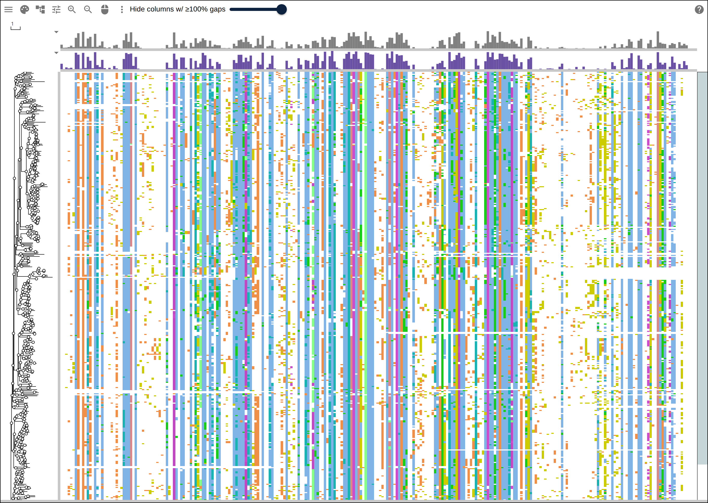
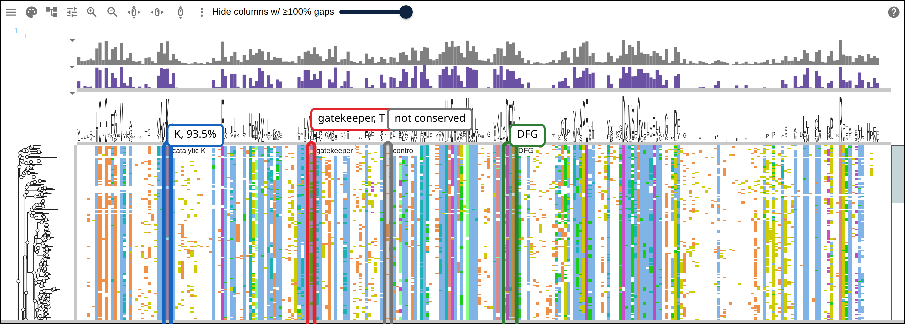
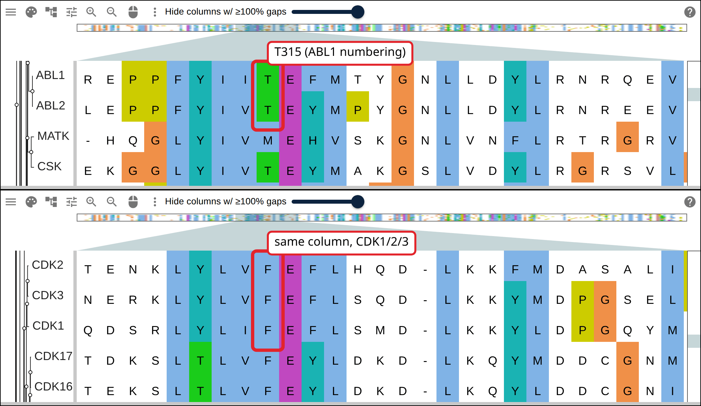

# Reading cross-reactivity off the kinase pocket

Imatinib was designed against one kinase, BCR-ABL1, and also inhibits half a
dozen others (KIT, PDGFRA, CSF1R, LCK) well enough to matter clinically. Every
human kinase folds the same ATP-binding pocket around the same three landmarks,
so a drug built to fit one kinase's pocket often fits several. This page aligns
that pocket across the whole human kinase family and compares the residues at
those landmarks between kinases imatinib inhibits and kinases it does not.

## Prerequisites

- `curl`, `python3`
- docker, to run HMMER and FastTree as biocontainers
  (`quay.io/biocontainers/hmmer`, `quay.io/biocontainers/fasttree`); both are
  also on `apt` and `brew`

## Where the data comes from

The kinase list and the sequences are UniProt's; the domain the alignment is
built on is Pfam's, as InterPro serves it.

- UniProt's own classification of the human and mouse kinomes, release 2026_03:
  https://www.uniprot.org/docs/pkinfam.txt
- One UniProt sequence per accession, batched through the `/stream` endpoint:
  https://rest.uniprot.org/uniprotkb/stream?query=accession:P00519&format=fasta
- The Pfam protein kinase domain HMM, PF00069, as InterPro serves it:
  https://www.ebi.ac.uk/interpro/api/entry/pfam/PF00069/?annotation=hmm
- The alignment, tree and row metadata the figures below load, hosted so they
  can link to it:
  https://gmod.org/JBrowseMSA/demo/data/kinase-pocket/kinase-pocket.afa
- its tree:
  https://gmod.org/JBrowseMSA/demo/data/kinase-pocket/kinase-pocket.nwk
- and its row metadata (kinase group, UniProt accession):
  https://gmod.org/JBrowseMSA/demo/data/kinase-pocket/kinase-pocket-metadata.json

## 1. Name the human kinome

UniProt has already grouped every human and mouse protein kinase by family.
Keeping the HUMAN entries and the group each one sits under is a few lines of
Python over the plain-text list:

<!-- from: scripts/build_kinase_pocket.sh -->

```python
import re

lines = open('pkinfam.txt').read().splitlines()
group = None
rows = []
i, n = 0, len(lines)
while i < n:
    line = lines[i]
    if re.fullmatch(r'=+', line.strip()) and i + 2 < n and re.fullmatch(r'=+', lines[i + 2].strip()):
        group = lines[i + 1].strip()
        i += 3
        continue
    m = re.match(r'^(\S+)\s+(\S+_HUMAN)\s+\((\w+)\s*\)', line)
    if m:
        gene, entry, acc = m.groups()
        rows.append((gene, acc, group))
    i += 1
print(len(rows))
```

```
512
```

512 entries across ten named groups (AGC, CAMK, CK1, CMGC, NEK, RGC, STE, TKL,
Tyr, Other) plus six small "Atypical" families that do not share the others'
fold. `Tyr` is the tyrosine kinases, ABL1 among them, and this page writes it as
`TK`, the name kinase biology usually uses for that group.

## 2. Fetch the sequences

The script fetches one UniProt sequence per accession, 50 accessions per
request:

<!-- from: scripts/build_kinase_pocket.sh -->

```python
import urllib.parse
import urllib.request

query = ' OR '.join(f'accession:{a}' for a in accessions[:50])
url = 'https://rest.uniprot.org/uniprotkb/stream?query=' + urllib.parse.quote(query) + '&format=fasta'
with urllib.request.urlopen(url) as resp:
    fasta_text = resp.read().decode()
```

The requests return 512 records for 512 accessions: every human kinase, full
length.

## 3. Align the kinase domain

A protein kinase carries regulatory regions, SH2/SH3 modules and transmembrane
spans outside its catalytic domain, and none of those line up across the family
the way the domain does. `hmmalign` against Pfam's Pkinase model (PF00069)
extracts the domain and puts every kinase's copy of it in the same 262 columns:

<!-- from: scripts/build_kinase_pocket.sh -->

```bash
curl -sf "https://www.ebi.ac.uk/interpro/api/entry/pfam/PF00069/?annotation=hmm" |
  gzip -dc > pf00069.hmm

# score every candidate first, and keep only what clears Pfam's own gathering
# threshold -- this is what drops the atypical, non-ePK-fold kinases
# (PI3/PI4-kinase, ADCK, alpha-type...) that would otherwise align to noise
docker run --rm -v "$PWD:/work" -w /work quay.io/biocontainers/hmmer:3.4--h7d74f8d_5 \
  hmmsearch --cut_ga --tblout hmmsearch.tbl -o hmmsearch.out pf00069.hmm all.fasta

docker run --rm -v "$PWD:/work" -w /work quay.io/biocontainers/hmmer:3.4--h7d74f8d_5 \
  hmmalign --trim --outformat afa -o kinase.afa pf00069.hmm kept.fasta
```

474 of the 512 entries clear the gathering threshold. Of the 38 that do not, 30
belong to the six "Atypical" families: PI3/PI4-kinases, ADCKs and the rest use a
related but different fold that this HMM does not model, so `hmmsearch` drops
them before alignment. `--trim` removes the unaligned tails outside the domain.
A following step strips the lowercase insert-state characters `hmmalign` leaves
in its `a2m` output, which reduces the alignment to the HMM's fixed 262 columns;
all 474 rows come out exactly that length.

[](https://gmod.org/JBrowseMSA/demo/?data=%7B%22msaview%22%3A%7B%22type%22%3A%22MsaView%22%2C%22height%22%3A960%2C%22treeAreaWidth%22%3A110%2C%22colWidth%22%3A4.6%2C%22rowHeight%22%3A2%2C%22drawLabels%22%3Afalse%2C%22colorSchemeName%22%3A%22clustalx_protein_dynamic%22%2C%22msaFilehandle%22%3A%7B%22uri%22%3A%22data%2Fkinase-pocket%2Fkinase-pocket.afa%22%7D%2C%22treeFilehandle%22%3A%7B%22uri%22%3A%22data%2Fkinase-pocket%2Fkinase-pocket.nwk%22%7D%2C%22treeMetadataFilehandle%22%3A%7B%22uri%22%3A%22data%2Fkinase-pocket%2Fkinase-pocket-metadata.json%22%7D%7D%7D)

All 474 kinase domains and the tree built from them, at full family scale. The
vertical bands are the columns every kinase agrees on; the ragged stretches
between them are the loops that make each kinase's pocket its own.

## 4. Build a tree

FastTree builds the tree:

<!-- from: scripts/build_kinase_pocket.sh -->

```bash
docker run --rm -v "$PWD:/work" -w /work quay.io/biocontainers/fasttree:2.2.0--h7b50bb2_1 \
  FastTree kinase-pocket.afa > kinase-pocket.nwk
```

```
Total time: 13.70 seconds  Unique: 474/474  Bad splits: 0/471
```

474 rows sits just under `maxNeighborJoiningRows`, the viewer's 500-sequence cap
on its built-in neighbor joining. That neighbor joining is a distance method
with no model of amino acid substitution. FastTree fits one, and on 474
sequences it is also the faster of the two. Past the cap, the app's error message points to
this page.

The tree orders the alignment's rows by clade, so neighboring rows are related
kinases. Clicking any tip opens a node-info dialog with its row metadata from
`kinase-pocket-metadata.json`: the UniProt accession and the kinase group (`TK`,
`CMGC` and so on) that later steps refer to by name.

## 5. Read off the pocket

Three landmarks define the ATP pocket in every kinase family: a catalytic lysine
that anchors ATP's phosphates, a gatekeeper that sets how much room the back
pocket has, and a DFG motif that switches the kinase between active and inactive
conformations. Imatinib resistance mutations are usually reported in ABL1
numbering, as K271, T315 and D381-F382-G383. ABL1 is a row in this alignment, so
walking its row gives the column of each landmark:

```python
# ABL1's own row, ungapped, tells you which alignment column holds which of
# its residues -- walk it once and you have all three landmarks
full_abl1 = uniprot_sequence['ABL1']  # 1130 aa, P00519
aligned_abl1 = alignment['ABL1']       # 262 columns
```

Column 30 holds ABL1's K271, column 77 its gatekeeper T315, and columns 141-143
its D381-F382-G383. A sequence logo across all 474 rows, with those three
columns and one column with nothing to do with the pocket called out:

[](<https://gmod.org/JBrowseMSA/demo/?data=%7B%22msaview%22%3A%7B%22type%22%3A%22MsaView%22%2C%22height%22%3A480%2C%22treeAreaWidth%22%3A110%2C%22colWidth%22%3A4.6%2C%22rowHeight%22%3A2%2C%22drawLabels%22%3Afalse%2C%22colorSchemeName%22%3A%22clustalx_protein_dynamic%22%2C%22turnedOffTracks%22%3A%7B%22sequence-logo%22%3Afalse%7D%2C%22highlights%22%3A%5B%7B%22start%22%3A30%2C%22end%22%3A30%2C%22label%22%3A%22catalytic%20K%22%2C%22color%22%3A%22rgba(21%2C101%2C192%2C0.25)%22%7D%2C%7B%22start%22%3A77%2C%22end%22%3A77%2C%22label%22%3A%22gatekeeper%22%2C%22color%22%3A%22rgba(227%2C36%2C43%2C0.25)%22%7D%2C%7B%22start%22%3A141%2C%22end%22%3A143%2C%22label%22%3A%22DFG%22%2C%22color%22%3A%22rgba(46%2C125%2C50%2C0.25)%22%7D%2C%7B%22start%22%3A102%2C%22end%22%3A102%2C%22label%22%3A%22control%22%2C%22color%22%3A%22rgba(117%2C117%2C117%2C0.25)%22%7D%5D%2C%22msaFilehandle%22%3A%7B%22uri%22%3A%22data%2Fkinase-pocket%2Fkinase-pocket.afa%22%7D%2C%22treeFilehandle%22%3A%7B%22uri%22%3A%22data%2Fkinase-pocket%2Fkinase-pocket.nwk%22%7D%2C%22treeMetadataFilehandle%22%3A%7B%22uri%22%3A%22data%2Fkinase-pocket%2Fkinase-pocket-metadata.json%22%7D%7D%7D>)

The catalytic lysine column is 93.5% K over all 474 rows. The control is the
column 25 residues to its right, which sits between the gatekeeper and the DFG
motif but is not one of the three landmarks. That column has no majority
residue: F, S, K, R, L and H each appear in double digits.

## 6. Compare the gatekeeper across two families

A small gatekeeper (threonine) leaves the back pocket open, and a bulkier one
(phenylalanine, methionine, leucine) fills it. Imatinib's known targets, ABL1,
ABL2, KIT, PDGFRA, CSF1R and LCK, all carry threonine at this position. The CDK
family, which imatinib does not inhibit, carries phenylalanine:

[](https://gmod.org/JBrowseMSA/demo/?data=%7B%22msaview%22%3A%7B%22type%22%3A%22MsaView%22%2C%22height%22%3A280%2C%22treeAreaWidth%22%3A110%2C%22colWidth%22%3A34%2C%22rowHeight%22%3A46%2C%22colorSchemeName%22%3A%22clustalx_protein_dynamic%22%2C%22turnedOffTracks%22%3A%7B%22conservation%22%3Atrue%2C%22property-conservation%22%3Atrue%7D%2C%22scrollX%22%3A-2312%2C%22scrollY%22%3A-4646%2C%22msaFilehandle%22%3A%7B%22uri%22%3A%22data%2Fkinase-pocket%2Fkinase-pocket.afa%22%7D%2C%22treeFilehandle%22%3A%7B%22uri%22%3A%22data%2Fkinase-pocket%2Fkinase-pocket.nwk%22%7D%2C%22treeMetadataFilehandle%22%3A%7B%22uri%22%3A%22data%2Fkinase-pocket%2Fkinase-pocket-metadata.json%22%7D%7D%7D)

([and the CDK1/2/3 view further down the same column](https://gmod.org/JBrowseMSA/demo/?data=%7B%22msaview%22%3A%7B%22type%22%3A%22MsaView%22%2C%22height%22%3A320%2C%22treeAreaWidth%22%3A110%2C%22colWidth%22%3A34%2C%22rowHeight%22%3A46%2C%22colorSchemeName%22%3A%22clustalx_protein_dynamic%22%2C%22turnedOffTracks%22%3A%7B%22conservation%22%3Atrue%2C%22property-conservation%22%3Atrue%7D%2C%22scrollX%22%3A-2312%2C%22scrollY%22%3A-12006%2C%22msaFilehandle%22%3A%7B%22uri%22%3A%22data%2Fkinase-pocket%2Fkinase-pocket.afa%22%7D%2C%22treeFilehandle%22%3A%7B%22uri%22%3A%22data%2Fkinase-pocket%2Fkinase-pocket.nwk%22%7D%2C%22treeMetadataFilehandle%22%3A%7B%22uri%22%3A%22data%2Fkinase-pocket%2Fkinase-pocket-metadata.json%22%7D%7D%7D))

Both views show the same alignment column in two row bands from the same tree.
ABL1 and ABL2 read threonine, and CDK1, CDK2 and CDK3 read phenylalanine. The
flanking rows are MATK and CSK in the first band and CDK16 and CDK17 in the
second. CDK16 and CDK17 carry threonine, although they sit next to CDK1-3 in the
tree.

## Check against the raw data

The script tallies the gatekeeper column across all 474 rows:

```python
from collections import Counter
counts = Counter(row[76] for row in alignment.values())  # column 77, 0-indexed
```

```
M  185  39.0%
T   90  19.0%
L   76  16.0%
F   69  14.6%
V   15   3.2%
```

Threonine, the small gatekeeper that imatinib and similar drugs reach past,
occurs in 19.0% of these human kinase domains. KLIFS curates an 85-residue
kinase pocket from solved structures, independently of this alignment, and puts
the same position at 18.4% threonine over its 521 human kinase entries (96 of
them). KLIFS' terms grant no license to redistribute, so this page hosts nothing
from it and queries its API live
(`https://klifs.net/api/kinase_information?species=Human`).

## Reproduce it end to end

```bash
curl -O https://raw.githubusercontent.com/GMOD/JBrowseMSA/main/docs/tutorials/scripts/build_kinase_pocket.sh
bash build_kinase_pocket.sh
```

With no arguments the script writes `kinase-pocket.afa`, `kinase-pocket.nwk` and
`kinase-pocket-metadata.json` in the working directory, printing every number
this page quotes. See [Prerequisites](#prerequisites) for what it needs on
`PATH`.

## See also

- [A protein family from a list of accessions](https://gmod.org/JBrowseMSA/tutorials/protein_family)
- [CLI](https://gmod.org/JBrowseMSA/cli)
- [User guide](https://gmod.org/JBrowseMSA/guide)
- [Data layers](https://gmod.org/JBrowseMSA/layers)

## References

- Manning G, Whyte DB, Martinez R, Hunter T, Sudarsanam S. The protein kinase
  complement of the human genome. _Science_ 298:1912-1934 (2002).
- Blum M, et al. InterPro: the protein sequence classification resource in 2025.
  _Nucleic Acids Research_ 53:D444-D456.
- Eddy SR. Accelerated profile HMM searches. _PLoS Computational Biology_
  7:e1002195 (2011).
- Price MN, Dehal PS, Arkin AP. FastTree 2: approximately maximum-likelihood
  trees for large alignments. _PLoS ONE_ 5:e9490 (2010).
- Kooistra AJ, Kanev GK, van Linden OP, Leurs R, de Esch IJ, de Graaf C. KLIFS:
  a structural kinase-ligand interaction database. _Nucleic Acids Research_
  44:D365-D371 (2016).
