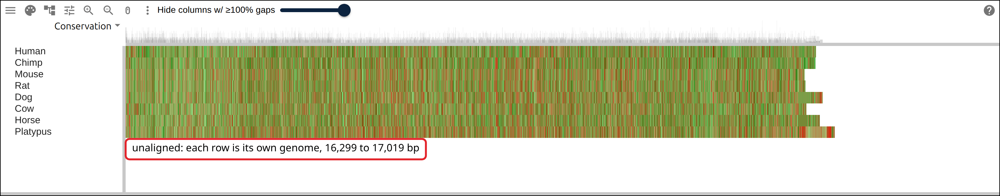
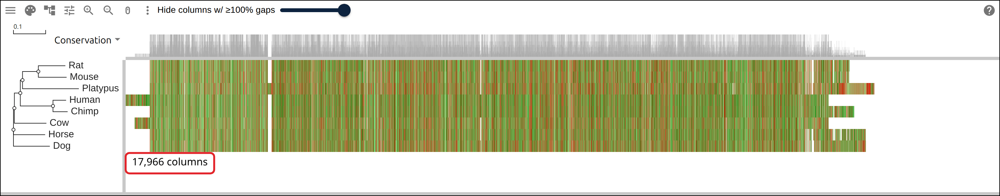
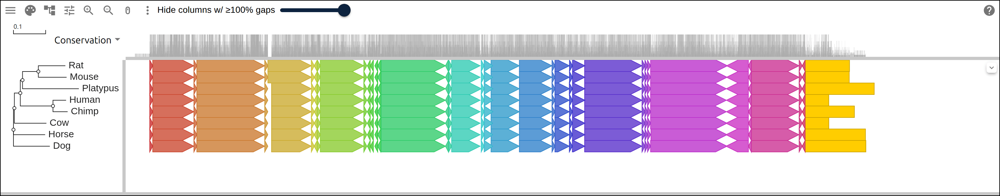
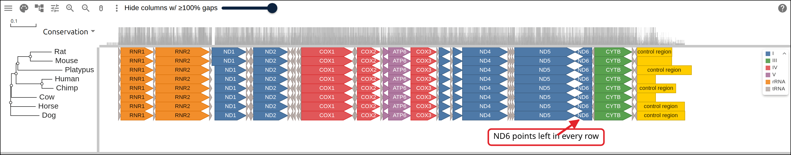
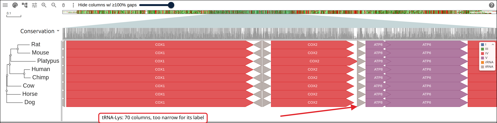
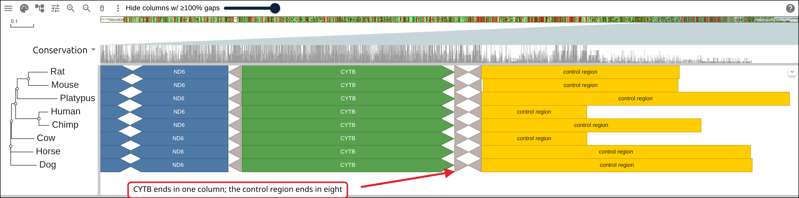
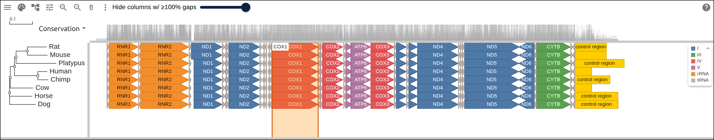

# Eight mitochondrial genomes and the genes on them

A mammal mitochondrial genome is about 16.5 kb and carries 37 genes: 13 protein
subunits of the respiratory chain, 2 rRNAs and 22 tRNAs, in an order shared
across the vertebrates. This page takes eight of them from RefSeq, aligns them,
and derives one GFF that names each gene, gives it a strand, and records the
respiratory complex its product belongs to. The viewer draws each gene as an
arrow in the alignment's columns, filled by complex and labeled by name.

## Prerequisites

- `curl`
- ClustalW, `apt install clustalw` on Debian or Ubuntu, `brew install clustal-w`
  on macOS. ClustalW both aligns and infers a tree, so this page needs no other
  aligner.
- Python 3, for the step that reshapes RefSeq's GFF3

Every figure below links to the live view it captured.

## Where the data comes from

Eight mammal mitochondrial genomes as RefSeq holds them, with RefSeq's own
annotation of each.

- one genome per accession:
  https://eutils.ncbi.nlm.nih.gov/entrez/eutils/efetch.fcgi?db=nuccore&id=NC_012920.1&rettype=fasta&retmode=text
- its annotation as GFF3:
  https://www.ncbi.nlm.nih.gov/sviewer/viewer.fcgi?id=NC_012920.1&report=gff3&retmode=text
- the eight genomes before alignment, right-padded to one width so the viewer
  opens them:
  https://gmod.org/JBrowseMSA/demo/data/mitogenome/mito-unaligned.afa
- the alignment the commands below write, hosted so the figures can link to it:
  https://gmod.org/JBrowseMSA/demo/data/mitogenome/mito.afa
- its tree: https://gmod.org/JBrowseMSA/demo/data/mitogenome/mito.nwk
- its genes: https://gmod.org/JBrowseMSA/demo/data/mitogenome/mito-genes.gff

Both endpoints serve one accession per request, so the eight genomes take eight
requests to each.

## The genomes

Write one RefSeq accession per line, followed by the label you want down the
side of the viewer. The label becomes the FASTA defline, the tree tip, and
column 1 of the gene GFF.

```
NC_012920.1	Human
NC_001643.1	Chimp
NC_005089.1	Mouse
NC_001665.2	Rat
NC_002008.4	Dog
NC_006853.1	Cow
NC_001640.1	Horse
NC_000891.1	Platypus
```

Save that as `mito-rows.tsv`. The separator is a tab.

Platypus is the outgroup here, and it keeps the gene order the other seven have.
Marsupial mitogenomes carry the five tRNAs between _ND2_ and _COX1_ in another
order, so an opossum row would put those five arrows somewhere else along its
own row.

## 1. Fetch the genomes and their annotations

```bash
while IFS=$'\t' read -r accession label; do
  curl -sf "https://eutils.ncbi.nlm.nih.gov/entrez/eutils/efetch.fcgi?db=nuccore&id=$accession&rettype=fasta&retmode=text" \
    -o "raw/$accession.fa"
  curl -sf "https://www.ncbi.nlm.nih.gov/sviewer/viewer.fcgi?id=$accession&report=gff3&retmode=text" \
    -o "raw/$accession.gff"
done < mito-rows.tsv
```

Count what came back before aligning it:

```
  Human        NC_012920.1  16569 bp  37 genes
  Chimp        NC_001643.1  16554 bp  37 genes
  Mouse        NC_005089.1  16299 bp  37 genes
  Rat          NC_001665.2  16313 bp  37 genes
  Dog          NC_002008.4  16727 bp  37 genes
  Cow          NC_006853.1  16338 bp  37 genes
  Horse        NC_001640.1  16660 bp  37 genes
  Platypus     NC_000891.1  17019 bp  37 genes
```

All eight have 37 genes. The lengths run 720 bp apart, from 16,299 in Mouse to
17,019 in Platypus, and most of that difference is in the control region.

The viewer opens the genomes as they come, once every row is the same length.
Right-pad the shorter ones to 17,019 and the eight load as a block.

[](https://gmod.org/JBrowseMSA/demo/#data=%7B%22msaview%22%3A%7B%22type%22%3A%22MsaView%22%2C%22height%22%3A300%2C%22treeAreaWidth%22%3A190%2C%22rowHeight%22%3A18%2C%22colWidth%22%3A0.065%2C%22msaFilehandle%22%3A%7B%22uri%22%3A%22data%2Fmitogenome%2Fmito-unaligned.afa%22%7D%7D%7D)

The eight genomes before alignment, one row each, colored by base. Every row
starts at position 1 and stops at its own length, which is the ragged right
edge. Rows are in file order, since no tree is loaded.

## 2. Align them and build a tree

```bash
clustalw -INFILE=mito.fasta -ALIGN -TYPE=DNA \
  -OUTPUT=FASTA -OUTFILE=mito.afa

# -TREE reads an existing alignment and writes neighbor-joining Newick;
# ClustalW wraps it across lines, and the viewer wants one string
clustalw -INFILE=mito.afa -TREE -TYPE=DNA -OUTPUTTREE=phylip
tr -d '[:space:]' < mito.ph > mito.nwk
```

Eight whole mitogenomes take about three minutes on a laptop. ClustalW reports
`Alignment Score 2191242` and 17,966 columns, 947 more than the longest input,
which is the room it made for insertions.

```
(((((Mouse:0.08782,Rat:0.08393):0.04922,Platypus:0.17510):0.00685,
(Human:0.04074,Chimp:0.04555):0.10155):0.01849,Cow:0.09959):0.00282,
Dog:0.11305,Horse:0.09847);
```

Platypus has the longest branch in the tree, 0.17510 where the rest run 0.04 to
0.11, and neighbor joining draws it next to the rodents. The tree here orders
the rows.

[](https://gmod.org/JBrowseMSA/demo/#data=%7B%22msaview%22%3A%7B%22type%22%3A%22MsaView%22%2C%22height%22%3A300%2C%22treeAreaWidth%22%3A190%2C%22rowHeight%22%3A18%2C%22colWidth%22%3A0.065%2C%22msaFilehandle%22%3A%7B%22uri%22%3A%22data%2Fmitogenome%2Fmito.afa%22%7D%2C%22treeFilehandle%22%3A%7B%22uri%22%3A%22data%2Fmitogenome%2Fmito.nwk%22%7D%7D%7D)

The alignment at 17,966 columns with the ClustalW tree beside it. The white
block at the left is columns 1 to 578, where only Human and Cow have sequence,
and the white at the right is the control region, which ends at a different
column in each row. Rat and Mouse are adjacent rows, Human and Chimp are
adjacent, and Platypus sits with the rodents on its long branch.

## 3. Derive the gene GFF

RefSeq's GFF3 has a `gene` line, an RNA or CDS line and an `exon` line per gene,
in that genome's coordinates and under that genome's accession. The viewer wants
one line per gene, under the row label, carrying the fields the marks read: the
name, the strand, an attribute naming the respiratory complex, and a `color=` on
the one feature that carries its own color.

The 13 protein genes are `ND1` to `ND6` and `ND4L` in complex I, `CYTB` in
complex III, `COX1` to `COX3` in complex IV, and `ATP6` with `ATP8` in complex
V:

```python
# the four complexes mtDNA encodes subunits of. Complex II is nuclear
COMPLEX = {'ND1': 'I', 'ND2': 'I', 'ND3': 'I', 'ND4': 'I', 'ND4L': 'I',
           'ND5': 'I', 'ND6': 'I', 'CYTB': 'III', 'COX1': 'IV', 'COX2': 'IV',
           'COX3': 'IV', 'ATP6': 'V', 'ATP8': 'V'}
```

`ND1`, `COX1`, `CYTB` and the other eleven are the gene `Name` in every RefSeq
mitogenome. The tRNA and rRNA genes carry a locus tag in five of the eight, so
the script names a tRNA from the `product` of its child feature (`tRNA-Phe`) and
the two rRNAs by their order along the genome (`RNR1`, `RNR2`). Each gene then
writes one line:

```python
print(f'{label}\tRefSeq\tgene\t{start}\t{end}\t.\t{strand}\t.'
      f'\tName={name};complex={klass}', file=out)
```

The control region is what follows the last gene, tRNA-Pro. RefSeq annotates it
as `D_loop` in six of the eight genomes, so the script derives it the same way
for all eight, and gives it a color of its own:

```python
print(f'{label}\tRefSeq\tD_loop\t{last + 1}\t{length}\t.\t.\t.'
      f'\tName=control region;color=255,205,0', file=out)
```

The first lines of the result:

```
##gff-version 3
Human	RefSeq	gene	577	647	.	+	.	Name=tRNA-Phe;complex=tRNA
Human	RefSeq	gene	648	1601	.	+	.	Name=RNR1;complex=rRNA
Human	RefSeq	gene	1602	1670	.	+	.	Name=tRNA-Val;complex=tRNA
Human	RefSeq	gene	1671	3229	.	+	.	Name=RNR2;complex=rRNA
Human	RefSeq	gene	3230	3304	.	+	.	Name=tRNA-Leu-1;complex=tRNA
Human	RefSeq	gene	3307	4262	.	+	.	Name=ND1;complex=I
```

and what it holds:

```
  I: 56
  III: 8
  IV: 24
  V: 16
  rRNA: 16
  tRNA: 176
  control region: 8
```

304 features over eight rows: 37 genes and one control region per genome.
Positions are 1-based in each genome's own sequence, and the viewer projects
them through that row's gaps.

[](https://gmod.org/JBrowseMSA/demo/#data=%7B%22msaview%22%3A%7B%22type%22%3A%22MsaView%22%2C%22height%22%3A300%2C%22treeAreaWidth%22%3A190%2C%22rowHeight%22%3A18%2C%22colWidth%22%3A0.065%2C%22showDomainLegend%22%3Afalse%2C%22msaFilehandle%22%3A%7B%22uri%22%3A%22data%2Fmitogenome%2Fmito.afa%22%7D%2C%22treeFilehandle%22%3A%7B%22uri%22%3A%22data%2Fmitogenome%2Fmito.nwk%22%7D%2C%22gffFilehandle%22%3A%7B%22uri%22%3A%22data%2Fmitogenome%2Fmito-genes.gff%22%7D%7D%7D)

The three files open, with the overlay coloring each span by its accession: the
38 names in the file each take a color off the palette, and one band of color
runs down all eight rows per gene. The control region at the right is gold in
every row, because its color=255,205,0 sets the color of that feature.

## 4. Fill the arrows by respiratory complex

`featureFill` names the field the overlay colors each span by, and a `map` scale
gives each value of that field a color. Six values appear in the file, so the
map has six entries:

```json
"encodings": [
  {
    "channel": "featureFill",
    "field": "complex",
    "scale": {
      "map": {
        "I": "#4e79a7",
        "III": "#59a14f",
        "IV": "#e15759",
        "V": "#b07aa1",
        "rRNA": "#f28e2b",
        "tRNA": "#bab0ac"
      }
    }
  },
  { "channel": "featureLabel", "field": "Name" }
]
```

[](https://gmod.org/JBrowseMSA/demo/#data=%7B%22msaview%22%3A%7B%22type%22%3A%22MsaView%22%2C%22height%22%3A300%2C%22treeAreaWidth%22%3A190%2C%22rowHeight%22%3A18%2C%22colWidth%22%3A0.065%2C%22encodings%22%3A%5B%7B%22channel%22%3A%22featureFill%22%2C%22field%22%3A%22complex%22%2C%22scale%22%3A%7B%22map%22%3A%7B%22I%22%3A%22%234e79a7%22%2C%22III%22%3A%22%2359a14f%22%2C%22IV%22%3A%22%23e15759%22%2C%22V%22%3A%22%23b07aa1%22%2C%22rRNA%22%3A%22%23f28e2b%22%2C%22tRNA%22%3A%22%23bab0ac%22%7D%7D%7D%2C%7B%22channel%22%3A%22featureLabel%22%2C%22field%22%3A%22Name%22%7D%5D%2C%22msaFilehandle%22%3A%7B%22uri%22%3A%22data%2Fmitogenome%2Fmito.afa%22%7D%2C%22treeFilehandle%22%3A%7B%22uri%22%3A%22data%2Fmitogenome%2Fmito.nwk%22%7D%2C%22gffFilehandle%22%3A%7B%22uri%22%3A%22data%2Fmitogenome%2Fmito-genes.gff%22%7D%7D%7D)

All 17,966 columns in the frame, each gene an arrow. The two orange rRNAs open
every row, the blue complex I genes and the red COX genes alternate across the
middle, purple ATP6 and ATP8 sit between COX2 and COX3, green CYTB is second
from the right, and the grey tRNAs punctuate the lot. The legend lists the six
values the scale colors. ND6 and eight tRNAs carry their arrowheads on the left,
which is the minus strand of column 7 of the GFF. The control regions keep the
gold their own color= gives them, and they are the only features the legend has
no entry for.

The legend has no entry for complex II. All four of its subunits are encoded in
the nucleus, so no line in the file carries `complex=II`, and a `map` entry for
a value the data never takes would draw nothing.

## 5. Read the gene names off the arrows

`featureLabel` names the field drawn inside each span. The viewer draws the
label wherever the text fits inside the arrow's body, so how many labels appear
follows the column width.

[](https://gmod.org/JBrowseMSA/demo/#data=%7B%22msaview%22%3A%7B%22type%22%3A%22MsaView%22%2C%22height%22%3A380%2C%22treeAreaWidth%22%3A190%2C%22rowHeight%22%3A26%2C%22colWidth%22%3A0.38%2C%22scrollX%22%3A-2318%2C%22encodings%22%3A%5B%7B%22channel%22%3A%22featureFill%22%2C%22field%22%3A%22complex%22%2C%22scale%22%3A%7B%22map%22%3A%7B%22I%22%3A%22%234e79a7%22%2C%22III%22%3A%22%2359a14f%22%2C%22IV%22%3A%22%23e15759%22%2C%22V%22%3A%22%23b07aa1%22%2C%22rRNA%22%3A%22%23f28e2b%22%2C%22tRNA%22%3A%22%23bab0ac%22%7D%7D%7D%2C%7B%22channel%22%3A%22featureLabel%22%2C%22field%22%3A%22Name%22%7D%5D%2C%22msaFilehandle%22%3A%7B%22uri%22%3A%22data%2Fmitogenome%2Fmito.afa%22%7D%2C%22treeFilehandle%22%3A%7B%22uri%22%3A%22data%2Fmitogenome%2Fmito.nwk%22%7D%2C%22gffFilehandle%22%3A%7B%22uri%22%3A%22data%2Fmitogenome%2Fmito-genes.gff%22%7D%7D%7D)

From column 6,100 at 0.38 pixels per column: COX1, COX2, ATP8 and ATP6 read
their names off the arrows in all eight rows. The three grey tRNAs between them
are 69 to 70 columns wide, 27 pixels at this width and narrower than their
labels, so they draw none. At one pixel per column tRNA-Lys carries its name.

The label is a data channel, so it draws whether or not the residue letters do.
At 0.38 pixels per column there are no letters on screen at all.

## 6. Where each gene lands

Each row's positions are its own, and the overlay projects them through that
row's gaps before drawing. _COX1_ starts at a different base in all eight
genomes and at one column in all eight:

```
COX1:
  Human     bp   5904 -> columns 6134-7676
  Chimp     bp   5321 -> columns 6134-7676
  Mouse     bp   5328 -> columns 6134-7679
  Rat       bp   5323 -> columns 6134-7679
  Dog       bp   5349 -> columns 6134-7679
  Cow       bp   5687 -> columns 6134-7679
  Horse     bp   5362 -> columns 6134-7679
  Platypus  bp   5389 -> columns 6134-7675
```

Human 5,904 and Chimp 5,321 are 583 bases apart, and both start in column 6,134.
The same projection for all 15 named genes, as the spread between the leftmost
row and the rightmost:

```
feature          start spread end spread
RNR1                        1          0
RNR2                        0          0
ND1                        88          4
ND2                         0          2
COX1                        0          4
COX2                        0         31
ATP8                        0          6
ATP6                        0          0
COX3                        0          3
ND3                         0          6
ND4L                        4          0
ND4                         0          0
ND5                         9         26
ND6                        13          0
CYTB                        0          5
control region             10       1091
22 tRNAs: worst start-column spread 5
```

Ten of the 15 start in one column in every row. _ND1_ has the widest spread at
88: Mouse and Rat put its first base in column 3,414 and its second in column
3,503, where the other six start in column 3,502.

The control region is the last line of that table. Its end spread is 1,091
columns where no gene's exceeds 31, and the eight right edges land on eight
different columns: Human at 16,875, Cow at 16,876, Mouse at 17,366, Rat at
17,373, Chimp at 17,490, Horse at 17,756, Dog at 17,765 and Platypus at 17,966.

[](https://gmod.org/JBrowseMSA/demo/#data=%7B%22msaview%22%3A%7B%22type%22%3A%22MsaView%22%2C%22height%22%3A380%2C%22treeAreaWidth%22%3A190%2C%22rowHeight%22%3A26%2C%22colWidth%22%3A0.363%2C%22scrollX%22%3A-5176%2C%22showDomainLegend%22%3Afalse%2C%22encodings%22%3A%5B%7B%22channel%22%3A%22featureFill%22%2C%22field%22%3A%22complex%22%2C%22scale%22%3A%7B%22map%22%3A%7B%22I%22%3A%22%234e79a7%22%2C%22III%22%3A%22%2359a14f%22%2C%22IV%22%3A%22%23e15759%22%2C%22V%22%3A%22%23b07aa1%22%2C%22rRNA%22%3A%22%23f28e2b%22%2C%22tRNA%22%3A%22%23bab0ac%22%7D%7D%7D%2C%7B%22channel%22%3A%22featureLabel%22%2C%22field%22%3A%22Name%22%7D%5D%2C%22msaFilehandle%22%3A%7B%22uri%22%3A%22data%2Fmitogenome%2Fmito.afa%22%7D%2C%22treeFilehandle%22%3A%7B%22uri%22%3A%22data%2Fmitogenome%2Fmito.nwk%22%7D%2C%22gffFilehandle%22%3A%7B%22uri%22%3A%22data%2Fmitogenome%2Fmito-genes.gff%22%7D%7D%7D)

The last 3,700 columns. ND6 carries its arrowhead on the left in all eight rows,
CYTB starts and ends on one column in all eight, and the gold control regions
end on eight different columns, the longest 1,091 columns right of the shortest.

## 7. Share the view

The three files go in the alignment, tree and annotation slots of the
[import form](https://gmod.org/JBrowseMSA/demo/), as local files or as URLs. To
put the whole view in a link, name the URLs and carry the encodings in the
snapshot:

```json
{
  "msaview": {
    "type": "MsaView",
    "colWidth": 0.065,
    "msaFilehandle": { "uri": "https://example.org/mito.afa" },
    "treeFilehandle": { "uri": "https://example.org/mito.nwk" },
    "gffFilehandle": { "uri": "https://example.org/mito-genes.gff" },
    "encodings": [
      {
        "channel": "featureFill",
        "field": "complex",
        "scale": {
          "map": {
            "I": "#4e79a7",
            "III": "#59a14f",
            "IV": "#e15759",
            "V": "#b07aa1",
            "rRNA": "#f28e2b",
            "tRNA": "#bab0ac"
          }
        }
      },
      { "channel": "featureLabel", "field": "Name" }
    ],
    "highlights": [{ "start": 6134, "end": 7679, "label": "COX1" }]
  }
}
```

URL-encode that and append it to the app as `#data=`. The link carries the
addresses of the files, so it works at any size. `highlights` takes 1-based
inclusive columns, and the COX1 span above is the one the projection printed.

[](https://gmod.org/JBrowseMSA/demo/#data=%7B%22msaview%22%3A%7B%22type%22%3A%22MsaView%22%2C%22height%22%3A300%2C%22treeAreaWidth%22%3A190%2C%22rowHeight%22%3A18%2C%22colWidth%22%3A0.065%2C%22encodings%22%3A%5B%7B%22channel%22%3A%22featureFill%22%2C%22field%22%3A%22complex%22%2C%22scale%22%3A%7B%22map%22%3A%7B%22I%22%3A%22%234e79a7%22%2C%22III%22%3A%22%2359a14f%22%2C%22IV%22%3A%22%23e15759%22%2C%22V%22%3A%22%23b07aa1%22%2C%22rRNA%22%3A%22%23f28e2b%22%2C%22tRNA%22%3A%22%23bab0ac%22%7D%7D%7D%2C%7B%22channel%22%3A%22featureLabel%22%2C%22field%22%3A%22Name%22%7D%5D%2C%22highlights%22%3A%5B%7B%22start%22%3A6134%2C%22end%22%3A7679%2C%22label%22%3A%22COX1%22%7D%5D%2C%22msaFilehandle%22%3A%7B%22uri%22%3A%22data%2Fmitogenome%2Fmito.afa%22%7D%2C%22treeFilehandle%22%3A%7B%22uri%22%3A%22data%2Fmitogenome%2Fmito.nwk%22%7D%2C%22gffFilehandle%22%3A%7B%22uri%22%3A%22data%2Fmitogenome%2Fmito-genes.gff%22%7D%7D%7D)

What that link opens: the three hosted files, the arrows filled by complex and
labeled by name, and columns 6,134 to 7,679 banded and labeled COX1 across all
eight rows.

The band covers the columns the projection put _COX1_ in. RefSeq's GFF3 gives
its position in the human genome:

```bash
grep -P '\tgene\t' raw/NC_012920.1.gff | grep 'Name=COX1'
```

```
NC_012920.1	RefSeq	gene	5904	7445	.	+	.	ID=gene-COX1;Dbxref=GeneID:4512,HGNC:HGNC:7419,MIM:516030;Name=COX1;gbkey=Gene;gene=COX1;gene_biotype=protein_coding;gene_synonym=COI,MTCO1
```

```bash
grep -P '^Human\t' mito-genes.gff | grep 'Name=COX1;'
```

```
Human	RefSeq	gene	5904	7445	.	+	.	Name=COX1;complex=IV
```

5904 to 7445 on the plus strand in both files.

## Reproduce it end to end

```bash
curl -O https://raw.githubusercontent.com/GMOD/JBrowseMSA/main/docs/tutorials/scripts/build_mitogenome_genes.sh
bash build_mitogenome_genes.sh
```

With no arguments the script writes the accession list above and builds the
files beside it, printing every number this page quotes. Point it at your own
list of RefSeq mitochondrial genomes to do the same for another set:

```bash
bash build_mitogenome_genes.sh my-rows.tsv out/
```

## See also

- [Data layers](https://gmod.org/JBrowseMSA/layers)
- [User guide](https://gmod.org/JBrowseMSA/guide)
- [A protein family from a list of accessions](https://gmod.org/JBrowseMSA/tutorials/protein_family)

## References

- Anderson S, et al. Sequence and organization of the human mitochondrial
  genome. _Nature_ 290:457-465.
- Boore JL. Animal mitochondrial genomes. _Nucleic Acids Research_ 27:1767-1780.
- O'Leary NA, et al. Reference sequence (RefSeq) database at NCBI. _Nucleic
  Acids Research_ 44:D733-D745.
- Larkin MA, et al. Clustal W and Clustal X version 2.0. _Bioinformatics_
  23:2947-2948.
