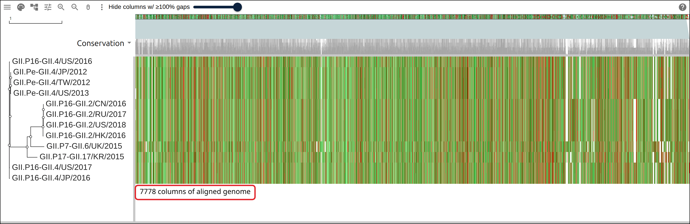
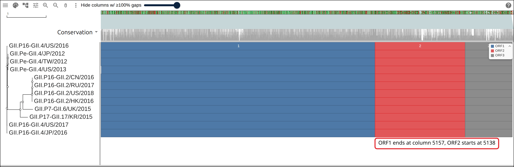
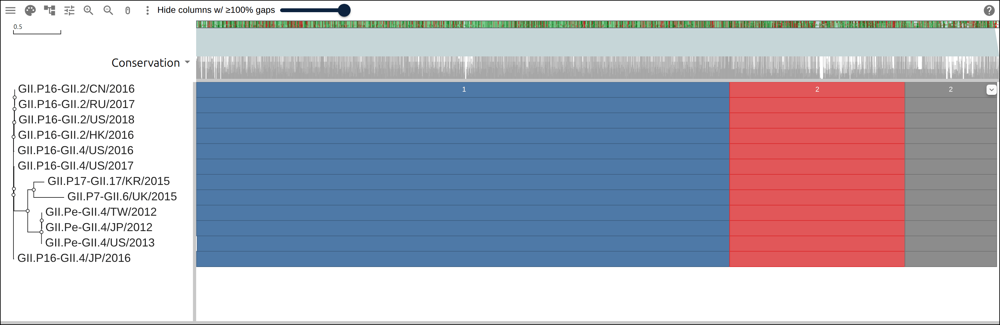
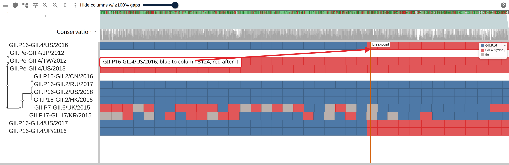
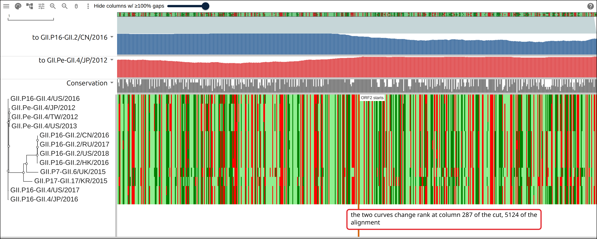
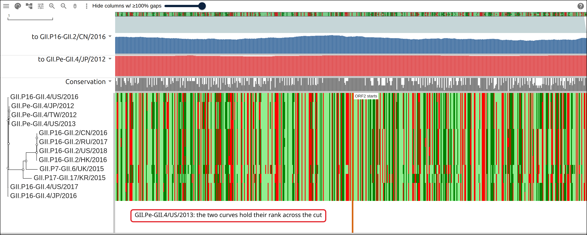
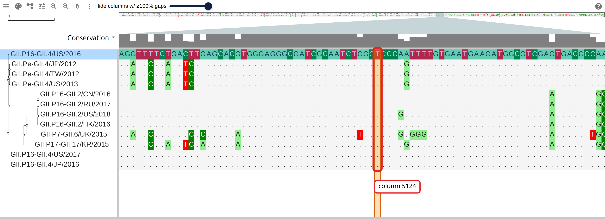
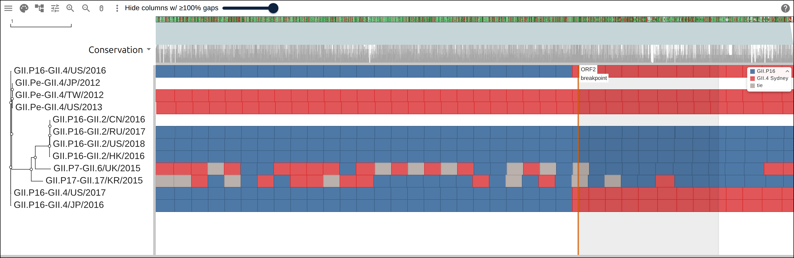

# Recombination at the norovirus ORF1/ORF2 junction

Norovirus GII carries two genotype names, one for its polymerase and one for its
capsid, so a GII.P16-GII.4 Sydney genome has the polymerase of GII.P16 and the
capsid of GII.4 Sydney. The two halves meet at the ORF1/ORF2 junction, where the
nonstructural polyprotein ends and VP1 begins. This page takes twelve complete
GII genomes, aligns them whole, builds one tree from the ORF1 columns and
another from the ORF2 columns, and reads the join off the column where a
GII.P16-GII.4 row stops matching one parent and starts matching the other.
GII.Pe-GII.4/US/2013 is the control: a row of the capsid donor's own genotype,
which reads the same parent on both sides of the junction.

## Prerequisites

- `curl`
- Docker, which the script uses to run MAFFT 7.525 and FastTree 2.2.0 from their
  biocontainers images. Nothing else is installed.
- Python 3, standard library only

Every figure below links to the live view it captured.

## Where the data comes from

Twelve norovirus GII genomes as GenBank holds them, sequence and annotation
both.

- all twelve genomes, one request:
  https://eutils.ncbi.nlm.nih.gov/entrez/eutils/efetch.fcgi?db=nuccore&id=MK773584.1,MK762638.1,LC175468.1,NC_039476.1,KY771081.1,MK752935.1,MG892974.3,KJ196281.1,KJ196296.1,KY486271.1,NC_040876.1,NC_039475.1&rettype=fasta&retmode=text
- the same twelve as GenBank flatfiles, which carry the CDS spans:
  https://eutils.ncbi.nlm.nih.gov/entrez/eutils/efetch.fcgi?db=nuccore&id=MK773584.1,MK762638.1,LC175468.1,NC_039476.1,KY771081.1,MK752935.1,MG892974.3,KJ196281.1,KJ196296.1,KY486271.1,NC_040876.1,NC_039475.1&rettype=gb&retmode=text
- the row table the commands below start from, hosted so the figures can link to
  it: https://gmod.org/JBrowseMSA/demo/data/norovirus/noro-rows.tsv
- the alignment they write:
  https://gmod.org/JBrowseMSA/demo/data/norovirus/noro.afa
- the tree from the ORF1 columns:
  https://gmod.org/JBrowseMSA/demo/data/norovirus/noro-orf1.nwk
- the tree from the ORF2 columns:
  https://gmod.org/JBrowseMSA/demo/data/norovirus/noro-orf2.nwk
- the three ORFs of every genome:
  https://gmod.org/JBrowseMSA/demo/data/norovirus/noro-orfs.gff
- each row's closer parent in 200-base windows:
  https://gmod.org/JBrowseMSA/demo/data/norovirus/noro-parents.gff
- the 600 columns either side of the junction:
  https://gmod.org/JBrowseMSA/demo/data/norovirus/noro-junction.afa
- the identity tracks, the layers the links below carry:
  https://gmod.org/JBrowseMSA/demo/data/norovirus/noro-layers.json

## 1. Name the rows

Write one genome per line: the label the viewer draws, the GenBank accession,
and the genotype the record's own isolate name or note carries. The label
becomes the FASTA defline, the tree tip and the GFF seq_id.

```
GII.P16-GII.4/US/2016	MK773584.1	GII.P16-GII.4 Sydney
GII.P16-GII.4/US/2017	MK762638.1	GII.P16-GII.4 Sydney
GII.P16-GII.4/JP/2016	LC175468.1	GII.P16_GII.4_Sydney2012
GII.P16-GII.2/CN/2016	NC_039476.1	GII.P16-GII.2
GII.P16-GII.2/HK/2016	KY771081.1	GII.P16_GII.2
GII.P16-GII.2/US/2018	MK752935.1	GII.P16-GII.2
GII.P16-GII.2/RU/2017	MG892974.3	GII.P16-GII.2
GII.Pe-GII.4/JP/2012	KJ196281.1	GII.Pe_GII.4_Sydney2012
GII.Pe-GII.4/TW/2012	KJ196296.1	GII.Pe_GII.4_Sydney2012
GII.Pe-GII.4/US/2013	KY486271.1	GII.Pe-GII.4-Sydney
GII.P7-GII.6/UK/2015	NC_040876.1	GII.P7_GII.6
GII.P17-GII.17/KR/2015	NC_039475.1	GII.P17_GII.17
```

Four groups sit in that table. The three GII.P16-GII.4 rows are the recombinant
genotype the page reads. The four GII.P16-GII.2 rows share its polymerase, and
GII.P16-GII.2/CN/2016 stands for them as the polymerase donor. The three
GII.Pe-GII.4 rows share its capsid, and GII.Pe-GII.4/JP/2012 stands for them as
the capsid donor. GII.P7-GII.6/UK/2015 and GII.P17-GII.17/KR/2015 belong to
neither, and every window of those two rows is scored against both parents like
the rest.

## 2. Fetch the genomes and their ORFs

Two `efetch` requests take all twelve accessions, one for the sequences and one
for the GenBank flatfiles:

```bash
ids=$(awk -F'\t' '{printf "%s%s", sep, $2; sep=","}' noro-rows.tsv)
curl -sf "https://eutils.ncbi.nlm.nih.gov/entrez/eutils/efetch.fcgi?db=nuccore&id=$ids&rettype=fasta&retmode=text" -o noro-ncbi.fasta
curl -sf "https://eutils.ncbi.nlm.nih.gov/entrez/eutils/efetch.fcgi?db=nuccore&id=$ids&rettype=gb&retmode=text" -o noro-ncbi.gb
```

A norovirus record annotates three CDS features, and they come in genome order:
the nonstructural polyprotein of ORF1, VP1 of ORF2 and VP2 of ORF3. One regular
expression over the flatfile reads their spans, and they go into the GFF in the
genome's own coordinates:

```python
spans = re.findall(r'^     CDS             (\d+)\.\.(\d+)$', record, re.M)
```

```
  GII.P16-GII.4/US/2016   MK773584.1   7559 nt  ORF1 5-5104  ORF2 5085-6707  ORF3 6707-7513  GII.P16-GII.4 Sydney
  GII.P16-GII.4/US/2017   MK762638.1   7563 nt  ORF1 5-5104  ORF2 5085-6707  ORF3 6707-7513  GII.P16-GII.4 Sydney
  GII.P16-GII.4/JP/2016   LC175468.1   7570 nt  ORF1 5-5104  ORF2 5085-6707  ORF3 6707-7513  GII.P16_GII.4_Sydney2012
  GII.P16-GII.2/CN/2016   NC_039476.1  7536 nt  ORF1 5-5104  ORF2 5085-6713  ORF3 6713-7492  GII.P16-GII.2
  GII.P16-GII.2/HK/2016   KY771081.1   7546 nt  ORF1 5-5104  ORF2 5085-6713  ORF3 6713-7492  GII.P16_GII.2
  GII.P16-GII.2/US/2018   MK752935.1   7536 nt  ORF1 5-5104  ORF2 5085-6713  ORF3 6713-7492  GII.P16-GII.2
  GII.P16-GII.2/RU/2017   MG892974.3   7553 nt  ORF1 1-5100  ORF2 5081-6709  ORF3 6709-7488  GII.P16-GII.2
  GII.Pe-GII.4/JP/2012    KJ196281.1   7559 nt  ORF1 5-5104  ORF2 5085-6707  ORF3 6707-7513  GII.Pe_GII.4_Sydney2012
  GII.Pe-GII.4/TW/2012    KJ196296.1   7560 nt  ORF1 5-5104  ORF2 5085-6707  ORF3 6707-7513  GII.Pe_GII.4_Sydney2012
  GII.Pe-GII.4/US/2013    KY486271.1   7551 nt  ORF1 1-5094  ORF2 5075-6697  ORF3 6697-7503  GII.Pe-GII.4-Sydney
  GII.P7-GII.6/UK/2015    NC_040876.1  7521 nt  ORF1 5-5098  ORF2 5079-6722  ORF3 6722-7498  GII.P7_GII.6
  GII.P17-GII.17/KR/2015  NC_039475.1  7556 nt  ORF1 5-5113  ORF2 5094-6716  ORF3 6716-7495  GII.P17_GII.17
```

```
ORF1 and ORF2 overlap by 20 bases
```

The genomes run 7,521 to 7,570 bases. ORF1 ends 20 bases after ORF2 begins in
all twelve, so the two reading frames share 20 bases at the junction.

## 3. Align the twelve genomes

MAFFT picks its own strategy under `--auto`, and for twelve sequences of 7.5 kb
it picks FFT-NS-2:

```bash
docker run --rm -v "$PWD:/work" -w /work quay.io/biocontainers/mafft:7.525--h031d066_1 \
  mafft --auto --quiet --preservecase noro.fasta > noro.afa
```

```
12 rows, 7778 columns, 2726 gap characters
```

The twelve genomes take 7,778 columns between them, 208 more than the longest
genome, and 2,726 gap characters spread over the twelve rows.

[](https://gmod.org/JBrowseMSA/demo/?data=%7B%22msaview%22%3A%7B%22type%22%3A%22MsaView%22%2C%22height%22%3A500%2C%22treeAreaWidth%22%3A300%2C%22rowHeight%22%3A24%2C%22colWidth%22%3A0.162%2C%22msaFilehandle%22%3A%7B%22uri%22%3A%22data%2Fnorovirus%2Fnoro.afa%22%7D%2C%22treeFilehandle%22%3A%7B%22uri%22%3A%22data%2Fnorovirus%2Fnoro-orf2.nwk%22%7D%7D%7D)

Twelve norovirus genomes as one alignment beside the tree from their ORF2
columns. The conservation track above the rows runs high across the genome and
dips where the twelve disagree, and the GII.P7-GII.6/UK/2015 and
GII.P17-GII.17/KR/2015 rows carry the most of those disagreements.

## 4. The ORFs on every row

The GFF from step 2 carries each genome's three ORFs in that genome's own
coordinates, so the viewer draws every row's own spans and the indels between
the rows shift them apart.

[](https://gmod.org/JBrowseMSA/demo/?data=%7B%22msaview%22%3A%7B%22type%22%3A%22MsaView%22%2C%22height%22%3A500%2C%22treeAreaWidth%22%3A300%2C%22rowHeight%22%3A24%2C%22colWidth%22%3A0.162%2C%22msaFilehandle%22%3A%7B%22uri%22%3A%22data%2Fnorovirus%2Fnoro.afa%22%7D%2C%22treeFilehandle%22%3A%7B%22uri%22%3A%22data%2Fnorovirus%2Fnoro-orf2.nwk%22%7D%2C%22gffFilehandle%22%3A%7B%22uri%22%3A%22data%2Fnorovirus%2Fnoro-orfs.gff%22%7D%2C%22encodings%22%3A%5B%7B%22channel%22%3A%22featureFill%22%2C%22field%22%3A%22Name%22%2C%22scale%22%3A%7B%22map%22%3A%7B%22ORF1%22%3A%22%234e79a7%22%2C%22ORF2%22%3A%22%23e15759%22%2C%22ORF3%22%3A%22%238c8c8c%22%7D%7D%7D%5D%7D%7D)

The same alignment with each row's three ORFs as boxes: ORF1 blue, ORF2 red and
ORF3 grey. The twelve rows put their ORF1/ORF2 boundary within a few columns of
each other, so one column number serves the whole set.

Reading the columns of one row turns those spans into column ranges for the
alignment. GII.P16-GII.4/US/2016 is the row the rest of the page scans, and the
columns of its ORFs bound the two per-ORF alignments the trees come from:

```python
col_of_ref = [i for i, c in enumerate(seqs[REFERENCE]) if c != '-']
orf1 = (col(ref['ORF1'][0]), col(ref['ORF1'][1]))
orf2 = (col(ref['ORF2'][0]), col(ref['ORF2'][1]))
junction = (orf2[0] - FLANK, orf2[0] + FLANK)
```

```
in the alignment, GII.P16-GII.4/US/2016 has ORF1 in columns 5-5157 and ORF2 in columns 5138-6826
the junction cut is columns 4838-5437, 300 columns either side of the first base of ORF2
```

## 5. A tree per ORF

FastTree runs twice, once on the ORF1 columns and once on the ORF2 columns:

```bash
for orf in orf1 orf2; do
  docker run --rm -v "$PWD:/work" -w /work quay.io/biocontainers/fasttree:2.2.0--h7b50bb2_1 \
    FastTree -nt -gtr -quiet -nosupport "noro-$orf.afa" > "noro-$orf.nwk"
done
```

The two trees place GII.P16-GII.4/US/2016 differently. In the ORF1 tree it is
the sister of the clade holding all four GII.P16-GII.2 rows, and the three
GII.Pe-GII.4 rows sit behind a stem branch of 0.146. In the ORF2 tree its
nearest neighbors are those three GII.Pe-GII.4 rows, 0.0093 away, and the
GII.P16-GII.2 rows sit behind a branch of 0.323.

[](https://gmod.org/JBrowseMSA/demo/?data=%7B%22msaview%22%3A%7B%22type%22%3A%22MsaView%22%2C%22height%22%3A500%2C%22treeAreaWidth%22%3A300%2C%22rowHeight%22%3A24%2C%22colWidth%22%3A0.162%2C%22msaFilehandle%22%3A%7B%22uri%22%3A%22data%2Fnorovirus%2Fnoro.afa%22%7D%2C%22treeFilehandle%22%3A%7B%22uri%22%3A%22data%2Fnorovirus%2Fnoro-orf1.nwk%22%7D%2C%22gffFilehandle%22%3A%7B%22uri%22%3A%22data%2Fnorovirus%2Fnoro-orfs.gff%22%7D%2C%22encodings%22%3A%5B%7B%22channel%22%3A%22featureFill%22%2C%22field%22%3A%22Name%22%2C%22scale%22%3A%7B%22map%22%3A%7B%22ORF1%22%3A%22%234e79a7%22%2C%22ORF2%22%3A%22%23e15759%22%2C%22ORF3%22%3A%22%238c8c8c%22%7D%7D%7D%5D%2C%22showDomainLegend%22%3Afalse%7D%7D)

The same alignment under the ORF1 tree, which draws GII.P16-GII.4/US/2016 and
GII.P16-GII.4/US/2017 directly under the four GII.P16-GII.2 rows. The ORF2 tree
of the two figures above draws GII.P16-GII.4/US/2016 directly above the three
GII.Pe-GII.4 rows.

## 6. Which parent each row is closer to

Percent identity over a span counts the columns where both rows carry a base:

```python
def identity(query, subject, start, end):
    q, s = seqs[query], seqs[subject]
    both = matches = 0
    for i in range(start, end):
        if q[i] != '-' and s[i] != '-':
            both += 1
            matches += q[i] == s[i]
    return 100 * matches / both if both else 0
```

Over a whole ORF, that one number already separates the two parents:

```
GII.P16-GII.4/US/2016   ORF1  98.0% to GII.P16-GII.2/CN/2016,  77.5% to GII.Pe-GII.4/JP/2012   ORF2  64.8% and  96.3%
GII.Pe-GII.4/US/2013    ORF1  77.5% to GII.P16-GII.2/CN/2016,  98.8% to GII.Pe-GII.4/JP/2012   ORF2  64.4% and  98.6%
```

The recombinant reads 98.0% to the polymerase donor over ORF1 and 96.3% to the
capsid donor over ORF2, and 64.8% to the polymerase donor over ORF2. The control
reads the capsid donor at 98.8% and 98.6% over the two ORFs.

Running the same number in 200-base windows along every row gives a GFF the
overlay colors by which parent won the window:

```python
closer, color = (
    ('GII.P16', A_COLOR) if a - b > 1
    else ('GII.4 Sydney', B_COLOR) if b - a > 1
    else ('tie', TIE_COLOR)
)
```

[](https://gmod.org/JBrowseMSA/demo/?data=%7B%22msaview%22%3A%7B%22type%22%3A%22MsaView%22%2C%22height%22%3A500%2C%22treeAreaWidth%22%3A300%2C%22rowHeight%22%3A24%2C%22colWidth%22%3A0.162%2C%22msaFilehandle%22%3A%7B%22uri%22%3A%22data%2Fnorovirus%2Fnoro.afa%22%7D%2C%22treeFilehandle%22%3A%7B%22uri%22%3A%22data%2Fnorovirus%2Fnoro-orf2.nwk%22%7D%2C%22gffFilehandle%22%3A%7B%22uri%22%3A%22data%2Fnorovirus%2Fnoro-parents.gff%22%7D%2C%22encodings%22%3A%5B%7B%22channel%22%3A%22featureFill%22%2C%22field%22%3A%22Name%22%2C%22scale%22%3A%7B%22map%22%3A%7B%22GII.P16%22%3A%22%234e79a7%22%2C%22GII.4%20Sydney%22%3A%22%23e15759%22%2C%22tie%22%3A%22%23bab0ac%22%7D%7D%7D%5D%2C%22highlights%22%3A%5B%7B%22start%22%3A5124%2C%22end%22%3A5124%2C%22label%22%3A%22breakpoint%22%7D%5D%7D%7D)

Each row's 38 windows, blue (GII.P16 in the legend) where the window is closer
to the polymerase donor and red (GII.4 Sydney) where it is closer to the capsid
donor. The three GII.P16-GII.4 rows read 25 blue windows and then 13 red ones,
all three switching at the same base. The three remaining GII.P16-GII.2 rows
read blue in all 38 and the two remaining GII.Pe-GII.4 rows read red in all 38.
GII.P7-GII.6/UK/2015 and GII.P17-GII.17/KR/2015 alternate, with 7 grey ties
each.

## 7. The two curves across the junction

A 200-base window is too coarse to place the join, so the tracks use a
100-column window stepped one column at a time, over the 600 columns of the
junction cut. A `bar` track holds one value per column of the file it is drawn
over, so the cut travels as a file of its own:

```python
def track_values(row, subject):
    values = []
    for i in range(len(junction[row])):
        center = offset + i
        start = max(0, center - TRACK_WINDOW // 2)
        values.append(round(identity(row, subject, start, start + TRACK_WINDOW)))
    return values
```

```
GII.P16-GII.4/US/2016 to GII.P16-GII.2/CN/2016 (polymerase donor): 600 values, 62-100%
GII.P16-GII.4/US/2016 to GII.Pe-GII.4/JP/2012 (capsid donor): 600 values, 69-99%
in the junction cut the GII.P16-GII.4/US/2016 curves change rank at column 287 of 600, column 5124 of the whole alignment
the two GII.P16-GII.4/US/2016 tracks take 6548 characters of a URL-encoded link, under the 8192-character request line the server answers
```

[](https://gmod.org/JBrowseMSA/demo/?data=%7B%22msaview%22%3A%7B%22type%22%3A%22MsaView%22%2C%22height%22%3A620%2C%22treeAreaWidth%22%3A300%2C%22rowHeight%22%3A24%2C%22colWidth%22%3A2.1%2C%22msaFilehandle%22%3A%7B%22uri%22%3A%22data%2Fnorovirus%2Fnoro-junction.afa%22%7D%2C%22treeFilehandle%22%3A%7B%22uri%22%3A%22data%2Fnorovirus%2Fnoro-orf2.nwk%22%7D%2C%22highlights%22%3A%5B%7B%22start%22%3A301%2C%22end%22%3A301%2C%22label%22%3A%22ORF2%20starts%22%7D%5D%2C%22columnTracks%22%3A%5B%7B%22id%22%3A%22query-a%22%2C%22name%22%3A%22to%20GII.P16-GII.2%2FCN%2F2016%22%2C%22kind%22%3A%22bar%22%2C%22values%22%3A%5B99%2C99%2C99%2C99%2C99%2C99%2C99%2C99%2C99%2C99%2C99%2C99%2C99%2C99%2C99%2C98%2C98%2C98%2C98%2C98%2C98%2C98%2C98%2C98%2C98%2C98%2C98%2C98%2C98%2C98%2C98%2C98%2C98%2C98%2C98%2C98%2C98%2C98%2C98%2C98%2C98%2C98%2C98%2C98%2C98%2C98%2C98%2C98%2C98%2C98%2C98%2C98%2C98%2C98%2C98%2C98%2C98%2C98%2C98%2C98%2C98%2C98%2C98%2C98%2C98%2C98%2C98%2C98%2C98%2C98%2C98%2C99%2C99%2C99%2C99%2C99%2C99%2C99%2C99%2C99%2C99%2C99%2C99%2C99%2C99%2C99%2C99%2C99%2C99%2C99%2C99%2C99%2C99%2C99%2C99%2C99%2C99%2C99%2C99%2C99%2C99%2C99%2C99%2C99%2C99%2C99%2C99%2C99%2C99%2C99%2C99%2C99%2C99%2C99%2C99%2C100%2C100%2C100%2C100%2C100%2C100%2C100%2C100%2C100%2C100%2C100%2C100%2C100%2C100%2C100%2C100%2C100%2C100%2C100%2C100%2C100%2C100%2C100%2C100%2C100%2C100%2C100%2C100%2C100%2C100%2C100%2C100%2C100%2C100%2C100%2C100%2C100%2C100%2C100%2C100%2C100%2C100%2C100%2C100%2C100%2C100%2C100%2C100%2C100%2C100%2C100%2C100%2C100%2C100%2C100%2C100%2C100%2C100%2C100%2C100%2C100%2C100%2C100%2C100%2C100%2C100%2C100%2C100%2C100%2C100%2C100%2C100%2C100%2C100%2C100%2C100%2C100%2C100%2C100%2C100%2C100%2C100%2C100%2C100%2C100%2C100%2C100%2C100%2C100%2C100%2C100%2C100%2C100%2C100%2C100%2C100%2C100%2C100%2C100%2C100%2C100%2C100%2C100%2C100%2C100%2C100%2C100%2C100%2C100%2C100%2C100%2C100%2C100%2C100%2C100%2C100%2C100%2C100%2C100%2C100%2C100%2C100%2C100%2C100%2C100%2C100%2C100%2C100%2C100%2C100%2C100%2C100%2C100%2C100%2C100%2C100%2C100%2C100%2C100%2C100%2C100%2C100%2C100%2C100%2C100%2C100%2C100%2C100%2C100%2C100%2C100%2C100%2C99%2C99%2C99%2C99%2C99%2C99%2C99%2C99%2C98%2C97%2C96%2C96%2C96%2C96%2C96%2C96%2C96%2C95%2C94%2C94%2C94%2C93%2C92%2C91%2C90%2C89%2C89%2C89%2C89%2C89%2C89%2C89%2C88%2C87%2C87%2C87%2C87%2C87%2C87%2C87%2C86%2C86%2C86%2C86%2C86%2C86%2C85%2C84%2C83%2C82%2C82%2C82%2C82%2C82%2C82%2C82%2C82%2C82%2C82%2C82%2C82%2C81%2C81%2C81%2C81%2C81%2C81%2C81%2C80%2C80%2C79%2C79%2C79%2C78%2C78%2C78%2C78%2C78%2C78%2C77%2C77%2C76%2C76%2C76%2C76%2C76%2C76%2C76%2C76%2C76%2C76%2C75%2C74%2C74%2C73%2C73%2C73%2C72%2C72%2C72%2C72%2C72%2C72%2C71%2C71%2C71%2C70%2C69%2C70%2C70%2C71%2C71%2C70%2C70%2C70%2C70%2C69%2C69%2C70%2C70%2C70%2C71%2C71%2C72%2C72%2C73%2C73%2C72%2C72%2C72%2C72%2C72%2C73%2C73%2C73%2C73%2C73%2C73%2C73%2C73%2C74%2C74%2C74%2C73%2C72%2C71%2C72%2C73%2C74%2C75%2C75%2C75%2C75%2C75%2C74%2C74%2C74%2C73%2C73%2C73%2C73%2C74%2C74%2C73%2C72%2C71%2C70%2C70%2C71%2C70%2C71%2C71%2C70%2C71%2C71%2C71%2C71%2C71%2C71%2C72%2C72%2C72%2C72%2C72%2C71%2C71%2C71%2C70%2C69%2C69%2C69%2C70%2C71%2C70%2C71%2C71%2C70%2C71%2C71%2C70%2C71%2C71%2C71%2C72%2C72%2C72%2C72%2C73%2C72%2C73%2C73%2C73%2C73%2C72%2C72%2C72%2C72%2C72%2C71%2C70%2C69%2C68%2C68%2C67%2C67%2C67%2C66%2C67%2C67%2C66%2C66%2C66%2C65%2C66%2C66%2C65%2C64%2C64%2C64%2C64%2C64%2C64%2C64%2C65%2C65%2C66%2C66%2C65%2C65%2C65%2C64%2C63%2C63%2C62%2C63%2C63%2C63%2C64%2C64%2C63%2C63%2C63%2C62%2C63%2C64%2C65%2C66%2C66%2C66%2C67%2C67%2C67%2C68%2C68%2C68%2C68%2C68%2C67%2C67%2C67%2C67%2C68%2C68%2C67%2C68%2C68%2C68%2C69%2C70%2C69%2C68%2C68%2C67%2C68%2C68%2C67%2C68%2C68%2C68%2C69%2C69%2C69%2C69%2C69%2C68%2C68%2C69%2C68%2C68%2C68%2C67%2C67%2C68%2C68%2C68%2C68%2C69%2C70%2C71%2C72%2C73%2C74%2C75%2C76%2C77%2C77%2C78%2C78%2C77%2C78%2C78%2C78%2C79%5D%2C%22max%22%3A100%2C%22color%22%3A%22%234e79a7%22%2C%22height%22%3A60%7D%2C%7B%22id%22%3A%22query-b%22%2C%22name%22%3A%22to%20GII.Pe-GII.4%2FJP%2F2012%22%2C%22kind%22%3A%22bar%22%2C%22values%22%3A%5B85%2C86%2C86%2C85%2C86%2C86%2C86%2C86%2C86%2C86%2C86%2C86%2C85%2C86%2C86%2C85%2C85%2C84%2C84%2C85%2C85%2C84%2C84%2C84%2C84%2C85%2C85%2C85%2C85%2C85%2C85%2C86%2C86%2C85%2C85%2C85%2C84%2C84%2C84%2C83%2C83%2C83%2C83%2C83%2C83%2C83%2C83%2C83%2C83%2C83%2C83%2C83%2C83%2C84%2C83%2C82%2C82%2C81%2C82%2C82%2C82%2C81%2C81%2C80%2C80%2C80%2C80%2C80%2C80%2C79%2C79%2C79%2C78%2C79%2C79%2C78%2C78%2C78%2C77%2C77%2C77%2C76%2C76%2C76%2C75%2C75%2C75%2C75%2C75%2C75%2C74%2C74%2C74%2C73%2C73%2C73%2C72%2C73%2C73%2C73%2C74%2C74%2C73%2C74%2C74%2C73%2C73%2C73%2C73%2C73%2C73%2C72%2C73%2C73%2C72%2C73%2C74%2C75%2C75%2C75%2C74%2C75%2C75%2C75%2C75%2C75%2C74%2C73%2C73%2C72%2C72%2C72%2C71%2C71%2C71%2C70%2C71%2C71%2C70%2C71%2C71%2C71%2C71%2C71%2C71%2C71%2C71%2C70%2C70%2C70%2C70%2C70%2C70%2C69%2C70%2C71%2C71%2C72%2C72%2C72%2C72%2C73%2C72%2C73%2C74%2C73%2C73%2C73%2C72%2C73%2C73%2C72%2C73%2C73%2C72%2C73%2C73%2C72%2C73%2C74%2C74%2C75%2C75%2C75%2C76%2C76%2C75%2C75%2C75%2C75%2C76%2C76%2C76%2C77%2C78%2C77%2C78%2C78%2C77%2C77%2C77%2C76%2C77%2C77%2C76%2C76%2C76%2C76%2C76%2C76%2C76%2C77%2C77%2C77%2C78%2C78%2C78%2C78%2C78%2C78%2C79%2C79%2C79%2C79%2C79%2C79%2C80%2C81%2C81%2C82%2C82%2C82%2C83%2C84%2C84%2C85%2C85%2C85%2C86%2C86%2C86%2C86%2C85%2C85%2C85%2C85%2C85%2C86%2C86%2C86%2C86%2C86%2C86%2C87%2C87%2C87%2C87%2C87%2C87%2C87%2C87%2C87%2C88%2C88%2C88%2C89%2C89%2C89%2C90%2C90%2C90%2C91%2C91%2C91%2C92%2C92%2C92%2C93%2C93%2C93%2C93%2C93%2C93%2C93%2C93%2C93%2C94%2C94%2C94%2C94%2C94%2C94%2C94%2C94%2C94%2C95%2C95%2C95%2C96%2C96%2C96%2C97%2C97%2C97%2C98%2C99%2C99%2C98%2C98%2C98%2C98%2C98%2C98%2C98%2C98%2C98%2C98%2C98%2C98%2C98%2C98%2C98%2C98%2C98%2C98%2C98%2C98%2C98%2C98%2C98%2C98%2C98%2C98%2C98%2C98%2C97%2C97%2C97%2C97%2C97%2C97%2C97%2C98%2C98%2C98%2C98%2C98%2C98%2C98%2C98%2C98%2C98%2C98%2C98%2C98%2C98%2C98%2C98%2C97%2C97%2C97%2C97%2C97%2C97%2C97%2C97%2C97%2C97%2C97%2C97%2C97%2C97%2C97%2C97%2C97%2C97%2C97%2C97%2C97%2C97%2C97%2C97%2C97%2C97%2C97%2C97%2C97%2C97%2C97%2C97%2C97%2C97%2C97%2C97%2C97%2C97%2C97%2C97%2C97%2C97%2C97%2C97%2C97%2C97%2C97%2C97%2C97%2C98%2C98%2C98%2C98%2C98%2C98%2C98%2C98%2C98%2C98%2C98%2C98%2C98%2C98%2C98%2C98%2C98%2C98%2C98%2C98%2C98%2C98%2C98%2C98%2C98%2C98%2C97%2C97%2C98%2C97%2C97%2C97%2C97%2C97%2C97%2C97%2C97%2C97%2C97%2C97%2C97%2C97%2C97%2C97%2C97%2C97%2C97%2C97%2C97%2C97%2C97%2C98%2C98%2C98%2C98%2C98%2C98%2C98%2C98%2C98%2C98%2C98%2C98%2C98%2C98%2C98%2C98%2C98%2C98%2C98%2C98%2C98%2C98%2C98%2C98%2C98%2C98%2C98%2C98%2C98%2C98%2C98%2C98%2C98%2C97%2C97%2C96%2C96%2C96%2C96%2C96%2C96%2C96%2C96%2C96%2C95%2C95%2C95%2C95%2C95%2C95%2C95%2C95%2C95%2C95%2C95%2C95%2C95%2C95%2C95%2C95%2C95%2C95%2C95%2C95%2C95%2C95%2C95%2C95%2C95%2C95%2C95%2C95%2C95%2C95%2C95%2C96%2C96%2C96%2C97%2C97%2C97%2C97%2C97%2C97%2C97%2C97%2C97%2C97%2C97%2C97%2C97%2C97%2C97%2C97%2C97%2C97%2C97%2C97%2C97%2C97%2C97%2C97%2C97%2C97%2C97%2C97%2C97%2C97%2C97%2C97%2C97%2C97%2C97%2C97%2C97%2C97%2C97%2C97%2C97%2C97%2C97%2C97%2C97%2C97%2C97%2C97%2C97%2C97%2C97%2C97%2C97%2C97%2C97%2C98%2C98%2C99%2C99%2C99%2C99%2C99%2C99%2C99%5D%2C%22max%22%3A100%2C%22color%22%3A%22%23e15759%22%2C%22height%22%3A60%7D%5D%7D%7D)

The 600 columns of the junction cut with the two identity curves above them,
blue to the polymerase donor and red to the capsid donor. Blue runs at 100% down
the left of the frame and falls to the 60s and 70s on the right; red climbs the
other way. They change rank at column 287 of the cut, which is column 5,124 of
the whole alignment and 14 columns before the first base of ORF2.

## 8. The control

GII.Pe-GII.4/US/2013 carries the polymerase and the capsid of the same lineage
as the capsid donor. The same pair of curves runs over the same 600 columns for
that row.

```
GII.Pe-GII.4/US/2013 to GII.P16-GII.2/CN/2016 (polymerase donor): 600 values, 65-91%
GII.Pe-GII.4/US/2013 to GII.Pe-GII.4/JP/2012 (capsid donor): 600 values, 96-100%
the GII.Pe-GII.4/US/2013 curves change rank at 0 columns of the cut
```

[](https://gmod.org/JBrowseMSA/demo/?data=%7B%22msaview%22%3A%7B%22type%22%3A%22MsaView%22%2C%22height%22%3A620%2C%22treeAreaWidth%22%3A300%2C%22rowHeight%22%3A24%2C%22colWidth%22%3A2.1%2C%22msaFilehandle%22%3A%7B%22uri%22%3A%22data%2Fnorovirus%2Fnoro-junction.afa%22%7D%2C%22treeFilehandle%22%3A%7B%22uri%22%3A%22data%2Fnorovirus%2Fnoro-orf2.nwk%22%7D%2C%22highlights%22%3A%5B%7B%22start%22%3A301%2C%22end%22%3A301%2C%22label%22%3A%22ORF2%20starts%22%7D%5D%2C%22columnTracks%22%3A%5B%7B%22id%22%3A%22control-a%22%2C%22name%22%3A%22to%20GII.P16-GII.2%2FCN%2F2016%22%2C%22kind%22%3A%22bar%22%2C%22values%22%3A%5B82%2C83%2C83%2C82%2C83%2C83%2C83%2C83%2C83%2C83%2C83%2C83%2C82%2C83%2C83%2C82%2C82%2C81%2C81%2C82%2C82%2C81%2C81%2C81%2C81%2C82%2C82%2C82%2C82%2C82%2C82%2C83%2C83%2C82%2C82%2C82%2C81%2C81%2C81%2C80%2C80%2C80%2C80%2C80%2C80%2C80%2C80%2C80%2C80%2C80%2C80%2C80%2C80%2C81%2C80%2C79%2C79%2C78%2C79%2C79%2C79%2C78%2C78%2C77%2C77%2C77%2C77%2C77%2C77%2C76%2C76%2C77%2C76%2C77%2C77%2C76%2C77%2C77%2C76%2C76%2C76%2C75%2C75%2C75%2C74%2C74%2C74%2C74%2C74%2C74%2C73%2C74%2C74%2C73%2C73%2C73%2C72%2C73%2C73%2C72%2C73%2C73%2C73%2C74%2C74%2C73%2C73%2C73%2C73%2C73%2C73%2C72%2C73%2C73%2C72%2C73%2C74%2C75%2C75%2C75%2C74%2C75%2C75%2C75%2C75%2C75%2C74%2C73%2C73%2C72%2C72%2C72%2C71%2C72%2C72%2C71%2C72%2C72%2C71%2C72%2C72%2C72%2C72%2C72%2C72%2C72%2C72%2C71%2C71%2C71%2C71%2C71%2C71%2C70%2C71%2C72%2C72%2C73%2C73%2C73%2C73%2C74%2C74%2C75%2C76%2C75%2C75%2C75%2C74%2C75%2C75%2C74%2C75%2C75%2C74%2C75%2C75%2C74%2C75%2C76%2C76%2C77%2C77%2C77%2C78%2C78%2C77%2C77%2C77%2C77%2C78%2C78%2C78%2C79%2C80%2C79%2C80%2C80%2C79%2C80%2C80%2C79%2C79%2C79%2C78%2C78%2C78%2C78%2C78%2C78%2C78%2C79%2C79%2C79%2C80%2C80%2C80%2C80%2C80%2C80%2C81%2C81%2C81%2C81%2C81%2C81%2C82%2C83%2C83%2C84%2C84%2C84%2C85%2C85%2C85%2C86%2C86%2C86%2C87%2C87%2C87%2C87%2C86%2C86%2C86%2C86%2C86%2C87%2C87%2C87%2C87%2C87%2C87%2C88%2C88%2C88%2C88%2C88%2C88%2C88%2C88%2C88%2C88%2C88%2C88%2C89%2C89%2C88%2C89%2C89%2C89%2C90%2C90%2C90%2C91%2C90%2C89%2C89%2C89%2C89%2C89%2C89%2C89%2C89%2C88%2C87%2C88%2C88%2C87%2C86%2C85%2C84%2C83%2C83%2C83%2C84%2C84%2C84%2C85%2C84%2C83%2C84%2C84%2C84%2C85%2C86%2C86%2C85%2C85%2C85%2C85%2C85%2C85%2C84%2C83%2C82%2C81%2C81%2C81%2C81%2C81%2C81%2C81%2C81%2C81%2C81%2C81%2C81%2C80%2C80%2C80%2C80%2C80%2C80%2C80%2C80%2C80%2C79%2C79%2C79%2C78%2C78%2C79%2C79%2C79%2C79%2C78%2C78%2C77%2C77%2C77%2C77%2C77%2C77%2C77%2C77%2C77%2C77%2C77%2C76%2C76%2C75%2C75%2C75%2C74%2C74%2C74%2C74%2C74%2C74%2C73%2C73%2C73%2C72%2C71%2C72%2C72%2C73%2C73%2C72%2C72%2C72%2C72%2C71%2C71%2C72%2C72%2C72%2C73%2C73%2C74%2C74%2C75%2C75%2C74%2C74%2C74%2C74%2C74%2C75%2C75%2C75%2C75%2C75%2C75%2C75%2C75%2C76%2C76%2C76%2C75%2C74%2C73%2C74%2C75%2C76%2C77%2C77%2C77%2C77%2C77%2C76%2C76%2C76%2C75%2C75%2C75%2C75%2C76%2C76%2C75%2C74%2C73%2C73%2C73%2C73%2C72%2C73%2C73%2C72%2C73%2C73%2C73%2C73%2C73%2C73%2C74%2C74%2C74%2C74%2C74%2C73%2C73%2C73%2C72%2C71%2C71%2C71%2C71%2C72%2C71%2C72%2C72%2C71%2C72%2C72%2C71%2C72%2C72%2C72%2C73%2C73%2C73%2C73%2C74%2C73%2C74%2C74%2C74%2C74%2C73%2C73%2C73%2C73%2C73%2C72%2C71%2C70%2C69%2C69%2C68%2C69%2C69%2C69%2C70%2C70%2C69%2C69%2C69%2C68%2C69%2C69%2C68%2C67%2C67%2C67%2C67%2C67%2C67%2C67%2C68%2C68%2C69%2C69%2C68%2C68%2C68%2C67%2C66%2C66%2C65%2C66%2C66%2C66%2C67%2C67%2C66%2C66%2C66%2C65%2C66%2C67%2C68%2C68%2C68%2C68%2C69%2C69%2C69%2C70%2C70%2C70%2C70%2C70%2C69%2C69%2C69%2C69%2C70%2C70%2C69%2C70%2C70%2C70%2C71%2C72%2C71%2C70%2C70%2C69%2C70%2C70%2C69%2C70%2C70%2C70%2C71%2C71%2C71%2C71%2C71%2C70%2C70%2C71%2C70%2C70%2C70%2C69%2C69%2C70%2C70%2C70%2C70%2C71%2C72%2C73%2C74%2C75%2C76%2C77%2C78%2C78%2C78%2C78%2C78%2C77%2C78%2C78%2C78%2C79%5D%2C%22max%22%3A100%2C%22color%22%3A%22%234e79a7%22%2C%22height%22%3A60%7D%2C%7B%22id%22%3A%22control-b%22%2C%22name%22%3A%22to%20GII.Pe-GII.4%2FJP%2F2012%22%2C%22kind%22%3A%22bar%22%2C%22values%22%3A%5B98%2C98%2C98%2C98%2C98%2C98%2C98%2C98%2C98%2C98%2C98%2C98%2C98%2C98%2C98%2C98%2C98%2C98%2C98%2C98%2C98%2C98%2C98%2C98%2C98%2C98%2C98%2C98%2C98%2C98%2C98%2C98%2C98%2C98%2C98%2C98%2C98%2C98%2C98%2C98%2C98%2C98%2C98%2C98%2C98%2C98%2C98%2C98%2C98%2C98%2C98%2C98%2C98%2C98%2C98%2C98%2C98%2C98%2C98%2C98%2C98%2C98%2C98%2C98%2C98%2C98%2C98%2C98%2C98%2C98%2C98%2C98%2C98%2C98%2C98%2C98%2C99%2C99%2C99%2C99%2C99%2C99%2C99%2C99%2C99%2C99%2C99%2C99%2C99%2C99%2C99%2C100%2C100%2C100%2C100%2C100%2C100%2C100%2C100%2C99%2C99%2C99%2C98%2C98%2C98%2C98%2C98%2C98%2C98%2C98%2C98%2C98%2C98%2C98%2C98%2C98%2C98%2C98%2C98%2C98%2C98%2C98%2C98%2C98%2C98%2C98%2C98%2C98%2C98%2C98%2C98%2C98%2C98%2C97%2C97%2C97%2C97%2C97%2C97%2C97%2C97%2C97%2C97%2C97%2C97%2C97%2C97%2C97%2C97%2C97%2C97%2C97%2C97%2C97%2C97%2C97%2C97%2C97%2C97%2C97%2C97%2C97%2C96%2C96%2C96%2C96%2C96%2C96%2C96%2C96%2C96%2C96%2C96%2C96%2C96%2C96%2C96%2C96%2C96%2C96%2C96%2C96%2C96%2C96%2C96%2C96%2C96%2C96%2C96%2C96%2C96%2C96%2C96%2C96%2C96%2C96%2C96%2C96%2C96%2C97%2C97%2C97%2C98%2C98%2C98%2C98%2C98%2C98%2C98%2C98%2C98%2C98%2C98%2C98%2C98%2C98%2C98%2C98%2C98%2C98%2C98%2C98%2C98%2C98%2C98%2C98%2C98%2C98%2C98%2C98%2C98%2C98%2C98%2C99%2C99%2C99%2C99%2C99%2C99%2C99%2C99%2C99%2C99%2C99%2C99%2C99%2C99%2C99%2C99%2C99%2C99%2C99%2C99%2C99%2C99%2C99%2C99%2C99%2C99%2C99%2C99%2C99%2C100%2C100%2C100%2C100%2C100%2C100%2C100%2C100%2C100%2C100%2C100%2C100%2C100%2C100%2C100%2C100%2C100%2C100%2C100%2C100%2C100%2C100%2C100%2C100%2C100%2C100%2C100%2C100%2C100%2C100%2C100%2C100%2C100%2C100%2C100%2C100%2C100%2C100%2C100%2C100%2C100%2C100%2C100%2C100%2C100%2C100%2C100%2C100%2C100%2C100%2C100%2C100%2C100%2C100%2C100%2C100%2C100%2C100%2C100%2C100%2C100%2C100%2C100%2C100%2C100%2C100%2C100%2C100%2C100%2C100%2C100%2C100%2C100%2C100%2C100%2C100%2C100%2C100%2C100%2C100%2C100%2C100%2C100%2C100%2C100%2C100%2C100%2C100%2C100%2C100%2C100%2C100%2C100%2C100%2C100%2C100%2C100%2C100%2C100%2C100%2C100%2C100%2C100%2C100%2C100%2C100%2C100%2C100%2C100%2C100%2C100%2C100%2C100%2C100%2C100%2C100%2C100%2C100%2C100%2C100%2C100%2C100%2C100%2C100%2C100%2C100%2C100%2C100%2C100%2C100%2C100%2C100%2C100%2C100%2C100%2C100%2C100%2C100%2C100%2C100%2C100%2C100%2C100%2C100%2C100%2C100%2C100%2C100%2C100%2C100%2C99%2C99%2C99%2C99%2C99%2C99%2C99%2C99%2C99%2C99%2C99%2C99%2C99%2C99%2C99%2C99%2C99%2C99%2C99%2C99%2C99%2C99%2C99%2C99%2C99%2C99%2C99%2C99%2C99%2C99%2C99%2C99%2C99%2C99%2C99%2C99%2C98%2C98%2C98%2C98%2C98%2C98%2C98%2C98%2C98%2C98%2C98%2C98%2C98%2C98%2C98%2C98%2C98%2C98%2C98%2C98%2C98%2C98%2C98%2C98%2C98%2C98%2C98%2C98%2C98%2C98%2C98%2C98%2C98%2C98%2C98%2C98%2C98%2C98%2C98%2C98%2C98%2C98%2C98%2C98%2C98%2C98%2C98%2C98%2C98%2C98%2C98%2C98%2C98%2C98%2C98%2C98%2C98%2C98%2C98%2C98%2C98%2C98%2C98%2C98%2C99%2C99%2C99%2C99%2C99%2C99%2C99%2C99%2C99%2C99%2C99%2C99%2C99%2C99%2C99%2C99%2C99%2C99%2C99%2C99%2C99%2C99%2C99%2C99%2C99%2C99%2C99%2C99%2C99%2C99%2C99%2C99%2C99%2C99%2C99%2C99%2C100%2C100%2C100%2C100%2C100%2C100%2C100%2C100%2C100%2C100%2C100%2C100%2C100%2C100%2C100%2C100%2C100%2C100%2C100%2C100%2C100%2C100%2C100%2C100%2C100%2C100%2C100%2C100%2C100%2C100%2C100%2C100%2C100%2C100%2C100%2C100%2C100%2C100%2C100%2C100%2C100%2C100%2C100%2C100%2C100%2C100%2C100%2C100%2C100%2C100%2C100%2C100%5D%2C%22max%22%3A100%2C%22color%22%3A%22%23e15759%22%2C%22height%22%3A60%7D%5D%7D%7D)

The same window with the control's two curves. Red holds between 96% and 100%
across all 600 columns and blue between 65% and 91%, and the two never meet.

## 9. Check it against the bases

Each percentage the curves draw comes from columns of the alignment. In the 500
columns either side of the crossing, the differences fall almost all on one
parent per side:

```
GII.P16-GII.4/US/2016   the 500 columns before 5124: 7/500 differences to GII.P16-GII.2/CN/2016, 103/500 to GII.Pe-GII.4/JP/2012
GII.P16-GII.4/US/2016   the 500 columns after 5124: 142/500 differences to GII.P16-GII.2/CN/2016, 19/500 to GII.Pe-GII.4/JP/2012
GII.Pe-GII.4/US/2013    the 500 columns before 5124: 103/500 differences to GII.P16-GII.2/CN/2016, 7/500 to GII.Pe-GII.4/JP/2012
GII.Pe-GII.4/US/2013    the 500 columns after 5124: 138/500 differences to GII.P16-GII.2/CN/2016, 3/500 to GII.Pe-GII.4/JP/2012
```

The recombinant differs from the polymerase donor at 7 of the 500 columns before
the crossing and at 142 of the 500 after it. The control differs from the capsid
donor at 7 columns before and 3 after.

[](https://gmod.org/JBrowseMSA/demo/?data=%7B%22msaview%22%3A%7B%22type%22%3A%22MsaView%22%2C%22height%22%3A560%2C%22treeAreaWidth%22%3A300%2C%22rowHeight%22%3A26%2C%22colWidth%22%3A15%2C%22relativeTo%22%3A%22GII.P16-GII.4%2FUS%2F2016%22%2C%22scrollX%22%3A-76185%2C%22msaFilehandle%22%3A%7B%22uri%22%3A%22data%2Fnorovirus%2Fnoro.afa%22%7D%2C%22treeFilehandle%22%3A%7B%22uri%22%3A%22data%2Fnorovirus%2Fnoro-orf2.nwk%22%7D%2C%22highlights%22%3A%5B%7B%22start%22%3A5124%2C%22end%22%3A5124%7D%5D%7D%7D)

Columns 5,080 to 5,163 at base resolution, every row read against
GII.P16-GII.4/US/2016: a dot where the row carries the same base, a letter where
it carries another. Left of the marked column the three GII.Pe-GII.4 rows carry
five letters each and the four GII.P16-GII.2 rows carry none. Right of it the
GII.P16-GII.2 rows carry three letters each and the GII.Pe-GII.4 rows carry one.

## 10. Open the whole thing

[](<https://gmod.org/JBrowseMSA/demo/?data=%7B%22msaview%22%3A%7B%22type%22%3A%22MsaView%22%2C%22height%22%3A500%2C%22treeAreaWidth%22%3A300%2C%22rowHeight%22%3A24%2C%22colWidth%22%3A0.162%2C%22msaFilehandle%22%3A%7B%22uri%22%3A%22data%2Fnorovirus%2Fnoro.afa%22%7D%2C%22treeFilehandle%22%3A%7B%22uri%22%3A%22data%2Fnorovirus%2Fnoro-orf2.nwk%22%7D%2C%22gffFilehandle%22%3A%7B%22uri%22%3A%22data%2Fnorovirus%2Fnoro-parents.gff%22%7D%2C%22encodings%22%3A%5B%7B%22channel%22%3A%22featureFill%22%2C%22field%22%3A%22Name%22%2C%22scale%22%3A%7B%22map%22%3A%7B%22GII.P16%22%3A%22%234e79a7%22%2C%22GII.4%20Sydney%22%3A%22%23e15759%22%2C%22tie%22%3A%22%23bab0ac%22%7D%7D%7D%5D%2C%22highlights%22%3A%5B%7B%22start%22%3A5138%2C%22end%22%3A6826%2C%22label%22%3A%22ORF2%22%2C%22color%22%3A%22rgba(0%2C0%2C0%2C0.07)%22%7D%2C%7B%22start%22%3A5124%2C%22end%22%3A5124%2C%22label%22%3A%22breakpoint%22%7D%5D%7D%7D>)

The alignment, the ORF2 tree and the parent windows, with ORF2 as a pale band
and the crossing as a line through it.

## Reproduce it end to end

```bash
curl -O https://raw.githubusercontent.com/GMOD/JBrowseMSA/main/docs/tutorials/scripts/build_norovirus_recombination.sh
bash build_norovirus_recombination.sh
```

With no arguments the script writes the row table above and builds every file
beside it, printing every number on this page. A whole run takes about a minute,
most of it the two Docker pulls. Pass your own table to do the same for another
set of genomes:

```bash
bash build_norovirus_recombination.sh my-rows.tsv out/
```

The four labels at the top of the script name which row is the recombinant,
which two are its parents and which is the control.

## See also

- [The recombination breakpoint in XBB's spike gene](https://gmod.org/JBrowseMSA/tutorials/recombination_breakpoint)
- [Eight mitochondrial genomes and the genes on them](https://gmod.org/JBrowseMSA/tutorials/mitogenome_genes)
- [Data layers](https://gmod.org/JBrowseMSA/layers)
- [User guide](https://gmod.org/JBrowseMSA/guide)

## References

- Ludwig-Begall LF, Mauroy A, Thiry E. Norovirus recombinants: recurrent in the
  field, recalcitrant in the lab. _J Gen Virol_ 99:970-988.
- Cannon JL, Barclay L, Collins NR, et al. Genetic and epidemiologic trends of
  norovirus outbreaks in the United States from 2013 to 2016 demonstrated
  emergence of novel GII.4 recombinant viruses. _J Clin Microbiol_ 55:2208-2221.
- Chhabra P, de Graaf M, Parra GI, et al. Updated classification of norovirus
  genogroups and genotypes. _J Gen Virol_ 100:1393-1406.
- Katoh K, Standley DM. MAFFT multiple sequence alignment software version 7:
  improvements in performance and usability. _Mol Biol Evol_ 30:772-780.
- Price MN, Dehal PS, Arkin AP. FastTree 2: approximately maximum-likelihood
  trees for large alignments. _PLoS One_ 5:e9490.
