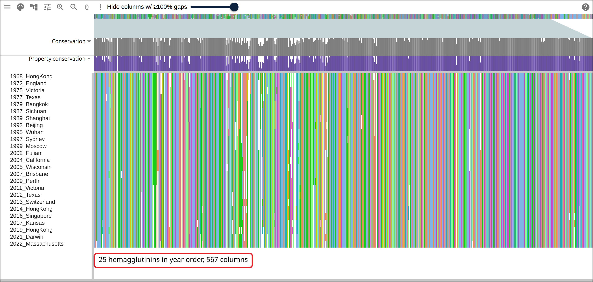
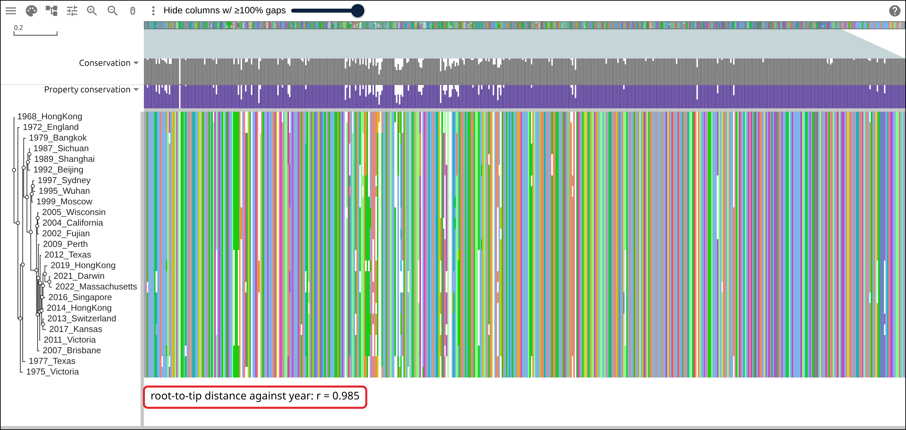
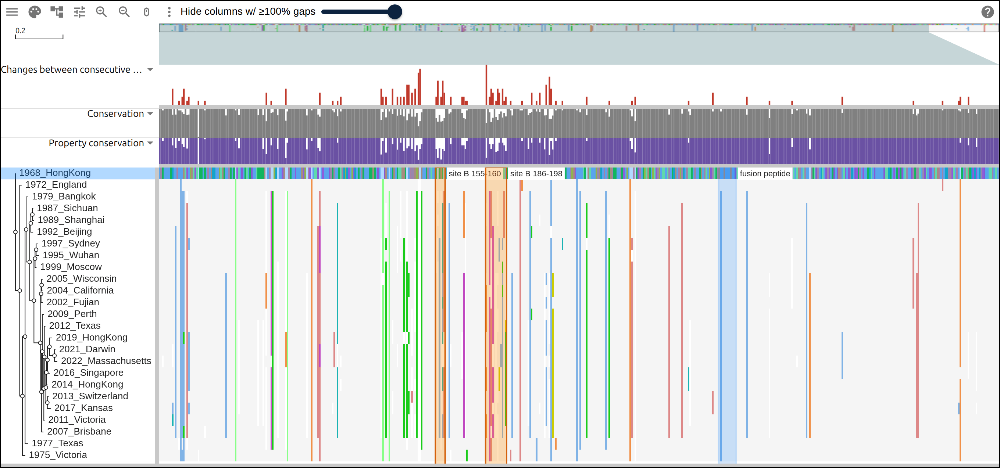
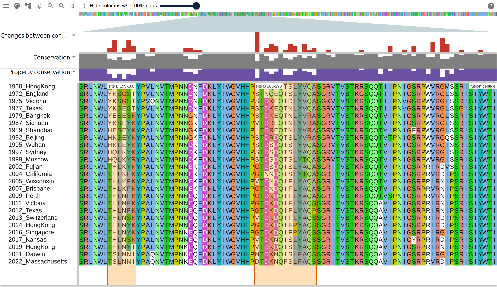
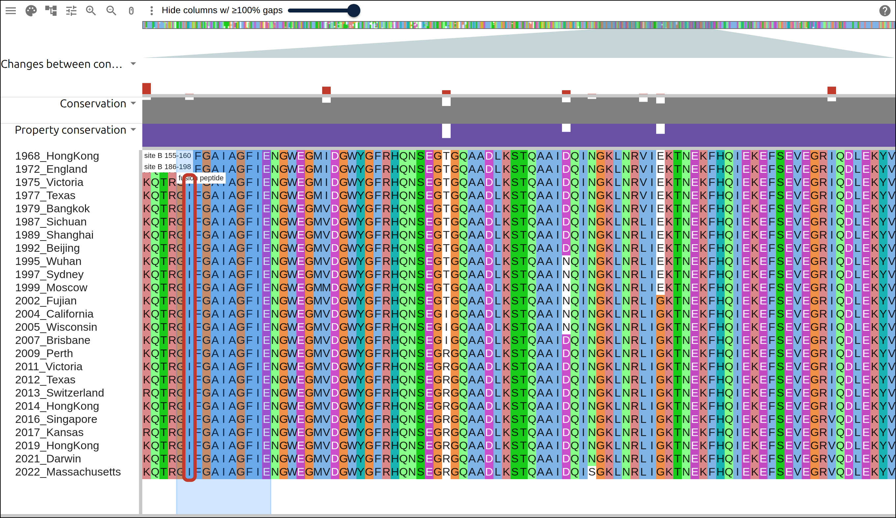

# Influenza drift in a notebook

The H3N2 vaccine is reformulated because the virus's hemagglutinin changes where
antibodies bind it. This page takes the 25 H3N2 strains chosen for the northern
hemisphere vaccine between 1968 and 2022, aligns their hemagglutinin, counts how
often each column changed from one strain to the next, and draws the result in
Jupyter with `msaview-widget`. The alignment carries its own control: the HA2
fusion peptide, which has to stay the same for the protein to work, sits in the
same 567 columns as the antigenic sites that change every few years.

## Prerequisites

- Python 3.10 or newer, in a notebook (JupyterLab, Jupyter Notebook, VS Code,
  Colab, or marimo)
- `pip install msaview-widget biopython numpy pandas`
- ClustalW, `apt install clustalw` on Debian or Ubuntu, `brew install clustal-w`
  on macOS

Every figure below links to the live view it captured.

## Where the data comes from

NCBI protein records, one per vaccine strain, fetched by accession so a rerun
aligns the same sequences.

- the records, in one request:
  https://eutils.ncbi.nlm.nih.gov/entrez/eutils/efetch.fcgi?db=protein&id=AFG71887.1,YGK08660.1&rettype=fasta&retmode=text
- the strains, as WHO published them:
  https://www.who.int/teams/global-influenza-programme/vaccines/who-recommendations
- the alignment the commands below write, hosted so the figures can link to it:
  https://gmod.org/JBrowseMSA/demo/data/h3n2/h3n2-ha.aln
- its tree: https://gmod.org/JBrowseMSA/demo/data/h3n2/h3n2-ha.nh
- the layers the notebook computed:
  https://gmod.org/JBrowseMSA/demo/data/h3n2/h3n2-layers.json

## 1. The strains

Each row is a year, the strain WHO named for that season, and the accession of a
full-length HA0 record for it.

```python
STRAINS = [
    (1968, "A/Hong Kong/1/1968", "AFG71887.1"),
    (1972, "A/England/42/1972", "AFM71912.1"),
    (1975, "A/Victoria/3/1975", "AFG98995.1"),
    # ... 21 more, through
    (2021, "A/Darwin/9/2021", "XZO11388.1"),
    (2022, "A/Massachusetts/18/2022", "YGK08660.1"),
]

strains = pd.DataFrame(STRAINS, columns=["year", "strain", "accession"])
strains["row"] = [
    f"{year}_{strain.split('/')[1].replace(' ', '')}"
    for year, strain in zip(strains.year, strains.strain)
]
```

Each accession came from one Entrez search of the protein database for the
strain name, `"A/Darwin/9/2021"[All Fields] AND hemagglutinin[Protein Name]`. A
strain has several records, some of them partial, and the one kept is the
full-length HA0 of 566 residues. The build script at the bottom of this page
pins the list above, because a search run next year can return a different first
hit.

`strains.row` is the label the viewer draws down the side: the year first, so
the rows sort by date and a Newick tip name carries no space.

## 2. Fetch the records

```python
with Entrez.efetch(
    db="protein", id=",".join(strains.accession), rettype="fasta", retmode="text"
) as handle:
    records = {r.id: r for r in SeqIO.parse(handle, "fasta")}

for row, accession in zip(strains.row, strains.accession):
    records[accession].id = row
    records[accession].description = ""

ordered = [records[a] for a in strains.accession]
SeqIO.write(ordered, "h3n2-ha.fasta", "fasta")
```

```
 year                  strain  accession  length
 1968      A/Hong Kong/1/1968 AFG71887.1     566
 1972       A/England/42/1972 AFM71912.1     566
 1975       A/Victoria/3/1975 AFG98995.1     566
   ...                    ...        ...     ...
 2021         A/Darwin/9/2021 XZO11388.1     566
 2022 A/Massachusetts/18/2022 YGK08660.1     566
```

All 25 are 566 residues: a 16-residue signal peptide, then HA1 at 329 residues,
then HA2. H3 numbering counts from HA1's first residue, so every position quoted
below is that number plus 16.

## 3. Align

```python
subprocess.run(
    ["clustalw", "-INFILE=h3n2-ha.fasta", "-ALIGN", "-TYPE=PROTEIN",
     "-OUTPUT=FASTA", "-OUTFILE=h3n2-ha.aln"],
    check=True,
)
aligned = {r.id: r for r in SeqIO.parse("h3n2-ha.aln", "fasta")}
SeqIO.write([aligned[row] for row in strains.row], "h3n2-ha.aln", "fasta")
```

```
alignment: 25 rows x 567 columns
```

The second write puts the rows back in year order. ClustalW writes its output in
guide-tree order, and the viewer draws the rows in the order the file gives
them, so without the rewrite the first row is a 2013 strain.

[](https://gmod.org/JBrowseMSA/demo/?data=%7B%22msaview%22%3A%7B%22type%22%3A%22MsaView%22%2C%22height%22%3A640%2C%22treeAreaWidth%22%3A210%2C%22colWidth%22%3A2.2%2C%22rowHeight%22%3A16%2C%22colorSchemeName%22%3A%22clustalx_protein_dynamic%22%2C%22msaFilehandle%22%3A%7B%22uri%22%3A%22data%2Fh3n2%2Fh3n2-ha.aln%22%7D%7D%7D)

The 25 hemagglutinins in year order, 1968 at the top and 2022 at the bottom.
Every record is 566 residues, and the alignment is 567 columns wide, because
A/Victoria/3/1975 carries one extra residue near the end of the signal peptide.

## 4. A tree, and a date check

Biopython builds the distance matrix and the neighbor-joining tree, and the tree
carries no year.

```python
msa = MultipleSeqAlignment([aligned[row] for row in strains.row])
tree = DistanceTreeConstructor().nj(DistanceCalculator("blosum62").get_distance(msa))
tree.root_with_outgroup(strains.row[0])
Phylo.write(tree, "h3n2-ha.nh", "newick")
```

A tree built from sequences alone can be checked against the dates the sequences
came with. Distance from the 1968 root should grow with the year:

```python
depth = tree.depths()
distance = [depth[t] for t in tree.get_terminals()]
year = [int(t.name.split("_")[0]) for t in tree.get_terminals()]
np.corrcoef(distance, year)[0, 1]
```

```
root-to-tip distance against year: r = 0.985
```

[](https://gmod.org/JBrowseMSA/demo/?data=%7B%22msaview%22%3A%7B%22type%22%3A%22MsaView%22%2C%22height%22%3A640%2C%22treeAreaWidth%22%3A210%2C%22colWidth%22%3A2.2%2C%22rowHeight%22%3A16%2C%22colorSchemeName%22%3A%22clustalx_protein_dynamic%22%2C%22msaFilehandle%22%3A%7B%22uri%22%3A%22data%2Fh3n2%2Fh3n2-ha.aln%22%7D%2C%22treeFilehandle%22%3A%7B%22uri%22%3A%22data%2Fh3n2%2Fh3n2-ha.nh%22%7D%7D%7D)

The tree beside the alignment. The 1968 root is at the top, and the branch
lengths grow down the series.

## 5. Count the changes the alignment carries

The viewer's conservation track reads a column across all 25 rows at once. A
series that runs in time supports a different count: how often the letter
changed from one vaccine strain to the next.

```python
columns = np.array([list(str(aligned[row].seq)) for row in strains.row])
changes = (columns[:-1] != columns[1:]).sum(axis=0)
```

```
columns that never changed: 449 of 567
the busiest column changed 11 times
the 2022 strain matches the 1968 one in 479 of 567 columns
```

Four fifths of the columns hold the same letter from one strain to the next all
the way through, and the 2022 strain matches the 1968 one in 479 of the 567. The
`column_tracks` trait takes the counts as one bar per column:

```python
drift = {
    "id": "drift",
    "name": "Changes between consecutive strains",
    "kind": "bar",
    "values": changes,
    "max": int(changes.max()),
    "color": "#c0392b",
    "height": 60,
}
```

`values` takes a numpy array as it is.

## 6. Mark the antigenic sites and the fusion peptide

Antigenic site B is two stretches of HA1, 155 to 160 and 186 to 198, on the rim
of the receptor-binding site. The fusion peptide is the first 11 residues of
HA2, which insert into the endosome membrane. Both go in as highlights on the
1968 row, and the viewer projects a row's residues onto columns:

```python
SIGNAL, HA1_LENGTH = 16, 329
reference = strains.row[0]

def h3(position):
    """H3 numbering -> residue of the record, which counts the signal peptide."""
    return position + SIGNAL

bands = [
    {"row": reference, "start": h3(155), "end": h3(160), "label": "site B 155-160"},
    {"row": reference, "start": h3(186), "end": h3(198), "label": "site B 186-198"},
    {"row": reference, "start": h3(HA1_LENGTH + 1), "end": h3(HA1_LENGTH + 11),
     "label": "fusion peptide", "color": "rgba(0,120,255,0.18)"},
]
```

Everything so far goes into the widget in one call:

```python
from msaview import MSAView

view = MSAView(
    msa="h3n2-ha.aln",
    tree="h3n2-ha.nh",
    column_tracks=[drift],
    highlights=bands,
    relative_to=reference,
    col_width=2.2,
    row_height=16,
    height=700,
)
view
```

[](<https://gmod.org/JBrowseMSA/demo/?data=%7B%22msaview%22%3A%7B%22type%22%3A%22MsaView%22%2C%22height%22%3A630%2C%22treeAreaWidth%22%3A210%2C%22colWidth%22%3A2.2%2C%22rowHeight%22%3A16%2C%22colorSchemeName%22%3A%22clustalx_protein_dynamic%22%2C%22msaFilehandle%22%3A%7B%22uri%22%3A%22data%2Fh3n2%2Fh3n2-ha.aln%22%7D%2C%22treeFilehandle%22%3A%7B%22uri%22%3A%22data%2Fh3n2%2Fh3n2-ha.nh%22%7D%2C%22relativeTo%22%3A%221968_HongKong%22%2C%22columnTracks%22%3A%5B%7B%22id%22%3A%22drift%22%2C%22name%22%3A%22Changes%20between%20consecutive%20strains%22%2C%22kind%22%3A%22bar%22%2C%22values%22%3A%5B0%2C0%2C1%2C0%2C0%2C0%2C0%2C0%2C5%2C0%2C1%2C0%2C2%2C1%2C3%2C5%2C0%2C2%2C3%2C0%2C0%2C0%2C0%2C0%2C2%2C0%2C0%2C0%2C2%2C0%2C0%2C0%2C0%2C0%2C0%2C0%2C0%2C0%2C0%2C0%2C0%2C1%2C0%2C0%2C0%2C0%2C0%2C1%2C0%2C1%2C0%2C0%2C0%2C0%2C0%2C0%2C0%2C0%2C0%2C0%2C0%2C1%2C0%2C0%2C1%2C0%2C4%2C0%2C0%2C2%2C1%2C0%2C0%2C1%2C0%2C0%2C0%2C0%2C5%2C1%2C0%2C0%2C0%2C0%2C0%2C0%2C0%2C0%2C0%2C0%2C0%2C1%2C0%2C0%2C1%2C0%2C0%2C0%2C1%2C4%2C0%2C0%2C0%2C0%2C0%2C0%2C0%2C2%2C1%2C0%2C2%2C0%2C3%2C0%2C0%2C0%2C0%2C0%2C0%2C0%2C0%2C0%2C0%2C0%2C0%2C0%2C0%2C0%2C0%2C0%2C0%2C0%2C0%2C0%2C0%2C0%2C0%2C5%2C3%2C0%2C3%2C0%2C1%2C0%2C5%2C0%2C0%2C3%2C0%2C3%2C0%2C3%2C0%2C6%2C6%2C0%2C4%2C0%2C5%2C1%2C9%2C10%2C1%2C0%2C0%2C0%2C0%2C0%2C0%2C0%2C0%2C3%2C7%2C1%2C3%2C7%2C4%2C0%2C0%2C1%2C3%2C0%2C0%2C0%2C0%2C0%2C0%2C3%2C3%2C2%2C2%2C0%2C0%2C0%2C0%2C0%2C0%2C0%2C0%2C0%2C0%2C0%2C11%2C0%2C3%2C5%2C4%2C0%2C2%2C5%2C4%2C1%2C5%2C2%2C3%2C0%2C0%2C2%2C1%2C0%2C0%2C0%2C0%2C1%2C2%2C0%2C0%2C0%2C1%2C1%2C4%2C0%2C0%2C2%2C0%2C4%2C0%2C0%2C1%2C6%2C0%2C8%2C5%2C1%2C0%2C2%2C0%2C0%2C0%2C2%2C0%2C0%2C0%2C0%2C0%2C0%2C0%2C0%2C1%2C0%2C1%2C0%2C0%2C0%2C3%2C0%2C0%2C0%2C0%2C0%2C0%2C0%2C0%2C0%2C0%2C0%2C1%2C0%2C2%2C0%2C0%2C0%2C0%2C0%2C0%2C0%2C0%2C0%2C0%2C0%2C0%2C1%2C2%2C0%2C3%2C0%2C0%2C0%2C0%2C0%2C0%2C0%2C0%2C0%2C0%2C0%2C0%2C0%2C0%2C0%2C0%2C0%2C0%2C0%2C0%2C1%2C0%2C0%2C0%2C0%2C0%2C0%2C0%2C1%2C0%2C0%2C0%2C2%2C1%2C0%2C0%2C0%2C0%2C0%2C0%2C0%2C0%2C0%2C0%2C0%2C0%2C0%2C4%2C0%2C0%2C0%2C0%2C1%2C0%2C0%2C0%2C0%2C0%2C0%2C0%2C0%2C0%2C0%2C0%2C0%2C0%2C0%2C0%2C3%2C0%2C0%2C0%2C0%2C0%2C0%2C0%2C0%2C0%2C0%2C0%2C0%2C0%2C2%2C0%2C0%2C0%2C0%2C0%2C0%2C0%2C0%2C0%2C0%2C0%2C0%2C0%2C2%2C0%2C0%2C1%2C0%2C0%2C0%2C0%2C0%2C1%2C0%2C1%2C0%2C0%2C0%2C0%2C0%2C0%2C0%2C0%2C0%2C0%2C0%2C0%2C0%2C0%2C0%2C0%2C0%2C0%2C0%2C3%2C0%2C0%2C0%2C0%2C0%2C0%2C0%2C0%2C0%2C0%2C0%2C0%2C0%2C0%2C0%2C0%2C0%2C0%2C0%2C0%2C0%2C0%2C0%2C0%2C0%2C0%2C0%2C0%2C0%2C0%2C0%2C0%2C0%2C0%2C0%2C0%2C0%2C0%2C0%2C0%2C0%2C0%2C0%2C2%2C0%2C1%2C1%2C0%2C0%2C0%2C0%2C0%2C0%2C0%2C0%2C0%2C0%2C0%2C0%2C0%2C0%2C2%2C0%2C0%2C0%2C0%2C0%2C0%2C0%2C0%2C0%2C2%2C3%2C0%2C0%2C0%2C0%2C3%2C0%2C0%2C0%2C0%2C1%2C0%2C0%2C0%2C0%2C0%2C0%2C0%2C0%2C0%2C0%2C0%2C0%2C0%2C0%2C0%2C0%2C0%2C0%2C0%2C0%2C0%2C0%2C0%2C0%2C0%2C0%2C0%2C0%2C0%2C0%2C0%2C0%2C1%2C0%2C0%2C0%2C0%2C0%2C0%2C1%2C1%2C0%2C0%2C0%2C0%2C0%2C0%2C0%2C0%2C0%2C0%2C1%2C0%2C0%2C0%2C0%2C0%2C0%2C0%2C0%2C0%5D%2C%22max%22%3A11%2C%22color%22%3A%22%23c0392b%22%2C%22height%22%3A60%7D%5D%2C%22highlights%22%3A%5B%7B%22row%22%3A%221968_HongKong%22%2C%22start%22%3A171%2C%22end%22%3A176%2C%22label%22%3A%22site%20B%20155-160%22%7D%2C%7B%22row%22%3A%221968_HongKong%22%2C%22start%22%3A202%2C%22end%22%3A214%2C%22label%22%3A%22site%20B%20186-198%22%7D%2C%7B%22row%22%3A%221968_HongKong%22%2C%22start%22%3A346%2C%22end%22%3A356%2C%22label%22%3A%22fusion%20peptide%22%2C%22color%22%3A%22rgba(0%2C120%2C255%2C0.18)%22%7D%5D%7D%7D>)

The drift track over the alignment, with `relative_to` drawing every row as its
differences from 1968. The two orange bands are site B, the blue band is the
fusion peptide, and the red bars stand highest in HA1.

## 7. Read the two regions

```python
residue_column = np.cumsum([c != "-" for c in str(aligned[reference].seq)])

def column_of(residue):
    return int(np.argmax(residue_column == residue))

site_b = [h3(p) for start, end in [(155, 160), (186, 198)] for p in range(start, end + 1)]
fusion = list(range(h3(HA1_LENGTH + 1), h3(HA1_LENGTH + 11) + 1))
def read(positions):
    at = [column_of(r) for r in positions]
    return ["".join(columns[i, at]) for i in range(len(strains))]

pd.DataFrame({
    "year": strains.year,
    "site B (155-160, 186-198)": read(site_b),
    "fusion peptide (HA2 1-11)": read(fusion),
})
```

```
 year site B (155-160, 186-198) fusion peptide (HA2 1-11)
 1968       TKSGSTSTNQEQTSLYVQA               GLFGAIAGFIE
 1972       YKSGSTSTNQEQTSLYVQA               GLFGAIAGFIE
 1975       YKSGSTSTDKEQTDLYVQA               GIFGAIAGFIE
 1977       YKSESTSTDKEQTNLYVQA               GIFGAIAGFIE
 1979       YESESKSTDKEQTNLYVRA               GIFGAIAGFIE
 1987       YKSEYKVTDREQTNLYVRA               GIFGAIAGFIE
 1989       HESEYKITDREQTNLYVRA               GIFGAIAGFIE
 1992       HKSEYKSTDRDQTSLYVRA               GIFGAIAGFIE
 1995       HKLEYKSTDSDQTSIYVQA               GIFGAIAGFIE
 1997       HQLKYKSTDSDQTSIYAQA               GIFGAIAGFIE
 1999       HQLKYRSTDSDQTSLYTQA               GIFGAIAGFIE
 2002       THLKYKGTDSDQISLYAQA               GIFGAIAGFIE
 2004       THLKFKGTNNDQISLYTQA               GIFGAIAGFIE
 2005       THLKFKVTDNDQIFLYAQA               GIFGAIAGFIE
 2007       THLKFKGTDNDQIFLYAQA               GIFGAIAGFIE
 2009       THLNFKGTDKDQIFLYAQA               GIFGAIAGFIE
 2011       THLNFKGTDKDQIFLYAQS               GIFGAIAGFIE
 2012       THLNFKGTDKDQIFLYAQP               GIFGAIAGFIE
 2013       THLNSKVTDKDQIFLYAQS               GIFGAIAGFIE
 2014       THLNYKGTDKDQIFPYAQS               GIFGAIAGFIE
 2016       THLNYKGTDKDQIFPYAQS               GIFGAIAGFIE
 2017       THLNSKVTDKNQISLYAQS               GIFGAIAGFIE
 2019       THLNYIVTDKDQISLYAQS               GIFGAIAGFIE
 2021       TSLNNINTDKNQISLFAQS               GIFGAIAGFIE
 2022       TSLNNIDTDKNQFSLFAQS               GIFGAIAGFIE
```

```
site B reads 24 distinct strings in 25 strains, the fusion peptide 2
```

[](<https://gmod.org/JBrowseMSA/demo/?data=%7B%22msaview%22%3A%7B%22type%22%3A%22MsaView%22%2C%22height%22%3A780%2C%22treeAreaWidth%22%3A210%2C%22colWidth%22%3A13%2C%22rowHeight%22%3A20%2C%22colorSchemeName%22%3A%22clustalx_protein_dynamic%22%2C%22msaFilehandle%22%3A%7B%22uri%22%3A%22data%2Fh3n2%2Fh3n2-ha.aln%22%7D%2C%22scrollX%22%3A-2145%2C%22columnTracks%22%3A%5B%7B%22id%22%3A%22drift%22%2C%22name%22%3A%22Changes%20between%20consecutive%20strains%22%2C%22kind%22%3A%22bar%22%2C%22values%22%3A%5B0%2C0%2C1%2C0%2C0%2C0%2C0%2C0%2C5%2C0%2C1%2C0%2C2%2C1%2C3%2C5%2C0%2C2%2C3%2C0%2C0%2C0%2C0%2C0%2C2%2C0%2C0%2C0%2C2%2C0%2C0%2C0%2C0%2C0%2C0%2C0%2C0%2C0%2C0%2C0%2C0%2C1%2C0%2C0%2C0%2C0%2C0%2C1%2C0%2C1%2C0%2C0%2C0%2C0%2C0%2C0%2C0%2C0%2C0%2C0%2C0%2C1%2C0%2C0%2C1%2C0%2C4%2C0%2C0%2C2%2C1%2C0%2C0%2C1%2C0%2C0%2C0%2C0%2C5%2C1%2C0%2C0%2C0%2C0%2C0%2C0%2C0%2C0%2C0%2C0%2C0%2C1%2C0%2C0%2C1%2C0%2C0%2C0%2C1%2C4%2C0%2C0%2C0%2C0%2C0%2C0%2C0%2C2%2C1%2C0%2C2%2C0%2C3%2C0%2C0%2C0%2C0%2C0%2C0%2C0%2C0%2C0%2C0%2C0%2C0%2C0%2C0%2C0%2C0%2C0%2C0%2C0%2C0%2C0%2C0%2C0%2C0%2C5%2C3%2C0%2C3%2C0%2C1%2C0%2C5%2C0%2C0%2C3%2C0%2C3%2C0%2C3%2C0%2C6%2C6%2C0%2C4%2C0%2C5%2C1%2C9%2C10%2C1%2C0%2C0%2C0%2C0%2C0%2C0%2C0%2C0%2C3%2C7%2C1%2C3%2C7%2C4%2C0%2C0%2C1%2C3%2C0%2C0%2C0%2C0%2C0%2C0%2C3%2C3%2C2%2C2%2C0%2C0%2C0%2C0%2C0%2C0%2C0%2C0%2C0%2C0%2C0%2C11%2C0%2C3%2C5%2C4%2C0%2C2%2C5%2C4%2C1%2C5%2C2%2C3%2C0%2C0%2C2%2C1%2C0%2C0%2C0%2C0%2C1%2C2%2C0%2C0%2C0%2C1%2C1%2C4%2C0%2C0%2C2%2C0%2C4%2C0%2C0%2C1%2C6%2C0%2C8%2C5%2C1%2C0%2C2%2C0%2C0%2C0%2C2%2C0%2C0%2C0%2C0%2C0%2C0%2C0%2C0%2C1%2C0%2C1%2C0%2C0%2C0%2C3%2C0%2C0%2C0%2C0%2C0%2C0%2C0%2C0%2C0%2C0%2C0%2C1%2C0%2C2%2C0%2C0%2C0%2C0%2C0%2C0%2C0%2C0%2C0%2C0%2C0%2C0%2C1%2C2%2C0%2C3%2C0%2C0%2C0%2C0%2C0%2C0%2C0%2C0%2C0%2C0%2C0%2C0%2C0%2C0%2C0%2C0%2C0%2C0%2C0%2C0%2C1%2C0%2C0%2C0%2C0%2C0%2C0%2C0%2C1%2C0%2C0%2C0%2C2%2C1%2C0%2C0%2C0%2C0%2C0%2C0%2C0%2C0%2C0%2C0%2C0%2C0%2C0%2C4%2C0%2C0%2C0%2C0%2C1%2C0%2C0%2C0%2C0%2C0%2C0%2C0%2C0%2C0%2C0%2C0%2C0%2C0%2C0%2C0%2C3%2C0%2C0%2C0%2C0%2C0%2C0%2C0%2C0%2C0%2C0%2C0%2C0%2C0%2C2%2C0%2C0%2C0%2C0%2C0%2C0%2C0%2C0%2C0%2C0%2C0%2C0%2C0%2C2%2C0%2C0%2C1%2C0%2C0%2C0%2C0%2C0%2C1%2C0%2C1%2C0%2C0%2C0%2C0%2C0%2C0%2C0%2C0%2C0%2C0%2C0%2C0%2C0%2C0%2C0%2C0%2C0%2C0%2C0%2C3%2C0%2C0%2C0%2C0%2C0%2C0%2C0%2C0%2C0%2C0%2C0%2C0%2C0%2C0%2C0%2C0%2C0%2C0%2C0%2C0%2C0%2C0%2C0%2C0%2C0%2C0%2C0%2C0%2C0%2C0%2C0%2C0%2C0%2C0%2C0%2C0%2C0%2C0%2C0%2C0%2C0%2C0%2C0%2C2%2C0%2C1%2C1%2C0%2C0%2C0%2C0%2C0%2C0%2C0%2C0%2C0%2C0%2C0%2C0%2C0%2C0%2C2%2C0%2C0%2C0%2C0%2C0%2C0%2C0%2C0%2C0%2C2%2C3%2C0%2C0%2C0%2C0%2C3%2C0%2C0%2C0%2C0%2C1%2C0%2C0%2C0%2C0%2C0%2C0%2C0%2C0%2C0%2C0%2C0%2C0%2C0%2C0%2C0%2C0%2C0%2C0%2C0%2C0%2C0%2C0%2C0%2C0%2C0%2C0%2C0%2C0%2C0%2C0%2C0%2C0%2C1%2C0%2C0%2C0%2C0%2C0%2C0%2C1%2C1%2C0%2C0%2C0%2C0%2C0%2C0%2C0%2C0%2C0%2C0%2C1%2C0%2C0%2C0%2C0%2C0%2C0%2C0%2C0%2C0%5D%2C%22max%22%3A11%2C%22color%22%3A%22%23c0392b%22%2C%22height%22%3A60%7D%5D%2C%22highlights%22%3A%5B%7B%22row%22%3A%221968_HongKong%22%2C%22start%22%3A171%2C%22end%22%3A176%2C%22label%22%3A%22site%20B%20155-160%22%7D%2C%7B%22row%22%3A%221968_HongKong%22%2C%22start%22%3A202%2C%22end%22%3A214%2C%22label%22%3A%22site%20B%20186-198%22%7D%2C%7B%22row%22%3A%221968_HongKong%22%2C%22start%22%3A346%2C%22end%22%3A356%2C%22label%22%3A%22fusion%20peptide%22%2C%22color%22%3A%22rgba(0%2C120%2C255%2C0.18)%22%7D%5D%7D%7D>)

Antigenic site B at 13 pixels per column, rows in year order. The two bands mark
the stretches the table above reads, and the letters under them turn over every
few rows.

[](<https://gmod.org/JBrowseMSA/demo/?data=%7B%22msaview%22%3A%7B%22type%22%3A%22MsaView%22%2C%22height%22%3A780%2C%22treeAreaWidth%22%3A210%2C%22colWidth%22%3A13%2C%22rowHeight%22%3A20%2C%22colorSchemeName%22%3A%22clustalx_protein_dynamic%22%2C%22msaFilehandle%22%3A%7B%22uri%22%3A%22data%2Fh3n2%2Fh3n2-ha.aln%22%7D%2C%22scrollX%22%3A-4446%2C%22columnTracks%22%3A%5B%7B%22id%22%3A%22drift%22%2C%22name%22%3A%22Changes%20between%20consecutive%20strains%22%2C%22kind%22%3A%22bar%22%2C%22values%22%3A%5B0%2C0%2C1%2C0%2C0%2C0%2C0%2C0%2C5%2C0%2C1%2C0%2C2%2C1%2C3%2C5%2C0%2C2%2C3%2C0%2C0%2C0%2C0%2C0%2C2%2C0%2C0%2C0%2C2%2C0%2C0%2C0%2C0%2C0%2C0%2C0%2C0%2C0%2C0%2C0%2C0%2C1%2C0%2C0%2C0%2C0%2C0%2C1%2C0%2C1%2C0%2C0%2C0%2C0%2C0%2C0%2C0%2C0%2C0%2C0%2C0%2C1%2C0%2C0%2C1%2C0%2C4%2C0%2C0%2C2%2C1%2C0%2C0%2C1%2C0%2C0%2C0%2C0%2C5%2C1%2C0%2C0%2C0%2C0%2C0%2C0%2C0%2C0%2C0%2C0%2C0%2C1%2C0%2C0%2C1%2C0%2C0%2C0%2C1%2C4%2C0%2C0%2C0%2C0%2C0%2C0%2C0%2C2%2C1%2C0%2C2%2C0%2C3%2C0%2C0%2C0%2C0%2C0%2C0%2C0%2C0%2C0%2C0%2C0%2C0%2C0%2C0%2C0%2C0%2C0%2C0%2C0%2C0%2C0%2C0%2C0%2C0%2C5%2C3%2C0%2C3%2C0%2C1%2C0%2C5%2C0%2C0%2C3%2C0%2C3%2C0%2C3%2C0%2C6%2C6%2C0%2C4%2C0%2C5%2C1%2C9%2C10%2C1%2C0%2C0%2C0%2C0%2C0%2C0%2C0%2C0%2C3%2C7%2C1%2C3%2C7%2C4%2C0%2C0%2C1%2C3%2C0%2C0%2C0%2C0%2C0%2C0%2C3%2C3%2C2%2C2%2C0%2C0%2C0%2C0%2C0%2C0%2C0%2C0%2C0%2C0%2C0%2C11%2C0%2C3%2C5%2C4%2C0%2C2%2C5%2C4%2C1%2C5%2C2%2C3%2C0%2C0%2C2%2C1%2C0%2C0%2C0%2C0%2C1%2C2%2C0%2C0%2C0%2C1%2C1%2C4%2C0%2C0%2C2%2C0%2C4%2C0%2C0%2C1%2C6%2C0%2C8%2C5%2C1%2C0%2C2%2C0%2C0%2C0%2C2%2C0%2C0%2C0%2C0%2C0%2C0%2C0%2C0%2C1%2C0%2C1%2C0%2C0%2C0%2C3%2C0%2C0%2C0%2C0%2C0%2C0%2C0%2C0%2C0%2C0%2C0%2C1%2C0%2C2%2C0%2C0%2C0%2C0%2C0%2C0%2C0%2C0%2C0%2C0%2C0%2C0%2C1%2C2%2C0%2C3%2C0%2C0%2C0%2C0%2C0%2C0%2C0%2C0%2C0%2C0%2C0%2C0%2C0%2C0%2C0%2C0%2C0%2C0%2C0%2C0%2C1%2C0%2C0%2C0%2C0%2C0%2C0%2C0%2C1%2C0%2C0%2C0%2C2%2C1%2C0%2C0%2C0%2C0%2C0%2C0%2C0%2C0%2C0%2C0%2C0%2C0%2C0%2C4%2C0%2C0%2C0%2C0%2C1%2C0%2C0%2C0%2C0%2C0%2C0%2C0%2C0%2C0%2C0%2C0%2C0%2C0%2C0%2C0%2C3%2C0%2C0%2C0%2C0%2C0%2C0%2C0%2C0%2C0%2C0%2C0%2C0%2C0%2C2%2C0%2C0%2C0%2C0%2C0%2C0%2C0%2C0%2C0%2C0%2C0%2C0%2C0%2C2%2C0%2C0%2C1%2C0%2C0%2C0%2C0%2C0%2C1%2C0%2C1%2C0%2C0%2C0%2C0%2C0%2C0%2C0%2C0%2C0%2C0%2C0%2C0%2C0%2C0%2C0%2C0%2C0%2C0%2C0%2C3%2C0%2C0%2C0%2C0%2C0%2C0%2C0%2C0%2C0%2C0%2C0%2C0%2C0%2C0%2C0%2C0%2C0%2C0%2C0%2C0%2C0%2C0%2C0%2C0%2C0%2C0%2C0%2C0%2C0%2C0%2C0%2C0%2C0%2C0%2C0%2C0%2C0%2C0%2C0%2C0%2C0%2C0%2C0%2C2%2C0%2C1%2C1%2C0%2C0%2C0%2C0%2C0%2C0%2C0%2C0%2C0%2C0%2C0%2C0%2C0%2C0%2C2%2C0%2C0%2C0%2C0%2C0%2C0%2C0%2C0%2C0%2C2%2C3%2C0%2C0%2C0%2C0%2C3%2C0%2C0%2C0%2C0%2C1%2C0%2C0%2C0%2C0%2C0%2C0%2C0%2C0%2C0%2C0%2C0%2C0%2C0%2C0%2C0%2C0%2C0%2C0%2C0%2C0%2C0%2C0%2C0%2C0%2C0%2C0%2C0%2C0%2C0%2C0%2C0%2C0%2C1%2C0%2C0%2C0%2C0%2C0%2C0%2C1%2C1%2C0%2C0%2C0%2C0%2C0%2C0%2C0%2C0%2C0%2C0%2C1%2C0%2C0%2C0%2C0%2C0%2C0%2C0%2C0%2C0%5D%2C%22max%22%3A11%2C%22color%22%3A%22%23c0392b%22%2C%22height%22%3A60%7D%5D%2C%22highlights%22%3A%5B%7B%22row%22%3A%221968_HongKong%22%2C%22start%22%3A171%2C%22end%22%3A176%2C%22label%22%3A%22site%20B%20155-160%22%7D%2C%7B%22row%22%3A%221968_HongKong%22%2C%22start%22%3A202%2C%22end%22%3A214%2C%22label%22%3A%22site%20B%20186-198%22%7D%2C%7B%22row%22%3A%221968_HongKong%22%2C%22start%22%3A346%2C%22end%22%3A356%2C%22label%22%3A%22fusion%20peptide%22%2C%22color%22%3A%22rgba(0%2C120%2C255%2C0.18)%22%7D%5D%7D%7D>)

The fusion peptide in the same alignment at the same resolution. The boxed
column is the one substitution the series carries there, a leucine in 1968 and
1972 and an isoleucine in the 23 strains after them.

## 8. The loop back to Python

The widget sets two traits from the browser. `clicked` holds the cell a click
pinned, and `viewport` holds the columns on screen:

```python
def show(change):
    cell = change["new"]
    if cell:
        print(cell["row"], cell["column"], cell["letter"])

view.observe(show, "clicked")
```

Both are 1-based, `column` counts every column of the alignment, and `residue`
counts the clicked row's own letters. A click on a column of the figure above
answers with the year, the column and the residue, which indexes straight back
into the DataFrame:

```python
view.observe(
    lambda change: display(
        pd.DataFrame({
            "year": strains.year,
            "letter": columns[:, change["new"]["column"] - 1],
        })
    ),
    "clicked",
)
```

Setting a trait redraws the widget in place and keeps its scroll and zoom, so a
cell that changes `view.color_scheme` or `view.highlights` restyles the view
above it.

## 9. Share the link

The same layers go into a URL that opens the hosted alignment in the web viewer,
for a reader with no kernel:

```python
snapshot = {"msaview": {
    "type": "MsaView",
    "height": 560,
    "colWidth": 2.2,
    "rowHeight": 16,
    "colorSchemeName": "clustalx_protein_dynamic",
    "msaFilehandle": {"uri": "data/h3n2/h3n2-ha.aln"},
    "treeFilehandle": {"uri": "data/h3n2/h3n2-ha.nh"},
    "columnTracks": [{**drift, "values": changes.tolist()}],
    "highlights": bands,
}}
"https://gmod.org/JBrowseMSA/demo/?data=" + urllib.parse.quote(
    json.dumps(snapshot, separators=(",", ":")), safe=""
)
```

```
the link is 3332 characters
```

`json.dumps` needs `changes.tolist()`, where the widget took the numpy array
whole.

## Reproduce it end to end

```bash
curl -O https://raw.githubusercontent.com/GMOD/JBrowseMSA/main/docs/tutorials/scripts/build_flu_drift.py
python build_flu_drift.py out/
```

The script runs every command above and writes `out/h3n2-ha.aln`,
`out/h3n2-ha.nh` and `out/h3n2-layers.json`, the files the links on this page
open. The numbers quoted here are the ones it prints.

## See also

- [Python package](https://gmod.org/JBrowseMSA/python-package), with the example
  notebooks and every trait
- [Data layers](https://gmod.org/JBrowseMSA/layers)
- [A protease family in R](https://gmod.org/JBrowseMSA/tutorials/r_protease_triad)
- [JBrowse 2 integration](https://gmod.org/JBrowseMSA/tutorials/jbrowse_integration),
  which opens an alignment beside a genome and a structure

## References

- Wiley DC, Wilson IA, Skehel JJ. Structural identification of the
  antibody-binding sites of Hong Kong influenza haemagglutinin and their
  involvement in antigenic variation. _Nature_ 289:373-378 (1981), which named
  sites A through E.
- Skehel JJ, Wiley DC. Receptor binding and membrane fusion in virus entry: the
  influenza hemagglutinin. _Annual Review of Biochemistry_ 69:531-569 (2000).
- Smith DJ, et al. Mapping the antigenic and genetic evolution of influenza
  virus. _Science_ 305:371-376 (2004).
- Koel BF, et al. Substitutions near the receptor binding site determine major
  antigenic change during influenza virus evolution. _Science_ 342:976-979
  (2013).
- Cock PJA, et al. Biopython: freely available Python tools for computational
  molecular biology and bioinformatics. _Bioinformatics_ 25:1422-1423 (2009).
- Larkin MA, et al. Clustal W and Clustal X version 2.0. _Bioinformatics_
  23:2947-2948 (2007).
