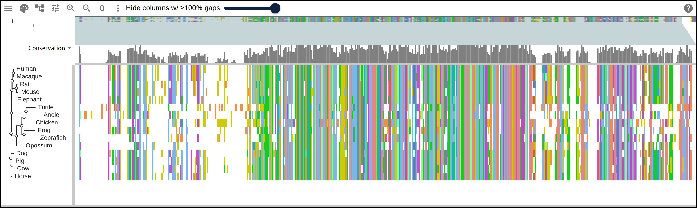
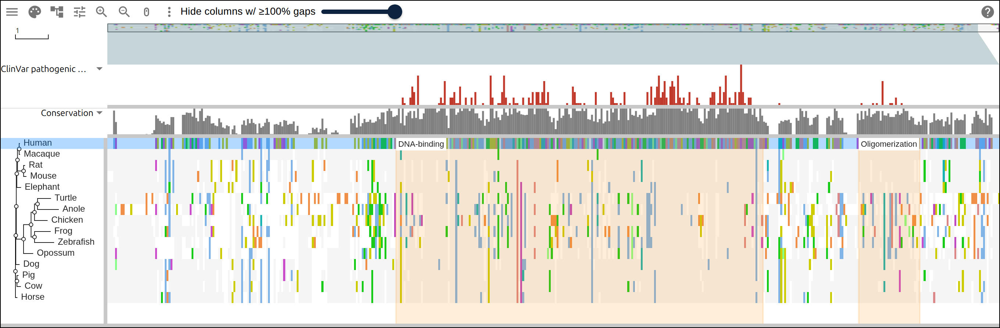
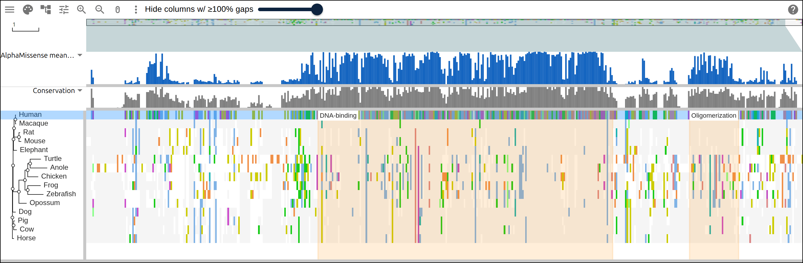
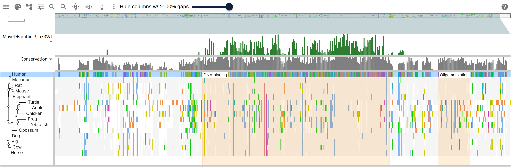
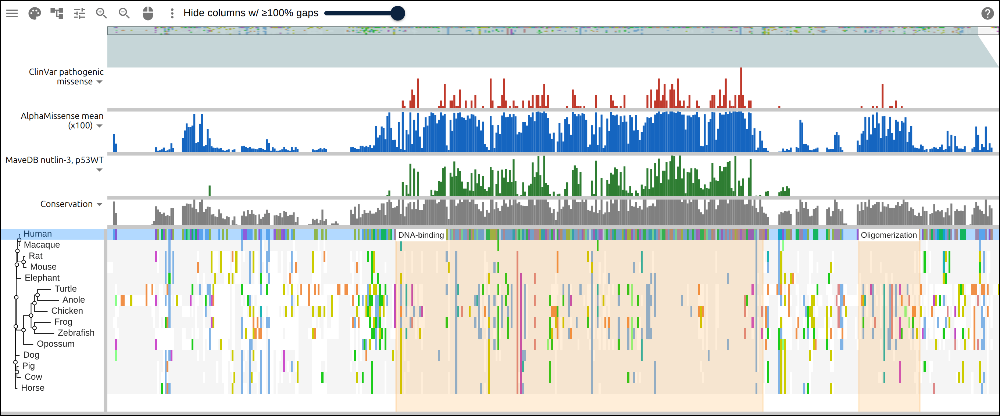
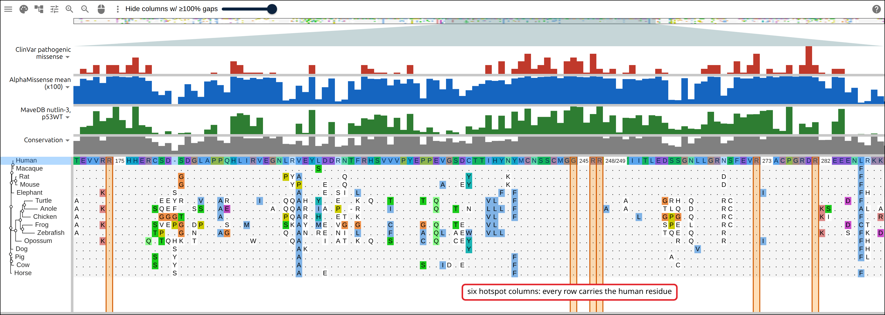
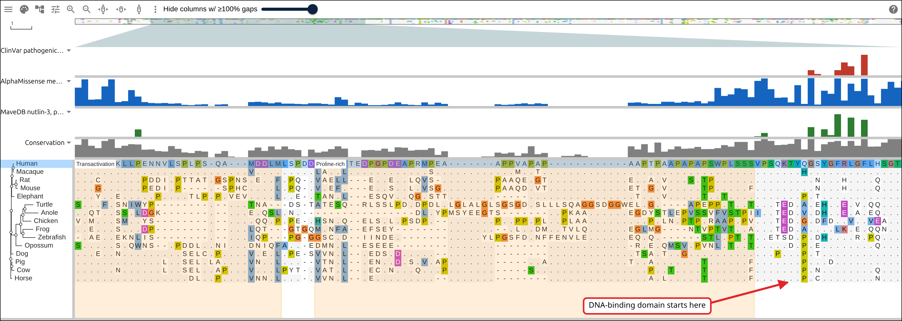
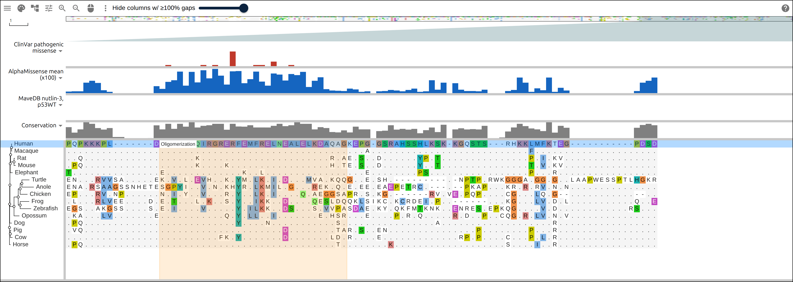

# Where p53's damaging variants fall

_TP53_ is the gene most often mutated in human cancer, and the mutations are not
spread evenly along the protein it encodes. Three independent sources locate the
damaging ones: clinical laboratories reporting what they found in patients, a
model scoring every substitution that could exist, and a laboratory screen that
grew cells carrying thousands of them. This page puts all three on the same p53
alignment, one bar per residue of the human row, over fifteen vertebrates from
human to zebrafish, and ends on a link that opens the result.

## Prerequisites

- `curl`, `jq` and `awk`
- MAFFT and FastTree. `apt install mafft fasttree` on Debian or Ubuntu,
  `brew install mafft fasttree` on macOS, or run the biocontainers with docker:
  `quay.io/biocontainers/mafft:7.525--h031d066_1` and
  `quay.io/biocontainers/fasttree:2.1.11--h031d066_4`. The build script takes
  either.
- nothing to read along: every figure below links to the live view it captured

## Where the data comes from

Sequences from NCBI RefSeq, the clinical classifications from ClinVar, the
predictions from AlphaMissense as the AlphaFold entry publishes them, and one
saturation screen from MaveDB.

- the 660 vertebrate orthologs NCBI lists for _TP53_, GeneID 7157, the source of
  the accession list below:
  https://api.ncbi.nlm.nih.gov/datasets/v2alpha/gene/id/7157/orthologs?taxon_filter=vertebrates
- one protein per accession, all fifteen in one request:
  https://eutils.ncbi.nlm.nih.gov/entrez/eutils/efetch.fcgi?db=protein&id=NP_000537.3&rettype=fasta&retmode=text
- ClinVar's _TP53_ missense records, searched and then summarized:
  https://eutils.ncbi.nlm.nih.gov/entrez/eutils/esearch.fcgi?db=clinvar&retmax=5000&term=TP53%5Bgene%5D+AND+%22missense+variant%22%5Bmolecular+consequence%5D
- the AlphaFold entry for P04637, which names its AlphaMissense file:
  https://alphafold.ebi.ac.uk/api/prediction/P04637
- that file, 7,467 substitutions with a pathogenicity score each:
  https://alphafold.ebi.ac.uk/files/AF-P04637-F1-aa-substitutions.csv
- the Giacomelli 2018 screen, scores for 8,274 variants, CC0:
  https://api.mavedb.org/api/v1/score-sets/urn:mavedb:00000068-a-1/scores
- the domain boundaries the bands draw, as UniProt annotates them:
  https://rest.uniprot.org/uniprotkb/P04637.json?fields=ft_domain,ft_region
- the alignment the commands below write, hosted so the figures can link to it:
  https://gmod.org/JBrowseMSA/demo/data/p53/p53-vertebrates.afa
- its tree: https://gmod.org/JBrowseMSA/demo/data/p53/p53-vertebrates.nh
- the three tracks, as the viewer takes them:
  https://gmod.org/JBrowseMSA/demo/data/p53/p53-layers.json

## 1. Name the rows

NCBI's ortholog set for _TP53_ is large, so this step chooses rows from it:

```bash
curl -s 'https://api.ncbi.nlm.nih.gov/datasets/v2alpha/gene/id/7157/orthologs?taxon_filter=vertebrates&page_size=1000' |
  jq -r '.reports[].gene | [.taxname, .common_name, .gene_id] | @tsv'
```

The query returns 660 species. The list below takes fifteen, spread from human
to zebrafish, with one RefSeq protein accession each and the label the viewer
draws down the side. Human is `NP_000537.3`, the product of `NM_000546`. ClinVar
names its variants on the same transcript, so residue 248 is the same residue in
every file on this page.

```
NP_000537.3	Human
XP_045231359.1	Macaque
XP_027375188.1	Cow
XP_047612858.1	Pig
NP_001189334.1	Horse
XP_025284307.1	Dog
XP_010594888.1	Elephant
XP_030101782.1	Mouse
NP_112251.2	Rat
XP_056673571.1	Opossum
NP_990595.1	Chicken
XP_065426476.1	Turtle
XP_062840611.1	Anole
NP_001001903.1	Frog
XP_073805887.1	Zebrafish
```

Save that as `accessions.tsv`, tab separated.

## 2. Fetch the sequences

One request takes the whole list, and an `awk` pass renames each record from its
accession to its label:

<!-- from: scripts/build_p53_variant_effects.sh -->

```bash
IDS=$(cut -f1 accessions.tsv | paste -sd,)
curl -sf "https://eutils.ncbi.nlm.nih.gov/entrez/eutils/efetch.fcgi?db=protein&id=$IDS&rettype=fasta&retmode=text" \
  > p53-refseq.fa

# every layer below names a row by the label the viewer draws
awk 'NR == FNR {split($0, row, "\t"); label[row[1]] = row[2]; next}
  /^>/ {split($0, field, " "); print ">" label[substr(field[1], 2)]; next}
  NF {print}' accessions.tsv p53-refseq.fa > p53.fasta
```

Check the lengths before aligning them:

<!-- from: scripts/build_p53_variant_effects.sh -->

```bash
awk '/^>/ {if (name) print name, n; name = $0; n = 0; next} {n += length($0)}
  END {print name, n}' p53.fasta
```

```
>Human 393
>Macaque 393
>Cow 386
>Pig 386
>Horse 381
>Dog 381
>Elephant 390
>Mouse 390
>Rat 391
>Opossum 361
>Chicken 367
>Turtle 409
>Anole 395
>Frog 362
>Zebrafish 374
```

The fifteen records run from 361 to 409 residues, and every one is full length.
A truncated model or a stray isoform would show up in this list as an outlying
length.

## 3. Align them and infer a tree

<!-- from: scripts/build_p53_variant_effects.sh -->

```bash
# --anysymbol accepts a record with an X or a U in it
mafft --auto --anysymbol p53.fasta > p53.afa

# -lg is the amino-acid substitution model; FastTree reads the alignment and
# writes Newick with a support value on each internal node
FastTree -lg -quiet p53.afa > p53.nh
```

The alignment has 478 columns against a longest input of 409, so MAFFT opened 69
columns of insertions, most of them in the N terminus. The tree puts the two
rodents together at support 1.000 and human with macaque at 0.997. The deep
splits come out at 0.295 and 0.310, too low to resolve from 478 columns, so the
tree orders the rows for reading and its deep topology is unsupported.

[](https://gmod.org/JBrowseMSA/demo/?data=%7B%22msaview%22%3A%7B%22type%22%3A%22MsaView%22%2C%22height%22%3A400%2C%22treeAreaWidth%22%3A140%2C%22colWidth%22%3A2.6%2C%22rowHeight%22%3A15%2C%22colorSchemeName%22%3A%22clustalx_protein_dynamic%22%2C%22turnedOffTracks%22%3A%7B%22property-conservation%22%3Atrue%7D%2C%22msaFilehandle%22%3A%7B%22uri%22%3A%22data%2Fp53%2Fp53-vertebrates.afa%22%7D%2C%22treeFilehandle%22%3A%7B%22uri%22%3A%22data%2Fp53%2Fp53-vertebrates.nh%22%7D%7D%7D)

Fifteen p53 orthologs with the FastTree tree, drawn in residue colors. The
alignment is solid through the middle of the protein and broken by gaps at both
ends, and the conservation histogram above it follows the same shape.

## 4. Ask ClinVar which residues patients are diagnosed on

ClinVar holds variants that laboratories submitted with a clinical
classification. The search takes the gene and the consequence, and the script
filters the classification from the records themselves, because an esearch term
matching "pathogenic" also pulls in "Conflicting classifications of
pathogenicity":

<!-- from: scripts/build_p53_variant_effects.sh -->

```bash
EUTILS=https://eutils.ncbi.nlm.nih.gov/entrez/eutils
TERM='TP53[gene] AND "missense variant"[molecular consequence]'
curl -sf "$EUTILS/esearch.fcgi?db=clinvar&retmode=json&retmax=5000&term=$(
  jq -rn --arg t "$TERM" '$t | @uri'
)" | jq -r '.esearchresult.idlist[]' > clinvar.ids

# esummary takes 200 ids at a time. Keep only what the submitters classify as
# pathogenic, and take the variant name, which carries the protein change
split -l 200 clinvar.ids clinvar.batch.
for batch in clinvar.batch.*; do
  curl -sf "$EUTILS/esummary.fcgi?db=clinvar&retmode=json&id=$(paste -sd, "$batch")" |
    jq -r '.result | del(.uids) | .[]
      | select(.germline_classification.description
        | IN("Pathogenic", "Likely pathogenic", "Pathogenic/Likely pathogenic"))
      | .variation_set[].variation_name' >> clinvar.changes
  # NCBI asks unauthenticated callers to stay under three requests a second
  sleep 0.4
done
```

The search returns 1,519 missense records, and 253 of them pass that filter. The
count per residue comes from reading `p.Arg248Gln` out of
`NM_000546.6(TP53):c.743G>A (p.Arg248Gln)`:

<!-- from: scripts/build_p53_variant_effects.sh -->

```bash
grep '^NM_000546' clinvar.changes |
  grep -oE '\(p\.[A-Z][a-z]{2}[0-9]+[A-Z][a-z]{2}\)' |
  grep -v 'Ter)$' |
  grep -oE '[0-9]+' |
  awk -v n=393 '{count[$1]++}
    END {for (i = 1; i <= n; i++) printf "%s%d", (i > 1 ? "," : ""), count[i]}'
```

`grep -v 'Ter)$'` drops the nonsense changes. A stop truncates everything
downstream of it instead of exchanging one residue, so the per-residue count of
substitutions leaves it out.

The 253 variants land on 104 of the 393 residues, 94% of them inside the
DNA-binding domain, and the deepest single residue is 281 with 8 of them.

[](<https://gmod.org/JBrowseMSA/demo/?data=%7B%22msaview%22%3A%7B%22type%22%3A%22MsaView%22%2C%22height%22%3A440%2C%22treeAreaWidth%22%3A140%2C%22colWidth%22%3A2.6%2C%22rowHeight%22%3A15%2C%22relativeTo%22%3A%22Human%22%2C%22colorSchemeName%22%3A%22clustalx_protein_dynamic%22%2C%22turnedOffTracks%22%3A%7B%22property-conservation%22%3Atrue%7D%2C%22msaFilehandle%22%3A%7B%22uri%22%3A%22data%2Fp53%2Fp53-vertebrates.afa%22%7D%2C%22treeFilehandle%22%3A%7B%22uri%22%3A%22data%2Fp53%2Fp53-vertebrates.nh%22%7D%2C%22highlights%22%3A%5B%7B%22row%22%3A%22Human%22%2C%22start%22%3A102%2C%22end%22%3A292%2C%22label%22%3A%22DNA-binding%22%2C%22color%22%3A%22rgba(255%2C140%2C0%2C0.15)%22%7D%2C%7B%22row%22%3A%22Human%22%2C%22start%22%3A325%2C%22end%22%3A356%2C%22label%22%3A%22Oligomerization%22%2C%22color%22%3A%22rgba(255%2C140%2C0%2C0.15)%22%7D%5D%2C%22columnTracks%22%3A%5B%7B%22id%22%3A%22clinvar%22%2C%22name%22%3A%22ClinVar%20pathogenic%20missense%22%2C%22kind%22%3A%22bar%22%2C%22row%22%3A%22Human%22%2C%22color%22%3A%22%23c0392b%22%2C%22height%22%3A60%2C%22max%22%3A8%2C%22values%22%3A%5B0%2C0%2C0%2C0%2C0%2C0%2C0%2C0%2C0%2C0%2C0%2C0%2C0%2C0%2C0%2C0%2C0%2C0%2C0%2C0%2C0%2C0%2C0%2C0%2C0%2C0%2C0%2C0%2C0%2C0%2C0%2C0%2C0%2C0%2C0%2C0%2C0%2C0%2C0%2C0%2C0%2C0%2C0%2C0%2C0%2C0%2C0%2C0%2C0%2C0%2C0%2C0%2C0%2C0%2C0%2C0%2C0%2C0%2C0%2C0%2C0%2C0%2C0%2C0%2C0%2C0%2C0%2C0%2C0%2C0%2C0%2C0%2C0%2C0%2C0%2C0%2C0%2C0%2C0%2C0%2C0%2C0%2C0%2C0%2C0%2C0%2C0%2C0%2C0%2C0%2C0%2C0%2C0%2C0%2C0%2C0%2C0%2C0%2C0%2C0%2C0%2C0%2C0%2C0%2C2%2C1%2C0%2C0%2C2%2C4%2C3%2C0%2C6%2C0%2C0%2C0%2C0%2C0%2C0%2C0%2C0%2C0%2C0%2C1%2C2%2C1%2C5%2C0%2C0%2C2%2C2%2C3%2C1%2C1%2C4%2C0%2C0%2C2%2C0%2C0%2C2%2C0%2C3%2C0%2C0%2C0%2C1%2C0%2C0%2C0%2C6%2C2%2C0%2C0%2C1%2C1%2C3%2C6%2C2%2C0%2C1%2C0%2C2%2C1%2C1%2C0%2C0%2C2%2C0%2C0%2C2%2C1%2C3%2C0%2C3%2C3%2C1%2C3%2C5%2C1%2C3%2C0%2C0%2C0%2C0%2C0%2C0%2C0%2C0%2C1%2C0%2C0%2C4%2C3%2C1%2C1%2C1%2C0%2C1%2C0%2C0%2C0%2C0%2C0%2C3%2C0%2C0%2C0%2C0%2C0%2C0%2C0%2C3%2C2%2C1%2C1%2C0%2C1%2C0%2C3%2C0%2C0%2C0%2C0%2C0%2C0%2C0%2C0%2C0%2C0%2C0%2C3%2C0%2C4%2C0%2C2%2C4%2C6%2C2%2C3%2C5%2C2%2C0%2C4%2C5%2C4%2C1%2C6%2C2%2C1%2C2%2C0%2C1%2C3%2C0%2C0%2C0%2C2%2C1%2C0%2C0%2C0%2C0%2C0%2C2%2C3%2C3%2C0%2C1%2C4%2C1%2C3%2C6%2C0%2C2%2C1%2C1%2C3%2C0%2C3%2C8%2C3%2C1%2C0%2C2%2C2%2C0%2C0%2C0%2C0%2C0%2C0%2C0%2C0%2C0%2C1%2C0%2C0%2C0%2C0%2C0%2C0%2C0%2C0%2C0%2C0%2C0%2C0%2C0%2C0%2C0%2C0%2C0%2C0%2C0%2C0%2C0%2C0%2C0%2C0%2C0%2C0%2C0%2C0%2C0%2C1%2C0%2C0%2C0%2C0%2C0%2C1%2C0%2C1%2C0%2C0%2C5%2C0%2C0%2C0%2C1%2C1%2C0%2C2%2C0%2C0%2C1%2C0%2C0%2C0%2C0%2C0%2C0%2C0%2C0%2C0%2C0%2C0%2C0%2C0%2C0%2C0%2C0%2C0%2C0%2C0%2C0%2C0%2C0%2C0%2C0%2C0%2C0%2C0%2C0%2C0%2C0%2C0%2C0%2C0%2C0%2C0%2C0%2C0%2C0%2C0%2C0%2C0%2C0%2C0%2C0%2C0%2C0%5D%7D%5D%7D%7D>)

The ClinVar counts as a bar per residue of the Human row, with the two UniProt
bands drawn over the alignment. The rows below Human are drawn as a diff against
it from here on, so a residue that matches Human is a dot.

## 5. Ask AlphaMissense what it predicts

AlphaMissense scores every substitution a protein could have, whether or not
anyone has seen it. The AlphaFold entry for an accession names the file:

<!-- from: scripts/build_p53_variant_effects.sh -->

```bash
AM_URL=$(curl -sf https://alphafold.ebi.ac.uk/api/prediction/P04637 |
  jq -r '.[0].amAnnotationsUrl')
curl -sf "$AM_URL" -o alphamissense.csv
```

The file has 7,467 rows, 19 substitutions at each of 393 residues, each scored
from 0 to 1. The script takes one mean per residue, reading the position out of
the `M1A` in the first column:

<!-- from: scripts/build_p53_variant_effects.sh -->

```bash
tail -n +2 alphamissense.csv |
  awk -F, -v n=393 '{
    pos = substr($1, 2, length($1) - 2)
    sum[pos] += $2
    seen[pos]++
  }
  END {for (i = 1; i <= n; i++)
    printf "%s%.2f", (i > 1 ? "," : ""), (seen[i] ? sum[i] / seen[i] : 0)}'
```

[](<https://gmod.org/JBrowseMSA/demo/?data=%7B%22msaview%22%3A%7B%22type%22%3A%22MsaView%22%2C%22height%22%3A440%2C%22treeAreaWidth%22%3A140%2C%22colWidth%22%3A2.6%2C%22rowHeight%22%3A15%2C%22relativeTo%22%3A%22Human%22%2C%22colorSchemeName%22%3A%22clustalx_protein_dynamic%22%2C%22turnedOffTracks%22%3A%7B%22property-conservation%22%3Atrue%7D%2C%22msaFilehandle%22%3A%7B%22uri%22%3A%22data%2Fp53%2Fp53-vertebrates.afa%22%7D%2C%22treeFilehandle%22%3A%7B%22uri%22%3A%22data%2Fp53%2Fp53-vertebrates.nh%22%7D%2C%22highlights%22%3A%5B%7B%22row%22%3A%22Human%22%2C%22start%22%3A102%2C%22end%22%3A292%2C%22label%22%3A%22DNA-binding%22%2C%22color%22%3A%22rgba(255%2C140%2C0%2C0.15)%22%7D%2C%7B%22row%22%3A%22Human%22%2C%22start%22%3A325%2C%22end%22%3A356%2C%22label%22%3A%22Oligomerization%22%2C%22color%22%3A%22rgba(255%2C140%2C0%2C0.15)%22%7D%5D%2C%22columnTracks%22%3A%5B%7B%22id%22%3A%22alphamissense%22%2C%22name%22%3A%22AlphaMissense%20mean%20(x100)%22%2C%22kind%22%3A%22bar%22%2C%22row%22%3A%22Human%22%2C%22color%22%3A%22%231565c0%22%2C%22height%22%3A60%2C%22max%22%3A100%2C%22values%22%3A%5B49%2C27%2C19%2C11%2C12%2C14%2C18%2C10%2C12%2C14%2C28%2C17%2C40%2C57%2C73%2C65%2C65%2C68%2C95%2C29%2C30%2C72%2C95%2C21%2C24%2C60%2C39%2C21%2C18%2C17%2C18%2C16%2C17%2C12%2C11%2C13%2C14%2C13%2C14%2C21%2C22%2C20%2C17%2C20%2C16%2C16%2C15%2C14%2C17%2C17%2C15%2C13%2C37%2C29%2C11%2C19%2C16%2C11%2C11%2C12%2C14%2C20%2C14%2C12%2C11%2C20%2C13%2C19%2C15%2C14%2C12%2C13%2C15%2C17%2C14%2C17%2C15%2C19%2C20%2C17%2C15%2C15%2C22%2C22%2C19%2C22%2C20%2C24%2C17%2C23%2C67%2C41%2C46%2C66%2C63%2C37%2C90%2C98%2C63%2C35%2C36%2C20%2C76%2C15%2C99%2C13%2C58%2C48%2C98%2C26%2C81%2C57%2C97%2C43%2C17%2C64%2C87%2C68%2C90%2C98%2C96%2C92%2C73%2C81%2C98%2C91%2C95%2C23%2C13%2C81%2C56%2C97%2C84%2C97%2C98%2C87%2C86%2C81%2C91%2C84%2C94%2C93%2C89%2C66%2C81%2C57%2C77%2C26%2C20%2C13%2C90%2C69%2C17%2C52%2C70%2C49%2C91%2C98%2C87%2C88%2C94%2C87%2C95%2C89%2C48%2C54%2C52%2C76%2C76%2C68%2C92%2C87%2C98%2C78%2C99%2C100%2C98%2C97%2C100%2C96%2C85%2C50%2C38%2C52%2C32%2C74%2C52%2C32%2C83%2C87%2C71%2C47%2C99%2C95%2C89%2C95%2C91%2C96%2C95%2C81%2C20%2C25%2C69%2C48%2C98%2C24%2C64%2C93%2C17%2C23%2C84%2C56%2C99%2C92%2C91%2C93%2C70%2C89%2C76%2C91%2C77%2C27%2C92%2C87%2C57%2C92%2C58%2C35%2C54%2C68%2C75%2C87%2C85%2C87%2C74%2C93%2C96%2C100%2C95%2C98%2C99%2C100%2C94%2C100%2C100%2C98%2C97%2C100%2C99%2C93%2C93%2C59%2C91%2C91%2C87%2C92%2C93%2C99%2C87%2C22%2C21%2C94%2C24%2C76%2C83%2C99%2C98%2C36%2C61%2C97%2C93%2C93%2C99%2C95%2C100%2C97%2C100%2C100%2C99%2C100%2C100%2C97%2C84%2C60%2C98%2C96%2C47%2C62%2C13%2C18%2C56%2C34%2C17%2C17%2C11%2C9%2C9%2C16%2C11%2C15%2C13%2C18%2C20%2C17%2C81%2C75%2C26%2C26%2C23%2C13%2C12%2C14%2C16%2C18%2C18%2C14%2C15%2C15%2C47%2C54%2C46%2C19%2C13%2C34%2C24%2C50%2C56%2C88%2C36%2C87%2C48%2C93%2C63%2C98%2C73%2C40%2C89%2C90%2C45%2C60%2C88%2C51%2C36%2C81%2C77%2C55%2C79%2C75%2C87%2C31%2C54%2C67%2C23%2C18%2C17%2C16%2C25%2C22%2C13%2C15%2C15%2C16%2C20%2C18%2C15%2C20%2C25%2C13%2C15%2C56%2C21%2C47%2C45%2C21%2C16%2C16%2C15%2C21%2C16%2C20%2C66%2C47%2C13%2C26%2C19%2C66%2C13%2C28%2C18%2C16%2C47%2C54%2C66%5D%7D%5D%7D%7D>)

The AlphaMissense mean per residue, on the same columns. AlphaMissense scores
every residue, so the track is continuous where ClinVar's is spiky, and it stays
up through the oligomerization band at the right.

## 6. Ask a saturation screen what it measured

Giacomelli and colleagues put a library of p53 variants into A549 cells that
keep a wild-type copy of the gene, selected with nutlin-3, and sequenced what
grew. A variant that enriches under that selection has knocked out p53's
function in the presence of the wild-type protein. MaveDB serves the scores as
CC0:

<!-- from: scripts/build_p53_variant_effects.sh -->

```bash
curl -sfL https://api.mavedb.org/api/v1/score-sets/urn:mavedb:00000068-a-1/scores \
  -o mavedb.csv

# the score column against the protein change; p.Met384= is synonymous and
# p.Arg248Ter is a stop, and neither is one residue exchanged for another
tail -n +2 mavedb.csv |
  awk -F, -v n=393 '$4 ~ /^p\.[A-Z][a-z][a-z][0-9]+[A-Z][a-z][a-z]$/ &&
    $4 !~ /Ter$/ && $5 != "NA" {
    match($4, /[0-9]+/)
    pos = substr($4, RSTART, RLENGTH)
    sum[pos] += $5
    seen[pos]++
  }
  END {for (i = 1; i <= n; i++) {
    mean = seen[i] ? sum[i] / seen[i] : 0
    printf "%s%.2f", (i > 1 ? "," : ""), (mean > 0 ? mean : 0)
  }}'
```

The file holds 8,274 variants, 7,487 of them missense with a score. The screen
used a P72R background, so its residue 72 is an arginine where the RefSeq
protein this page aligns has a proline. A bar track clamps at zero, so
`(mean > 0 ? mean : 0)` writes zero for a negative mean. About half the residues
come out at or below zero and draw nothing.

[](<https://gmod.org/JBrowseMSA/demo/?data=%7B%22msaview%22%3A%7B%22type%22%3A%22MsaView%22%2C%22height%22%3A440%2C%22treeAreaWidth%22%3A140%2C%22colWidth%22%3A2.6%2C%22rowHeight%22%3A15%2C%22relativeTo%22%3A%22Human%22%2C%22colorSchemeName%22%3A%22clustalx_protein_dynamic%22%2C%22turnedOffTracks%22%3A%7B%22property-conservation%22%3Atrue%7D%2C%22msaFilehandle%22%3A%7B%22uri%22%3A%22data%2Fp53%2Fp53-vertebrates.afa%22%7D%2C%22treeFilehandle%22%3A%7B%22uri%22%3A%22data%2Fp53%2Fp53-vertebrates.nh%22%7D%2C%22highlights%22%3A%5B%7B%22row%22%3A%22Human%22%2C%22start%22%3A102%2C%22end%22%3A292%2C%22label%22%3A%22DNA-binding%22%2C%22color%22%3A%22rgba(255%2C140%2C0%2C0.15)%22%7D%2C%7B%22row%22%3A%22Human%22%2C%22start%22%3A325%2C%22end%22%3A356%2C%22label%22%3A%22Oligomerization%22%2C%22color%22%3A%22rgba(255%2C140%2C0%2C0.15)%22%7D%5D%2C%22columnTracks%22%3A%5B%7B%22id%22%3A%22mavedb%22%2C%22name%22%3A%22MaveDB%20nutlin-3%2C%20p53WT%22%2C%22kind%22%3A%22bar%22%2C%22row%22%3A%22Human%22%2C%22color%22%3A%22%232e7d32%22%2C%22height%22%3A60%2C%22max%22%3A2%2C%22values%22%3A%5B0%2C0%2C0%2C0%2C0%2C0%2C0%2C0%2C0%2C0%2C0%2C0%2C0%2C0%2C0%2C0%2C0%2C0%2C0%2C0%2C0%2C0%2C0%2C0%2C0%2C0%2C0.64%2C0%2C0.12%2C0%2C0%2C0%2C0%2C0%2C0%2C0%2C0%2C0%2C0%2C0%2C0%2C0%2C0%2C0%2C0%2C0%2C0%2C0%2C0%2C0%2C0%2C0%2C0%2C0%2C0%2C0%2C0%2C0%2C0%2C0%2C0%2C0%2C0%2C0%2C0%2C0%2C0%2C0%2C0%2C0%2C0%2C0%2C0%2C0%2C0%2C0%2C0%2C0%2C0%2C0%2C0%2C0%2C0%2C0%2C0%2C0%2C0%2C0%2C0%2C0%2C0%2C0%2C0%2C0.05%2C0%2C0%2C0.2%2C0.41%2C0%2C0%2C0%2C0%2C0.07%2C0.02%2C0.79%2C0%2C0.65%2C0.27%2C1.63%2C0.13%2C1.41%2C0.05%2C1.27%2C0%2C0%2C0%2C0.05%2C0%2C0.12%2C0.45%2C0.21%2C0.41%2C0.4%2C0.84%2C0.81%2C1.43%2C1.5%2C0.08%2C0.06%2C1.22%2C1.04%2C1.73%2C1.07%2C1.42%2C1.3%2C0.82%2C0.5%2C0.5%2C0.79%2C0.41%2C1.21%2C0.39%2C1.37%2C0.74%2C1.16%2C0.61%2C1.07%2C0.47%2C0.39%2C0.56%2C1.47%2C1.34%2C0.03%2C0.71%2C1.31%2C0.28%2C1.36%2C1%2C1.39%2C0.79%2C1.35%2C0.8%2C1.83%2C0.85%2C0.25%2C0.04%2C0.21%2C0.78%2C0.36%2C0%2C0.64%2C0.72%2C1.69%2C1.03%2C1.24%2C1.98%2C1.1%2C0.57%2C1.99%2C0.76%2C0.65%2C0.26%2C0.11%2C0.36%2C0.24%2C0.27%2C0.1%2C0.06%2C0.47%2C0.78%2C0.13%2C0.11%2C1.35%2C1.55%2C1.44%2C0.7%2C1.26%2C0.11%2C0.07%2C0%2C0%2C0%2C0.86%2C0.25%2C1.77%2C0%2C0.01%2C0.97%2C0.01%2C0.06%2C0.89%2C0.72%2C1.22%2C1.14%2C1.46%2C1.4%2C0.64%2C1.25%2C0.45%2C1.51%2C0.41%2C0.31%2C0.61%2C0.3%2C0.1%2C0.41%2C0.29%2C0.16%2C0.68%2C0.47%2C0.6%2C1.42%2C0.48%2C1.39%2C0.55%2C1.66%2C1.06%2C1.86%2C0.76%2C1.31%2C1.31%2C1.71%2C0.91%2C1.74%2C2.16%2C1.97%2C0.93%2C1.5%2C2.08%2C0.96%2C1.41%2C0.28%2C1.25%2C1.23%2C1.42%2C0.76%2C1.42%2C1.37%2C0.92%2C0.52%2C0.46%2C0.69%2C0.53%2C0.5%2C0.81%2C1.65%2C1%2C0.87%2C0.85%2C1.53%2C1.28%2C1.48%2C1.49%2C1.71%2C1.76%2C0.52%2C0.38%2C1.98%2C0%2C0.86%2C0.63%2C0.96%2C0.03%2C0%2C1%2C1.84%2C0%2C0.1%2C0.18%2C0.13%2C0.21%2C0.03%2C0.12%2C0.36%2C0.39%2C0.33%2C0.38%2C0.56%2C0.4%2C0.6%2C0.51%2C0%2C0%2C0%2C0%2C0%2C0%2C0%2C0%2C0%2C0%2C0%2C0%2C0%2C0%2C0%2C0%2C0%2C0%2C0%2C0%2C0%2C0%2C0%2C0%2C0%2C0%2C0%2C0%2C0%2C0%2C0%2C0%2C0%2C0%2C0%2C0%2C0%2C0%2C0%2C0%2C0%2C0%2C0%2C0%2C0%2C0%2C0%2C0%2C0%2C0%2C0%2C0%2C0%2C0%2C0%2C0%2C0%2C0%2C0%2C0%2C0%2C0%2C0%2C0%2C0%2C0%2C0%2C0%2C0%2C0%2C0%2C0%2C0%2C0%2C0%2C0%2C0%2C0%2C0%2C0%2C0%2C0%2C0%2C0%2C0%2C0%2C0%2C0%2C0%2C0%2C0%2C0%5D%7D%5D%7D%7D>)

The screen's mean score per residue. The green is confined to the DNA-binding
band almost exactly, and stops at both of its edges.

## 7. Put the three on one set of columns

Each track is a `columnTracks` entry naming the row its values index, so the
viewer places values in the human protein's residue numbering on the alignment
columns fifteen species share:

<!-- from: scripts/build_p53_variant_effects.sh -->

```bash
jq -rj --arg msa data/p53/p53-vertebrates.afa \
  --arg tree data/p53/p53-vertebrates.nh '
  {
    msaview: {
      type: "MsaView",
      relativeTo: "Human",
      colorSchemeName: "clustalx_protein_dynamic",
      msaFilehandle: {uri: $msa},
      treeFilehandle: {uri: $tree},
      highlights: .highlights,
      columnTracks: .columnTracks
    }
  } | @uri' p53-layers.json
```

`@uri` is the last step because the whole snapshot travels in the link. The
server stops serving a request line past 8,192 characters, and this one is 7,820
with three tracks of 393 values in it. AlphaMissense goes in as a percent
against `max: 100` to save room, since `0.87,` costs five characters and `87,`
costs three.

[](<https://gmod.org/JBrowseMSA/demo/?data=%7B%22msaview%22%3A%7B%22type%22%3A%22MsaView%22%2C%22height%22%3A560%2C%22treeAreaWidth%22%3A140%2C%22colWidth%22%3A2.6%2C%22rowHeight%22%3A15%2C%22relativeTo%22%3A%22Human%22%2C%22colorSchemeName%22%3A%22clustalx_protein_dynamic%22%2C%22turnedOffTracks%22%3A%7B%22property-conservation%22%3Atrue%7D%2C%22msaFilehandle%22%3A%7B%22uri%22%3A%22data%2Fp53%2Fp53-vertebrates.afa%22%7D%2C%22treeFilehandle%22%3A%7B%22uri%22%3A%22data%2Fp53%2Fp53-vertebrates.nh%22%7D%2C%22highlights%22%3A%5B%7B%22row%22%3A%22Human%22%2C%22start%22%3A102%2C%22end%22%3A292%2C%22label%22%3A%22DNA-binding%22%2C%22color%22%3A%22rgba(255%2C140%2C0%2C0.15)%22%7D%2C%7B%22row%22%3A%22Human%22%2C%22start%22%3A325%2C%22end%22%3A356%2C%22label%22%3A%22Oligomerization%22%2C%22color%22%3A%22rgba(255%2C140%2C0%2C0.15)%22%7D%5D%2C%22columnTracks%22%3A%5B%7B%22id%22%3A%22clinvar%22%2C%22name%22%3A%22ClinVar%20pathogenic%20missense%22%2C%22kind%22%3A%22bar%22%2C%22row%22%3A%22Human%22%2C%22color%22%3A%22%23c0392b%22%2C%22height%22%3A60%2C%22max%22%3A8%2C%22values%22%3A%5B0%2C0%2C0%2C0%2C0%2C0%2C0%2C0%2C0%2C0%2C0%2C0%2C0%2C0%2C0%2C0%2C0%2C0%2C0%2C0%2C0%2C0%2C0%2C0%2C0%2C0%2C0%2C0%2C0%2C0%2C0%2C0%2C0%2C0%2C0%2C0%2C0%2C0%2C0%2C0%2C0%2C0%2C0%2C0%2C0%2C0%2C0%2C0%2C0%2C0%2C0%2C0%2C0%2C0%2C0%2C0%2C0%2C0%2C0%2C0%2C0%2C0%2C0%2C0%2C0%2C0%2C0%2C0%2C0%2C0%2C0%2C0%2C0%2C0%2C0%2C0%2C0%2C0%2C0%2C0%2C0%2C0%2C0%2C0%2C0%2C0%2C0%2C0%2C0%2C0%2C0%2C0%2C0%2C0%2C0%2C0%2C0%2C0%2C0%2C0%2C0%2C0%2C0%2C0%2C2%2C1%2C0%2C0%2C2%2C4%2C3%2C0%2C6%2C0%2C0%2C0%2C0%2C0%2C0%2C0%2C0%2C0%2C0%2C1%2C2%2C1%2C5%2C0%2C0%2C2%2C2%2C3%2C1%2C1%2C4%2C0%2C0%2C2%2C0%2C0%2C2%2C0%2C3%2C0%2C0%2C0%2C1%2C0%2C0%2C0%2C6%2C2%2C0%2C0%2C1%2C1%2C3%2C6%2C2%2C0%2C1%2C0%2C2%2C1%2C1%2C0%2C0%2C2%2C0%2C0%2C2%2C1%2C3%2C0%2C3%2C3%2C1%2C3%2C5%2C1%2C3%2C0%2C0%2C0%2C0%2C0%2C0%2C0%2C0%2C1%2C0%2C0%2C4%2C3%2C1%2C1%2C1%2C0%2C1%2C0%2C0%2C0%2C0%2C0%2C3%2C0%2C0%2C0%2C0%2C0%2C0%2C0%2C3%2C2%2C1%2C1%2C0%2C1%2C0%2C3%2C0%2C0%2C0%2C0%2C0%2C0%2C0%2C0%2C0%2C0%2C0%2C3%2C0%2C4%2C0%2C2%2C4%2C6%2C2%2C3%2C5%2C2%2C0%2C4%2C5%2C4%2C1%2C6%2C2%2C1%2C2%2C0%2C1%2C3%2C0%2C0%2C0%2C2%2C1%2C0%2C0%2C0%2C0%2C0%2C2%2C3%2C3%2C0%2C1%2C4%2C1%2C3%2C6%2C0%2C2%2C1%2C1%2C3%2C0%2C3%2C8%2C3%2C1%2C0%2C2%2C2%2C0%2C0%2C0%2C0%2C0%2C0%2C0%2C0%2C0%2C1%2C0%2C0%2C0%2C0%2C0%2C0%2C0%2C0%2C0%2C0%2C0%2C0%2C0%2C0%2C0%2C0%2C0%2C0%2C0%2C0%2C0%2C0%2C0%2C0%2C0%2C0%2C0%2C0%2C0%2C1%2C0%2C0%2C0%2C0%2C0%2C1%2C0%2C1%2C0%2C0%2C5%2C0%2C0%2C0%2C1%2C1%2C0%2C2%2C0%2C0%2C1%2C0%2C0%2C0%2C0%2C0%2C0%2C0%2C0%2C0%2C0%2C0%2C0%2C0%2C0%2C0%2C0%2C0%2C0%2C0%2C0%2C0%2C0%2C0%2C0%2C0%2C0%2C0%2C0%2C0%2C0%2C0%2C0%2C0%2C0%2C0%2C0%2C0%2C0%2C0%2C0%2C0%2C0%2C0%2C0%2C0%2C0%5D%7D%2C%7B%22id%22%3A%22alphamissense%22%2C%22name%22%3A%22AlphaMissense%20mean%20(x100)%22%2C%22kind%22%3A%22bar%22%2C%22row%22%3A%22Human%22%2C%22color%22%3A%22%231565c0%22%2C%22height%22%3A60%2C%22max%22%3A100%2C%22values%22%3A%5B49%2C27%2C19%2C11%2C12%2C14%2C18%2C10%2C12%2C14%2C28%2C17%2C40%2C57%2C73%2C65%2C65%2C68%2C95%2C29%2C30%2C72%2C95%2C21%2C24%2C60%2C39%2C21%2C18%2C17%2C18%2C16%2C17%2C12%2C11%2C13%2C14%2C13%2C14%2C21%2C22%2C20%2C17%2C20%2C16%2C16%2C15%2C14%2C17%2C17%2C15%2C13%2C37%2C29%2C11%2C19%2C16%2C11%2C11%2C12%2C14%2C20%2C14%2C12%2C11%2C20%2C13%2C19%2C15%2C14%2C12%2C13%2C15%2C17%2C14%2C17%2C15%2C19%2C20%2C17%2C15%2C15%2C22%2C22%2C19%2C22%2C20%2C24%2C17%2C23%2C67%2C41%2C46%2C66%2C63%2C37%2C90%2C98%2C63%2C35%2C36%2C20%2C76%2C15%2C99%2C13%2C58%2C48%2C98%2C26%2C81%2C57%2C97%2C43%2C17%2C64%2C87%2C68%2C90%2C98%2C96%2C92%2C73%2C81%2C98%2C91%2C95%2C23%2C13%2C81%2C56%2C97%2C84%2C97%2C98%2C87%2C86%2C81%2C91%2C84%2C94%2C93%2C89%2C66%2C81%2C57%2C77%2C26%2C20%2C13%2C90%2C69%2C17%2C52%2C70%2C49%2C91%2C98%2C87%2C88%2C94%2C87%2C95%2C89%2C48%2C54%2C52%2C76%2C76%2C68%2C92%2C87%2C98%2C78%2C99%2C100%2C98%2C97%2C100%2C96%2C85%2C50%2C38%2C52%2C32%2C74%2C52%2C32%2C83%2C87%2C71%2C47%2C99%2C95%2C89%2C95%2C91%2C96%2C95%2C81%2C20%2C25%2C69%2C48%2C98%2C24%2C64%2C93%2C17%2C23%2C84%2C56%2C99%2C92%2C91%2C93%2C70%2C89%2C76%2C91%2C77%2C27%2C92%2C87%2C57%2C92%2C58%2C35%2C54%2C68%2C75%2C87%2C85%2C87%2C74%2C93%2C96%2C100%2C95%2C98%2C99%2C100%2C94%2C100%2C100%2C98%2C97%2C100%2C99%2C93%2C93%2C59%2C91%2C91%2C87%2C92%2C93%2C99%2C87%2C22%2C21%2C94%2C24%2C76%2C83%2C99%2C98%2C36%2C61%2C97%2C93%2C93%2C99%2C95%2C100%2C97%2C100%2C100%2C99%2C100%2C100%2C97%2C84%2C60%2C98%2C96%2C47%2C62%2C13%2C18%2C56%2C34%2C17%2C17%2C11%2C9%2C9%2C16%2C11%2C15%2C13%2C18%2C20%2C17%2C81%2C75%2C26%2C26%2C23%2C13%2C12%2C14%2C16%2C18%2C18%2C14%2C15%2C15%2C47%2C54%2C46%2C19%2C13%2C34%2C24%2C50%2C56%2C88%2C36%2C87%2C48%2C93%2C63%2C98%2C73%2C40%2C89%2C90%2C45%2C60%2C88%2C51%2C36%2C81%2C77%2C55%2C79%2C75%2C87%2C31%2C54%2C67%2C23%2C18%2C17%2C16%2C25%2C22%2C13%2C15%2C15%2C16%2C20%2C18%2C15%2C20%2C25%2C13%2C15%2C56%2C21%2C47%2C45%2C21%2C16%2C16%2C15%2C21%2C16%2C20%2C66%2C47%2C13%2C26%2C19%2C66%2C13%2C28%2C18%2C16%2C47%2C54%2C66%5D%7D%2C%7B%22id%22%3A%22mavedb%22%2C%22name%22%3A%22MaveDB%20nutlin-3%2C%20p53WT%22%2C%22kind%22%3A%22bar%22%2C%22row%22%3A%22Human%22%2C%22color%22%3A%22%232e7d32%22%2C%22height%22%3A60%2C%22max%22%3A2%2C%22values%22%3A%5B0%2C0%2C0%2C0%2C0%2C0%2C0%2C0%2C0%2C0%2C0%2C0%2C0%2C0%2C0%2C0%2C0%2C0%2C0%2C0%2C0%2C0%2C0%2C0%2C0%2C0%2C0.64%2C0%2C0.12%2C0%2C0%2C0%2C0%2C0%2C0%2C0%2C0%2C0%2C0%2C0%2C0%2C0%2C0%2C0%2C0%2C0%2C0%2C0%2C0%2C0%2C0%2C0%2C0%2C0%2C0%2C0%2C0%2C0%2C0%2C0%2C0%2C0%2C0%2C0%2C0%2C0%2C0%2C0%2C0%2C0%2C0%2C0%2C0%2C0%2C0%2C0%2C0%2C0%2C0%2C0%2C0%2C0%2C0%2C0%2C0%2C0%2C0%2C0%2C0%2C0%2C0%2C0%2C0%2C0.05%2C0%2C0%2C0.2%2C0.41%2C0%2C0%2C0%2C0%2C0.07%2C0.02%2C0.79%2C0%2C0.65%2C0.27%2C1.63%2C0.13%2C1.41%2C0.05%2C1.27%2C0%2C0%2C0%2C0.05%2C0%2C0.12%2C0.45%2C0.21%2C0.41%2C0.4%2C0.84%2C0.81%2C1.43%2C1.5%2C0.08%2C0.06%2C1.22%2C1.04%2C1.73%2C1.07%2C1.42%2C1.3%2C0.82%2C0.5%2C0.5%2C0.79%2C0.41%2C1.21%2C0.39%2C1.37%2C0.74%2C1.16%2C0.61%2C1.07%2C0.47%2C0.39%2C0.56%2C1.47%2C1.34%2C0.03%2C0.71%2C1.31%2C0.28%2C1.36%2C1%2C1.39%2C0.79%2C1.35%2C0.8%2C1.83%2C0.85%2C0.25%2C0.04%2C0.21%2C0.78%2C0.36%2C0%2C0.64%2C0.72%2C1.69%2C1.03%2C1.24%2C1.98%2C1.1%2C0.57%2C1.99%2C0.76%2C0.65%2C0.26%2C0.11%2C0.36%2C0.24%2C0.27%2C0.1%2C0.06%2C0.47%2C0.78%2C0.13%2C0.11%2C1.35%2C1.55%2C1.44%2C0.7%2C1.26%2C0.11%2C0.07%2C0%2C0%2C0%2C0.86%2C0.25%2C1.77%2C0%2C0.01%2C0.97%2C0.01%2C0.06%2C0.89%2C0.72%2C1.22%2C1.14%2C1.46%2C1.4%2C0.64%2C1.25%2C0.45%2C1.51%2C0.41%2C0.31%2C0.61%2C0.3%2C0.1%2C0.41%2C0.29%2C0.16%2C0.68%2C0.47%2C0.6%2C1.42%2C0.48%2C1.39%2C0.55%2C1.66%2C1.06%2C1.86%2C0.76%2C1.31%2C1.31%2C1.71%2C0.91%2C1.74%2C2.16%2C1.97%2C0.93%2C1.5%2C2.08%2C0.96%2C1.41%2C0.28%2C1.25%2C1.23%2C1.42%2C0.76%2C1.42%2C1.37%2C0.92%2C0.52%2C0.46%2C0.69%2C0.53%2C0.5%2C0.81%2C1.65%2C1%2C0.87%2C0.85%2C1.53%2C1.28%2C1.48%2C1.49%2C1.71%2C1.76%2C0.52%2C0.38%2C1.98%2C0%2C0.86%2C0.63%2C0.96%2C0.03%2C0%2C1%2C1.84%2C0%2C0.1%2C0.18%2C0.13%2C0.21%2C0.03%2C0.12%2C0.36%2C0.39%2C0.33%2C0.38%2C0.56%2C0.4%2C0.6%2C0.51%2C0%2C0%2C0%2C0%2C0%2C0%2C0%2C0%2C0%2C0%2C0%2C0%2C0%2C0%2C0%2C0%2C0%2C0%2C0%2C0%2C0%2C0%2C0%2C0%2C0%2C0%2C0%2C0%2C0%2C0%2C0%2C0%2C0%2C0%2C0%2C0%2C0%2C0%2C0%2C0%2C0%2C0%2C0%2C0%2C0%2C0%2C0%2C0%2C0%2C0%2C0%2C0%2C0%2C0%2C0%2C0%2C0%2C0%2C0%2C0%2C0%2C0%2C0%2C0%2C0%2C0%2C0%2C0%2C0%2C0%2C0%2C0%2C0%2C0%2C0%2C0%2C0%2C0%2C0%2C0%2C0%2C0%2C0%2C0%2C0%2C0%2C0%2C0%2C0%2C0%2C0%2C0%5D%7D%5D%7D%7D>)

The three sources over one alignment, with conservation computed from the
alignment underneath them. Every track rises over the DNA-binding band and falls
at both ends of the protein.

Averaged over the regions UniProt annotates:

| Region                  | ClinVar | AlphaMissense | MaveDB |
| ----------------------- | ------: | ------------: | -----: |
| Transactivation 1-44    |    0.00 |          0.31 |   0.02 |
| Proline-rich 50-96      |    0.00 |          0.22 |   0.00 |
| DNA-binding 102-292     |    1.25 |          0.75 |   0.79 |
| Oligomerization 325-356 |    0.41 |          0.59 |   0.00 |

## 8. The hotspot columns

The six residues cancer genomes mutate most often are R175, G245, R248, R249,
R273 and R282, all of them inside the DNA-binding domain. At base resolution the
alignment shows which residue each vertebrate carries there:

[](<https://gmod.org/JBrowseMSA/demo/?data=%7B%22msaview%22%3A%7B%22type%22%3A%22MsaView%22%2C%22height%22%3A620%2C%22treeAreaWidth%22%3A140%2C%22colWidth%22%3A13%2C%22rowHeight%22%3A16%2C%22relativeTo%22%3A%22Human%22%2C%22colorSchemeName%22%3A%22clustalx_protein_dynamic%22%2C%22turnedOffTracks%22%3A%7B%22property-conservation%22%3Atrue%7D%2C%22msaFilehandle%22%3A%7B%22uri%22%3A%22data%2Fp53%2Fp53-vertebrates.afa%22%7D%2C%22treeFilehandle%22%3A%7B%22uri%22%3A%22data%2Fp53%2Fp53-vertebrates.nh%22%7D%2C%22scrollX%22%3A-2847%2C%22highlights%22%3A%5B%7B%22row%22%3A%22Human%22%2C%22start%22%3A175%2C%22end%22%3A175%2C%22label%22%3A%22175%22%7D%2C%7B%22row%22%3A%22Human%22%2C%22start%22%3A245%2C%22end%22%3A245%2C%22label%22%3A%22245%22%7D%2C%7B%22row%22%3A%22Human%22%2C%22start%22%3A248%2C%22end%22%3A248%7D%2C%7B%22row%22%3A%22Human%22%2C%22start%22%3A249%2C%22end%22%3A249%2C%22label%22%3A%22248%2F249%22%7D%2C%7B%22row%22%3A%22Human%22%2C%22start%22%3A273%2C%22end%22%3A273%2C%22label%22%3A%22273%22%7D%2C%7B%22row%22%3A%22Human%22%2C%22start%22%3A282%2C%22end%22%3A282%2C%22label%22%3A%22282%22%7D%5D%2C%22columnTracks%22%3A%5B%7B%22id%22%3A%22clinvar%22%2C%22name%22%3A%22ClinVar%20pathogenic%20missense%22%2C%22kind%22%3A%22bar%22%2C%22row%22%3A%22Human%22%2C%22color%22%3A%22%23c0392b%22%2C%22height%22%3A60%2C%22max%22%3A8%2C%22values%22%3A%5B0%2C0%2C0%2C0%2C0%2C0%2C0%2C0%2C0%2C0%2C0%2C0%2C0%2C0%2C0%2C0%2C0%2C0%2C0%2C0%2C0%2C0%2C0%2C0%2C0%2C0%2C0%2C0%2C0%2C0%2C0%2C0%2C0%2C0%2C0%2C0%2C0%2C0%2C0%2C0%2C0%2C0%2C0%2C0%2C0%2C0%2C0%2C0%2C0%2C0%2C0%2C0%2C0%2C0%2C0%2C0%2C0%2C0%2C0%2C0%2C0%2C0%2C0%2C0%2C0%2C0%2C0%2C0%2C0%2C0%2C0%2C0%2C0%2C0%2C0%2C0%2C0%2C0%2C0%2C0%2C0%2C0%2C0%2C0%2C0%2C0%2C0%2C0%2C0%2C0%2C0%2C0%2C0%2C0%2C0%2C0%2C0%2C0%2C0%2C0%2C0%2C0%2C0%2C0%2C2%2C1%2C0%2C0%2C2%2C4%2C3%2C0%2C6%2C0%2C0%2C0%2C0%2C0%2C0%2C0%2C0%2C0%2C0%2C1%2C2%2C1%2C5%2C0%2C0%2C2%2C2%2C3%2C1%2C1%2C4%2C0%2C0%2C2%2C0%2C0%2C2%2C0%2C3%2C0%2C0%2C0%2C1%2C0%2C0%2C0%2C6%2C2%2C0%2C0%2C1%2C1%2C3%2C6%2C2%2C0%2C1%2C0%2C2%2C1%2C1%2C0%2C0%2C2%2C0%2C0%2C2%2C1%2C3%2C0%2C3%2C3%2C1%2C3%2C5%2C1%2C3%2C0%2C0%2C0%2C0%2C0%2C0%2C0%2C0%2C1%2C0%2C0%2C4%2C3%2C1%2C1%2C1%2C0%2C1%2C0%2C0%2C0%2C0%2C0%2C3%2C0%2C0%2C0%2C0%2C0%2C0%2C0%2C3%2C2%2C1%2C1%2C0%2C1%2C0%2C3%2C0%2C0%2C0%2C0%2C0%2C0%2C0%2C0%2C0%2C0%2C0%2C3%2C0%2C4%2C0%2C2%2C4%2C6%2C2%2C3%2C5%2C2%2C0%2C4%2C5%2C4%2C1%2C6%2C2%2C1%2C2%2C0%2C1%2C3%2C0%2C0%2C0%2C2%2C1%2C0%2C0%2C0%2C0%2C0%2C2%2C3%2C3%2C0%2C1%2C4%2C1%2C3%2C6%2C0%2C2%2C1%2C1%2C3%2C0%2C3%2C8%2C3%2C1%2C0%2C2%2C2%2C0%2C0%2C0%2C0%2C0%2C0%2C0%2C0%2C0%2C1%2C0%2C0%2C0%2C0%2C0%2C0%2C0%2C0%2C0%2C0%2C0%2C0%2C0%2C0%2C0%2C0%2C0%2C0%2C0%2C0%2C0%2C0%2C0%2C0%2C0%2C0%2C0%2C0%2C0%2C1%2C0%2C0%2C0%2C0%2C0%2C1%2C0%2C1%2C0%2C0%2C5%2C0%2C0%2C0%2C1%2C1%2C0%2C2%2C0%2C0%2C1%2C0%2C0%2C0%2C0%2C0%2C0%2C0%2C0%2C0%2C0%2C0%2C0%2C0%2C0%2C0%2C0%2C0%2C0%2C0%2C0%2C0%2C0%2C0%2C0%2C0%2C0%2C0%2C0%2C0%2C0%2C0%2C0%2C0%2C0%2C0%2C0%2C0%2C0%2C0%2C0%2C0%2C0%2C0%2C0%2C0%2C0%5D%7D%2C%7B%22id%22%3A%22alphamissense%22%2C%22name%22%3A%22AlphaMissense%20mean%20(x100)%22%2C%22kind%22%3A%22bar%22%2C%22row%22%3A%22Human%22%2C%22color%22%3A%22%231565c0%22%2C%22height%22%3A60%2C%22max%22%3A100%2C%22values%22%3A%5B49%2C27%2C19%2C11%2C12%2C14%2C18%2C10%2C12%2C14%2C28%2C17%2C40%2C57%2C73%2C65%2C65%2C68%2C95%2C29%2C30%2C72%2C95%2C21%2C24%2C60%2C39%2C21%2C18%2C17%2C18%2C16%2C17%2C12%2C11%2C13%2C14%2C13%2C14%2C21%2C22%2C20%2C17%2C20%2C16%2C16%2C15%2C14%2C17%2C17%2C15%2C13%2C37%2C29%2C11%2C19%2C16%2C11%2C11%2C12%2C14%2C20%2C14%2C12%2C11%2C20%2C13%2C19%2C15%2C14%2C12%2C13%2C15%2C17%2C14%2C17%2C15%2C19%2C20%2C17%2C15%2C15%2C22%2C22%2C19%2C22%2C20%2C24%2C17%2C23%2C67%2C41%2C46%2C66%2C63%2C37%2C90%2C98%2C63%2C35%2C36%2C20%2C76%2C15%2C99%2C13%2C58%2C48%2C98%2C26%2C81%2C57%2C97%2C43%2C17%2C64%2C87%2C68%2C90%2C98%2C96%2C92%2C73%2C81%2C98%2C91%2C95%2C23%2C13%2C81%2C56%2C97%2C84%2C97%2C98%2C87%2C86%2C81%2C91%2C84%2C94%2C93%2C89%2C66%2C81%2C57%2C77%2C26%2C20%2C13%2C90%2C69%2C17%2C52%2C70%2C49%2C91%2C98%2C87%2C88%2C94%2C87%2C95%2C89%2C48%2C54%2C52%2C76%2C76%2C68%2C92%2C87%2C98%2C78%2C99%2C100%2C98%2C97%2C100%2C96%2C85%2C50%2C38%2C52%2C32%2C74%2C52%2C32%2C83%2C87%2C71%2C47%2C99%2C95%2C89%2C95%2C91%2C96%2C95%2C81%2C20%2C25%2C69%2C48%2C98%2C24%2C64%2C93%2C17%2C23%2C84%2C56%2C99%2C92%2C91%2C93%2C70%2C89%2C76%2C91%2C77%2C27%2C92%2C87%2C57%2C92%2C58%2C35%2C54%2C68%2C75%2C87%2C85%2C87%2C74%2C93%2C96%2C100%2C95%2C98%2C99%2C100%2C94%2C100%2C100%2C98%2C97%2C100%2C99%2C93%2C93%2C59%2C91%2C91%2C87%2C92%2C93%2C99%2C87%2C22%2C21%2C94%2C24%2C76%2C83%2C99%2C98%2C36%2C61%2C97%2C93%2C93%2C99%2C95%2C100%2C97%2C100%2C100%2C99%2C100%2C100%2C97%2C84%2C60%2C98%2C96%2C47%2C62%2C13%2C18%2C56%2C34%2C17%2C17%2C11%2C9%2C9%2C16%2C11%2C15%2C13%2C18%2C20%2C17%2C81%2C75%2C26%2C26%2C23%2C13%2C12%2C14%2C16%2C18%2C18%2C14%2C15%2C15%2C47%2C54%2C46%2C19%2C13%2C34%2C24%2C50%2C56%2C88%2C36%2C87%2C48%2C93%2C63%2C98%2C73%2C40%2C89%2C90%2C45%2C60%2C88%2C51%2C36%2C81%2C77%2C55%2C79%2C75%2C87%2C31%2C54%2C67%2C23%2C18%2C17%2C16%2C25%2C22%2C13%2C15%2C15%2C16%2C20%2C18%2C15%2C20%2C25%2C13%2C15%2C56%2C21%2C47%2C45%2C21%2C16%2C16%2C15%2C21%2C16%2C20%2C66%2C47%2C13%2C26%2C19%2C66%2C13%2C28%2C18%2C16%2C47%2C54%2C66%5D%7D%2C%7B%22id%22%3A%22mavedb%22%2C%22name%22%3A%22MaveDB%20nutlin-3%2C%20p53WT%22%2C%22kind%22%3A%22bar%22%2C%22row%22%3A%22Human%22%2C%22color%22%3A%22%232e7d32%22%2C%22height%22%3A60%2C%22max%22%3A2%2C%22values%22%3A%5B0%2C0%2C0%2C0%2C0%2C0%2C0%2C0%2C0%2C0%2C0%2C0%2C0%2C0%2C0%2C0%2C0%2C0%2C0%2C0%2C0%2C0%2C0%2C0%2C0%2C0%2C0.64%2C0%2C0.12%2C0%2C0%2C0%2C0%2C0%2C0%2C0%2C0%2C0%2C0%2C0%2C0%2C0%2C0%2C0%2C0%2C0%2C0%2C0%2C0%2C0%2C0%2C0%2C0%2C0%2C0%2C0%2C0%2C0%2C0%2C0%2C0%2C0%2C0%2C0%2C0%2C0%2C0%2C0%2C0%2C0%2C0%2C0%2C0%2C0%2C0%2C0%2C0%2C0%2C0%2C0%2C0%2C0%2C0%2C0%2C0%2C0%2C0%2C0%2C0%2C0%2C0%2C0%2C0%2C0.05%2C0%2C0%2C0.2%2C0.41%2C0%2C0%2C0%2C0%2C0.07%2C0.02%2C0.79%2C0%2C0.65%2C0.27%2C1.63%2C0.13%2C1.41%2C0.05%2C1.27%2C0%2C0%2C0%2C0.05%2C0%2C0.12%2C0.45%2C0.21%2C0.41%2C0.4%2C0.84%2C0.81%2C1.43%2C1.5%2C0.08%2C0.06%2C1.22%2C1.04%2C1.73%2C1.07%2C1.42%2C1.3%2C0.82%2C0.5%2C0.5%2C0.79%2C0.41%2C1.21%2C0.39%2C1.37%2C0.74%2C1.16%2C0.61%2C1.07%2C0.47%2C0.39%2C0.56%2C1.47%2C1.34%2C0.03%2C0.71%2C1.31%2C0.28%2C1.36%2C1%2C1.39%2C0.79%2C1.35%2C0.8%2C1.83%2C0.85%2C0.25%2C0.04%2C0.21%2C0.78%2C0.36%2C0%2C0.64%2C0.72%2C1.69%2C1.03%2C1.24%2C1.98%2C1.1%2C0.57%2C1.99%2C0.76%2C0.65%2C0.26%2C0.11%2C0.36%2C0.24%2C0.27%2C0.1%2C0.06%2C0.47%2C0.78%2C0.13%2C0.11%2C1.35%2C1.55%2C1.44%2C0.7%2C1.26%2C0.11%2C0.07%2C0%2C0%2C0%2C0.86%2C0.25%2C1.77%2C0%2C0.01%2C0.97%2C0.01%2C0.06%2C0.89%2C0.72%2C1.22%2C1.14%2C1.46%2C1.4%2C0.64%2C1.25%2C0.45%2C1.51%2C0.41%2C0.31%2C0.61%2C0.3%2C0.1%2C0.41%2C0.29%2C0.16%2C0.68%2C0.47%2C0.6%2C1.42%2C0.48%2C1.39%2C0.55%2C1.66%2C1.06%2C1.86%2C0.76%2C1.31%2C1.31%2C1.71%2C0.91%2C1.74%2C2.16%2C1.97%2C0.93%2C1.5%2C2.08%2C0.96%2C1.41%2C0.28%2C1.25%2C1.23%2C1.42%2C0.76%2C1.42%2C1.37%2C0.92%2C0.52%2C0.46%2C0.69%2C0.53%2C0.5%2C0.81%2C1.65%2C1%2C0.87%2C0.85%2C1.53%2C1.28%2C1.48%2C1.49%2C1.71%2C1.76%2C0.52%2C0.38%2C1.98%2C0%2C0.86%2C0.63%2C0.96%2C0.03%2C0%2C1%2C1.84%2C0%2C0.1%2C0.18%2C0.13%2C0.21%2C0.03%2C0.12%2C0.36%2C0.39%2C0.33%2C0.38%2C0.56%2C0.4%2C0.6%2C0.51%2C0%2C0%2C0%2C0%2C0%2C0%2C0%2C0%2C0%2C0%2C0%2C0%2C0%2C0%2C0%2C0%2C0%2C0%2C0%2C0%2C0%2C0%2C0%2C0%2C0%2C0%2C0%2C0%2C0%2C0%2C0%2C0%2C0%2C0%2C0%2C0%2C0%2C0%2C0%2C0%2C0%2C0%2C0%2C0%2C0%2C0%2C0%2C0%2C0%2C0%2C0%2C0%2C0%2C0%2C0%2C0%2C0%2C0%2C0%2C0%2C0%2C0%2C0%2C0%2C0%2C0%2C0%2C0%2C0%2C0%2C0%2C0%2C0%2C0%2C0%2C0%2C0%2C0%2C0%2C0%2C0%2C0%2C0%2C0%2C0%2C0%2C0%2C0%2C0%2C0%2C0%2C0%5D%7D%5D%7D%7D>)

The hotspot half of the DNA-binding domain, each hotspot residue banded. The
labels read 175, 245 and 248/249 for the pair one column apart, then 273
and 282. Every row is a dot in those columns.

Counting the rows that carry the human residue in each of those columns, against
three residues from the N terminus:

| Residue | Human | Rows with it | Rows gapped |
| ------- | ----- | -----------: | ----------: |
| R175    | R     |        15/15 |           0 |
| G245    | G     |        15/15 |           0 |
| R248    | R     |        15/15 |           0 |
| R249    | R     |        15/15 |           0 |
| R273    | R     |        15/15 |           0 |
| R282    | R     |        15/15 |           0 |
| P47     | P     |         6/15 |           0 |
| P72     | P     |         4/15 |           7 |
| P89     | P     |         4/15 |           0 |

Zebrafish and human last shared an ancestor more than 400 million years ago and
both still carry an arginine at 248.

## 9. The control, at the other end of the protein

The first hundred residues are the transactivation domain and the proline-rich
region, which UniProt annotates as disordered and where the alignment is mostly
letters and gaps. The figure uses the same zoom as the hotspot figure:

[](<https://gmod.org/JBrowseMSA/demo/?data=%7B%22msaview%22%3A%7B%22type%22%3A%22MsaView%22%2C%22height%22%3A620%2C%22treeAreaWidth%22%3A140%2C%22colWidth%22%3A13%2C%22rowHeight%22%3A16%2C%22relativeTo%22%3A%22Human%22%2C%22colorSchemeName%22%3A%22clustalx_protein_dynamic%22%2C%22turnedOffTracks%22%3A%7B%22property-conservation%22%3Atrue%7D%2C%22msaFilehandle%22%3A%7B%22uri%22%3A%22data%2Fp53%2Fp53-vertebrates.afa%22%7D%2C%22treeFilehandle%22%3A%7B%22uri%22%3A%22data%2Fp53%2Fp53-vertebrates.nh%22%7D%2C%22scrollX%22%3A-572%2C%22highlights%22%3A%5B%7B%22row%22%3A%22Human%22%2C%22start%22%3A1%2C%22end%22%3A44%2C%22label%22%3A%22Transactivation%22%2C%22color%22%3A%22rgba(255%2C140%2C0%2C0.15)%22%7D%2C%7B%22row%22%3A%22Human%22%2C%22start%22%3A50%2C%22end%22%3A96%2C%22label%22%3A%22Proline-rich%22%2C%22color%22%3A%22rgba(255%2C140%2C0%2C0.15)%22%7D%5D%2C%22columnTracks%22%3A%5B%7B%22id%22%3A%22clinvar%22%2C%22name%22%3A%22ClinVar%20pathogenic%20missense%22%2C%22kind%22%3A%22bar%22%2C%22row%22%3A%22Human%22%2C%22color%22%3A%22%23c0392b%22%2C%22height%22%3A60%2C%22max%22%3A8%2C%22values%22%3A%5B0%2C0%2C0%2C0%2C0%2C0%2C0%2C0%2C0%2C0%2C0%2C0%2C0%2C0%2C0%2C0%2C0%2C0%2C0%2C0%2C0%2C0%2C0%2C0%2C0%2C0%2C0%2C0%2C0%2C0%2C0%2C0%2C0%2C0%2C0%2C0%2C0%2C0%2C0%2C0%2C0%2C0%2C0%2C0%2C0%2C0%2C0%2C0%2C0%2C0%2C0%2C0%2C0%2C0%2C0%2C0%2C0%2C0%2C0%2C0%2C0%2C0%2C0%2C0%2C0%2C0%2C0%2C0%2C0%2C0%2C0%2C0%2C0%2C0%2C0%2C0%2C0%2C0%2C0%2C0%2C0%2C0%2C0%2C0%2C0%2C0%2C0%2C0%2C0%2C0%2C0%2C0%2C0%2C0%2C0%2C0%2C0%2C0%2C0%2C0%2C0%2C0%2C0%2C0%2C2%2C1%2C0%2C0%2C2%2C4%2C3%2C0%2C6%2C0%2C0%2C0%2C0%2C0%2C0%2C0%2C0%2C0%2C0%2C1%2C2%2C1%2C5%2C0%2C0%2C2%2C2%2C3%2C1%2C1%2C4%2C0%2C0%2C2%2C0%2C0%2C2%2C0%2C3%2C0%2C0%2C0%2C1%2C0%2C0%2C0%2C6%2C2%2C0%2C0%2C1%2C1%2C3%2C6%2C2%2C0%2C1%2C0%2C2%2C1%2C1%2C0%2C0%2C2%2C0%2C0%2C2%2C1%2C3%2C0%2C3%2C3%2C1%2C3%2C5%2C1%2C3%2C0%2C0%2C0%2C0%2C0%2C0%2C0%2C0%2C1%2C0%2C0%2C4%2C3%2C1%2C1%2C1%2C0%2C1%2C0%2C0%2C0%2C0%2C0%2C3%2C0%2C0%2C0%2C0%2C0%2C0%2C0%2C3%2C2%2C1%2C1%2C0%2C1%2C0%2C3%2C0%2C0%2C0%2C0%2C0%2C0%2C0%2C0%2C0%2C0%2C0%2C3%2C0%2C4%2C0%2C2%2C4%2C6%2C2%2C3%2C5%2C2%2C0%2C4%2C5%2C4%2C1%2C6%2C2%2C1%2C2%2C0%2C1%2C3%2C0%2C0%2C0%2C2%2C1%2C0%2C0%2C0%2C0%2C0%2C2%2C3%2C3%2C0%2C1%2C4%2C1%2C3%2C6%2C0%2C2%2C1%2C1%2C3%2C0%2C3%2C8%2C3%2C1%2C0%2C2%2C2%2C0%2C0%2C0%2C0%2C0%2C0%2C0%2C0%2C0%2C1%2C0%2C0%2C0%2C0%2C0%2C0%2C0%2C0%2C0%2C0%2C0%2C0%2C0%2C0%2C0%2C0%2C0%2C0%2C0%2C0%2C0%2C0%2C0%2C0%2C0%2C0%2C0%2C0%2C0%2C1%2C0%2C0%2C0%2C0%2C0%2C1%2C0%2C1%2C0%2C0%2C5%2C0%2C0%2C0%2C1%2C1%2C0%2C2%2C0%2C0%2C1%2C0%2C0%2C0%2C0%2C0%2C0%2C0%2C0%2C0%2C0%2C0%2C0%2C0%2C0%2C0%2C0%2C0%2C0%2C0%2C0%2C0%2C0%2C0%2C0%2C0%2C0%2C0%2C0%2C0%2C0%2C0%2C0%2C0%2C0%2C0%2C0%2C0%2C0%2C0%2C0%2C0%2C0%2C0%2C0%2C0%2C0%5D%7D%2C%7B%22id%22%3A%22alphamissense%22%2C%22name%22%3A%22AlphaMissense%20mean%20(x100)%22%2C%22kind%22%3A%22bar%22%2C%22row%22%3A%22Human%22%2C%22color%22%3A%22%231565c0%22%2C%22height%22%3A60%2C%22max%22%3A100%2C%22values%22%3A%5B49%2C27%2C19%2C11%2C12%2C14%2C18%2C10%2C12%2C14%2C28%2C17%2C40%2C57%2C73%2C65%2C65%2C68%2C95%2C29%2C30%2C72%2C95%2C21%2C24%2C60%2C39%2C21%2C18%2C17%2C18%2C16%2C17%2C12%2C11%2C13%2C14%2C13%2C14%2C21%2C22%2C20%2C17%2C20%2C16%2C16%2C15%2C14%2C17%2C17%2C15%2C13%2C37%2C29%2C11%2C19%2C16%2C11%2C11%2C12%2C14%2C20%2C14%2C12%2C11%2C20%2C13%2C19%2C15%2C14%2C12%2C13%2C15%2C17%2C14%2C17%2C15%2C19%2C20%2C17%2C15%2C15%2C22%2C22%2C19%2C22%2C20%2C24%2C17%2C23%2C67%2C41%2C46%2C66%2C63%2C37%2C90%2C98%2C63%2C35%2C36%2C20%2C76%2C15%2C99%2C13%2C58%2C48%2C98%2C26%2C81%2C57%2C97%2C43%2C17%2C64%2C87%2C68%2C90%2C98%2C96%2C92%2C73%2C81%2C98%2C91%2C95%2C23%2C13%2C81%2C56%2C97%2C84%2C97%2C98%2C87%2C86%2C81%2C91%2C84%2C94%2C93%2C89%2C66%2C81%2C57%2C77%2C26%2C20%2C13%2C90%2C69%2C17%2C52%2C70%2C49%2C91%2C98%2C87%2C88%2C94%2C87%2C95%2C89%2C48%2C54%2C52%2C76%2C76%2C68%2C92%2C87%2C98%2C78%2C99%2C100%2C98%2C97%2C100%2C96%2C85%2C50%2C38%2C52%2C32%2C74%2C52%2C32%2C83%2C87%2C71%2C47%2C99%2C95%2C89%2C95%2C91%2C96%2C95%2C81%2C20%2C25%2C69%2C48%2C98%2C24%2C64%2C93%2C17%2C23%2C84%2C56%2C99%2C92%2C91%2C93%2C70%2C89%2C76%2C91%2C77%2C27%2C92%2C87%2C57%2C92%2C58%2C35%2C54%2C68%2C75%2C87%2C85%2C87%2C74%2C93%2C96%2C100%2C95%2C98%2C99%2C100%2C94%2C100%2C100%2C98%2C97%2C100%2C99%2C93%2C93%2C59%2C91%2C91%2C87%2C92%2C93%2C99%2C87%2C22%2C21%2C94%2C24%2C76%2C83%2C99%2C98%2C36%2C61%2C97%2C93%2C93%2C99%2C95%2C100%2C97%2C100%2C100%2C99%2C100%2C100%2C97%2C84%2C60%2C98%2C96%2C47%2C62%2C13%2C18%2C56%2C34%2C17%2C17%2C11%2C9%2C9%2C16%2C11%2C15%2C13%2C18%2C20%2C17%2C81%2C75%2C26%2C26%2C23%2C13%2C12%2C14%2C16%2C18%2C18%2C14%2C15%2C15%2C47%2C54%2C46%2C19%2C13%2C34%2C24%2C50%2C56%2C88%2C36%2C87%2C48%2C93%2C63%2C98%2C73%2C40%2C89%2C90%2C45%2C60%2C88%2C51%2C36%2C81%2C77%2C55%2C79%2C75%2C87%2C31%2C54%2C67%2C23%2C18%2C17%2C16%2C25%2C22%2C13%2C15%2C15%2C16%2C20%2C18%2C15%2C20%2C25%2C13%2C15%2C56%2C21%2C47%2C45%2C21%2C16%2C16%2C15%2C21%2C16%2C20%2C66%2C47%2C13%2C26%2C19%2C66%2C13%2C28%2C18%2C16%2C47%2C54%2C66%5D%7D%2C%7B%22id%22%3A%22mavedb%22%2C%22name%22%3A%22MaveDB%20nutlin-3%2C%20p53WT%22%2C%22kind%22%3A%22bar%22%2C%22row%22%3A%22Human%22%2C%22color%22%3A%22%232e7d32%22%2C%22height%22%3A60%2C%22max%22%3A2%2C%22values%22%3A%5B0%2C0%2C0%2C0%2C0%2C0%2C0%2C0%2C0%2C0%2C0%2C0%2C0%2C0%2C0%2C0%2C0%2C0%2C0%2C0%2C0%2C0%2C0%2C0%2C0%2C0%2C0.64%2C0%2C0.12%2C0%2C0%2C0%2C0%2C0%2C0%2C0%2C0%2C0%2C0%2C0%2C0%2C0%2C0%2C0%2C0%2C0%2C0%2C0%2C0%2C0%2C0%2C0%2C0%2C0%2C0%2C0%2C0%2C0%2C0%2C0%2C0%2C0%2C0%2C0%2C0%2C0%2C0%2C0%2C0%2C0%2C0%2C0%2C0%2C0%2C0%2C0%2C0%2C0%2C0%2C0%2C0%2C0%2C0%2C0%2C0%2C0%2C0%2C0%2C0%2C0%2C0%2C0%2C0%2C0.05%2C0%2C0%2C0.2%2C0.41%2C0%2C0%2C0%2C0%2C0.07%2C0.02%2C0.79%2C0%2C0.65%2C0.27%2C1.63%2C0.13%2C1.41%2C0.05%2C1.27%2C0%2C0%2C0%2C0.05%2C0%2C0.12%2C0.45%2C0.21%2C0.41%2C0.4%2C0.84%2C0.81%2C1.43%2C1.5%2C0.08%2C0.06%2C1.22%2C1.04%2C1.73%2C1.07%2C1.42%2C1.3%2C0.82%2C0.5%2C0.5%2C0.79%2C0.41%2C1.21%2C0.39%2C1.37%2C0.74%2C1.16%2C0.61%2C1.07%2C0.47%2C0.39%2C0.56%2C1.47%2C1.34%2C0.03%2C0.71%2C1.31%2C0.28%2C1.36%2C1%2C1.39%2C0.79%2C1.35%2C0.8%2C1.83%2C0.85%2C0.25%2C0.04%2C0.21%2C0.78%2C0.36%2C0%2C0.64%2C0.72%2C1.69%2C1.03%2C1.24%2C1.98%2C1.1%2C0.57%2C1.99%2C0.76%2C0.65%2C0.26%2C0.11%2C0.36%2C0.24%2C0.27%2C0.1%2C0.06%2C0.47%2C0.78%2C0.13%2C0.11%2C1.35%2C1.55%2C1.44%2C0.7%2C1.26%2C0.11%2C0.07%2C0%2C0%2C0%2C0.86%2C0.25%2C1.77%2C0%2C0.01%2C0.97%2C0.01%2C0.06%2C0.89%2C0.72%2C1.22%2C1.14%2C1.46%2C1.4%2C0.64%2C1.25%2C0.45%2C1.51%2C0.41%2C0.31%2C0.61%2C0.3%2C0.1%2C0.41%2C0.29%2C0.16%2C0.68%2C0.47%2C0.6%2C1.42%2C0.48%2C1.39%2C0.55%2C1.66%2C1.06%2C1.86%2C0.76%2C1.31%2C1.31%2C1.71%2C0.91%2C1.74%2C2.16%2C1.97%2C0.93%2C1.5%2C2.08%2C0.96%2C1.41%2C0.28%2C1.25%2C1.23%2C1.42%2C0.76%2C1.42%2C1.37%2C0.92%2C0.52%2C0.46%2C0.69%2C0.53%2C0.5%2C0.81%2C1.65%2C1%2C0.87%2C0.85%2C1.53%2C1.28%2C1.48%2C1.49%2C1.71%2C1.76%2C0.52%2C0.38%2C1.98%2C0%2C0.86%2C0.63%2C0.96%2C0.03%2C0%2C1%2C1.84%2C0%2C0.1%2C0.18%2C0.13%2C0.21%2C0.03%2C0.12%2C0.36%2C0.39%2C0.33%2C0.38%2C0.56%2C0.4%2C0.6%2C0.51%2C0%2C0%2C0%2C0%2C0%2C0%2C0%2C0%2C0%2C0%2C0%2C0%2C0%2C0%2C0%2C0%2C0%2C0%2C0%2C0%2C0%2C0%2C0%2C0%2C0%2C0%2C0%2C0%2C0%2C0%2C0%2C0%2C0%2C0%2C0%2C0%2C0%2C0%2C0%2C0%2C0%2C0%2C0%2C0%2C0%2C0%2C0%2C0%2C0%2C0%2C0%2C0%2C0%2C0%2C0%2C0%2C0%2C0%2C0%2C0%2C0%2C0%2C0%2C0%2C0%2C0%2C0%2C0%2C0%2C0%2C0%2C0%2C0%2C0%2C0%2C0%2C0%2C0%2C0%2C0%2C0%2C0%2C0%2C0%2C0%2C0%2C0%2C0%2C0%2C0%2C0%2C0%5D%7D%5D%7D%7D>)

The N terminus, banded for the transactivation domain (1-44, running off the
left edge) and the proline-rich region (50-96). The rows disagree column by
column, ClinVar is empty, MaveDB is empty, and AlphaMissense sits low until the
DNA-binding domain starts at the right.

ClinVar has no pathogenic missense variant anywhere in either region. The screen
averages 0.02 and 0.00 over them. AlphaMissense scores them at 0.31 and 0.22,
against 0.75 for the DNA-binding domain.

## 10. The oligomerization domain

The oligomerization domain is the other structured part of p53, the helix that
makes the tetramer. AlphaMissense scores it at 0.59 against 0.75 for the
DNA-binding domain, ClinVar has 13 pathogenic missense variants across its 32
residues, and the screen comes out at zero on all 32, because every raw mean
there is zero or negative:

[](<https://gmod.org/JBrowseMSA/demo/?data=%7B%22msaview%22%3A%7B%22type%22%3A%22MsaView%22%2C%22height%22%3A620%2C%22treeAreaWidth%22%3A140%2C%22colWidth%22%3A13%2C%22rowHeight%22%3A16%2C%22relativeTo%22%3A%22Human%22%2C%22colorSchemeName%22%3A%22clustalx_protein_dynamic%22%2C%22turnedOffTracks%22%3A%7B%22property-conservation%22%3Atrue%7D%2C%22msaFilehandle%22%3A%7B%22uri%22%3A%22data%2Fp53%2Fp53-vertebrates.afa%22%7D%2C%22treeFilehandle%22%3A%7B%22uri%22%3A%22data%2Fp53%2Fp53-vertebrates.nh%22%7D%2C%22scrollX%22%3A-4901%2C%22highlights%22%3A%5B%7B%22row%22%3A%22Human%22%2C%22start%22%3A325%2C%22end%22%3A356%2C%22label%22%3A%22Oligomerization%22%2C%22color%22%3A%22rgba(255%2C140%2C0%2C0.15)%22%7D%5D%2C%22columnTracks%22%3A%5B%7B%22id%22%3A%22clinvar%22%2C%22name%22%3A%22ClinVar%20pathogenic%20missense%22%2C%22kind%22%3A%22bar%22%2C%22row%22%3A%22Human%22%2C%22color%22%3A%22%23c0392b%22%2C%22height%22%3A60%2C%22max%22%3A8%2C%22values%22%3A%5B0%2C0%2C0%2C0%2C0%2C0%2C0%2C0%2C0%2C0%2C0%2C0%2C0%2C0%2C0%2C0%2C0%2C0%2C0%2C0%2C0%2C0%2C0%2C0%2C0%2C0%2C0%2C0%2C0%2C0%2C0%2C0%2C0%2C0%2C0%2C0%2C0%2C0%2C0%2C0%2C0%2C0%2C0%2C0%2C0%2C0%2C0%2C0%2C0%2C0%2C0%2C0%2C0%2C0%2C0%2C0%2C0%2C0%2C0%2C0%2C0%2C0%2C0%2C0%2C0%2C0%2C0%2C0%2C0%2C0%2C0%2C0%2C0%2C0%2C0%2C0%2C0%2C0%2C0%2C0%2C0%2C0%2C0%2C0%2C0%2C0%2C0%2C0%2C0%2C0%2C0%2C0%2C0%2C0%2C0%2C0%2C0%2C0%2C0%2C0%2C0%2C0%2C0%2C0%2C2%2C1%2C0%2C0%2C2%2C4%2C3%2C0%2C6%2C0%2C0%2C0%2C0%2C0%2C0%2C0%2C0%2C0%2C0%2C1%2C2%2C1%2C5%2C0%2C0%2C2%2C2%2C3%2C1%2C1%2C4%2C0%2C0%2C2%2C0%2C0%2C2%2C0%2C3%2C0%2C0%2C0%2C1%2C0%2C0%2C0%2C6%2C2%2C0%2C0%2C1%2C1%2C3%2C6%2C2%2C0%2C1%2C0%2C2%2C1%2C1%2C0%2C0%2C2%2C0%2C0%2C2%2C1%2C3%2C0%2C3%2C3%2C1%2C3%2C5%2C1%2C3%2C0%2C0%2C0%2C0%2C0%2C0%2C0%2C0%2C1%2C0%2C0%2C4%2C3%2C1%2C1%2C1%2C0%2C1%2C0%2C0%2C0%2C0%2C0%2C3%2C0%2C0%2C0%2C0%2C0%2C0%2C0%2C3%2C2%2C1%2C1%2C0%2C1%2C0%2C3%2C0%2C0%2C0%2C0%2C0%2C0%2C0%2C0%2C0%2C0%2C0%2C3%2C0%2C4%2C0%2C2%2C4%2C6%2C2%2C3%2C5%2C2%2C0%2C4%2C5%2C4%2C1%2C6%2C2%2C1%2C2%2C0%2C1%2C3%2C0%2C0%2C0%2C2%2C1%2C0%2C0%2C0%2C0%2C0%2C2%2C3%2C3%2C0%2C1%2C4%2C1%2C3%2C6%2C0%2C2%2C1%2C1%2C3%2C0%2C3%2C8%2C3%2C1%2C0%2C2%2C2%2C0%2C0%2C0%2C0%2C0%2C0%2C0%2C0%2C0%2C1%2C0%2C0%2C0%2C0%2C0%2C0%2C0%2C0%2C0%2C0%2C0%2C0%2C0%2C0%2C0%2C0%2C0%2C0%2C0%2C0%2C0%2C0%2C0%2C0%2C0%2C0%2C0%2C0%2C0%2C1%2C0%2C0%2C0%2C0%2C0%2C1%2C0%2C1%2C0%2C0%2C5%2C0%2C0%2C0%2C1%2C1%2C0%2C2%2C0%2C0%2C1%2C0%2C0%2C0%2C0%2C0%2C0%2C0%2C0%2C0%2C0%2C0%2C0%2C0%2C0%2C0%2C0%2C0%2C0%2C0%2C0%2C0%2C0%2C0%2C0%2C0%2C0%2C0%2C0%2C0%2C0%2C0%2C0%2C0%2C0%2C0%2C0%2C0%2C0%2C0%2C0%2C0%2C0%2C0%2C0%2C0%2C0%5D%7D%2C%7B%22id%22%3A%22alphamissense%22%2C%22name%22%3A%22AlphaMissense%20mean%20(x100)%22%2C%22kind%22%3A%22bar%22%2C%22row%22%3A%22Human%22%2C%22color%22%3A%22%231565c0%22%2C%22height%22%3A60%2C%22max%22%3A100%2C%22values%22%3A%5B49%2C27%2C19%2C11%2C12%2C14%2C18%2C10%2C12%2C14%2C28%2C17%2C40%2C57%2C73%2C65%2C65%2C68%2C95%2C29%2C30%2C72%2C95%2C21%2C24%2C60%2C39%2C21%2C18%2C17%2C18%2C16%2C17%2C12%2C11%2C13%2C14%2C13%2C14%2C21%2C22%2C20%2C17%2C20%2C16%2C16%2C15%2C14%2C17%2C17%2C15%2C13%2C37%2C29%2C11%2C19%2C16%2C11%2C11%2C12%2C14%2C20%2C14%2C12%2C11%2C20%2C13%2C19%2C15%2C14%2C12%2C13%2C15%2C17%2C14%2C17%2C15%2C19%2C20%2C17%2C15%2C15%2C22%2C22%2C19%2C22%2C20%2C24%2C17%2C23%2C67%2C41%2C46%2C66%2C63%2C37%2C90%2C98%2C63%2C35%2C36%2C20%2C76%2C15%2C99%2C13%2C58%2C48%2C98%2C26%2C81%2C57%2C97%2C43%2C17%2C64%2C87%2C68%2C90%2C98%2C96%2C92%2C73%2C81%2C98%2C91%2C95%2C23%2C13%2C81%2C56%2C97%2C84%2C97%2C98%2C87%2C86%2C81%2C91%2C84%2C94%2C93%2C89%2C66%2C81%2C57%2C77%2C26%2C20%2C13%2C90%2C69%2C17%2C52%2C70%2C49%2C91%2C98%2C87%2C88%2C94%2C87%2C95%2C89%2C48%2C54%2C52%2C76%2C76%2C68%2C92%2C87%2C98%2C78%2C99%2C100%2C98%2C97%2C100%2C96%2C85%2C50%2C38%2C52%2C32%2C74%2C52%2C32%2C83%2C87%2C71%2C47%2C99%2C95%2C89%2C95%2C91%2C96%2C95%2C81%2C20%2C25%2C69%2C48%2C98%2C24%2C64%2C93%2C17%2C23%2C84%2C56%2C99%2C92%2C91%2C93%2C70%2C89%2C76%2C91%2C77%2C27%2C92%2C87%2C57%2C92%2C58%2C35%2C54%2C68%2C75%2C87%2C85%2C87%2C74%2C93%2C96%2C100%2C95%2C98%2C99%2C100%2C94%2C100%2C100%2C98%2C97%2C100%2C99%2C93%2C93%2C59%2C91%2C91%2C87%2C92%2C93%2C99%2C87%2C22%2C21%2C94%2C24%2C76%2C83%2C99%2C98%2C36%2C61%2C97%2C93%2C93%2C99%2C95%2C100%2C97%2C100%2C100%2C99%2C100%2C100%2C97%2C84%2C60%2C98%2C96%2C47%2C62%2C13%2C18%2C56%2C34%2C17%2C17%2C11%2C9%2C9%2C16%2C11%2C15%2C13%2C18%2C20%2C17%2C81%2C75%2C26%2C26%2C23%2C13%2C12%2C14%2C16%2C18%2C18%2C14%2C15%2C15%2C47%2C54%2C46%2C19%2C13%2C34%2C24%2C50%2C56%2C88%2C36%2C87%2C48%2C93%2C63%2C98%2C73%2C40%2C89%2C90%2C45%2C60%2C88%2C51%2C36%2C81%2C77%2C55%2C79%2C75%2C87%2C31%2C54%2C67%2C23%2C18%2C17%2C16%2C25%2C22%2C13%2C15%2C15%2C16%2C20%2C18%2C15%2C20%2C25%2C13%2C15%2C56%2C21%2C47%2C45%2C21%2C16%2C16%2C15%2C21%2C16%2C20%2C66%2C47%2C13%2C26%2C19%2C66%2C13%2C28%2C18%2C16%2C47%2C54%2C66%5D%7D%2C%7B%22id%22%3A%22mavedb%22%2C%22name%22%3A%22MaveDB%20nutlin-3%2C%20p53WT%22%2C%22kind%22%3A%22bar%22%2C%22row%22%3A%22Human%22%2C%22color%22%3A%22%232e7d32%22%2C%22height%22%3A60%2C%22max%22%3A2%2C%22values%22%3A%5B0%2C0%2C0%2C0%2C0%2C0%2C0%2C0%2C0%2C0%2C0%2C0%2C0%2C0%2C0%2C0%2C0%2C0%2C0%2C0%2C0%2C0%2C0%2C0%2C0%2C0%2C0.64%2C0%2C0.12%2C0%2C0%2C0%2C0%2C0%2C0%2C0%2C0%2C0%2C0%2C0%2C0%2C0%2C0%2C0%2C0%2C0%2C0%2C0%2C0%2C0%2C0%2C0%2C0%2C0%2C0%2C0%2C0%2C0%2C0%2C0%2C0%2C0%2C0%2C0%2C0%2C0%2C0%2C0%2C0%2C0%2C0%2C0%2C0%2C0%2C0%2C0%2C0%2C0%2C0%2C0%2C0%2C0%2C0%2C0%2C0%2C0%2C0%2C0%2C0%2C0%2C0%2C0%2C0%2C0.05%2C0%2C0%2C0.2%2C0.41%2C0%2C0%2C0%2C0%2C0.07%2C0.02%2C0.79%2C0%2C0.65%2C0.27%2C1.63%2C0.13%2C1.41%2C0.05%2C1.27%2C0%2C0%2C0%2C0.05%2C0%2C0.12%2C0.45%2C0.21%2C0.41%2C0.4%2C0.84%2C0.81%2C1.43%2C1.5%2C0.08%2C0.06%2C1.22%2C1.04%2C1.73%2C1.07%2C1.42%2C1.3%2C0.82%2C0.5%2C0.5%2C0.79%2C0.41%2C1.21%2C0.39%2C1.37%2C0.74%2C1.16%2C0.61%2C1.07%2C0.47%2C0.39%2C0.56%2C1.47%2C1.34%2C0.03%2C0.71%2C1.31%2C0.28%2C1.36%2C1%2C1.39%2C0.79%2C1.35%2C0.8%2C1.83%2C0.85%2C0.25%2C0.04%2C0.21%2C0.78%2C0.36%2C0%2C0.64%2C0.72%2C1.69%2C1.03%2C1.24%2C1.98%2C1.1%2C0.57%2C1.99%2C0.76%2C0.65%2C0.26%2C0.11%2C0.36%2C0.24%2C0.27%2C0.1%2C0.06%2C0.47%2C0.78%2C0.13%2C0.11%2C1.35%2C1.55%2C1.44%2C0.7%2C1.26%2C0.11%2C0.07%2C0%2C0%2C0%2C0.86%2C0.25%2C1.77%2C0%2C0.01%2C0.97%2C0.01%2C0.06%2C0.89%2C0.72%2C1.22%2C1.14%2C1.46%2C1.4%2C0.64%2C1.25%2C0.45%2C1.51%2C0.41%2C0.31%2C0.61%2C0.3%2C0.1%2C0.41%2C0.29%2C0.16%2C0.68%2C0.47%2C0.6%2C1.42%2C0.48%2C1.39%2C0.55%2C1.66%2C1.06%2C1.86%2C0.76%2C1.31%2C1.31%2C1.71%2C0.91%2C1.74%2C2.16%2C1.97%2C0.93%2C1.5%2C2.08%2C0.96%2C1.41%2C0.28%2C1.25%2C1.23%2C1.42%2C0.76%2C1.42%2C1.37%2C0.92%2C0.52%2C0.46%2C0.69%2C0.53%2C0.5%2C0.81%2C1.65%2C1%2C0.87%2C0.85%2C1.53%2C1.28%2C1.48%2C1.49%2C1.71%2C1.76%2C0.52%2C0.38%2C1.98%2C0%2C0.86%2C0.63%2C0.96%2C0.03%2C0%2C1%2C1.84%2C0%2C0.1%2C0.18%2C0.13%2C0.21%2C0.03%2C0.12%2C0.36%2C0.39%2C0.33%2C0.38%2C0.56%2C0.4%2C0.6%2C0.51%2C0%2C0%2C0%2C0%2C0%2C0%2C0%2C0%2C0%2C0%2C0%2C0%2C0%2C0%2C0%2C0%2C0%2C0%2C0%2C0%2C0%2C0%2C0%2C0%2C0%2C0%2C0%2C0%2C0%2C0%2C0%2C0%2C0%2C0%2C0%2C0%2C0%2C0%2C0%2C0%2C0%2C0%2C0%2C0%2C0%2C0%2C0%2C0%2C0%2C0%2C0%2C0%2C0%2C0%2C0%2C0%2C0%2C0%2C0%2C0%2C0%2C0%2C0%2C0%2C0%2C0%2C0%2C0%2C0%2C0%2C0%2C0%2C0%2C0%2C0%2C0%2C0%2C0%2C0%2C0%2C0%2C0%2C0%2C0%2C0%2C0%2C0%2C0%2C0%2C0%2C0%2C0%5D%7D%5D%7D%7D>)

The oligomerization band at base resolution. The mammal rows are dots against
Human over the helix while the non-mammals diverge. AlphaMissense stays high
over it, one ClinVar bar stands over it, and the screen's track is blank.

The screen selected for variants that disable p53 while a wild-type copy of the
protein is present in the same cell, which is a narrower question than whether
the variant breaks the protein.

## 11. Check a residue against the files

Every bar on this page is an aggregate of a source file, and a grep recovers it.
R248 against P47:

```bash
grep 'p.Arg248' clinvar.changes                          # 6 variants
grep -E '^R248' alphamissense.csv |
  awk -F, '{s += $2; n++} END {printf "%.2f over %d\n", s / n, n}'   # 1.00 over 19
grep -E 'p\.Arg248[A-Z]' mavedb.csv | grep -v Ter |
  awk -F, '{s += $5; n++} END {printf "%.2f over %d\n", s / n, n}'   # 1.50 over 19
```

The same three at P47 return 0 variants, 0.15 over 19, and -0.70 over 19. The
third number is negative, so the residue draws nothing on a track that clamps at
zero.

The six ClinVar records at 248 are `c.742C>T` and `c.741_742delinsTT`, both
p.Arg248Trp, plus Gly, Pro, Leu and Gln. A count here is variants on record,
which is not patients: two rows reaching the same tryptophan by different
nucleotide changes are two records.

## Reproduce it end to end

```bash
curl -O https://raw.githubusercontent.com/GMOD/JBrowseMSA/main/docs/tutorials/scripts/build_p53_variant_effects.sh
bash build_p53_variant_effects.sh out/
```

The script writes the accession list, fetches and aligns the sequences, builds
the three tracks, prints every table above, and leaves the link in
`out/p53-link.url`. [Prerequisites](#prerequisites) lists the tools it needs,
and it runs the biocontainers when MAFFT and FastTree are not on PATH. ClinVar
is updated weekly, so its counts drift between runs where the alignment and the
two files with a fixed release do not.

[Here is what that link opens](<https://gmod.org/JBrowseMSA/demo/?data=%7B%22msaview%22%3A%7B%22type%22%3A%22MsaView%22%2C%22height%22%3A560%2C%22treeAreaWidth%22%3A140%2C%22colWidth%22%3A2.6%2C%22rowHeight%22%3A15%2C%22relativeTo%22%3A%22Human%22%2C%22colorSchemeName%22%3A%22clustalx_protein_dynamic%22%2C%22turnedOffTracks%22%3A%7B%22property-conservation%22%3Atrue%7D%2C%22msaFilehandle%22%3A%7B%22uri%22%3A%22data%2Fp53%2Fp53-vertebrates.afa%22%7D%2C%22treeFilehandle%22%3A%7B%22uri%22%3A%22data%2Fp53%2Fp53-vertebrates.nh%22%7D%2C%22highlights%22%3A%5B%7B%22row%22%3A%22Human%22%2C%22start%22%3A102%2C%22end%22%3A292%2C%22label%22%3A%22DNA-binding%22%2C%22color%22%3A%22rgba(255%2C140%2C0%2C0.15)%22%7D%2C%7B%22row%22%3A%22Human%22%2C%22start%22%3A325%2C%22end%22%3A356%2C%22label%22%3A%22Oligomerization%22%2C%22color%22%3A%22rgba(255%2C140%2C0%2C0.15)%22%7D%5D%2C%22columnTracks%22%3A%5B%7B%22id%22%3A%22clinvar%22%2C%22name%22%3A%22ClinVar%20pathogenic%20missense%22%2C%22kind%22%3A%22bar%22%2C%22row%22%3A%22Human%22%2C%22color%22%3A%22%23c0392b%22%2C%22height%22%3A60%2C%22max%22%3A8%2C%22values%22%3A%5B0%2C0%2C0%2C0%2C0%2C0%2C0%2C0%2C0%2C0%2C0%2C0%2C0%2C0%2C0%2C0%2C0%2C0%2C0%2C0%2C0%2C0%2C0%2C0%2C0%2C0%2C0%2C0%2C0%2C0%2C0%2C0%2C0%2C0%2C0%2C0%2C0%2C0%2C0%2C0%2C0%2C0%2C0%2C0%2C0%2C0%2C0%2C0%2C0%2C0%2C0%2C0%2C0%2C0%2C0%2C0%2C0%2C0%2C0%2C0%2C0%2C0%2C0%2C0%2C0%2C0%2C0%2C0%2C0%2C0%2C0%2C0%2C0%2C0%2C0%2C0%2C0%2C0%2C0%2C0%2C0%2C0%2C0%2C0%2C0%2C0%2C0%2C0%2C0%2C0%2C0%2C0%2C0%2C0%2C0%2C0%2C0%2C0%2C0%2C0%2C0%2C0%2C0%2C0%2C2%2C1%2C0%2C0%2C2%2C4%2C3%2C0%2C6%2C0%2C0%2C0%2C0%2C0%2C0%2C0%2C0%2C0%2C0%2C1%2C2%2C1%2C5%2C0%2C0%2C2%2C2%2C3%2C1%2C1%2C4%2C0%2C0%2C2%2C0%2C0%2C2%2C0%2C3%2C0%2C0%2C0%2C1%2C0%2C0%2C0%2C6%2C2%2C0%2C0%2C1%2C1%2C3%2C6%2C2%2C0%2C1%2C0%2C2%2C1%2C1%2C0%2C0%2C2%2C0%2C0%2C2%2C1%2C3%2C0%2C3%2C3%2C1%2C3%2C5%2C1%2C3%2C0%2C0%2C0%2C0%2C0%2C0%2C0%2C0%2C1%2C0%2C0%2C4%2C3%2C1%2C1%2C1%2C0%2C1%2C0%2C0%2C0%2C0%2C0%2C3%2C0%2C0%2C0%2C0%2C0%2C0%2C0%2C3%2C2%2C1%2C1%2C0%2C1%2C0%2C3%2C0%2C0%2C0%2C0%2C0%2C0%2C0%2C0%2C0%2C0%2C0%2C3%2C0%2C4%2C0%2C2%2C4%2C6%2C2%2C3%2C5%2C2%2C0%2C4%2C5%2C4%2C1%2C6%2C2%2C1%2C2%2C0%2C1%2C3%2C0%2C0%2C0%2C2%2C1%2C0%2C0%2C0%2C0%2C0%2C2%2C3%2C3%2C0%2C1%2C4%2C1%2C3%2C6%2C0%2C2%2C1%2C1%2C3%2C0%2C3%2C8%2C3%2C1%2C0%2C2%2C2%2C0%2C0%2C0%2C0%2C0%2C0%2C0%2C0%2C0%2C1%2C0%2C0%2C0%2C0%2C0%2C0%2C0%2C0%2C0%2C0%2C0%2C0%2C0%2C0%2C0%2C0%2C0%2C0%2C0%2C0%2C0%2C0%2C0%2C0%2C0%2C0%2C0%2C0%2C0%2C1%2C0%2C0%2C0%2C0%2C0%2C1%2C0%2C1%2C0%2C0%2C5%2C0%2C0%2C0%2C1%2C1%2C0%2C2%2C0%2C0%2C1%2C0%2C0%2C0%2C0%2C0%2C0%2C0%2C0%2C0%2C0%2C0%2C0%2C0%2C0%2C0%2C0%2C0%2C0%2C0%2C0%2C0%2C0%2C0%2C0%2C0%2C0%2C0%2C0%2C0%2C0%2C0%2C0%2C0%2C0%2C0%2C0%2C0%2C0%2C0%2C0%2C0%2C0%2C0%2C0%2C0%2C0%5D%7D%2C%7B%22id%22%3A%22alphamissense%22%2C%22name%22%3A%22AlphaMissense%20mean%20(x100)%22%2C%22kind%22%3A%22bar%22%2C%22row%22%3A%22Human%22%2C%22color%22%3A%22%231565c0%22%2C%22height%22%3A60%2C%22max%22%3A100%2C%22values%22%3A%5B49%2C27%2C19%2C11%2C12%2C14%2C18%2C10%2C12%2C14%2C28%2C17%2C40%2C57%2C73%2C65%2C65%2C68%2C95%2C29%2C30%2C72%2C95%2C21%2C24%2C60%2C39%2C21%2C18%2C17%2C18%2C16%2C17%2C12%2C11%2C13%2C14%2C13%2C14%2C21%2C22%2C20%2C17%2C20%2C16%2C16%2C15%2C14%2C17%2C17%2C15%2C13%2C37%2C29%2C11%2C19%2C16%2C11%2C11%2C12%2C14%2C20%2C14%2C12%2C11%2C20%2C13%2C19%2C15%2C14%2C12%2C13%2C15%2C17%2C14%2C17%2C15%2C19%2C20%2C17%2C15%2C15%2C22%2C22%2C19%2C22%2C20%2C24%2C17%2C23%2C67%2C41%2C46%2C66%2C63%2C37%2C90%2C98%2C63%2C35%2C36%2C20%2C76%2C15%2C99%2C13%2C58%2C48%2C98%2C26%2C81%2C57%2C97%2C43%2C17%2C64%2C87%2C68%2C90%2C98%2C96%2C92%2C73%2C81%2C98%2C91%2C95%2C23%2C13%2C81%2C56%2C97%2C84%2C97%2C98%2C87%2C86%2C81%2C91%2C84%2C94%2C93%2C89%2C66%2C81%2C57%2C77%2C26%2C20%2C13%2C90%2C69%2C17%2C52%2C70%2C49%2C91%2C98%2C87%2C88%2C94%2C87%2C95%2C89%2C48%2C54%2C52%2C76%2C76%2C68%2C92%2C87%2C98%2C78%2C99%2C100%2C98%2C97%2C100%2C96%2C85%2C50%2C38%2C52%2C32%2C74%2C52%2C32%2C83%2C87%2C71%2C47%2C99%2C95%2C89%2C95%2C91%2C96%2C95%2C81%2C20%2C25%2C69%2C48%2C98%2C24%2C64%2C93%2C17%2C23%2C84%2C56%2C99%2C92%2C91%2C93%2C70%2C89%2C76%2C91%2C77%2C27%2C92%2C87%2C57%2C92%2C58%2C35%2C54%2C68%2C75%2C87%2C85%2C87%2C74%2C93%2C96%2C100%2C95%2C98%2C99%2C100%2C94%2C100%2C100%2C98%2C97%2C100%2C99%2C93%2C93%2C59%2C91%2C91%2C87%2C92%2C93%2C99%2C87%2C22%2C21%2C94%2C24%2C76%2C83%2C99%2C98%2C36%2C61%2C97%2C93%2C93%2C99%2C95%2C100%2C97%2C100%2C100%2C99%2C100%2C100%2C97%2C84%2C60%2C98%2C96%2C47%2C62%2C13%2C18%2C56%2C34%2C17%2C17%2C11%2C9%2C9%2C16%2C11%2C15%2C13%2C18%2C20%2C17%2C81%2C75%2C26%2C26%2C23%2C13%2C12%2C14%2C16%2C18%2C18%2C14%2C15%2C15%2C47%2C54%2C46%2C19%2C13%2C34%2C24%2C50%2C56%2C88%2C36%2C87%2C48%2C93%2C63%2C98%2C73%2C40%2C89%2C90%2C45%2C60%2C88%2C51%2C36%2C81%2C77%2C55%2C79%2C75%2C87%2C31%2C54%2C67%2C23%2C18%2C17%2C16%2C25%2C22%2C13%2C15%2C15%2C16%2C20%2C18%2C15%2C20%2C25%2C13%2C15%2C56%2C21%2C47%2C45%2C21%2C16%2C16%2C15%2C21%2C16%2C20%2C66%2C47%2C13%2C26%2C19%2C66%2C13%2C28%2C18%2C16%2C47%2C54%2C66%5D%7D%2C%7B%22id%22%3A%22mavedb%22%2C%22name%22%3A%22MaveDB%20nutlin-3%2C%20p53WT%22%2C%22kind%22%3A%22bar%22%2C%22row%22%3A%22Human%22%2C%22color%22%3A%22%232e7d32%22%2C%22height%22%3A60%2C%22max%22%3A2%2C%22values%22%3A%5B0%2C0%2C0%2C0%2C0%2C0%2C0%2C0%2C0%2C0%2C0%2C0%2C0%2C0%2C0%2C0%2C0%2C0%2C0%2C0%2C0%2C0%2C0%2C0%2C0%2C0%2C0.64%2C0%2C0.12%2C0%2C0%2C0%2C0%2C0%2C0%2C0%2C0%2C0%2C0%2C0%2C0%2C0%2C0%2C0%2C0%2C0%2C0%2C0%2C0%2C0%2C0%2C0%2C0%2C0%2C0%2C0%2C0%2C0%2C0%2C0%2C0%2C0%2C0%2C0%2C0%2C0%2C0%2C0%2C0%2C0%2C0%2C0%2C0%2C0%2C0%2C0%2C0%2C0%2C0%2C0%2C0%2C0%2C0%2C0%2C0%2C0%2C0%2C0%2C0%2C0%2C0%2C0%2C0%2C0.05%2C0%2C0%2C0.2%2C0.41%2C0%2C0%2C0%2C0%2C0.07%2C0.02%2C0.79%2C0%2C0.65%2C0.27%2C1.63%2C0.13%2C1.41%2C0.05%2C1.27%2C0%2C0%2C0%2C0.05%2C0%2C0.12%2C0.45%2C0.21%2C0.41%2C0.4%2C0.84%2C0.81%2C1.43%2C1.5%2C0.08%2C0.06%2C1.22%2C1.04%2C1.73%2C1.07%2C1.42%2C1.3%2C0.82%2C0.5%2C0.5%2C0.79%2C0.41%2C1.21%2C0.39%2C1.37%2C0.74%2C1.16%2C0.61%2C1.07%2C0.47%2C0.39%2C0.56%2C1.47%2C1.34%2C0.03%2C0.71%2C1.31%2C0.28%2C1.36%2C1%2C1.39%2C0.79%2C1.35%2C0.8%2C1.83%2C0.85%2C0.25%2C0.04%2C0.21%2C0.78%2C0.36%2C0%2C0.64%2C0.72%2C1.69%2C1.03%2C1.24%2C1.98%2C1.1%2C0.57%2C1.99%2C0.76%2C0.65%2C0.26%2C0.11%2C0.36%2C0.24%2C0.27%2C0.1%2C0.06%2C0.47%2C0.78%2C0.13%2C0.11%2C1.35%2C1.55%2C1.44%2C0.7%2C1.26%2C0.11%2C0.07%2C0%2C0%2C0%2C0.86%2C0.25%2C1.77%2C0%2C0.01%2C0.97%2C0.01%2C0.06%2C0.89%2C0.72%2C1.22%2C1.14%2C1.46%2C1.4%2C0.64%2C1.25%2C0.45%2C1.51%2C0.41%2C0.31%2C0.61%2C0.3%2C0.1%2C0.41%2C0.29%2C0.16%2C0.68%2C0.47%2C0.6%2C1.42%2C0.48%2C1.39%2C0.55%2C1.66%2C1.06%2C1.86%2C0.76%2C1.31%2C1.31%2C1.71%2C0.91%2C1.74%2C2.16%2C1.97%2C0.93%2C1.5%2C2.08%2C0.96%2C1.41%2C0.28%2C1.25%2C1.23%2C1.42%2C0.76%2C1.42%2C1.37%2C0.92%2C0.52%2C0.46%2C0.69%2C0.53%2C0.5%2C0.81%2C1.65%2C1%2C0.87%2C0.85%2C1.53%2C1.28%2C1.48%2C1.49%2C1.71%2C1.76%2C0.52%2C0.38%2C1.98%2C0%2C0.86%2C0.63%2C0.96%2C0.03%2C0%2C1%2C1.84%2C0%2C0.1%2C0.18%2C0.13%2C0.21%2C0.03%2C0.12%2C0.36%2C0.39%2C0.33%2C0.38%2C0.56%2C0.4%2C0.6%2C0.51%2C0%2C0%2C0%2C0%2C0%2C0%2C0%2C0%2C0%2C0%2C0%2C0%2C0%2C0%2C0%2C0%2C0%2C0%2C0%2C0%2C0%2C0%2C0%2C0%2C0%2C0%2C0%2C0%2C0%2C0%2C0%2C0%2C0%2C0%2C0%2C0%2C0%2C0%2C0%2C0%2C0%2C0%2C0%2C0%2C0%2C0%2C0%2C0%2C0%2C0%2C0%2C0%2C0%2C0%2C0%2C0%2C0%2C0%2C0%2C0%2C0%2C0%2C0%2C0%2C0%2C0%2C0%2C0%2C0%2C0%2C0%2C0%2C0%2C0%2C0%2C0%2C0%2C0%2C0%2C0%2C0%2C0%2C0%2C0%2C0%2C0%2C0%2C0%2C0%2C0%2C0%2C0%5D%7D%5D%7D%7D>),
against the hosted copy of this alignment.

## See also

- [Data layers](https://gmod.org/JBrowseMSA/layers)
- [A protein family from a list of accessions](https://gmod.org/JBrowseMSA/tutorials/protein_family)
- [User guide](https://gmod.org/JBrowseMSA/guide)
- [CLI](https://gmod.org/JBrowseMSA/cli)

## References

- Landrum MJ, et al. ClinVar: improving access to variant interpretations and
  supporting evidence. _Nucleic Acids Research_ 46:D1062-D1067 (2018).
- Cheng J, et al. Accurate proteome-wide missense variant effect prediction with
  AlphaMissense. _Science_ 381:eadg7492 (2023).
- Varadi M, et al. AlphaFold Protein Structure Database in 2024. _Nucleic Acids
  Research_ 52:D368-D375 (2024), which serves the AlphaMissense file above.
- Giacomelli AO, et al. Mutational processes shape the landscape of TP53
  mutations in human cancer. _Nature Genetics_ 50:1381-1387 (2018), the screen
  behind `urn:mavedb:00000068-a-1`.
- Esposito D, et al. MaveDB: an open-source platform to distribute and interpret
  data from multiplexed assays of variant effect. _Genome Biology_ 20:223
  (2019).
- Katoh K, Standley DM. MAFFT multiple sequence alignment software version 7.
  _Molecular Biology and Evolution_ 30:772-780 (2013).
- Price MN, Dehal PS, Arkin AP. FastTree 2, approximately maximum-likelihood
  trees for large alignments. _PLoS ONE_ 5:e9490 (2010).
