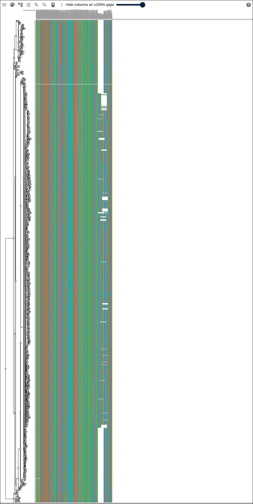
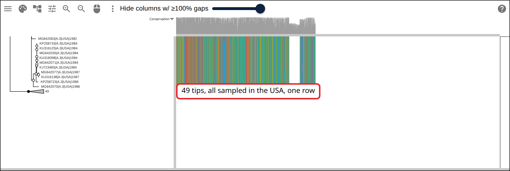
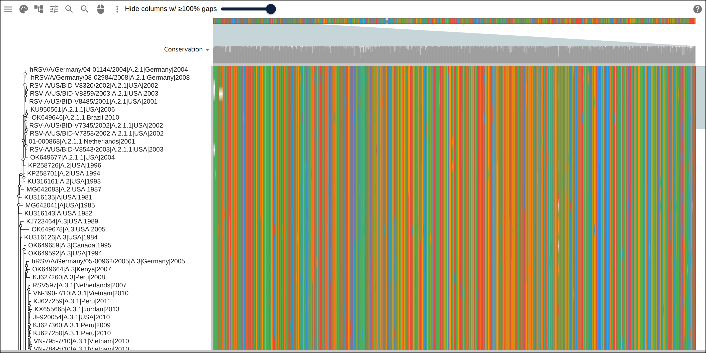
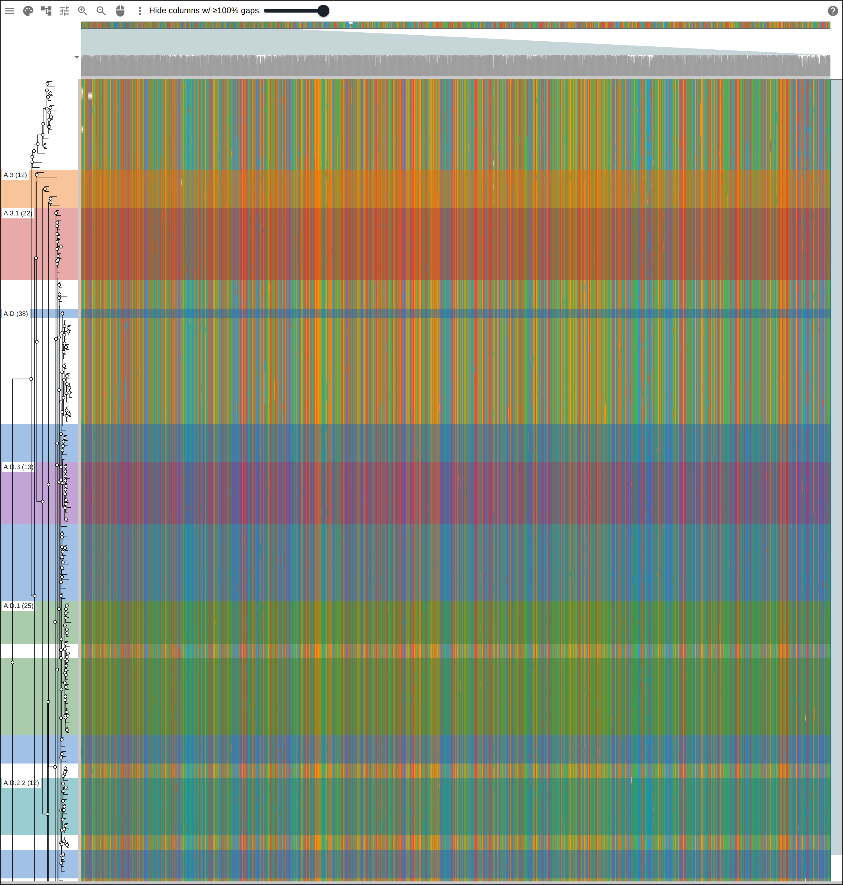
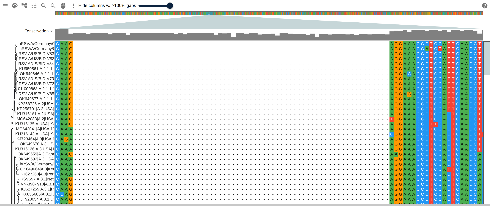
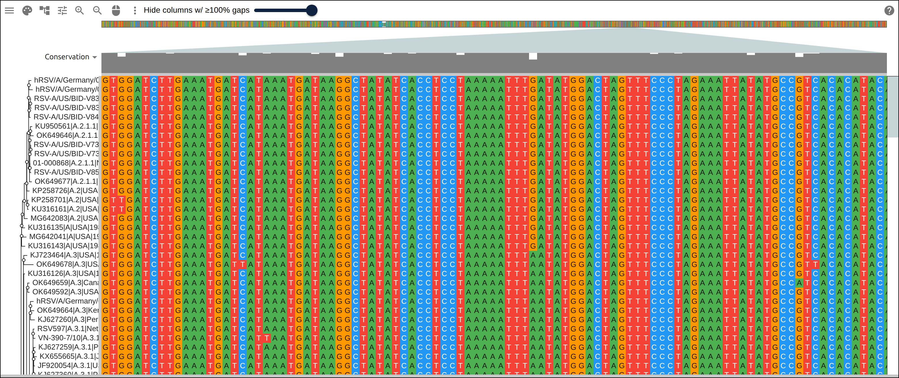

# An RSV phylogeny from a public Nextstrain build

A phylogenetic tree with a dozen tips fits on a screen with room to read every
label. A public health lab tracking a virus works with a tree two orders of
magnitude bigger: one tip per genome sequenced that season, thousands of them,
related by descent rather than by species. This page follows one such tree, a
public Nextstrain build of respiratory syncytial virus, from the genomes already
folded into it to an alignment and tree an alignment viewer can open, and asks
what changes once a dataset has 1,840 rows instead of a dozen.

## Prerequisites

- `curl`
- Python 3, standard library only, nothing to install
- nothing to read along: every figure below links to the live view it captured

## Where the data comes from

Nextstrain's RSV-A build, updated 2024-07-16: a tree over 1,840 genomes, one
ancestral sequence, and the nucleotide substitutions on every branch between
them.

- the auspice JSON itself: https://data.nextstrain.org/rsv_a_genome.json
- the full-tip alignment the build script reconstructs from it, sliced to the G
  gene, hosted so the figures can link to it:
  https://gmod.org/JBrowseMSA/demo/data/scale/rsv-full.aln
- its tree: https://gmod.org/JBrowseMSA/demo/data/scale/rsv-full.nh
- the subsampled whole-genome alignment the later figures use:
  https://gmod.org/JBrowseMSA/demo/data/scale/rsv-sample.aln
- its tree: https://gmod.org/JBrowseMSA/demo/data/scale/rsv-sample.nh

## The genome

RSV-A's genome is 15,225 nucleotides, eleven genes from _NS1_ to _L_. Two of
them anchor this page. _G_, the attachment glycoprotein, carries the ectodomain
that takes the brunt of antibody selection. _L_, the polymerase, replicates the
genome and tolerates change in almost none of its residues. Nextstrain's own
pipeline already places every sampled genome in a tree; what it does not hand
you is one alignment, in one coordinate system, that a viewer can scroll across.

## 1. Reconstruct the alignment from the tree

Every branch in the JSON carries the nucleotide substitutions that happened on
it, numbered against one embedded reference sequence rather than against
whatever sits at the parent node. Copying that reference down each root-to-tip
path, overwriting one base per mutation as you go, produces every tip's full
genome in the same 15,225 coordinates the reference uses:

```python
def reconstruct(node, seq):
    for m in node["branch_attrs"]["mutations"].get("nuc", []):
        pos, alt = int(m[1:-1]), m[-1]
        seq = seq[: pos - 1] + alt + seq[pos:]
    if not node.get("children"):
        tips.append((node["name"], seq))
    else:
        for child in node["children"]:
            reconstruct(child, seq)
```

```
reconstructed 1840 tip sequences, genome length 15225
G gene 4652-5617 (966 nt)
L gene 8532-15029 (6498 nt)
```

No two rows ever need realigning against each other: they were never unaligned
to begin with, since a substitution changes a base without moving anything
around it, and this dataset carries no true insertion relative to the reference.
A deletion becomes a run of gap characters at a fixed position, which is exactly
what an alignment column expects.

## 2. The whole tree at once

Every one of the 1,840 tips, drawn at one pixel of row height, next to the
alignment sliced to the G gene.

[](https://gmod.org/JBrowseMSA/demo/?data=%7B%22msaview%22%3A%7B%22type%22%3A%22MsaView%22%2C%22height%22%3A1900%2C%22treeAreaWidth%22%3A130%2C%22colWidth%22%3A0.3%2C%22rowHeight%22%3A1%2C%22colorSchemeName%22%3A%22nucleotide%22%2C%22msaFilehandle%22%3A%7B%22uri%22%3A%22data%2Fscale%2Frsv-full.aln%22%7D%2C%22treeFilehandle%22%3A%7B%22uri%22%3A%22data%2Fscale%2Frsv-full.nh%22%7D%7D%7D)

All 1,840 tips and the G gene alignment beside them. No label reads at this row
height, and none of the color-scheme letters do either; what survives is the
shape of the tree and a wide pale gap partway down the alignment, a deletion
carried by a large fraction of the rows.

## 3. Collapse a clade

Clicking a node in the tree collapses everything under it into one triangle. The
build script looks for a clade where that triangle means something: every
descendant sharing one clade call and one country.

```
collapse target: node-0-0-1, 49 tips, clade A.1, all USA
```

[](https://gmod.org/JBrowseMSA/demo/?data=%7B%22msaview%22%3A%7B%22type%22%3A%22MsaView%22%2C%22height%22%3A350%2C%22treeAreaWidth%22%3A360%2C%22colWidth%22%3A0.3%2C%22rowHeight%22%3A10%2C%22scrollY%22%3A-17800%2C%22colorSchemeName%22%3A%22nucleotide%22%2C%22collapsed%22%3A%5B%22node-0-0-1%22%5D%2C%22msaFilehandle%22%3A%7B%22uri%22%3A%22data%2Fscale%2Frsv-full.aln%22%7D%2C%22treeFilehandle%22%3A%7B%22uri%22%3A%22data%2Fscale%2Frsv-full.nh%22%7D%7D%7D)

Clade A.1, 49 tips and every one of them sampled in the USA, folded into the
triangle marked 49. It sorts to the very end of the tree's own row order, which
is ladderized by clade size rather than left in file order, so this is the last
90 rows of 1,840 rather than the first.

## 4. Subsample for a readable page

A wall of 1,840 rows is the honest picture, but nothing past this point on the
page is readable at that scale. The remaining figures use every 10th tip in the
file's own order: no seed to explain, and no reason a reader reproducing this on
their own tree would need one either.

```
subsample: 184 of 1840 tips (every 10th)
23 of 24 clades represented in the subsample
```

[](https://gmod.org/JBrowseMSA/demo/?data=%7B%22msaview%22%3A%7B%22type%22%3A%22MsaView%22%2C%22height%22%3A700%2C%22treeAreaWidth%22%3A420%2C%22colWidth%22%3A0.3%2C%22rowHeight%22%3A16%2C%22colorSchemeName%22%3A%22nucleotide%22%2C%22msaFilehandle%22%3A%7B%22uri%22%3A%22data%2Fscale%2Frsv-sample.aln%22%7D%2C%22treeFilehandle%22%3A%7B%22uri%22%3A%22data%2Fscale%2Frsv-sample.nh%22%7D%7D%7D)

184 rows instead of 1,840, and at this row height every strain name beside the
tree reads. Only one of the 24 Nextstrain clades in the full tree has no
representative left; every 10th tip still finds the other 23.

## 5. Group rows by clade

Nothing about row order changes what `highlights` can tint. Reading the clade
each tip carries in its own name back out of the hosted file and coloring the
six largest groups turns the tree's own clustering into bands, without touching
the rows themselves.

[](<https://gmod.org/JBrowseMSA/demo/?data=%7B%22msaview%22%3A%7B%22type%22%3A%22MsaView%22%2C%22height%22%3A1472%2C%22treeAreaWidth%22%3A130%2C%22colWidth%22%3A0.3%2C%22rowHeight%22%3A8%2C%22drawLabels%22%3Afalse%2C%22colorSchemeName%22%3A%22nucleotide%22%2C%22highlights%22%3A%5B%7B%22rows%22%3A%5B%22hRSV%2FA%2FGermany%2F12-02800%2F2012%7CA.D%7CGermany%7C2012%22%2C%22270101030%7CA.D%7CSouth_Africa%7C2018%22%2C%22MN078115%7CA.D%7CUSA%7C2011%22%2C%22270101055%7CA.D%7CSouth_Africa%7C2018%22%2C%22RSVA%2FUSA%2FACRI-037%2F2016%7CA.D%7CUSA%7C2016%22%2C%22p1306-121310721A%7CA.D%7CUSA%7C2013%22%2C%22MH828499%7CA.D%7CVietnam%7C2015%22%2C%22KX765902%7CA.D%7CNew_Zealand%7C2014%22%2C%22MZ221194%7CA.D%7CChina%7C2018%22%2C%22MK749884%7CA.D%7CNicaragua%7C2016%22%2C%22MH828495%7CA.D%7CVietnam%7C2014%22%2C%22SE01A-0172-V02%7CA.D%7CSpain%7C2020%22%2C%22390103016%7CA.D%7CItaly%7C2020%22%2C%22MH760647%7CA.D%7CAustralia%7C2015%22%2C%22KX765916%7CA.D%7CNew_Zealand%7C2015%22%2C%22p1306-121310709A%7CA.D%7CUSA%7C2012%22%2C%22UU02-0045-D04%7CA.D%7CNetherlands%7C2018%22%2C%22HRSV%2FA%2FArgentina%2FBA-HNRG-112%2F2015%7CA.D%7CArgentina%7C2015%22%2C%22HRSV%2FA%2FPhilippines%2F99058%2F2019%7CA.D%7CPhilippines%7C2019%22%2C%22010102023%7CA.D%7CCanada%7C2018%22%2C%22MN536999%7CA.D%7CUSA%7C2015%22%2C%22810103038%7CA.D%7CJapan%7C2019%22%2C%22MK749895%7CA.D%7CNicaragua%7C2016%22%2C%22MH760606%7CA.D%7CAustralia%7C2013%22%2C%22MH760629%7CA.D%7CAustralia%7C2016%22%2C%22KU950654%7CA.D%7CUSA%7C2012%22%2C%22MW160747%7CA.D%7CAustralia%7C2016%22%2C%22Zam-NDL060_2018-03-21%7CA.D%7CZambia%7C2018%22%2C%22UU02-0055-D03%7CA.D%7CNetherlands%7C2018%22%2C%22KX765887%7CA.D%7CNew_Zealand%7C2015%22%2C%22330102006%7CA.D%7CFrance%7C2018%22%2C%22hRSV%2FA%2FGermany%2F18-03012%2F2018%7CA.D%7CGermany%7C2018%22%2C%22330103019%7CA.D%7CFrance%7C2019%22%2C%22b37%7CA.D%7CUSA%7C2016%22%2C%22HRSV%2FA%2FArgentina%2FBA-HNRG-215%2F2016%7CA.D%7CArgentina%7C2016%22%2C%22KEN%2FKILIFI%2FWGS%2F1119_15%2F12%2F2012%7CA.D%7CKenya%7C2012%22%2C%22KEN%2FKILIFI%2FWGS%2F1071_14%2F08%2F2012%7CA.D%7CKenya%7C2012%22%2C%22MN536993%7CA.D%7CUSA%7C2015%22%5D%2C%22color%22%3A%22rgba(21%2C101%2C192%2C0.4)%22%2C%22label%22%3A%22A.D%20(38)%22%7D%2C%7B%22rows%22%3A%5B%22OQ941767%7CA.D.1%7CAustralia%7C2018%22%2C%22RSV-A%2Fhuman%2FUSA%2FWA-S23267%2F2019%7CA.D.1%7CUSA%7C2019%22%2C%22390103014%7CA.D.1%7CItaly%7C2020%22%2C%22358102024%7CA.D.1%7CFinland%7C2019%22%2C%22340102003%7CA.D.1%7CSpain%7C2018%22%2C%22OX02-9657-V01%7CA.D.1%7CUnited_Kingdom%7C2020%22%2C%22UU02-0012-V01%7CA.D.1%7CNetherlands%7C2017%22%2C%22hRSV%2FA%2FGermany%2F19-02346%2F2019%7CA.D.1%7CGermany%7C2019%22%2C%22hRSV-A-G43Q68M3%7CA.D.1%7CUSA%7C2023%22%2C%22RSV-A%2Fhuman%2FUSA%2FWA-S23254%2F2019%7CA.D.1%7CUSA%7C2019%22%2C%22OX02-8260-D03%7CA.D.1%7CUnited_Kingdom%7C2019%22%2C%22358103041%7CA.D.1%7CFinland%7C2020%22%2C%22RSV-A%2FMX%2FUANL-92777%2F2023%7CA.D.1%7CMexico%7C2023%22%2C%22340103016%7CA.D.1%7CSpain%7C2019%22%2C%22MZ151854%7CA.D.1%7CRussia%7C2020%22%2C%22DW-RAT-036%7CA.D.1%7CAustralia%7C2022%22%2C%22RSV-A%2Fhuman%2FUSA%2FWA-S23245%2F2019%7CA.D.1%7CUSA%7C2019%22%2C%22550102148%7CA.D.1%7CBrazil%7C2019%22%2C%22340103038%7CA.D.1%7CSpain%7C2020%22%2C%22070103033%7CA.D.1%7CRussia%7C2020%22%2C%22550102102%7CA.D.1%7CBrazil%7C2019%22%2C%22MN-MDH-RSVA-00391%7CA.D.1%7CUSA%7C2023%22%2C%22Kilifi%2FRSVA%2FHF20179_2022-03-01%7CA.D.1%7CKenya%7C2022%22%2C%22RSV-A%2Fhuman%2FUSA%2FWA-S25218%2F2020%7CA.D.1%7CUSA%7C2020%22%2C%22Kilifi%2FRSVA%2FHF20205_2022-04-13%7CA.D.1%7CKenya%7C2022%22%5D%2C%22color%22%3A%22rgba(46%2C125%2C50%2C0.4)%22%2C%22label%22%3A%22A.D.1%20(25)%22%7D%2C%7B%22rows%22%3A%5B%22JF920047%7CA.3.1%7CUSA%7C2008%22%2C%22OK649601%7CA.3.1%7CBrazil%7C2008%22%2C%22hRSV%2FA%2FGermany%2F10-03936%2F2010%7CA.3.1%7CGermany%7C2010%22%2C%22VN-390-7%2F10%7CA.3.1%7CVietnam%7C2010%22%2C%22RSV597%7CA.3.1%7CNetherlands%7C2007%22%2C%22KX655662%7CA.3.1%7CJordan%7C2011%22%2C%22KF530261%7CA.3.1%7CGermany%7C2008%22%2C%22KEN%2FKILIFI%2FWGS%2F1022_28%2F12%2F2011%7CA.3.1%7CKenya%7C2011%22%2C%22KEN%2FKILIFI%2FWGS%2F1045_10%2F04%2F2012%7CA.3.1%7CKenya%7C2012%22%2C%22Kilifi_11863_15_RSVA_2010%7CA.3.1%7CKenya%7C2010%22%2C%22KJ627360%7CA.3.1%7CPeru%7C2009%22%2C%22KJ627250%7CA.3.1%7CPeru%7C2010%22%2C%22VN-795-7%2F10%7CA.3.1%7CVietnam%7C2010%22%2C%22VN-784-5%2F10%7CA.3.1%7CVietnam%7C2010%22%2C%22JF920054%7CA.3.1%7CUSA%7C2010%22%2C%22KX655665%7CA.3.1%7CJordan%7C2013%22%2C%22KJ627259%7CA.3.1%7CPeru%7C2011%22%2C%22MH760594%7CA.3.1%7CAustralia%7C2010%22%2C%22hRSV%2FA%2FGermany%2F11-01819%2F2011%7CA.3.1%7CGermany%7C2011%22%2C%22hRSV%2FA%2FGermany%2F09-03766%2F2009%7CA.3.1%7CGermany%7C2009%22%2C%22MF001054%7CA.3.1%7CUSA%7C2015%22%2C%22KU962879%7CA.3.1%7CChina%7C2008%22%5D%2C%22color%22%3A%22rgba(198%2C40%2C40%2C0.4)%22%2C%22label%22%3A%22A.3.1%20(22)%22%7D%2C%7B%22rows%22%3A%5B%22330103036%7CA.D.3%7CFrance%7C2019%22%2C%22OX02-9767-D09%7CA.D.3%7CUnited_Kingdom%7C2020%22%2C%22MZ151852%7CA.D.3%7CRussia%7C2020%22%2C%22PP411979%7CA.D.3%7CThailand%7C2023%22%2C%22RSVA%2F20200035%2FBJ%2FCHN%2F2020.01.09%7CA.D.3%7CChina%7C2020%22%2C%22UU01A-0060-V02%7CA.D.3%7CNetherlands%7C2018%22%2C%22010203004%7CA.D.3%7CCanada%7C2019%22%2C%22SE02-0023-V01%7CA.D.3%7CSpain%7C2020%22%2C%22hRSV%2FA%2FGermany%2F22-01517%2F2021%7CA.D.3%7CGermany%7C2021%22%2C%22550102180%7CA.D.3%7CBrazil%7C2019%22%2C%22610102013%7CA.D.3%7CAustralia%7C2019%22%2C%22RSVA%2F20190070%2FBJ%2FCHN%2F2019.01.15%7CA.D.3%7CChina%7C2019%22%2C%22hRSV%2FA%2FGermany%2F23-00760%2F2022%7CA.D.3%7CGermany%7C2022%22%5D%2C%22color%22%3A%22rgba(106%2C27%2C154%2C0.4)%22%2C%22label%22%3A%22A.D.3%20(13)%22%7D%2C%7B%22rows%22%3A%5B%22KP258733%7CA.3%7CUSA%7C1984%22%2C%22KJ723464%7CA.3%7CUSA%7C1989%22%2C%22OK649678%7CA.3%7CUSA%7C2005%22%2C%22KU316126%7CA.3%7CUSA%7C1984%22%2C%22OK649659%7CA.3%7CCanada%7C1995%22%2C%22OK649592%7CA.3%7CUSA%7C1994%22%2C%2207-040054%7CA.3%7CNetherlands%7C2007%22%2C%22hRSV%2FA%2FUSA%2F7E2%2F2010%7CA.3%7CUSA%7C2010%22%2C%22Kilifi_10891_58_RSVA_2006%7CA.3%7CKenya%7C2006%22%2C%22KJ627260%7CA.3%7CPeru%7C2008%22%2C%22hRSV%2FA%2FGermany%2F05-00962%2F2005%7CA.3%7CGermany%7C2005%22%2C%22OK649664%7CA.3%7CKenya%7C2007%22%5D%2C%22color%22%3A%22rgba(239%2C108%2C0%2C0.4)%22%2C%22label%22%3A%22A.3%20(12)%22%7D%2C%7B%22rows%22%3A%5B%22490103017%7CA.D.2.2%7CGermany%7C2020%22%2C%22810103005%7CA.D.2.2%7CJapan%7C2019%22%2C%22810103019%7CA.D.2.2%7CJapan%7C2019%22%2C%22358101013%7CA.D.2.2%7CFinland%7C2018%22%2C%22358101010%7CA.D.2.2%7CFinland%7C2017%22%2C%22MK749911%7CA.D.2.2%7CNicaragua%7C2016%22%2C%22OQ941765%7CA.D.2.2%7CAustralia%7C2018%22%2C%22MW033958%7CA.D.2.2%7CUSA%7C2018%22%2C%22310101018%7CA.D.2.2%7CNetherlands%7C2017%22%2C%22UU02-0093-V01%7CA.D.2.2%7CNetherlands%7C2019%22%2C%22010203010%7CA.D.2.2%7CCanada%7C2019%22%2C%22OX02-8584-V01%7CA.D.2.2%7CUnited_Kingdom%7C2019%22%5D%2C%22color%22%3A%22rgba(0%2C131%2C143%2C0.4)%22%2C%22label%22%3A%22A.D.2.2%20(12)%22%7D%5D%2C%22msaFilehandle%22%3A%7B%22uri%22%3A%22data%2Fscale%2Frsv-sample.aln%22%7D%2C%22treeFilehandle%22%3A%7B%22uri%22%3A%22data%2Fscale%2Frsv-sample.nh%22%7D%7D%7D>)

Six bands, each one Nextstrain clade among the largest in the subsample, drawn
through the alignment colors rather than over them. Five read as one solid run
of rows; A.D does not; it splits into three separate bands here, because
sub-clades like A.D.1 and A.D.3 branch off from inside it, and every tip that
never earned a more specific label keeps calling itself A.D wherever in the tree
that leaves it. The alignment is the full 15,225nt genome at a small column
width, wider than the viewport, so the minimap draws itself across the top with
no separate setting to find.

## 6. Zoom in on the variable end

Base resolution over the 100 columns where every one differs somewhere in the
subsample: 5442-5541, inside G's ectodomain.

[](https://gmod.org/JBrowseMSA/demo/?data=%7B%22msaview%22%3A%7B%22type%22%3A%22MsaView%22%2C%22height%22%3A650%2C%22treeAreaWidth%22%3A170%2C%22colWidth%22%3A14%2C%22rowHeight%22%3A16%2C%22scrollX%22%3A-76034%2C%22colorSchemeName%22%3A%22nucleotide%22%2C%22msaFilehandle%22%3A%7B%22uri%22%3A%22data%2Fscale%2Frsv-sample.aln%22%7D%2C%22treeFilehandle%22%3A%7B%22uri%22%3A%22data%2Fscale%2Frsv-sample.nh%22%7D%7D%7D)

Every column here carries more than one letter down its length, and a block of
rows in the middle of the window run to gap: the same deletion that showed up as
a pale stripe in the whole-tree figure, now readable one column at a time.

## 7. Zoom in on the conserved end

The same viewer, scrolled back to columns 10132-10231, inside _L_.

[](https://gmod.org/JBrowseMSA/demo/?data=%7B%22msaview%22%3A%7B%22type%22%3A%22MsaView%22%2C%22height%22%3A650%2C%22treeAreaWidth%22%3A170%2C%22colWidth%22%3A14%2C%22rowHeight%22%3A16%2C%22scrollX%22%3A-141694%2C%22colorSchemeName%22%3A%22nucleotide%22%2C%22msaFilehandle%22%3A%7B%22uri%22%3A%22data%2Fscale%2Frsv-sample.aln%22%7D%2C%22treeFilehandle%22%3A%7B%22uri%22%3A%22data%2Fscale%2Frsv-sample.nh%22%7D%7D%7D)

Almost every row reads the same letter down almost every column. A handful of
rows carry a substitution here and there; nothing in this window carries a gap.

## Check the counts

The two windows above were not picked by eye. The build script slides a
100-column window across each gene, from the subsampled alignment it already
wrote, and counts how many columns hold more than one letter:

```python
def variable_columns(seqs, start1, end1):
    count = 0
    for col in range(start1 - 1, end1):
        alleles = {s[col] for s in seqs} - {"N"}
        count += len(alleles) > 1
    return count
```

```
G gene: 612/966 variable columns (63.4%)
L gene: 1802/6498 variable columns (27.7%)
G hotspot (5442-5541): 100/100 variable columns
L coldspot (10132-10231): 15/100 variable columns
```

Across the whole gene, not just the 100-column windows the figures show, G still
comes out well over twice as variable as L: 63.4% of its columns differ
somewhere in the subsample against 27.7% of L's.

## Reproduce it end to end

```bash
curl -O https://raw.githubusercontent.com/GMOD/JBrowseMSA/main/docs/tutorials/scripts/build_phylogeny_at_scale.sh
bash build_phylogeny_at_scale.sh
```

With no arguments it fetches the Nextstrain build, writes the four files above
beside it, and prints every number on this page.

## See also

- [A protein family from a list of accessions](https://gmod.org/JBrowseMSA/tutorials/protein_family)
- [User guide](https://gmod.org/JBrowseMSA/guide)
- [Data layers](https://gmod.org/JBrowseMSA/layers)

## References

- Hadfield J, Megill C, Bell SM, et al. Nextstrain: real-time tracking of
  pathogen evolution. _Bioinformatics_ 34:4121-4123.
- Johnson PR, Spriggs MK, Olmsted RA, Collins PL. The G glycoprotein of human
  respiratory syncytial viruses of subgroups A and B: extensive sequence
  divergence between antigenic subgroups. _Proc Natl Acad Sci USA_ 84:5625-5629.
- Goya S, Galiano M, Nauwelaers I, et al. Toward unified molecular surveillance
  of RSV: a proposal for genotype definition and nomenclature harmonized with
  WHO clinical severity groups. _Influenza Other Respir Viruses_ 14:274-285.
