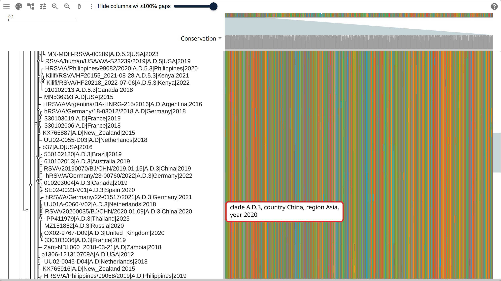
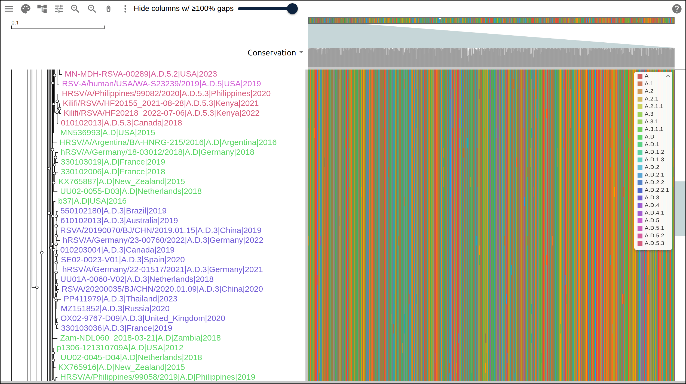
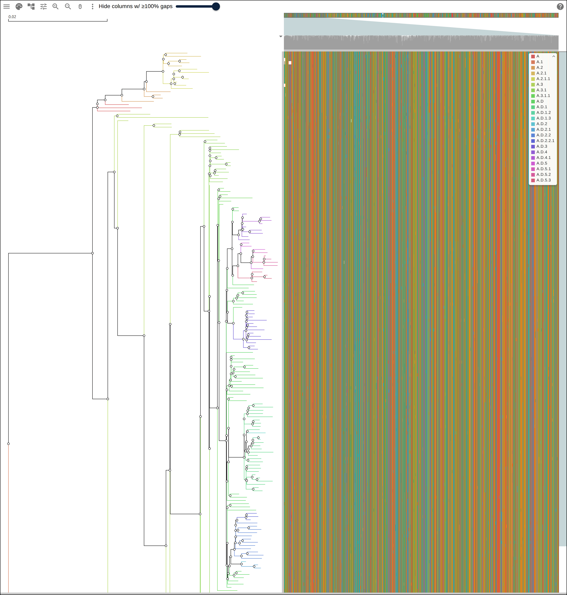
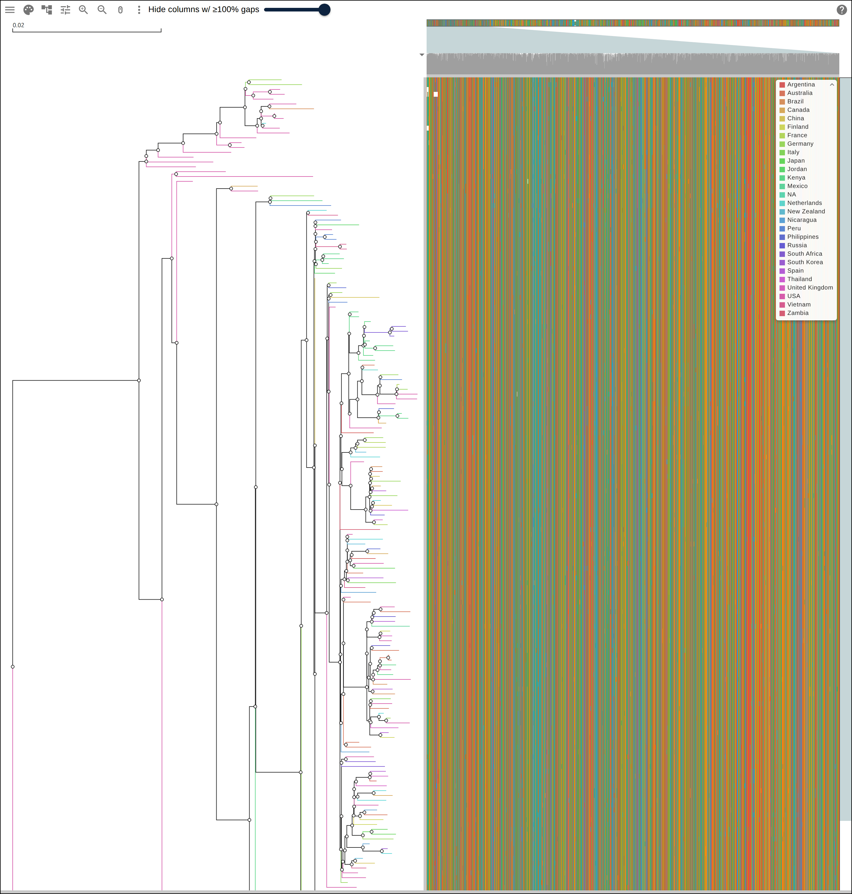
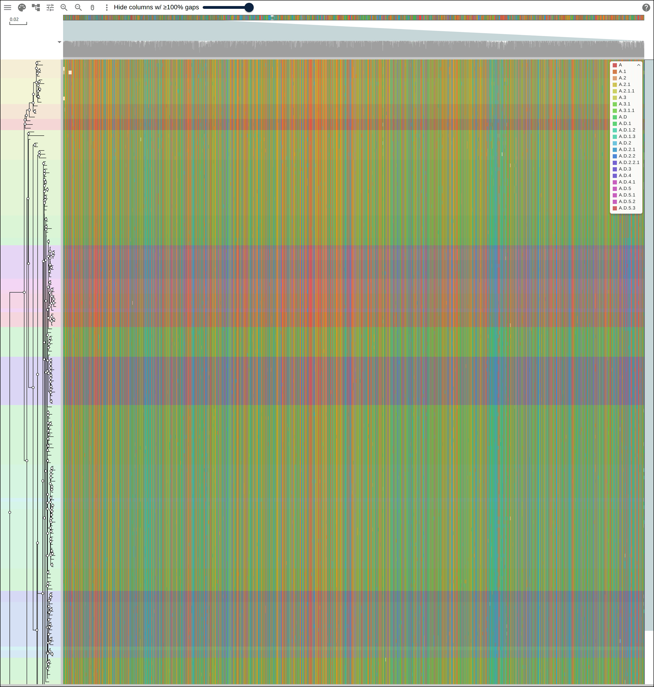
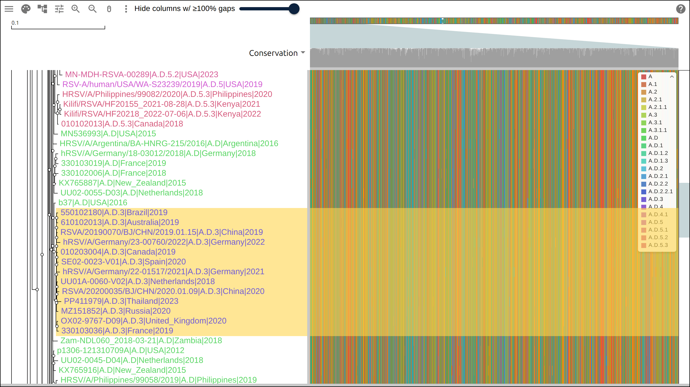
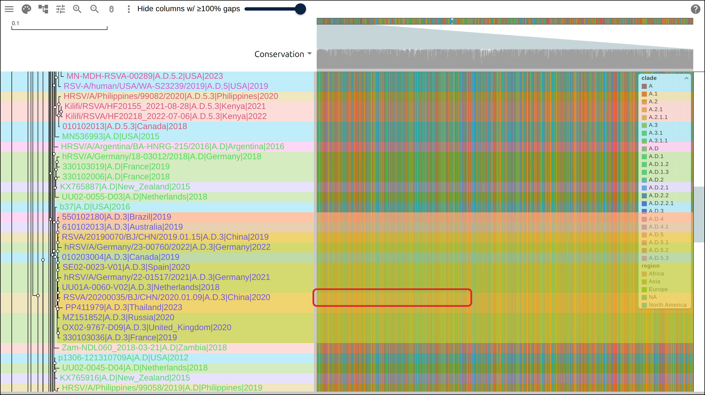

# Coloring an RSV phylogeny by its metadata

A Nextstrain build records a clade call, a country, a collection date and a
world region for every genome it places in its tree.
[An RSV phylogeny from a public Nextstrain build](https://gmod.org/JBrowseMSA/tutorials/phylogeny_at_scale)
reconstructed an alignment and a tree from one such build and packed four of
those fields into each tip name. This page writes the same fields out as a row
table, loads the table into the viewer, and colors the tip labels, the tree
edges and the rows from it, which is ggtree's `groupClade`, `aes(color = group)`
and `geom_hilight` done as data the viewer draws.

## Prerequisites

- Python 3, standard library only, nothing to install
- nothing to read along: every figure below links to the live view it captured

## Where the data comes from

The 184-tip subsample of Nextstrain's RSV-A build, the dataset the
phylogeny-at-scale page ends on, plus one file this page adds.

- the auspice JSON every field comes from:
  https://data.nextstrain.org/rsv_a_genome.json
- the subsampled whole-genome alignment, 184 rows:
  https://gmod.org/JBrowseMSA/demo/data/scale/rsv-sample.aln
- its tree: https://gmod.org/JBrowseMSA/demo/data/scale/rsv-sample.nh
- the row table this page writes:
  https://gmod.org/JBrowseMSA/demo/data/scale/rsv-sample-rowdata.json

## 1. The row table

Every tip in the auspice JSON carries a `node_attrs` object, and four of its
entries hold the fields this page draws with:

```python
def fields_for(node_attrs):
    num_date = node_attrs.get("num_date", {}).get("value")
    return {
        "clade": node_attrs.get("clade_membership", {}).get("value", "NA"),
        "country": node_attrs.get("country", {}).get("value", "NA"),
        "region": node_attrs.get("region", {}).get("value", "NA"),
        "year": str(int(num_date)) if num_date is not None else "NA",
    }
```

A row table is keyed by row name, so the key each record goes under is the tip
label the phylogeny-at-scale build script wrote, `accession|clade|country|year`.
Both scripts build that label with the same `label_for` function, so every key
matches a row of the hosted alignment:

```bash
python3 build_phylogeny_metadata.py .
```

```
1840 tips in the build
wrote ./rsv-sample-rowdata.json: 184 rows, 21 kB
  clade: 23 distinct values
  country: 28 distinct values
  region: 7 distinct values
  year: 37 distinct values
  clade A.D: 38 rows
  clade A.D.1: 25 rows
  clade A.3.1: 22 rows
  clade A.D.3: 13 rows
  clade A.3: 12 rows
```

The 184 rows of the subsample carry 23 distinct clade calls and 28 countries,
and the file holding them is 21 kB. Percent-encoded into a `?data=` link the
table runs past 20,000 characters, well beyond the 8,192-character request line
a link fits in, so the snapshot names the file and the viewer fetches it at
startup:

```json
{
  "type": "MsaView",
  "msaFilehandle": { "uri": "data/scale/rsv-sample.aln" },
  "treeFilehandle": { "uri": "data/scale/rsv-sample.nh" },
  "treeMetadataFilehandle": { "uri": "data/scale/rsv-sample-rowdata.json" }
}
```

[](https://gmod.org/JBrowseMSA/demo/?data=%7B%22msaview%22%3A%7B%22type%22%3A%22MsaView%22%2C%22height%22%3A700%2C%22treeAreaWidth%22%3A560%2C%22colWidth%22%3A0.3%2C%22rowHeight%22%3A18%2C%22drawLabels%22%3Atrue%2C%22scrollY%22%3A-1188%2C%22colorSchemeName%22%3A%22nucleotide%22%2C%22msaFilehandle%22%3A%7B%22uri%22%3A%22data%2Fscale%2Frsv-sample.aln%22%7D%2C%22treeFilehandle%22%3A%7B%22uri%22%3A%22data%2Fscale%2Frsv-sample.nh%22%7D%2C%22treeMetadataFilehandle%22%3A%7B%22uri%22%3A%22data%2Fscale%2Frsv-sample-rowdata.json%22%7D%7D%7D)

Thirty-eight of the 184 rows at a row height that draws labels, with the table
loaded and no channel reading it. Every tip label is in the theme's text color,
and the callout names the four fields the table gives the row it points at.

## 2. Tip labels colored by clade

An `encodings` record names the channel to paint, the field feeding it and the
scale between them. The `tipLabel` channel colors the label beside each tip:

```json
"encodings": [{ "channel": "tipLabel", "field": "clade" }]
```

With 23 clade calls in the table, the field runs past the end of every named
palette, so leaving out `scale` gives each value an evenly spaced hue. The
legend in the top right lists all 23 under the field's name.

[](https://gmod.org/JBrowseMSA/demo/?data=%7B%22msaview%22%3A%7B%22type%22%3A%22MsaView%22%2C%22height%22%3A700%2C%22treeAreaWidth%22%3A560%2C%22colWidth%22%3A0.3%2C%22rowHeight%22%3A18%2C%22drawLabels%22%3Atrue%2C%22scrollY%22%3A-1188%2C%22colorSchemeName%22%3A%22nucleotide%22%2C%22encodings%22%3A%5B%7B%22channel%22%3A%22tipLabel%22%2C%22field%22%3A%22clade%22%7D%5D%2C%22msaFilehandle%22%3A%7B%22uri%22%3A%22data%2Fscale%2Frsv-sample.aln%22%7D%2C%22treeFilehandle%22%3A%7B%22uri%22%3A%22data%2Fscale%2Frsv-sample.nh%22%7D%2C%22treeMetadataFilehandle%22%3A%7B%22uri%22%3A%22data%2Fscale%2Frsv-sample-rowdata.json%22%7D%7D%7D)

The same 38 rows with `drawLabels: true` and a row height of 18, scrolled to
display row 66. The labels turn from green to purple on row 80, where the last
A.D tip gives way to the first A.D.3 tip, and back to green on row 93. The
legend carries one swatch per clade call.

## 3. Branches colored by clade

The `branch` channel gives an internal node the field value its tips agree on
and colors the edge above it. Clade calls nest inside one another, so the tips
under a node agree wherever a single named clade covers them:

```json
"encodings": [{ "channel": "branch", "field": "clade" }]
```

The build script counts the same thing off the tree it pruned:

```
pruned tree: 184 tips, 363 edges
branch by clade: 293/363 edges colored, 109/179 of them above an internal node
```

Each of the 184 terminal edges takes a color, since one tip agrees with itself,
which leaves the 179 internal edges as the count worth reading: 109 of them take
a clade color.

[](https://gmod.org/JBrowseMSA/demo/?data=%7B%22msaview%22%3A%7B%22type%22%3A%22MsaView%22%2C%22height%22%3A1472%2C%22treeAreaWidth%22%3A700%2C%22colWidth%22%3A0.3%2C%22rowHeight%22%3A8%2C%22drawLabels%22%3Afalse%2C%22colorSchemeName%22%3A%22nucleotide%22%2C%22encodings%22%3A%5B%7B%22channel%22%3A%22branch%22%2C%22field%22%3A%22clade%22%7D%5D%2C%22msaFilehandle%22%3A%7B%22uri%22%3A%22data%2Fscale%2Frsv-sample.aln%22%7D%2C%22treeFilehandle%22%3A%7B%22uri%22%3A%22data%2Fscale%2Frsv-sample.nh%22%7D%2C%22treeMetadataFilehandle%22%3A%7B%22uri%22%3A%22data%2Fscale%2Frsv-sample-rowdata.json%22%7D%7D%7D)

All 184 rows at a row height of 8 with the tree area widened to 700 px. Color
runs from the point where each clade splits off out to its tips: green for A.D,
purple for A.D.3, magenta for A.D.5. The backbone from the root down to those
splits draws black, because the tips under those deep nodes carry more than one
clade call between them.

## 4. Branches colored by country

The same channel over the `country` field asks whether the 28 countries fall on
the tree the way the 23 clades do:

```json
"encodings": [{ "channel": "branch", "field": "country" }]
```

```
branch by clade: 293/363 edges colored, 109/179 of them above an internal node
branch by country: 207/363 edges colored, 23/179 of them above an internal node
```

Twenty-three of the 179 internal edges carry a country color, against 109 for
clade.

[](https://gmod.org/JBrowseMSA/demo/?data=%7B%22msaview%22%3A%7B%22type%22%3A%22MsaView%22%2C%22height%22%3A1472%2C%22treeAreaWidth%22%3A700%2C%22colWidth%22%3A0.3%2C%22rowHeight%22%3A8%2C%22drawLabels%22%3Afalse%2C%22colorSchemeName%22%3A%22nucleotide%22%2C%22encodings%22%3A%5B%7B%22channel%22%3A%22branch%22%2C%22field%22%3A%22country%22%7D%5D%2C%22msaFilehandle%22%3A%7B%22uri%22%3A%22data%2Fscale%2Frsv-sample.aln%22%7D%2C%22treeFilehandle%22%3A%7B%22uri%22%3A%22data%2Fscale%2Frsv-sample.nh%22%7D%2C%22treeMetadataFilehandle%22%3A%7B%22uri%22%3A%22data%2Fscale%2Frsv-sample-rowdata.json%22%7D%7D%7D)

The same view over the country field. Color reaches one or two edges deep at the
tips, where a pair of genomes from one country sit together, and the tree inside
each clade stays black. The run of pink at the top left is the one country
cluster big enough to see at this scale, USA genomes on display rows 12 to 18
sampled between 1981 and 1996.

## 5. Rows tinted by clade

The `rowTint` channel washes a color across the whole row, the tree gutter and
the alignment together:

```json
"encodings": [{ "channel": "rowTint", "field": "clade" }]
```

Step 5 of the
[phylogeny-at-scale page](https://gmod.org/JBrowseMSA/tutorials/phylogeny_at_scale)
drew bands over the same 184 rows by listing the row names of its six largest
clades in six `highlights` records: 122 names, 6,586 characters of the link. One
`rowTint` record draws a band for each of the 23 clades in the table.

[](https://gmod.org/JBrowseMSA/demo/?data=%7B%22msaview%22%3A%7B%22type%22%3A%22MsaView%22%2C%22height%22%3A1472%2C%22treeAreaWidth%22%3A130%2C%22colWidth%22%3A0.3%2C%22rowHeight%22%3A8%2C%22drawLabels%22%3Afalse%2C%22colorSchemeName%22%3A%22nucleotide%22%2C%22encodings%22%3A%5B%7B%22channel%22%3A%22rowTint%22%2C%22field%22%3A%22clade%22%7D%5D%2C%22msaFilehandle%22%3A%7B%22uri%22%3A%22data%2Fscale%2Frsv-sample.aln%22%7D%2C%22treeFilehandle%22%3A%7B%22uri%22%3A%22data%2Fscale%2Frsv-sample.nh%22%7D%2C%22treeMetadataFilehandle%22%3A%7B%22uri%22%3A%22data%2Fscale%2Frsv-sample-rowdata.json%22%7D%7D%7D)

All 184 rows at the geometry the phylogeny-at-scale page used for its bands.
Each tint runs from the left edge of the tree gutter across the alignment at 25%
opacity, so the nucleotide colors under it stay readable. The green bands on
rows 93 to 108 and 137 to 142 are A.D, the purple band on rows 80 to 92 is
A.D.3, and the blue band on rows 146 to 157 is A.D.2.2.

## 6. A rectangle over one clade

A `clades` record marks a clade of the tree. `mrca` names two tips whose common
ancestor is the clade, and `tips` is the leaf count the producer measured under
that ancestor:

```json
"clades": [
  {
    "mrca": ["330103036|A.D.3|France|2019", "MZ151852|A.D.3|Russia|2020"],
    "tips": 13,
    "mark": "highlight",
    "color": "#ffd54f"
  }
]
```

The script picks both names and the count. It walks the pruned tree for the
clade calls whose tips are exactly the tips under one node, and takes the
largest:

```
13 of the 23 clades are one node's tips
largest of them: A.D.3, 13 tips
  mrca tips: 330103036|A.D.3|France|2019 and MZ151852|A.D.3|Russia|2020
A.D.3 spans display rows 80-92
```

The two names sit under different children of that node, so their common
ancestor is the node itself whatever the tree does below them. The viewer
resolves the ancestor, counts the leaves under it and compares the count with
the 13 in the record. Writing 12 there drops the rectangle, so a re-rooted or
re-estimated tree loses the mark while the count guards which clade it covers.

[](https://gmod.org/JBrowseMSA/demo/?data=%7B%22msaview%22%3A%7B%22type%22%3A%22MsaView%22%2C%22height%22%3A700%2C%22treeAreaWidth%22%3A560%2C%22colWidth%22%3A0.3%2C%22rowHeight%22%3A18%2C%22drawLabels%22%3Atrue%2C%22scrollY%22%3A-1188%2C%22colorSchemeName%22%3A%22nucleotide%22%2C%22encodings%22%3A%5B%7B%22channel%22%3A%22tipLabel%22%2C%22field%22%3A%22clade%22%7D%5D%2C%22clades%22%3A%5B%7B%22mrca%22%3A%5B%22330103036%7CA.D.3%7CFrance%7C2019%22%2C%22MZ151852%7CA.D.3%7CRussia%7C2020%22%5D%2C%22tips%22%3A13%2C%22mark%22%3A%22highlight%22%2C%22color%22%3A%22%23ffd54f%22%7D%5D%2C%22msaFilehandle%22%3A%7B%22uri%22%3A%22data%2Fscale%2Frsv-sample.aln%22%7D%2C%22treeFilehandle%22%3A%7B%22uri%22%3A%22data%2Fscale%2Frsv-sample.nh%22%7D%2C%22treeMetadataFilehandle%22%3A%7B%22uri%22%3A%22data%2Fscale%2Frsv-sample-rowdata.json%22%7D%7D%7D)

The amber rectangle over display rows 80 to 92, starting at the branch point the
two named tips share and running across the tree labels and the alignment. All
13 labels inside it read A.D.3 and carry the purple the `tipLabel` channel gives
that value.

## 7. The link, and one row checked against the JSON

Every layer above is a property of the view, so the whole figure travels in one
link. The last one carries the three filehandles, two encodings and the clade
record, and moves the tint to the `region` field, which adds a second legend:

```json
"encodings": [
  { "channel": "tipLabel", "field": "clade" },
  { "channel": "rowTint", "field": "region" }
]
```

[](https://gmod.org/JBrowseMSA/demo/?data=%7B%22msaview%22%3A%7B%22type%22%3A%22MsaView%22%2C%22height%22%3A700%2C%22treeAreaWidth%22%3A560%2C%22colWidth%22%3A0.3%2C%22rowHeight%22%3A18%2C%22drawLabels%22%3Atrue%2C%22scrollY%22%3A-1188%2C%22colorSchemeName%22%3A%22nucleotide%22%2C%22encodings%22%3A%5B%7B%22channel%22%3A%22tipLabel%22%2C%22field%22%3A%22clade%22%7D%2C%7B%22channel%22%3A%22rowTint%22%2C%22field%22%3A%22region%22%7D%5D%2C%22clades%22%3A%5B%7B%22mrca%22%3A%5B%22330103036%7CA.D.3%7CFrance%7C2019%22%2C%22MZ151852%7CA.D.3%7CRussia%7C2020%22%5D%2C%22tips%22%3A13%2C%22mark%22%3A%22highlight%22%2C%22color%22%3A%22%23ffd54f%22%7D%5D%2C%22msaFilehandle%22%3A%7B%22uri%22%3A%22data%2Fscale%2Frsv-sample.aln%22%7D%2C%22treeFilehandle%22%3A%7B%22uri%22%3A%22data%2Fscale%2Frsv-sample.nh%22%7D%2C%22treeMetadataFilehandle%22%3A%7B%22uri%22%3A%22data%2Fscale%2Frsv-sample-rowdata.json%22%7D%7D%7D)

Labels colored by clade, rows tinted by region, the A.D.3 rectangle over rows 80
to 92, and two legends stacked in the top right, one per field. The region tint
changes color from row to row inside the rectangle, where the clade colors held
one band. The red box marks the row the check below reads.

The row in the box is the tip the build script prints last, with its entry in
the auspice JSON beside the record the table gives it:

```
check tip: RSVA/20200035/BJ/CHN/2020.01.09|A.D.3|China|2020, display row 88
  node_attrs: {"clade_membership": {"value": "A.D.3"}, "country": {"value": "China", "confidence": {"China": 1.0}, "entropy": -1.000088900581841e-12}, "region": {"value": "Asia"}, "num_date": {"value": 2020.0232240437158}}
  row: {"clade": "A.D.3", "country": "China", "region": "Asia", "year": "2020"}
```

On screen that row has a purple label, the A.D.3 color in the clade legend; it
sits inside the amber rectangle, whose 13 tips are the A.D.3 clade; and its tint
is the Asia color in the region legend. The date rounds down to the year 2020,
which is the last field of the row name the tree already carried.

## Reproduce it end to end

```bash
curl -O https://raw.githubusercontent.com/GMOD/JBrowseMSA/main/docs/tutorials/scripts/build_phylogeny_metadata.py
python3 build_phylogeny_metadata.py .
```

The argument is the directory to work in. The script fetches the Nextstrain
build there, writes `rsv-sample-rowdata.json` beside it, and prints every number
on this page. The alignment and the tree come from
[`build_phylogeny_at_scale.sh`](https://raw.githubusercontent.com/GMOD/JBrowseMSA/main/docs/tutorials/scripts/build_phylogeny_at_scale.sh),
which takes the same subsample of the same build.

## See also

- [An RSV phylogeny from a public Nextstrain build](https://gmod.org/JBrowseMSA/tutorials/phylogeny_at_scale)
- [Data layers](https://gmod.org/JBrowseMSA/layers)
- [User guide](https://gmod.org/JBrowseMSA/guide)

## References

- Hadfield J, Megill C, Bell SM, et al. Nextstrain: real-time tracking of
  pathogen evolution. _Bioinformatics_ 34:4121-4123.
- Yu G, Smith DK, Zhu H, Guan Y, Lam TT. ggtree: an R package for visualization
  and annotation of phylogenetic trees with their covariates and other
  associated data. _Methods Ecol Evol_ 8:28-36.
- Goya S, Galiano M, Nauwelaers I, et al. Toward unified molecular surveillance
  of RSV: a proposal for genotype definition and nomenclature harmonized with
  WHO clinical severity groups. _Influenza Other Respir Viruses_ 14:274-285.
