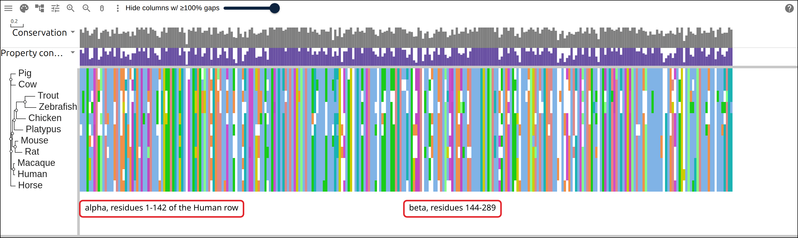
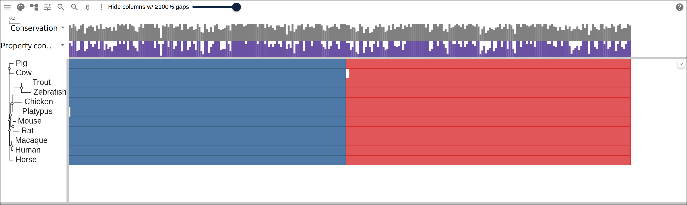
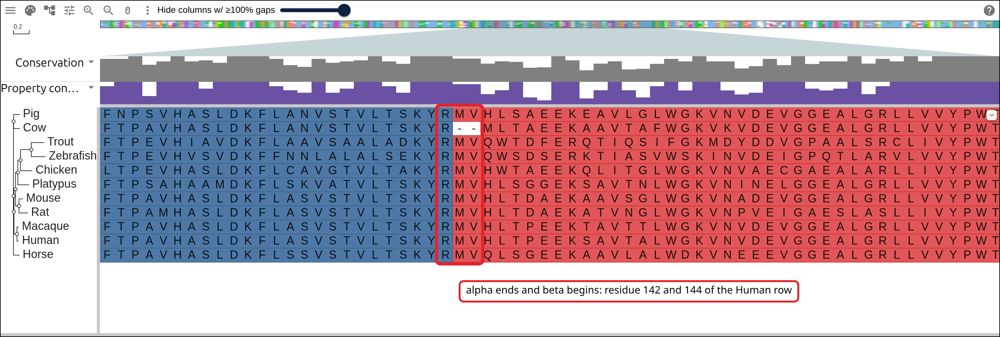
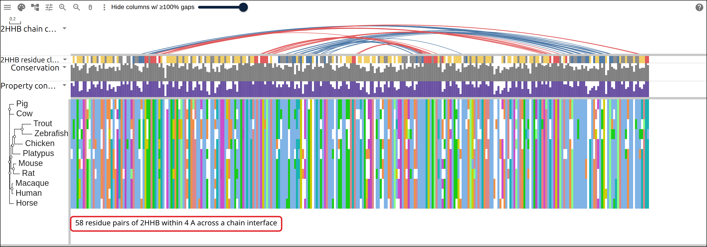
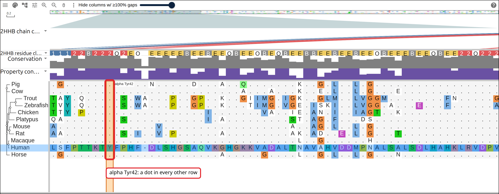
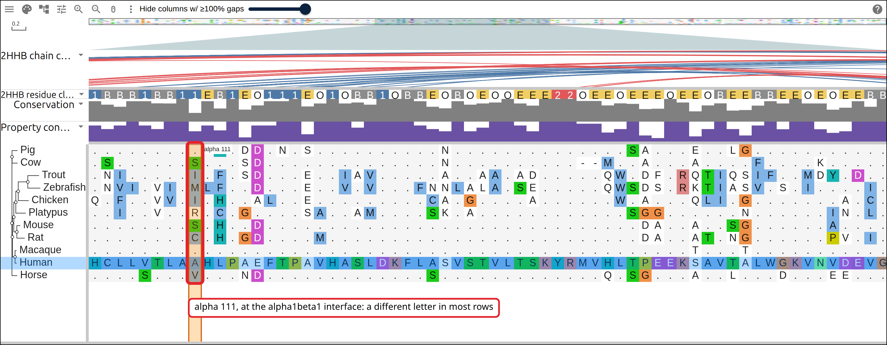
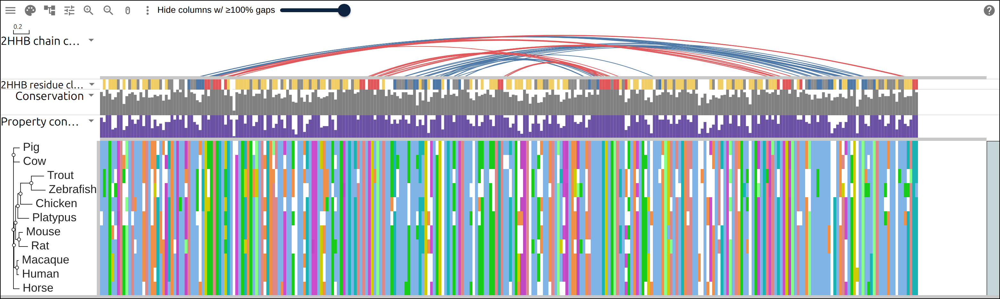

# Hemoglobin's two subunits and the interfaces between them

Hemoglobin is a tetramer of two alpha and two beta chains, and the residues that
hold it together sit on two kinds of interface: alpha1beta1, the packing
contacts that keep a dimer together, and alpha1beta2, the sliding contacts that
move when the tetramer binds oxygen. The viewer holds one sequence per row, so
this page gives each species one row with its alpha and its beta concatenated,
and draws every residue pair in contact between two chains of PDB 2HHB as an arc
from the alpha block to the beta block. Eleven vertebrates, 22 RefSeq proteins,
and the last section reads how conserved each interface is against the residues
on the surface, which touch nothing.

## Prerequisites

- `curl`
- ClustalW, `apt install clustalw` on Debian or Ubuntu, `brew install clustal-w`
  on macOS. ClustalW both aligns and infers a tree, so this page needs no other
  aligner.
- python3 with Biopython, `pip install biopython`, for the contacts and the
  solvent exposure

Every figure below links to the live view it captured.

## Where the data comes from

Twenty-two globin proteins as NCBI RefSeq holds them, and one crystal structure
from RCSB.

- all 22 protein sequences, one request:
  https://eutils.ncbi.nlm.nih.gov/entrez/eutils/efetch.fcgi?db=protein&id=NP_000549.1,NP_000509.1&rettype=fasta&retmode=text
- the human deoxyhemoglobin tetramer, PDB 2HHB, as mmCIF:
  https://files.rcsb.org/download/2HHB.cif
- the row table the commands below start from, hosted so the figures can link to
  it: https://gmod.org/JBrowseMSA/demo/data/hemoglobin/hemoglobin-rows.tsv
- the alignment they write:
  https://gmod.org/JBrowseMSA/demo/data/hemoglobin/hemoglobin.afa
- its tree: https://gmod.org/JBrowseMSA/demo/data/hemoglobin/hemoglobin.nwk
- the subunit spans:
  https://gmod.org/JBrowseMSA/demo/data/hemoglobin/hemoglobin-subunits.gff
- the contacts and the chain mappings, the layers the links below carry:
  https://gmod.org/JBrowseMSA/demo/data/hemoglobin/hemoglobin-layers.json

## 1. Name the rows

Write one species per line: the label the viewer draws, then the RefSeq protein
for the alpha subunit and for the beta subunit. The label becomes the FASTA
defline, the tree tip, the GFF seq_id and the `row` of every layer.

```
Human	NP_000549.1	NP_000509.1
Macaque	NP_001038189.1	NP_001157900.1
Mouse	NP_032244.2	NP_001188320.1
Rat	NP_001007723.1	NP_942071.2
Cow	NP_001070890.2	NP_776342.1
Pig	NP_001432111.1	NP_001138313.1
Horse	NP_001078901.1	NP_001157490.1
Platypus	XP_028905054.1	XP_028913684.1
Chicken	NP_001004376.1	NP_990820.1
Zebrafish	NP_571332.3	NP_001003431.2
Trout	NP_001118023.1	XP_021413554.1
```

Seven placental mammals, a monotreme, a bird and two fish. The human pair is
_HBA1_ and _HBB_; each other species contributes its adult alpha and adult beta
chain.

## 2. Fetch the sequences

One `efetch` request takes every accession, and a short script splits the result
into one FASTA per subunit, with the species label as the defline so the two
files pair up by name:

```bash
ids=$(awk -F'\t' '{printf "%s%s,%s", sep, $2, $3; sep=","}' rows.tsv)
curl -sf "https://eutils.ncbi.nlm.nih.gov/entrez/eutils/efetch.fcgi?db=protein&id=$ids&rettype=fasta&retmode=text" \
  -o globins-ncbi.fasta
```

```
Human      alpha NP_000549.1     142 aa   beta NP_000509.1     147 aa
Macaque    alpha NP_001038189.1  142 aa   beta NP_001157900.1  147 aa
Mouse      alpha NP_032244.2     142 aa   beta NP_001188320.1  147 aa
Rat        alpha NP_001007723.1  142 aa   beta NP_942071.2     147 aa
Cow        alpha NP_001070890.2  142 aa   beta NP_776342.1     145 aa
Pig        alpha NP_001432111.1  142 aa   beta NP_001138313.1  147 aa
Horse      alpha NP_001078901.1  142 aa   beta NP_001157490.1  147 aa
Platypus   alpha XP_028905054.1  141 aa   beta XP_028913684.1  147 aa
Chicken    alpha NP_001004376.1  142 aa   beta NP_990820.1     147 aa
Zebrafish  alpha NP_571332.3     143 aa   beta NP_001003431.2  147 aa
Trout      alpha NP_001118023.1  143 aa   beta XP_021413554.1  147 aa
```

Every alpha is 141 to 143 residues and every beta 145 to 147, initiator
methionine included. The Cow beta is two residues short at the N terminus, and
the two fish alphas carry one extra.

## 3. Align each subunit on its own

Alpha and beta are paralogs, and an aligner given both would put them in shared
columns. Each subunit gets its own alignment, and the two are joined per species
afterwards:

```bash
for sub in alpha beta; do
  clustalw -INFILE=$sub.fasta -ALIGN -TYPE=PROTEIN -OUTORDER=INPUT \
    -OUTPUT=FASTA -OUTFILE=$sub.afa
done
```

`-OUTORDER=INPUT` keeps the rows in the table's order, so the two files line up
by position as well as by name. Concatenating them is a loop over the labels:

```python
alpha = read('alpha.afa')
beta = read('beta.afa')
with open('hemoglobin.afa', 'w') as fh:
    for name, a in alpha.items():
        fh.write(f'>{name}\n{a}{beta[name]}\n')
```

```
alpha: 143 columns, beta: 147 columns
concatenated: 290 columns, beta starts at column 144
```

[](https://gmod.org/JBrowseMSA/demo/#data=%7B%22msaview%22%3A%7B%22type%22%3A%22MsaView%22%2C%22height%22%3A460%2C%22treeAreaWidth%22%3A150%2C%22colWidth%22%3A4.4%2C%22rowHeight%22%3A22%2C%22colorSchemeName%22%3A%22clustalx_protein_dynamic%22%2C%22msaFilehandle%22%3A%7B%22uri%22%3A%22data%2Fhemoglobin%2Fhemoglobin.afa%22%7D%2C%22treeFilehandle%22%3A%7B%22uri%22%3A%22data%2Fhemoglobin%2Fhemoglobin.nwk%22%7D%7D%7D)

Eleven rows of 290 columns, the alpha block to the left of column 144 and the
beta block to its right, with the tree inferred from the concatenation in
step 5.

## 4. Mark the subunits

A GFF gives every row its two spans, in that row's own residue numbering, so the
boundary lands on the right residue in the rows whose alpha is one residue
shorter or longer. A `color=` attribute on each line sets the overlay's color:

```python
alen = len(a.replace('-', ''))
blen = len(b.replace('-', ''))
g.write(f'{name}\tRefSeq\tpolypeptide_region\t1\t{alen}\t.\t.\t.\t'
        f'Name=alpha;signature_desc=hemoglobin subunit alpha;color=%234e79a7\n')
g.write(f'{name}\tRefSeq\tpolypeptide_region\t{alen + 1}\t{alen + blen}\t.\t.\t.\t'
        f'Name=beta;signature_desc=hemoglobin subunit beta;color=%23e15759\n')
```

```
Human	RefSeq	polypeptide_region	1	142	.	.	.	Name=alpha;signature_desc=hemoglobin subunit alpha;color=%234e79a7
Human	RefSeq	polypeptide_region	143	289	.	.	.	Name=beta;signature_desc=hemoglobin subunit beta;color=%23e15759
```

[](https://gmod.org/JBrowseMSA/demo/#data=%7B%22msaview%22%3A%7B%22type%22%3A%22MsaView%22%2C%22height%22%3A460%2C%22treeAreaWidth%22%3A150%2C%22colWidth%22%3A4.4%2C%22rowHeight%22%3A22%2C%22colorSchemeName%22%3A%22clustalx_protein_dynamic%22%2C%22msaFilehandle%22%3A%7B%22uri%22%3A%22data%2Fhemoglobin%2Fhemoglobin.afa%22%7D%2C%22treeFilehandle%22%3A%7B%22uri%22%3A%22data%2Fhemoglobin%2Fhemoglobin.nwk%22%7D%2C%22gffFilehandle%22%3A%7B%22uri%22%3A%22data%2Fhemoglobin%2Fhemoglobin-subunits.gff%22%7D%2C%22showDomainLegend%22%3Afalse%7D%7D)

The two spans as the overlay draws them, blue for alpha and red for beta. The
Platypus row has a one-column gap at the start of its alpha, and the Cow row a
two-column gap at the start of its beta.

[](https://gmod.org/JBrowseMSA/demo/#data=%7B%22msaview%22%3A%7B%22type%22%3A%22MsaView%22%2C%22height%22%3A520%2C%22treeAreaWidth%22%3A150%2C%22colWidth%22%3A22%2C%22rowHeight%22%3A22%2C%22scrollX%22%3A-2596%2C%22colorSchemeName%22%3A%22clustalx_protein_dynamic%22%2C%22msaFilehandle%22%3A%7B%22uri%22%3A%22data%2Fhemoglobin%2Fhemoglobin.afa%22%7D%2C%22treeFilehandle%22%3A%7B%22uri%22%3A%22data%2Fhemoglobin%2Fhemoglobin.nwk%22%7D%2C%22gffFilehandle%22%3A%7B%22uri%22%3A%22data%2Fhemoglobin%2Fhemoglobin-subunits.gff%22%7D%2C%22showDomainLegend%22%3Afalse%7D%7D)

The boundary at residue resolution. The last alpha residue is R in every row,
the first beta residues are MV in ten of them, and the Cow row has two gap
columns where its beta chain starts two residues later.

## 5. Infer a tree

```bash
clustalw -INFILE=hemoglobin.afa -TREE -TYPE=PROTEIN -OUTPUTTREE=phylip
tr -d '[:space:]' < hemoglobin.ph > hemoglobin.nwk
```

```
(((Human:0.02366,Macaque:0.02133):0.03786,((Mouse:0.04913,Rat:0.11350):0.04393,
(Platypus:0.14248,(Chicken:0.15042,(Zebrafish:0.18011,Trout:0.16126):0.13737):0.03453)
:0.02900):0.01972):0.00663,(Cow:0.07886,Pig:0.07794):0.00138,Horse:0.07648);
```

The two fish sit together at the end of the longest branch, Chicken joins them
next, then Platypus, and the seven placentals fill the rest of the tree.

## 6. Read the contacts off the structure

2HHB is the human deoxy tetramer at 1.74 Å. Chains A and C are alpha, B and D
are beta; chain A touches B across the alpha1beta1 interface and D across
alpha1beta2. Biopython's `NeighborSearch` finds every residue pair with a heavy
atom of each within 4 Å:

```python
from Bio.PDB import MMCIFParser, NeighborSearch

def contacts(c1, c2, cutoff=4.0):
    ns = NeighborSearch([a for r in c2 for a in r])
    pairs = set()
    for r in c1:
        for atom in r:
            for other in ns.search(atom.coord, cutoff):
                pairs.add((r.id[1], other.get_parent().id[1]))
    return sorted(pairs)

model = MMCIFParser(QUIET=True).get_structure('2HHB', '2hhb.cif')[0]
alpha1beta1 = contacts(model['A'], model['B'])
alpha1beta2 = contacts(model['A'], model['D'])
```

The RefSeq rows keep the initiator methionine and the mature chains in the
crystal do not, so the script finds each chain's sequence inside the Human row
before trusting a single number:

```
chain A (141 aa) is row residues 2-142 of Human, chain B (146 aa) is 144-289
the Human row is 289 residues: alpha 1-142, beta 143-289
alpha1beta1: 32 residue pairs within 4.0 A, 14 alpha residues and 17 beta residues
alpha1beta2: 26 residue pairs within 4.0 A, 14 alpha residues and 14 beta residues
```

Chain residue n is row residue n + 1 within its subunit, and beta residue n is
row residue 143 + n. Every pair becomes an arc from its alpha column to its beta
column, colored by interface, in an `arc` column track over the Human row. A
second, `text` track gives every residue of that row a class: `1` and `2` for
the two interfaces, and for the rest, `B` where the residue is buried in the
assembled tetramer, `E` where it is exposed, and `O` between. The exposure comes
from Biopython's `ShrakeRupley` over the whole tetramer, divided by the residue
type's maximum accessible area:

```
residue classes on the Human row: 29 at alpha1beta1, 28 at alpha1beta2, 73 buried, 107 exposed, 52 in between
```

The script also writes two `residueMappings` records for the Human row, one per
chain, so a host can look any residue of the row up in the structure.

[](https://gmod.org/JBrowseMSA/demo/#data=%7B%22msaview%22%3A%7B%22type%22%3A%22MsaView%22%2C%22height%22%3A540%2C%22treeAreaWidth%22%3A150%2C%22colWidth%22%3A4.4%2C%22rowHeight%22%3A22%2C%22colorSchemeName%22%3A%22clustalx_protein_dynamic%22%2C%22msaFilehandle%22%3A%7B%22uri%22%3A%22data%2Fhemoglobin%2Fhemoglobin.afa%22%7D%2C%22treeFilehandle%22%3A%7B%22uri%22%3A%22data%2Fhemoglobin%2Fhemoglobin.nwk%22%7D%2C%22columnTracks%22%3A%5B%7B%22id%22%3A%222hhb-contacts%22%2C%22name%22%3A%222HHB%20chain%20contacts%22%2C%22kind%22%3A%22arc%22%2C%22row%22%3A%22Human%22%2C%22arcs%22%3A%5B%7B%22start%22%3A32%2C%22end%22%3A265%2C%22color%22%3A%22%234e79a7%22%7D%2C%7B%22start%22%3A32%2C%22end%22%3A266%2C%22color%22%3A%22%234e79a7%22%7D%2C%7B%22start%22%3A32%2C%22end%22%3A267%2C%22color%22%3A%22%234e79a7%22%7D%2C%7B%22start%22%3A32%2C%22end%22%3A270%2C%22color%22%3A%22%234e79a7%22%7D%2C%7B%22start%22%3A35%2C%22end%22%3A267%2C%22color%22%3A%22%234e79a7%22%7D%2C%7B%22start%22%3A35%2C%22end%22%3A271%2C%22color%22%3A%22%234e79a7%22%7D%2C%7B%22start%22%3A36%2C%22end%22%3A270%2C%22color%22%3A%22%234e79a7%22%7D%2C%7B%22start%22%3A36%2C%22end%22%3A271%2C%22color%22%3A%22%234e79a7%22%7D%2C%7B%22start%22%3A36%2C%22end%22%3A274%2C%22color%22%3A%22%234e79a7%22%7D%2C%7B%22start%22%3A37%2C%22end%22%3A274%2C%22color%22%3A%22%234e79a7%22%7D%2C%7B%22start%22%3A104%2C%22end%22%3A251%2C%22color%22%3A%22%234e79a7%22%7D%2C%7B%22start%22%3A104%2C%22end%22%3A274%2C%22color%22%3A%22%234e79a7%22%7D%2C%7B%22start%22%3A108%2C%22end%22%3A254%2C%22color%22%3A%22%234e79a7%22%7D%2C%7B%22start%22%3A108%2C%22end%22%3A258%2C%22color%22%3A%22%234e79a7%22%7D%2C%7B%22start%22%3A108%2C%22end%22%3A270%2C%22color%22%3A%22%234e79a7%22%7D%2C%7B%22start%22%3A111%2C%22end%22%3A255%2C%22color%22%3A%22%234e79a7%22%7D%2C%7B%22start%22%3A111%2C%22end%22%3A258%2C%22color%22%3A%22%234e79a7%22%7D%2C%7B%22start%22%3A111%2C%22end%22%3A259%2C%22color%22%3A%22%234e79a7%22%7D%2C%7B%22start%22%3A112%2C%22end%22%3A258%2C%22color%22%3A%22%234e79a7%22%7D%2C%7B%22start%22%3A112%2C%22end%22%3A262%2C%22color%22%3A%22%234e79a7%22%7D%2C%7B%22start%22%3A115%2C%22end%22%3A259%2C%22color%22%3A%22%234e79a7%22%7D%2C%7B%22start%22%3A118%2C%22end%22%3A173%2C%22color%22%3A%22%234e79a7%22%7D%2C%7B%22start%22%3A118%2C%22end%22%3A259%2C%22color%22%3A%22%234e79a7%22%7D%2C%7B%22start%22%3A119%2C%22end%22%3A173%2C%22color%22%3A%22%234e79a7%22%7D%2C%7B%22start%22%3A120%2C%22end%22%3A173%2C%22color%22%3A%22%234e79a7%22%7D%2C%7B%22start%22%3A120%2C%22end%22%3A176%2C%22color%22%3A%22%234e79a7%22%7D%2C%7B%22start%22%3A120%2C%22end%22%3A198%2C%22color%22%3A%22%234e79a7%22%7D%2C%7B%22start%22%3A123%2C%22end%22%3A173%2C%22color%22%3A%22%234e79a7%22%7D%2C%7B%22start%22%3A123%2C%22end%22%3A177%2C%22color%22%3A%22%234e79a7%22%7D%2C%7B%22start%22%3A123%2C%22end%22%3A255%2C%22color%22%3A%22%234e79a7%22%7D%2C%7B%22start%22%3A127%2C%22end%22%3A177%2C%22color%22%3A%22%234e79a7%22%7D%2C%7B%22start%22%3A127%2C%22end%22%3A178%2C%22color%22%3A%22%234e79a7%22%7D%2C%7B%22start%22%3A38%2C%22end%22%3A289%2C%22color%22%3A%22%23e15759%22%7D%2C%7B%22start%22%3A39%2C%22end%22%3A243%2C%22color%22%3A%22%23e15759%22%7D%2C%7B%22start%22%3A41%2C%22end%22%3A289%2C%22color%22%3A%22%23e15759%22%7D%2C%7B%22start%22%3A42%2C%22end%22%3A240%2C%22color%22%3A%22%23e15759%22%7D%2C%7B%22start%22%3A42%2C%22end%22%3A242%2C%22color%22%3A%22%23e15759%22%7D%2C%7B%22start%22%3A42%2C%22end%22%3A288%2C%22color%22%3A%22%23e15759%22%7D%2C%7B%22start%22%3A43%2C%22end%22%3A183%2C%22color%22%3A%22%23e15759%22%7D%2C%7B%22start%22%3A43%2C%22end%22%3A242%2C%22color%22%3A%22%23e15759%22%7D%2C%7B%22start%22%3A45%2C%22end%22%3A240%2C%22color%22%3A%22%23e15759%22%7D%2C%7B%22start%22%3A92%2C%22end%22%3A183%2C%22color%22%3A%22%23e15759%22%7D%2C%7B%22start%22%3A93%2C%22end%22%3A180%2C%22color%22%3A%22%23e15759%22%7D%2C%7B%22start%22%3A93%2C%22end%22%3A182%2C%22color%22%3A%22%23e15759%22%7D%2C%7B%22start%22%3A93%2C%22end%22%3A183%2C%22color%22%3A%22%23e15759%22%7D%2C%7B%22start%22%3A93%2C%22end%22%3A186%2C%22color%22%3A%22%23e15759%22%7D%2C%7B%22start%22%3A95%2C%22end%22%3A180%2C%22color%22%3A%22%23e15759%22%7D%2C%7B%22start%22%3A95%2C%22end%22%3A242%2C%22color%22%3A%22%23e15759%22%7D%2C%7B%22start%22%3A95%2C%22end%22%3A244%2C%22color%22%3A%22%23e15759%22%7D%2C%7B%22start%22%3A95%2C%22end%22%3A248%2C%22color%22%3A%22%23e15759%22%7D%2C%7B%22start%22%3A96%2C%22end%22%3A180%2C%22color%22%3A%22%23e15759%22%7D%2C%7B%22start%22%3A97%2C%22end%22%3A244%2C%22color%22%3A%22%23e15759%22%7D%2C%7B%22start%22%3A98%2C%22end%22%3A242%2C%22color%22%3A%22%23e15759%22%7D%2C%7B%22start%22%3A141%2C%22end%22%3A179%2C%22color%22%3A%22%23e15759%22%7D%2C%7B%22start%22%3A141%2C%22end%22%3A180%2C%22color%22%3A%22%23e15759%22%7D%2C%7B%22start%22%3A142%2C%22end%22%3A177%2C%22color%22%3A%22%23e15759%22%7D%2C%7B%22start%22%3A142%2C%22end%22%3A178%2C%22color%22%3A%22%23e15759%22%7D%2C%7B%22start%22%3A142%2C%22end%22%3A179%2C%22color%22%3A%22%23e15759%22%7D%5D%2C%22height%22%3A70%7D%2C%7B%22id%22%3A%222hhb-class%22%2C%22name%22%3A%222HHB%20residue%20class%22%2C%22kind%22%3A%22text%22%2C%22row%22%3A%22Human%22%2C%22data%22%3A%22OEOEEEBOEOBEEBOEEBEEEBOEBBOOBBO1BB11122B222O2EOEEEEEBEEBEEOBEEOBEOBEEBBEEBEEBEEOBEEEBEEOBEE22O2222OEOOO1BBB1BB11EB1EO111EO1OBB1OBBEOBOEOOEEE22OEEOEEEOEEOBEEBBEEOEOEEBBBOBBB1BB12222B22EB2EOEEOEEEEOB1EBEEBEEEBEEEBOOOOEBOEEOEEBEEEBOEEBEEOBEEE2O222BOE2OB1BB11BB11EO1EE111EO11BB1EBBEBBBEBBEEE22%22%2C%22colors%22%3A%7B%221%22%3A%22%234e79a7%22%2C%222%22%3A%22%23e15759%22%2C%22B%22%3A%22%238c8c8c%22%2C%22E%22%3A%22%23f1ce63%22%2C%22O%22%3A%22%23ffffff%22%7D%2C%22height%22%3A16%7D%5D%2C%22residueMappings%22%3A%5B%7B%22row%22%3A%22Human%22%2C%22accession%22%3A%22NP_000549.1%22%2C%22structure%22%3A%7B%22id%22%3A%222HHB%22%2C%22kind%22%3A%22experimental%22%2C%22asymId%22%3A%22A%22%2C%22url%22%3A%22https%3A%2F%2Ffiles.rcsb.org%2Fdownload%2F2HHB.cif%22%7D%2C%22segments%22%3A%5B%7B%22rowStart%22%3A2%2C%22rowEnd%22%3A142%2C%22structStart%22%3A1%2C%22structEnd%22%3A141%7D%5D%2C%22unobserved%22%3A%5B%5D%2C%22rowLength%22%3A289%2C%22generated%22%3A%7B%22by%22%3A%22sequence%20match%22%2C%22date%22%3A%222026-09-16%22%7D%7D%2C%7B%22row%22%3A%22Human%22%2C%22accession%22%3A%22NP_000509.1%22%2C%22structure%22%3A%7B%22id%22%3A%222HHB%22%2C%22kind%22%3A%22experimental%22%2C%22asymId%22%3A%22B%22%2C%22url%22%3A%22https%3A%2F%2Ffiles.rcsb.org%2Fdownload%2F2HHB.cif%22%7D%2C%22segments%22%3A%5B%7B%22rowStart%22%3A144%2C%22rowEnd%22%3A289%2C%22structStart%22%3A1%2C%22structEnd%22%3A146%7D%5D%2C%22unobserved%22%3A%5B%5D%2C%22rowLength%22%3A289%2C%22generated%22%3A%7B%22by%22%3A%22sequence%20match%22%2C%22date%22%3A%222026-09-16%22%7D%7D%5D%7D%7D)

58 arcs from the alpha block to the beta block, blue for alpha1beta1 and red for
alpha1beta2. Under them, the class track: blue and red on the interface columns,
grey where the residue is buried, yellow where it is exposed.

## 7. How conserved each class is

For every residue of the Human row, the share of the ten other rows carrying the
same letter in that column, averaged per class:

```
alpha1beta1 interface     29 residues, mean identity 0.77, 10 identical in all 11 rows
alpha1beta2 interface     28 residues, mean identity 0.92, 20 identical in all 11 rows
buried, no interface      73 residues, mean identity 0.78, 21 identical in all 11 rows
exposed, no interface    107 residues, mean identity 0.69, 22 identical in all 11 rows
23 of 58 contact pairs have both residues identical in all 11 rows
```

The alpha1beta2 residues are the most conserved class in the row: 20 of the 28
are identical from human to trout, and the mean identity is above the buried
core's. The alpha1beta1 residues match the core, and the exposed residues, which
touch no other chain, are the lowest of the four.

[](https://gmod.org/JBrowseMSA/demo/#data=%7B%22msaview%22%3A%7B%22type%22%3A%22MsaView%22%2C%22height%22%3A600%2C%22treeAreaWidth%22%3A150%2C%22colWidth%22%3A22%2C%22rowHeight%22%3A22%2C%22scrollX%22%3A-748%2C%22colorSchemeName%22%3A%22clustalx_protein_dynamic%22%2C%22msaFilehandle%22%3A%7B%22uri%22%3A%22data%2Fhemoglobin%2Fhemoglobin.afa%22%7D%2C%22treeFilehandle%22%3A%7B%22uri%22%3A%22data%2Fhemoglobin%2Fhemoglobin.nwk%22%7D%2C%22relativeTo%22%3A%22Human%22%2C%22columnTracks%22%3A%5B%7B%22id%22%3A%222hhb-contacts%22%2C%22name%22%3A%222HHB%20chain%20contacts%22%2C%22kind%22%3A%22arc%22%2C%22row%22%3A%22Human%22%2C%22arcs%22%3A%5B%7B%22start%22%3A32%2C%22end%22%3A265%2C%22color%22%3A%22%234e79a7%22%7D%2C%7B%22start%22%3A32%2C%22end%22%3A266%2C%22color%22%3A%22%234e79a7%22%7D%2C%7B%22start%22%3A32%2C%22end%22%3A267%2C%22color%22%3A%22%234e79a7%22%7D%2C%7B%22start%22%3A32%2C%22end%22%3A270%2C%22color%22%3A%22%234e79a7%22%7D%2C%7B%22start%22%3A35%2C%22end%22%3A267%2C%22color%22%3A%22%234e79a7%22%7D%2C%7B%22start%22%3A35%2C%22end%22%3A271%2C%22color%22%3A%22%234e79a7%22%7D%2C%7B%22start%22%3A36%2C%22end%22%3A270%2C%22color%22%3A%22%234e79a7%22%7D%2C%7B%22start%22%3A36%2C%22end%22%3A271%2C%22color%22%3A%22%234e79a7%22%7D%2C%7B%22start%22%3A36%2C%22end%22%3A274%2C%22color%22%3A%22%234e79a7%22%7D%2C%7B%22start%22%3A37%2C%22end%22%3A274%2C%22color%22%3A%22%234e79a7%22%7D%2C%7B%22start%22%3A104%2C%22end%22%3A251%2C%22color%22%3A%22%234e79a7%22%7D%2C%7B%22start%22%3A104%2C%22end%22%3A274%2C%22color%22%3A%22%234e79a7%22%7D%2C%7B%22start%22%3A108%2C%22end%22%3A254%2C%22color%22%3A%22%234e79a7%22%7D%2C%7B%22start%22%3A108%2C%22end%22%3A258%2C%22color%22%3A%22%234e79a7%22%7D%2C%7B%22start%22%3A108%2C%22end%22%3A270%2C%22color%22%3A%22%234e79a7%22%7D%2C%7B%22start%22%3A111%2C%22end%22%3A255%2C%22color%22%3A%22%234e79a7%22%7D%2C%7B%22start%22%3A111%2C%22end%22%3A258%2C%22color%22%3A%22%234e79a7%22%7D%2C%7B%22start%22%3A111%2C%22end%22%3A259%2C%22color%22%3A%22%234e79a7%22%7D%2C%7B%22start%22%3A112%2C%22end%22%3A258%2C%22color%22%3A%22%234e79a7%22%7D%2C%7B%22start%22%3A112%2C%22end%22%3A262%2C%22color%22%3A%22%234e79a7%22%7D%2C%7B%22start%22%3A115%2C%22end%22%3A259%2C%22color%22%3A%22%234e79a7%22%7D%2C%7B%22start%22%3A118%2C%22end%22%3A173%2C%22color%22%3A%22%234e79a7%22%7D%2C%7B%22start%22%3A118%2C%22end%22%3A259%2C%22color%22%3A%22%234e79a7%22%7D%2C%7B%22start%22%3A119%2C%22end%22%3A173%2C%22color%22%3A%22%234e79a7%22%7D%2C%7B%22start%22%3A120%2C%22end%22%3A173%2C%22color%22%3A%22%234e79a7%22%7D%2C%7B%22start%22%3A120%2C%22end%22%3A176%2C%22color%22%3A%22%234e79a7%22%7D%2C%7B%22start%22%3A120%2C%22end%22%3A198%2C%22color%22%3A%22%234e79a7%22%7D%2C%7B%22start%22%3A123%2C%22end%22%3A173%2C%22color%22%3A%22%234e79a7%22%7D%2C%7B%22start%22%3A123%2C%22end%22%3A177%2C%22color%22%3A%22%234e79a7%22%7D%2C%7B%22start%22%3A123%2C%22end%22%3A255%2C%22color%22%3A%22%234e79a7%22%7D%2C%7B%22start%22%3A127%2C%22end%22%3A177%2C%22color%22%3A%22%234e79a7%22%7D%2C%7B%22start%22%3A127%2C%22end%22%3A178%2C%22color%22%3A%22%234e79a7%22%7D%2C%7B%22start%22%3A38%2C%22end%22%3A289%2C%22color%22%3A%22%23e15759%22%7D%2C%7B%22start%22%3A39%2C%22end%22%3A243%2C%22color%22%3A%22%23e15759%22%7D%2C%7B%22start%22%3A41%2C%22end%22%3A289%2C%22color%22%3A%22%23e15759%22%7D%2C%7B%22start%22%3A42%2C%22end%22%3A240%2C%22color%22%3A%22%23e15759%22%7D%2C%7B%22start%22%3A42%2C%22end%22%3A242%2C%22color%22%3A%22%23e15759%22%7D%2C%7B%22start%22%3A42%2C%22end%22%3A288%2C%22color%22%3A%22%23e15759%22%7D%2C%7B%22start%22%3A43%2C%22end%22%3A183%2C%22color%22%3A%22%23e15759%22%7D%2C%7B%22start%22%3A43%2C%22end%22%3A242%2C%22color%22%3A%22%23e15759%22%7D%2C%7B%22start%22%3A45%2C%22end%22%3A240%2C%22color%22%3A%22%23e15759%22%7D%2C%7B%22start%22%3A92%2C%22end%22%3A183%2C%22color%22%3A%22%23e15759%22%7D%2C%7B%22start%22%3A93%2C%22end%22%3A180%2C%22color%22%3A%22%23e15759%22%7D%2C%7B%22start%22%3A93%2C%22end%22%3A182%2C%22color%22%3A%22%23e15759%22%7D%2C%7B%22start%22%3A93%2C%22end%22%3A183%2C%22color%22%3A%22%23e15759%22%7D%2C%7B%22start%22%3A93%2C%22end%22%3A186%2C%22color%22%3A%22%23e15759%22%7D%2C%7B%22start%22%3A95%2C%22end%22%3A180%2C%22color%22%3A%22%23e15759%22%7D%2C%7B%22start%22%3A95%2C%22end%22%3A242%2C%22color%22%3A%22%23e15759%22%7D%2C%7B%22start%22%3A95%2C%22end%22%3A244%2C%22color%22%3A%22%23e15759%22%7D%2C%7B%22start%22%3A95%2C%22end%22%3A248%2C%22color%22%3A%22%23e15759%22%7D%2C%7B%22start%22%3A96%2C%22end%22%3A180%2C%22color%22%3A%22%23e15759%22%7D%2C%7B%22start%22%3A97%2C%22end%22%3A244%2C%22color%22%3A%22%23e15759%22%7D%2C%7B%22start%22%3A98%2C%22end%22%3A242%2C%22color%22%3A%22%23e15759%22%7D%2C%7B%22start%22%3A141%2C%22end%22%3A179%2C%22color%22%3A%22%23e15759%22%7D%2C%7B%22start%22%3A141%2C%22end%22%3A180%2C%22color%22%3A%22%23e15759%22%7D%2C%7B%22start%22%3A142%2C%22end%22%3A177%2C%22color%22%3A%22%23e15759%22%7D%2C%7B%22start%22%3A142%2C%22end%22%3A178%2C%22color%22%3A%22%23e15759%22%7D%2C%7B%22start%22%3A142%2C%22end%22%3A179%2C%22color%22%3A%22%23e15759%22%7D%5D%2C%22height%22%3A70%7D%2C%7B%22id%22%3A%222hhb-class%22%2C%22name%22%3A%222HHB%20residue%20class%22%2C%22kind%22%3A%22text%22%2C%22row%22%3A%22Human%22%2C%22data%22%3A%22OEOEEEBOEOBEEBOEEBEEEBOEBBOOBBO1BB11122B222O2EOEEEEEBEEBEEOBEEOBEOBEEBBEEBEEBEEOBEEEBEEOBEE22O2222OEOOO1BBB1BB11EB1EO111EO1OBB1OBBEOBOEOOEEE22OEEOEEEOEEOBEEBBEEOEOEEBBBOBBB1BB12222B22EB2EOEEOEEEEOB1EBEEBEEEBEEEBOOOOEBOEEOEEBEEEBOEEBEEOBEEE2O222BOE2OB1BB11BB11EO1EE111EO11BB1EBBEBBBEBBEEE22%22%2C%22colors%22%3A%7B%221%22%3A%22%234e79a7%22%2C%222%22%3A%22%23e15759%22%2C%22B%22%3A%22%238c8c8c%22%2C%22E%22%3A%22%23f1ce63%22%2C%22O%22%3A%22%23ffffff%22%7D%2C%22height%22%3A16%7D%5D%2C%22residueMappings%22%3A%5B%7B%22row%22%3A%22Human%22%2C%22accession%22%3A%22NP_000549.1%22%2C%22structure%22%3A%7B%22id%22%3A%222HHB%22%2C%22kind%22%3A%22experimental%22%2C%22asymId%22%3A%22A%22%2C%22url%22%3A%22https%3A%2F%2Ffiles.rcsb.org%2Fdownload%2F2HHB.cif%22%7D%2C%22segments%22%3A%5B%7B%22rowStart%22%3A2%2C%22rowEnd%22%3A142%2C%22structStart%22%3A1%2C%22structEnd%22%3A141%7D%5D%2C%22unobserved%22%3A%5B%5D%2C%22rowLength%22%3A289%2C%22generated%22%3A%7B%22by%22%3A%22sequence%20match%22%2C%22date%22%3A%222026-09-16%22%7D%7D%2C%7B%22row%22%3A%22Human%22%2C%22accession%22%3A%22NP_000509.1%22%2C%22structure%22%3A%7B%22id%22%3A%222HHB%22%2C%22kind%22%3A%22experimental%22%2C%22asymId%22%3A%22B%22%2C%22url%22%3A%22https%3A%2F%2Ffiles.rcsb.org%2Fdownload%2F2HHB.cif%22%7D%2C%22segments%22%3A%5B%7B%22rowStart%22%3A144%2C%22rowEnd%22%3A289%2C%22structStart%22%3A1%2C%22structEnd%22%3A146%7D%5D%2C%22unobserved%22%3A%5B%5D%2C%22rowLength%22%3A289%2C%22generated%22%3A%7B%22by%22%3A%22sequence%20match%22%2C%22date%22%3A%222026-09-16%22%7D%7D%5D%2C%22highlights%22%3A%5B%7B%22row%22%3A%22Human%22%2C%22start%22%3A43%2C%22end%22%3A43%2C%22label%22%3A%22alpha%20Tyr42%22%7D%5D%7D%7D)

The alpha1beta2 interface at residue resolution, every row read against the
Human row: a dot is the same residue, a letter a different one. The boxed column
is alpha Tyr42, whose hydroxyl reaches Asp99 of the beta chain across the
interface, and it is a dot in every row.

[](https://gmod.org/JBrowseMSA/demo/#data=%7B%22msaview%22%3A%7B%22type%22%3A%22MsaView%22%2C%22height%22%3A600%2C%22treeAreaWidth%22%3A150%2C%22colWidth%22%3A22%2C%22rowHeight%22%3A22%2C%22scrollX%22%3A-2288%2C%22colorSchemeName%22%3A%22clustalx_protein_dynamic%22%2C%22msaFilehandle%22%3A%7B%22uri%22%3A%22data%2Fhemoglobin%2Fhemoglobin.afa%22%7D%2C%22treeFilehandle%22%3A%7B%22uri%22%3A%22data%2Fhemoglobin%2Fhemoglobin.nwk%22%7D%2C%22relativeTo%22%3A%22Human%22%2C%22columnTracks%22%3A%5B%7B%22id%22%3A%222hhb-contacts%22%2C%22name%22%3A%222HHB%20chain%20contacts%22%2C%22kind%22%3A%22arc%22%2C%22row%22%3A%22Human%22%2C%22arcs%22%3A%5B%7B%22start%22%3A32%2C%22end%22%3A265%2C%22color%22%3A%22%234e79a7%22%7D%2C%7B%22start%22%3A32%2C%22end%22%3A266%2C%22color%22%3A%22%234e79a7%22%7D%2C%7B%22start%22%3A32%2C%22end%22%3A267%2C%22color%22%3A%22%234e79a7%22%7D%2C%7B%22start%22%3A32%2C%22end%22%3A270%2C%22color%22%3A%22%234e79a7%22%7D%2C%7B%22start%22%3A35%2C%22end%22%3A267%2C%22color%22%3A%22%234e79a7%22%7D%2C%7B%22start%22%3A35%2C%22end%22%3A271%2C%22color%22%3A%22%234e79a7%22%7D%2C%7B%22start%22%3A36%2C%22end%22%3A270%2C%22color%22%3A%22%234e79a7%22%7D%2C%7B%22start%22%3A36%2C%22end%22%3A271%2C%22color%22%3A%22%234e79a7%22%7D%2C%7B%22start%22%3A36%2C%22end%22%3A274%2C%22color%22%3A%22%234e79a7%22%7D%2C%7B%22start%22%3A37%2C%22end%22%3A274%2C%22color%22%3A%22%234e79a7%22%7D%2C%7B%22start%22%3A104%2C%22end%22%3A251%2C%22color%22%3A%22%234e79a7%22%7D%2C%7B%22start%22%3A104%2C%22end%22%3A274%2C%22color%22%3A%22%234e79a7%22%7D%2C%7B%22start%22%3A108%2C%22end%22%3A254%2C%22color%22%3A%22%234e79a7%22%7D%2C%7B%22start%22%3A108%2C%22end%22%3A258%2C%22color%22%3A%22%234e79a7%22%7D%2C%7B%22start%22%3A108%2C%22end%22%3A270%2C%22color%22%3A%22%234e79a7%22%7D%2C%7B%22start%22%3A111%2C%22end%22%3A255%2C%22color%22%3A%22%234e79a7%22%7D%2C%7B%22start%22%3A111%2C%22end%22%3A258%2C%22color%22%3A%22%234e79a7%22%7D%2C%7B%22start%22%3A111%2C%22end%22%3A259%2C%22color%22%3A%22%234e79a7%22%7D%2C%7B%22start%22%3A112%2C%22end%22%3A258%2C%22color%22%3A%22%234e79a7%22%7D%2C%7B%22start%22%3A112%2C%22end%22%3A262%2C%22color%22%3A%22%234e79a7%22%7D%2C%7B%22start%22%3A115%2C%22end%22%3A259%2C%22color%22%3A%22%234e79a7%22%7D%2C%7B%22start%22%3A118%2C%22end%22%3A173%2C%22color%22%3A%22%234e79a7%22%7D%2C%7B%22start%22%3A118%2C%22end%22%3A259%2C%22color%22%3A%22%234e79a7%22%7D%2C%7B%22start%22%3A119%2C%22end%22%3A173%2C%22color%22%3A%22%234e79a7%22%7D%2C%7B%22start%22%3A120%2C%22end%22%3A173%2C%22color%22%3A%22%234e79a7%22%7D%2C%7B%22start%22%3A120%2C%22end%22%3A176%2C%22color%22%3A%22%234e79a7%22%7D%2C%7B%22start%22%3A120%2C%22end%22%3A198%2C%22color%22%3A%22%234e79a7%22%7D%2C%7B%22start%22%3A123%2C%22end%22%3A173%2C%22color%22%3A%22%234e79a7%22%7D%2C%7B%22start%22%3A123%2C%22end%22%3A177%2C%22color%22%3A%22%234e79a7%22%7D%2C%7B%22start%22%3A123%2C%22end%22%3A255%2C%22color%22%3A%22%234e79a7%22%7D%2C%7B%22start%22%3A127%2C%22end%22%3A177%2C%22color%22%3A%22%234e79a7%22%7D%2C%7B%22start%22%3A127%2C%22end%22%3A178%2C%22color%22%3A%22%234e79a7%22%7D%2C%7B%22start%22%3A38%2C%22end%22%3A289%2C%22color%22%3A%22%23e15759%22%7D%2C%7B%22start%22%3A39%2C%22end%22%3A243%2C%22color%22%3A%22%23e15759%22%7D%2C%7B%22start%22%3A41%2C%22end%22%3A289%2C%22color%22%3A%22%23e15759%22%7D%2C%7B%22start%22%3A42%2C%22end%22%3A240%2C%22color%22%3A%22%23e15759%22%7D%2C%7B%22start%22%3A42%2C%22end%22%3A242%2C%22color%22%3A%22%23e15759%22%7D%2C%7B%22start%22%3A42%2C%22end%22%3A288%2C%22color%22%3A%22%23e15759%22%7D%2C%7B%22start%22%3A43%2C%22end%22%3A183%2C%22color%22%3A%22%23e15759%22%7D%2C%7B%22start%22%3A43%2C%22end%22%3A242%2C%22color%22%3A%22%23e15759%22%7D%2C%7B%22start%22%3A45%2C%22end%22%3A240%2C%22color%22%3A%22%23e15759%22%7D%2C%7B%22start%22%3A92%2C%22end%22%3A183%2C%22color%22%3A%22%23e15759%22%7D%2C%7B%22start%22%3A93%2C%22end%22%3A180%2C%22color%22%3A%22%23e15759%22%7D%2C%7B%22start%22%3A93%2C%22end%22%3A182%2C%22color%22%3A%22%23e15759%22%7D%2C%7B%22start%22%3A93%2C%22end%22%3A183%2C%22color%22%3A%22%23e15759%22%7D%2C%7B%22start%22%3A93%2C%22end%22%3A186%2C%22color%22%3A%22%23e15759%22%7D%2C%7B%22start%22%3A95%2C%22end%22%3A180%2C%22color%22%3A%22%23e15759%22%7D%2C%7B%22start%22%3A95%2C%22end%22%3A242%2C%22color%22%3A%22%23e15759%22%7D%2C%7B%22start%22%3A95%2C%22end%22%3A244%2C%22color%22%3A%22%23e15759%22%7D%2C%7B%22start%22%3A95%2C%22end%22%3A248%2C%22color%22%3A%22%23e15759%22%7D%2C%7B%22start%22%3A96%2C%22end%22%3A180%2C%22color%22%3A%22%23e15759%22%7D%2C%7B%22start%22%3A97%2C%22end%22%3A244%2C%22color%22%3A%22%23e15759%22%7D%2C%7B%22start%22%3A98%2C%22end%22%3A242%2C%22color%22%3A%22%23e15759%22%7D%2C%7B%22start%22%3A141%2C%22end%22%3A179%2C%22color%22%3A%22%23e15759%22%7D%2C%7B%22start%22%3A141%2C%22end%22%3A180%2C%22color%22%3A%22%23e15759%22%7D%2C%7B%22start%22%3A142%2C%22end%22%3A177%2C%22color%22%3A%22%23e15759%22%7D%2C%7B%22start%22%3A142%2C%22end%22%3A178%2C%22color%22%3A%22%23e15759%22%7D%2C%7B%22start%22%3A142%2C%22end%22%3A179%2C%22color%22%3A%22%23e15759%22%7D%5D%2C%22height%22%3A70%7D%2C%7B%22id%22%3A%222hhb-class%22%2C%22name%22%3A%222HHB%20residue%20class%22%2C%22kind%22%3A%22text%22%2C%22row%22%3A%22Human%22%2C%22data%22%3A%22OEOEEEBOEOBEEBOEEBEEEBOEBBOOBBO1BB11122B222O2EOEEEEEBEEBEEOBEEOBEOBEEBBEEBEEBEEOBEEEBEEOBEE22O2222OEOOO1BBB1BB11EB1EO111EO1OBB1OBBEOBOEOOEEE22OEEOEEEOEEOBEEBBEEOEOEEBBBOBBB1BB12222B22EB2EOEEOEEEEOB1EBEEBEEEBEEEBOOOOEBOEEOEEBEEEBOEEBEEOBEEE2O222BOE2OB1BB11BB11EO1EE111EO11BB1EBBEBBBEBBEEE22%22%2C%22colors%22%3A%7B%221%22%3A%22%234e79a7%22%2C%222%22%3A%22%23e15759%22%2C%22B%22%3A%22%238c8c8c%22%2C%22E%22%3A%22%23f1ce63%22%2C%22O%22%3A%22%23ffffff%22%7D%2C%22height%22%3A16%7D%5D%2C%22residueMappings%22%3A%5B%7B%22row%22%3A%22Human%22%2C%22accession%22%3A%22NP_000549.1%22%2C%22structure%22%3A%7B%22id%22%3A%222HHB%22%2C%22kind%22%3A%22experimental%22%2C%22asymId%22%3A%22A%22%2C%22url%22%3A%22https%3A%2F%2Ffiles.rcsb.org%2Fdownload%2F2HHB.cif%22%7D%2C%22segments%22%3A%5B%7B%22rowStart%22%3A2%2C%22rowEnd%22%3A142%2C%22structStart%22%3A1%2C%22structEnd%22%3A141%7D%5D%2C%22unobserved%22%3A%5B%5D%2C%22rowLength%22%3A289%2C%22generated%22%3A%7B%22by%22%3A%22sequence%20match%22%2C%22date%22%3A%222026-09-16%22%7D%7D%2C%7B%22row%22%3A%22Human%22%2C%22accession%22%3A%22NP_000509.1%22%2C%22structure%22%3A%7B%22id%22%3A%222HHB%22%2C%22kind%22%3A%22experimental%22%2C%22asymId%22%3A%22B%22%2C%22url%22%3A%22https%3A%2F%2Ffiles.rcsb.org%2Fdownload%2F2HHB.cif%22%7D%2C%22segments%22%3A%5B%7B%22rowStart%22%3A144%2C%22rowEnd%22%3A289%2C%22structStart%22%3A1%2C%22structEnd%22%3A146%7D%5D%2C%22unobserved%22%3A%5B%5D%2C%22rowLength%22%3A289%2C%22generated%22%3A%7B%22by%22%3A%22sequence%20match%22%2C%22date%22%3A%222026-09-16%22%7D%7D%5D%2C%22highlights%22%3A%5B%7B%22row%22%3A%22Human%22%2C%22start%22%3A112%2C%22end%22%3A112%2C%22label%22%3A%22alpha%20111%22%7D%5D%7D%7D)

The alpha1beta1 interface at the same resolution. The boxed column is alpha 111,
the residue of that interface whose contact pair varies most across the rows,
and it reads a different letter in most of them.

## 8. Check it against the raw data

The script prints the letters every row carries at one pair per interface, the
Tyr42 to Asp99 pair and the alpha1beta1 pair that varies most:

```
alpha1beta2 Tyr42-Asp99: row residues 43 and 242, columns 43 and 243
  Human      Y D
  Macaque    Y D
  Mouse      Y D
  Rat        Y D
  Cow        Y D
  Pig        Y D
  Horse      Y D
  Platypus   Y D
  Chicken    Y D
  Zebrafish  Y D
  Trout      Y D
alpha1beta1, most variable: row residues 112 and 258, columns 113 and 259
  Human      A A
  Macaque    A A
  Mouse      S G
  Rat        C G
  Cow        S A
  Pig        A A
  Horse      V A
  Platypus   R A
  Chicken    I A
  Zebrafish  M A
  Trout      I A
```

Alpha 111 and beta 115 pack against each other in the crystal, and across the
eleven rows the alpha side reads seven different letters.

## 9. Open the whole thing

The view combines three hosted files and three layers. The files go behind URLs,
and the layers go in the link, because they take a few kilobytes:

```json
{
  "msaview": {
    "type": "MsaView",
    "colWidth": 4.4,
    "rowHeight": 22,
    "colorSchemeName": "clustalx_protein_dynamic",
    "msaFilehandle": { "uri": "https://example.org/hemoglobin.afa" },
    "treeFilehandle": { "uri": "https://example.org/hemoglobin.nwk" },
    "gffFilehandle": { "uri": "https://example.org/hemoglobin-subunits.gff" },
    "showDomains": false
  }
}
```

Add the `columnTracks` and `residueMappings` entries from
`hemoglobin-layers.json` beside those, URL-encode the whole object, and hang it
off the app as `#data=`.

[](https://gmod.org/JBrowseMSA/demo/#data=%7B%22msaview%22%3A%7B%22type%22%3A%22MsaView%22%2C%22height%22%3A460%2C%22treeAreaWidth%22%3A150%2C%22colWidth%22%3A4.4%2C%22rowHeight%22%3A22%2C%22colorSchemeName%22%3A%22clustalx_protein_dynamic%22%2C%22msaFilehandle%22%3A%7B%22uri%22%3A%22data%2Fhemoglobin%2Fhemoglobin.afa%22%7D%2C%22treeFilehandle%22%3A%7B%22uri%22%3A%22data%2Fhemoglobin%2Fhemoglobin.nwk%22%7D%2C%22gffFilehandle%22%3A%7B%22uri%22%3A%22data%2Fhemoglobin%2Fhemoglobin-subunits.gff%22%7D%2C%22showDomains%22%3Afalse%2C%22showDomainLegend%22%3Afalse%2C%22columnTracks%22%3A%5B%7B%22id%22%3A%222hhb-contacts%22%2C%22name%22%3A%222HHB%20chain%20contacts%22%2C%22kind%22%3A%22arc%22%2C%22row%22%3A%22Human%22%2C%22arcs%22%3A%5B%7B%22start%22%3A32%2C%22end%22%3A265%2C%22color%22%3A%22%234e79a7%22%7D%2C%7B%22start%22%3A32%2C%22end%22%3A266%2C%22color%22%3A%22%234e79a7%22%7D%2C%7B%22start%22%3A32%2C%22end%22%3A267%2C%22color%22%3A%22%234e79a7%22%7D%2C%7B%22start%22%3A32%2C%22end%22%3A270%2C%22color%22%3A%22%234e79a7%22%7D%2C%7B%22start%22%3A35%2C%22end%22%3A267%2C%22color%22%3A%22%234e79a7%22%7D%2C%7B%22start%22%3A35%2C%22end%22%3A271%2C%22color%22%3A%22%234e79a7%22%7D%2C%7B%22start%22%3A36%2C%22end%22%3A270%2C%22color%22%3A%22%234e79a7%22%7D%2C%7B%22start%22%3A36%2C%22end%22%3A271%2C%22color%22%3A%22%234e79a7%22%7D%2C%7B%22start%22%3A36%2C%22end%22%3A274%2C%22color%22%3A%22%234e79a7%22%7D%2C%7B%22start%22%3A37%2C%22end%22%3A274%2C%22color%22%3A%22%234e79a7%22%7D%2C%7B%22start%22%3A104%2C%22end%22%3A251%2C%22color%22%3A%22%234e79a7%22%7D%2C%7B%22start%22%3A104%2C%22end%22%3A274%2C%22color%22%3A%22%234e79a7%22%7D%2C%7B%22start%22%3A108%2C%22end%22%3A254%2C%22color%22%3A%22%234e79a7%22%7D%2C%7B%22start%22%3A108%2C%22end%22%3A258%2C%22color%22%3A%22%234e79a7%22%7D%2C%7B%22start%22%3A108%2C%22end%22%3A270%2C%22color%22%3A%22%234e79a7%22%7D%2C%7B%22start%22%3A111%2C%22end%22%3A255%2C%22color%22%3A%22%234e79a7%22%7D%2C%7B%22start%22%3A111%2C%22end%22%3A258%2C%22color%22%3A%22%234e79a7%22%7D%2C%7B%22start%22%3A111%2C%22end%22%3A259%2C%22color%22%3A%22%234e79a7%22%7D%2C%7B%22start%22%3A112%2C%22end%22%3A258%2C%22color%22%3A%22%234e79a7%22%7D%2C%7B%22start%22%3A112%2C%22end%22%3A262%2C%22color%22%3A%22%234e79a7%22%7D%2C%7B%22start%22%3A115%2C%22end%22%3A259%2C%22color%22%3A%22%234e79a7%22%7D%2C%7B%22start%22%3A118%2C%22end%22%3A173%2C%22color%22%3A%22%234e79a7%22%7D%2C%7B%22start%22%3A118%2C%22end%22%3A259%2C%22color%22%3A%22%234e79a7%22%7D%2C%7B%22start%22%3A119%2C%22end%22%3A173%2C%22color%22%3A%22%234e79a7%22%7D%2C%7B%22start%22%3A120%2C%22end%22%3A173%2C%22color%22%3A%22%234e79a7%22%7D%2C%7B%22start%22%3A120%2C%22end%22%3A176%2C%22color%22%3A%22%234e79a7%22%7D%2C%7B%22start%22%3A120%2C%22end%22%3A198%2C%22color%22%3A%22%234e79a7%22%7D%2C%7B%22start%22%3A123%2C%22end%22%3A173%2C%22color%22%3A%22%234e79a7%22%7D%2C%7B%22start%22%3A123%2C%22end%22%3A177%2C%22color%22%3A%22%234e79a7%22%7D%2C%7B%22start%22%3A123%2C%22end%22%3A255%2C%22color%22%3A%22%234e79a7%22%7D%2C%7B%22start%22%3A127%2C%22end%22%3A177%2C%22color%22%3A%22%234e79a7%22%7D%2C%7B%22start%22%3A127%2C%22end%22%3A178%2C%22color%22%3A%22%234e79a7%22%7D%2C%7B%22start%22%3A38%2C%22end%22%3A289%2C%22color%22%3A%22%23e15759%22%7D%2C%7B%22start%22%3A39%2C%22end%22%3A243%2C%22color%22%3A%22%23e15759%22%7D%2C%7B%22start%22%3A41%2C%22end%22%3A289%2C%22color%22%3A%22%23e15759%22%7D%2C%7B%22start%22%3A42%2C%22end%22%3A240%2C%22color%22%3A%22%23e15759%22%7D%2C%7B%22start%22%3A42%2C%22end%22%3A242%2C%22color%22%3A%22%23e15759%22%7D%2C%7B%22start%22%3A42%2C%22end%22%3A288%2C%22color%22%3A%22%23e15759%22%7D%2C%7B%22start%22%3A43%2C%22end%22%3A183%2C%22color%22%3A%22%23e15759%22%7D%2C%7B%22start%22%3A43%2C%22end%22%3A242%2C%22color%22%3A%22%23e15759%22%7D%2C%7B%22start%22%3A45%2C%22end%22%3A240%2C%22color%22%3A%22%23e15759%22%7D%2C%7B%22start%22%3A92%2C%22end%22%3A183%2C%22color%22%3A%22%23e15759%22%7D%2C%7B%22start%22%3A93%2C%22end%22%3A180%2C%22color%22%3A%22%23e15759%22%7D%2C%7B%22start%22%3A93%2C%22end%22%3A182%2C%22color%22%3A%22%23e15759%22%7D%2C%7B%22start%22%3A93%2C%22end%22%3A183%2C%22color%22%3A%22%23e15759%22%7D%2C%7B%22start%22%3A93%2C%22end%22%3A186%2C%22color%22%3A%22%23e15759%22%7D%2C%7B%22start%22%3A95%2C%22end%22%3A180%2C%22color%22%3A%22%23e15759%22%7D%2C%7B%22start%22%3A95%2C%22end%22%3A242%2C%22color%22%3A%22%23e15759%22%7D%2C%7B%22start%22%3A95%2C%22end%22%3A244%2C%22color%22%3A%22%23e15759%22%7D%2C%7B%22start%22%3A95%2C%22end%22%3A248%2C%22color%22%3A%22%23e15759%22%7D%2C%7B%22start%22%3A96%2C%22end%22%3A180%2C%22color%22%3A%22%23e15759%22%7D%2C%7B%22start%22%3A97%2C%22end%22%3A244%2C%22color%22%3A%22%23e15759%22%7D%2C%7B%22start%22%3A98%2C%22end%22%3A242%2C%22color%22%3A%22%23e15759%22%7D%2C%7B%22start%22%3A141%2C%22end%22%3A179%2C%22color%22%3A%22%23e15759%22%7D%2C%7B%22start%22%3A141%2C%22end%22%3A180%2C%22color%22%3A%22%23e15759%22%7D%2C%7B%22start%22%3A142%2C%22end%22%3A177%2C%22color%22%3A%22%23e15759%22%7D%2C%7B%22start%22%3A142%2C%22end%22%3A178%2C%22color%22%3A%22%23e15759%22%7D%2C%7B%22start%22%3A142%2C%22end%22%3A179%2C%22color%22%3A%22%23e15759%22%7D%5D%2C%22height%22%3A70%7D%2C%7B%22id%22%3A%222hhb-class%22%2C%22name%22%3A%222HHB%20residue%20class%22%2C%22kind%22%3A%22text%22%2C%22row%22%3A%22Human%22%2C%22data%22%3A%22OEOEEEBOEOBEEBOEEBEEEBOEBBOOBBO1BB11122B222O2EOEEEEEBEEBEEOBEEOBEOBEEBBEEBEEBEEOBEEEBEEOBEE22O2222OEOOO1BBB1BB11EB1EO111EO1OBB1OBBEOBOEOOEEE22OEEOEEEOEEOBEEBBEEOEOEEBBBOBBB1BB12222B22EB2EOEEOEEEEOB1EBEEBEEEBEEEBOOOOEBOEEOEEBEEEBOEEBEEOBEEE2O222BOE2OB1BB11BB11EO1EE111EO11BB1EBBEBBBEBBEEE22%22%2C%22colors%22%3A%7B%221%22%3A%22%234e79a7%22%2C%222%22%3A%22%23e15759%22%2C%22B%22%3A%22%238c8c8c%22%2C%22E%22%3A%22%23f1ce63%22%2C%22O%22%3A%22%23ffffff%22%7D%2C%22height%22%3A16%7D%5D%2C%22residueMappings%22%3A%5B%7B%22row%22%3A%22Human%22%2C%22accession%22%3A%22NP_000549.1%22%2C%22structure%22%3A%7B%22id%22%3A%222HHB%22%2C%22kind%22%3A%22experimental%22%2C%22asymId%22%3A%22A%22%2C%22url%22%3A%22https%3A%2F%2Ffiles.rcsb.org%2Fdownload%2F2HHB.cif%22%7D%2C%22segments%22%3A%5B%7B%22rowStart%22%3A2%2C%22rowEnd%22%3A142%2C%22structStart%22%3A1%2C%22structEnd%22%3A141%7D%5D%2C%22unobserved%22%3A%5B%5D%2C%22rowLength%22%3A289%2C%22generated%22%3A%7B%22by%22%3A%22sequence%20match%22%2C%22date%22%3A%222026-09-16%22%7D%7D%2C%7B%22row%22%3A%22Human%22%2C%22accession%22%3A%22NP_000509.1%22%2C%22structure%22%3A%7B%22id%22%3A%222HHB%22%2C%22kind%22%3A%22experimental%22%2C%22asymId%22%3A%22B%22%2C%22url%22%3A%22https%3A%2F%2Ffiles.rcsb.org%2Fdownload%2F2HHB.cif%22%7D%2C%22segments%22%3A%5B%7B%22rowStart%22%3A144%2C%22rowEnd%22%3A289%2C%22structStart%22%3A1%2C%22structEnd%22%3A146%7D%5D%2C%22unobserved%22%3A%5B%5D%2C%22rowLength%22%3A289%2C%22generated%22%3A%7B%22by%22%3A%22sequence%20match%22%2C%22date%22%3A%222026-09-16%22%7D%7D%5D%7D%7D)

The final view: the contact arcs and the class track above, the alignment below,
the subunit spans loaded with the overlay off so the residue colors show
through.

A host that loads this view can look a residue of the Human row up in either
chain. The two mappings share an entry id, so the reverse lookup needs the
chain:

```js
model.structureResidue('Human', 43) // 2HHB chain A, residue 42
model.structureResidue('Human', 242) // 2HHB chain B, residue 99
model.structureResidue('Human', 143) // undefined: the beta initiator, in no chain
model.rowResidue('2HHB', 42) // undefined: both chains have a residue 42
model.rowResidue('2HHB', 42, 'A') // Human, residue 43
```

## Reproduce it end to end

```bash
curl -O https://raw.githubusercontent.com/GMOD/JBrowseMSA/main/docs/tutorials/scripts/build_protein_complex.sh
bash build_protein_complex.sh
```

With no arguments the script writes the row table above and builds all four
files beside it, printing every number on this page. Pass your own table to do
the same for another complex and another structure:

```bash
bash build_protein_complex.sh my-rows.tsv out/
```

## See also

- [Data layers](https://gmod.org/JBrowseMSA/layers)
- [The SARS-CoV-2 furin insert and PDB 6VXX](https://gmod.org/JBrowseMSA/tutorials/spike_structure)
- [An alignment linked to its structure](https://gmod.org/JBrowseMSA/tutorials/structure_link)
- [A protein family from a list of accessions](https://gmod.org/JBrowseMSA/tutorials/protein_family)
- [User guide](https://gmod.org/JBrowseMSA/guide)

## References

- Fermi G, Perutz MF, Shaanan B, Fourme R. The crystal structure of human
  deoxyhaemoglobin at 1.74 Å resolution. _J Mol Biol_ 175:159-174.
- Perutz MF. Stereochemistry of cooperative effects in haemoglobin. _Nature_
  228:726-739.
- Baldwin J, Chothia C. Haemoglobin: the structural changes related to ligand
  binding and its allosteric mechanism. _J Mol Biol_ 129:175-220.
- Tien MZ, Meyer AG, Sydykova DK, Spielman SJ, Wilke CO. Maximum allowed solvent
  accessibilites of residues in proteins. _PLoS ONE_ 8:e80635.
- Cock PJA, Antao T, Chang JT, et al. Biopython: freely available Python tools
  for computational molecular biology and bioinformatics. _Bioinformatics_
  25:1422-1423.
