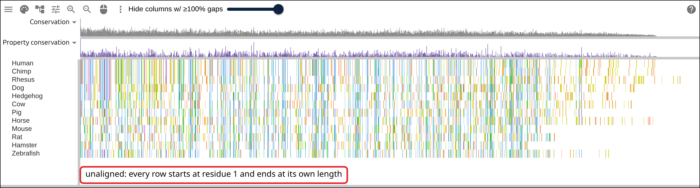
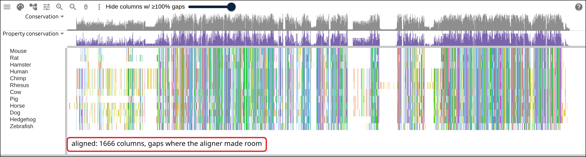
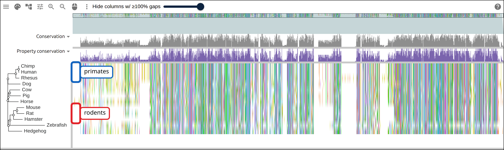
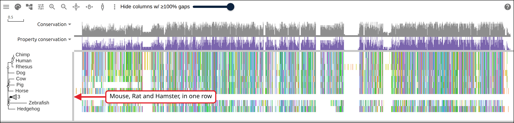
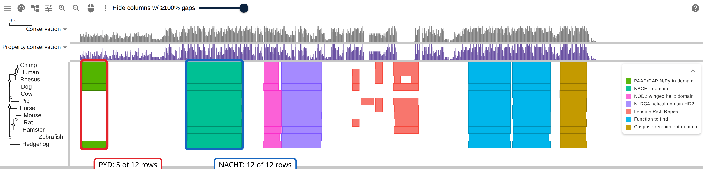
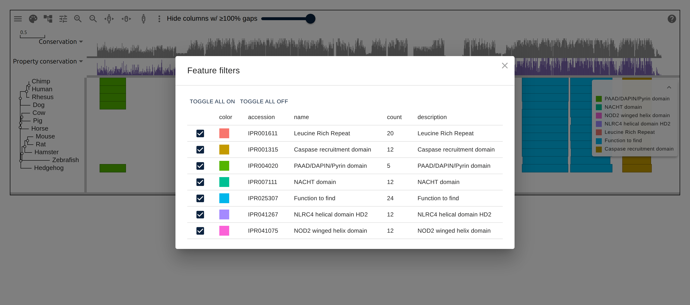
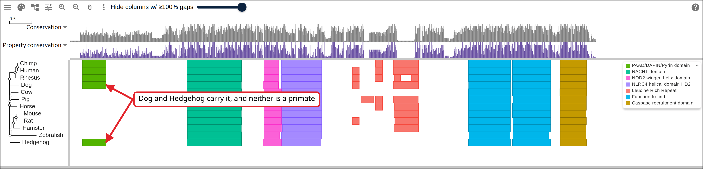
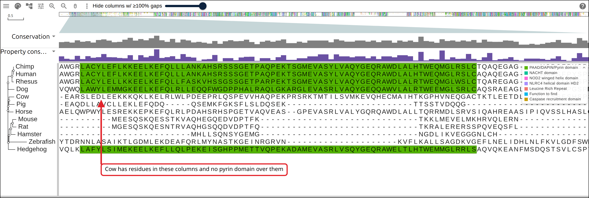
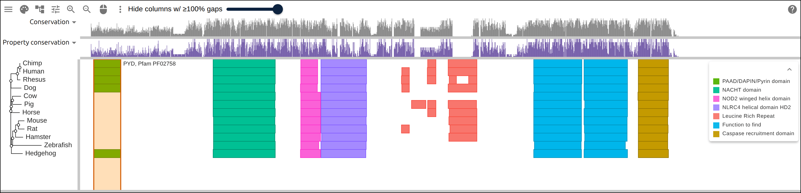

# A protein family from a list of accessions

A single protein sequence cannot tell you what is missing from it. Nothing in
the mouse version of an immune sensor says that the human version starts with
eighty residues the mouse one never had. Put the two beside their relatives,
stack the shared parts in the same columns, and the missing piece becomes a
blank space you can point at. This page starts from twelve UniProt accessions
for _NLRP1_ and ends on a link that opens the twelve sequences aligned, with the
tree inferred from them and their Pfam domains drawn in the alignment's
coordinates. Four commands produce the three files, and all four run outside the
viewer.

## Prerequisites

- `curl`
- ClustalW, `apt install clustalw` on Debian or Ubuntu, `brew install clustal-w`
  on macOS. It aligns and it infers a tree, so it is the only aligner this page
  needs.
- [react-msaview-cli](https://gmod.org/JBrowseMSA/cli),
  `npm install -g react-msaview-cli`, NodeJS v22+
- nothing to read along: every figure below links to the live view it captured

## Where the data comes from

Twelve NLRP1 orthologs as UniProtKB holds them, with Pfam matches from InterPro
release 110.0.

- one protein sequence per accession:
  https://rest.uniprot.org/uniprotkb/Q9C000.fasta
- precomputed Pfam matches for that accession:
  https://www.ebi.ac.uk/interpro/api/entry/pfam/protein/uniprot/Q9C000/
- the alignment the commands below write, hosted so the figures can link to it:
  https://gmod.org/JBrowseMSA/demo/data/nlrp1.aln
- its tree: https://gmod.org/JBrowseMSA/demo/data/nlrp1.nh
- its domains: https://gmod.org/JBrowseMSA/demo/data/nlrp1-domains.gff

Nothing here is downloaded in bulk. Both endpoints serve one protein per
request, and the whole family is twelve of each.

## The family

_NLRP1_ is an inflammasome sensor. Every vertebrate ortholog shares the same
core in the same order: a NACHT nucleotide-binding domain, a winged helix, a
helical domain, then FIIND and CARD at the C terminus. What varies is the N
terminus, where primates carry a pyrin (PYD) death-fold domain and rodents do
not.

The proteins run from 1143 to 1537 residues, so residue 328 is a different place
in every row. Drawing the domains in each protein's own coordinates puts the
shared core in twelve different places; drawing them in the alignment's
coordinates puts it in one.

## 1. Name the rows

One accession per line, and the label you want down the side of the viewer. The
label travels all the way through: it becomes the FASTA defline, the tree tip,
and the first column of the domain GFF.

```
Q9C000	Human
H2QC06	Chimp
A0A1D5QWR0	Rhesus
A0A8I3MJ75	Dog
A0ABM3YGI7	Hedgehog
E1BNN6	Cow
K9IW94	Pig
A0A9L0RFW2	Horse
Q2LKU9	Mouse
D9I2G4	Rat
A0ABM2XMM7	Hamster
A0A386CAB9	Zebrafish
```

Save that as `accessions.tsv`. The separator is a tab, and a line starting with
`#` is a comment, so the file can carry its own notes about why each row is in
it.

## 2. Fetch the sequences

```bash
# read each accession, write one FASTA record named by the label rather than
# the accession -- the label is what the viewer draws
while IFS=$'\t' read -r accession label; do
  printf '>%s\n' "$label" >> family.fasta
  curl -sf "https://rest.uniprot.org/uniprotkb/$accession.fasta" |
    tail -n +2 | tr -d '\n' >> family.fasta
  printf '\n' >> family.fasta
done < accessions.tsv
```

`tail -n +2` drops UniProt's own defline, which carries the accession, the
species and the protein name; `tr -d '\n'` unwraps the sequence onto one line.
Check what you got before aligning it:

```bash
awk '/^>/{name=$0; next}{print name, length($0)}' family.fasta
```

```
>Human 1473
>Chimp 1471
>Rhesus 1537
>Dog 1432
>Hedgehog 1360
>Cow 1410
>Pig 1294
>Horse 1465
>Mouse 1182
>Rat 1218
>Hamster 1143
>Zebrafish 1355
```

Twelve records, all plausible lengths for a full-length _NLRP1_. A truncated
fragment or a stray isoform shows up here as a length that does not belong, and
it is much cheaper to catch now than to explain later as a gap in a figure.

The viewer opens unaligned sequences as readily as an alignment, once every row
is the same length. Right-pad the shorter ones and `family.fasta` loads as a
block of twelve rows.

[](https://gmod.org/JBrowseMSA/demo/?data=%7B%22msaview%22%3A%7B%22type%22%3A%22MsaView%22%2C%22height%22%3A360%2C%22treeAreaWidth%22%3A150%2C%22colWidth%22%3A0.76%2C%22colorSchemeName%22%3A%22clustalx_protein_dynamic%22%2C%22msaFilehandle%22%3A%7B%22uri%22%3A%22data%2Fnlrp1-unaligned.aln%22%7D%7D%7D)

The twelve sequences before alignment, one row each, colored by residue. Every
row starts at residue 1 and stops at its own length, which is the ragged right
edge. The conservation track above them is near flat.

## 3. Align them

```bash
clustalw -INFILE=family.fasta -ALIGN -TYPE=PROTEIN \
  -OUTPUT=FASTA -OUTFILE=family.afa
```

Under two seconds, and it reports `Alignment Score 258590` and 1666 columns, 129
more than the longest input, which is the room the aligner made for insertions.

ClustalW is progressive: fast, deterministic, no configuration, and good enough
that the domain architecture below lands in the right columns. For a figure
whose argument is the phylogeny rather than the domains, graduate to MAFFT or
MUSCLE for the alignment and IQ-TREE or RAxML for the tree.

[](https://gmod.org/JBrowseMSA/demo/?data=%7B%22msaview%22%3A%7B%22type%22%3A%22MsaView%22%2C%22height%22%3A360%2C%22treeAreaWidth%22%3A150%2C%22colWidth%22%3A0.7%2C%22colorSchemeName%22%3A%22clustalx_protein_dynamic%22%2C%22msaFilehandle%22%3A%7B%22uri%22%3A%22data%2Fnlrp1.aln%22%7D%7D%7D)

The same twelve after ClustalW, at 1666 columns. Vertical bands of color run
through every row where the aligner found the same residues, and the pale
stretches are gaps it inserted to keep them there. The conservation track has
structure now.

## 4. Infer a tree

```bash
# -TREE reads an existing alignment and writes neighbor-joining Newick
clustalw -INFILE=family.afa -TREE -TYPE=PROTEIN -OUTPUTTREE=phylip

# ClustalW wraps the Newick across many lines; the viewer wants one string
tr -d '[:space:]' < family.ph > family.nwk
```

Read the result before trusting it:

```
(((((Mouse:0.11672,Rat:0.11797):0.05644,Hamster:0.14779):0.05664,
Zebrafish:0.56540):0.02478,Hedgehog:0.22128):0.01141,...
```

Zebrafish sits inside the rodents. It should be the outgroup, and its branch
length is 0.56540 against 0.11 to 0.22 for everything else, the longest branch
in the tree by a factor of three. Neighbor joining pulls the longest branch
towards whichever other branch is longest, which is long-branch attraction, so
the tree on this page is scaffolding for reading the alignment rather than a
result.

Open the tree beside the alignment and the rows leave file order for tree order.

[](https://gmod.org/JBrowseMSA/demo/?data=%7B%22msaview%22%3A%7B%22type%22%3A%22MsaView%22%2C%22height%22%3A400%2C%22treeAreaWidth%22%3A190%2C%22colWidth%22%3A0.7%2C%22colorSchemeName%22%3A%22clustalx_protein_dynamic%22%2C%22msaFilehandle%22%3A%7B%22uri%22%3A%22data%2Fnlrp1.aln%22%7D%2C%22treeFilehandle%22%3A%7B%22uri%22%3A%22data%2Fnlrp1.nh%22%7D%7D%7D)

The alignment with the ClustalW tree drawn beside it. The three primates are
adjacent rows and so are the three rodents, and Zebrafish is drawn next to the
rodents on the long branch that put it there.

Clicking a node in the tree collapses the clade under it into one triangle,
labelled with how many tips it holds. The rows it held leave the alignment with
it.

[](https://gmod.org/JBrowseMSA/demo/?data=%7B%22msaview%22%3A%7B%22type%22%3A%22MsaView%22%2C%22height%22%3A320%2C%22treeAreaWidth%22%3A190%2C%22colWidth%22%3A0.7%2C%22collapsed%22%3A%5B%22node-0-0-1-0-2-0-3%22%5D%2C%22colorSchemeName%22%3A%22clustalx_protein_dynamic%22%2C%22msaFilehandle%22%3A%7B%22uri%22%3A%22data%2Fnlrp1.aln%22%7D%2C%22treeFilehandle%22%3A%7B%22uri%22%3A%22data%2Fnlrp1.nh%22%7D%7D%7D)

Mouse, Rat and Hamster collapsed into the triangle marked 3. Eleven rows are
drawn where there were twelve, and the columns of the rows that remain do not
move.

## 5. Ask InterPro what the domains are

Every UniProtKB sequence already has its InterPro matches computed, so for
accessions there is nothing to scan:

```bash
react-msaview-cli interpro accessions.tsv -o family-domains.gff
```

```
InterPro release 110.0; reading precomputed pfam matches...
  [1/12] Q9C000: 9 pfam entries
  ...
12 fetched, 0 from /home/you/.cache/react-msaview-cli/interpro
```

Four seconds for twelve proteins, and the release number goes into the GFF
header, so the coordinates in the figures are pinned to one InterPro version.
Re-running answers from the disk cache and makes a single request.

The other command, `react-msaview-cli interproscan`, submits sequences to the
EBI job queue and waits about fifteen minutes. That is the right tool when the
rows are a de novo assembly or predicted proteins that InterPro has never seen,
and the wrong one whenever your rows are accessions.

Count what came back before drawing it:

```bash
grep IPR004020 family-domains.gff | cut -f1
```

```
Human
Chimp
Rhesus
Dog
Hedgehog
```

Five rows out of twelve carry the PYD, at residues 9-83 in each.

## 6. Open the three files

`family.afa`, `family.nwk` and `family-domains.gff` go in the alignment, tree
and annotation slots of the [import form](https://gmod.org/JBrowseMSA/demo/),
either as local files or as URLs. Each slot has a FILE and a URL toggle, and the
GFF slot is the one marked optional.

[](https://gmod.org/JBrowseMSA/demo/?data=%7B%22msaview%22%3A%7B%22type%22%3A%22MsaView%22%2C%22height%22%3A370%2C%22treeAreaWidth%22%3A150%2C%22colWidth%22%3A0.7%2C%22colorSchemeName%22%3A%22clustalx_protein_dynamic%22%2C%22msaFilehandle%22%3A%7B%22uri%22%3A%22data%2Fnlrp1.aln%22%7D%2C%22treeFilehandle%22%3A%7B%22uri%22%3A%22data%2Fnlrp1.nh%22%7D%2C%22gffFilehandle%22%3A%7B%22uri%22%3A%22data%2Fnlrp1-domains.gff%22%7D%7D%7D)

All three files in one view. The domain boxes replace the residue colors: NACHT
first, the winged helix and the helical domain next to it, the leucine-rich
repeats scattered through the middle, then the two FIIND blocks and the CARD at
the right. Each of those spans one band of columns across all twelve rows. The
PYD at the far left is drawn on five rows, and the other seven are blank there.

The legend in the top right names every accession in the file, and **File →
Annotations → Filter annotations** opens the same list with a checkbox and a
count per accession.

[](https://gmod.org/JBrowseMSA/demo/?data=%7B%22msaview%22%3A%7B%22type%22%3A%22MsaView%22%2C%22height%22%3A370%2C%22treeAreaWidth%22%3A150%2C%22colWidth%22%3A0.7%2C%22colorSchemeName%22%3A%22clustalx_protein_dynamic%22%2C%22msaFilehandle%22%3A%7B%22uri%22%3A%22data%2Fnlrp1.aln%22%7D%2C%22treeFilehandle%22%3A%7B%22uri%22%3A%22data%2Fnlrp1.nh%22%7D%2C%22gffFilehandle%22%3A%7B%22uri%22%3A%22data%2Fnlrp1-domains.gff%22%7D%7D%7D)

The filter dialog over the view it filters, one row per InterPro accession, in
the color the overlay draws it. IPR004020, the pyrin domain, has a count of 5
where NACHT, the winged helix, the helical domain and the CARD each have 12.
IPR025307 counts 24 because it matches twice in every row, once as FIIND and
once as the UPA-FIIND block beside it.

## The rows that kept the domain

Unchecking everything except IPR004020 leaves the question the page started with
on screen by itself.

[](https://gmod.org/JBrowseMSA/demo/?data=%7B%22msaview%22%3A%7B%22type%22%3A%22MsaView%22%2C%22height%22%3A370%2C%22treeAreaWidth%22%3A150%2C%22colWidth%22%3A0.7%2C%22colorSchemeName%22%3A%22clustalx_protein_dynamic%22%2C%22featureFilters%22%3A%7B%22IPR001315%22%3Afalse%2C%22IPR001611%22%3Afalse%2C%22IPR007111%22%3Afalse%2C%22IPR025307%22%3Afalse%2C%22IPR041075%22%3Afalse%2C%22IPR041267%22%3Afalse%7D%2C%22msaFilehandle%22%3A%7B%22uri%22%3A%22data%2Fnlrp1.aln%22%7D%2C%22treeFilehandle%22%3A%7B%22uri%22%3A%22data%2Fnlrp1.nh%22%7D%2C%22gffFilehandle%22%3A%7B%22uri%22%3A%22data%2Fnlrp1-domains.gff%22%7D%7D%7D)

The overlay reduced to the pyrin domain. The three primates carry it as one
block of rows, Dog carries it in the row right under them, and Hedgehog carries
it in the last row of the frame. Cow, Pig and Horse sit between those two
without it.

## What the columns did

The NACHT domain is annotated in all twelve rows, and InterPro reports it at a
different residue in each:

```bash
grep IPR007111 family-domains.gff | cut -f1,4,5
```

```
Human	328	497
Chimp	328	497
Rhesus	332	501
Dog	299	467
Hedgehog	296	465
Cow	294	463
Pig	162	330
Horse	328	493
Mouse	134	301
Rat	176	344
Hamster	93	258
Zebrafish	258	428
```

Human 328 and Hamster 93 are 235 residues apart. In the viewer, Human, Chimp,
Rhesus, Dog, Hedgehog, Cow, Pig and Horse all begin that domain in column 371,
and Mouse, Rat, Hamster and Zebrafish begin it in column 372, because the
overlay projects each row's residue coordinates through that row's own gaps
before drawing. The same projection is what makes the PYD read as a gap: the
five rows that carry it draw it in one place, and the seven that do not leave
that place empty.

## The row that is empty for another reason

Cow, Hedgehog and Zebrafish have no leucine-rich repeats called at all, where
Human has three and Rhesus four:

```bash
grep IPR001611 family-domains.gff | cut -f1 | sort | uniq -c
```

```
      2 Chimp
      2 Dog
      1 Hamster
      2 Horse
      3 Human
      1 Mouse
      3 Pig
      2 Rat
      4 Rhesus
```

A region that draws blank can mean the protein has none, or that nobody
annotated the ones it has. Several of these rows are unreviewed entries whose
gene models under-call. At whole-protein scale the two look identical, so zoom
to base resolution, where a row that has residues under an unannotated stretch
separates from a row that is gap there.

[](https://gmod.org/JBrowseMSA/demo/?data=%7B%22msaview%22%3A%7B%22type%22%3A%22MsaView%22%2C%22height%22%3A520%2C%22treeAreaWidth%22%3A150%2C%22colWidth%22%3A14%2C%22rowHeight%22%3A20%2C%22scrollX%22%3A-476%2C%22colorSchemeName%22%3A%22clustalx_protein_dynamic%22%2C%22msaFilehandle%22%3A%7B%22uri%22%3A%22data%2Fnlrp1.aln%22%7D%2C%22treeFilehandle%22%3A%7B%22uri%22%3A%22data%2Fnlrp1.nh%22%7D%2C%22gffFilehandle%22%3A%7B%22uri%22%3A%22data%2Fnlrp1-domains.gff%22%7D%7D%7D)

The left edge of the PYD block at one letter per column. The five rows with the
domain are green. Cow fills all 75 of those columns with residues and carries no
pyrin domain over them; Horse fills 73 of them. Mouse, Rat and Hamster are
mostly dashes there, and Hamster has 24 residues in the 75 columns.

## Share the view

A file you opened from your own computer travels inside the page URL, and an
alignment this size does not fit, so the header says **Not in the link**. Put
the three files somewhere that serves them over HTTPS with CORS, a GitHub repo
through `raw.githubusercontent.com` works, and name the URLs instead:

```json
{
  "msaview": {
    "type": "MsaView",
    "colWidth": 0.7,
    "colorSchemeName": "clustalx_protein_dynamic",
    "msaFilehandle": { "uri": "https://example.org/family.afa" },
    "treeFilehandle": { "uri": "https://example.org/family.nwk" },
    "gffFilehandle": { "uri": "https://example.org/family-domains.gff" },
    "highlights": [{ "start": 39, "end": 113, "label": "PYD, Pfam PF02758" }]
  }
}
```

URL-encode that and hang it off the app as `?data=`, and the link carries the
addresses rather than the files, at any size. `highlights` is optional and takes
1-based inclusive columns, which is how the answer you just read off the screen
travels with the link.

[](https://gmod.org/JBrowseMSA/demo/?data=%7B%22msaview%22%3A%7B%22type%22%3A%22MsaView%22%2C%22height%22%3A370%2C%22treeAreaWidth%22%3A150%2C%22colWidth%22%3A0.7%2C%22colorSchemeName%22%3A%22clustalx_protein_dynamic%22%2C%22highlights%22%3A%5B%7B%22start%22%3A39%2C%22end%22%3A113%2C%22label%22%3A%22PYD%2C%20Pfam%20PF02758%22%7D%5D%2C%22msaFilehandle%22%3A%7B%22uri%22%3A%22data%2Fnlrp1.aln%22%7D%2C%22treeFilehandle%22%3A%7B%22uri%22%3A%22data%2Fnlrp1.nh%22%7D%2C%22gffFilehandle%22%3A%7B%22uri%22%3A%22data%2Fnlrp1-domains.gff%22%7D%7D%7D)

What that link opens: the three hosted files, and columns 39 to 113 banded and
labelled PYD across all twelve rows.

## Reproduce it end to end

```bash
curl -O https://raw.githubusercontent.com/GMOD/JBrowseMSA/main/docs/tutorials/scripts/build_protein_family.sh
bash build_protein_family.sh
```

With no arguments it writes the accession list above and builds all three files
beside it. Point it at your own list to do the same for another family:

```bash
bash build_protein_family.sh my-accessions.tsv out/
```

## See also

- [CLI](https://gmod.org/JBrowseMSA/cli)
- [User guide](https://gmod.org/JBrowseMSA/guide)
- [Data layers](https://gmod.org/JBrowseMSA/layers)

## References

- Bateman A, et al. UniProt: the Universal Protein Knowledgebase in 2025.
  _Nucleic Acids Research_ 53:D609-D617.
- Blum M, et al. InterPro: the protein sequence classification resource in 2025.
  _Nucleic Acids Research_ 53:D444-D456.
- Larkin MA, et al. Clustal W and Clustal X version 2.0. _Bioinformatics_
  23:2947-2948.
- Broz P, Dixit VM. Inflammasomes: mechanism of assembly, regulation and
  signalling. _Nature Reviews Immunology_ 16:407-420.
