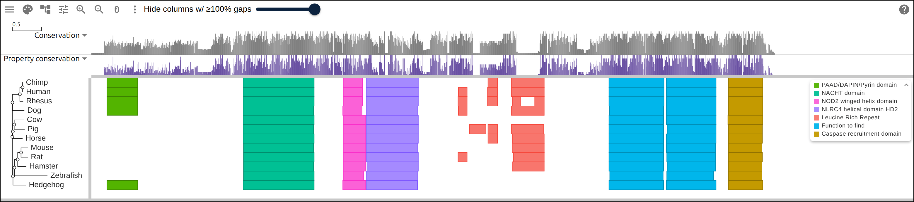

# A protein family from a list of accessions

You have a gene and a question about it that one species cannot answer: which
lineages kept a domain, and which lost it. This page starts from twelve UniProt
accessions and ends with a link that opens the alignment, its tree and its Pfam
domains in JBrowseMSA, with the missing domain visible as a gap in one column.
Four commands, none of them run inside the viewer.

## Prerequisites

- `curl`
- ClustalW — `apt install clustalw` on Debian/Ubuntu, `brew install clustal-w`
  on macOS. It aligns and infers a tree, so it is the only aligner this page
  needs.
- [react-msaview-cli](https://gmod.org/JBrowseMSA/cli) —
  `npm install -g react-msaview-cli`, NodeJS v22+

## Where the data comes from

Twelve NLRP1 orthologs, as UniProtKB holds them, with Pfam matches from InterPro
release 110.0.

- One protein sequence per accession:
  `https://rest.uniprot.org/uniprotkb/Q9C000.fasta`
- Precomputed Pfam matches for that accession:
  `https://www.ebi.ac.uk/interpro/api/entry/pfam/protein/uniprot/Q9C000/`

Nothing here is downloaded in bulk. Both endpoints serve one protein per
request, and the whole family is twelve of each.

## The family

NLRP1 is an inflammasome sensor. Every vertebrate ortholog shares the same core
in the same order — a NACHT nucleotide-binding domain, a winged helix, a helical
domain, then FIIND and CARD at the C terminus. What varies is the N terminus: a
pyrin (PYD) death-fold domain that primates carry and rodents do not.

That variation is the thing a single sequence cannot show you and an alignment
can, provided the domains are drawn in the alignment's coordinates rather than
each protein's own. The proteins here run from 1143 to 1537 residues, so residue
328 means a different thing in every row.

## 1. Name the rows

One accession per line, and the label you want down the side of the viewer. The
label travels all the way through: it becomes the FASTA defline, the tree tip,
and the first column of the domain GFF.

```
Q9C000	Human
H2QC06	Chimp
A0A1D5QWR0	Rhesus
A0A8I3MJ75	Dog
A0ABM3YGI7	Hedgehog
E1BNN6	Cow
K9IW94	Pig
A0A9L0RFW2	Horse
Q2LKU9	Mouse
D9I2G4	Rat
A0ABM2XMM7	Hamster
A0A386CAB9	Zebrafish
```

Save that as `accessions.tsv`. The separator is a tab, and a line starting with
`#` is a comment, so the file can carry its own notes about why each row is in
it.

## 2. Fetch the sequences

```bash
# read each accession, write one FASTA record named by the label rather than
# the accession -- the label is what the viewer draws
while IFS=$'\t' read -r accession label; do
  printf '>%s\n' "$label" >> family.fasta
  curl -sf "https://rest.uniprot.org/uniprotkb/$accession.fasta" |
    tail -n +2 | tr -d '\n' >> family.fasta
  printf '\n' >> family.fasta
done < accessions.tsv
```

`tail -n +2` drops UniProt's own defline, which carries the accession, the
species and the protein name; `tr -d '\n'` unwraps the sequence onto one line.
Check what you got before aligning it:

```bash
awk '/^>/{name=$0; next}{print name, length($0)}' family.fasta
```

```
>Human 1473
>Chimp 1471
>Rhesus 1537
>Dog 1432
>Hedgehog 1360
>Cow 1410
>Pig 1294
>Horse 1465
>Mouse 1182
>Rat 1218
>Hamster 1143
>Zebrafish 1355
```

Twelve records, all plausible lengths for a full-length NLRP1. A truncated
fragment or a stray isoform shows up here as a length that does not belong, and
it is much cheaper to catch now than to explain later as a gap in the figure.

## 3. Align them

```bash
clustalw -INFILE=family.fasta -ALIGN -TYPE=PROTEIN \
  -OUTPUT=FASTA -OUTFILE=family.afa
```

Under two seconds, and it reports `Alignment Score 258590` and 1666 columns —
129 more than the longest input, which is the room the aligner made for
insertions.

ClustalW is progressive: fast, deterministic, no configuration, and good enough
that the domain architecture below lands in the right columns. For a figure
whose argument is the phylogeny rather than the domains, graduate to MAFFT or
MUSCLE for the alignment and IQ-TREE or RAxML for the tree.

## 4. Infer a tree

```bash
# -TREE reads an existing alignment and writes neighbor-joining Newick
clustalw -INFILE=family.afa -TREE -TYPE=PROTEIN -OUTPUTTREE=phylip

# ClustalW wraps the Newick across many lines; the viewer wants one string
tr -d '[:space:]' < family.ph > family.nwk
```

Read the result before trusting it:

```
(((((Mouse:0.11672,Rat:0.11797):0.05644,Hamster:0.14779):0.05664,
Zebrafish:0.56540):0.02478,Hedgehog:0.22128):0.01141,...
```

Zebrafish sits inside the rodents. It should be the outgroup, and its branch
length is 0.56540 against 0.11 to 0.22 for everything else — the longest branch
in the tree by a factor of three. A neighbor-joining tree pulls the longest
branch towards whichever other branch is longest, which is long-branch
attraction, and it is why the tree on this page is scaffolding for reading the
alignment rather than a result.

## 5. Ask InterPro what the domains are

Every UniProtKB sequence already has its InterPro matches computed, so for
accessions there is nothing to scan:

```bash
react-msaview-cli interpro accessions.tsv -o family-domains.gff
```

```
InterPro release 110.0; reading precomputed pfam matches...
  [1/12] Q9C000: 9 pfam entries
  ...
12 fetched, 0 from /home/you/.cache/react-msaview-cli/interpro
```

About twenty seconds for twelve proteins, and the release number goes into the
GFF header, so the coordinates in the figure are pinned to one InterPro version.
Re-running answers from the disk cache and makes a single request.

The other command, `react-msaview-cli interproscan`, submits sequences to the
EBI job queue and waits about fifteen minutes. That is the right tool when the
rows are a de novo assembly or predicted proteins that InterPro has never seen,
and the wrong one whenever your rows are accessions.

Count what came back before drawing it:

```bash
grep IPR004020 family-domains.gff | cut -f1
```

```
Human
Chimp
Rhesus
Dog
Hedgehog
```

Five rows out of twelve carry the PYD, at residues 9-83 in each. That is the
answer to the question this page started with, and everything below is about
seeing it in place.

## 6. Open it

Three files now: `family.afa`, `family.nwk`, `family-domains.gff`. Drag them
into the alignment, tree and annotation slots of the
[import form](https://gmod.org/JBrowseMSA/demo/) and the view comes up.

That view is not shareable, though. A file opened from your own computer is
carried inside the page URL, and an alignment this size does not fit, so the
header will say **Not in the link**. To get a link, put the three files
somewhere that serves them over HTTPS with CORS — a GitHub repo works, through
`raw.githubusercontent.com` — and name the URLs instead:

```json
{
  "msaview": {
    "type": "MsaView",
    "colWidth": 2,
    "rowHeight": 22,
    "colorSchemeName": "clustalx_protein_dynamic",
    "msaFilehandle": { "uri": "https://example.org/family.afa" },
    "treeFilehandle": { "uri": "https://example.org/family.nwk" },
    "gffFilehandle": { "uri": "https://example.org/family-domains.gff" }
  }
}
```

URL-encode that and hang it off the app as `?data=`, and the link carries the
addresses rather than the files, at any size.
[Here is that link against a hosted copy of this family](https://gmod.org/JBrowseMSA/demo/?data=%7B%22msaview%22%3A%7B%22type%22%3A%22MsaView%22%2C%22height%22%3A520%2C%22treeAreaWidth%22%3A150%2C%22colWidth%22%3A2%2C%22rowHeight%22%3A22%2C%22colorSchemeName%22%3A%22clustalx_protein_dynamic%22%2C%22msaFilehandle%22%3A%7B%22uri%22%3A%22data%2Fnlrp1.aln%22%7D%2C%22treeFilehandle%22%3A%7B%22uri%22%3A%22data%2Fnlrp1.nh%22%7D%2C%22gffFilehandle%22%3A%7B%22uri%22%3A%22data%2Fnlrp1-domains.gff%22%7D%7D%7D).

[](https://gmod.org/JBrowseMSA/demo/?data=%7B%22msaview%22%3A%7B%22type%22%3A%22MsaView%22%2C%22height%22%3A520%2C%22treeAreaWidth%22%3A150%2C%22colWidth%22%3A2%2C%22rowHeight%22%3A22%2C%22colorSchemeName%22%3A%22clustalx_protein_dynamic%22%2C%22msaFilehandle%22%3A%7B%22uri%22%3A%22data%2Fnlrp1.aln%22%7D%2C%22treeFilehandle%22%3A%7B%22uri%22%3A%22data%2Fnlrp1.nh%22%7D%2C%22gffFilehandle%22%3A%7B%22uri%22%3A%22data%2Fnlrp1-domains.gff%22%7D%7D%7D)

The twelve orthologs with their tree and their Pfam domains. The PYD boxes at
the left end appear on five rows and nowhere else.

## What the columns did

The NACHT domain is annotated in all twelve rows, and InterPro reports it at a
different residue in each:

```bash
grep IPR007111 family-domains.gff | cut -f1,4,5
```

```
Human	328	497
Hamster	93	258
Mouse	134	301
Zebrafish	258	428
```

Human 328 and hamster 93 are 235 residues apart. In the viewer both are drawn in
alignment column 371, and mouse and zebrafish in column 372 — the same band,
because the overlay projects each row's residue coordinates through that row's
gaps before drawing. That projection is the reason the PYD gap reads as a gap:
the five rows that carry the domain draw it in one place, and the seven that do
not leave that place empty.

## The row that is empty for another reason

Cow, hedgehog and zebrafish have no leucine-rich repeats called at all, while
human has three and rhesus four:

```bash
grep IPR001611 family-domains.gff | cut -f1 | sort | uniq -c
```

An LRR region that draws blank can mean the protein has none, or that nobody
annotated the ones it has — several of these rows are unreviewed entries whose
gene models under-call. Zoomed out to whole-protein scale the two look
identical. Zoom to base resolution and they separate: a row with residues under
an unannotated stretch is not a row that is gap there.

The PYD survives that test. In the rows without it the alignment is mostly gap
under the human PYD, not residues without a call.

## Reproduce it end to end

```bash
curl -O https://raw.githubusercontent.com/GMOD/JBrowseMSA/main/docs/tutorials/scripts/build_protein_family.sh
bash build_protein_family.sh
```

With no arguments it writes the accession list above and builds all three files
beside it. Point it at your own list to do the same for another family:

```bash
bash build_protein_family.sh my-accessions.tsv out/
```

## See also

- [CLI](https://gmod.org/JBrowseMSA/cli)
- [User guide](https://gmod.org/JBrowseMSA/guide)
- [Data layers](https://gmod.org/JBrowseMSA/layers)

## References

- Bateman A, et al. UniProt: the Universal Protein Knowledgebase in 2025.
  _Nucleic Acids Research_ 53:D609-D617.
- Blum M, et al. InterPro: the protein sequence classification resource in 2025.
  _Nucleic Acids Research_ 53:D444-D456.
- Larkin MA, et al. Clustal W and Clustal X version 2.0. _Bioinformatics_
  23:2947-2948.
