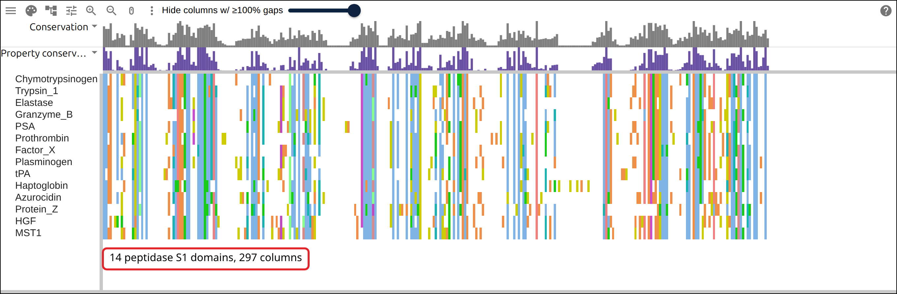
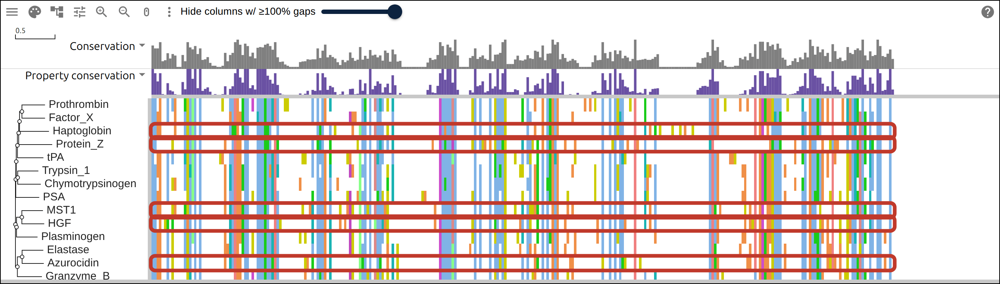
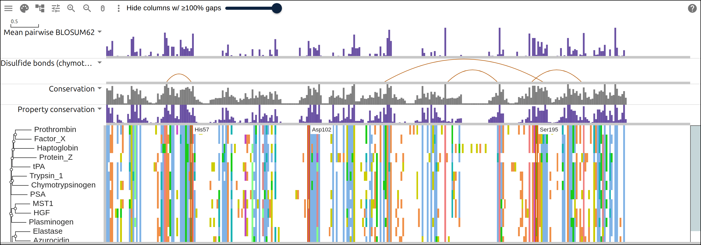
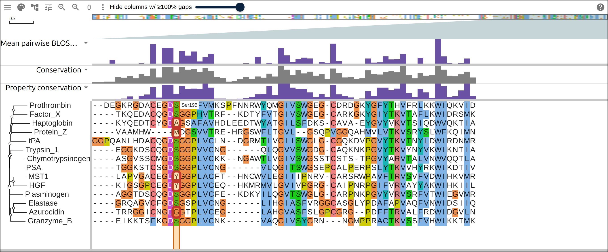

# A protease family in R

Chymotrypsin cuts a peptide bond with three residues that sit far apart in the
chain and side by side in the folded protein: His57, Asp102 and Ser195. Several
human proteins carry the same domain with one of those three replaced, and cut
nothing. This page starts from fourteen UniProtKB accessions, cuts each chain to
its peptidase S1 domain, aligns the domains, builds a tree, computes two layers
from the alignment, and draws the result with `msaviewr`, the R htmlwidget.
Every command runs in R, and the last one prints a URL that opens the same view
in a browser.

## Prerequisites

- R 4.3 or newer
- msaviewr:
  `remotes::install_github("GMOD/JBrowseMSA", subdir = "packages/r-msaview")`
- Bioconductor: `BiocManager::install(c("Biostrings", "DECIPHER"))`
- CRAN: `install.packages(c("ape", "jsonlite", "htmlwidgets"))`

Every figure below links to the live view it captured.

## Where the data comes from

UniProtKB, twice: once for the feature table that says where each domain starts
and which residues carry the charge-relay system, once for the sequences.

- the feature table for all fourteen accessions in one request:
  https://rest.uniprot.org/uniprotkb/accessions?accessions=P00766,P07477&fields=accession,ft_domain,ft_act_site,ft_disulfid&format=tsv
- the sequences, from the same endpoint:
  https://rest.uniprot.org/uniprotkb/accessions?accessions=P00766,P07477&format=fasta
- the alignment the commands below write, hosted so the figures can link to it:
  https://gmod.org/JBrowseMSA/demo/data/proteases/proteases.aln
- its tree: https://gmod.org/JBrowseMSA/demo/data/proteases/proteases.nh
- the layers R computed:
  https://gmod.org/JBrowseMSA/demo/data/proteases/proteases-layers.json

## 1. The proteins

Nine of these fourteen are active peptidases, and five carry the domain with the
charge-relay system broken. UniProt records which is which, so the page can
check its own answer at the end.

```r
proteins <- data.frame(
  accession = c(
    "P00766", "P07477", "P08246", "P10144", "P07288",
    "P00734", "P00742", "P00747", "P00750",
    "P00738", "P20160", "P22891", "P14210", "P26927"
  ),
  label = c(
    "Chymotrypsinogen", "Trypsin_1", "Elastase", "Granzyme_B", "PSA",
    "Prothrombin", "Factor_X", "Plasminogen", "tPA",
    "Haptoglobin", "Azurocidin", "Protein_Z", "HGF", "MST1"
  )
)
```

The label becomes the FASTA header, the tree tip and the row the viewer draws
down the side. Underscores keep the names through Newick, which reads a space as
the end of a name.

The last five are the interesting ones. Haptoglobin binds free hemoglobin,
azurocidin kills bacteria by binding their membranes, protein Z carries factor
Xa to the phospholipid surface, and HGF and MST1 are growth factors. All five
fold like chymotrypsin.

## 2. One request for the feature table

UniProt serves any subset of its columns as TSV, so one request covers all
fourteen entries and three feature types.

```r
REST <- "https://rest.uniprot.org/uniprotkb/accessions?accessions="
ids <- paste(proteins$accession, collapse = ",")

fields <- "accession,id,protein_name,ft_domain,ft_act_site,ft_disulfid"
features <- read.delim(
  url(paste0(REST, ids, "&fields=", fields, "&format=tsv")),
  quote = "", check.names = FALSE
)
features <- features[match(proteins$accession, features$Entry), ]
```

Each feature column holds one long string, so two small parsers turn it into
numbers:

```r
# "DOMAIN 364..618; /note="Peptidase S1"" -> c(364, 618)
s1_domain <- function(text) {
  m <- regmatches(text, regexpr('DOMAIN (\\d+)\\.\\.(\\d+); /note="Peptidase S1"', text))
  as.integer(regmatches(m, gregexpr("\\d+", m))[[1]])
}
# "ACT_SITE 406; ... ACT_SITE 462; ..." -> c(406, 462, 568)
positions <- function(text, key) {
  m <- regmatches(text, gregexpr(paste0(key, " (\\d+)"), text))[[1]]
  as.integer(sub(paste0(key, " "), "", m))
}

domains <- lapply(features[["Domain [FT]"]], s1_domain)
proteins$start <- vapply(domains, `[`, integer(1), 1)
proteins$end <- vapply(domains, `[`, integer(1), 2)
proteins$act <- lapply(features[["Active site"]], positions, "ACT_SITE")
```

```
          protein   domain residues   active_site
 Chymotrypsinogen  16..243      228  57, 102, 195
        Trypsin_1  24..244      221  63, 107, 200
         Elastase  30..247      218  70, 117, 202
       Granzyme_B  21..245      225  64, 108, 203
              PSA  25..258      234  65, 120, 213
      Prothrombin 364..618      255 406, 462, 568
         Factor_X 235..467      233 276, 322, 419
      Plasminogen 581..808      228 622, 665, 760
              tPA 311..561      251 357, 406, 513
      Haptoglobin 162..404      243          none
       Azurocidin  27..244      218          none
        Protein_Z 175..400      226          none
              HGF 495..721      227          none
             MST1 484..709      226          none
```

The domain starts at residue 16 of chymotrypsinogen and at residue 581 of
plasminogen, so residue 195 means a different thing in each row. The five rows
with no active site are the five proteins named above.

## 3. Cut each chain to its domain

`subseq` takes the start and end vectors whole, one call for all fourteen.

```r
fasta <- "proteases-full.fasta"
download.file(paste0(REST, ids, "&format=fasta"), fasta, quiet = TRUE)
full <- readAAStringSet(fasta)
names(full) <- sub("^[a-z]+\\|([A-Z0-9]+)\\|.*$", "\\1", names(full))
full <- full[proteins$accession]

s1 <- subseq(full, start = proteins$start, end = proteins$end)
names(s1) <- proteins$label
```

```
full chains 245-810 aa, S1 domains 218-255 aa
```

The chains differ by a factor of three, because prothrombin and plasminogen
carry Gla and kringle domains ahead of the peptidase. The domains differ by 37
residues.

## 4. Align the domains

```r
aln <- AlignSeqs(s1, verbose = FALSE)
writeXStringSet(aln, "proteases.aln")
```

```
alignment: 14 rows x 297 columns
```

[](https://gmod.org/JBrowseMSA/demo/#data=%7B%22msaview%22%3A%7B%22type%22%3A%22MsaView%22%2C%22height%22%3A440%2C%22treeAreaWidth%22%3A150%2C%22colWidth%22%3A3.4%2C%22rowHeight%22%3A18%2C%22colorSchemeName%22%3A%22clustalx_protein_dynamic%22%2C%22msaFilehandle%22%3A%7B%22uri%22%3A%22data%2Fproteases%2Fproteases.aln%22%7D%7D%7D)

The fourteen domains after `AlignSeqs`, in the order the accession table lists
them: the nine active peptidases first, the five without a charge-relay system
last. The gaps are the loops, which differ in length between families.

## 5. A tree from the alignment

`DistanceMatrix` reads the alignment, `nj` builds the tree, and `ladderize`
sorts each node so the smaller clade comes first.

```r
tree <- ladderize(nj(as.dist(DistanceMatrix(aln, verbose = FALSE))))
write.tree(tree, "proteases.nh")
```

An `ape::phylo` goes into `msaview()` as it is, along with the `AAStringSet`:

```r
msaview(msa = aln, tree = tree, color_scheme = "clustalx_protein_dynamic")
```

[](https://gmod.org/JBrowseMSA/demo/#data=%7B%22msaview%22%3A%7B%22type%22%3A%22MsaView%22%2C%22height%22%3A380%2C%22treeAreaWidth%22%3A200%2C%22colWidth%22%3A3.4%2C%22rowHeight%22%3A18%2C%22colorSchemeName%22%3A%22clustalx_protein_dynamic%22%2C%22msaFilehandle%22%3A%7B%22uri%22%3A%22data%2Fproteases%2Fproteases.aln%22%7D%2C%22treeFilehandle%22%3A%7B%22uri%22%3A%22data%2Fproteases%2Fproteases.nh%22%7D%7D%7D)

The tree beside the alignment, with the five rows that have no charge-relay
system outlined. Haptoglobin and protein Z sit with prothrombin and factor X,
azurocidin pairs with elastase, and HGF pairs with MST1 beside plasminogen. The
five sit in four separate places.

## 6. A track from R's own numbers

The viewer computes a conservation track from the alignment, which counts how
often a column agrees. A substitution matrix answers a different question: it
scores a conserved cysteine at 9 and a conserved alanine at 4, because a
cysteine that survives everywhere is rarer than an alanine that does.

```r
data(BLOSUM62, package = "Biostrings")
m <- as.matrix(aln)
pairs <- combn(nrow(m), 2)
blosum <- apply(m, 2, function(column) {
  a <- column[pairs[1, ]]
  b <- column[pairs[2, ]]
  keep <- a %in% rownames(BLOSUM62) & b %in% rownames(BLOSUM62)
  if (!any(keep)) 0 else mean(BLOSUM62[cbind(a[keep], b[keep])])
})
```

`column_tracks` takes the vector as one bar per column, scaled by `max`:

```r
blosum_track <- list(
  id = "blosum", name = "Mean pairwise BLOSUM62", kind = "bar",
  values = pmax(blosum, 0), max = 9, color = "#6a51a3", height = 60
)
```

## 7. The disulfide bonds, as arcs

The feature table already holds them. Chymotrypsinogen has five, and four lie
inside the domain the alignment covers.

```r
disulfides <- function(text) {
  m <- regmatches(text, gregexpr("DISULFID (\\d+)\\.\\.(\\d+)", text))[[1]]
  matrix(as.integer(unlist(regmatches(m, gregexpr("\\d+", m)))), ncol = 2, byrow = TRUE)
}

ref <- which(proteins$label == "Chymotrypsinogen")
ss <- disulfides(features[["Disulfide bond"]][ref])
ss <- ss[ss[, 1] >= proteins$start[ref] & ss[, 2] <= proteins$end[ref], , drop = FALSE]
bonds <- data.frame(
  start = ss[, 1] - proteins$start[ref] + 1,
  end = ss[, 2] - proteins$start[ref] + 1
)

ss_track <- list(
  id = "ss", name = "Disulfide bonds (chymotrypsinogen)", kind = "arc",
  arcs = bonds, row = "Chymotrypsinogen", color = "#b35806", height = 50
)
```

`row = "Chymotrypsinogen"` makes each number a residue of that row, and the
viewer walks that row's gaps to find the column. The subtraction converts a
UniProt position in the chain to a position in the cut domain.

[](<https://gmod.org/JBrowseMSA/demo/#data=%7B%22msaview%22%3A%7B%22type%22%3A%22MsaView%22%2C%22height%22%3A470%2C%22treeAreaWidth%22%3A200%2C%22colWidth%22%3A3.4%2C%22rowHeight%22%3A18%2C%22colorSchemeName%22%3A%22clustalx_protein_dynamic%22%2C%22msaFilehandle%22%3A%7B%22uri%22%3A%22data%2Fproteases%2Fproteases.aln%22%7D%2C%22treeFilehandle%22%3A%7B%22uri%22%3A%22data%2Fproteases%2Fproteases.nh%22%7D%2C%22columnTracks%22%3A%5B%7B%22id%22%3A%22blosum%22%2C%22name%22%3A%22Mean%20pairwise%20BLOSUM62%22%2C%22kind%22%3A%22bar%22%2C%22values%22%3A%5B3.56%2C2.319%2C2.582%2C5.143%2C0%2C0%2C0.833%2C0.038%2C0.56%2C0.5%2C0%2C0%2C1.011%2C0%2C5.714%2C6.374%2C1.868%2C2.022%2C0.341%2C2.89%2C0%2C0%2C0.833%2C0%2C1%2C2%2C0%2C0%2C0%2C1.44%2C0%2C0.451%2C1.308%2C7.571%2C6%2C3.758%2C0.527%2C3.473%2C3.451%2C0.615%2C1.286%2C0%2C5.473%2C3.275%2C2.78%2C3.516%2C2.956%2C2.187%2C3.022%2C7.286%2C0.564%2C0%2C0%2C0%2C0%2C0%2C0%2C0%2C0%2C0%2C0%2C0%2C0%2C0%2C0%2C0%2C2.319%2C0%2C1.681%2C4.088%2C0%2C0.978%2C0.253%2C0%2C0%2C0%2C1.429%2C0%2C0%2C1.231%2C0%2C0%2C0%2C2.736%2C0%2C0.56%2C0.132%2C2.67%2C0.78%2C1.044%2C0.648%2C0.582%2C0%2C2.593%2C1.198%2C0.083%2C5.673%2C2.667%2C0%2C0%2C0%2C0%2C0%2C0%2C0%2C0%2C0%2C0%2C0%2C0%2C3.167%2C0.756%2C0%2C0%2C0.901%2C5.143%2C3.011%2C0.33%2C3.33%2C3%2C2.407%2C4%2C0.89%2C0%2C0%2C0%2C0%2C0.011%2C0.385%2C1.758%2C0%2C0.066%2C0.824%2C0%2C0%2C2.857%2C0%2C0.462%2C1.396%2C1.319%2C3.286%2C7%2C3%2C3%2C3.333%2C0%2C0.165%2C0%2C0%2C0%2C1.424%2C0%2C0%2C1.396%2C1.385%2C0.352%2C3.527%2C0%2C1.571%2C0.945%2C6%2C8.407%2C5.143%2C0%2C0.495%2C0%2C0%2C0%2C0%2C0%2C0%2C0%2C0%2C0%2C0%2C0%2C0%2C0.538%2C0%2C0%2C3%2C1.648%2C0%2C0.725%2C0%2C1.868%2C0.396%2C2.187%2C0.626%2C0.473%2C0.936%2C0.121%2C0%2C9%2C0%2C0%2C0%2C0%2C0%2C0%2C0.061%2C0.303%2C1.061%2C0%2C0%2C0%2C0%2C0%2C0%2C0%2C0%2C0%2C0%2C0%2C0%2C0%2C0%2C0%2C2%2C0.8%2C0.833%2C0.198%2C0.264%2C1.22%2C9%2C1.275%2C2.604%2C0%2C0%2C0%2C0%2C0%2C0%2C0%2C2%2C0%2C0%2C0%2C0%2C0.835%2C0.055%2C7.308%2C0.308%2C6%2C6%2C1.088%2C5%2C3.451%2C4.824%2C1.462%2C2.945%2C4.055%2C0%2C0%2C0%2C0%2C0.639%2C0.833%2C0%2C3.056%2C0.066%2C0.945%2C0%2C6%2C3.505%2C1.231%2C2.295%2C2.744%2C2.462%2C0%2C1.198%2C1%2C7.462%2C1.526%2C0%2C0%2C0%2C0%2C2.451%2C1.077%2C1.165%2C3.198%2C2.154%2C2.187%2C4%2C0.473%2C0%2C2.67%2C0%2C0.286%2C11%2C3.165%2C0.857%2C0.451%2C0.857%2C2.451%2C0%5D%2C%22max%22%3A9%2C%22color%22%3A%22%236a51a3%22%2C%22height%22%3A60%7D%2C%7B%22id%22%3A%22ss%22%2C%22name%22%3A%22Disulfide%20bonds%20(chymotrypsinogen)%22%2C%22kind%22%3A%22arc%22%2C%22arcs%22%3A%5B%7B%22start%22%3A27%2C%22end%22%3A43%7D%2C%7B%22start%22%3A121%2C%22end%22%3A186%7D%2C%7B%22start%22%3A153%2C%22end%22%3A167%7D%2C%7B%22start%22%3A176%2C%22end%22%3A205%7D%5D%2C%22row%22%3A%22Chymotrypsinogen%22%2C%22color%22%3A%22%23b35806%22%2C%22height%22%3A50%7D%5D%2C%22highlights%22%3A%5B%7B%22row%22%3A%22Chymotrypsinogen%22%2C%22start%22%3A42%2C%22end%22%3A42%2C%22label%22%3A%22His57%22%7D%2C%7B%22row%22%3A%22Chymotrypsinogen%22%2C%22start%22%3A87%2C%22end%22%3A87%2C%22label%22%3A%22Asp102%22%7D%2C%7B%22row%22%3A%22Chymotrypsinogen%22%2C%22start%22%3A180%2C%22end%22%3A180%2C%22label%22%3A%22Ser195%22%7D%5D%7D%7D>)

Both layers over the alignment. The purple bars are the mean pairwise BLOSUM62
score, and the four arcs span the columns where chymotrypsinogen's cysteines
land. The tallest bar, 11, stands on a column every row reads as tryptophan, and
two of the arc ends stand at 9, which is a column of cysteines.

## 8. The catalytic columns

UniProt numbers the charge-relay residues in the chain, and `subseq` shifted
every row when it cut the domain. The same subtraction as the bonds converts
them, and the viewer projects them onto columns:

```r
triad <- proteins$act[[ref]] - proteins$start[ref] + 1
names(triad) <- c("His57", "Asp102", "Ser195")

bands <- Map(
  function(residue, label) {
    list(row = "Chymotrypsinogen", start = residue, end = residue, label = label)
  },
  triad, names(triad)
)

widget <- msaview(
  msa = aln,
  tree = tree,
  color_scheme = "clustalx_protein_dynamic",
  column_tracks = list(blosum_track, ss_track),
  highlights = bands,
  height = 520
)
widget
```

## 9. What each row reads there

The bands mark three columns of the alignment. Reading them off the matrix takes
the same walk the viewer does, one cumulative sum over the reference row:

```r
residue_column <- cumsum(m[ref, ] != "-")
triad_column <- vapply(triad, function(r) which(residue_column == r)[1], integer(1))
data.frame(
  protein = proteins$label,
  charge_relay = ifelse(lengths(proteins$act) > 0, "annotated", "none"),
  His57 = m[, triad_column[1]],
  Asp102 = m[, triad_column[2]],
  Ser195 = m[, triad_column[3]]
)
```

```
          protein charge_relay His57 Asp102 Ser195
 Chymotrypsinogen    annotated     H      D      S
        Trypsin_1    annotated     H      D      S
         Elastase    annotated     H      D      S
       Granzyme_B    annotated     H      D      S
              PSA    annotated     H      D      S
      Prothrombin    annotated     H      D      S
         Factor_X    annotated     H      D      S
      Plasminogen    annotated     H      D      S
              tPA    annotated     H      D      S
      Haptoglobin         none     K      D      A
       Azurocidin         none     S      D      G
        Protein_Z         none     K      D      M
              HGF         none     Q      D      Y
             MST1         none     Q      Q      Y
```

All nine active peptidases read H, D and S. Each of the other five reads
something else at His57 and at Ser195, and four of them keep the aspartate.

[](https://gmod.org/JBrowseMSA/demo/#data=%7B%22msaview%22%3A%7B%22type%22%3A%22MsaView%22%2C%22height%22%3A560%2C%22treeAreaWidth%22%3A200%2C%22colWidth%22%3A13%2C%22rowHeight%22%3A20%2C%22colorSchemeName%22%3A%22clustalx_protein_dynamic%22%2C%22msaFilehandle%22%3A%7B%22uri%22%3A%22data%2Fproteases%2Fproteases.aln%22%7D%2C%22treeFilehandle%22%3A%7B%22uri%22%3A%22data%2Fproteases%2Fproteases.nh%22%7D%2C%22scrollX%22%3A-3003%2C%22columnTracks%22%3A%5B%7B%22id%22%3A%22blosum%22%2C%22name%22%3A%22Mean%20pairwise%20BLOSUM62%22%2C%22kind%22%3A%22bar%22%2C%22values%22%3A%5B3.56%2C2.319%2C2.582%2C5.143%2C0%2C0%2C0.833%2C0.038%2C0.56%2C0.5%2C0%2C0%2C1.011%2C0%2C5.714%2C6.374%2C1.868%2C2.022%2C0.341%2C2.89%2C0%2C0%2C0.833%2C0%2C1%2C2%2C0%2C0%2C0%2C1.44%2C0%2C0.451%2C1.308%2C7.571%2C6%2C3.758%2C0.527%2C3.473%2C3.451%2C0.615%2C1.286%2C0%2C5.473%2C3.275%2C2.78%2C3.516%2C2.956%2C2.187%2C3.022%2C7.286%2C0.564%2C0%2C0%2C0%2C0%2C0%2C0%2C0%2C0%2C0%2C0%2C0%2C0%2C0%2C0%2C0%2C2.319%2C0%2C1.681%2C4.088%2C0%2C0.978%2C0.253%2C0%2C0%2C0%2C1.429%2C0%2C0%2C1.231%2C0%2C0%2C0%2C2.736%2C0%2C0.56%2C0.132%2C2.67%2C0.78%2C1.044%2C0.648%2C0.582%2C0%2C2.593%2C1.198%2C0.083%2C5.673%2C2.667%2C0%2C0%2C0%2C0%2C0%2C0%2C0%2C0%2C0%2C0%2C0%2C0%2C3.167%2C0.756%2C0%2C0%2C0.901%2C5.143%2C3.011%2C0.33%2C3.33%2C3%2C2.407%2C4%2C0.89%2C0%2C0%2C0%2C0%2C0.011%2C0.385%2C1.758%2C0%2C0.066%2C0.824%2C0%2C0%2C2.857%2C0%2C0.462%2C1.396%2C1.319%2C3.286%2C7%2C3%2C3%2C3.333%2C0%2C0.165%2C0%2C0%2C0%2C1.424%2C0%2C0%2C1.396%2C1.385%2C0.352%2C3.527%2C0%2C1.571%2C0.945%2C6%2C8.407%2C5.143%2C0%2C0.495%2C0%2C0%2C0%2C0%2C0%2C0%2C0%2C0%2C0%2C0%2C0%2C0%2C0.538%2C0%2C0%2C3%2C1.648%2C0%2C0.725%2C0%2C1.868%2C0.396%2C2.187%2C0.626%2C0.473%2C0.936%2C0.121%2C0%2C9%2C0%2C0%2C0%2C0%2C0%2C0%2C0.061%2C0.303%2C1.061%2C0%2C0%2C0%2C0%2C0%2C0%2C0%2C0%2C0%2C0%2C0%2C0%2C0%2C0%2C0%2C2%2C0.8%2C0.833%2C0.198%2C0.264%2C1.22%2C9%2C1.275%2C2.604%2C0%2C0%2C0%2C0%2C0%2C0%2C0%2C2%2C0%2C0%2C0%2C0%2C0.835%2C0.055%2C7.308%2C0.308%2C6%2C6%2C1.088%2C5%2C3.451%2C4.824%2C1.462%2C2.945%2C4.055%2C0%2C0%2C0%2C0%2C0.639%2C0.833%2C0%2C3.056%2C0.066%2C0.945%2C0%2C6%2C3.505%2C1.231%2C2.295%2C2.744%2C2.462%2C0%2C1.198%2C1%2C7.462%2C1.526%2C0%2C0%2C0%2C0%2C2.451%2C1.077%2C1.165%2C3.198%2C2.154%2C2.187%2C4%2C0.473%2C0%2C2.67%2C0%2C0.286%2C11%2C3.165%2C0.857%2C0.451%2C0.857%2C2.451%2C0%5D%2C%22max%22%3A9%2C%22color%22%3A%22%236a51a3%22%2C%22height%22%3A60%7D%5D%2C%22highlights%22%3A%5B%7B%22row%22%3A%22Chymotrypsinogen%22%2C%22start%22%3A180%2C%22end%22%3A180%2C%22label%22%3A%22Ser195%22%7D%5D%7D%7D)

The alignment at the catalytic serine, 13 pixels per column, with the five rows
boxed. Nine rows read the GDSGGP motif; haptoglobin reads A, protein Z reads M,
MST1 and HGF read Y, and azurocidin reads G.

## 10. Save the widget, or share the link

`saveWidget` writes a page that needs no R to open, and the same two layers go
into a URL that opens the hosted alignment in the web viewer:

```r
htmlwidgets::saveWidget(widget, "proteases.html", selfcontained = FALSE)

snapshot <- list(msaview = list(
  type = "MsaView",
  height = 560,
  treeAreaWidth = 150,
  colorSchemeName = "clustalx_protein_dynamic",
  msaFilehandle = list(uri = "data/proteases/proteases.aln"),
  treeFilehandle = list(uri = "data/proteases/proteases.nh"),
  columnTracks = list(blosum_track, ss_track),
  highlights = unname(bands)
))
json <- as.character(jsonlite::toJSON(snapshot, auto_unbox = TRUE, digits = 3))
paste0("https://gmod.org/JBrowseMSA/demo/#data=", URLencode(json, reserved = TRUE))
```

```
the link is 3075 characters
```

`unname()` matters: `Map` over a named vector names its result, and a named list
serializes as a JSON object where the viewer reads an array. `msaview()` drops
the names on the way in, so the widget above works either way.

## Reproduce it end to end

```bash
curl -O https://raw.githubusercontent.com/GMOD/JBrowseMSA/main/docs/tutorials/scripts/build_r_protease_triad.R
Rscript build_r_protease_triad.R out/
```

The script runs every command above and writes `out/proteases.aln`,
`out/proteases.nh`, `out/proteases-layers.json` and `out/proteases.html`. The
numbers quoted here are the ones it prints.

## See also

- [R package](https://gmod.org/JBrowseMSA/r-package), including the Shiny inputs
  a clicked cell sets
- [Data layers](https://gmod.org/JBrowseMSA/layers)
- [Influenza drift in a notebook](https://gmod.org/JBrowseMSA/tutorials/notebook_flu_drift)
- [A protein family from a list of accessions](https://gmod.org/JBrowseMSA/tutorials/protein_family)

## References

- Blow DM, Birktoft JJ, Hartley BS. Role of a buried acid group in the mechanism
  of action of chymotrypsin. _Nature_ 221:337-340 (1969).
- Rawlings ND, et al. The MEROPS database of proteolytic enzymes, their
  substrates and inhibitors in 2017. _Nucleic Acids Research_ 46:D624-D632
  (2018), which classifies the five rows above as non-peptidase homologues.
- Wright ES. DECIPHER: harnessing local sequence context to improve protein
  multiple sequence alignment. _BMC Bioinformatics_ 16:322 (2015).
- Paradis E, Schliep K. ape 5.0: an environment for modern phylogenetics and
  evolutionary analyses in R. _Bioinformatics_ 35:526-528 (2019).
- Henikoff S, Henikoff JG. Amino acid substitution matrices from protein blocks.
  _PNAS_ 89:10915-10919 (1992).
- The UniProt Consortium. UniProt: the Universal Protein Knowledgebase in 2025.
  _Nucleic Acids Research_ 53:D609-D617 (2025).
