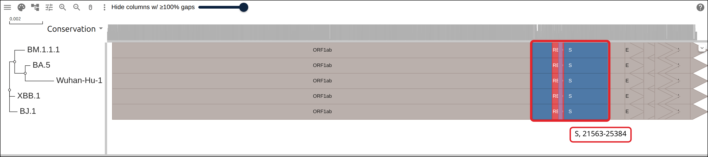
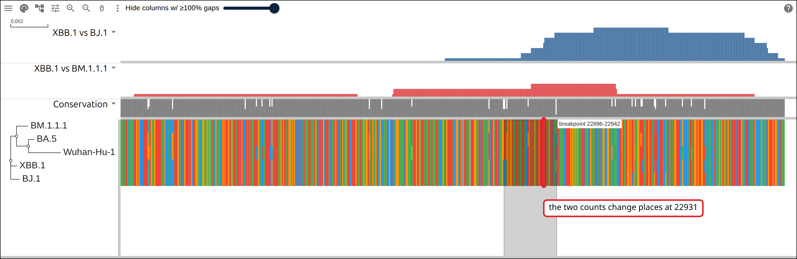
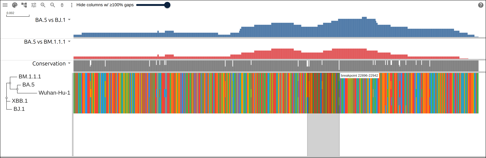
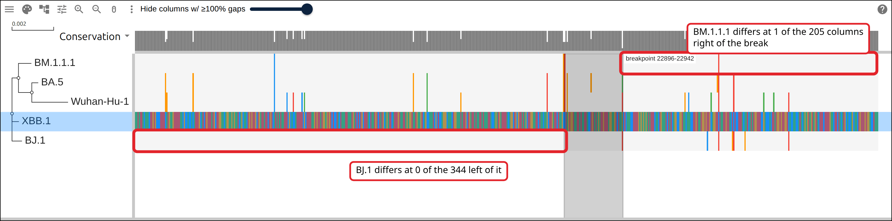
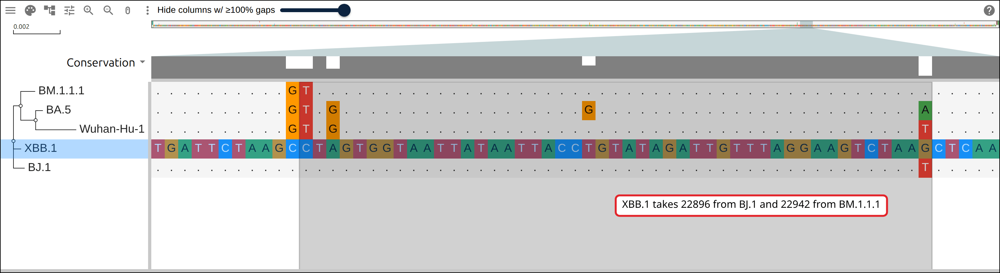

# The recombination breakpoint in XBB's spike gene

SARS-CoV-2 XBB descends from two BA.2 lineages at once. BJ.1 gave it the 5' end
of its genome and BM.1.1.1 the 3' end, and the join between the two falls inside
the spike gene. This page takes five whole genomes from GenBank, aligns them,
counts the differences between the XBB.1 row and each parent row in a sliding
window, and reads the breakpoint off the column where the lower of the two
counts changes hands. A BA.5 genome is the control: a BA.2 descendant of its own
that inherits from neither parent, run through the same scan.

## Prerequisites

- `curl`
- ClustalW, `apt install clustalw` on Debian or Ubuntu, `brew install clustal-w`
  on macOS. ClustalW both aligns and infers a tree, so this page needs no other
  aligner.
- Python 3, standard library only, nothing to install

Every figure below links to the live view it captured.

## Where the data comes from

Five SARS-CoV-2 genomes as GenBank holds them, and NCBI's own annotation of the
reference.

- all five genomes, one request:
  https://eutils.ncbi.nlm.nih.gov/entrez/eutils/efetch.fcgi?db=nuccore&id=NC_045512.2,OQ859938.1,OP911098.1,PV014247.1,PQ577962.1&rettype=fasta&retmode=text
- the reference annotation as GFF3:
  https://www.ncbi.nlm.nih.gov/sviewer/viewer.fcgi?id=NC_045512.2&report=gff3&retmode=text
- the row table the commands below start from, hosted so the figures can link to
  it: https://gmod.org/JBrowseMSA/demo/data/recombinant/recombinant-rows.tsv
- the alignment they write:
  https://gmod.org/JBrowseMSA/demo/data/recombinant/recombinant.afa
- its tree: https://gmod.org/JBrowseMSA/demo/data/recombinant/recombinant.nwk
- the genes:
  https://gmod.org/JBrowseMSA/demo/data/recombinant/recombinant-genes.gff
- the receptor-binding domain cut out of the alignment:
  https://gmod.org/JBrowseMSA/demo/data/recombinant/recombinant-rbd.afa
- the tracks the scan writes, the layers the links below carry:
  https://gmod.org/JBrowseMSA/demo/data/recombinant/recombinant-layers.json

## 1. Name the rows

Write one genome per line: the label the viewer draws, the GenBank accession,
and the Pango lineage NCBI Virus assigns it. The label becomes the FASTA
defline, the tree tip and the GFF seq_id.

```
Wuhan-Hu-1	NC_045512.2	reference
BJ.1	OQ859938.1	BA.2.10.1.1
BM.1.1.1	OP911098.1	BA.2.75.3.1.1.1
XBB.1	PV014247.1	XBB.1
BA.5	PQ577962.1	BA.5
```

Pango lineage is a field of NCBI Virus metadata, and the `datasets` CLI filters
on it:

```bash
datasets summary virus genome taxon sars-cov-2 --lineage BJ.1 \
  --complete-only --annotated --as-json-lines
```

BJ.1 is the scarce one. GenBank holds a single complete genome of it,
OQ859938.1, collected in India in September 2022, and that record is the BJ.1
row. The BM.1.1.1, XBB.1 and BA.5 rows are each the longest record their own
lineage filter returned with no ambiguous base.

## 2. Fetch the genomes

One `efetch` request takes all five accessions, and a short script relabels each
record to its row name:

```bash
ids=$(awk -F'\t' '{printf "%s%s", sep, $2; sep=","}' recombinant-rows.tsv)
curl -sf "https://eutils.ncbi.nlm.nih.gov/entrez/eutils/efetch.fcgi?db=nuccore&id=$ids&rettype=fasta&retmode=text" \
  -o genomes-ncbi.fasta
```

```
  Wuhan-Hu-1   NC_045512.2  reference        29903 bp  0 N
  BJ.1         OQ859938.1   BA.2.10.1.1      29784 bp  101 N
  BM.1.1.1     OP911098.1   BA.2.75.3.1.1.1  29847 bp  0 N
  XBB.1        PV014247.1   XBB.1            29712 bp  0 N
  BA.5         PQ577962.1   BA.5             29835 bp  0 N
```

The reference is the longest at 29,903 bases and the four Omicron genomes run
between 29,712 and 29,847. The BJ.1 record carries 101 ambiguous bases, 57 of
them in three runs inside the first 500 bases of the spike gene, and the scan
below counts only the columns where both rows carry a base.

## 3. Align them and infer a tree

```bash
clustalw -INFILE=recombinant.fasta -ALIGN -TYPE=DNA -OUTORDER=INPUT \
  -OUTPUT=FASTA -OUTFILE=recombinant.afa
clustalw -INFILE=recombinant.afa -TREE -TYPE=DNA -OUTPUTTREE=phylip
tr -d '[:space:]' < recombinant.ph > recombinant.nwk
```

Five whole genomes take about four minutes on a laptop.

```
(((Wuhan-Hu-1:0.00174,BA.5:0.00031):0.00064,BM.1.1.1:0.00062):0.00031,
BJ.1:0.00048,XBB.1:0.00033);
```

Wuhan-Hu-1 has the longest branch at 0.00174 and the rest run between 0.00031
and 0.00064, and neighbor joining draws Wuhan-Hu-1 beside BA.5. XBB.1 and BJ.1
share the base of the tree, and the tree here orders the rows in the viewer.

```
5 rows, 29903 alignment columns, 29903 of them a base of Wuhan-Hu-1
  Wuhan-Hu-1     0 gap columns before its first base,   0 after its last,   0 deleted in between
  BJ.1          25 gap columns before its first base,  94 after its last,   0 deleted in between
  BM.1.1.1       0 gap columns before its first base,   0 after its last,  56 deleted in between
  XBB.1         43 gap columns before its first base,  89 after its last,  59 deleted in between
  BA.5           0 gap columns before its first base,   0 after its last,  68 deleted in between
```

The reference row takes a column of its own for every one of its bases, so a
column number is a Wuhan-Hu-1 coordinate for the rest of this page. The other
four rows each fit inside those 29,903 columns: two of them start and stop short
of the ends, and three carry between 56 and 68 deleted bases in between.

## 4. Put the genes on every row

RefSeq annotates NC_045512.2 and no other accession here, so the gene
coordinates reach the other four rows through the alignment: a reference
position gives an alignment column, and that column gives each row its own
position.

```python
col_of_ref = [i for i, c in enumerate(seqs[REF]) if c != '-']
a = pos_of_col[row][col_of_ref[start - 1]]
b = pos_of_col[row][col_of_ref[end - 1]]
g.write(f'{row}\tRefSeq\t{kind}\t{a}\t{b}\t.\t{strand}\t.\tName={name};color={color}\n')
```

The same projection puts two subregions of spike on every row: the
receptor-binding domain, spike residues 331 to 528, and the receptor-binding
motif inside it, residues 438 to 506.

```
11 genes in the Wuhan-Hu-1 annotation, ORF1ab at 266-21555 through ORF10 at 29558-29674
13 spans per row over 5 rows
```

```
Wuhan-Hu-1	RefSeq	gene	21563	25384	.	+	.	Name=S;color=%234e79a7
BJ.1	RefSeq	gene	21538	25359	.	+	.	Name=S;color=%234e79a7
XBB.1	RefSeq	gene	21508	25317	.	+	.	Name=S;color=%234e79a7
```

Each row's spike span starts earlier than the reference's by the number of
columns upstream of it that the row leaves as a gap: 25 for BJ.1 and 55 for
XBB.1.

[](https://gmod.org/JBrowseMSA/demo/?data=%7B%22msaview%22%3A%7B%22type%22%3A%22MsaView%22%2C%22height%22%3A340%2C%22treeAreaWidth%22%3A230%2C%22colWidth%22%3A0.04347389893990569%2C%22rowHeight%22%3A34%2C%22colorSchemeName%22%3A%22nucleotide%22%2C%22msaFilehandle%22%3A%7B%22uri%22%3A%22data%2Frecombinant%2Frecombinant.afa%22%7D%2C%22treeFilehandle%22%3A%7B%22uri%22%3A%22data%2Frecombinant%2Frecombinant.nwk%22%7D%2C%22gffFilehandle%22%3A%7B%22uri%22%3A%22data%2Frecombinant%2Frecombinant-genes.gff%22%7D%2C%22encodings%22%3A%5B%7B%22channel%22%3A%22featureLabel%22%2C%22field%22%3A%22Name%22%7D%5D%2C%22showDomainLegend%22%3Afalse%7D%7D)

Five rows of 29,903 columns, each carrying the 11 genes as boxes. ORF1ab fills
the first two thirds, S is the blue box after it, and inside S sit the red
receptor-binding domain and the purple receptor-binding motif.

## 5. Count the differences to each parent

Two rows differ at a column when both carry a base and the two bases are not the
same. The scan counts those differences in a window of 200 columns centered on
every column of the alignment, once against each parent:

```python
def compare(a, b):
    x, y = seqs[a], seqs[b]
    return [None if x[i] not in BASES or y[i] not in BASES else int(x[i] != y[i])
            for i in range(ncol)]


def scan(diff):
    half = WINDOW // 2
    running = [0]
    for d in diff:
        running.append(running[-1] + (d or 0))
    return [running[min(ncol, i + half)] - running[max(0, i - half)]
            for i in range(ncol)]
```

All four Omicron rows descend from BA.2, so over the whole genome every pair
sits above 99.8% identity:

```
XBB.1     against BJ.1       24 differences over 29660 comparable columns, 99.92% identity
XBB.1     against BM.1.1.1   35 differences over 29709 comparable columns, 99.88% identity
BA.5      against BJ.1       50 differences over 29669 comparable columns, 99.83% identity
BA.5      against BM.1.1.1   46 differences over 29832 comparable columns, 99.85% identity
```

A `bar` track holds one value per alignment column and a `?data=` link holds
several hundred of them, so the two curves travel over the receptor-binding
domain cut out of the alignment. The tree file serves both files, whose rows
carry the same names.

```
the receptor-binding domain is columns 22553-23146, Wuhan-Hu-1 22553-23146, 594 columns
XBB.1: the lower of the two curves changes hands 1 time across the receptor-binding domain, at Wuhan-Hu-1 22931
XBB.1: the two counts reach 7 differences per 200 columns inside the receptor-binding domain
  XBB.1 vs BJ.1: 0 to 1 left of the break, 1 to 7 right of it
  XBB.1 vs BM.1.1.1: 0 to 2 left of the break, 0 to 3 right of it
```

[](<https://gmod.org/JBrowseMSA/demo/?data=%7B%22msaview%22%3A%7B%22type%22%3A%22MsaView%22%2C%22height%22%3A500%2C%22treeAreaWidth%22%3A230%2C%22colWidth%22%3A2.1885521885521886%2C%22rowHeight%22%3A26%2C%22colorSchemeName%22%3A%22nucleotide%22%2C%22msaFilehandle%22%3A%7B%22uri%22%3A%22data%2Frecombinant%2Frecombinant-rbd.afa%22%7D%2C%22treeFilehandle%22%3A%7B%22uri%22%3A%22data%2Frecombinant%2Frecombinant.nwk%22%7D%2C%22columnTracks%22%3A%5B%7B%22id%22%3A%22xbb1-bj1%22%2C%22name%22%3A%22XBB.1%20vs%20BJ.1%22%2C%22kind%22%3A%22bar%22%2C%22values%22%3A%5B0%2C0%2C0%2C0%2C0%2C0%2C0%2C0%2C0%2C0%2C0%2C0%2C0%2C0%2C0%2C0%2C0%2C0%2C0%2C0%2C0%2C0%2C0%2C0%2C0%2C0%2C0%2C0%2C0%2C0%2C0%2C0%2C0%2C0%2C0%2C0%2C0%2C0%2C0%2C0%2C0%2C0%2C0%2C0%2C0%2C0%2C0%2C0%2C0%2C0%2C0%2C0%2C0%2C0%2C0%2C0%2C0%2C0%2C0%2C0%2C0%2C0%2C0%2C0%2C0%2C0%2C0%2C0%2C0%2C0%2C0%2C0%2C0%2C0%2C0%2C0%2C0%2C0%2C0%2C0%2C0%2C0%2C0%2C0%2C0%2C0%2C0%2C0%2C0%2C0%2C0%2C0%2C0%2C0%2C0%2C0%2C0%2C0%2C0%2C0%2C0%2C0%2C0%2C0%2C0%2C0%2C0%2C0%2C0%2C0%2C0%2C0%2C0%2C0%2C0%2C0%2C0%2C0%2C0%2C0%2C0%2C0%2C0%2C0%2C0%2C0%2C0%2C0%2C0%2C0%2C0%2C0%2C0%2C0%2C0%2C0%2C0%2C0%2C0%2C0%2C0%2C0%2C0%2C0%2C0%2C0%2C0%2C0%2C0%2C0%2C0%2C0%2C0%2C0%2C0%2C0%2C0%2C0%2C0%2C0%2C0%2C0%2C0%2C0%2C0%2C0%2C0%2C0%2C0%2C0%2C0%2C0%2C0%2C0%2C0%2C0%2C0%2C0%2C0%2C0%2C0%2C0%2C0%2C0%2C0%2C0%2C0%2C0%2C0%2C0%2C0%2C0%2C0%2C0%2C0%2C0%2C0%2C0%2C0%2C0%2C0%2C0%2C0%2C0%2C0%2C0%2C0%2C0%2C0%2C0%2C0%2C0%2C0%2C0%2C0%2C0%2C0%2C0%2C0%2C0%2C0%2C0%2C0%2C0%2C0%2C0%2C0%2C0%2C0%2C0%2C0%2C0%2C0%2C0%2C0%2C0%2C0%2C0%2C0%2C0%2C0%2C0%2C0%2C0%2C0%2C0%2C0%2C0%2C0%2C0%2C0%2C0%2C0%2C0%2C0%2C0%2C0%2C0%2C0%2C0%2C0%2C0%2C0%2C0%2C0%2C0%2C0%2C0%2C0%2C0%2C0%2C0%2C0%2C0%2C0%2C0%2C0%2C0%2C0%2C0%2C0%2C0%2C0%2C0%2C0%2C0%2C0%2C0%2C0%2C0%2C1%2C1%2C1%2C1%2C1%2C1%2C1%2C1%2C1%2C1%2C1%2C1%2C1%2C1%2C1%2C1%2C1%2C1%2C1%2C1%2C1%2C1%2C1%2C1%2C1%2C1%2C1%2C1%2C1%2C1%2C1%2C1%2C1%2C1%2C1%2C1%2C1%2C1%2C1%2C1%2C1%2C1%2C1%2C1%2C1%2C1%2C1%2C1%2C1%2C1%2C1%2C1%2C1%2C1%2C1%2C1%2C1%2C1%2C1%2C1%2C1%2C1%2C1%2C1%2C1%2C1%2C1%2C1%2C2%2C2%2C2%2C2%2C2%2C2%2C2%2C2%2C2%2C3%2C3%2C3%2C3%2C3%2C3%2C3%2C3%2C3%2C3%2C3%2C4%2C5%2C5%2C5%2C5%2C5%2C5%2C5%2C5%2C5%2C6%2C6%2C6%2C6%2C6%2C6%2C6%2C6%2C6%2C6%2C6%2C6%2C6%2C6%2C6%2C6%2C6%2C6%2C6%2C6%2C6%2C6%2C6%2C6%2C6%2C6%2C6%2C6%2C6%2C6%2C6%2C6%2C6%2C6%2C6%2C7%2C7%2C7%2C7%2C7%2C7%2C7%2C7%2C7%2C7%2C7%2C7%2C7%2C7%2C7%2C7%2C7%2C7%2C7%2C7%2C7%2C7%2C7%2C7%2C7%2C7%2C7%2C7%2C7%2C7%2C7%2C7%2C7%2C7%2C7%2C7%2C7%2C7%2C7%2C7%2C7%2C7%2C7%2C7%2C7%2C7%2C7%2C7%2C7%2C7%2C7%2C7%2C7%2C7%2C7%2C7%2C7%2C7%2C7%2C7%2C7%2C7%2C7%2C7%2C7%2C7%2C7%2C6%2C6%2C6%2C6%2C6%2C6%2C6%2C6%2C6%2C6%2C6%2C6%2C6%2C6%2C6%2C6%2C6%2C6%2C6%2C6%2C6%2C6%2C6%2C6%2C6%2C6%2C6%2C6%2C6%2C6%2C6%2C6%2C6%2C6%2C6%2C6%2C6%2C6%2C6%2C6%2C6%2C6%2C6%2C6%2C6%2C6%2C6%2C6%2C6%2C6%2C6%2C6%2C6%2C6%2C6%2C6%2C6%2C6%2C6%2C6%2C6%2C6%2C6%2C6%2C6%2C6%2C6%2C6%2C5%2C5%2C5%2C5%2C5%2C5%2C5%2C5%2C5%2C4%2C4%2C4%2C4%2C4%2C4%2C4%2C4%2C4%2C4%2C4%2C3%2C2%2C2%2C2%2C2%2C2%2C2%2C2%2C2%2C2%2C1%2C1%2C1%2C1%2C1%2C1%5D%2C%22max%22%3A7%2C%22color%22%3A%22%234e79a7%22%2C%22height%22%3A70%7D%2C%7B%22id%22%3A%22xbb1-bm111%22%2C%22name%22%3A%22XBB.1%20vs%20BM.1.1.1%22%2C%22kind%22%3A%22bar%22%2C%22values%22%3A%5B0%2C0%2C0%2C0%2C0%2C0%2C0%2C0%2C0%2C0%2C0%2C0%2C1%2C1%2C1%2C1%2C1%2C1%2C1%2C1%2C1%2C1%2C1%2C1%2C1%2C1%2C1%2C1%2C1%2C1%2C1%2C1%2C1%2C1%2C1%2C1%2C1%2C1%2C1%2C1%2C1%2C1%2C1%2C1%2C1%2C1%2C1%2C1%2C1%2C1%2C1%2C1%2C1%2C1%2C1%2C1%2C1%2C1%2C1%2C1%2C1%2C1%2C1%2C1%2C1%2C1%2C1%2C1%2C1%2C1%2C1%2C1%2C1%2C1%2C1%2C1%2C1%2C1%2C1%2C1%2C1%2C1%2C1%2C1%2C1%2C1%2C1%2C1%2C1%2C1%2C1%2C1%2C1%2C1%2C1%2C1%2C1%2C1%2C1%2C1%2C1%2C1%2C1%2C1%2C1%2C1%2C1%2C1%2C1%2C1%2C1%2C1%2C1%2C1%2C1%2C1%2C1%2C1%2C1%2C1%2C1%2C1%2C1%2C1%2C1%2C1%2C1%2C1%2C1%2C1%2C1%2C1%2C1%2C1%2C1%2C1%2C1%2C1%2C1%2C1%2C1%2C1%2C1%2C1%2C1%2C1%2C1%2C1%2C1%2C1%2C1%2C1%2C1%2C1%2C1%2C1%2C1%2C1%2C1%2C1%2C1%2C1%2C1%2C1%2C1%2C1%2C1%2C1%2C1%2C1%2C1%2C1%2C1%2C1%2C1%2C1%2C1%2C1%2C1%2C1%2C1%2C1%2C1%2C1%2C1%2C1%2C1%2C1%2C1%2C1%2C1%2C1%2C1%2C1%2C1%2C1%2C1%2C1%2C1%2C1%2C1%2C1%2C1%2C1%2C1%2C1%2C1%2C1%2C1%2C1%2C1%2C1%2C0%2C0%2C0%2C0%2C0%2C0%2C0%2C0%2C0%2C0%2C0%2C0%2C0%2C0%2C0%2C0%2C0%2C0%2C0%2C0%2C0%2C0%2C0%2C0%2C0%2C0%2C0%2C0%2C0%2C0%2C0%2C1%2C2%2C2%2C2%2C2%2C2%2C2%2C2%2C2%2C2%2C2%2C2%2C2%2C2%2C2%2C2%2C2%2C2%2C2%2C2%2C2%2C2%2C2%2C2%2C2%2C2%2C2%2C2%2C2%2C2%2C2%2C2%2C2%2C2%2C2%2C2%2C2%2C2%2C2%2C2%2C2%2C2%2C2%2C2%2C2%2C2%2C2%2C2%2C2%2C2%2C2%2C2%2C2%2C2%2C2%2C2%2C2%2C2%2C2%2C2%2C2%2C2%2C2%2C2%2C2%2C2%2C2%2C2%2C2%2C2%2C2%2C2%2C2%2C2%2C2%2C2%2C2%2C2%2C2%2C2%2C2%2C2%2C2%2C2%2C2%2C2%2C2%2C2%2C2%2C2%2C2%2C2%2C2%2C2%2C2%2C2%2C2%2C2%2C2%2C2%2C2%2C2%2C2%2C2%2C2%2C2%2C2%2C2%2C2%2C2%2C2%2C2%2C2%2C2%2C2%2C2%2C2%2C2%2C2%2C2%2C2%2C2%2C2%2C2%2C3%2C3%2C3%2C3%2C3%2C3%2C3%2C3%2C3%2C3%2C3%2C3%2C3%2C3%2C3%2C3%2C3%2C3%2C3%2C3%2C3%2C3%2C3%2C3%2C3%2C3%2C3%2C3%2C3%2C3%2C3%2C3%2C3%2C3%2C3%2C3%2C3%2C3%2C3%2C3%2C3%2C3%2C3%2C3%2C3%2C3%2C3%2C3%2C3%2C3%2C3%2C3%2C3%2C3%2C3%2C3%2C3%2C3%2C3%2C3%2C3%2C3%2C3%2C3%2C3%2C3%2C3%2C3%2C3%2C3%2C3%2C3%2C3%2C3%2C3%2C3%2C2%2C1%2C1%2C1%2C1%2C1%2C1%2C1%2C1%2C1%2C1%2C1%2C1%2C1%2C1%2C1%2C1%2C1%2C1%2C1%2C1%2C1%2C1%2C1%2C1%2C1%2C1%2C1%2C1%2C1%2C1%2C1%2C1%2C1%2C1%2C1%2C1%2C1%2C1%2C1%2C1%2C1%2C1%2C1%2C1%2C1%2C1%2C1%2C1%2C1%2C1%2C1%2C1%2C1%2C1%2C1%2C1%2C1%2C1%2C1%2C1%2C1%2C1%2C1%2C1%2C1%2C1%2C1%2C1%2C1%2C1%2C1%2C1%2C1%2C1%2C1%2C1%2C1%2C1%2C1%2C1%2C1%2C1%2C1%2C1%2C1%2C1%2C1%2C1%2C1%2C1%2C1%2C1%2C1%2C1%2C1%2C1%2C1%2C1%2C1%2C1%2C1%2C1%2C1%2C1%2C1%2C1%2C1%2C1%2C1%2C1%2C1%2C1%2C1%2C1%2C1%2C1%2C1%2C1%2C1%2C1%2C1%2C1%2C1%2C0%2C0%2C0%2C0%2C0%2C0%2C0%2C0%2C0%2C0%2C0%2C0%2C0%2C0%2C0%2C0%2C0%2C0%2C0%2C0%2C0%2C0%2C0%2C0%2C0%2C0%2C0%5D%2C%22max%22%3A7%2C%22color%22%3A%22%23e15759%22%2C%22height%22%3A70%7D%5D%2C%22highlights%22%3A%5B%7B%22start%22%3A344%2C%22end%22%3A390%2C%22label%22%3A%22breakpoint%2022896-22942%22%2C%22color%22%3A%22rgba(0%2C0%2C0%2C0.18)%22%7D%5D%7D%7D>)

The 594 columns of the receptor-binding domain with the two counts above them,
blue for the differences to BJ.1 and red for those to BM.1.1.1. Blue holds at 0
or 1 across the columns left of the break and reaches 7 to the right of it. Red
runs between 0 and 2 on the left and between 0 and 3 on the right, so the blue
count is under the red one on one side and over it on the other. The vertical
marker at column 22,931 is where the two change places, and it lands inside the
grey band, the 22,896-22,942 interval the next section pins.

## 6. Pin the breakpoint with the informative sites

A column where the two parents carry different bases and the third row carries
one of them is a vote for that parent. A recombinant's votes fall into a 5'
block and a 3' block, so the split that puts the most votes on their own side is
the breakpoint:

```python
def best_split(sites):
    best, at = -1, 0
    for k in range(len(sites) + 1):
        score = (sum(1 for _, w in sites[:k] if w == LEFT)
                 + sum(1 for _, w in sites[k:] if w == RIGHT))
        if score > best:
            best, at = score, k
    return at, best
```

```
XBB.1: 44 informative sites, 27 voting BJ.1 and 17 voting BM.1.1.1
XBB.1: the best split has 41 of the 44 sites on the side it predicts, between Wuhan-Hu-1 22896 and 22942
XBB.1: 3 sites on the other side: 1093, 10189, 23438
the breakpoint interval is Wuhan-Hu-1 22896-22942, 47 nt, spike codons 445 to 460
```

41 of the 44 sites land on the side the split predicts, and the three that do
not sit at 1,093, 10,189 and 23,438. The 47 bases between the last BJ.1 vote and
the first BM.1.1.1 vote are spike codons 445 to 460, both inside the
receptor-binding motif. 22,895 and 22,896 are the first two bases of codon 445
and 22,942 is the third base of codon 460, so the substitutions the interval
runs between are S:V445P and S:N460K.

## 7. The control

BA.5 and the two parents are three separate BA.2 descendants, so the BA.5 row
stands to both parents the way a recombinant's row would if the recombination
had never happened. The same scan and the same split run over it.

```
BA.5: 42 informative sites, 19 voting BJ.1 and 23 voting BM.1.1.1
BA.5: the best split has 28 of the 42 sites on the side it predicts, between Wuhan-Hu-1 12444 and 15738
BA.5: 14 sites on the other side: 405, 1093, 10189, 18583, 22001, 22014, 22016, 22033, 22190, 22331, 23031, 23438, 25416, 26275
BA.5: the lower of the two curves changes hands 0 times across the receptor-binding domain
BA.5: the two counts reach 11 differences per 200 columns inside the receptor-binding domain
  BA.5 vs BJ.1: 2 to 8 left of the break, 1 to 11 right of it
  BA.5 vs BM.1.1.1: 2 to 6 left of the break, 0 to 6 right of it
```

The best split for BA.5 leaves 14 of its 42 sites on the other side, and the
interval it names runs from 12,444 to 15,738, a 3.3 kb stretch inside ORF1ab.
Six of the 14 sit between 22,001 and 22,331, inside the spike gene.

[](<https://gmod.org/JBrowseMSA/demo/?data=%7B%22msaview%22%3A%7B%22type%22%3A%22MsaView%22%2C%22height%22%3A500%2C%22treeAreaWidth%22%3A230%2C%22colWidth%22%3A2.1885521885521886%2C%22rowHeight%22%3A26%2C%22colorSchemeName%22%3A%22nucleotide%22%2C%22msaFilehandle%22%3A%7B%22uri%22%3A%22data%2Frecombinant%2Frecombinant-rbd.afa%22%7D%2C%22treeFilehandle%22%3A%7B%22uri%22%3A%22data%2Frecombinant%2Frecombinant.nwk%22%7D%2C%22columnTracks%22%3A%5B%7B%22id%22%3A%22ba5-bj1%22%2C%22name%22%3A%22BA.5%20vs%20BJ.1%22%2C%22kind%22%3A%22bar%22%2C%22values%22%3A%5B2%2C2%2C2%2C2%2C2%2C2%2C2%2C2%2C2%2C2%2C2%2C2%2C3%2C3%2C3%2C3%2C3%2C3%2C3%2C3%2C3%2C3%2C3%2C3%2C3%2C3%2C3%2C3%2C3%2C3%2C3%2C3%2C3%2C3%2C3%2C3%2C3%2C3%2C3%2C3%2C3%2C3%2C3%2C3%2C3%2C3%2C3%2C3%2C3%2C3%2C3%2C3%2C3%2C3%2C3%2C3%2C3%2C3%2C3%2C3%2C3%2C3%2C3%2C3%2C3%2C3%2C3%2C3%2C3%2C3%2C3%2C3%2C3%2C3%2C3%2C3%2C3%2C3%2C3%2C3%2C3%2C3%2C3%2C3%2C3%2C3%2C3%2C3%2C3%2C3%2C3%2C3%2C3%2C3%2C3%2C3%2C3%2C3%2C3%2C3%2C3%2C3%2C3%2C3%2C3%2C3%2C3%2C3%2C3%2C3%2C3%2C3%2C3%2C3%2C3%2C3%2C3%2C3%2C3%2C3%2C3%2C3%2C3%2C4%2C4%2C3%2C3%2C3%2C3%2C3%2C3%2C3%2C3%2C3%2C4%2C4%2C4%2C4%2C4%2C4%2C4%2C4%2C4%2C4%2C4%2C4%2C4%2C3%2C3%2C3%2C3%2C3%2C3%2C3%2C3%2C3%2C3%2C3%2C3%2C3%2C3%2C3%2C3%2C3%2C3%2C3%2C3%2C3%2C3%2C3%2C3%2C3%2C3%2C3%2C3%2C3%2C3%2C3%2C3%2C3%2C3%2C3%2C3%2C3%2C3%2C3%2C3%2C3%2C3%2C3%2C3%2C3%2C3%2C3%2C3%2C3%2C3%2C3%2C3%2C3%2C3%2C3%2C3%2C3%2C3%2C3%2C3%2C3%2C3%2C3%2C3%2C3%2C2%2C2%2C2%2C2%2C2%2C2%2C2%2C2%2C2%2C2%2C2%2C2%2C2%2C2%2C2%2C2%2C2%2C2%2C3%2C3%2C3%2C3%2C3%2C3%2C3%2C3%2C3%2C3%2C3%2C3%2C3%2C4%2C5%2C5%2C6%2C6%2C6%2C6%2C6%2C6%2C6%2C6%2C6%2C6%2C6%2C6%2C6%2C6%2C6%2C6%2C6%2C6%2C6%2C7%2C7%2C7%2C7%2C7%2C7%2C7%2C7%2C7%2C7%2C7%2C7%2C7%2C7%2C7%2C7%2C7%2C7%2C7%2C7%2C7%2C7%2C7%2C7%2C7%2C8%2C8%2C8%2C8%2C8%2C8%2C8%2C8%2C8%2C8%2C8%2C8%2C8%2C8%2C8%2C8%2C8%2C8%2C8%2C8%2C8%2C8%2C8%2C8%2C8%2C8%2C8%2C8%2C8%2C8%2C8%2C8%2C8%2C7%2C7%2C7%2C7%2C7%2C7%2C7%2C7%2C7%2C7%2C7%2C6%2C6%2C6%2C6%2C6%2C6%2C6%2C6%2C6%2C6%2C6%2C6%2C6%2C6%2C6%2C6%2C6%2C6%2C6%2C6%2C6%2C6%2C6%2C6%2C7%2C7%2C7%2C7%2C7%2C7%2C7%2C7%2C8%2C8%2C8%2C8%2C8%2C8%2C8%2C8%2C8%2C8%2C8%2C8%2C9%2C9%2C9%2C9%2C9%2C9%2C9%2C9%2C9%2C9%2C10%2C10%2C10%2C10%2C10%2C10%2C10%2C10%2C10%2C10%2C10%2C10%2C10%2C10%2C10%2C10%2C10%2C10%2C10%2C10%2C10%2C10%2C10%2C10%2C10%2C10%2C10%2C10%2C10%2C10%2C10%2C10%2C10%2C10%2C10%2C11%2C11%2C11%2C11%2C11%2C11%2C11%2C10%2C10%2C10%2C10%2C10%2C10%2C10%2C10%2C10%2C10%2C10%2C10%2C10%2C9%2C8%2C8%2C7%2C7%2C7%2C7%2C7%2C7%2C7%2C7%2C7%2C7%2C7%2C7%2C7%2C7%2C7%2C7%2C7%2C7%2C7%2C6%2C6%2C6%2C6%2C6%2C6%2C6%2C6%2C6%2C6%2C6%2C6%2C6%2C6%2C6%2C6%2C6%2C6%2C6%2C6%2C6%2C6%2C6%2C6%2C6%2C5%2C5%2C5%2C5%2C5%2C5%2C5%2C5%2C5%2C5%2C5%2C5%2C5%2C5%2C5%2C5%2C5%2C5%2C5%2C5%2C5%2C5%2C5%2C5%2C5%2C5%2C5%2C5%2C5%2C5%2C5%2C5%2C5%2C5%2C5%2C5%2C5%2C5%2C5%2C5%2C5%2C5%2C5%2C5%2C5%2C5%2C5%2C5%2C5%2C5%2C5%2C5%2C5%2C5%2C5%2C5%2C5%2C5%2C5%2C5%2C5%2C5%2C5%2C5%2C5%2C5%2C5%2C5%2C4%2C4%2C4%2C4%2C4%2C4%2C4%2C4%2C3%2C3%2C3%2C3%2C3%2C3%2C3%2C3%2C3%2C3%2C3%2C3%2C2%2C2%2C2%2C2%2C2%2C2%2C2%2C2%2C2%2C2%2C1%2C1%2C1%2C1%2C1%2C1%5D%2C%22max%22%3A11%2C%22color%22%3A%22%234e79a7%22%2C%22height%22%3A70%7D%2C%7B%22id%22%3A%22ba5-bm111%22%2C%22name%22%3A%22BA.5%20vs%20BM.1.1.1%22%2C%22kind%22%3A%22bar%22%2C%22values%22%3A%5B2%2C2%2C2%2C2%2C2%2C2%2C2%2C2%2C2%2C2%2C2%2C2%2C2%2C2%2C2%2C2%2C2%2C2%2C2%2C2%2C2%2C2%2C2%2C2%2C2%2C2%2C2%2C2%2C2%2C2%2C2%2C2%2C2%2C2%2C2%2C2%2C2%2C2%2C2%2C2%2C2%2C2%2C2%2C2%2C2%2C2%2C2%2C2%2C2%2C2%2C2%2C2%2C2%2C2%2C2%2C2%2C2%2C2%2C2%2C2%2C2%2C2%2C2%2C2%2C2%2C2%2C2%2C2%2C2%2C2%2C2%2C2%2C2%2C2%2C2%2C2%2C2%2C2%2C2%2C2%2C2%2C2%2C2%2C2%2C2%2C2%2C2%2C2%2C2%2C2%2C2%2C2%2C2%2C2%2C2%2C2%2C2%2C2%2C2%2C2%2C2%2C2%2C2%2C2%2C2%2C2%2C2%2C2%2C2%2C2%2C2%2C2%2C2%2C2%2C2%2C2%2C2%2C2%2C2%2C2%2C2%2C2%2C2%2C3%2C3%2C2%2C2%2C2%2C2%2C2%2C2%2C2%2C2%2C2%2C3%2C3%2C3%2C3%2C3%2C3%2C3%2C3%2C3%2C3%2C3%2C3%2C3%2C2%2C2%2C2%2C2%2C2%2C2%2C2%2C2%2C2%2C2%2C2%2C2%2C2%2C2%2C2%2C2%2C2%2C2%2C2%2C2%2C2%2C2%2C2%2C2%2C2%2C2%2C2%2C2%2C2%2C2%2C2%2C2%2C2%2C2%2C2%2C2%2C2%2C2%2C2%2C2%2C2%2C2%2C2%2C2%2C2%2C2%2C2%2C2%2C2%2C2%2C2%2C2%2C2%2C2%2C2%2C2%2C2%2C2%2C2%2C2%2C2%2C2%2C2%2C2%2C2%2C2%2C2%2C2%2C2%2C2%2C2%2C2%2C2%2C2%2C2%2C2%2C2%2C2%2C2%2C2%2C2%2C2%2C2%2C3%2C3%2C3%2C3%2C3%2C3%2C3%2C3%2C3%2C3%2C3%2C3%2C3%2C3%2C3%2C3%2C4%2C4%2C4%2C4%2C4%2C4%2C4%2C4%2C4%2C4%2C4%2C4%2C4%2C4%2C4%2C4%2C4%2C4%2C4%2C5%2C5%2C5%2C5%2C5%2C5%2C5%2C5%2C5%2C5%2C5%2C5%2C5%2C5%2C5%2C5%2C5%2C5%2C5%2C5%2C5%2C5%2C5%2C5%2C5%2C6%2C6%2C6%2C6%2C6%2C6%2C6%2C6%2C6%2C6%2C6%2C6%2C6%2C6%2C6%2C6%2C6%2C6%2C6%2C6%2C6%2C6%2C6%2C6%2C6%2C6%2C6%2C6%2C6%2C6%2C6%2C6%2C6%2C5%2C5%2C5%2C5%2C5%2C5%2C5%2C5%2C5%2C5%2C5%2C4%2C4%2C4%2C4%2C4%2C4%2C4%2C4%2C4%2C4%2C4%2C4%2C4%2C4%2C4%2C4%2C4%2C4%2C4%2C4%2C4%2C4%2C4%2C4%2C4%2C4%2C4%2C4%2C4%2C4%2C4%2C4%2C5%2C5%2C5%2C5%2C5%2C5%2C5%2C5%2C5%2C5%2C5%2C5%2C5%2C6%2C6%2C6%2C6%2C6%2C6%2C6%2C6%2C6%2C6%2C6%2C6%2C6%2C6%2C6%2C6%2C6%2C6%2C6%2C6%2C6%2C6%2C6%2C6%2C6%2C6%2C6%2C6%2C6%2C6%2C6%2C6%2C6%2C6%2C6%2C6%2C6%2C6%2C6%2C6%2C6%2C6%2C6%2C6%2C6%2C6%2C6%2C6%2C6%2C6%2C6%2C5%2C5%2C5%2C5%2C5%2C5%2C5%2C5%2C5%2C5%2C5%2C5%2C5%2C5%2C5%2C5%2C4%2C4%2C4%2C4%2C4%2C4%2C4%2C4%2C4%2C4%2C4%2C4%2C4%2C4%2C4%2C4%2C4%2C4%2C4%2C3%2C3%2C3%2C3%2C3%2C3%2C3%2C3%2C3%2C3%2C3%2C3%2C3%2C3%2C3%2C3%2C3%2C3%2C3%2C3%2C3%2C3%2C3%2C3%2C3%2C2%2C2%2C2%2C2%2C2%2C2%2C2%2C2%2C2%2C2%2C2%2C2%2C2%2C2%2C2%2C2%2C2%2C2%2C2%2C2%2C2%2C2%2C2%2C2%2C2%2C2%2C2%2C2%2C2%2C2%2C2%2C2%2C2%2C2%2C2%2C2%2C2%2C2%2C2%2C2%2C2%2C2%2C2%2C2%2C2%2C2%2C2%2C2%2C2%2C2%2C2%2C2%2C2%2C2%2C2%2C2%2C2%2C2%2C2%2C2%2C2%2C2%2C2%2C2%2C2%2C2%2C2%2C2%2C2%2C2%2C2%2C2%2C2%2C2%2C2%2C2%2C1%2C1%2C1%2C1%2C1%2C1%2C1%2C1%2C1%2C1%2C1%2C1%2C1%2C0%2C0%2C0%2C0%2C0%2C0%2C0%2C0%2C0%2C0%2C0%2C0%2C0%2C0%2C0%5D%2C%22max%22%3A11%2C%22color%22%3A%22%23e15759%22%2C%22height%22%3A70%7D%5D%2C%22highlights%22%3A%5B%7B%22start%22%3A344%2C%22end%22%3A390%2C%22label%22%3A%22breakpoint%2022896-22942%22%2C%22color%22%3A%22rgba(0%2C0%2C0%2C0.18)%22%7D%5D%7D%7D>)

The same window with the control's two counts. Both rise and fall together, and
the blue count stays at or above the red one across all 594 columns.

## 8. Check it against the raw columns

Each difference the counts add up is a column of the alignment. In the 2 kb
either side of the break they fall almost all on one parent per side, and the
side changes at the break.

```
2000 columns left of the break: XBB.1 and BJ.1 differ at 1 of the 1942 columns where both carry a base
2000 columns left of the break: XBB.1 and BM.1.1.1 differ at 14 of the 1985 columns where both carry a base
2000 columns right of the break: XBB.1 and BJ.1 differ at 9 of the 2000 columns where both carry a base
2000 columns right of the break: XBB.1 and BM.1.1.1 differ at 2 of the 2000 columns where both carry a base
```

[](<https://gmod.org/JBrowseMSA/demo/?data=%7B%22msaview%22%3A%7B%22type%22%3A%22MsaView%22%2C%22height%22%3A380%2C%22treeAreaWidth%22%3A230%2C%22colWidth%22%3A2.1885521885521886%2C%22rowHeight%22%3A34%2C%22colorSchemeName%22%3A%22nucleotide%22%2C%22msaFilehandle%22%3A%7B%22uri%22%3A%22data%2Frecombinant%2Frecombinant-rbd.afa%22%7D%2C%22treeFilehandle%22%3A%7B%22uri%22%3A%22data%2Frecombinant%2Frecombinant.nwk%22%7D%2C%22columnTracks%22%3A%5B%5D%2C%22highlights%22%3A%5B%7B%22start%22%3A344%2C%22end%22%3A390%2C%22label%22%3A%22breakpoint%2022896-22942%22%2C%22color%22%3A%22rgba(0%2C0%2C0%2C0.18)%22%7D%5D%2C%22relativeTo%22%3A%22XBB.1%22%7D%7D>)

The receptor-binding domain read against the XBB.1 row: a pale cell where a row
carries the same base, a colored one where it carries another. The BJ.1 row
carries no colored cell across the 344 columns left of the break, and the
BM.1.1.1 row carries one across the 205 to its right.

The six informative sites nearest the break carry the swap base by base:

```
position  Wuhan-Hu-1        BJ.1    BM.1.1.1       XBB.1        BA.5
   22664           C           A           C           A           C
   22895           G           C           G           C           G
   22896           T           C           T           C           T
   22942           T           T           G           G           A
   23010           T           C           T           T           T
   23030           T           G           T           T           T
```

[](<https://gmod.org/JBrowseMSA/demo/?data=%7B%22msaview%22%3A%7B%22type%22%3A%22MsaView%22%2C%22height%22%3A420%2C%22treeAreaWidth%22%3A230%2C%22colWidth%22%3A21%2C%22rowHeight%22%3A30%2C%22scrollX%22%3A-480564%2C%22colorSchemeName%22%3A%22nucleotide%22%2C%22relativeTo%22%3A%22XBB.1%22%2C%22msaFilehandle%22%3A%7B%22uri%22%3A%22data%2Frecombinant%2Frecombinant.afa%22%7D%2C%22treeFilehandle%22%3A%7B%22uri%22%3A%22data%2Frecombinant%2Frecombinant.nwk%22%7D%2C%22highlights%22%3A%5B%7B%22start%22%3A22896%2C%22end%22%3A22942%2C%22color%22%3A%22rgba(0%2C0%2C0%2C0.18)%22%7D%5D%7D%7D>)

The same six columns at base resolution. XBB.1 reads C and C at 22,895 and
22,896, the bases BJ.1 carries, while BM.1.1.1, Wuhan-Hu-1 and BA.5 read G and
T. At 22,942 XBB.1 reads G, the base BM.1.1.1 carries, and BJ.1 reads T.

## Reproduce it end to end

```bash
curl -O https://raw.githubusercontent.com/GMOD/JBrowseMSA/main/docs/tutorials/scripts/build_recombination_breakpoint.sh
bash build_recombination_breakpoint.sh
```

With no arguments the script writes the row table above and builds every file
beside it, printing every number on this page. Pass your own table to do the
same for another recombinant and another pair of parents:

```bash
bash build_recombination_breakpoint.sh my-rows.tsv out/
```

## See also

- [Data layers](https://gmod.org/JBrowseMSA/layers)
- [An RSV phylogeny from a public Nextstrain build](https://gmod.org/JBrowseMSA/tutorials/phylogeny_at_scale)
- [Eight mitochondrial genomes and the genes on them](https://gmod.org/JBrowseMSA/tutorials/mitogenome_genes)
- [User guide](https://gmod.org/JBrowseMSA/guide)

## References

- Tamura T, Ito J, Uriu K, et al. Virological characteristics of the SARS-CoV-2
  XBB variant derived from recombination of two Omicron subvariants. _Nat
  Commun_ 14:2800.
- Focosi D, Maggi F. Recombination in coronaviruses, with a focus on SARS-CoV-2.
  _Viruses_ 14:1239.
- Rambaut A, Holmes EC, O'Toole Á, et al. A dynamic nomenclature proposal for
  SARS-CoV-2 lineages to assist genomic epidemiology. _Nat Microbiol_
  5:1403-1407.
- Martin DP, Murrell B, Golden M, Khoosal A, Muhire B. RDP4: detection and
  analysis of recombination patterns in virus genomes. _Virus Evol_ 1:vev003.
- Thompson JD, Higgins DG, Gibson TJ. CLUSTAL W: improving the sensitivity of
  progressive multiple sequence alignment through sequence weighting,
  position-specific gap penalties and weight matrix choice. _Nucleic Acids Res_
  22:4673-4680.
