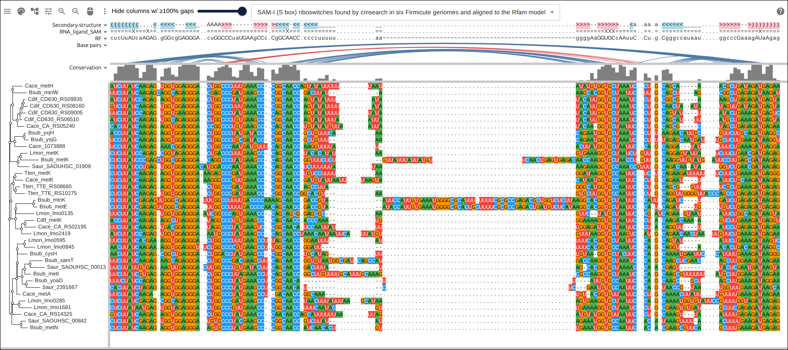
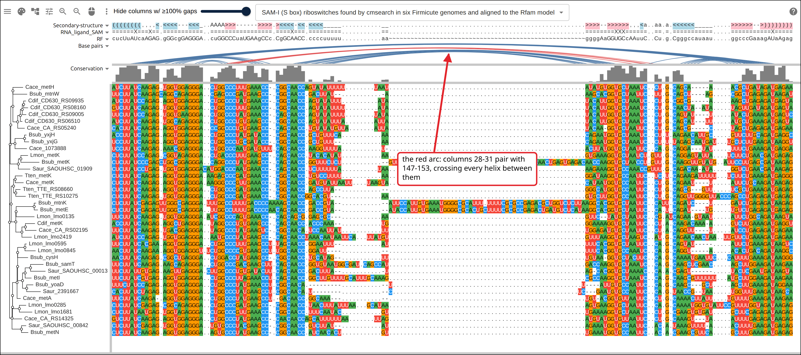
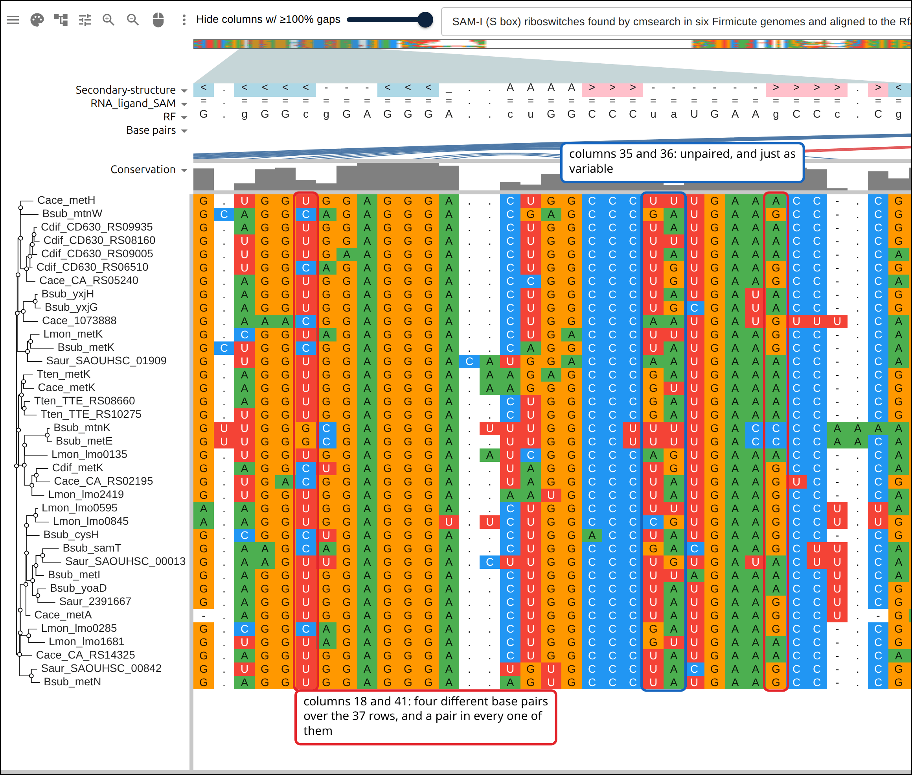
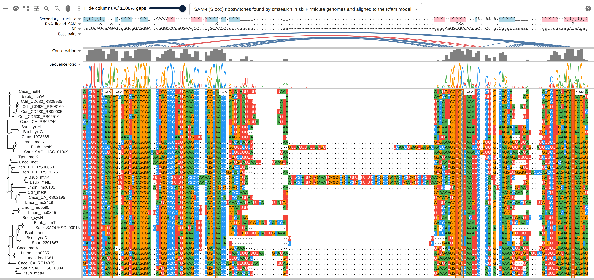
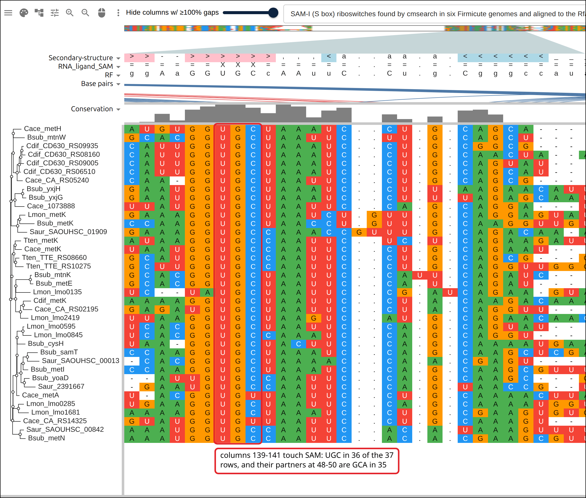
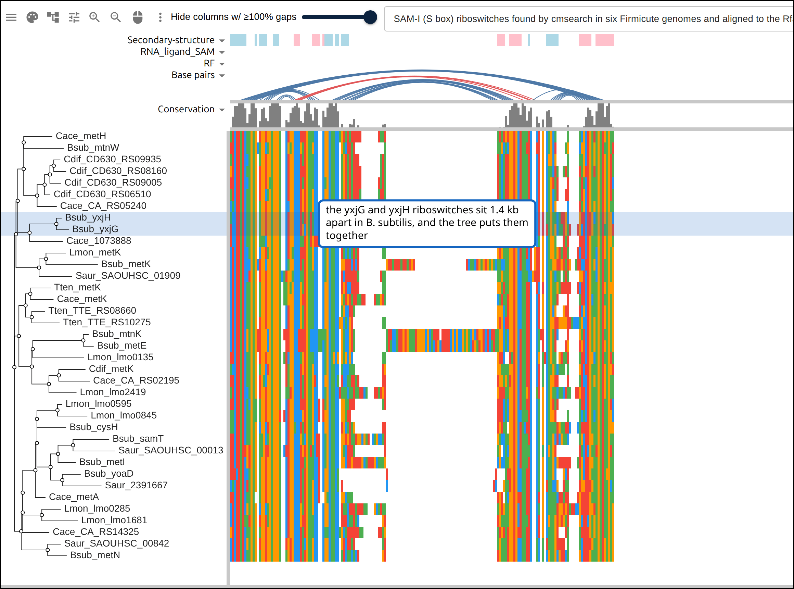

# An RNA family, from a model and six genomes

A riboswitch is a piece of an mRNA that folds up in front of the gene it
controls and binds a small molecule, and the fold is what does the work. That
leaves the sequence free to drift, on one condition: every base pair needs two
sides, so a change on one side has to be met by a change on the other. This page
takes one such family, finds its copies in six bacterial genomes, aligns them
and opens the result with the base pairs drawn over the columns, where that
condition is visible row by row.

Four tools do the work, and none of them run inside the viewer: `curl`,
`cmsearch`, `cmalign` and FastTree.

## Prerequisites

- `curl` and `python3`
- Infernal 1.1 for `cmsearch` and `cmalign`, `apt install infernal` on Debian or
  Ubuntu, `brew install infernal` on macOS
- FastTree, `apt install fasttree`, or `brew install fasttree`
- nothing to read along: every figure below links to the live view it captured

## Where the data comes from

Rfam release 15.1 for the family, NCBI RefSeq for the genomes and their
annotation, and the RCSB PDB for one crystal structure.

- the RF00162 covariance model: https://rfam.org/family/RF00162/cm
- the RF00162 seed alignment, 457 curated sequences with the consensus
  structure: https://rfam.org/family/RF00162/alignment/stockholm
- one RefSeq genome per request, here Bacillus subtilis 168:
  https://eutils.ncbi.nlm.nih.gov/entrez/eutils/efetch.fcgi?db=nuccore&id=NC_000964.3&rettype=fasta&retmode=text
  The other five are NC_003869.1, NC_003030.1, NC_003210.1, NC_007795.1 and
  NC_009089.1.
- the annotation of a 1500 nt window of one of those records, which names the
  gene a hit leads:
  https://eutils.ncbi.nlm.nih.gov/entrez/eutils/efetch.fcgi?db=nuccore&id=NC_000964.3&seq_start=1179185&seq_stop=1180684&strand=2&rettype=ft&retmode=text
- the sequence of the crystallized aptamer, PDB 2GIS:
  https://www.rcsb.org/fasta/entry/2GIS
- the finished alignment every link on this page opens, rehosted because
  rfam.org sends no `Access-Control-Allow-Origin` header and a browser cannot
  read it: https://gmod.org/JBrowseMSA/demo/data/rna/sam-riboswitch.sto

## The family

The SAM-I riboswitch, Rfam RF00162, sits in the leader of methionine and
cysteine biosynthesis genes in Firmicutes and binds S-adenosylmethionine, the
product those genes lead to. Rfam publishes two files for it: a seed alignment
of 457 curated sequences carrying a consensus secondary structure, and a
covariance model built from that seed. A covariance model scores a candidate on
sequence and on fold at once, which is what lets it recognize a copy that shares
the shape and little of the sequence.

```bash
curl -o RF00162.cm https://rfam.org/family/RF00162/cm
curl -o RF00162.seed.sto https://rfam.org/family/RF00162/alignment/stockholm
```

## 1. Search six genomes

Six Firmicutes, downloaded one FASTA at a time from NCBI and concatenated: B.
subtilis 168, Caldanaerobacter subterraneus subsp. tengcongensis MB4,
Clostridium acetobutylicum ATCC 824, Listeria monocytogenes EGD-e,
Staphylococcus aureus NCTC 8325 and Clostridioides difficile 630.

```bash
# --cut_ga scores against the family's own curated threshold, the one Rfam uses
# to decide what belongs in it, so nothing here is a cutoff this page chose
cmsearch --cut_ga --noali --cpu 4 --tblout hits.tbl RF00162.cm all-genomes.fa
```

Seconds of work over six chromosomes, and the table has 37 rows:

```
37 hits
  NC_000964.3  11 hits
  NC_003030.1  7 hits
  NC_003210.1  7 hits
  NC_003869.1  3 hits
  NC_007795.1  4 hits
  NC_009089.1  5 hits
```

Eleven in B. subtilis, which is where Grundy and Henkin described the S box
regulon in the first place.

## 2. Name each row by the gene it leads

A riboswitch is a leader sequence, so the label a reader wants down the side of
the alignment is the gene behind it. NCBI serves the annotation of any window of
a record as a feature table, which makes that one request per hit. The hit at
NC_000964.3:1180802-1180685 runs on the minus strand, so the window is the 1500
nt below it, read in the same direction:

```bash
curl -s "https://eutils.ncbi.nlm.nih.gov/entrez/eutils/efetch.fcgi?db=nuccore\
&id=NC_000964.3&seq_start=1179185&seq_stop=1180684&strand=2&rettype=ft&retmode=text"
```

```
90	>1500	gene
			gene	samT
			locus_tag	BSU_11010
90	>1500	CDS
			product	bifunctional homocysteine S-methyltransferase using (R,S)AdoMet and methylenetetrahydrofolate reductase [NAD(P)H]
```

The first CDS that reads forward in that frame is the gene downstream, and its
symbol plus a four-letter species prefix is the row name: `Bsub_samT`. Where the
annotation has no symbol the locus tag stands in, which is why rows like
`Cdif_CD630_RS06510` are in the figures below.

```
35 of 37 hits named by a gene, 2 with no same-strand gene within 1500 nt
```

Those two keep their coordinate instead, `Cace_1073888` and `Saur_2391667`. Both
sit in an intergenic gap whose flanking genes run the other way.

## 3. Align the hits to the model

`cmalign` aligns each hit back to the same model, so a column means one
consensus position in every row:

```bash
cmalign --noprob -o cmalign.sto RF00162.cm hits.fa
```

```
37 rows x 187 columns, 108 consensus columns
62 columns are gaps in 90% or more of the rows
```

The model has 108 consensus positions and the alignment 187 columns. The other
79 are insertions, and most of them fall in one place: the hits run from 92 to
157 nt, and the rows at the long end put their extra sequence in the variable
stem loop.

## 4. Put the pseudoknot back

A covariance model is nested by construction: it pairs columns the way brackets
nest, and a pseudoknot is by definition a pair that crosses a helix instead of
nesting inside it. Rfam annotates the SAM-I pseudoknot in the seed's `SS_cons`
with letters, `A` for an opening end and `a` for its partner, and `cmalign`
writes back only the helices its model holds.

Both alignments mark their consensus columns in `#=GC RF`, so the k-th consensus
column of one is the k-th of the other, and the build script copies the seed's
`SS_cons` across that correspondence, along with `RNA_ligand_SAM`, the columns
Rfam marks as touching the ligand. It leaves `RNA_structural_elements` behind:
the seed spells the element names across its own columns, insert columns
included, so a per-column copy keeps the brackets and loses the labels.

```
4 pseudoknot pairs copied from the seed
```

## 5. Infer a tree

FastTree reads aligned FASTA and knows DNA, so the Stockholm goes in with `U`
written as `T` and Rfam's insert gaps written as `-`:

```bash
FastTree -nt -gtr -nosupport tree-input.afa > family.nwk
```

The Newick then goes into the Stockholm as a `#=GF NH` line, which is where the
viewer reads a tree from.

## 6. Open it

One file now: the alignment, its consensus structure, the SAM contacts and the
tree all travel in the same Stockholm. Point a `?data=` link at it and nothing
else needs configuring.

```json
{
  "msaview": {
    "type": "MsaView",
    "colorSchemeName": "nucleotide",
    "colWidth": 8,
    "rowHeight": 15,
    "msaFilehandle": { "uri": "https://example.org/sam-riboswitch.sto" }
  }
}
```

[](https://gmod.org/JBrowseMSA/demo/?data=%7B%22msaview%22%3A%7B%22type%22%3A%22MsaView%22%2C%22treeAreaWidth%22%3A240%2C%22colWidth%22%3A8%2C%22colorSchemeName%22%3A%22nucleotide%22%2C%22msaFilehandle%22%3A%7B%22uri%22%3A%22data%2Frna%2Fsam-riboswitch.sto%22%7D%2C%22height%22%3A775%2C%22rowHeight%22%3A15%7D%7D)

37 riboswitches, 187 columns. The tree on the left comes from the `#=GF NH`
line, the Secondary-structure track from `#=GC SS_cons`, and the Base pairs arcs
from that same string: blue for the nested helices, red for the pseudoknot. The
other two tracks are the file's remaining `#=GC` lines, drawn as they stand:
`RNA_ligand_SAM`, with an X at each column that touches the ligand, and `RF`,
the model's own consensus sequence. The blank band across the middle is that
variable stem loop, most of the 62 columns that are gaps in 90% or more of the
rows.

## 7. The arc that crosses the others

[](https://gmod.org/JBrowseMSA/demo/?data=%7B%22msaview%22%3A%7B%22type%22%3A%22MsaView%22%2C%22treeAreaWidth%22%3A240%2C%22colWidth%22%3A8%2C%22colorSchemeName%22%3A%22nucleotide%22%2C%22msaFilehandle%22%3A%7B%22uri%22%3A%22data%2Frna%2Fsam-riboswitch.sto%22%7D%2C%22height%22%3A775%2C%22rowHeight%22%3A15%7D%7D)

The same view with the pseudoknot marked. Its four pairs join columns 28-31 to
147-153, and every blue arc between those ends passes underneath rather than
inside, which is the property the letters A and a record in the structure track
and the color records here.

## 8. One helix, four base pairs

Zoomed to the helix that runs from column 13 to column 46, the trade the page
opened with is legible a row at a time.

[](https://gmod.org/JBrowseMSA/demo/?data=%7B%22msaview%22%3A%7B%22type%22%3A%22MsaView%22%2C%22treeAreaWidth%22%3A240%2C%22colWidth%22%3A26%2C%22colorSchemeName%22%3A%22nucleotide%22%2C%22msaFilehandle%22%3A%7B%22uri%22%3A%22data%2Frna%2Fsam-riboswitch.sto%22%7D%2C%22height%22%3A978%2C%22rowHeight%22%3A17%2C%22scrollX%22%3A-312%7D%7D)

Columns 18 and 41 in red, columns 35 and 36 in blue. Column 18 is U in 26 rows,
C in 9 and G in 2; column 41 is G in 18, A in 17 and C in 2. Read as a pair they
are UA in 17 rows, CG in 9, UG in 9 and GC in 2: four different base pairs, and
a base pair in all 37 rows.

Columns 35 and 36 are the control, in the same frame. Column 36 varies more than
column 18 does, its commonest base holding 57% of the rows against 26 of 37.
`SS_cons` leaves both of them unpaired, and the last section searches the
alignment for whatever does pair with them.

## 9. Where the ligand touches

Seven columns of the Rfam consensus are annotated as contacts with SAM, and the
`#=GC RNA_ligand_SAM` track marks each of them with an X. Written into the
snapshot as `highlights` as well, the same seven columns get a labeled band that
runs down the rows.

[](https://gmod.org/JBrowseMSA/demo/?data=%7B%22msaview%22%3A%7B%22type%22%3A%22MsaView%22%2C%22treeAreaWidth%22%3A240%2C%22colWidth%22%3A8%2C%22colorSchemeName%22%3A%22nucleotide%22%2C%22msaFilehandle%22%3A%7B%22uri%22%3A%22data%2Frna%2Fsam-riboswitch.sto%22%7D%2C%22height%22%3A825%2C%22rowHeight%22%3A15%2C%22turnedOffTracks%22%3A%7B%22sequence-logo%22%3Afalse%7D%2C%22highlights%22%3A%5B%7B%22start%22%3A7%2C%22end%22%3A7%2C%22label%22%3A%22SAM%22%7D%2C%7B%22start%22%3A11%2C%22end%22%3A11%2C%22label%22%3A%22SAM%22%7D%2C%7B%22start%22%3A50%2C%22end%22%3A50%2C%22label%22%3A%22SAM%22%7D%2C%7B%22start%22%3A139%2C%22end%22%3A141%2C%22label%22%3A%22SAM%22%7D%2C%7B%22start%22%3A182%2C%22end%22%3A182%2C%22label%22%3A%22SAM%22%7D%5D%7D%7D)

Columns 7, 11, 50, 139, 140, 141 and 182, with the sequence logo track switched
on above them. Averaged over the seven, the commonest base holds 99.2% of the
rows. The paired columns average 75.5% and the columns that are neither paired
nor in contact 78.0%, so these seven are conserved in a way the rest of the
alignment is not.

Three of the seven, columns 139 to 141, are one side of a helix whose other side
is at columns 48 to 50.

[](https://gmod.org/JBrowseMSA/demo/?data=%7B%22msaview%22%3A%7B%22type%22%3A%22MsaView%22%2C%22treeAreaWidth%22%3A240%2C%22colWidth%22%3A30%2C%22colorSchemeName%22%3A%22nucleotide%22%2C%22msaFilehandle%22%3A%7B%22uri%22%3A%22data%2Frna%2Fsam-riboswitch.sto%22%7D%2C%22height%22%3A978%2C%22rowHeight%22%3A17%2C%22scrollX%22%3A-3960%7D%7D)

Columns 139, 140 and 141 read U, G and C down the rows. They pair with 50, 49
and 48, and those pairs are AU in 37 rows, CG in 37 and GC in 35. A helix column
and its partner are free to swap together; these three swap with nothing.

The aptamer whose crystal structure is PDB 2GIS, the structure Rfam took those
contacts from, was cut out of one of the six genomes searched here. Comparing
the construct against every row, the longest stretch it shares with one is 48 nt
with `Tten_TTE_RS08660`, the riboswitch in front of the
methylenetetrahydrofolate reductase gene of C. subterraneus, against 34 nt for
the next row.

## 10. What the tree did with them

[](<https://gmod.org/JBrowseMSA/demo/?data=%7B%22msaview%22%3A%7B%22type%22%3A%22MsaView%22%2C%22treeAreaWidth%22%3A330%2C%22colWidth%22%3A3%2C%22colorSchemeName%22%3A%22nucleotide%22%2C%22msaFilehandle%22%3A%7B%22uri%22%3A%22data%2Frna%2Fsam-riboswitch.sto%22%7D%2C%22height%22%3A853%2C%22rowHeight%22%3A17%2C%22highlights%22%3A%5B%7B%22rows%22%3A%5B%22Bsub_yxjG%22%2C%22Bsub_yxjH%22%5D%2C%22color%22%3A%22rgba(21%2C101%2C192%2C0.18)%22%7D%5D%7D%7D>)%22%7D%5D%7D%7D>)

The tree with the whole alignment beside it at three pixels per column. Rows
that lead the same gene in different species mostly do not come out together:
the five rows named metK sit in three separate places. The tinted pair does come
out together, and those two are the riboswitches of _yxjG_ and _yxjH_, tandem
paralogs whose leaders sit 1.4 kb apart on the B. subtilis chromosome. Four of
the five C. difficile rows form another such clade.

A tree from 187 columns of a 108 nt RNA orders the rows so that related ones sit
together, which is scaffolding for reading the alignment rather than a result of
its own.

## 11. Check it against the raw data

The figures show the consensus structure Rfam supplies. The last step of the
build script re-derives what it can from the alignment alone, and prints three
counts.

Every pair in `SS_cons`, over every row that has a base in both columns: 1223
complementary out of 1322, or 92.5%. Watson-Crick and GU both count, since GU is
a pair a helix accepts.

```
paired columns: 1223/1322 = 92.5% can pair
pseudoknot only: 126/148 = 85.1% can pair
unpaired columns drawn at random: 8934/25415 = 35.2% can pair
```

The third line is the same statistic over pairs of columns drawn at random from
the columns `SS_cons` leaves unpaired. Two nucleotide columns agree by chance
often enough to matter, and 35.2% is how often.

The last check throws the structure away. For each of the ten most variable
columns, search every other column for the one it pairs with best:

```
col  commonest base   best partner   SS_cons pairs them with
 58             31%     131 at  74%     131
133             32%      56 at  79%      56
131             34%      58 at  74%      58
 57             37%     132 at  91%     132
 56             40%     133 at  79%     133
132             40%      57 at  91%      57
  1             41%      11 at  73%     187
159             41%     172 at  86%     172
171             41%     146 at  70%     160
187             41%       5 at  81%       1
7 of 10 find the partner SS_cons names
```

Seven of the ten land on the column the published structure pairs them with, out
of 98 candidates each. The three that miss are columns 1, 171 and 187, two of
them at the ends of the alignment where fewer rows have a base at all.

The same search over the five most variable columns `SS_cons` leaves unpaired,
which have no partner to find:

```
col  commonest base   best partner   SS_cons pairs them with
 60             44%     131 at  62%       -
136             44%      55 at  85%       -
165             49%      30 at  66%       -
 36             57%       5 at  76%       -
178             57%       5 at  84%       -
```

Column 36, the control from the helix figure, tops out at 76%. Two of the five
reach the eighties, since a column pairs well with any nearly invariant column
carrying the base it usually wants. What the seven above have and these do not
is a specific partner: one column out of 98, and the one the structure names.

## Reproduce it end to end

```bash
curl -O https://raw.githubusercontent.com/GMOD/JBrowseMSA/main/docs/tutorials/scripts/build_rna_family.sh
bash build_rna_family.sh out/
```

It fetches the model, the seed and the six genomes, runs every command above and
writes `out/sam-riboswitch.sto`, the file the links on this page open. The
numbers quoted here are the ones it prints.

## See also

- [Data layers](https://gmod.org/JBrowseMSA/layers)
- [A protein family from a list of accessions](https://gmod.org/JBrowseMSA/tutorials/protein_family)
- [The insertion the structure did not resolve](https://gmod.org/JBrowseMSA/tutorials/spike_structure)
- [User guide](https://gmod.org/JBrowseMSA/guide)

## References

- Grundy FJ, Henkin TM. The S box regulon: a new global transcription
  termination control system for methionine and cysteine biosynthesis genes in
  gram-positive bacteria. _Molecular Microbiology_ 30:737-749.
- Montange RK, Batey RT. Structure of the S-adenosylmethionine riboswitch
  regulatory mRNA element. _Nature_ 441:1172-1175.
- Nawrocki EP, Eddy SR. Infernal 1.1: 100-fold faster RNA homology searches.
  _Bioinformatics_ 29:2933-2935.
- Ontiveros-Palacios N, et al. Rfam 15: RNA families database in 2025. _Nucleic
  Acids Research_ 53:D258-D267.
- Price MN, Dehal PS, Arkin AP. FastTree 2: approximately maximum-likelihood
  trees for large alignments. _PLoS ONE_ 5:e9490.
