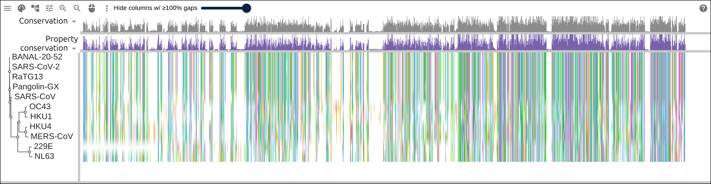
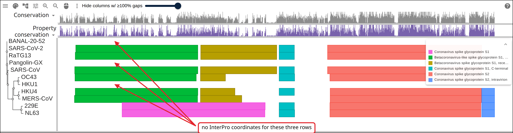
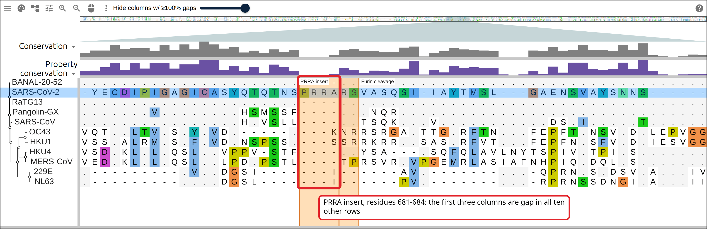
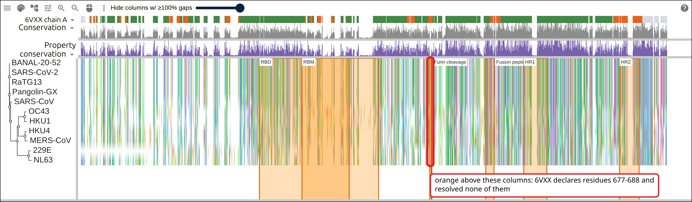
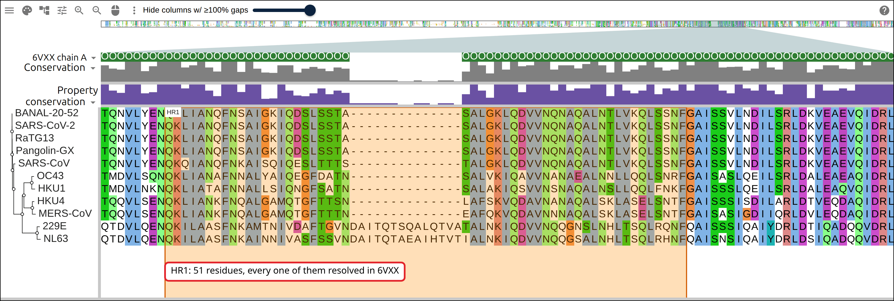
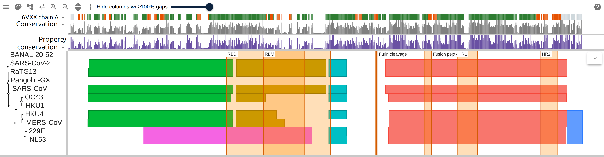

# The insertion the structure did not resolve

The SARS-CoV-2 spike protein carries four residues, PRRA, that its closest
relatives do not, and they sit where the protein gets cut in two. The first
cryo-EM structure of the trimer, PDB 6VXX, was solved from a construct with that
site engineered away, and the loop carrying it has no coordinates in the
deposited model at all. This page aligns eleven coronavirus spikes, puts the
four residues on the alignment, and then asks residue by residue which parts of
the SARS-CoV-2 row that structure actually resolved. The answer travels in the
link as data: the alignment, the tree, the domains, and a correspondence between
one row and one chain.

## Prerequisites

- `curl` and `jq`
- python3, which is what the build script does its JSON lookups in
- MAFFT: `apt install mafft` on Debian/Ubuntu, `brew install mafft` on macOS
- FastTree: `apt install fasttree`, or `brew install fasttree`
- [react-msaview-cli](https://gmod.org/JBrowseMSA/cli) for the domain GFF:
  `npm install -g react-msaview-cli`, NodeJS v22+

## Where the data comes from

Eleven spike glycoproteins as NCBI holds them, the UniProtKB entry for the
SARS-CoV-2 one, InterPro release 110.0 for the domains, and PDBe for everything
about the structure.

- All eleven protein sequences, one request:
  `https://eutils.ncbi.nlm.nih.gov/entrez/eutils/efetch.fcgi?db=protein&id=YP_009724390.1&rettype=fasta&retmode=text`
- The UniProtKB entry, for its sequence and its feature table:
  `https://rest.uniprot.org/uniprotkb/P0DTC2.json`
- Precomputed Pfam matches for one accession:
  `https://www.ebi.ac.uk/interpro/api/entry/pfam/protein/uniprot/P0DTC2/`
- The SIFTS residue correspondence between UniProt and the PDB entry:
  `https://www.ebi.ac.uk/pdbe/api/mappings/uniprot/6vxx`
- Which residues of chain A have coordinates:
  `https://www.ebi.ac.uk/pdbe/api/pdb/entry/polymer_coverage/6vxx/chain/A`
- The sequence the entry actually deposited, tags included:
  `https://www.ebi.ac.uk/pdbe/api/pdb/entry/molecules/6vxx`
- The structure itself, for a viewer that wants to draw it:
  `https://files.rcsb.org/download/6VXX.cif`

Every one of these serves a single record per request and sends
`Access-Control-Allow-Origin: *`.

## 1. Name the rows

Three columns: the NCBI protein the alignment uses, the label the viewer draws,
and the UniProtKB entry for the same protein where one exists.

```
YP_009724390.1	SARS-CoV-2	P0DTC2
QHR63300.2	RaTG13	A0ABF7PLN6
UAY13217.1	BANAL-20-52	-
QIA48632.1	Pangolin-GX	-
NP_828851.1	SARS-CoV	P59594
YP_009047204.1	MERS-CoV	K9N5Q8
YP_001039953.1	HKU4	A3EX94
YP_173238.1	HKU1	Q0ZME7
YP_009555241.1	OC43	P36334
NP_073551.1	229E	P15423
YP_003767.1	NL63	Q6Q1S2
```

Save that as `rows.tsv`. The separators are tabs. The label is what travels
through the whole page: it becomes the FASTA defline, the tree tip, the GFF
`seq_id`, and the `row` field of every layer, which is how the viewer pairs them
back up.

The third column is what InterPro's precomputed matches are keyed by. A `-`
means nobody has deposited that isolate's spike in UniProtKB: BANAL-20-52 is the
Laos bat virus from Temmam et al., and Pangolin-GX is the GX-P5L isolate, and
both exist only as GenBank records.

## 2. Fetch the sequences

One request for all eleven, then relabel each record by virus rather than by
accession:

```bash
# a comma-separated id list is one efetch call, not eleven
ids=$(cut -f1 rows.tsv | paste -sd,)
curl -sf "https://eutils.ncbi.nlm.nih.gov/entrez/eutils/efetch.fcgi\
?db=protein&id=$ids&rettype=fasta&retmode=text" -o spike-ncbi.fasta
```

Read the lengths before aligning anything:

```
SARS-CoV-2   YP_009724390.1   1273 aa
RaTG13       QHR63300.2       1269 aa
BANAL-20-52  UAY13217.1       1269 aa
Pangolin-GX  QIA48632.1       1267 aa
SARS-CoV     NP_828851.1      1255 aa
MERS-CoV     YP_009047204.1   1353 aa
HKU4         YP_001039953.1   1352 aa
HKU1         YP_173238.1      1356 aa
OC43         YP_009555241.1   1353 aa
229E         NP_073551.1      1173 aa
NL63         YP_003767.1      1356 aa
```

Full-length spikes, 1173 to 1356 residues. The four sarbecoviruses at the top
are within six residues of each other, and the rest are up to 180 residues away
from them, which is the range the aligner has to absorb. A truncated fragment or
a stray polyprotein shows up here as a length that does not belong, and it is
much cheaper to catch now than to explain later as a gap in the figure.

## 3. Align them

```bash
mafft --auto spike.fasta > spike.afa
```

`--auto` picks its strategy from the size of the input, and on eleven sequences
it reports choosing L-INS-i, the accurate and slow one. Five seconds, and 1660
columns: 304 more than the longest input, which is the room it made for
insertions.

## 4. Infer a tree

```bash
# -lg is the amino-acid substitution model; the Newick goes to stdout and the
# progress to stderr
FastTree -lg spike.afa > spike.nwk
```

```
(SARS-CoV-2:0.007478676,BANAL-20-52:0.004978619,(RaTG13:0.009142493,
(Pangolin-GX:0.038420176,(SARS-CoV:0.140352604,((229E:0.227306296,
NL63:0.306929144)1.000:1.267772518,((MERS-CoV:0.289975358,HKU4:0.170994428)...
```

The four sarbecoviruses sit on branches of 0.005 to 0.04 while the two
alphacoronaviruses are out at 0.23 and 0.31, so the tree spends almost all of
its width separating 229E and NL63 from everything else.

[](https://gmod.org/JBrowseMSA/demo/?data=%7B%22msaview%22%3A%7B%22type%22%3A%22MsaView%22%2C%22height%22%3A400%2C%22treeAreaWidth%22%3A170%2C%22colWidth%22%3A0.8%2C%22rowHeight%22%3A22%2C%22colorSchemeName%22%3A%22clustalx_protein_dynamic%22%2C%22msaFilehandle%22%3A%7B%22uri%22%3A%22data%2Fspike%2Fspike.afa%22%7D%2C%22treeFilehandle%22%3A%7B%22uri%22%3A%22data%2Fspike%2Fspike.nwk%22%7D%7D%7D)

Eleven spikes in 1660 columns, rows ordered by the tree. The left half, S1,
breaks into blocks separated by long gaps; the right half, S2, runs nearly
unbroken across all eleven rows.

## 5. Ask InterPro for the domains

Every UniProtKB sequence already has its InterPro matches computed, so there is
nothing to scan. The matches are in the UniProtKB entry's numbering, though, and
these rows are NCBI records, so the entry has to be the same protein as the row
before its coordinates mean anything on it:

```bash
# same length means substitutions only, so residue n is residue n in both;
# a length difference is an indel, and every boundary after it has moved
curl -sf "https://rest.uniprot.org/uniprotkb/$accession.fasta" |
  tail -n +2 | tr -d '\n' | wc -c
```

```
SARS-CoV-2   P0DTC2 same length, 0 substitution(s)
RaTG13       A0ABF7PLN6 same length, 0 substitution(s)
BANAL-20-52  no UniProtKB entry, so no precomputed matches
Pangolin-GX  no UniProtKB entry, so no precomputed matches
SARS-CoV     P59594 same length, 1 substitution(s)
MERS-CoV     K9N5Q8 same length, 2 substitution(s)
HKU4         A3EX94 same length, 0 substitution(s)
HKU1         Q0ZME7 is 1351 aa against the row's 1356, so its numbering is not the row's: dropped
OC43         P36334 same length, 2 substitution(s)
229E         P15423 same length, 0 substitution(s)
NL63         Q6Q1S2 same length, 0 substitution(s)
```

Eight rows survive that. The HKU1 RefSeq protein and the HKU1 UniProt entry are
different isolates five residues apart in length, and the domains of one placed
on the other would be off by five from wherever the indel is.

The survivors go into `spike-uniprot.tsv`, accession and label per line, which
is the file the CLI reads:

```bash
react-msaview-cli interpro spike-uniprot.tsv -o spike-domains.gff
```

```
InterPro release 110.0; reading precomputed pfam matches...
  [1/8] P0DTC2: 4 pfam entries
  ...
8 fetched, 0 from /home/you/.cache/react-msaview-cli/interpro
```

[](https://gmod.org/JBrowseMSA/demo/?data=%7B%22msaview%22%3A%7B%22type%22%3A%22MsaView%22%2C%22height%22%3A400%2C%22treeAreaWidth%22%3A170%2C%22colWidth%22%3A0.8%2C%22rowHeight%22%3A22%2C%22colorSchemeName%22%3A%22clustalx_protein_dynamic%22%2C%22msaFilehandle%22%3A%7B%22uri%22%3A%22data%2Fspike%2Fspike.afa%22%7D%2C%22treeFilehandle%22%3A%7B%22uri%22%3A%22data%2Fspike%2Fspike.nwk%22%7D%2C%22gffFilehandle%22%3A%7B%22uri%22%3A%22data%2Fspike%2Fspike-domains.gff%22%7D%7D%7D)

The same four-part architecture down the betacoronavirus rows: S1 N-terminal
domain, S1 receptor-binding, S1 C-terminal, then S2. 229E and NL63 carry the
alphacoronavirus S1 signature instead, one box where the others have three, and
the three rows the arrows point at have no boxes because no UniProtKB entry
could supply coordinates for them.

## 6. The four columns nobody else has

The insert is not in anyone's feature table, because it is defined by what the
other sequences lack. Read it off the sequence:

```bash
awk '/^>SARS-CoV-2/{getline; print index($0, "PRRA")}' spike.fasta
```

```
681
```

Residues 681 to 684, which land in alignment columns 992 to 995, and a
`highlights` entry in residue coordinates puts a labeled band on them without
anyone converting anything:

```json
"highlights": [
  { "row": "SARS-CoV-2", "start": 681, "end": 684, "label": "PRRA insert" },
  { "row": "SARS-CoV-2", "start": 685, "end": 686, "label": "Furin cleavage" }
]
```

[](https://gmod.org/JBrowseMSA/demo/?data=%7B%22msaview%22%3A%7B%22type%22%3A%22MsaView%22%2C%22height%22%3A500%2C%22treeAreaWidth%22%3A170%2C%22colWidth%22%3A22%2C%22rowHeight%22%3A22%2C%22scrollX%22%3A-21318%2C%22colorSchemeName%22%3A%22clustalx_protein_dynamic%22%2C%22msaFilehandle%22%3A%7B%22uri%22%3A%22data%2Fspike%2Fspike.afa%22%7D%2C%22treeFilehandle%22%3A%7B%22uri%22%3A%22data%2Fspike%2Fspike.nwk%22%7D%2C%22relativeTo%22%3A%22SARS-CoV-2%22%2C%22highlights%22%3A%5B%7B%22row%22%3A%22SARS-CoV-2%22%2C%22start%22%3A319%2C%22end%22%3A541%2C%22label%22%3A%22RBD%22%7D%2C%7B%22row%22%3A%22SARS-CoV-2%22%2C%22start%22%3A437%2C%22end%22%3A508%2C%22label%22%3A%22RBM%22%7D%2C%7B%22row%22%3A%22SARS-CoV-2%22%2C%22start%22%3A681%2C%22end%22%3A684%2C%22label%22%3A%22PRRA%20insert%22%7D%2C%7B%22row%22%3A%22SARS-CoV-2%22%2C%22start%22%3A685%2C%22end%22%3A686%2C%22label%22%3A%22Furin%20cleavage%22%7D%2C%7B%22row%22%3A%22SARS-CoV-2%22%2C%22start%22%3A816%2C%22end%22%3A837%2C%22label%22%3A%22Fusion%20peptide%22%7D%2C%7B%22row%22%3A%22SARS-CoV-2%22%2C%22start%22%3A920%2C%22end%22%3A970%2C%22label%22%3A%22HR1%22%7D%2C%7B%22row%22%3A%22SARS-CoV-2%22%2C%22start%22%3A1163%2C%22end%22%3A1202%2C%22label%22%3A%22HR2%22%7D%5D%7D%7D)

The S1/S2 junction at base resolution, every row read against SARS-CoV-2: a dot
is the same residue, a letter a different one. The boxed columns are the insert,
and the band beside it is the furin cleavage site UniProt annotates at 685-686.

Columns 992, 993 and 994 are gap in all ten other rows. Column 995 is gap in six
of them and carries S in HKU1, K in OC43, and I in both 229E and NL63, the four
rows furthest from SARS-CoV-2 in the tree. The column immediately after the
insert, 996, is R685 here and an R in every other betacoronavirus row: that
arginine is shared, and what SARS-CoV-2 has in front of it is not.

## 7. What 6VXX resolved

A PDB entry numbers its residues its own way, so before anything can be said
about which residue of the row is which residue of the structure, SIFTS has to
supply the correspondence:

```bash
curl -s https://www.ebi.ac.uk/pdbe/api/mappings/uniprot/6vxx |
  jq '.["6vxx"].UniProt.P0DTC2.mappings[] | select(.chain_id == "A")'
```

```
SIFTS row 14-1211 is 6VXX 33-1230 (offset 19)
the entity is 1281 residues, identity 0.97 to P0DTC2
32 residues before the mapped region and 51 after it belong to no part of P0DTC2
6VXX 701 is S where row residue 682 is R
6VXX 702 is G where row residue 683 is R
6VXX 704 is G where row residue 685 is R
6VXX 1005 is P where row residue 986 is K
6VXX 1006 is P where row residue 987 is V
```

One block, offset by 19 for its whole length. The offset is the construct: the
deposited entity opens with 32 residues of an expression signal peptide that are
not spike, and ends with 51 residues of linker, tag and trimerization foldon
that are not spike either. The five differences inside the block are engineering
too. The three arginines of the furin site are S, G and G in the entity, which
is the site being disabled so the trimer stays intact, and K986P and V987P are
the two prolines that hold it in the prefusion shape.

Author numbering is a third system again:

```bash
curl -s https://www.ebi.ac.uk/pdbe/api/pdb/entry/polymer_coverage/6vxx/chain/A |
  jq '.["6vxx"].molecules[0].chains[0].observed[0]'
```

```
12 observed stretches; the first starts at label_seq_id 46, which the entry's
author numbering calls 27
```

Twelve stretches with coordinates, out of one continuous chain. What the entry
calls residue 27 is the 46th position of its own SEQRES, and the layer uses
`label_seq_id` throughout, because author numbering carries insertion codes and
integer arithmetic on it is wrong.

Both halves together are the `residueMappings` layer: the SIFTS block as a
segment, the gaps between the observed stretches as `unobserved`, and the
ungapped length of the row it was computed against so the viewer can refuse the
whole thing if it is ever loaded beside a different alignment.

```json
"residueMappings": [
  {
    "row": "SARS-CoV-2",
    "accession": "P0DTC2",
    "structure": {
      "id": "6VXX",
      "kind": "experimental",
      "asymId": "A",
      "url": "https://files.rcsb.org/download/6VXX.cif"
    },
    "segments": [
      { "rowStart": 14, "rowEnd": 1211, "structStart": 33, "structEnd": 1230 }
    ],
    "unobserved": [
      [33, 45], [89, 98], [163, 183], [192, 204], [265, 281], [464, 465],
      [474, 480], [488, 507], [521, 521], [640, 659], [696, 707], [847, 872],
      [1167, 1230]
    ],
    "rowLength": 1273,
    "generated": { "by": "sifts", "date": "2026-09-13" }
  }
]
```

Of the 1273 residues in the row, 972 are mapped and observed, 226 are mapped and
not resolved, and 75 are outside the construct entirely. The layer itself draws
nothing, so the build script turns the same three states into a `columnTracks`
text track, one character per residue of the row, which the viewer projects
through that row's gaps and colors: green for observed, orange for declared and
not resolved, gray for outside the construct.

```json
{
  "id": "6vxx-coverage",
  "name": "6VXX chain A",
  "kind": "text",
  "row": "SARS-CoV-2",
  "data": "NNNNNNNNNNNNNUUUUUUUUUUUUUOOOOOOOOOO...",
  "colors": { "O": "#2e7d32", "U": "#e65100", "N": "#cfd8dc" }
}
```

[](https://gmod.org/JBrowseMSA/demo/?data=%7B%22msaview%22%3A%7B%22type%22%3A%22MsaView%22%2C%22height%22%3A450%2C%22treeAreaWidth%22%3A170%2C%22colWidth%22%3A0.8%2C%22rowHeight%22%3A22%2C%22colorSchemeName%22%3A%22clustalx_protein_dynamic%22%2C%22msaFilehandle%22%3A%7B%22uri%22%3A%22data%2Fspike%2Fspike.afa%22%7D%2C%22treeFilehandle%22%3A%7B%22uri%22%3A%22data%2Fspike%2Fspike.nwk%22%7D%2C%22columnTracks%22%3A%5B%7B%22id%22%3A%226vxx-coverage%22%2C%22name%22%3A%226VXX%20chain%20A%22%2C%22kind%22%3A%22text%22%2C%22row%22%3A%22SARS-CoV-2%22%2C%22data%22%3A%22NNNNNNNNNNNNNUUUUUUUUUUUUUOOOOOOOOOOOOOOOOOOOOOOOOOOOOOOOOOOOOOOOOOOOUUUUUUUUUUOOOOOOOOOOOOOOOOOOOOOOOOOOOOOOOOOOOOOOOOOOOOOOOOOOOOOOOOOOOOOOOOUUUUUUUUUUUUUUUUUUUUUOOOOOOOOUUUUUUUUUUUUUOOOOOOOOOOOOOOOOOOOOOOOOOOOOOOOOOOOOOOOOOOOOOOOOOOOOOOOOOOOOUUUUUUUUUUUUUUUUUOOOOOOOOOOOOOOOOOOOOOOOOOOOOOOOOOOOOOOOOOOOOOOOOOOOOOOOOOOOOOOOOOOOOOOOOOOOOOOOOOOOOOOOOOOOOOOOOOOOOOOOOOOOOOOOOOOOOOOOOOOOOOOOOOOOOOOOOOOOOOOOOOOOOOOOOOOOOOOOOOOOOOOOOOOOOOOOOOOOOOOUUOOOOOOOOUUUUUUUOOOOOOOUUUUUUUUUUUUUUUUUUUUOOOOOOOOOOOOOUOOOOOOOOOOOOOOOOOOOOOOOOOOOOOOOOOOOOOOOOOOOOOOOOOOOOOOOOOOOOOOOOOOOOOOOOOOOOOOOOOOOOOOOOOOOOOOOOOOOOOOOOOOOOOOOOOOOOOOUUUUUUUUUUUUUUUUUUUUOOOOOOOOOOOOOOOOOOOOOOOOOOOOOOOOOOOOUUUUUUUUUUUUOOOOOOOOOOOOOOOOOOOOOOOOOOOOOOOOOOOOOOOOOOOOOOOOOOOOOOOOOOOOOOOOOOOOOOOOOOOOOOOOOOOOOOOOOOOOOOOOOOOOOOOOOOOOOOOOOOOOOOOOOOOOOOOOOOOOOOOOOOOUUUUUUUUUUUUUUUUUUUUUUUUUUOOOOOOOOOOOOOOOOOOOOOOOOOOOOOOOOOOOOOOOOOOOOOOOOOOOOOOOOOOOOOOOOOOOOOOOOOOOOOOOOOOOOOOOOOOOOOOOOOOOOOOOOOOOOOOOOOOOOOOOOOOOOOOOOOOOOOOOOOOOOOOOOOOOOOOOOOOOOOOOOOOOOOOOOOOOOOOOOOOOOOOOOOOOOOOOOOOOOOOOOOOOOOOOOOOOOOOOOOOOOOOOOOOOOOOOOOOOOOOOOOOOOOOOOOOOOOOOOOOOOOOOOOOOOOOOOOOOOOOOOOOOOOOOOOOOOOOUUUUUUUUUUUUUUUUUUUUUUUUUUUUUUUUUUUUUUUUUUUUUUUUUUUUUUUUUUUUUUUUNNNNNNNNNNNNNNNNNNNNNNNNNNNNNNNNNNNNNNNNNNNNNNNNNNNNNNNNNNNNNN%22%2C%22colors%22%3A%7B%22O%22%3A%22%232e7d32%22%2C%22U%22%3A%22%23e65100%22%2C%22N%22%3A%22%23cfd8dc%22%7D%2C%22height%22%3A16%7D%5D%2C%22highlights%22%3A%5B%7B%22row%22%3A%22SARS-CoV-2%22%2C%22start%22%3A319%2C%22end%22%3A541%2C%22label%22%3A%22RBD%22%7D%2C%7B%22row%22%3A%22SARS-CoV-2%22%2C%22start%22%3A437%2C%22end%22%3A508%2C%22label%22%3A%22RBM%22%7D%2C%7B%22row%22%3A%22SARS-CoV-2%22%2C%22start%22%3A681%2C%22end%22%3A684%2C%22label%22%3A%22PRRA%20insert%22%7D%2C%7B%22row%22%3A%22SARS-CoV-2%22%2C%22start%22%3A685%2C%22end%22%3A686%2C%22label%22%3A%22Furin%20cleavage%22%7D%2C%7B%22row%22%3A%22SARS-CoV-2%22%2C%22start%22%3A816%2C%22end%22%3A837%2C%22label%22%3A%22Fusion%20peptide%22%7D%2C%7B%22row%22%3A%22SARS-CoV-2%22%2C%22start%22%3A920%2C%22end%22%3A970%2C%22label%22%3A%22HR1%22%7D%2C%7B%22row%22%3A%22SARS-CoV-2%22%2C%22start%22%3A1163%2C%22end%22%3A1202%2C%22label%22%3A%22HR2%22%7D%5D%2C%22residueMappings%22%3A%5B%7B%22row%22%3A%22SARS-CoV-2%22%2C%22accession%22%3A%22P0DTC2%22%2C%22structure%22%3A%7B%22id%22%3A%226VXX%22%2C%22kind%22%3A%22experimental%22%2C%22asymId%22%3A%22A%22%2C%22url%22%3A%22https%3A%2F%2Ffiles.rcsb.org%2Fdownload%2F6VXX.cif%22%7D%2C%22segments%22%3A%5B%7B%22rowStart%22%3A14%2C%22rowEnd%22%3A1211%2C%22structStart%22%3A33%2C%22structEnd%22%3A1230%7D%5D%2C%22unobserved%22%3A%5B%5B33%2C45%5D%2C%5B89%2C98%5D%2C%5B163%2C183%5D%2C%5B192%2C204%5D%2C%5B265%2C281%5D%2C%5B464%2C465%5D%2C%5B474%2C480%5D%2C%5B488%2C507%5D%2C%5B521%2C521%5D%2C%5B640%2C659%5D%2C%5B696%2C707%5D%2C%5B847%2C872%5D%2C%5B1167%2C1230%5D%5D%2C%22rowLength%22%3A1273%2C%22generated%22%3A%7B%22by%22%3A%22sifts%22%2C%22date%22%3A%222026-09-13%22%7D%7D%5D%7D%7D)

The correspondence over the whole alignment. The ribbon above the rows is chain
A of 6VXX read along the SARS-CoV-2 row, gray at both ends where the construct
is not spike, and orange wherever the model declares residues it did not
resolve. The boxed columns are the furin loop.

6VXX declares 696 to 707, which is row residues 677 to 688, and resolved none of
it. The insert is in the middle of that: 0 of its 4 residues observed, and 0 of
the 2 in the cleavage site beside it.

## 8. A region that comes out unremarkable

The same row, the same chain, the same layer, at the first heptad repeat:

[](https://gmod.org/JBrowseMSA/demo/?data=%7B%22msaview%22%3A%7B%22type%22%3A%22MsaView%22%2C%22height%22%3A520%2C%22treeAreaWidth%22%3A170%2C%22colWidth%22%3A14%2C%22rowHeight%22%3A22%2C%22scrollX%22%3A-17472%2C%22colorSchemeName%22%3A%22clustalx_protein_dynamic%22%2C%22msaFilehandle%22%3A%7B%22uri%22%3A%22data%2Fspike%2Fspike.afa%22%7D%2C%22treeFilehandle%22%3A%7B%22uri%22%3A%22data%2Fspike%2Fspike.nwk%22%7D%2C%22columnTracks%22%3A%5B%7B%22id%22%3A%226vxx-coverage%22%2C%22name%22%3A%226VXX%20chain%20A%22%2C%22kind%22%3A%22text%22%2C%22row%22%3A%22SARS-CoV-2%22%2C%22data%22%3A%22NNNNNNNNNNNNNUUUUUUUUUUUUUOOOOOOOOOOOOOOOOOOOOOOOOOOOOOOOOOOOOOOOOOOOUUUUUUUUUUOOOOOOOOOOOOOOOOOOOOOOOOOOOOOOOOOOOOOOOOOOOOOOOOOOOOOOOOOOOOOOOOUUUUUUUUUUUUUUUUUUUUUOOOOOOOOUUUUUUUUUUUUUOOOOOOOOOOOOOOOOOOOOOOOOOOOOOOOOOOOOOOOOOOOOOOOOOOOOOOOOOOOOUUUUUUUUUUUUUUUUUOOOOOOOOOOOOOOOOOOOOOOOOOOOOOOOOOOOOOOOOOOOOOOOOOOOOOOOOOOOOOOOOOOOOOOOOOOOOOOOOOOOOOOOOOOOOOOOOOOOOOOOOOOOOOOOOOOOOOOOOOOOOOOOOOOOOOOOOOOOOOOOOOOOOOOOOOOOOOOOOOOOOOOOOOOOOOOOOOOOOOOUUOOOOOOOOUUUUUUUOOOOOOOUUUUUUUUUUUUUUUUUUUUOOOOOOOOOOOOOUOOOOOOOOOOOOOOOOOOOOOOOOOOOOOOOOOOOOOOOOOOOOOOOOOOOOOOOOOOOOOOOOOOOOOOOOOOOOOOOOOOOOOOOOOOOOOOOOOOOOOOOOOOOOOOOOOOOOOOUUUUUUUUUUUUUUUUUUUUOOOOOOOOOOOOOOOOOOOOOOOOOOOOOOOOOOOOUUUUUUUUUUUUOOOOOOOOOOOOOOOOOOOOOOOOOOOOOOOOOOOOOOOOOOOOOOOOOOOOOOOOOOOOOOOOOOOOOOOOOOOOOOOOOOOOOOOOOOOOOOOOOOOOOOOOOOOOOOOOOOOOOOOOOOOOOOOOOOOOOOOOOOOUUUUUUUUUUUUUUUUUUUUUUUUUUOOOOOOOOOOOOOOOOOOOOOOOOOOOOOOOOOOOOOOOOOOOOOOOOOOOOOOOOOOOOOOOOOOOOOOOOOOOOOOOOOOOOOOOOOOOOOOOOOOOOOOOOOOOOOOOOOOOOOOOOOOOOOOOOOOOOOOOOOOOOOOOOOOOOOOOOOOOOOOOOOOOOOOOOOOOOOOOOOOOOOOOOOOOOOOOOOOOOOOOOOOOOOOOOOOOOOOOOOOOOOOOOOOOOOOOOOOOOOOOOOOOOOOOOOOOOOOOOOOOOOOOOOOOOOOOOOOOOOOOOOOOOOOOOOOOOOOUUUUUUUUUUUUUUUUUUUUUUUUUUUUUUUUUUUUUUUUUUUUUUUUUUUUUUUUUUUUUUUUNNNNNNNNNNNNNNNNNNNNNNNNNNNNNNNNNNNNNNNNNNNNNNNNNNNNNNNNNNNNNN%22%2C%22colors%22%3A%7B%22O%22%3A%22%232e7d32%22%2C%22U%22%3A%22%23e65100%22%2C%22N%22%3A%22%23cfd8dc%22%7D%2C%22height%22%3A16%7D%5D%2C%22highlights%22%3A%5B%7B%22row%22%3A%22SARS-CoV-2%22%2C%22start%22%3A920%2C%22end%22%3A970%2C%22label%22%3A%22HR1%22%7D%5D%2C%22residueMappings%22%3A%5B%7B%22row%22%3A%22SARS-CoV-2%22%2C%22accession%22%3A%22P0DTC2%22%2C%22structure%22%3A%7B%22id%22%3A%226VXX%22%2C%22kind%22%3A%22experimental%22%2C%22asymId%22%3A%22A%22%2C%22url%22%3A%22https%3A%2F%2Ffiles.rcsb.org%2Fdownload%2F6VXX.cif%22%7D%2C%22segments%22%3A%5B%7B%22rowStart%22%3A14%2C%22rowEnd%22%3A1211%2C%22structStart%22%3A33%2C%22structEnd%22%3A1230%7D%5D%2C%22unobserved%22%3A%5B%5B33%2C45%5D%2C%5B89%2C98%5D%2C%5B163%2C183%5D%2C%5B192%2C204%5D%2C%5B265%2C281%5D%2C%5B464%2C465%5D%2C%5B474%2C480%5D%2C%5B488%2C507%5D%2C%5B521%2C521%5D%2C%5B640%2C659%5D%2C%5B696%2C707%5D%2C%5B847%2C872%5D%2C%5B1167%2C1230%5D%5D%2C%22rowLength%22%3A1273%2C%22generated%22%3A%7B%22by%22%3A%22sifts%22%2C%22date%22%3A%222026-09-13%22%7D%7D%5D%7D%7D)

HR1 at base resolution, row residues 920-970, structure residues 939-989. The
ribbon reads O for all 51, and the columns underneath are the most conserved
block in the figure. The blank stretch in the ribbon is where SARS-CoV-2 has no
residue at all: 229E and NL63 carry an insertion there.

Across the regions UniProt annotates on this row, what the structure resolved
varies the way a prefusion trimer should:

| Region                | Observed | Declared, not resolved |
| --------------------- | -------: | ---------------------: |
| RBD (319-541)         |      193 |                     30 |
| RBM (437-508)         |       42 |                     30 |
| PRRA insert (681-684) |        0 |                      4 |
| Fusion peptide        |       12 |                     10 |
| HR1 (920-970)         |       51 |                      0 |
| HR2 (1163-1202)       |        0 |                     40 |

The receptor-binding motif is the tip that swings up to meet ACE2 and is half
unresolved in this closed trimer; HR2 sits past residue 1147, where the model
stops.

## 9. Check it against the raw data

Three commands, none of which involve the viewer:

```bash
# the insert, in the row the viewer draws
awk '/^>SARS-CoV-2/{getline; print index($0, "PRRA")}' spike.fasta

# the block the mapping's one segment came from
curl -s https://www.ebi.ac.uk/pdbe/api/mappings/uniprot/6vxx |
  jq -c '.["6vxx"].UniProt.P0DTC2.mappings[] | select(.chain_id == "A") |
         [.unp_start, .unp_end, .start.residue_number, .end.residue_number]'

# the stretch the furin loop falls in, in label_seq_id
curl -s https://www.ebi.ac.uk/pdbe/api/pdb/entry/polymer_coverage/6vxx/chain/A |
  jq -c '.["6vxx"].molecules[0].chains[0].observed[9,10] |
         [.start.residue_number, .end.residue_number]'
```

```
681
[14,1211,33,1230]
[660,695]
[708,846]
```

681 is where the highlight is. `[14,1211,33,1230]` is the segment in the layer,
offset 19. The two stretches either side of the hole end at 695 and resume at
708, which leaves 696 to 707 with no coordinates, which is row residues 677 to
688, which is the loop the insert is in.

## 10. Open the whole thing

Four files and three layers. The files are hosted; the layers ride in the URL,
because they are a few kilobytes and the alignment is not:

```json
{
  "msaview": {
    "type": "MsaView",
    "colWidth": 0.8,
    "rowHeight": 22,
    "colorSchemeName": "clustalx_protein_dynamic",
    "msaFilehandle": { "uri": "https://example.org/spike.afa" },
    "treeFilehandle": { "uri": "https://example.org/spike.nwk" },
    "gffFilehandle": { "uri": "https://example.org/spike-domains.gff" },
    "columnTracks": [{ "id": "6vxx-coverage" }],
    "highlights": [{ "row": "SARS-CoV-2", "start": 681, "end": 684 }],
    "residueMappings": [{ "row": "SARS-CoV-2" }]
  }
}
```

[](https://gmod.org/JBrowseMSA/demo/?data=%7B%22msaview%22%3A%7B%22type%22%3A%22MsaView%22%2C%22height%22%3A400%2C%22treeAreaWidth%22%3A170%2C%22colWidth%22%3A0.8%2C%22rowHeight%22%3A22%2C%22colorSchemeName%22%3A%22clustalx_protein_dynamic%22%2C%22msaFilehandle%22%3A%7B%22uri%22%3A%22data%2Fspike%2Fspike.afa%22%7D%2C%22treeFilehandle%22%3A%7B%22uri%22%3A%22data%2Fspike%2Fspike.nwk%22%7D%2C%22gffFilehandle%22%3A%7B%22uri%22%3A%22data%2Fspike%2Fspike-domains.gff%22%7D%2C%22showDomainLegend%22%3Afalse%2C%22columnTracks%22%3A%5B%7B%22id%22%3A%226vxx-coverage%22%2C%22name%22%3A%226VXX%20chain%20A%22%2C%22kind%22%3A%22text%22%2C%22row%22%3A%22SARS-CoV-2%22%2C%22data%22%3A%22NNNNNNNNNNNNNUUUUUUUUUUUUUOOOOOOOOOOOOOOOOOOOOOOOOOOOOOOOOOOOOOOOOOOOUUUUUUUUUUOOOOOOOOOOOOOOOOOOOOOOOOOOOOOOOOOOOOOOOOOOOOOOOOOOOOOOOOOOOOOOOOUUUUUUUUUUUUUUUUUUUUUOOOOOOOOUUUUUUUUUUUUUOOOOOOOOOOOOOOOOOOOOOOOOOOOOOOOOOOOOOOOOOOOOOOOOOOOOOOOOOOOOUUUUUUUUUUUUUUUUUOOOOOOOOOOOOOOOOOOOOOOOOOOOOOOOOOOOOOOOOOOOOOOOOOOOOOOOOOOOOOOOOOOOOOOOOOOOOOOOOOOOOOOOOOOOOOOOOOOOOOOOOOOOOOOOOOOOOOOOOOOOOOOOOOOOOOOOOOOOOOOOOOOOOOOOOOOOOOOOOOOOOOOOOOOOOOOOOOOOOOOUUOOOOOOOOUUUUUUUOOOOOOOUUUUUUUUUUUUUUUUUUUUOOOOOOOOOOOOOUOOOOOOOOOOOOOOOOOOOOOOOOOOOOOOOOOOOOOOOOOOOOOOOOOOOOOOOOOOOOOOOOOOOOOOOOOOOOOOOOOOOOOOOOOOOOOOOOOOOOOOOOOOOOOOOOOOOOOOUUUUUUUUUUUUUUUUUUUUOOOOOOOOOOOOOOOOOOOOOOOOOOOOOOOOOOOOUUUUUUUUUUUUOOOOOOOOOOOOOOOOOOOOOOOOOOOOOOOOOOOOOOOOOOOOOOOOOOOOOOOOOOOOOOOOOOOOOOOOOOOOOOOOOOOOOOOOOOOOOOOOOOOOOOOOOOOOOOOOOOOOOOOOOOOOOOOOOOOOOOOOOOOUUUUUUUUUUUUUUUUUUUUUUUUUUOOOOOOOOOOOOOOOOOOOOOOOOOOOOOOOOOOOOOOOOOOOOOOOOOOOOOOOOOOOOOOOOOOOOOOOOOOOOOOOOOOOOOOOOOOOOOOOOOOOOOOOOOOOOOOOOOOOOOOOOOOOOOOOOOOOOOOOOOOOOOOOOOOOOOOOOOOOOOOOOOOOOOOOOOOOOOOOOOOOOOOOOOOOOOOOOOOOOOOOOOOOOOOOOOOOOOOOOOOOOOOOOOOOOOOOOOOOOOOOOOOOOOOOOOOOOOOOOOOOOOOOOOOOOOOOOOOOOOOOOOOOOOOOOOOOOOOUUUUUUUUUUUUUUUUUUUUUUUUUUUUUUUUUUUUUUUUUUUUUUUUUUUUUUUUUUUUUUUUNNNNNNNNNNNNNNNNNNNNNNNNNNNNNNNNNNNNNNNNNNNNNNNNNNNNNNNNNNNNNN%22%2C%22colors%22%3A%7B%22O%22%3A%22%232e7d32%22%2C%22U%22%3A%22%23e65100%22%2C%22N%22%3A%22%23cfd8dc%22%7D%2C%22height%22%3A16%7D%5D%2C%22highlights%22%3A%5B%7B%22row%22%3A%22SARS-CoV-2%22%2C%22start%22%3A319%2C%22end%22%3A541%2C%22label%22%3A%22RBD%22%7D%2C%7B%22row%22%3A%22SARS-CoV-2%22%2C%22start%22%3A437%2C%22end%22%3A508%2C%22label%22%3A%22RBM%22%7D%2C%7B%22row%22%3A%22SARS-CoV-2%22%2C%22start%22%3A681%2C%22end%22%3A684%2C%22label%22%3A%22PRRA%20insert%22%7D%2C%7B%22row%22%3A%22SARS-CoV-2%22%2C%22start%22%3A685%2C%22end%22%3A686%2C%22label%22%3A%22Furin%20cleavage%22%7D%2C%7B%22row%22%3A%22SARS-CoV-2%22%2C%22start%22%3A816%2C%22end%22%3A837%2C%22label%22%3A%22Fusion%20peptide%22%7D%2C%7B%22row%22%3A%22SARS-CoV-2%22%2C%22start%22%3A920%2C%22end%22%3A970%2C%22label%22%3A%22HR1%22%7D%2C%7B%22row%22%3A%22SARS-CoV-2%22%2C%22start%22%3A1163%2C%22end%22%3A1202%2C%22label%22%3A%22HR2%22%7D%5D%2C%22residueMappings%22%3A%5B%7B%22row%22%3A%22SARS-CoV-2%22%2C%22accession%22%3A%22P0DTC2%22%2C%22structure%22%3A%7B%22id%22%3A%226VXX%22%2C%22kind%22%3A%22experimental%22%2C%22asymId%22%3A%22A%22%2C%22url%22%3A%22https%3A%2F%2Ffiles.rcsb.org%2Fdownload%2F6VXX.cif%22%7D%2C%22segments%22%3A%5B%7B%22rowStart%22%3A14%2C%22rowEnd%22%3A1211%2C%22structStart%22%3A33%2C%22structEnd%22%3A1230%7D%5D%2C%22unobserved%22%3A%5B%5B33%2C45%5D%2C%5B89%2C98%5D%2C%5B163%2C183%5D%2C%5B192%2C204%5D%2C%5B265%2C281%5D%2C%5B464%2C465%5D%2C%5B474%2C480%5D%2C%5B488%2C507%5D%2C%5B521%2C521%5D%2C%5B640%2C659%5D%2C%5B696%2C707%5D%2C%5B847%2C872%5D%2C%5B1167%2C1230%5D%5D%2C%22rowLength%22%3A1273%2C%22generated%22%3A%7B%22by%22%3A%22sifts%22%2C%22date%22%3A%222026-09-13%22%7D%7D%5D%7D%7D)

Everything at once: the tree, the domain architecture, the seven labeled regions
of the SARS-CoV-2 row, and the 6VXX ribbon along the top.

A host that loads this can ask the model where a residue is, and get either an
answer or nothing:

```js
model.structureResidue('SARS-CoV-2', 970) // 6VXX 989, observed
model.structureResidue('SARS-CoV-2', 681) // 6VXX 700, not observed
model.structureResidue('SARS-CoV-2', 1250) // undefined: past the construct
model.structureResidue('RaTG13', 681) // undefined: no mapping for that row
model.rowResidue('6VXX', 700) // SARS-CoV-2, residue 681
```

## Reproduce it end to end

```bash
curl -O https://raw.githubusercontent.com/GMOD/JBrowseMSA/main/docs/tutorials/scripts/build_spike_structure.sh
bash build_spike_structure.sh
```

With no arguments it writes the row table above and builds all four files beside
it, printing every number on this page. Point it at your own table to do the
same for another family and another structure:

```bash
bash build_spike_structure.sh my-rows.tsv out/
```

## See also

- [Data layers](https://gmod.org/JBrowseMSA/layers)
- [A protein family from a list of accessions](https://gmod.org/JBrowseMSA/tutorials/protein_family)
- [CLI](https://gmod.org/JBrowseMSA/cli)
- [User guide](https://gmod.org/JBrowseMSA/guide)

## References

- Walls AC, Park YJ, Tortorici MA, Wall A, McGuire AT, Veesler D. Structure,
  Function, and Antigenicity of the SARS-CoV-2 Spike Glycoprotein. _Cell_
  181:281-292.
- Zhou P, Yang XL, Wang XG, et al. A pneumonia outbreak associated with a new
  coronavirus of probable bat origin. _Nature_ 579:270-273.
- Temmam S, Vongphayloth K, Baquero E, et al. Bat coronaviruses related to
  SARS-CoV-2 and infectious for human cells. _Nature_ 604:330-336.
- Lam TT, Jia N, Zhang YW, et al. Identifying SARS-CoV-2-related coronaviruses
  in Malayan pangolins. _Nature_ 583:282-285.
- Dana JM, Gutmanas A, Tyagi N, et al. SIFTS: updated Structure Integration with
  Function, Taxonomy and Sequences resource allows 40-fold increase in coverage
  of structure-based annotations for proteins. _Nucleic Acids Research_
  47:D482-D489.
- Katoh K, Standley DM. MAFFT multiple sequence alignment software version 7.
  _Molecular Biology and Evolution_ 30:772-780.
- Price MN, Dehal PS, Arkin AP. FastTree 2: approximately maximum-likelihood
  trees for large alignments. _PLoS ONE_ 5:e9490.
- Blum M, et al. InterPro: the protein sequence classification resource in 2025.
  _Nucleic Acids Research_ 53:D444-D456.
- Bateman A, et al. UniProt: the Universal Protein Knowledgebase in 2025.
  _Nucleic Acids Research_ 53:D609-D617.
