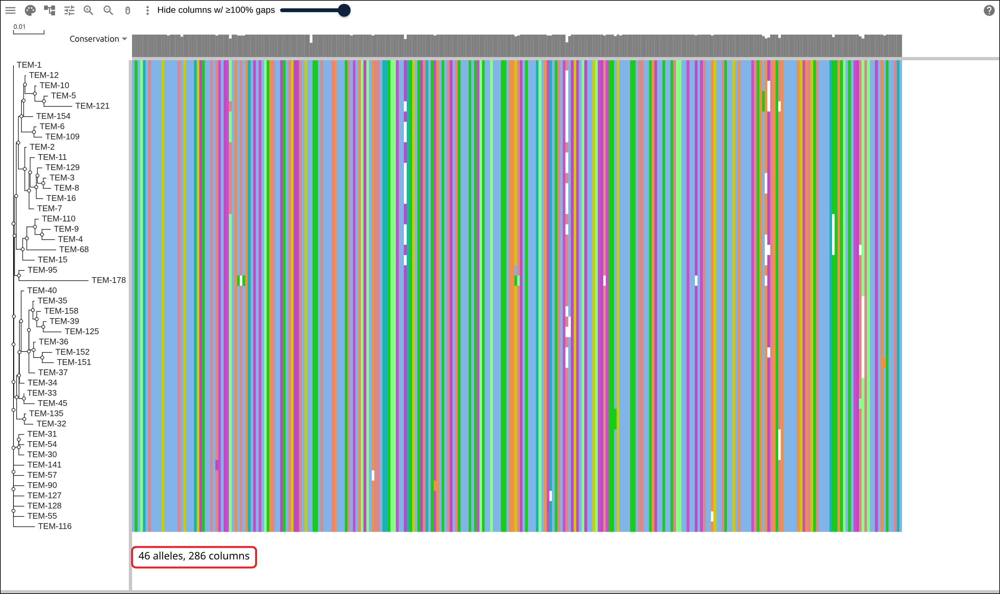
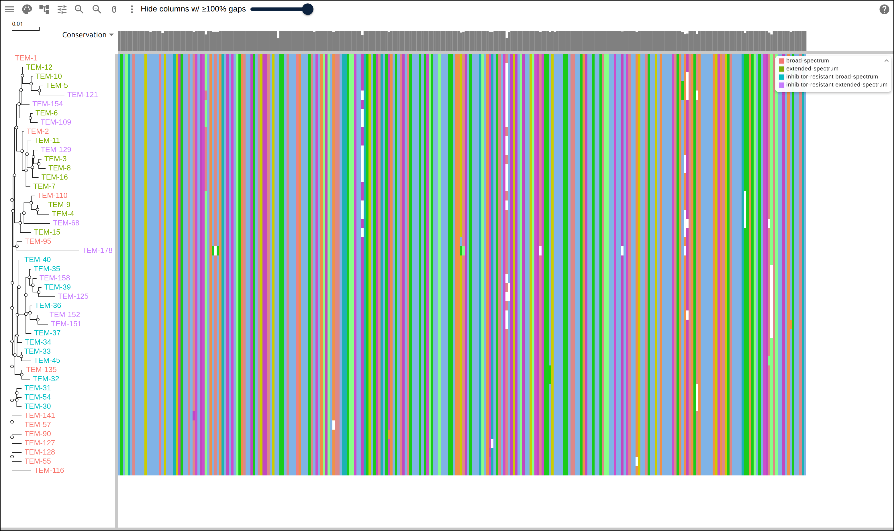
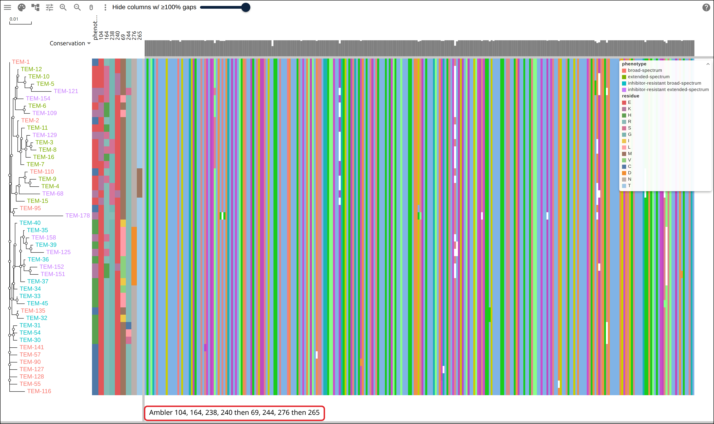
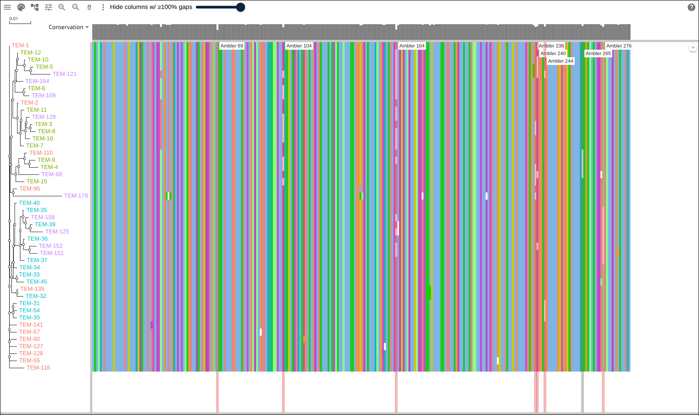
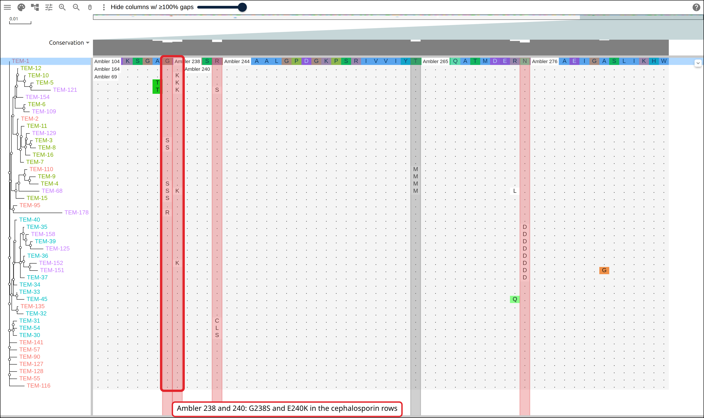
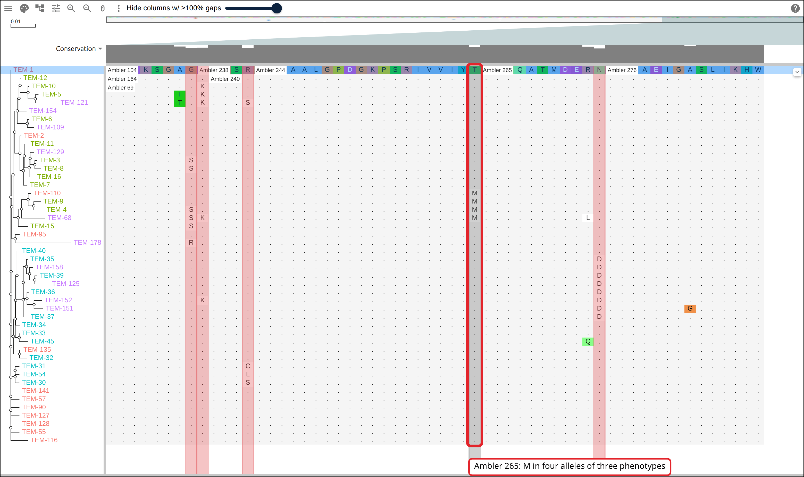
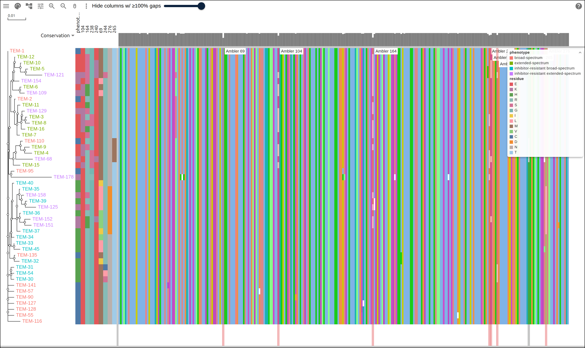

# TEM beta-lactamase alleles and what they hydrolyze

NCBI's Reference Gene Catalog names 233 TEM beta-lactamase alleles and records a
phenotype for many of them: broad-spectrum, extended-spectrum,
inhibitor-resistant broad-spectrum, and inhibitor-resistant extended-spectrum.
The proteins are 286 residues and differ from TEM-1 by a handful of
substitutions, so this page puts 46 of them in one alignment, gives each row the
catalog's phenotype and the residue it carries at seven positions the literature
names, and reads the two groups of positions against each other. The control is
a polymorphic position picked for being the least associated with phenotype of
any variable position in the data.

## Prerequisites

- `curl`
- ClustalW, `apt install clustalw` on Debian or Ubuntu, `brew install clustal-w`
  on macOS. ClustalW both aligns and infers a tree, so this page needs no other
  aligner.
- python3, standard library only

Every figure below links to the live view it captured.

## Where the data comes from

Two files of the AMRFinderPlus database, and four this page writes from them.

- the catalog, one row per allele with its phenotype and protein accession:
  https://ftp.ncbi.nlm.nih.gov/pathogen/Antimicrobial_resistance/AMRFinderPlus/database/latest/ReferenceGeneCatalog.txt
- the reference proteins the catalog's accessions point at:
  https://ftp.ncbi.nlm.nih.gov/pathogen/Antimicrobial_resistance/AMRFinderPlus/database/latest/AMRProt.fa
- the 46 selected alleles:
  https://gmod.org/JBrowseMSA/demo/data/tem/tem-alleles.tsv
- their alignment: https://gmod.org/JBrowseMSA/demo/data/tem/tem.afa
- its tree: https://gmod.org/JBrowseMSA/demo/data/tem/tem.nwk
- the row table: https://gmod.org/JBrowseMSA/demo/data/tem/tem-rowdata.json

## 1. Pick the alleles

The catalog's `product_name` carries the phenotype, and its `gene_family` column
is `blaTEM` for every TEM allele. The selection takes the twelve lowest-numbered
alleles of each phenotype, which are the ones described first and cited most:

```python
number = re.fullmatch(r'blaTEM-(\d+)', row['allele'])
phenotype = row['product_name'].split(' class A')[0]
if not number or phenotype not in PHENOTYPES:
    continue
candidates[phenotype].append((int(number.group(1)), row))
```

```
broad-spectrum: 16 alleles in the catalog, 12 kept
extended-spectrum: 83 alleles in the catalog, 12 kept
inhibitor-resistant broad-spectrum: 30 alleles in the catalog, 12 kept
inhibitor-resistant extended-spectrum: 10 alleles in the catalog, 10 kept
46 alleles selected, lengths 285 aa x 1, 286 aa x 45
```

The catalog holds 94 further TEM alleles whose product name is a plain
`class A beta-lactamase`, with no phenotype recorded, and the selection leaves
them out. The inhibitor-resistant extended-spectrum class has ten members in
all, so all ten are here.

## 2. Align and infer a tree

```bash
clustalw -INFILE=tem.fasta -ALIGN -TYPE=PROTEIN -OUTORDER=INPUT \
  -OUTPUT=FASTA -OUTFILE=tem.afa
clustalw -INFILE=tem.afa -TREE -TYPE=PROTEIN -OUTPUTTREE=phylip
tr -d '[:space:]' < tem.ph > tem.nwk
```

```
46 rows, 286 alignment columns
```

One column per residue of TEM-1: the only allele of another length is TEM-178,
at 285 residues, and its deletion is the alignment's one gap.

[](https://gmod.org/JBrowseMSA/demo/#data=%7B%22msaview%22%3A%7B%22type%22%3A%22MsaView%22%2C%22height%22%3A920%2C%22turnedOffTracks%22%3A%7B%22property-conservation%22%3Atrue%7D%2C%22treeAreaWidth%22%3A200%2C%22colWidth%22%3A4.2%2C%22rowHeight%22%3A16%2C%22drawLabels%22%3Atrue%2C%22colorSchemeName%22%3A%22clustalx_protein_dynamic%22%2C%22msaFilehandle%22%3A%7B%22uri%22%3A%22data%2Ftem%2Ftem.afa%22%7D%2C%22treeFilehandle%22%3A%7B%22uri%22%3A%22data%2Ftem%2Ftem.nwk%22%7D%7D%7D)

Forty-six alleles beside the tree ClustalW inferred from them. Each column draws
in one color because the rows agree on it; the white and off-color specks are
the 31 positions that vary.

## 3. The row table

Every row gets the phenotype the catalog records and the residue it carries at
the seven positions named below, keyed by row name, which is the allele name:

```python
record = {'phenotype': phenotype[row], 'subclass': subclass[row]}
for position in fields:
    record[f'Ambler {position}'] = aligned[row][ambler_column[position]]
```

```
wrote ./tem-rowdata.json: 46 rows, 10 fields, 11 kB
```

Eleven kilobytes percent-encode to more than 8,000 characters, so the snapshot
names the file instead, which keeps the link short, and the viewer fetches it at
startup:

```json
{
  "type": "MsaView",
  "msaFilehandle": { "uri": "https://example.org/tem.afa" },
  "treeFilehandle": { "uri": "https://example.org/tem.nwk" },
  "treeMetadataFilehandle": { "uri": "https://example.org/tem-rowdata.json" },
  "encodings": [{ "channel": "tipLabel", "field": "phenotype" }]
}
```

[](https://gmod.org/JBrowseMSA/demo/#data=%7B%22msaview%22%3A%7B%22type%22%3A%22MsaView%22%2C%22height%22%3A920%2C%22turnedOffTracks%22%3A%7B%22property-conservation%22%3Atrue%7D%2C%22treeAreaWidth%22%3A200%2C%22colWidth%22%3A4.2%2C%22rowHeight%22%3A16%2C%22drawLabels%22%3Atrue%2C%22colorSchemeName%22%3A%22clustalx_protein_dynamic%22%2C%22msaFilehandle%22%3A%7B%22uri%22%3A%22data%2Ftem%2Ftem.afa%22%7D%2C%22treeFilehandle%22%3A%7B%22uri%22%3A%22data%2Ftem%2Ftem.nwk%22%7D%2C%22treeMetadataFilehandle%22%3A%7B%22uri%22%3A%22data%2Ftem%2Ftem-rowdata.json%22%7D%2C%22encodings%22%3A%5B%7B%22channel%22%3A%22tipLabel%22%2C%22field%22%3A%22phenotype%22%7D%5D%7D%7D)

The `tipLabel` channel reading the phenotype field: olive for extended-spectrum,
cyan for inhibitor-resistant broad-spectrum, purple for inhibitor-resistant
extended-spectrum, salmon for broad-spectrum. The tree puts most of the olive
rows in the top half and most of the cyan rows in the bottom half, and 6 of its
44 internal nodes hold alleles of one phenotype.

## 4. Ambler numbering against the sequence index

The literature numbers class A beta-lactamases by Ambler's scheme, which starts
at 3, skips 239 and 253, and ends at 290 over a 286-residue protein. Ambler 238
is therefore residue 236 of the sequence, and reading a residue at index 238
lands two residues away with no error. The script maps every position through
the TEM-1 row and checks the result against the residues the reviews name for
TEM-1 before anything downstream uses it:

```python
found = {p: reference[ambler_column[p]] for p in sorted(TEM1_RESIDUES)}
wrong = {p: r for p, r in found.items() if r != TEM1_RESIDUES[p]}
if wrong:
    raise SystemExit(f'Ambler mapping is off: {wrong}')
```

```
TEM-1 residues at the named Ambler positions: 69M 70S 73K 104E 130S 164R 166E 234K 238G 240E 244R 276N
the mapping is Ambler = residue index + 2 up to 238, + 3 from 240 to 252, + 4 from 254
Ambler [104, 164, 238, 240, 69, 244, 276] are columns 102, 162, 236, 237, 67, 241, 272
```

M69, S70, K73, E104, S130, R164, E166, K234, G238, E240, R244 and N276 are the
residues TEM-1 carries in every review of the family, including the catalytic
S70 and K73 and the omega-loop E166, and all twelve come out where the mapping
says.

## 5. The positions as strips

Four positions carry the extended-spectrum substitutions (104, 164, 238, 240),
three carry the inhibitor-resistance ones (69, 244, 276), and the eighth is the
control of step 7. Each is a `strip` row panel over its field, and the eight
share one `legend` so the figure carries one residue key:

```json
"rowPanels": [
  { "kind": "strip", "field": "phenotype", "width": 14, "header": "phenotype" },
  { "kind": "strip", "field": "Ambler 104", "width": 12, "header": "104", "legend": "residue" }
]
```

[](https://gmod.org/JBrowseMSA/demo/#data=%7B%22msaview%22%3A%7B%22type%22%3A%22MsaView%22%2C%22height%22%3A920%2C%22turnedOffTracks%22%3A%7B%22property-conservation%22%3Atrue%7D%2C%22treeAreaWidth%22%3A200%2C%22colWidth%22%3A4.2%2C%22rowHeight%22%3A16%2C%22drawLabels%22%3Atrue%2C%22colorSchemeName%22%3A%22clustalx_protein_dynamic%22%2C%22msaFilehandle%22%3A%7B%22uri%22%3A%22data%2Ftem%2Ftem.afa%22%7D%2C%22treeFilehandle%22%3A%7B%22uri%22%3A%22data%2Ftem%2Ftem.nwk%22%7D%2C%22treeMetadataFilehandle%22%3A%7B%22uri%22%3A%22data%2Ftem%2Ftem-rowdata.json%22%7D%2C%22encodings%22%3A%5B%7B%22channel%22%3A%22tipLabel%22%2C%22field%22%3A%22phenotype%22%7D%5D%2C%22rowPanels%22%3A%5B%7B%22kind%22%3A%22strip%22%2C%22field%22%3A%22phenotype%22%2C%22scale%22%3A%7B%22map%22%3A%7B%22broad-spectrum%22%3A%22%234e79a7%22%2C%22extended-spectrum%22%3A%22%23e15759%22%2C%22inhibitor-resistant%20broad-spectrum%22%3A%22%2359a14f%22%2C%22inhibitor-resistant%20extended-spectrum%22%3A%22%23b07aa1%22%7D%7D%2C%22width%22%3A14%2C%22header%22%3A%22phenotype%22%7D%2C%7B%22kind%22%3A%22strip%22%2C%22field%22%3A%22Ambler%20104%22%2C%22scale%22%3A%7B%22map%22%3A%7B%22C%22%3A%22%234e79a7%22%2C%22D%22%3A%22%23f28e2b%22%2C%22E%22%3A%22%23e15759%22%2C%22G%22%3A%22%2376b7b2%22%2C%22H%22%3A%22%2359a14f%22%2C%22I%22%3A%22%23edc948%22%2C%22K%22%3A%22%23b07aa1%22%2C%22L%22%3A%22%23ff9da7%22%2C%22M%22%3A%22%239c755f%22%2C%22N%22%3A%22%23bab0ac%22%2C%22R%22%3A%22%2386bcb6%22%2C%22S%22%3A%22%23d37295%22%2C%22T%22%3A%22%23a0cbe8%22%2C%22V%22%3A%22%238cd17d%22%7D%7D%2C%22width%22%3A12%2C%22header%22%3A%22104%22%2C%22legend%22%3A%22residue%22%7D%2C%7B%22kind%22%3A%22strip%22%2C%22field%22%3A%22Ambler%20164%22%2C%22scale%22%3A%7B%22map%22%3A%7B%22C%22%3A%22%234e79a7%22%2C%22D%22%3A%22%23f28e2b%22%2C%22E%22%3A%22%23e15759%22%2C%22G%22%3A%22%2376b7b2%22%2C%22H%22%3A%22%2359a14f%22%2C%22I%22%3A%22%23edc948%22%2C%22K%22%3A%22%23b07aa1%22%2C%22L%22%3A%22%23ff9da7%22%2C%22M%22%3A%22%239c755f%22%2C%22N%22%3A%22%23bab0ac%22%2C%22R%22%3A%22%2386bcb6%22%2C%22S%22%3A%22%23d37295%22%2C%22T%22%3A%22%23a0cbe8%22%2C%22V%22%3A%22%238cd17d%22%7D%7D%2C%22width%22%3A12%2C%22header%22%3A%22164%22%2C%22legend%22%3A%22residue%22%7D%2C%7B%22kind%22%3A%22strip%22%2C%22field%22%3A%22Ambler%20238%22%2C%22scale%22%3A%7B%22map%22%3A%7B%22C%22%3A%22%234e79a7%22%2C%22D%22%3A%22%23f28e2b%22%2C%22E%22%3A%22%23e15759%22%2C%22G%22%3A%22%2376b7b2%22%2C%22H%22%3A%22%2359a14f%22%2C%22I%22%3A%22%23edc948%22%2C%22K%22%3A%22%23b07aa1%22%2C%22L%22%3A%22%23ff9da7%22%2C%22M%22%3A%22%239c755f%22%2C%22N%22%3A%22%23bab0ac%22%2C%22R%22%3A%22%2386bcb6%22%2C%22S%22%3A%22%23d37295%22%2C%22T%22%3A%22%23a0cbe8%22%2C%22V%22%3A%22%238cd17d%22%7D%7D%2C%22width%22%3A12%2C%22header%22%3A%22238%22%2C%22legend%22%3A%22residue%22%7D%2C%7B%22kind%22%3A%22strip%22%2C%22field%22%3A%22Ambler%20240%22%2C%22scale%22%3A%7B%22map%22%3A%7B%22C%22%3A%22%234e79a7%22%2C%22D%22%3A%22%23f28e2b%22%2C%22E%22%3A%22%23e15759%22%2C%22G%22%3A%22%2376b7b2%22%2C%22H%22%3A%22%2359a14f%22%2C%22I%22%3A%22%23edc948%22%2C%22K%22%3A%22%23b07aa1%22%2C%22L%22%3A%22%23ff9da7%22%2C%22M%22%3A%22%239c755f%22%2C%22N%22%3A%22%23bab0ac%22%2C%22R%22%3A%22%2386bcb6%22%2C%22S%22%3A%22%23d37295%22%2C%22T%22%3A%22%23a0cbe8%22%2C%22V%22%3A%22%238cd17d%22%7D%7D%2C%22width%22%3A12%2C%22header%22%3A%22240%22%2C%22legend%22%3A%22residue%22%7D%2C%7B%22kind%22%3A%22strip%22%2C%22field%22%3A%22Ambler%2069%22%2C%22scale%22%3A%7B%22map%22%3A%7B%22C%22%3A%22%234e79a7%22%2C%22D%22%3A%22%23f28e2b%22%2C%22E%22%3A%22%23e15759%22%2C%22G%22%3A%22%2376b7b2%22%2C%22H%22%3A%22%2359a14f%22%2C%22I%22%3A%22%23edc948%22%2C%22K%22%3A%22%23b07aa1%22%2C%22L%22%3A%22%23ff9da7%22%2C%22M%22%3A%22%239c755f%22%2C%22N%22%3A%22%23bab0ac%22%2C%22R%22%3A%22%2386bcb6%22%2C%22S%22%3A%22%23d37295%22%2C%22T%22%3A%22%23a0cbe8%22%2C%22V%22%3A%22%238cd17d%22%7D%7D%2C%22width%22%3A12%2C%22header%22%3A%2269%22%2C%22legend%22%3A%22residue%22%7D%2C%7B%22kind%22%3A%22strip%22%2C%22field%22%3A%22Ambler%20244%22%2C%22scale%22%3A%7B%22map%22%3A%7B%22C%22%3A%22%234e79a7%22%2C%22D%22%3A%22%23f28e2b%22%2C%22E%22%3A%22%23e15759%22%2C%22G%22%3A%22%2376b7b2%22%2C%22H%22%3A%22%2359a14f%22%2C%22I%22%3A%22%23edc948%22%2C%22K%22%3A%22%23b07aa1%22%2C%22L%22%3A%22%23ff9da7%22%2C%22M%22%3A%22%239c755f%22%2C%22N%22%3A%22%23bab0ac%22%2C%22R%22%3A%22%2386bcb6%22%2C%22S%22%3A%22%23d37295%22%2C%22T%22%3A%22%23a0cbe8%22%2C%22V%22%3A%22%238cd17d%22%7D%7D%2C%22width%22%3A12%2C%22header%22%3A%22244%22%2C%22legend%22%3A%22residue%22%7D%2C%7B%22kind%22%3A%22strip%22%2C%22field%22%3A%22Ambler%20276%22%2C%22scale%22%3A%7B%22map%22%3A%7B%22C%22%3A%22%234e79a7%22%2C%22D%22%3A%22%23f28e2b%22%2C%22E%22%3A%22%23e15759%22%2C%22G%22%3A%22%2376b7b2%22%2C%22H%22%3A%22%2359a14f%22%2C%22I%22%3A%22%23edc948%22%2C%22K%22%3A%22%23b07aa1%22%2C%22L%22%3A%22%23ff9da7%22%2C%22M%22%3A%22%239c755f%22%2C%22N%22%3A%22%23bab0ac%22%2C%22R%22%3A%22%2386bcb6%22%2C%22S%22%3A%22%23d37295%22%2C%22T%22%3A%22%23a0cbe8%22%2C%22V%22%3A%22%238cd17d%22%7D%7D%2C%22width%22%3A12%2C%22header%22%3A%22276%22%2C%22legend%22%3A%22residue%22%7D%2C%7B%22kind%22%3A%22strip%22%2C%22field%22%3A%22Ambler%20265%22%2C%22scale%22%3A%7B%22map%22%3A%7B%22C%22%3A%22%234e79a7%22%2C%22D%22%3A%22%23f28e2b%22%2C%22E%22%3A%22%23e15759%22%2C%22G%22%3A%22%2376b7b2%22%2C%22H%22%3A%22%2359a14f%22%2C%22I%22%3A%22%23edc948%22%2C%22K%22%3A%22%23b07aa1%22%2C%22L%22%3A%22%23ff9da7%22%2C%22M%22%3A%22%239c755f%22%2C%22N%22%3A%22%23bab0ac%22%2C%22R%22%3A%22%2386bcb6%22%2C%22S%22%3A%22%23d37295%22%2C%22T%22%3A%22%23a0cbe8%22%2C%22V%22%3A%22%238cd17d%22%7D%7D%2C%22width%22%3A12%2C%22header%22%3A%22265%22%2C%22legend%22%3A%22residue%22%7D%5D%7D%7D)

The phenotype strip and the eight position strips between the tree and the
alignment, in the order 104, 164, 238, 240, then 69, 244, 276, then 265. The
rows whose phenotype cell is olive or purple carry a minority residue in the
first four columns; the rows whose cell is cyan carry one in the next three.

```
Ambler 104: E 36, K 10
Ambler 164: R 29, S 11, H 6
Ambler 238: G 40, S 5, R 1
Ambler 240: E 41, K 5
Ambler 69: M 31, L 8, V 4, I 3
Ambler 244: R 42, S 2, C 1, L 1
Ambler 276: N 38, D 8
Ambler 265: T 42, M 4
```

## 6. The two groups of positions

For each allele, whether it differs from TEM-1 at any of the four
extended-spectrum positions, and at any of the three inhibitor-resistance ones:

```
ESBL positions 104/164/238/240: broad-spectrum 0/12, extended-spectrum 12/12, inhibitor-resistant broad-spectrum 0/12, inhibitor-resistant extended-spectrum 10/10
inhibitor positions 69/244/276: broad-spectrum 0/12, extended-spectrum 0/12, inhibitor-resistant broad-spectrum 12/12, inhibitor-resistant extended-spectrum 7/10
```

All 22 alleles the catalog calls extended-spectrum carry a substitution at 104,
164, 238 or 240, and the 12 broad-spectrum and 12 inhibitor-resistant
broad-spectrum alleles carry none. The three inhibitor-resistance positions
split the other way: every inhibitor-resistant broad-spectrum allele is
substituted at one of them, and no extended-spectrum allele is.

The same positions are bands over the alignment columns, which is what
`highlights` draws. A band with no `row` takes 1-based alignment columns, so
Ambler 238 is `start: 236`:

```json
"highlights": [{ "start": 236, "end": 236, "label": "Ambler 238" }]
```

[](<https://gmod.org/JBrowseMSA/demo/#data=%7B%22msaview%22%3A%7B%22type%22%3A%22MsaView%22%2C%22height%22%3A920%2C%22turnedOffTracks%22%3A%7B%22property-conservation%22%3Atrue%7D%2C%22treeAreaWidth%22%3A200%2C%22colWidth%22%3A4.2%2C%22rowHeight%22%3A16%2C%22drawLabels%22%3Atrue%2C%22colorSchemeName%22%3A%22clustalx_protein_dynamic%22%2C%22msaFilehandle%22%3A%7B%22uri%22%3A%22data%2Ftem%2Ftem.afa%22%7D%2C%22treeFilehandle%22%3A%7B%22uri%22%3A%22data%2Ftem%2Ftem.nwk%22%7D%2C%22treeMetadataFilehandle%22%3A%7B%22uri%22%3A%22data%2Ftem%2Ftem-rowdata.json%22%7D%2C%22encodings%22%3A%5B%7B%22channel%22%3A%22tipLabel%22%2C%22field%22%3A%22phenotype%22%7D%5D%2C%22highlights%22%3A%5B%7B%22start%22%3A102%2C%22end%22%3A102%2C%22label%22%3A%22Ambler%20104%22%2C%22color%22%3A%22rgba(225%2C87%2C89%2C0.35)%22%7D%2C%7B%22start%22%3A162%2C%22end%22%3A162%2C%22label%22%3A%22Ambler%20164%22%2C%22color%22%3A%22rgba(225%2C87%2C89%2C0.35)%22%7D%2C%7B%22start%22%3A236%2C%22end%22%3A236%2C%22label%22%3A%22Ambler%20238%22%2C%22color%22%3A%22rgba(225%2C87%2C89%2C0.35)%22%7D%2C%7B%22start%22%3A237%2C%22end%22%3A237%2C%22label%22%3A%22Ambler%20240%22%2C%22color%22%3A%22rgba(225%2C87%2C89%2C0.35)%22%7D%2C%7B%22start%22%3A67%2C%22end%22%3A67%2C%22label%22%3A%22Ambler%2069%22%2C%22color%22%3A%22rgba(225%2C87%2C89%2C0.35)%22%7D%2C%7B%22start%22%3A241%2C%22end%22%3A241%2C%22label%22%3A%22Ambler%20244%22%2C%22color%22%3A%22rgba(225%2C87%2C89%2C0.35)%22%7D%2C%7B%22start%22%3A272%2C%22end%22%3A272%2C%22label%22%3A%22Ambler%20276%22%2C%22color%22%3A%22rgba(225%2C87%2C89%2C0.35)%22%7D%2C%7B%22start%22%3A261%2C%22end%22%3A261%2C%22label%22%3A%22Ambler%20265%22%2C%22color%22%3A%22rgba(120%2C120%2C120%2C0.35)%22%7D%5D%2C%22showDomainLegend%22%3Afalse%7D%7D>)

Eight bands over the 286 columns, seven red and the control grey, each labeled
with its Ambler position.

[](<https://gmod.org/JBrowseMSA/demo/#data=%7B%22msaview%22%3A%7B%22type%22%3A%22MsaView%22%2C%22height%22%3A920%2C%22turnedOffTracks%22%3A%7B%22property-conservation%22%3Atrue%7D%2C%22treeAreaWidth%22%3A200%2C%22colWidth%22%3A22%2C%22rowHeight%22%3A16%2C%22drawLabels%22%3Atrue%2C%22colorSchemeName%22%3A%22clustalx_protein_dynamic%22%2C%22msaFilehandle%22%3A%7B%22uri%22%3A%22data%2Ftem%2Ftem.afa%22%7D%2C%22treeFilehandle%22%3A%7B%22uri%22%3A%22data%2Ftem%2Ftem.nwk%22%7D%2C%22scrollX%22%3A-5016%2C%22relativeTo%22%3A%22TEM-1%22%2C%22treeMetadataFilehandle%22%3A%7B%22uri%22%3A%22data%2Ftem%2Ftem-rowdata.json%22%7D%2C%22encodings%22%3A%5B%7B%22channel%22%3A%22tipLabel%22%2C%22field%22%3A%22phenotype%22%7D%5D%2C%22highlights%22%3A%5B%7B%22start%22%3A102%2C%22end%22%3A102%2C%22label%22%3A%22Ambler%20104%22%2C%22color%22%3A%22rgba(225%2C87%2C89%2C0.35)%22%7D%2C%7B%22start%22%3A162%2C%22end%22%3A162%2C%22label%22%3A%22Ambler%20164%22%2C%22color%22%3A%22rgba(225%2C87%2C89%2C0.35)%22%7D%2C%7B%22start%22%3A236%2C%22end%22%3A236%2C%22label%22%3A%22Ambler%20238%22%2C%22color%22%3A%22rgba(225%2C87%2C89%2C0.35)%22%7D%2C%7B%22start%22%3A237%2C%22end%22%3A237%2C%22label%22%3A%22Ambler%20240%22%2C%22color%22%3A%22rgba(225%2C87%2C89%2C0.35)%22%7D%2C%7B%22start%22%3A67%2C%22end%22%3A67%2C%22label%22%3A%22Ambler%2069%22%2C%22color%22%3A%22rgba(225%2C87%2C89%2C0.35)%22%7D%2C%7B%22start%22%3A241%2C%22end%22%3A241%2C%22label%22%3A%22Ambler%20244%22%2C%22color%22%3A%22rgba(225%2C87%2C89%2C0.35)%22%7D%2C%7B%22start%22%3A272%2C%22end%22%3A272%2C%22label%22%3A%22Ambler%20276%22%2C%22color%22%3A%22rgba(225%2C87%2C89%2C0.35)%22%7D%2C%7B%22start%22%3A261%2C%22end%22%3A261%2C%22label%22%3A%22Ambler%20265%22%2C%22color%22%3A%22rgba(120%2C120%2C120%2C0.35)%22%7D%5D%2C%22showDomainLegend%22%3Afalse%7D%7D>)

Ambler 238 and 240 at residue resolution with every row read against TEM-1, so a
dot is the same residue and a letter a different one. The boxed columns read S
and K in olive and purple rows and a dot in every salmon and cyan row. Ambler
244, eleven columns to the right, reads C, L and S in cyan rows alone.

## 7. The control

For every variable position, how its residues split across the four phenotypes,
scored by Cramer's V over the residue-by-phenotype table:

```
position  residues                  Cramer's V
     104  36E,10K                         0.60
     164  29R,11S,6H                      0.57
     276  38N,8D                          0.48
      69  31M,8L,4V,3I                    0.47
      39  38Q,8K                          0.42
     240  41E,5K                          0.39
     238  40G,5S,1R                       0.37
     ...
     265  42T,4M                          0.22
```

The control is the lowest-scoring position whose minor residues at least three
alleles carry, so the column has something to read:

```
control position: Ambler 265, T in TEM-1, minor residues in 4 alleles, Cramer's V 0.22
```

[](<https://gmod.org/JBrowseMSA/demo/#data=%7B%22msaview%22%3A%7B%22type%22%3A%22MsaView%22%2C%22height%22%3A920%2C%22turnedOffTracks%22%3A%7B%22property-conservation%22%3Atrue%7D%2C%22treeAreaWidth%22%3A200%2C%22colWidth%22%3A22%2C%22rowHeight%22%3A16%2C%22drawLabels%22%3Atrue%2C%22colorSchemeName%22%3A%22clustalx_protein_dynamic%22%2C%22msaFilehandle%22%3A%7B%22uri%22%3A%22data%2Ftem%2Ftem.afa%22%7D%2C%22treeFilehandle%22%3A%7B%22uri%22%3A%22data%2Ftem%2Ftem.nwk%22%7D%2C%22scrollX%22%3A-5016%2C%22relativeTo%22%3A%22TEM-1%22%2C%22treeMetadataFilehandle%22%3A%7B%22uri%22%3A%22data%2Ftem%2Ftem-rowdata.json%22%7D%2C%22encodings%22%3A%5B%7B%22channel%22%3A%22tipLabel%22%2C%22field%22%3A%22phenotype%22%7D%5D%2C%22highlights%22%3A%5B%7B%22start%22%3A102%2C%22end%22%3A102%2C%22label%22%3A%22Ambler%20104%22%2C%22color%22%3A%22rgba(225%2C87%2C89%2C0.35)%22%7D%2C%7B%22start%22%3A162%2C%22end%22%3A162%2C%22label%22%3A%22Ambler%20164%22%2C%22color%22%3A%22rgba(225%2C87%2C89%2C0.35)%22%7D%2C%7B%22start%22%3A236%2C%22end%22%3A236%2C%22label%22%3A%22Ambler%20238%22%2C%22color%22%3A%22rgba(225%2C87%2C89%2C0.35)%22%7D%2C%7B%22start%22%3A237%2C%22end%22%3A237%2C%22label%22%3A%22Ambler%20240%22%2C%22color%22%3A%22rgba(225%2C87%2C89%2C0.35)%22%7D%2C%7B%22start%22%3A67%2C%22end%22%3A67%2C%22label%22%3A%22Ambler%2069%22%2C%22color%22%3A%22rgba(225%2C87%2C89%2C0.35)%22%7D%2C%7B%22start%22%3A241%2C%22end%22%3A241%2C%22label%22%3A%22Ambler%20244%22%2C%22color%22%3A%22rgba(225%2C87%2C89%2C0.35)%22%7D%2C%7B%22start%22%3A272%2C%22end%22%3A272%2C%22label%22%3A%22Ambler%20276%22%2C%22color%22%3A%22rgba(225%2C87%2C89%2C0.35)%22%7D%2C%7B%22start%22%3A261%2C%22end%22%3A261%2C%22label%22%3A%22Ambler%20265%22%2C%22color%22%3A%22rgba(120%2C120%2C120%2C0.35)%22%7D%5D%2C%22showDomainLegend%22%3Afalse%7D%7D>)

Ambler 265 at the same resolution as the figure above. The four alleles reading
M are TEM-110, TEM-9, TEM-4 and TEM-68, whose phenotypes are broad-spectrum,
extended-spectrum, extended-spectrum and inhibitor-resistant extended-spectrum.

Ambler 39 scores 0.42, between the two groups. Q39K is the one substitution
separating TEM-2 from TEM-1, and both are broad-spectrum; the eight alleles
carrying K here are one broad-spectrum, five extended-spectrum and two
inhibitor-resistant extended-spectrum.

## 8. Check it against the raw data

The check reads the letters out of the unaligned NCBI sequences by the Ambler
arithmetic alone and compares them with the row table the viewer loads:

```python
letters = [unaligned[row][residue_of_ambler[p]] for p in fields]
from_table = [table[row][f'Ambler {p}'] for p in fields]
if letters != from_table:
    raise SystemExit(f'{row}: the FASTA reads {letters}, the row table {from_table}')
```

```
allele     104  164  238  240   69  244  276  265  phenotype
TEM-1        E    R    G    E    M    R    N    T  broad-spectrum
TEM-2        E    R    G    E    M    R    N    T  broad-spectrum
TEM-3        K    R    S    E    M    R    N    T  extended-spectrum
TEM-10       E    S    G    K    M    R    N    T  extended-spectrum
TEM-12       E    S    G    E    M    R    N    T  extended-spectrum
TEM-30       E    R    G    E    M    S    N    T  inhibitor-resistant broad-spectrum
TEM-32       E    R    G    E    I    R    N    T  inhibitor-resistant broad-spectrum
TEM-125      E    S    G    E    L    R    D    T  inhibitor-resistant extended-spectrum
```

TEM-3 reads E104K and G238S, TEM-10 reads R164S and E240K, TEM-12 reads R164S,
TEM-30 reads R244S, TEM-32 reads M69I, and TEM-125 reads R164S with M69L and
N276D. Those are the substitutions the primary literature gives for each allele.

## 9. Open the whole thing

[](<https://gmod.org/JBrowseMSA/demo/#data=%7B%22msaview%22%3A%7B%22type%22%3A%22MsaView%22%2C%22height%22%3A920%2C%22turnedOffTracks%22%3A%7B%22property-conservation%22%3Atrue%7D%2C%22treeAreaWidth%22%3A200%2C%22colWidth%22%3A4.2%2C%22rowHeight%22%3A16%2C%22drawLabels%22%3Atrue%2C%22colorSchemeName%22%3A%22clustalx_protein_dynamic%22%2C%22msaFilehandle%22%3A%7B%22uri%22%3A%22data%2Ftem%2Ftem.afa%22%7D%2C%22treeFilehandle%22%3A%7B%22uri%22%3A%22data%2Ftem%2Ftem.nwk%22%7D%2C%22treeMetadataFilehandle%22%3A%7B%22uri%22%3A%22data%2Ftem%2Ftem-rowdata.json%22%7D%2C%22encodings%22%3A%5B%7B%22channel%22%3A%22tipLabel%22%2C%22field%22%3A%22phenotype%22%7D%5D%2C%22rowPanels%22%3A%5B%7B%22kind%22%3A%22strip%22%2C%22field%22%3A%22phenotype%22%2C%22scale%22%3A%7B%22map%22%3A%7B%22broad-spectrum%22%3A%22%234e79a7%22%2C%22extended-spectrum%22%3A%22%23e15759%22%2C%22inhibitor-resistant%20broad-spectrum%22%3A%22%2359a14f%22%2C%22inhibitor-resistant%20extended-spectrum%22%3A%22%23b07aa1%22%7D%7D%2C%22width%22%3A14%2C%22header%22%3A%22phenotype%22%7D%2C%7B%22kind%22%3A%22strip%22%2C%22field%22%3A%22Ambler%20104%22%2C%22scale%22%3A%7B%22map%22%3A%7B%22C%22%3A%22%234e79a7%22%2C%22D%22%3A%22%23f28e2b%22%2C%22E%22%3A%22%23e15759%22%2C%22G%22%3A%22%2376b7b2%22%2C%22H%22%3A%22%2359a14f%22%2C%22I%22%3A%22%23edc948%22%2C%22K%22%3A%22%23b07aa1%22%2C%22L%22%3A%22%23ff9da7%22%2C%22M%22%3A%22%239c755f%22%2C%22N%22%3A%22%23bab0ac%22%2C%22R%22%3A%22%2386bcb6%22%2C%22S%22%3A%22%23d37295%22%2C%22T%22%3A%22%23a0cbe8%22%2C%22V%22%3A%22%238cd17d%22%7D%7D%2C%22width%22%3A12%2C%22header%22%3A%22104%22%2C%22legend%22%3A%22residue%22%7D%2C%7B%22kind%22%3A%22strip%22%2C%22field%22%3A%22Ambler%20164%22%2C%22scale%22%3A%7B%22map%22%3A%7B%22C%22%3A%22%234e79a7%22%2C%22D%22%3A%22%23f28e2b%22%2C%22E%22%3A%22%23e15759%22%2C%22G%22%3A%22%2376b7b2%22%2C%22H%22%3A%22%2359a14f%22%2C%22I%22%3A%22%23edc948%22%2C%22K%22%3A%22%23b07aa1%22%2C%22L%22%3A%22%23ff9da7%22%2C%22M%22%3A%22%239c755f%22%2C%22N%22%3A%22%23bab0ac%22%2C%22R%22%3A%22%2386bcb6%22%2C%22S%22%3A%22%23d37295%22%2C%22T%22%3A%22%23a0cbe8%22%2C%22V%22%3A%22%238cd17d%22%7D%7D%2C%22width%22%3A12%2C%22header%22%3A%22164%22%2C%22legend%22%3A%22residue%22%7D%2C%7B%22kind%22%3A%22strip%22%2C%22field%22%3A%22Ambler%20238%22%2C%22scale%22%3A%7B%22map%22%3A%7B%22C%22%3A%22%234e79a7%22%2C%22D%22%3A%22%23f28e2b%22%2C%22E%22%3A%22%23e15759%22%2C%22G%22%3A%22%2376b7b2%22%2C%22H%22%3A%22%2359a14f%22%2C%22I%22%3A%22%23edc948%22%2C%22K%22%3A%22%23b07aa1%22%2C%22L%22%3A%22%23ff9da7%22%2C%22M%22%3A%22%239c755f%22%2C%22N%22%3A%22%23bab0ac%22%2C%22R%22%3A%22%2386bcb6%22%2C%22S%22%3A%22%23d37295%22%2C%22T%22%3A%22%23a0cbe8%22%2C%22V%22%3A%22%238cd17d%22%7D%7D%2C%22width%22%3A12%2C%22header%22%3A%22238%22%2C%22legend%22%3A%22residue%22%7D%2C%7B%22kind%22%3A%22strip%22%2C%22field%22%3A%22Ambler%20240%22%2C%22scale%22%3A%7B%22map%22%3A%7B%22C%22%3A%22%234e79a7%22%2C%22D%22%3A%22%23f28e2b%22%2C%22E%22%3A%22%23e15759%22%2C%22G%22%3A%22%2376b7b2%22%2C%22H%22%3A%22%2359a14f%22%2C%22I%22%3A%22%23edc948%22%2C%22K%22%3A%22%23b07aa1%22%2C%22L%22%3A%22%23ff9da7%22%2C%22M%22%3A%22%239c755f%22%2C%22N%22%3A%22%23bab0ac%22%2C%22R%22%3A%22%2386bcb6%22%2C%22S%22%3A%22%23d37295%22%2C%22T%22%3A%22%23a0cbe8%22%2C%22V%22%3A%22%238cd17d%22%7D%7D%2C%22width%22%3A12%2C%22header%22%3A%22240%22%2C%22legend%22%3A%22residue%22%7D%2C%7B%22kind%22%3A%22strip%22%2C%22field%22%3A%22Ambler%2069%22%2C%22scale%22%3A%7B%22map%22%3A%7B%22C%22%3A%22%234e79a7%22%2C%22D%22%3A%22%23f28e2b%22%2C%22E%22%3A%22%23e15759%22%2C%22G%22%3A%22%2376b7b2%22%2C%22H%22%3A%22%2359a14f%22%2C%22I%22%3A%22%23edc948%22%2C%22K%22%3A%22%23b07aa1%22%2C%22L%22%3A%22%23ff9da7%22%2C%22M%22%3A%22%239c755f%22%2C%22N%22%3A%22%23bab0ac%22%2C%22R%22%3A%22%2386bcb6%22%2C%22S%22%3A%22%23d37295%22%2C%22T%22%3A%22%23a0cbe8%22%2C%22V%22%3A%22%238cd17d%22%7D%7D%2C%22width%22%3A12%2C%22header%22%3A%2269%22%2C%22legend%22%3A%22residue%22%7D%2C%7B%22kind%22%3A%22strip%22%2C%22field%22%3A%22Ambler%20244%22%2C%22scale%22%3A%7B%22map%22%3A%7B%22C%22%3A%22%234e79a7%22%2C%22D%22%3A%22%23f28e2b%22%2C%22E%22%3A%22%23e15759%22%2C%22G%22%3A%22%2376b7b2%22%2C%22H%22%3A%22%2359a14f%22%2C%22I%22%3A%22%23edc948%22%2C%22K%22%3A%22%23b07aa1%22%2C%22L%22%3A%22%23ff9da7%22%2C%22M%22%3A%22%239c755f%22%2C%22N%22%3A%22%23bab0ac%22%2C%22R%22%3A%22%2386bcb6%22%2C%22S%22%3A%22%23d37295%22%2C%22T%22%3A%22%23a0cbe8%22%2C%22V%22%3A%22%238cd17d%22%7D%7D%2C%22width%22%3A12%2C%22header%22%3A%22244%22%2C%22legend%22%3A%22residue%22%7D%2C%7B%22kind%22%3A%22strip%22%2C%22field%22%3A%22Ambler%20276%22%2C%22scale%22%3A%7B%22map%22%3A%7B%22C%22%3A%22%234e79a7%22%2C%22D%22%3A%22%23f28e2b%22%2C%22E%22%3A%22%23e15759%22%2C%22G%22%3A%22%2376b7b2%22%2C%22H%22%3A%22%2359a14f%22%2C%22I%22%3A%22%23edc948%22%2C%22K%22%3A%22%23b07aa1%22%2C%22L%22%3A%22%23ff9da7%22%2C%22M%22%3A%22%239c755f%22%2C%22N%22%3A%22%23bab0ac%22%2C%22R%22%3A%22%2386bcb6%22%2C%22S%22%3A%22%23d37295%22%2C%22T%22%3A%22%23a0cbe8%22%2C%22V%22%3A%22%238cd17d%22%7D%7D%2C%22width%22%3A12%2C%22header%22%3A%22276%22%2C%22legend%22%3A%22residue%22%7D%2C%7B%22kind%22%3A%22strip%22%2C%22field%22%3A%22Ambler%20265%22%2C%22scale%22%3A%7B%22map%22%3A%7B%22C%22%3A%22%234e79a7%22%2C%22D%22%3A%22%23f28e2b%22%2C%22E%22%3A%22%23e15759%22%2C%22G%22%3A%22%2376b7b2%22%2C%22H%22%3A%22%2359a14f%22%2C%22I%22%3A%22%23edc948%22%2C%22K%22%3A%22%23b07aa1%22%2C%22L%22%3A%22%23ff9da7%22%2C%22M%22%3A%22%239c755f%22%2C%22N%22%3A%22%23bab0ac%22%2C%22R%22%3A%22%2386bcb6%22%2C%22S%22%3A%22%23d37295%22%2C%22T%22%3A%22%23a0cbe8%22%2C%22V%22%3A%22%238cd17d%22%7D%7D%2C%22width%22%3A12%2C%22header%22%3A%22265%22%2C%22legend%22%3A%22residue%22%7D%5D%2C%22highlights%22%3A%5B%7B%22start%22%3A102%2C%22end%22%3A102%2C%22label%22%3A%22Ambler%20104%22%2C%22color%22%3A%22rgba(225%2C87%2C89%2C0.35)%22%7D%2C%7B%22start%22%3A162%2C%22end%22%3A162%2C%22label%22%3A%22Ambler%20164%22%2C%22color%22%3A%22rgba(225%2C87%2C89%2C0.35)%22%7D%2C%7B%22start%22%3A236%2C%22end%22%3A236%2C%22label%22%3A%22Ambler%20238%22%2C%22color%22%3A%22rgba(225%2C87%2C89%2C0.35)%22%7D%2C%7B%22start%22%3A237%2C%22end%22%3A237%2C%22label%22%3A%22Ambler%20240%22%2C%22color%22%3A%22rgba(225%2C87%2C89%2C0.35)%22%7D%2C%7B%22start%22%3A67%2C%22end%22%3A67%2C%22label%22%3A%22Ambler%2069%22%2C%22color%22%3A%22rgba(225%2C87%2C89%2C0.35)%22%7D%2C%7B%22start%22%3A241%2C%22end%22%3A241%2C%22label%22%3A%22Ambler%20244%22%2C%22color%22%3A%22rgba(225%2C87%2C89%2C0.35)%22%7D%2C%7B%22start%22%3A272%2C%22end%22%3A272%2C%22label%22%3A%22Ambler%20276%22%2C%22color%22%3A%22rgba(225%2C87%2C89%2C0.35)%22%7D%2C%7B%22start%22%3A261%2C%22end%22%3A261%2C%22label%22%3A%22Ambler%20265%22%2C%22color%22%3A%22rgba(120%2C120%2C120%2C0.35)%22%7D%5D%7D%7D>)

The three hosted files, the `tipLabel` encoding, the nine strips and the eight
bands in one view.

## Reproduce it end to end

```bash
curl -O https://raw.githubusercontent.com/GMOD/JBrowseMSA/main/docs/tutorials/scripts/build_tem_alleles.sh
bash build_tem_alleles.sh
```

The script downloads the catalog and the reference proteins, selects the
alleles, aligns them, infers the tree, writes the row table and prints every
number on this page.

## See also

- [Data layers](https://gmod.org/JBrowseMSA/layers)
- [Coloring an RSV phylogeny by its metadata](https://gmod.org/JBrowseMSA/tutorials/phylogeny_metadata)
- [An H5N1 surveillance figure](https://gmod.org/JBrowseMSA/tutorials/influenza_surveillance_figure)
- [User guide](https://gmod.org/JBrowseMSA/guide)

## References

- Feldgarden M, Brover V, Gonzalez-Escalona N, et al. AMRFinderPlus and the
  Reference Gene Catalog facilitate examination of the genomic links among
  antimicrobial resistance, stress response, and virulence. _Sci Rep_ 11:12728.
- Ambler RP, Coulson AF, Frere JM, et al. A standard numbering scheme for the
  class A beta-lactamases. _Biochem J_ 276:269-270.
- Bradford PA. Extended-spectrum beta-lactamases in the 21st century. _Clin
  Microbiol Rev_ 14:933-951.
- Cantón R, Morosini MI, de la Maza OM, de la Pedrosa EG. IRT and CMT
  beta-lactamases and inhibitor resistance. _Clin Microbiol Infect_ 14 Suppl
  1:53-62.
- Salverda ML, De Visser JA, Barlow M. Natural evolution of TEM-1
  beta-lactamase: experimental reconstruction and clinical relevance. _FEMS
  Microbiol Rev_ 34:1015-1036.
