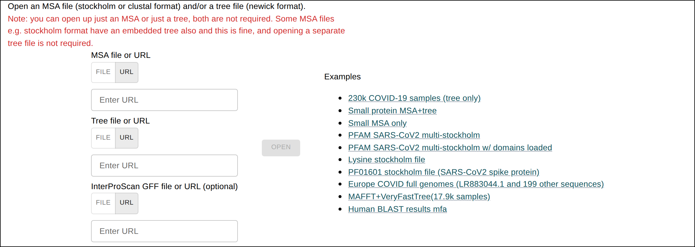
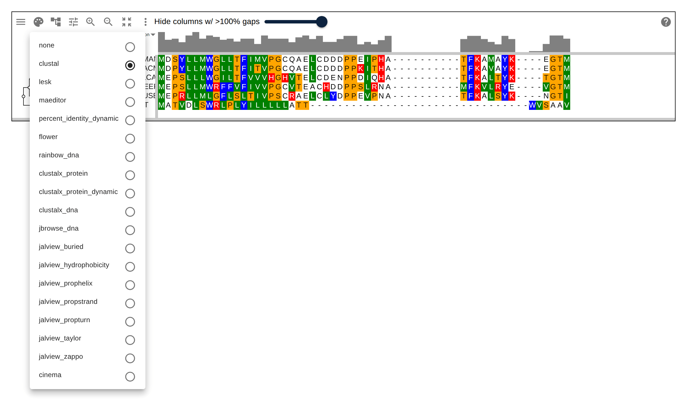
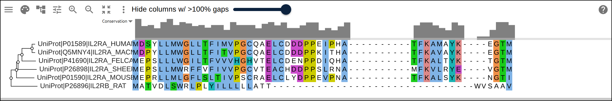
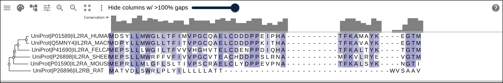
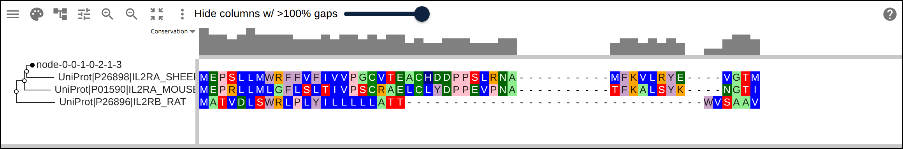
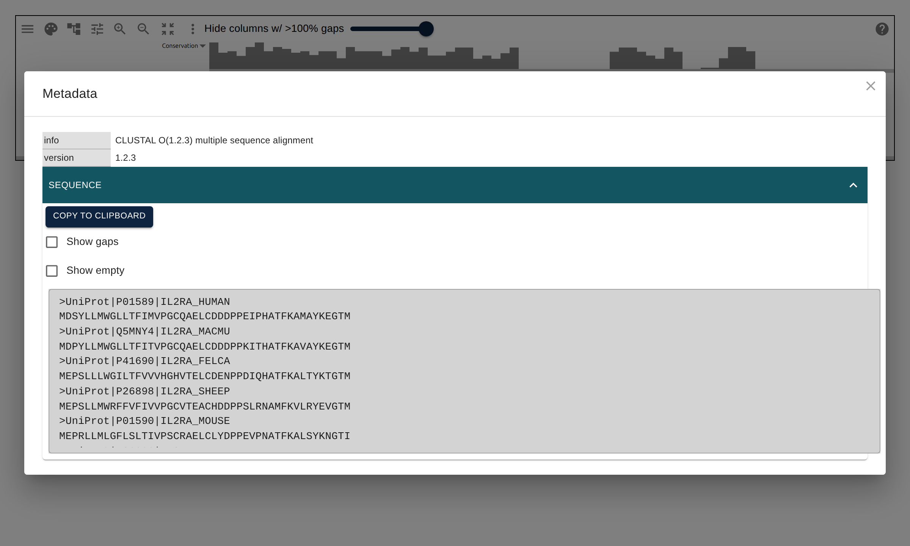
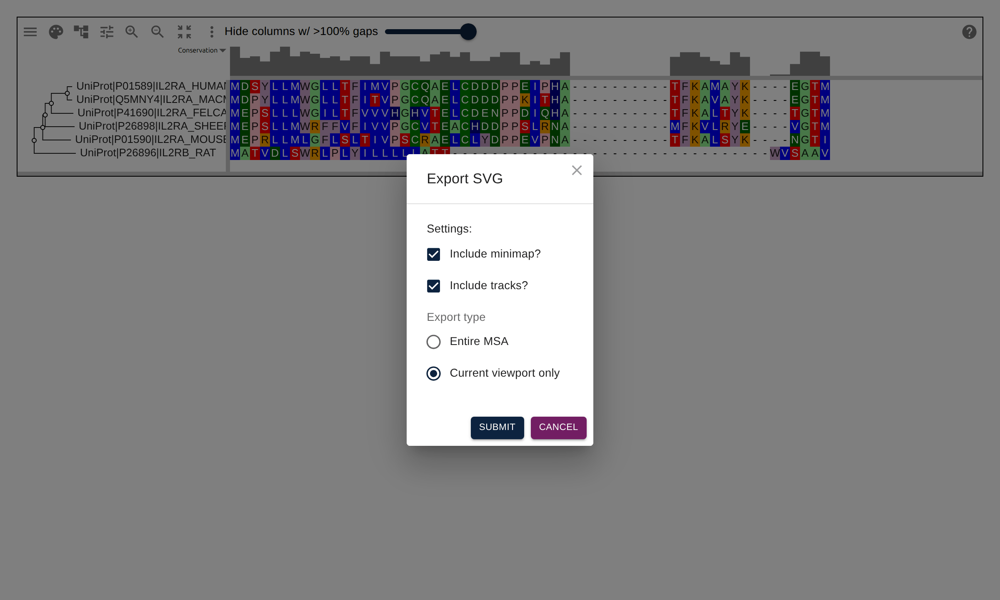

# JBrowseMSA user guide

JBrowseMSA (the `react-msaview` package) is an interactive multiple sequence
alignment viewer that runs entirely in the browser. It renders a phylogenetic
tree alongside a protein or nucleotide alignment on HTML5 canvas, using tiled
scrolling so it stays responsive on very large inputs (it can render the 230k-
node UCSC SARS-CoV-2 sample tree). Nothing is uploaded — your data is parsed and
drawn locally.

This guide tours the [live app](https://gmod.org/JBrowseMSA/demo/). **Every
figure below links to a live version of the app** loaded into that exact state
via the `?data=` URL parameter — click any screenshot to open and explore it
yourself. To embed the viewer in your own React/HTML/R code instead, see the
[embedding guide](https://gmod.org/JBrowseMSA/embedding).

## Getting started

Open the app and you land on the **import form**.

[][live-import-form]

The import form, with preloaded examples — a 230k-node COVID tree from UCSC,
CLUSTAL-formatted alignments, RNA and protein Stockholm files, and a large
tree+MSA generated by MAFFT. Click any example to load it, or supply your own
data with the file/URL/paste inputs below.

You can load an alignment on its own, a tree on its own, or both together. When
both are present, rows are ordered and connected to match the tree.

## Loading your own data

The import form accepts a pasted string, a local file, or a remote URL for each
of the alignment, the tree, and (optionally) a domain-annotation track.

| Input         | Formats                                                                                                                             |
| ------------- | ----------------------------------------------------------------------------------------------------------------------------------- |
| **Alignment** | FASTA (gaps already inserted), Stockholm (`.stock`, single or multi-alignment, may embed a tree and SS), Clustal (`.aln`), A3M, EMF |
| **Tree**      | Newick (`.nh`), or the tree embedded in a Stockholm/EMF file                                                                        |
| **Domains**   | InterProScan GFF3 (generate it with the [CLI](https://github.com/GMOD/JBrowseMSA/tree/main/packages/cli))                           |

Stockholm files may carry both the tree and a secondary-structure annotation
inline, so a single file can populate the whole view. A "multi-Stockholm" file
with several alignments is supported too.

## A tour of the viewer

Once data is loaded the view has four parts:

- **Tree panel** (left) — the phylogeny, with clickable branch nodes.
- **Alignment panel** (right) — the residues, colored by the active scheme.
- **Header** (top) — menu buttons for files, color schemes, and tree/MSA
  settings, plus zoom controls.
- **Minimap & conservation track** — an overview ruler above the alignment for
  fast navigation and a per-column conservation histogram.

Hovering a column highlights the corresponding position across rows (and on the
tree), making it easy to read a single site down the whole family.

## Navigating

- **Pan** by click-dragging the alignment, or scroll vertically/horizontally.
- **Zoom** with the magnifier buttons in the header, or enable **scroll zoom**
  (MSA settings menu) to zoom with the mouse wheel.
- **Fit** the alignment to the window — fit both axes, horizontally, or
  vertically — from the zoom controls, and **Reset zoom** returns to defaults.
- Set tiny row height / column width to "zoom out" far enough to see big-picture
  patterns across a large alignment at a glance.

## Color schemes

Open the palette menu in the header to switch schemes live.

[][live-color-scheme-menu]

The color-scheme menu. Protein schemes include clustal, maeditor, lesk, cinema,
flower, and the jalview family (hydrophobicity, taylor, zappo, buried, and the
propensity schemes); nucleotide schemes include nucleotide, rainbow_dna, and
clustalx_dna.

Two schemes are **dynamic** — they color each column from statistics about the
residues in that column rather than from a fixed per-letter table:

[][live-colorscheme-clustalx]

`clustalx_protein_dynamic` — ClustalX-style coloring driven by per-column
composition.

[][live-colorscheme-pid]

`percent_identity_dynamic` — columns shaded by their percent identity, so
conserved sites stand out.

## Working with the tree

Click a branch node to **collapse** that subtree. Collapsing also hides any
alignment columns that consist only of gaps introduced by the collapsed rows, so
the alignment tightens up as you fold clades away.

[][live-tree-collapse]

A collapsed subtree, marked by a filled node on the branch. The rows beneath it
are hidden and the gap-only columns they introduced are removed.

The tree settings menu toggles branch-length rendering, right-aligned vs
tree-adjacent labels, and clickable branch bubbles. You can also compute a
neighbor-joining tree (BLOSUM62) directly from an alignment that arrived without
one.

## Protein domains

Load an InterProScan GFF3 track (from the import form, the **Open domains…**
menu item, or by querying InterProScan from within the app) to overlay protein
domains on the alignment. Each protein's domain coordinates are translated into
MSA coordinate space, so they line up across the family even where alignment
gaps shift the underlying sequence positions.

[][live-real-domains]

A real Src-family kinase family (SRC, YES, FYN, FGR, HCK, LYN, LCK, BLK) with
its tree and real InterProScan domains generated by
`react-msaview-cli interproscan`. Zoomed out to full length, the shared SH3,
SH2, and tyrosine-kinase catalytic domain architecture lines up across every
member.

## Viewing metadata

Alignment file headers and per-sequence information are available from the
**Metadata** dialog (file menu).

[][live-metadata-dialog]

The metadata dialog showing the CLUSTAL header and the raw sequences, with
options to copy them and to show/hide gaps.

## Sharing and exporting

- **Share a session** by copying the page URL — the full view state (data,
  colors, zoom, collapsed clades) is encoded in it, so a collaborator who opens
  the link sees exactly what you see.
- **Export an image** with **Export SVG** (file menu) for a crisp, scalable
  figure of the current viewport or the entire alignment, optionally including
  the minimap and annotation tracks.

[][live-export-svg-dialog]

The Export SVG dialog — choose the whole alignment or just the current viewport,
and whether to include the minimap and tracks.

## Settings reference

The **More settings** dialog gathers the less-common options, including the
color-scheme editor and tree/MSA layout controls.

[][live-settings-dialog]

The settings panel, with the color-scheme editor and other layout options.

## Scaling to large data

Both axes are tiled, so memory and draw time scale with what's on screen rather
than with the size of the file.

[][live-large-tree]

A real ~60-sequence ncRNA family (the Rfam Lysine riboswitch, RF00168) rendered
with its full inferred tree and secondary-structure annotation, both extracted
straight from the Stockholm file — the canvas tiling holds up well past toy-
sized data.

## Embedding and related projects

- Embed the viewer in your own app — see the
  [embedding guide](https://gmod.org/JBrowseMSA/embedding) for React, the
  UMD-in-HTML bundle, and the R package.
- [jbrowse-plugin-msaview](https://github.com/GMOD/jbrowse-plugin-msaview) — a
  JBrowse 2 plugin that shows an MSA alongside genome-browser panels
  ([demo](https://jbrowse.org/demos/app)).
- [ProteinBrowser](https://github.com/GMOD/proteinbrowser) — a fuller suite of
  protein-analysis tools built on this viewer.

<!--
Live-demo links for the figures above. Each opens the demo app loaded into
the figure's exact state via the ?data= URL-param API. Generated from the
screenshot specs — regenerate after changing them with:
  node scripts/screenshots/genGuideLinks.mjs
-->

[live-import-form]: https://gmod.org/JBrowseMSA/demo/
[live-colorscheme-clustalx]:
  https://gmod.org/JBrowseMSA/demo/?data=%7B%22msaview%22%3A%7B%22type%22%3A%22MsaView%22%2C%22height%22%3A185%2C%22treeAreaWidth%22%3A250%2C%22data%22%3A%7B%22msa%22%3A%22CLUSTAL%20O(1.2.3)%20multiple%20sequence%20alignment%5CnUniProt%7CP26898%7CIL2RA_SHEEP%20%20%20%20%20%20MEPSLLMWRFFVFIVVPGCVTEACHDDPPSLRNA----------MFKVLRYE----VGTM%5CnUniProt%7CP01590%7CIL2RA_MOUSE%20%20%20%20%20%20MEPRLLMLGFLSLTIVPSCRAELCLYDPPEVPNA----------TFKALSYK----NGTI%5CnUniProt%7CP41690%7CIL2RA_FELCA%20%20%20%20%20%20MEPSLLLWGILTFVVVHGHVTELCDENPPDIQHA----------TFKALTYK----TGTM%5CnUniProt%7CP01589%7CIL2RA_HUMAN%20%20%20%20%20%20MDSYLLMWGLLTFIMVPGCQAELCDDDPPEIPHA----------TFKAMAYK----EGTM%5CnUniProt%7CQ5MNY4%7CIL2RA_MACMU%20%20%20%20%20%20MDPYLLMWGLLTFITVPGCQAELCDDDPPKITHA----------TFKAVAYK----EGTM%5CnUniProt%7CP26896%7CIL2RB_RAT%20%20%20%20%20%20%20%20MATVDLSWRLPLYILLLLLATT--------------------------------WVSAAV%5Cn%22%2C%22tree%22%3A%22(((UniProt%7CP26898%7CIL2RA_SHEEP%3A0.24%2C(UniProt%7CP41690%7CIL2RA_FELCA%3A0.18%2C(UniProt%7CP01589%7CIL2RA_HUMAN%3A0.04%2CUniProt%7CQ5MNY4%7CIL2RA_MACMU%3A0.04)%3A0.13)%3A0.05)%3A0.02%2CUniProt%7CP01590%7CIL2RA_MOUSE%3A0.23)%3A0.07%2CUniProt%7CP26896%7CIL2RB_RAT%3A0.34)%3B%22%7D%2C%22colorSchemeName%22%3A%22clustalx_protein_dynamic%22%7D%7D
[live-colorscheme-pid]:
  https://gmod.org/JBrowseMSA/demo/?data=%7B%22msaview%22%3A%7B%22type%22%3A%22MsaView%22%2C%22height%22%3A185%2C%22treeAreaWidth%22%3A250%2C%22data%22%3A%7B%22msa%22%3A%22CLUSTAL%20O(1.2.3)%20multiple%20sequence%20alignment%5CnUniProt%7CP26898%7CIL2RA_SHEEP%20%20%20%20%20%20MEPSLLMWRFFVFIVVPGCVTEACHDDPPSLRNA----------MFKVLRYE----VGTM%5CnUniProt%7CP01590%7CIL2RA_MOUSE%20%20%20%20%20%20MEPRLLMLGFLSLTIVPSCRAELCLYDPPEVPNA----------TFKALSYK----NGTI%5CnUniProt%7CP41690%7CIL2RA_FELCA%20%20%20%20%20%20MEPSLLLWGILTFVVVHGHVTELCDENPPDIQHA----------TFKALTYK----TGTM%5CnUniProt%7CP01589%7CIL2RA_HUMAN%20%20%20%20%20%20MDSYLLMWGLLTFIMVPGCQAELCDDDPPEIPHA----------TFKAMAYK----EGTM%5CnUniProt%7CQ5MNY4%7CIL2RA_MACMU%20%20%20%20%20%20MDPYLLMWGLLTFITVPGCQAELCDDDPPKITHA----------TFKAVAYK----EGTM%5CnUniProt%7CP26896%7CIL2RB_RAT%20%20%20%20%20%20%20%20MATVDLSWRLPLYILLLLLATT--------------------------------WVSAAV%5Cn%22%2C%22tree%22%3A%22(((UniProt%7CP26898%7CIL2RA_SHEEP%3A0.24%2C(UniProt%7CP41690%7CIL2RA_FELCA%3A0.18%2C(UniProt%7CP01589%7CIL2RA_HUMAN%3A0.04%2CUniProt%7CQ5MNY4%7CIL2RA_MACMU%3A0.04)%3A0.13)%3A0.05)%3A0.02%2CUniProt%7CP01590%7CIL2RA_MOUSE%3A0.23)%3A0.07%2CUniProt%7CP26896%7CIL2RB_RAT%3A0.34)%3B%22%7D%2C%22colorSchemeName%22%3A%22percent_identity_dynamic%22%7D%7D
[live-settings-dialog]:
  https://gmod.org/JBrowseMSA/demo/?data=%7B%22msaview%22%3A%7B%22type%22%3A%22MsaView%22%2C%22height%22%3A185%2C%22treeAreaWidth%22%3A250%2C%22data%22%3A%7B%22msa%22%3A%22CLUSTAL%20O(1.2.3)%20multiple%20sequence%20alignment%5CnUniProt%7CP26898%7CIL2RA_SHEEP%20%20%20%20%20%20MEPSLLMWRFFVFIVVPGCVTEACHDDPPSLRNA----------MFKVLRYE----VGTM%5CnUniProt%7CP01590%7CIL2RA_MOUSE%20%20%20%20%20%20MEPRLLMLGFLSLTIVPSCRAELCLYDPPEVPNA----------TFKALSYK----NGTI%5CnUniProt%7CP41690%7CIL2RA_FELCA%20%20%20%20%20%20MEPSLLLWGILTFVVVHGHVTELCDENPPDIQHA----------TFKALTYK----TGTM%5CnUniProt%7CP01589%7CIL2RA_HUMAN%20%20%20%20%20%20MDSYLLMWGLLTFIMVPGCQAELCDDDPPEIPHA----------TFKAMAYK----EGTM%5CnUniProt%7CQ5MNY4%7CIL2RA_MACMU%20%20%20%20%20%20MDPYLLMWGLLTFITVPGCQAELCDDDPPKITHA----------TFKAVAYK----EGTM%5CnUniProt%7CP26896%7CIL2RB_RAT%20%20%20%20%20%20%20%20MATVDLSWRLPLYILLLLLATT--------------------------------WVSAAV%5Cn%22%2C%22tree%22%3A%22(((UniProt%7CP26898%7CIL2RA_SHEEP%3A0.24%2C(UniProt%7CP41690%7CIL2RA_FELCA%3A0.18%2C(UniProt%7CP01589%7CIL2RA_HUMAN%3A0.04%2CUniProt%7CQ5MNY4%7CIL2RA_MACMU%3A0.04)%3A0.13)%3A0.05)%3A0.02%2CUniProt%7CP01590%7CIL2RA_MOUSE%3A0.23)%3A0.07%2CUniProt%7CP26896%7CIL2RB_RAT%3A0.34)%3B%22%7D%2C%22colorSchemeName%22%3A%22maeditor%22%7D%7D
[live-real-domains]:
  https://gmod.org/JBrowseMSA/demo/?data=%7B%22msaview%22%3A%7B%22type%22%3A%22MsaView%22%2C%22height%22%3A360%2C%22treeAreaWidth%22%3A175%2C%22data%22%3A%7B%22msa%22%3A%22CLUSTAL%202.1%20multiple%20sequence%20alignment%5Cn%5Cn%5CnSRC_HUMAN%20%20%20%20%20%20%20---------------------MGSNKSKP-KDASQRRRSLEPAENVHGAGGG-AFPASQT%5CnSRC_MOUSE%20%20%20%20%20%20%20---------------------MGSNKSKP-KDASQRRRSLEPSENVHGAGG--AFPASQT%5CnSRC_CHICK%20%20%20%20%20%20%20---------------------MGSSKSKP-KDPSQRRRSLEPPDSTH-HGG---FPASQT%5CnYES_HUMAN%20%20%20%20%20%20%20---------------------MGCIKSKENKSPAIKYRPENTPEPVSTSVS--HYGAEPT%5CnFYN_HUMAN%20%20%20%20%20%20%20---------------------MGCVQCKDKEATKLTEERDGSLNQSSGY----RYGTDPT%5CnFGR_HUMAN%20%20%20%20%20%20%20---------------------MGCVFCKKLEPVATAKEDAGLEGDFRSYGAADHYGPDPT%5CnHCK_HUMAN%20%20%20%20%20%20%20MGGRSSCEDPGCPRDEERAPRMGCMKSKFLQVGGN--TFSKTETSASPHCPVYVPDPTST%5CnLYN_HUMAN%20%20%20%20%20%20%20---------------------MGCIKSKGKDSLSDDGVDLKTQPVRNTERTIYVRDPTSN%5CnLCK_HUMAN%20%20%20%20%20%20%20---------------------MGCGCSSHPE--DD--WMENIDVCENCHYPIVPLDGKGT%5CnBLK_HUMAN%20%20%20%20%20%20%20---------------------MGLVSSKKPDKEKP---IKEKDKGQWSPLKVSAQDKDAP%5Cn%20%20%20%20%20%20%20%20%20%20%20%20%20%20%20%20%20%20%20%20%20%20%20%20%20%20%20%20%20%20%20%20%20%20%20%20%20**%20%20%20..%20%20.%20%20%20%20%20%20%20%20%20%20%20%20%20%20%20%20%20%20%20%20%20%20%20%20%20%20%20%20%20%5Cn%5CnSRC_HUMAN%20%20%20%20%20%20%20-PSKPASADGHRGPSAAFAPAAAEP-------KLFGGFNSSDTVTSPQRAGPLAGGVTTF%5CnSRC_MOUSE%20%20%20%20%20%20%20-PSKPASADGHRGPSAAFVPPAAEP-------KLFGGFNSSDTVTSPQRAGPLAGGVTTF%5CnSRC_CHICK%20%20%20%20%20%20%20-PNKTAAPDTHRTPSRSFGTVATEP-------KLFGGFNTSDTVTSPQRAGALAGGVTTF%5CnYES_HUMAN%20%20%20%20%20%20%20-TVSPCPSSSAKGTAVNFSSLSMTPFGGSSGVTPFGGASSSFSVVPSSYPAGLTGGVTIF%5CnFYN_HUMAN%20%20%20%20%20%20%20PQHYPSFGVTSIPNYNNFHAAGGQGL------TVFGGVNSSSHTGTLRTRGGTG--VTLF%5CnFGR_HUMAN%20%20%20%20%20%20%20-KARPASSFAHIPNYSNFSSQ-----------AINPGFLDS---GTIRGVSGIG--VTLF%5CnHCK_HUMAN%20%20%20%20%20%20%20IKPGPNSHNSNTPG----IREAGS-------------------------------EDIIV%5CnLYN_HUMAN%20%20%20%20%20%20%20KQQRPVPESQLLPGQRFQTKDPEE-------------------------------QGDIV%5CnLCK_HUMAN%20%20%20%20%20%20%20LLIRNGSEVRDPLVTYEGSNPPASPL-----------------------------QDNLV%5CnBLK_HUMAN%20%20%20%20%20%20%20PLPPLVVFNHLTPPPPDEHLDEDK---------------------------------HFV%5Cn%20%20%20%20%20%20%20%20%20%20%20%20%20%20%20%20%20%20%20%20%20%20%20%20%20%20%20%20%20%20%20%20%20%20%20%20%20%20%20%20%20%20%20%20%20%20%20%20%20%20%20%20%20%20%20%20%20%20%20%20%20%20%20%20%20%20%20%20%20%20%20%20%20%20%20.%5Cn%5CnSRC_HUMAN%20%20%20%20%20%20%20VALYDYESRTETDLSFKKGERLQIVNNTEGDWWLAHSLSTGQTGYIPSNYVAPSDSIQAE%5CnSRC_MOUSE%20%20%20%20%20%20%20VALYDYESRTETDLSFKKGERLQIVNNTEGDWWLAHSLSTGQTGYIPSNYVAPSDSIQAE%5CnSRC_CHICK%20%20%20%20%20%20%20VALYDYESRTETDLSFKKGERLQIVNNTEGDWWLAHSLTTGQTGYIPSNYVAPSDSIQAE%5CnYES_HUMAN%20%20%20%20%20%20%20VALYDYEARTTEDLSFKKGERFQIINNTEGDWWEARSIATGKNGYIPSNYVAPADSIQAE%5CnFYN_HUMAN%20%20%20%20%20%20%20VALYDYEARTEDDLSFHKGEKFQILNSSEGDWWEARSLTTGETGYIPSNYVAPVDSIQAE%5CnFGR_HUMAN%20%20%20%20%20%20%20IALYDYEARTEDDLTFTKGEKFHILNNTEGDWWEARSLSSGKTGCIPSNYVAPVDSIQAE%5CnHCK_HUMAN%20%20%20%20%20%20%20VALYDYEAIHHEDLSFQKGDQMVVLEES-GEWWKARSLATRKEGYIPSNYVARVDSLETE%5CnLYN_HUMAN%20%20%20%20%20%20%20VALYPYDGIHPDDLSFKKGEKMKVLEEH-GEWWKAKSLLTKKEGFIPSNYVAKLNTLETE%5CnLCK_HUMAN%20%20%20%20%20%20%20IALHSYEPSHDGDLGFEKGEQLRILEQS-GEWWKAQSLTTGQEGFIPFNFVAKANSLEPE%5CnBLK_HUMAN%20%20%20%20%20%20%20VALYDYTAMNDRDLQMLKGEKLQVLKGT-GDWWLARSLVTGREGYVPSNFVARVESLEME%5Cn%20%20%20%20%20%20%20%20%20%20%20%20%20%20%20%20%3A**%3A%20*%20%20%20%20%20%20**%20%3A%20**%3A%3A%3A%20%3A%3A%3A%20%20%20*%3A**%20*%3A*%3A%20%3A%20.%20*%20%3A*%20*%3A**%20%20%3A%3A%3A%3A%20*%5Cn%5CnSRC_HUMAN%20%20%20%20%20%20%20EWYFGKITRRESERLLLNAENPRGTFLVRESETTKGAYCLSVSDFDNAKGLNVKHYKIRK%5CnSRC_MOUSE%20%20%20%20%20%20%20EWYFGKITRRESERLLLNAENPRGTFLVRESETTKGAYCLSVSDFDNAKGLNVKHYKIRK%5CnSRC_CHICK%20%20%20%20%20%20%20EWYFGKITRRESERLLLNPENPRGTFLVRESETTKGAYCLSVSDFDNAKGLNVKHYKIRK%5CnYES_HUMAN%20%20%20%20%20%20%20EWYFGKMGRKDAERLLLNPGNQRGIFLVRESETTKGAYSLSIRDWDEIRGDNVKHYKIRK%5CnFYN_HUMAN%20%20%20%20%20%20%20EWYFGKLGRKDAERQLLSFGNPRGTFLIRESETTKGAYSLSIRDWDDMKGDHVKHYKIRK%5CnFGR_HUMAN%20%20%20%20%20%20%20EWYFGKIGRKDAERQLLSPGNPQGAFLIRESETTKGAYSLSIRDWDQTRGDHVKHYKIRK%5CnHCK_HUMAN%20%20%20%20%20%20%20EWFFKGISRKDAERQLLAPGNMLGSFMIRDSETTKGSYSLSVRDYDPRQGDTVKHYKIRT%5CnLYN_HUMAN%20%20%20%20%20%20%20EWFFKDITRKDAERQLLAPGNSAGAFLIRESETLKGSFSLSVRDFDPVHGDVIKHYKIRS%5CnLCK_HUMAN%20%20%20%20%20%20%20PWFFKNLSRKDAERQLLAPGNTHGSFLIRESESTAGSFSLSVRDFDQNQGEVVKHYKIRN%5CnBLK_HUMAN%20%20%20%20%20%20%20RWFFRSQGRKEAERQLLAPINKAGSFLIRESETNKGAFSLSVKDVT-TQGELIKHYKIRC%5Cn%20%20%20%20%20%20%20%20%20%20%20%20%20%20%20%20%20*%3A*%20%20%20%20*%3A%3A%3A**%20**%20%20%20*%20%20*%20*%3A%3A*%3A**%3A%20%20*%3A%3A.**%3A%20*%20%20%20%20%3A*%20%20%3A******%20%5Cn%5CnSRC_HUMAN%20%20%20%20%20%20%20LDSGGFYITSRTQFNSLQQLVAYYSKHADGLCHRLTTVCPTSKPQTQGL---AKDAWEIP%5CnSRC_MOUSE%20%20%20%20%20%20%20LDSGGFYITSRTQFNSLQQLVAYYSKHADGLCHRLTTVCPTSKPQTQGL---AKDAWEIP%5CnSRC_CHICK%20%20%20%20%20%20%20LDSGGFYITSRTQFSSLQQLVAYYSKHADGLCHRLTNVCPTSKPQTQGL---AKDAWEIP%5CnYES_HUMAN%20%20%20%20%20%20%20LDNGGYYITTRAQFDTLQKLVKHYTEHADGLCHKLTTVCPTVKPQTQGL---AKDAWEIP%5CnFYN_HUMAN%20%20%20%20%20%20%20LDNGGYYITTRAQFETLQQLVQHYSERAAGLCCRLVVPCHKGMPRLTDLSVKTKDVWEIP%5CnFGR_HUMAN%20%20%20%20%20%20%20LDMGGYYITTRVQFNSVQELVQHYMEVNDGLCNLLIAPCTIMKPQTLGL---AKDAWEIS%5CnHCK_HUMAN%20%20%20%20%20%20%20LDNGGFYISPRSTFSTLQELVDHYKKGNDGLCQKLSVPCMSSKPQKPWE----KDAWEIP%5CnLYN_HUMAN%20%20%20%20%20%20%20LDNGGYYISPRITFPCISDMIKHYQKQADGLCRRLEKACISPKPQKPWD----KDAWEIP%5CnLCK_HUMAN%20%20%20%20%20%20%20LDNGGFYISPRITFPGLHELVRHYTNASDGLCTRLSRPCQTQKPQKPWW----EDEWEVP%5CnBLK_HUMAN%20%20%20%20%20%20%20LDEGGYYISPRITFPSLQALVQHYSKKGDGLCQRLTLPCVRPAPQNPWA----QDEWEIP%5Cn%20%20%20%20%20%20%20%20%20%20%20%20%20%20%20%20**%20**%3A**%3A.*%20%20*%20%20%3A%20%20%3A%3A%20%3A*%20%3A%20%20%20***%20%20*%20%20%20*%20%20%20%20*%3A%20%20%20%20%20%20%20%20%3A*%20**%3A.%5Cn%5CnSRC_HUMAN%20%20%20%20%20%20%20RESLRLEVKLGQGCFGEVWMGTWNGTTRVAIKTLKPGTMSPEAFLQEAQVMKKLRHEKLV%5CnSRC_MOUSE%20%20%20%20%20%20%20RESLRLEVKLGQGCFGEVWMGTWNGTTRVAIKTLKPGTMSPEAFLQEAQVMKKLRHEKLV%5CnSRC_CHICK%20%20%20%20%20%20%20RESLRLEVKLGQGCFGEVWMGTWNGTTRVAIKTLKPGTMSPEAFLQEAQVMKKLRHEKLV%5CnYES_HUMAN%20%20%20%20%20%20%20RESLRLEVKLGQGCFGEVWMGTWNGTTKVAIKTLKPGTMMPEAFLQEAQIMKKLRHDKLV%5CnFYN_HUMAN%20%20%20%20%20%20%20RESLQLIKRLGNGQFGEVWMGTWNGNTKVAIKTLKPGTMSPESFLEEAQIMKKLKHDKLV%5CnFGR_HUMAN%20%20%20%20%20%20%20RSSITLERRLGTGCFGDVWLGTWNGSTKVAVKTLKPGTMSPKAFLEEAQVMKLLRHDKLV%5CnHCK_HUMAN%20%20%20%20%20%20%20RESLKLEKKLGAGQFGEVWMATYNKHTKVAVKTMKPGSMSVEAFLAEANVMKTLQHDKLV%5CnLYN_HUMAN%20%20%20%20%20%20%20RESIKLVKRLGAGQFGEVWMGYYNNSTKVAVKTLKPGTMSVQAFLEEANLMKTLQHDKLV%5CnLCK_HUMAN%20%20%20%20%20%20%20RETLKLVERLGAGQFGEVWMGYYNGHTKVAVKSLKQGSMSPDAFLAEANLMKQLQHQRLV%5CnBLK_HUMAN%20%20%20%20%20%20%20RQSLRLVRKLGSGQFGEVWMGYYKNNMKVAIKTLKEGTMSPEAFLGEANVMKALQHERLV%5Cn%20%20%20%20%20%20%20%20%20%20%20%20%20%20%20%20*.%3A%3A%20*%20%20%3A**%20*%20**%3A**%3A.%20%3A%3A%20%20%20%3A**%3A*%3A%3A*%20*%3A*%20%20.%3A**%20**%3A%3A**%20*%3A*%3A%3A**%5Cn%5CnSRC_HUMAN%20%20%20%20%20%20%20QLYAVVSE-EPIYIVTEYMSKGSLLDFLKGETGKYLRLPQLVDMAAQIASGMAYVERMNY%5CnSRC_MOUSE%20%20%20%20%20%20%20QLYAVVSE-EPIYIVTEYMNKGSLLDFLKGETGKYLRLPQLVDMSAQIASGMAYVERMNY%5CnSRC_CHICK%20%20%20%20%20%20%20QLYAVVSE-EPIYIVTEYMSKGSLLDFLKGEMGKYLRLPQLVDMAAQIASGMAYVERMNY%5CnYES_HUMAN%20%20%20%20%20%20%20PLYAVVSE-EPIYIVTEFMSKGSLLDFLKEGDGKYLKLPQLVDMAAQIADGMAYIERMNY%5CnFYN_HUMAN%20%20%20%20%20%20%20QLYAVVSE-EPIYIVTEYMNKGSLLDFLKDGEGRALKLPNLVDMAAQVAAGMAYIERMNY%5CnFGR_HUMAN%20%20%20%20%20%20%20QLYAVVSE-EPIYIVTEFMCHGSLLDFLKNPEGQDLRLPQLVDMAAQVAEGMAYMERMNY%5CnHCK_HUMAN%20%20%20%20%20%20%20KLHAVVTK-EPIYIITEFMAKGSLLDFLKSDEGSKQPLPKLIDFSAQIAEGMAFIEQRNY%5CnLYN_HUMAN%20%20%20%20%20%20%20RLYAVVTREEPIYIITEYMAKGSLLDFLKSDEGGKVLLPKLIDFSAQIAEGMAYIERKNY%5CnLCK_HUMAN%20%20%20%20%20%20%20RLYAVVTQ-EPIYIITEYMENGSLVDFLKTPSGIKLTINKLLDMAAQIAEGMAFIEERNY%5CnBLK_HUMAN%20%20%20%20%20%20%20RLYAVVTK-EPIYIVTEYMARGCLLDFLKTDEGSRLSLPRLIDMSAQIAEGMAYIERMNS%5Cn%20%20%20%20%20%20%20%20%20%20%20%20%20%20%20%20%20*%3A***%3A.%20*****%3A**%3A*%20.*.*%3A****%20%20%20*%20%20%20%20%3A%20.*%3A*%3A%3A**%3A*%20***%3A%3A*.%20*%20%5Cn%5CnSRC_HUMAN%20%20%20%20%20%20%20VHRDLRAANILVGENLVCKVADFGLARLIEDNEYTARQGAKFPIKWTAPEAALYGRFTIK%5CnSRC_MOUSE%20%20%20%20%20%20%20VHRDLRAANILVGENLVCKVADFGLARLIEDNEYTARQGAKFPIKWTAPEAALYGRFTIK%5CnSRC_CHICK%20%20%20%20%20%20%20VHRDLRAANILVGENLVCKVADFGLARLIEDNEYTARQGAKFPIKWTAPEAALYGRFTIK%5CnYES_HUMAN%20%20%20%20%20%20%20IHRDLRAANILVGENLVCKIADFGLARLIEDNEYTARQGAKFPIKWTAPEAALYGRFTIK%5CnFYN_HUMAN%20%20%20%20%20%20%20IHRDLRSANILVGNGLICKIADFGLARLIEDNEYTARQGAKFPIKWTAPEAALYGRFTIK%5CnFGR_HUMAN%20%20%20%20%20%20%20IHRDLRAANILVGERLACKIADFGLARLIKDDEYNPCQGSKFPIKWTAPEAALFGRFTIK%5CnHCK_HUMAN%20%20%20%20%20%20%20IHRDLRAANILVSASLVCKIADFGLARVIEDNEYTAREGAKFPIKWTAPEAINFGSFTIK%5CnLYN_HUMAN%20%20%20%20%20%20%20IHRDLRAANVLVSESLMCKIADFGLARVIEDNEYTAREGAKFPIKWTAPEAINFGCFTIK%5CnLCK_HUMAN%20%20%20%20%20%20%20IHRDLRAANILVSDTLSCKIADFGLARLIEDNEYTAREGAKFPIKWTAPEAINYGTFTIK%5CnBLK_HUMAN%20%20%20%20%20%20%20IHRDLRAANILVSEALCCKIADFGLARIIDS-EYTAQEGAKFPIKWTAPEAIHFGVFTIK%5Cn%20%20%20%20%20%20%20%20%20%20%20%20%20%20%20%20%3A*****%3A**%3A**.%20%20*%20**%3A*******%3A*..%20**..%20%3A*%3A***********%20%20%3A*%20****%5Cn%5CnSRC_HUMAN%20%20%20%20%20%20%20SDVWSFGILLTELTTKGRVPYPGMVNREVLDQVERGYRMPCPPECPESLHD-LMCQCWRK%5CnSRC_MOUSE%20%20%20%20%20%20%20SDVWSFGILLTELTTKGRVPYPGMVNREVLDQVERGYRMPCPPECPESLHD-LMCQCWRK%5CnSRC_CHICK%20%20%20%20%20%20%20SDVWSFGILLTELTTKGRVPYPGMVNREVLDQVERGYRMPCPPECPESLHD-LMCQCWRK%5CnYES_HUMAN%20%20%20%20%20%20%20SDVWSFGILQTELVTKGRVPYPGMVNREVLEQVERGYRMPCPQGCPESLHE-LMNLCWKK%5CnFYN_HUMAN%20%20%20%20%20%20%20SDVWSFGILLTELVTKGRVPYPGMNNREVLEQVERGYRMPCPQDCPISLHE-LMIHCWKK%5CnFGR_HUMAN%20%20%20%20%20%20%20SDVWSFGILLTELITKGRIPYPGMNKREVLEQVEQGYHMPCPPGCPASLYE-AMEQTWRL%5CnHCK_HUMAN%20%20%20%20%20%20%20SDVWSFGILLMEIVTYGRIPYPGMSNPEVIRALERGYRMPRPENCPEELYN-IMMRCWKN%5CnLYN_HUMAN%20%20%20%20%20%20%20SDVWSFGILLYEIVTYGKIPYPGRTNADVMTALSQGYRMPRVENCPDELYD-IMKMCWKE%5CnLCK_HUMAN%20%20%20%20%20%20%20SDVWSFGILLTEIVTHGRIPYPGMTNPEVIQNLERGYRMVRPDNCPEELYQ-LMRLCWKE%5CnBLK_HUMAN%20%20%20%20%20%20%20ADVWSFGVLLMEVVTYGRVPYPGMSNPEVIRNLERGYRMPRPDTCPPELYRGVIAECWRS%5Cn%20%20%20%20%20%20%20%20%20%20%20%20%20%20%20%20%3A******%3A*%20%20*%3A%20*%20*%3A%3A****%20%20%3A%20%3A*%3A%20%20%3A.%3A**%3A*%20%20%20%20%20**%20.*%3A%20%20%20%3A%20%20%20*%3A%20%5Cn%5CnSRC_HUMAN%20%20%20%20%20%20%20EPEERPTFEYLQAFLEDYFTSTEPQYQPGENL%5CnSRC_MOUSE%20%20%20%20%20%20%20EPEERPTFEYLQAFLEDYFTSTEPQYQPGENL%5CnSRC_CHICK%20%20%20%20%20%20%20DPEERPTFEYLQAFLEDYFTSTEPQYQPGENL%5CnYES_HUMAN%20%20%20%20%20%20%20DPDERPTFEYIQSFLEDYFTATEPQYQPGENL%5CnFYN_HUMAN%20%20%20%20%20%20%20DPEERPTFEYLQSFLEDYFTATEPQYQPGENL%5CnFGR_HUMAN%20%20%20%20%20%20%20DPEERPTFEYLQSFLEDYFTSAEPQYQPGDQT%5CnHCK_HUMAN%20%20%20%20%20%20%20RPEERPTFEYIQSVLDDFYTATESQYQQQP--%5CnLYN_HUMAN%20%20%20%20%20%20%20KAEERPTFDYLQSVLDDFYTATEGQYQQQP--%5CnLCK_HUMAN%20%20%20%20%20%20%20RPEDRPTFDYLRSVLEDFFTATEGQYQPQP--%5CnBLK_HUMAN%20%20%20%20%20%20%20RPEERPTFEFLQSVLEDFYTATERQYELQP--%5Cn%20%20%20%20%20%20%20%20%20%20%20%20%20%20%20%20%20.%3A%3A****%3A%3A%3A%3A%3A.*%3A*%3A%3A*%3A%3A*%20**%3A%5Cn%22%2C%22tree%22%3A%22(((((SRC_HUMAN%3A0.00509%2CSRC_MOUSE%3A0.00426)%3A0.02377%2CSRC_CHICK%3A0.02597)%3A0.11441%2CYES_HUMAN%3A0.11154)%3A0.02834%2C((LCK_HUMAN%3A0.18617%2C(HCK_HUMAN%3A0.14365%2CLYN_HUMAN%3A0.16104)%3A0.02593)%3A0.01531%2CBLK_HUMAN%3A0.19603)%3A0.09571)%3A0.01516%2CFYN_HUMAN%3A0.12691%2CFGR_HUMAN%3A0.15854)%3B%22%2C%22gff%22%3A%22%23%23gff-version%203%5CnSRC_HUMAN%5CtInterProScan%5Ctprotein_match%5Ct271%5Ct518%5Ct.%5Ct.%5Ct.%5CtName%3DIPR001245%3Bsignature_desc%3DSer-Thr%252FTyr_kinase_cat_dom%3Bdescription%3DSerine-threonine%252Ftyrosine-protein%2520kinase%252C%2520catalytic%2520domain%5CnSRC_HUMAN%5CtInterProScan%5Ctprotein_match%5Ct151%5Ct233%5Ct.%5Ct.%5Ct.%5CtName%3DIPR000980%3Bsignature_desc%3DSH2%3Bdescription%3DSH2%2520domain%5CnSRC_HUMAN%5CtInterProScan%5Ctprotein_match%5Ct90%5Ct137%5Ct.%5Ct.%5Ct.%5CtName%3DIPR001452%3Bsignature_desc%3DSH3_domain%3Bdescription%3DSH3%2520domain%5CnSRC_MOUSE%5CtInterProScan%5Ctprotein_match%5Ct89%5Ct136%5Ct.%5Ct.%5Ct.%5CtName%3DIPR001452%3Bsignature_desc%3DSH3_domain%3Bdescription%3DSH3%2520domain%5CnSRC_MOUSE%5CtInterProScan%5Ctprotein_match%5Ct270%5Ct517%5Ct.%5Ct.%5Ct.%5CtName%3DIPR001245%3Bsignature_desc%3DSer-Thr%252FTyr_kinase_cat_dom%3Bdescription%3DSerine-threonine%252Ftyrosine-protein%2520kinase%252C%2520catalytic%2520domain%5CnSRC_MOUSE%5CtInterProScan%5Ctprotein_match%5Ct150%5Ct232%5Ct.%5Ct.%5Ct.%5CtName%3DIPR000980%3Bsignature_desc%3DSH2%3Bdescription%3DSH2%2520domain%5CnSRC_CHICK%5CtInterProScan%5Ctprotein_match%5Ct148%5Ct230%5Ct.%5Ct.%5Ct.%5CtName%3DIPR000980%3Bsignature_desc%3DSH2%3Bdescription%3DSH2%2520domain%5CnSRC_CHICK%5CtInterProScan%5Ctprotein_match%5Ct87%5Ct134%5Ct.%5Ct.%5Ct.%5CtName%3DIPR001452%3Bsignature_desc%3DSH3_domain%3Bdescription%3DSH3%2520domain%5CnSRC_CHICK%5CtInterProScan%5Ctprotein_match%5Ct268%5Ct515%5Ct.%5Ct.%5Ct.%5CtName%3DIPR001245%3Bsignature_desc%3DSer-Thr%252FTyr_kinase_cat_dom%3Bdescription%3DSerine-threonine%252Ftyrosine-protein%2520kinase%252C%2520catalytic%2520domain%5CnYES_HUMAN%5CtInterProScan%5Ctprotein_match%5Ct278%5Ct526%5Ct.%5Ct.%5Ct.%5CtName%3DIPR001245%3Bsignature_desc%3DSer-Thr%252FTyr_kinase_cat_dom%3Bdescription%3DSerine-threonine%252Ftyrosine-protein%2520kinase%252C%2520catalytic%2520domain%5CnYES_HUMAN%5CtInterProScan%5Ctprotein_match%5Ct158%5Ct240%5Ct.%5Ct.%5Ct.%5CtName%3DIPR000980%3Bsignature_desc%3DSH2%3Bdescription%3DSH2%2520domain%5CnYES_HUMAN%5CtInterProScan%5Ctprotein_match%5Ct97%5Ct144%5Ct.%5Ct.%5Ct.%5CtName%3DIPR001452%3Bsignature_desc%3DSH3_domain%3Bdescription%3DSH3%2520domain%5CnFYN_HUMAN%5CtInterProScan%5Ctprotein_match%5Ct271%5Ct520%5Ct.%5Ct.%5Ct.%5CtName%3DIPR001245%3Bsignature_desc%3DSer-Thr%252FTyr_kinase_cat_dom%3Bdescription%3DSerine-threonine%252Ftyrosine-protein%2520kinase%252C%2520catalytic%2520domain%5CnFYN_HUMAN%5CtInterProScan%5Ctprotein_match%5Ct149%5Ct231%5Ct.%5Ct.%5Ct.%5CtName%3DIPR000980%3Bsignature_desc%3DSH2%3Bdescription%3DSH2%2520domain%5CnFYN_HUMAN%5CtInterProScan%5Ctprotein_match%5Ct88%5Ct135%5Ct.%5Ct.%5Ct.%5CtName%3DIPR001452%3Bsignature_desc%3DSH3_domain%3Bdescription%3DSH3%2520domain%5CnFGR_HUMAN%5CtInterProScan%5Ctprotein_match%5Ct83%5Ct130%5Ct.%5Ct.%5Ct.%5CtName%3DIPR001452%3Bsignature_desc%3DSH3_domain%3Bdescription%3DSH3%2520domain%5CnFGR_HUMAN%5CtInterProScan%5Ctprotein_match%5Ct263%5Ct512%5Ct.%5Ct.%5Ct.%5CtName%3DIPR001245%3Bsignature_desc%3DSer-Thr%252FTyr_kinase_cat_dom%3Bdescription%3DSerine-threonine%252Ftyrosine-protein%2520kinase%252C%2520catalytic%2520domain%5CnFGR_HUMAN%5CtInterProScan%5Ctprotein_match%5Ct144%5Ct226%5Ct.%5Ct.%5Ct.%5CtName%3DIPR000980%3Bsignature_desc%3DSH2%3Bdescription%3DSH2%2520domain%5CnHCK_HUMAN%5CtInterProScan%5Ctprotein_match%5Ct262%5Ct511%5Ct.%5Ct.%5Ct.%5CtName%3DIPR001245%3Bsignature_desc%3DSer-Thr%252FTyr_kinase_cat_dom%3Bdescription%3DSerine-threonine%252Ftyrosine-protein%2520kinase%252C%2520catalytic%2520domain%5CnHCK_HUMAN%5CtInterProScan%5Ctprotein_match%5Ct144%5Ct226%5Ct.%5Ct.%5Ct.%5CtName%3DIPR000980%3Bsignature_desc%3DSH2%3Bdescription%3DSH2%2520domain%5CnHCK_HUMAN%5CtInterProScan%5Ctprotein_match%5Ct84%5Ct130%5Ct.%5Ct.%5Ct.%5CtName%3DIPR001452%3Bsignature_desc%3DSH3_domain%3Bdescription%3DSH3%2520domain%5CnLYN_HUMAN%5CtInterProScan%5Ctprotein_match%5Ct69%5Ct115%5Ct.%5Ct.%5Ct.%5CtName%3DIPR001452%3Bsignature_desc%3DSH3_domain%3Bdescription%3DSH3%2520domain%5CnLYN_HUMAN%5CtInterProScan%5Ctprotein_match%5Ct129%5Ct211%5Ct.%5Ct.%5Ct.%5CtName%3DIPR000980%3Bsignature_desc%3DSH2%3Bdescription%3DSH2%2520domain%5CnLYN_HUMAN%5CtInterProScan%5Ctprotein_match%5Ct247%5Ct496%5Ct.%5Ct.%5Ct.%5CtName%3DIPR001245%3Bsignature_desc%3DSer-Thr%252FTyr_kinase_cat_dom%3Bdescription%3DSerine-threonine%252Ftyrosine-protein%2520kinase%252C%2520catalytic%2520domain%5CnLCK_HUMAN%5CtInterProScan%5Ctprotein_match%5Ct127%5Ct209%5Ct.%5Ct.%5Ct.%5CtName%3DIPR000980%3Bsignature_desc%3DSH2%3Bdescription%3DSH2%2520domain%5CnLCK_HUMAN%5CtInterProScan%5Ctprotein_match%5Ct67%5Ct112%5Ct.%5Ct.%5Ct.%5CtName%3DIPR001452%3Bsignature_desc%3DSH3_domain%3Bdescription%3DSH3%2520domain%5CnLCK_HUMAN%5CtInterProScan%5Ctprotein_match%5Ct245%5Ct493%5Ct.%5Ct.%5Ct.%5CtName%3DIPR001245%3Bsignature_desc%3DSer-Thr%252FTyr_kinase_cat_dom%3Bdescription%3DSerine-threonine%252Ftyrosine-protein%2520kinase%252C%2520catalytic%2520domain%5CnBLK_HUMAN%5CtInterProScan%5Ctprotein_match%5Ct124%5Ct205%5Ct.%5Ct.%5Ct.%5CtName%3DIPR000980%3Bsignature_desc%3DSH2%3Bdescription%3DSH2%2520domain%5CnBLK_HUMAN%5CtInterProScan%5Ctprotein_match%5Ct242%5Ct489%5Ct.%5Ct.%5Ct.%5CtName%3DIPR001245%3Bsignature_desc%3DSer-Thr%252FTyr_kinase_cat_dom%3Bdescription%3DSerine-threonine%252Ftyrosine-protein%2520kinase%252C%2520catalytic%2520domain%5CnBLK_HUMAN%5CtInterProScan%5Ctprotein_match%5Ct64%5Ct110%5Ct.%5Ct.%5Ct.%5CtName%3DIPR001452%3Bsignature_desc%3DSH3_domain%3Bdescription%3DSH3%2520domain%5Cn%22%7D%2C%22colWidth%22%3A2%2C%22colorSchemeName%22%3A%22clustalx_protein_dynamic%22%7D%7D
[live-large-tree]:
  https://gmod.org/JBrowseMSA/demo/?data=%7B%22msaview%22%3A%7B%22type%22%3A%22MsaView%22%2C%22height%22%3A480%2C%22treeAreaWidth%22%3A300%2C%22data%22%3A%7B%22msa%22%3A%22%23%20STOCKHOLM%201.0%5Cn%23%3DGF%20NH%20%20%20%20%20%20%20%20%20%20%20%20%20%20%20%20%20%20((AE013039.1%2F9145-9323%3A0.3910808817%2CAE001799.1%2F20444-20268%3A0.3376622139)node_116%3A0.5253933898%2C(AE006448.1%2F6071-6253%3A0.0940155812%2C(AF269536.1%2F680-500%3A0.2724450475%2C(AE016747.1%2F182196-182375%3A0.0080651569%2C(AF306669.1%2F1019-1194%3A0.0085335955%2C(AP003362.3%2F86114-86289%3A0.0044201319%2C(AP004826.1%2F205532-205707%3A0.0001051631%2C(AE016947.1%2F224792-224618%3A0.0216013901%2C(AE017274.1%2F20257-20449%3A0.0099521033%2C(AE017033.1%2F217118-217310%3A0.0130556605%2C(AE017007.1%2F287994-288186%3A0.0052067476%2C(AE010489.1%2F2647-2468%3A0.0141142610%2C(AE007856.1%2F5090-5262%3A0.2137752816%2C(AP003187.2%2F139222-139393%3A0.1221701288%2C(AE015944.1%2F195870-195703%3A0.0233508189%2C(AE004193.1%2F5679-5861%3A0.0249451096%2C(AE017154.1%2F86844-87014%3A0.0312858057%2C(AE007576.1%2F1562-1747%3A0.0628224203%2C(Z99121.2%2F6040-5861%3A0.1030279286%2C(AE013149.1%2F9167-9356%3A0.0767122527%2C(AL591976.1%2F186683-186486%3A0.0108633478%2C(AL596166.1%2F112469-112272%3A0.0040537632%2C(U32832.1%2F9495-9319%3A0.0430024152%2C(AE015937.1%2F285886-286061%3A0.0988472465%2C(AF270308.1%2F2156-2331%3A0.0211087990%2C(AP004827.1%2F261938-261763%3A0.0098767272%2C(AE007843.1%2F1920-1745%3A0.0257194872%2C(AP003194.2%2F187997-187828%3A0.0429137911%2C(AE015545.1%2F1265-1436%3A0.0934978146%2C(AP001517.1%2F215539-215348%3A0.1136029715%2C(AP001513.1%2F19957-19775%3A0.0386965374%2C(AP005076.1%2F290738-290918%3A0.1185087793%2C(AP004601.1%2F22341-22165%3A0.1238930952%2C(AP001512.1%2F119931-120105%3A0.1129613280%2C(AP005335.1%2F123141-123320%3A0.1028852530%2C(AE004361.1%2F7554-7382%3A0.0932529190%2C(AP001518.1%2F272531-272358%3A0.1471145915%2C(AE017000.1%2F234265-234084%3A0.0086453589%2C(AE017026.1%2F274819-274638%3A0.0125032137%2C(AE017267.1%2F95018-94836%3A0.0109416360%2C(M93419.1%2F332-511%3A0.0986816736%2C(J03294.1%2F2297-2476%3A0.0332320019%2C(AP003189.2%2F159236-159062%3A0.0961252166%2C(AP004598.1%2F253855-254037%3A0.1504648995%2C(AE006126.1%2F222-48%3A0.1424780559%2C(AE017029.1%2F246029-245843%3A0.0036184890%2C(AE017270.1%2F85304-85118%3A0.0082248886%2C(AE017003.1%2F180245-180059%3A0.0073439836%2C(AL935254.1%2F261916-262097%3A0.2049568888%2C(AE017269.1%2F77627-77808%3A0.0005521530%2C(AE017028.1%2F200117-200298%3A0.0007256834%2C(AE015829.1%2F4454-4280%3A0.0137411355%2C(AP005342.1%2F28132-28310%3A0.0098431157%2C(AP005082.1%2F169934-170112%3A0.0534519197%2C(AE004127.1%2F7715-7538%3A0.0087658364%2C(AE016770.1%2F235405-235209%3A0.0300185388%2C(X00008.1%2F296-492%3A0.0001615519%2C(U00006.1%2F98763-98567%3A0.0001000010%2CX15196.1%2F270-75%3A0.0211645370)node_60%3A0.0208146477)node_61%3A0.0003179659)node_62%3A0.5682781539)node_63%3A0.0907793738)node_64%3A0.0395011894)node_65%3A0.3653111406)node_66%3A0.8150272954)node_67%3A0.0004705034)node_68%3A0.1893322388)node_69%3A0.4974498996)node_70%3A0.0318101514)node_71%3A0.0039620552)node_72%3A0.3462339095)node_73%3A0.2318621806)node_74%3A0.1804652027)node_75%3A0.3907367381)node_76%3A0.1202422859)node_77%3A0.5063463732)node_78%3A0.0608076638)node_79%3A0.0009089909)node_80%3A0.3118689640)node_81%3A0.2640158710)node_82%3A0.2004379176)node_83%3A0.2590946109)node_84%3A0.2020955869)node_85%3A0.2856898497)node_86%3A0.4062047927)node_87%3A0.2326094051)node_88%3A0.2993848474)node_89%3A0.3853528708)node_90%3A0.1881174496)node_91%3A0.6318140703)node_92%3A0.1856734567)node_93%3A0.3919517912)node_94%3A0.2914760676)node_95%3A0.8053572692)node_96%3A0.0614436461)node_97%3A0.4465092521)node_98%3A0.2585299829)node_99%3A0.3191436763)node_100%3A0.5961160173)node_101%3A0.4073565007)node_102%3A0.5658135775)node_103%3A0.1959536193)node_104%3A0.1232262850)node_105%3A0.3213264571)node_106%3A0.7573510279)node_107%3A0.0174343884)node_108%3A0.0109886627)node_109%3A0.5119223578)node_110%3A0.9194599033)node_111%3A0.0001000010)node_112%3A0.0459985531)node_113%3A0.1515951036)node_114%3A0.6603579677)node_115%3A0.5723686206)node_117%3A0.5254007368)root%3B%5Cn%5Cn%23%3DGS%20M93419.1%2F332-511%20SS%20Test%20%23%3DGS%20annotation%5Cn%5Cn%23%3DGC%20SS_cons%20%20%20%20%20%20%20%20%20%20%20%20%20.....%3C%3C%3C%3C%3C%3C.....%3C%3C%3C%3C%3C%3C%3C%3C%3C............%3C%3C%3C%3C%3C%3C%3C%3C..........%5Cn%23%3DGR%20M93419.1%2F332-511%20SS%20................%3C%3C%3C%3C%3C%3C%3C%3C%3C............%3C%3C%3C%3C%3C%3C%3C%3C..........%5CnJ03294.1%2F2297-2476%20%20%20%20%20%20%20GGUGAAGAUAGAGGU-GCGAACUUC-AAGA--GUA--UGCCUUUGGAGA------%5CnM93419.1%2F332-511%20%20%20%20%20%20%20%20%20AGUGAAGAUAGAGGU-GCGAACUUC-AUCA--GUA--AAAGCUUGGAGAA-----%5CnZ99121.2%2F6040-5861%20%20%20%20%20%20%20CAGUGAGGUAGAGGUUGCGCGGAUG-AUGA--GUC--ACACAUGCUA--------%5CnAE017003.1%2F180245-180059%20ACGUGAGAUAGAGGUUGCGAUACUU-AUGA--GUA--UUCUAAUGGAGAC-----%5CnAE017026.1%2F274819-274638%20CGGUGAGGUAGAGGUUGCAGUCAUU-AAGA--GUA--UCAUUUCUGGA-------%5CnAE017007.1%2F287994-288186%20CGAUGAGGUAGAGGUUGCGACUUUU-AAGA--GUA--CGACGGAC----------%5CnAE017033.1%2F217118-217310%20CGAUGAGGUAGAGGUUGCGACUUUU-AAGA--GUA--AAACGGAC----------%5CnAE017267.1%2F95018-94836%20%20%20CGGUGAGGUAGAGGUUGCAGUCAUU-AAGA--GUA--UCAUUUCAGGA-------%5CnAE017270.1%2F85304-85118%20%20%20ACGUGAGAUAGAGGUUGCGAUACUU-AUGA--GUA--UUCUAAUGGAGAC-----%5CnAE017029.1%2F246029-245843%20ACGUGAGAUAGAGGUUGCGAUACUU-AUGA--GUA--UUCUAAUGGAGAC-----%5CnAE017028.1%2F200117-200298%20CUCAAAGGUAGAGGCCGCGAUAGGA-AAGA--GUA--AGCUAUGGG---------%5CnAE017274.1%2F20257-20449%20%20%20CGAUGAGGUAGAGGUUGCGACUUUU-AAUA--GUA--AAACGGAC----------%5CnAE017269.1%2F77627-77808%20%20%20CUCAAAGGUAGAGGCCGCGAUAGGA-AAGA--GUA--AGCUAUGGG---------%5CnAE017000.1%2F234265-234084%20CGGUGAGGUAGAGGUUGCAAUCAUU-AAGA--GUA--UCAUUUCAGGA-------%5CnAP001513.1%2F19957-19775%20%20%20AGUGAGGAUAGAGGU-GCAAAAACC-AAGA--GUA--CACAAUUGGAGGA-----%5CnAP001518.1%2F272531-272358%20AGAUGGGGUAGAGGA-GCGGGUUUU-AAGA--GUA--AGCGCUUGG---------%5CnAP001517.1%2F215539-215348%20AGUGAUGGUAGAGGU-GCGAAAACC-AAGA--GUA--CACAGUCUG---------%5CnAP001512.1%2F119931-120105%20GGAUGAGGUAGAGGU-GCAAUGCGA-AUCA--GUA--CCCACUUGG---------%5CnAP004598.1%2F253855-254037%20GUUUUGGAUAGAGGU-GCGGAGACC-AUCA--GUA--UAUACGCGGAAGG-----%5CnAP004601.1%2F22341-22165%20%20%20CGGUGAGGUAGAGGA-GCAUACAAC-AUUA--GUA--AUCGACAAG---------%5CnAL596166.1%2F112469-112272%20UGGUGAGGUAGAGGUUGCGAGAUGC-ACUA--GUA--AUUUUUUCGAGGCGAA--%5CnAL591976.1%2F186683-186486%20UGGUGAGGUAGAGGUUGCGAGAUGC-ACUA--GUA--AUUUUUUCGAGGCGAA--%5CnAE016747.1%2F182196-182375%20AGAUUUUGAUGAGGC-GCAUCAAUC-AUGA--GUA--AACUUUAGAUAAUU----%5CnAF306669.1%2F1019-1194%20%20%20%20%20AUAUUUUGAUGAGGC-GCAUCAAUC-AUGA--GUA--AAGUUUAGAUUAC-----%5CnAF269536.1%2F680-500%20%20%20%20%20%20%20AAUAGAGUUAGAGGUUGCAUUAUUA-AUGA--CUA--ACUUAUCAGAAGUCGU--%5CnAF270308.1%2F2156-2331%20%20%20%20%20AAUAGAGUUAGAGGUUGCAUUAUUA-AUGA--CUA--ACUUAUCAGAAGUCGU--%5CnAP003362.3%2F86114-86289%20%20%20AUAUUUUGAUGAGGC-GCAUCAAUC-AUGA--GUA--AAGUUUAGAUUAC-----%5CnAP004826.1%2F205532-205707%20AUAUUUUGAUGAGGC-GCAUCAAUC-AUGA--GUA--AAGUUUAGAUUAC-----%5CnAP004827.1%2F261938-261763%20AAUUGAGUUAGAGGUUGCAUGUUUA-AUUA--GUA--ACUUGUCAGAAGUAUUU-%5CnAP003187.2%2F139222-139393%20GACCAAAGUAGAGGU-GCCGUAAUU-AAGA--GUA--GUCAUAAG----------%5CnAE015937.1%2F285886-286061%20UAGAAAGGUAGAGGC-GCGGUAUUU-AAUA--GUA--UCUGUACA----------%5CnAE007576.1%2F1562-1747%20%20%20%20%20ACCUUUUGUAGAGGU-GCUUUAAGUCAAGA--GUA--ACCGUUUGG---------%5CnAE007843.1%2F1920-1745%20%20%20%20%20AACUGAGGUAGAGGC-GCAAAAUUU-AAGA--GUA--GAACUGUG----------%5CnAP003194.2%2F187997-187828%20AAAAGAGGUAGAGGC-GCGAGAAUC-AAGA--UUA--CUAAAAUGG---------%5CnAE015944.1%2F195870-195703%20ACCCAGGGUAGAGGA-GCUAUAAUU-AAGA--GUA--CUUAUCUU----------%5CnAP003189.2%2F159236-159062%20AACUGAGAUAGAGGC-GCGAUGAUU-AAUA--GUA--UCUUUGCA----------%5CnAE007856.1%2F5090-5262%20%20%20%20%20ACCUAGGGUAAAGGU-GCUGUAGUU-AUUA--UUA--UUUAUUCUU---------%5CnAE013149.1%2F9167-9356%20%20%20%20%20AGGUGAGGUAGAGGC-GCGGGUCAUCAAGA--GUA--ACAUGCCAGAGG------%5CnAE013039.1%2F9145-9323%20%20%20%20%20CGCAUAAAUAGAGGA-GCUGCCAAGCAU----GUA--UUUGGCGAGGUGUUAAGG%5CnAE016947.1%2F224792-224618%20AAAAGAGGUAGAGGUCGCGGUUUUU-A-----UUA--CGCUUGUGG---------%5CnAL935254.1%2F261916-262097%20AUCGAAAGAAGAGGAUGCGGUUAAC-AAUA--GUA--GCCGGCUGGAAGU-----%5CnAE006448.1%2F6071-6253%20%20%20%20%20CACAUCGAUAGAGGUCGCAACUGAU-AUGAAUCUACGCCGAGUUGG---------%5CnAE010489.1%2F2647-2468%20%20%20%20%20AUAAAAAAUAGAGGU-GCAUAUAUGUA--G--GUA--GUGUGAAAAUGUUAAGG-%5CnAE015829.1%2F4454-4280%20%20%20%20%20AGGAACAGAAGAGGA-GCGUUAACU-A--G--GUA--GUCAAUCAGAGGA-----%5CnAE015545.1%2F1265-1436%20%20%20%20%20CCUUUAAGUAGAGGC-GCGCUGCCU-AUGA--CUA--CUUGUGCGG---------%5CnU00006.1%2F98763-98567%20%20%20%20%20CAGGCCAGAAGAGGC-GCGUUGCCC-A--A--GUAA-CGGUGUUGGA--------%5CnX15196.1%2F270-75%20%20%20%20%20%20%20%20%20%20GCAGCCAGAAGAGGC-GCGUUGCCA-A-----GUAA-CGGUGUUGGA--------%5CnAE016770.1%2F235405-235209%20CAGGCCAGAAGAGGC-GCGUUGCCC-A--A--GUAA-CGGUGUUGGA--------%5CnX00008.1%2F296-492%20%20%20%20%20%20%20%20%20CAGGCCAGAAGAGGC-GCGUUGCCC-A--A--GUAA-CGGUGUUGGA--------%5CnU32832.1%2F9495-9319%20%20%20%20%20%20%20UACAAAAGUAGAGGC-GCAAUUAUU-AUAA--GUA--UUUUUUCA----------%5CnAE017154.1%2F86844-87014%20%20%20ACAAAUUGUAGAGGU-GCAAAUCCG-AUAA--GUA--UUUCUUCU----------%5CnAE006126.1%2F222-48%20%20%20%20%20%20%20%20UACUUGUGUAGAGGA-GCGAUCACU-AUAA--GUA--UUUUUUCU----------%5CnAE004361.1%2F7554-7382%20%20%20%20%20CCUUUAAGUAGAGGC-GCGCUGUUC-AUGA--GUC--GCCAGUCGU---------%5CnAE004193.1%2F5679-5861%20%20%20%20%20UUUCGCCGUAGAGGA-GCGGUUACG-AAAA--GUA--UCCACAGUU---------%5CnAP005342.1%2F28132-28310%20%20%20UUUUGCAGAAGAGGA-GCACUGCCC-A--G--GCA--GAUGUUUUGUGGA-----%5CnAP005076.1%2F290738-290918%20UGUUGCCGUAGAGGC-GCAGUCUCG-AAGA--GUA--GCUAUUAUU---------%5CnAP005082.1%2F169934-170112%20UUAUGUAGAAGAGGA-GCACUGCCC-A--G--GCA--GAUGAUUUGUGGA-----%5CnAE004127.1%2F7715-7538%20%20%20%20%20UCUAGCAGAAGAGGA-GCACUGCCC-A--G--GCA--GAUGUUUUGUGGA-----%5CnAP005335.1%2F123141-123320%20UAUCGACGUAGAGGC-GCAAUGGUA-AAGA--GUA--ACUAUUAUU---------%5CnAE001799.1%2F20444-20268%20%20%20-GACCCGACGGAGGC-GCGCCCGAG-AUGA--GUA--GGCUGUCCC---------%5Cn%5Cn%23%3DGC%20SS_cons%20%20%20%20%20%20%20%20%20%20%20%20%20........................%3E%3E%3E%3E%3E%3E%3E%3E........%3E%3E%3E.%3E.%3E%3E%3E%3E%3E...%3C%5Cn%23%3DGR%20M93419.1%2F332-511%20SS%20........................%3E%3E%3E%3E%3E%3E%3E%3E........%3E%3E%3E.%3E.%3E%3E%3E%3E%3E...%3C%5CnJ03294.1%2F2297-2476%20%20%20%20%20%20%20-AAGAUGGAUUC-UGUG------AAAAAGGCU-GAAAGG-GGA-GCGUCGCCGAA%5CnM93419.1%2F332-511%20%20%20%20%20%20%20%20%20-GAAUGAGCUUC-AAUG------AAAAGCUUU-GAAAGG-GAACG-UUCGCCGAA%5CnZ99121.2%2F6040-5861%20%20%20%20%20%20%20-GGCUGACAGGG-GCUGUUA---AACAUGUGU-AAAAGG-CAU-C-AGCGCCGAA%5CnAE017003.1%2F180245-180059%20-ACAGAGAUGUC-UAUG------AACUUAGAU-GAAAGG-AAG-U-AUUGCCGAA%5CnAE017026.1%2F274819-274638%20-GAUGUAGUGGC-AUUGAUG---AAGGAAUGA-GAAAGG-AAU-G-AUUGCCGAA%5CnAE017007.1%2F287994-288186%20-GAGACACAGAG-AAUGUCACCGACUCCGUUU-GAAAGG-AAA-A-GUUGCCGAA%5CnAE017033.1%2F217118-217310%20-GAGAUACAGAG-AAUGUCUAAGACUCCGUUU-GAAAGG-AAA-A-GUUGCCGAA%5CnAE017267.1%2F95018-94836%20%20%20-GAUGUAGUGGC-AUUGAUG---AACGAAUGA-GAAAGG-AAU-G-AUUGCCGAA%5CnAE017270.1%2F85304-85118%20%20%20-ACAGAGAGGUC-UAUG------AAAUUAGAU-GAAAGG-AAG-U-AUUGCCGAA%5CnAE017029.1%2F246029-245843%20-ACAGAGAGGUC-CAUG------AAAUUAGAU-GAAAGG-AAG-U-AUUGCCGAA%5CnAE017028.1%2F200117-200298%20-AGAUUUAAUGG-AAUCUGUG--AUCAUAGGUUGAAAGG-GAC-U-AUUGCCGAA%5CnAE017274.1%2F20257-20449%20%20%20-GAGACACAGAG-AAUGUCUUAGACUCCGUUU-GAAAGG-AAA-A-GUUGCCGAA%5CnAE017269.1%2F77627-77808%20%20%20-AGAUUUAAUGG-GAUCUGUG--AUCAUAGGUUGAAAGG-GAC-U-AUUGCCGAA%5CnAE017000.1%2F234265-234084%20-GAUGUAGUGGC-AUUGAUG---AAGGAAUGA-GAAAGG-AAU-G-GUUGCCGAA%5CnAP001513.1%2F19957-19775%20%20%20-GAAUGAGAUCC-GUUG------AGAAUUGUG-GAAAGG-GGA-A-UUUGCCGAA%5CnAP001518.1%2F272531-272358%20-AGGAUGACAAC-GAGG------AUAAGCGCC-GAAAGG-AAA-A-CUCGCCGAA%5CnAP001517.1%2F215539-215348%20-AGAGAAAUGAG-AAUCGUUG--ACGACUGUUGGAAAGG-GGG-A-UUCGCCGAA%5CnAP001512.1%2F119931-120105%20-AGUUUGAUGGA-ACUAGG----AAGAGUGGG-GAAAGG-UCA-A-UUUGCCGAA%5CnAP004598.1%2F253855-254037%20-GAAAUGAGCCCUAGUG------AAGCGUAUG-GAAAGG-GGA-A-UCUGCCGAA%5CnAP004601.1%2F22341-22165%20%20%20-AGGAUGACAAC-GAUG------AUAGUUGGU-GGAAGG-GUU-G-UUUGCCGAA%5CnAL596166.1%2F112469-112272%20-ACAAAGACGCC-AAUG------ACAAAAAAC-GAACAG-GUU-A-AUCGCCGAA%5CnAL591976.1%2F186683-186486%20-ACAAAGACGCC-GACG------ACAAAGAAU-GAACAG-GUU-G-AUCGCCGAA%5CnAE016747.1%2F182196-182375%20-UGUCUGCUAAC-AAUU-------AUAGAGUU-AAAAGG-GUG-A-GAUGCCGAA%5CnAF306669.1%2F1019-1194%20%20%20%20%20-UGUCUGCUAAC-AG---------CUAAAUUU-GAAAGG-GUG-C-GAUGCCGAA%5CnAF269536.1%2F680-500%20%20%20%20%20%20%20-AUGGGACAUGU-GUUG------A--AUAAGU-GAAAGG-UAA-U-AAUGCCGAA%5CnAF270308.1%2F2156-2331%20%20%20%20%20-AUGGGACAUGU-GUUG------A--AUAAGU-GAAAGG-UAA-U-AAUGCCGAA%5CnAP003362.3%2F86114-86289%20%20%20-UGUCUGCUAAC-AG---------CUGAAUUU-GAAAGG-GUG-C-GAUGCCGAA%5CnAP004826.1%2F205532-205707%20-UGUCUGCUAAC-AG---------CUAAAUUU-GAAAGG-GUG-C-GAUGCCGAA%5CnAP004827.1%2F261938-261763%20-AUGGUACAUAA-GUUG------A--ACAAGU-GAAAGG-UAA-A-GAUGCCGAA%5CnAP003187.2%2F139222-139393%20-UAGCUGACAAG-UGUUUU----AUGUAUGAU-GAAAGG-GAU-U-AUGGCCGAA%5CnAE015937.1%2F285886-286061%20-GAUAAAAGCAA-GAUG------AUGUACAGU-GAAAGG-AAA-U-AUCGCCGAA%5CnAE007576.1%2F1562-1747%20%20%20%20%20-AGUUGGCAAAC-UUAG------AUGAACGGU-AAAAGGGGCU-U-UUAGCCGAA%5CnAE007843.1%2F1920-1745%20%20%20%20%20-GAGACAAGCAC-UAUG------AAGCAGUUU-AAAAGG-AAA-U-UUUGCCGAA%5CnAP003194.2%2F187997-187828%20-AGUUAAGUAGC-GUAG------AAGUUUUAG-GAAAGG-GAU-U-AUCGCCGAA%5CnAE015944.1%2F195870-195703%20-AAACUGCCAAGUAAUG------AUAGAUAGG-AAAAGG-AAU-U-AUAGCCGAA%5CnAP003189.2%2F159236-159062%20-GAGGUAAGCAC-AUUG------AAGCAAAGU-GAAAGG-AUG-A-AUCGCCGAA%5CnAE007856.1%2F5090-5262%20%20%20%20%20-AGCUGGCAAGC-UUUG------AGGGAUAAA-GAAAGG-AAU-U-GCAGCCGAA%5CnAE013149.1%2F9167-9356%20%20%20%20%20-UGUUAAGGGCC-GAUG------AAGGUGUGU-GAAAGG-GGU-G-CCCGCCGAA%5CnAE013039.1%2F9145-9323%20%20%20%20%20AGAAGAACCUCC-AAUA------CUCGCUGAA-GAA-GG-UUU-G-GCUGCCGAA%5CnAE016947.1%2F224792-224618%20-AGUGAGAGGAC-ACUGGG----AAGCAAGUU-UA--GG-AUC-A-AUCGCCGAA%5CnAL935254.1%2F261916-262097%20-GGGUCACCACU-UAUG------AAGGUCAGU-GAACGG-GGC-A-ACCGCCGAA%5CnAE006448.1%2F6071-6253%20%20%20%20%20-AGCACAACAAA-GACG------CGUAUUUAG-AGGAGG-AGA-G-GUUGCCGAA%5CnAE010489.1%2F2647-2468%20%20%20%20%20-UAUAAGCCACC-AAUG-------UUUCACAU-GAAGGG-CAU-A-GUUGCCGAA%5CnAE015829.1%2F4454-4280%20%20%20%20%20-GCACAAACUCC-AGCG------AUGAUUGAU-GAGGGA-GAU-U-AGCGCCGAG%5CnAE015545.1%2F1265-1436%20%20%20%20%20-AGGGUGAUGCC-GCAG------AUGUACAAG-GAAAGG-AGU-C-AGCGCCGAA%5CnU00006.1%2F98763-98567%20%20%20%20%20-GGAGCCAGUCC-UGUG------AUAACACCU-GAGGGG-GUG-C-AUCGCCGAG%5CnX15196.1%2F270-75%20%20%20%20%20%20%20%20%20%20-GGAGCCAGUCC-UGUG------AUAACACCU-GAGGGG-GUG-C-AUCGCCGAG%5CnAE016770.1%2F235405-235209%20-GGAGCCAGUCC-UGUG------AUAACACCU-GAGGGG-GUG-C-AUCGCCGAG%5CnX00008.1%2F296-492%20%20%20%20%20%20%20%20%20-GGAGCCAGUCC-UGUG------AUAACACCU-GAGGGG-GUG-C-AUCGCCGAG%5CnU32832.1%2F9495-9319%20%20%20%20%20%20%20-GAGUGGAUAAC-GAAG------AAGAAAAAA-GAAAGG-AAU-A-GUUGCCGAA%5CnAE017154.1%2F86844-87014%20%20%20-GAGUGGAAAGC-GAUG------AAGGGGAAG-GAAAGG-CGU-A-UUUGCCGAA%5CnAE006126.1%2F222-48%20%20%20%20%20%20%20%20-GAGUGGAUAAC-GAAG------AGGAAAAAG-GAAAGG-AGU-G-ACCGCCGAA%5CnAE004361.1%2F7554-7382%20%20%20%20%20-AGGUUGACCCC-GAUG------AUGACUGGU-UAAAGG-GUA-C-AGCGCCGAA%5CnAE004193.1%2F5679-5861%20%20%20%20%20-GGGGUGAUGCC-AAUG------AAUUGUGGA-AAAAGG-CGU-U-GCCGCCGAA%5CnAP005342.1%2F28132-28310%20%20%20-GCCGCAACUCC-AACA------CAGAACAUU-CAGGGG-GAG-U-AGUGCCGAG%5CnAP005076.1%2F290738-290918%20-GGGGUGAUGCC-AAUG------AAUAAUAGU-GGAAGG-CGAAG-AUUGCCGAA%5CnAP005082.1%2F169934-170112%20-ACCGCAAUUCC-AAUA------CCAAUCAUU-CAGGGG-GAG-U-AGUGCCGAG%5CnAE004127.1%2F7715-7538%20%20%20%20%20-GCCUCAACUCC-AAUA------CAGAACAUU-CAGGGG-GAG-U-AGUGCCGAG%5CnAP005335.1%2F123141-123320%20-GGGGUGAUGCC-AAUG------AAUAAUAGU-GAAAGG-UAUCC-AUUGCCGAA%5CnAE001799.1%2F20444-20268%20%20%20-AUCAGGGGAGG-AAUCG-----GGGACGGCU-GAAAGG-CGA-G-GGCGCCGAA%5Cn%5Cn%23%3DGC%20SS_cons%20%20%20%20%20%20%20%20%20%20%20%20%20%3C%3C%3C%3C%3C%3C%3C%3C%3C%3C%3C..............%3E%3E%3E%3E%3E%3E%3E%3E.%3E%3E%3E%3E%3C%3C%3C.%3C%3C%3C%3C.%3C%3C%3C%3C....%5Cn%23%3DGR%20M93419.1%2F332-511%20SS%20%3C%3C%3C%3C%3C%3C%3C%3C%3C%3C%3C..............%3E%3E%3E%3E%3E%3E%3E%3E.%3E%3E%3E%3E%3C%3C%3C.%3C%3C%3C%3C.%3C%3C%3C%3C....%5CnJ03294.1%2F2297-2476%20%20%20%20%20%20%20GCAAAUAAAACCCC-AUCG------GUAUUAUU-UGCUGGC-CGUG-CAUU--GA%5CnM93419.1%2F332-511%20%20%20%20%20%20%20%20%20GUGAAGAAAAA----CUCAUU----UUUUUCUU-UGCUGGU-CCUG-CAUU--UA%5CnZ99121.2%2F6040-5861%20%20%20%20%20%20%20GUGUGGAGAAAGCC-GAUC------CUUCUCUA-UGCUGGG-ACUG-UAUCU-GA%5CnAE017003.1%2F180245-180059%20AUUGAUAAAUUU---CUCU-G----CAUUUAUC-AAUUGGG-GCUG-UUUUC-GA%5CnAE017026.1%2F274819-274638%20GUAAGUUGUGUCC--ACCA-U----GCAC-ACU-UGCUGGG-UCUG-CAUU--UA%5CnAE017007.1%2F287994-288186%20GUUUAUAUUUCUU--CUCU-G----GAAAUAUG-AGCUGGG-GCUG-UCUCC-GA%5CnAE017033.1%2F217118-217310%20GUUUAUAUUUCUU--CUCU-G----GAAAUAUG-AGCUGGG-GCUG-UGUCU-GA%5CnAE017267.1%2F95018-94836%20%20%20GUAAGCCCGUGUCC-ACCAUG----CAC--GCU-UGCUGGG-UCUG-CAUU--GA%5CnAE017270.1%2F85304-85118%20%20%20AUCGAUAUAUUU---CUCU-G----UAUGUAUC-GAUUGGG-GCUG-UUUUC-GA%5CnAE017029.1%2F246029-245843%20AUCGAUAUAUUU---CUCU-G----UAUGUAUC-GAUUGGG-GCUG-UUUUC-GA%5CnAE017028.1%2F200117-200298%20AUAUAAGAAUAACC-AUCU------UAUUCAUA-UAUUGGG-ACUG-CAUU--GA%5CnAE017274.1%2F20257-20449%20%20%20GUUUAUAUUUCUU--CUCU-G----GAAAUAUG-AGCUGGG-GCUG-UCUCC-GA%5CnAE017269.1%2F77627-77808%20%20%20AUAUAAGAAUAACC-AUCU------UAUUCAUA-UAUUGGG-ACUG-CAUU--GA%5CnAE017000.1%2F234265-234084%20GUAAGUCGUGUCC--ACCA-U----GCAC-GCU-UGCUGGG-UCUG-CAUU--UA%5CnAP001513.1%2F19957-19775%20%20%20GCUGGAAGAAU----CUCA-U----GUUCUGAA-GGCUGGU-UCUG-UAUU--AA%5CnAP001518.1%2F272531-272358%20GC-GGAAGAUGA---GUCAAG----CGUCUUCU-UGCUGGG-GUUG-CAUU--GA%5CnAP001517.1%2F215539-215348%20GUGCAGAUCGGGG--CUCAUU----CCCAUUUG-CGCUGGA-CCUA-UGUU--GA%5CnAP001512.1%2F119931-120105%20GUGAAUGUAUGUCC-AUCC------CAUACGUU-UGCUGGG-UCGU-UUUU--GA%5CnAP004598.1%2F253855-254037%20GCGAGUGAAAUA---CUCAUU----CAUUAACU-CGUUGGU-GCUGCUAUU--GA%5CnAP004601.1%2F22341-22165%20%20%20GC-AUAAUAAGG---GUCAGA----CUUAUUAU-UGCUGGU-ACAU-CUUU--GA%5CnAL596166.1%2F112469-112272%20GUGACUAUUUUUU--CUUU-GUAUCGAAAUAGU-UGUUGGG-ACAG-UUUCC-UA%5CnAL591976.1%2F186683-186486%20GUGACUAUUUUCU--CUUU-GUUUAGAAAUAGU-UGUUGGG-ACAG-UUUCC-UA%5CnAE016747.1%2F182196-182375%20AUGAUUCAUAAU---AGCA-G----UUAUGAAU-CGUUGGA-CUUAAUGGU--UA%5CnAF306669.1%2F1019-1194%20%20%20%20%20GC-AAUUAUAAU---AGCA-G----UUAUAAUU-UGUUGGA-CUUUUUGGU--UA%5CnAF269536.1%2F680-500%20%20%20%20%20%20%20AUGAUGUUAUUUC--CAUA-A----AUUAGCAU-UGUGAAG-UUGG-UUGAA-CA%5CnAF270308.1%2F2156-2331%20%20%20%20%20AUGAUGUUAUUUC--CAUA-A----AUUAGCAU-UGUUGGG-ACAA-CUUUC-GA%5CnAP003362.3%2F86114-86289%20%20%20GCGAUUAUAAU----AGCA------GUUAUAAUUUGUUGGA-CUUUUUGGU--UA%5CnAP004826.1%2F205532-205707%20GCGAUUAUAAU----AGCA------GUUAUAAUUUGUUGGA-CUUUUUGGU--UA%5CnAP004827.1%2F261938-261763%20AUAGAUAUAAAC---CAUA-A----AUUAUAUC-UAUUGGG-ACAG-UUUUC-GA%5CnAP003187.2%2F139222-139393%20GAGAUAUUAAU----GGUG------AUUAAUAU-UUCUGGG-UAUA-UGUA--UA%5CnAE015937.1%2F285886-286061%20GC-AUGCAGUUAAAGCUUUGA----UACUGUAU-GACUGGU-CUUA-UUUA--AA%5CnAE007576.1%2F1562-1747%20%20%20%20%20GCAUUUAGAUU----GGCA------GAUUUAUU-UGCUGGC-UUUU-CAUA--CA%5CnAE007843.1%2F1920-1745%20%20%20%20%20GCGUAUAGCUAAUG-CUUU-A----AUGCUGUACUGCUGGG-UUUG-UAUA--AA%5CnAP003194.2%2F187997-187828%20GUUUUUGGCUAAUA-CUUU-A----AGGCUAAA-UGCUGGG-GUUG-UAUA--GA%5CnAE015944.1%2F195870-195703%20GAAAAUAGGGU----GGUA------A-UCUAUU-UUCUGGC-UUUG-CAUA--AA%5CnAP003189.2%2F159236-159062%20ACCAUUAGAAGAGG-CUUU-A----AUUCUAUUAGGUUGGG-GUUG-CAUA--GA%5CnAE007856.1%2F5090-5262%20%20%20%20%20GAAGGAUUUCC----GGCA------GGAACUUU-UUCUGGU-UUUG-UAUA--AA%5CnAE013149.1%2F9167-9356%20%20%20%20%20GC-GCGUAAACUUC-CUUAAG----GUUUACGC-AGCUGGG-CCUA-UGCC--GA%5CnAE013039.1%2F9145-9323%20%20%20%20%20AGGGUGAGCUUG---UUCU-U----GAGCUCAU-CCUUGGU-GGUA-AAC-A-CA%5CnAE016947.1%2F224792-224618%20AUGCAUAACGGAGC-CUCU-U----CUGUUGUG-UGUUGGG-ACGU-AAGU--UA%5CnAL935254.1%2F261916-262097%20AUCGAUGGAUCAGU-GACC------GAUUCAUC-CGUUGGG-CCUU-GGUU--GA%5CnAE006448.1%2F6071-6253%20%20%20%20%20AGAAUUUUGUU----GCUC------AGCAAGGU-UCUUGGG-CUAG-UGAG--AA%5CnAE010489.1%2F2647-2468%20%20%20%20%20AGAAAGUUAAUUG--CUUAUG----AUUAAUUU-UCUUGGU--CAA-UGU---CA%5CnAE015829.1%2F4454-4280%20%20%20%20%20GCAUAGAUGUGGU--UGCU-G----CAUGUUUA-UGUCGGU-CGCU-UAGGCUGA%5CnAE015545.1%2F1265-1436%20%20%20%20%20GUAGCCAGGUC----AUCA------AACCGAGC-UGCUGGU-UUUG-CAUC--AA%5CnU00006.1%2F98763-98567%20%20%20%20%20GUGAUUGAACGGCU-GGCC-A----CGUUCA-U-CAUCGGC-UACA-GGGGCUGA%5CnX15196.1%2F270-75%20%20%20%20%20%20%20%20%20%20GUGAUUGAACGGCU-GGCC-A----CGUUCA-U-CAUCGGC-UACA-GGGGCUGA%5CnAE016770.1%2F235405-235209%20GUGAUUGAACGGCU-GGCC-A----CGUUCA-U-CAUCGGCUACAG-GGGC--UA%5CnX00008.1%2F296-492%20%20%20%20%20%20%20%20%20GUGAUUGAACGGCU-GGCC-A----CGUUCA-U-CAUCGGC-UAAG-GGGGCUGA%5CnU32832.1%2F9495-9319%20%20%20%20%20%20%20AUCAAAUAAAA----GUCG------UUUUGUUU-GGUUGGU-GGCG-UGCUC-GA%5CnAE017154.1%2F86844-87014%20%20%20AUCAAUUAAGC----GUCA------UCUUAGUU-GGUUGGG-GUCG-UUGCC-GA%5CnAE006126.1%2F222-48%20%20%20%20%20%20%20%20AUCAAUUGAAA----GUCA------UUUUGAUU-GGUUGGU-GGCG-UAUUC-GA%5CnAE004361.1%2F7554-7382%20%20%20%20%20GUGAUCGUUGC----GUCA------UCAACGUU-CGCUGGG-CCAG-CAUU--GA%5CnAE004193.1%2F5679-5861%20%20%20%20%20GUCAACUUGCCC---AUCA-A----CGCA-GUU-GGCUGGG-GUUA-CAUU--CA%5CnAP005342.1%2F28132-28310%20%20%20GUAGAUCAAAAU---UGCAGG----AUUUGAUC-UGUCGGU-UGACUUGGGUUGA%5CnAP005076.1%2F290738-290918%20GUAAGUCGUAU----AUCA------AAACGCCU-UGCUGGG-GUUG-UAUCU-GA%5CnAP005082.1%2F169934-170112%20GUAAGUCAAAAU---UGCAGG----GUUUGGCU-UGUCGGU-UGACUUGGGUUGA%5CnAE004127.1%2F7715-7538%20%20%20%20%20GUGAAUCAAAGU---UGUG-G----CUUUGGUU-UAUCGGU-UGAA-CGGGCUGA%5CnAP005335.1%2F123141-123320%20GUGAAUUGCAU----AUCA------AAGCAGUU-UGCUGGG-GUUG-CAUCC-GA%5CnAE001799.1%2F20444-20268%20%20%20GG-GUGCAGAGUUC-CUCCCG----CUCUGCAU-GCCUGGG-GGUA-UGGG--GA%5Cn%5Cn%23%3DGC%20SS_cons%20%20%20%20%20%20%20%20%20%20%20%20%20...%3E%3E%3E%3E.%3E%3E%3E%3E%3E%3E%3E.%3C%3C%3C%3C%3C%3C%3C.............................%3E%3E%3E%5Cn%23%3DGR%20M93419.1%2F332-511%20SS%20...%3E%3E%3E%3E.%3E%3E%3E%3E%3E%3E%3E.%3C%3C%3C%3C%3C%3C%3C.............................%3E%3E%3E%5CnJ03294.1%2F2297-2476%20%20%20%20%20%20%20AUAAAUG-UAAGGCUGUCAAGAAA--UCA---------------------UUUUC%5CnM93419.1%2F332-511%20%20%20%20%20%20%20%20%20AGAGAUG-CCGGAUUGUCAAGGCGG-UGC----------------------CGCC%5CnZ99121.2%2F6040-5861%20%20%20%20%20%20%20AUAAGUG-CAGGACUGCCGCGUGC--UUU-----------------------UUC%5CnAE017003.1%2F180245-180059%20AUAGAAA-CAGAACUGUCAUAUGU--ACAGACGUG---------------UACGU%5CnAE017026.1%2F274819-274638%20AUAAGUG-CAGAACUGUCACAAACG-UUU---------------------CGUUU%5CnAE017007.1%2F287994-288186%20AA-GGAA-CAGAACUGUCACGUUU--ACAAAAUUACCGUG----------UAAAC%5CnAE017033.1%2F217118-217310%20AA-GGAA-CAGAACUGUCACGUUU--ACAAAAUUACCGUG----------UAAAC%5CnAE017267.1%2F95018-94836%20%20%20AUAAGUG-CAGAACUGUCACAAACG-UUU---------------------CGUUU%5CnAE017270.1%2F85304-85118%20%20%20AUAGAAA-CAGAACUGUCAUAUGU--ACAGACGCG---------------UAUGU%5CnAE017029.1%2F246029-245843%20AUAGAAA-CAGAACUGUCAUAUGU--ACAGACAUG---------------UACGU%5CnAE017028.1%2F200117-200298%20AUAAAUG-UAGUACUGUCAUAAGA--UUU---------------------AUUUU%5CnAE017274.1%2F20257-20449%20%20%20AA-GGAA-CAGAACUGUCACGUUU--ACAAAAUUACCGUG----------UAAAC%5CnAE017269.1%2F77627-77808%20%20%20AUAAAUG-UAGUACUGUCAUAAGA--UUU---------------------AUUUU%5CnAE017000.1%2F234265-234084%20AUAAGUG-CAGAACUGUCACAAACG-UUU---------------------CGUUU%5CnAP001513.1%2F19957-19775%20%20%20AUAAAUA-CAGAACUGUCAUAUAGC-GGAUGUU-----------------GCUAU%5CnAP001518.1%2F272531-272358%20AUAAAUG-UAACACUGUCACAGCAG-AUU-----------------------GCU%5CnAP001517.1%2F215539-215348%20AUAAGCA-UAGGGCUGUCACAACA--CUAGCCCCAACUA-----------GUGCU%5CnAP001512.1%2F119931-120105%20AUAAAAA-ACGAACUGCCGCUGAC--UGU-----------------------U-A%5CnAP004598.1%2F253855-254037%20ACAAAUAACAGUGCUGUCAUAUAGG-AGA----------------------CUAU%5CnAP004601.1%2F22341-22165%20%20%20AUAAAAG-AUGCACUGUCAUGCAAAAUUA---------------------AGUGC%5CnAL596166.1%2F112469-112272%20AA-GGAG-CUGGACUGCUAUAAGAA-UUUGUCGAAAU-------------UUCUU%5CnAL591976.1%2F186683-186486%20AA-GGGG-CUGGACUGCUAUAAGAA-UUUGUCGAAAU-------------UUCUU%5CnAE016747.1%2F182196-182375%20AGAGCUA-UAAGUUUGUCAUUAUU--AUU---------------------AAAUA%5CnAF306669.1%2F1019-1194%20%20%20%20%20AGAGCUG-AGAGUUUGUCAUUAUU--UAA---------------------AAAUA%5CnAF269536.1%2F680-500%20%20%20%20%20%20%20AUAAAAA-CAUCACAACCACGAAU--GCU-----------------------UUC%5CnAF270308.1%2F2156-2331%20%20%20%20%20AUAGAAG-UUGUACUGUCACU-----UUA-------------------------U%5CnAP003362.3%2F86114-86289%20%20%20AGAGCUG-AGAGUUUGUCAUUAUU--UAA---------------------AAAUA%5CnAP004826.1%2F205532-205707%20AGAGCUG-AGAGUUUGUCAUUAUU--UAA---------------------AAAUA%5CnAP004827.1%2F261938-261763%20AUAGGAA-CUGUACUGUCACA-----GAA-------------------------U%5CnAP003187.2%2F139222-139393%20AUAUGCA-UAUAACUGUCACUUUG--AAA-----------------------AAA%5CnAE015937.1%2F285886-286061%20AUAUGAA-UAAGAUUGUCACAAAA--UGA----------------------AUUU%5CnAE007576.1%2F1562-1747%20%20%20%20%20ACAUAUG-AAUGGCUGUCACUUUA--UUAGUUAGUUAUUA----------GGUAA%5CnAE007843.1%2F1920-1745%20%20%20%20%20AUAUGUG-CAAAACUGUCACAAAG--UAU----------------------AAUU%5CnAP003194.2%2F187997-187828%20AUAUAUA-CAACACUGUCACA-----AAA-------------------------U%5CnAE015944.1%2F195870-195703%20AUAUGUG-UAAAGCUGUCACUUU----AA-----------------------AAA%5CnAP003189.2%2F159236-159062%20AUAUAUG-UAACACUGUCACAAAU--UAU-----------------------UUU%5CnAE007856.1%2F5090-5262%20%20%20%20%20AUAUAUG-CAGAACUGUCACUAUUC-UUU----------------------UAUA%5CnAE013149.1%2F9167-9356%20%20%20%20%20ACAGGUA-UAGGACUGUCACUGAAG-GCUCCCCAGGC-------------CUUCA%5CnAE013039.1%2F9145-9323%20%20%20%20%20AA--GUU-UACCACUGUCAUGGGA--CCU-----------------------CCC%5CnAE016947.1%2F224792-224618%20AGAGCUU-GCGGACUGUCUUAGUAG-UGA----------------------UGCU%5CnAL935254.1%2F261916-262097%20AUAAAUC-AUGGACUGUCGCAGCUA-GAA---------------------UAGUU%5CnAE006448.1%2F6071-6253%20%20%20%20%20AAACUCA-CUAGACUGUCGCAAAUG-GUUAAUA-----------------ACCAU%5CnAE010489.1%2F2647-2468%20%20%20%20%20ACAAGCA-UUG-ACUGUCAUAUUC--UUU---------------------UGAAU%5CnAE015829.1%2F4454-4280%20%20%20%20%20AU-CCU--AACGAUUGUCACCUG---UAA-----------------------UUG%5CnAE015545.1%2F1265-1436%20%20%20%20%20AUAGGUG-CAAGACUGCCAUAGUC--AUC----------------------CACU%5CnU00006.1%2F98763-98567%20%20%20%20%20AU-CCCC-UG-GGUUGUCACCAGA--AGCGUUCGCAGUCGGGCGUUUCGCAAGUG%5CnX15196.1%2F270-75%20%20%20%20%20%20%20%20%20%20AU-CCCC-UG-GGUUGUCACCAGA--AGCGUUCGCAGUCGGGCGUUUCGCAAGUG%5CnAE016770.1%2F235405-235209%20AA-UCCC-CUGGGUUGUCACCAGA--AGCGUUCGCAGUCGGGCGUUUCGCAAGUG%5CnX00008.1%2F296-492%20%20%20%20%20%20%20%20%20AU-CCC--CUGGGUUGUCACCAGA--AGCGUUCGCAGUCGGGCGUUUCGCAAGUG%5CnU32832.1%2F9495-9319%20%20%20%20%20%20%20AA-GGGG-CGACACUGUCAUAGUU--UUUCUGAU----------------UAACU%5CnAE017154.1%2F86844-87014%20%20%20AA-GGGA-CGACACUGUCGUAAUUC-AAU-----------------------AUU%5CnAE006126.1%2F222-48%20%20%20%20%20%20%20%20AA-GGAA-CGUCAUUGUCAUAGUC--UUUUUU------------------AAACU%5CnAE004361.1%2F7554-7382%20%20%20%20%20ACAAAUG-CCGGACUGCCAUAGUG--UGU---------------------UGUCU%5CnAE004193.1%2F5679-5861%20%20%20%20%20AUAGGUG-UAACACUGCCAUAGUC--UAUAUUGUUGUU------------AAACU%5CnAP005342.1%2F28132-28310%20%20%20GU-CCCA--UCAACUGUCAUCAGC--UCA---------------------GCCUG%5CnAP005076.1%2F290738-290918%20AA-GGAA-CAACACUGCCAUAGUA--UAUUUACAUU--------------AAACU%5CnAP005082.1%2F169934-170112%20GU-CCCA--UCAACUGUCAUCAGC--ACC---------------------GUCUG%5CnAE004127.1%2F7715-7538%20%20%20%20%20AU-CCC--UUCAACUGUCAUCAGCU-CGA---------------------AUCUG%5CnAP005335.1%2F123141-123320%20AA-GGAA-CAACACUGCCAUAGUA--UUUAAUGUA---------------UAACU%5CnAE001799.1%2F20444-20268%20%20%20AUACCCA-UACCACUGUCACGGAGG-UCU----------------------CUCC%5Cn%5Cn%23%3DGC%20SS_cons%20%20%20%20%20%20%20%20%20%20%20%20%20%3E%3E%3E%3E.....%3E%3E%3E%3E%3E%3E.....%5Cn%23%3DGR%20M93419.1%2F332-511%20SS%20%3E%3E%3E%3E................%5CnJ03294.1%2F2297-2476%20%20%20%20%20%20%20UUGG-AGGGCUAUCUCGUUG%5CnM93419.1%2F332-511%20%20%20%20%20%20%20%20%20UUGG-AGAGCUAUCUCACUG%5CnZ99121.2%2F6040-5861%20%20%20%20%20%20%20GCGG-AGGGCUAUCCGGAGA%5CnAE017003.1%2F180245-180059%20AUGA-AGAGCUAUCUACAAA%5CnAE017026.1%2F274819-274638%20GUGG-AGAGCUAUCGAGAGG%5CnAE017007.1%2F287994-288186%20GUGG-GGUGCUAUCUUAACG%5CnAE017033.1%2F217118-217310%20GUGG-GGUGCUAUCUUAACG%5CnAE017267.1%2F95018-94836%20%20%20GUGG-AGAGCUAUCGAGAGG%5CnAE017270.1%2F85304-85118%20%20%20AUGA-AGAGCUAUCUACAAA%5CnAE017029.1%2F246029-245843%20AUGA-AGAGCUAUCUACAAA%5CnAE017028.1%2F200117-200298%20AUGG-AGAGCUAUUUGGAGA%5CnAE017274.1%2F20257-20449%20%20%20GUGG-GGUGCUAUCUUAACG%5CnAE017269.1%2F77627-77808%20%20%20AUGG-AGAGCUAUUUGGAGA%5CnAE017000.1%2F234265-234084%20GUGG-AGAGCUAUCGAGAGG%5CnAP001513.1%2F19957-19775%20%20%20AUGG-AGGGCUAUCUCACGC%5CnAP001518.1%2F272531-272358%20GUGG-AGAACUACUAACGUU%5CnAP001517.1%2F215539-215348%20GUGG-AGAACUAUCUCACGU%5CnAP001512.1%2F119931-120105%20GCGG-AGAGCUAUCUGCCAA%5CnAP004598.1%2F253855-254037%20AUGG-AGGGCUAUCGAGCUG%5CnAP004601.1%2F22341-22165%20%20%20AUGG-AGAACUACUGAUCGA%5CnAL596166.1%2F112469-112272%20AUAGGUGUGCUAUCUGACAA%5CnAL591976.1%2F186683-186486%20AUAGGUGUGCUAUCUGACAA%5CnAE016747.1%2F182196-182375%20AUGG-AGUGCAUCACUUGUA%5CnAF306669.1%2F1019-1194%20%20%20%20%20AUGG-AGUGCAUCACUUGUA%5CnAF269536.1%2F680-500%20%20%20%20%20%20%20UUCA-AUAUUUAUUUGAAUU%5CnAF270308.1%2F2156-2331%20%20%20%20%20GUGA-UGUGCUACCUUAUAU%5CnAP003362.3%2F86114-86289%20%20%20AUGG-AGUGCAUCACUUGUA%5CnAP004826.1%2F205532-205707%20AUGG-AGUGCAUCACUUGUA%5CnAP004827.1%2F261938-261763%20GUGA-UGUGCUACCUUAUAU%5CnAP003187.2%2F139222-139393%20GUGG-AGUGCUACAAGGUAC%5CnAE015937.1%2F285886-286061%20GUGG-AGAGCUAUCAUUCAA%5CnAE007576.1%2F1562-1747%20%20%20%20%20GUGG-AGCGCUACAAGGUAC%5CnAE007843.1%2F1920-1745%20%20%20%20%20GUGG-AGAACUAUCAUUGGU%5CnAP003194.2%2F187997-187828%20GUGG-AGAGCUAUCAUCUUA%5CnAE015944.1%2F195870-195703%20GUGU-UGAGCUACAGAGGUC%5CnAP003189.2%2F159236-159062%20GUGG-UGUGCUAUCAUGAAA%5CnAE007856.1%2F5090-5262%20%20%20%20%20GUGG-AGAGCUACAAGGUGC%5CnAE013149.1%2F9167-9356%20%20%20%20%20GUGG-AGAGCUAUCUCGCUA%5CnAE013039.1%2F9145-9323%20%20%20%20%20AUGA-AGCGCUAUUUAUGCA%5CnAE016947.1%2F224792-224618%20AAGU-UGUGCUAUGUUUCGU%5CnAL935254.1%2F261916-262097%20GCGG-GGCGCUAUCGACGAU%5CnAE006448.1%2F6071-6253%20%20%20%20%20GCGG-AGGGCUAUUCGUUCA%5CnAE010489.1%2F2647-2468%20%20%20%20%20AUGG-AGAGCUAUUUAUAGU%5CnAE015829.1%2F4454-4280%20%20%20%20%20GUGG-AGAGCUUCUGGUGAC%5CnAE015545.1%2F1265-1436%20%20%20%20%20AUGG-AGCGCUACCUGAAGG%5CnU00006.1%2F98763-98567%20%20%20%20%20GUGG-AGCACUUCUGGGUGA%5CnX15196.1%2F270-75%20%20%20%20%20%20%20%20%20%20GUGG-AGCACUUCUGGGUGA%5CnAE016770.1%2F235405-235209%20GUGG-AGCACUUCUGGGUGA%5CnX00008.1%2F296-492%20%20%20%20%20%20%20%20%20GUGG-AGCACUUCUGGGUGA%5CnU32832.1%2F9495-9319%20%20%20%20%20%20%20AUGG-AGUGCUACGGUUGUU%5CnAE017154.1%2F86844-87014%20%20%20ACGG-AGUGCUACUAUUAGG%5CnAE006126.1%2F222-48%20%20%20%20%20%20%20%20AUGG-AGCGCUACUGGUUGG%5CnAE004361.1%2F7554-7382%20%20%20%20%20AUGG-AGCGCUACCUUGAAG%5CnAE004193.1%2F5679-5861%20%20%20%20%20AUGG-AGCGCUACUGUAGGG%5CnAP005342.1%2F28132-28310%20%20%20AUGA-AGAGCUUCUGAGAUG%5CnAP005076.1%2F290738-290918%20AUGG-AGCGCUACUGUAGGG%5CnAP005082.1%2F169934-170112%20AUGA-AGAGCUUCUGAGGGU%5CnAE004127.1%2F7715-7538%20%20%20%20%20AUGA-AGAGCUUCUGAGGGA%5CnAP005335.1%2F123141-123320%20AUGG-AGCGCUACUGUAGGU%5CnAE001799.1%2F20444-20268%20%20%20GUGG-AGAGCCGAUCGGGUC%5Cn%2F%2F%5Cn%22%7D%2C%22colorSchemeName%22%3A%22nucleotide%22%7D%7D
[live-color-scheme-menu]:
  https://gmod.org/JBrowseMSA/demo/?data=%7B%22msaview%22%3A%7B%22type%22%3A%22MsaView%22%2C%22height%22%3A185%2C%22treeAreaWidth%22%3A250%2C%22data%22%3A%7B%22msa%22%3A%22CLUSTAL%20O(1.2.3)%20multiple%20sequence%20alignment%5CnUniProt%7CP26898%7CIL2RA_SHEEP%20%20%20%20%20%20MEPSLLMWRFFVFIVVPGCVTEACHDDPPSLRNA----------MFKVLRYE----VGTM%5CnUniProt%7CP01590%7CIL2RA_MOUSE%20%20%20%20%20%20MEPRLLMLGFLSLTIVPSCRAELCLYDPPEVPNA----------TFKALSYK----NGTI%5CnUniProt%7CP41690%7CIL2RA_FELCA%20%20%20%20%20%20MEPSLLLWGILTFVVVHGHVTELCDENPPDIQHA----------TFKALTYK----TGTM%5CnUniProt%7CP01589%7CIL2RA_HUMAN%20%20%20%20%20%20MDSYLLMWGLLTFIMVPGCQAELCDDDPPEIPHA----------TFKAMAYK----EGTM%5CnUniProt%7CQ5MNY4%7CIL2RA_MACMU%20%20%20%20%20%20MDPYLLMWGLLTFITVPGCQAELCDDDPPKITHA----------TFKAVAYK----EGTM%5CnUniProt%7CP26896%7CIL2RB_RAT%20%20%20%20%20%20%20%20MATVDLSWRLPLYILLLLLATT--------------------------------WVSAAV%5Cn%22%2C%22tree%22%3A%22(((UniProt%7CP26898%7CIL2RA_SHEEP%3A0.24%2C(UniProt%7CP41690%7CIL2RA_FELCA%3A0.18%2C(UniProt%7CP01589%7CIL2RA_HUMAN%3A0.04%2CUniProt%7CQ5MNY4%7CIL2RA_MACMU%3A0.04)%3A0.13)%3A0.05)%3A0.02%2CUniProt%7CP01590%7CIL2RA_MOUSE%3A0.23)%3A0.07%2CUniProt%7CP26896%7CIL2RB_RAT%3A0.34)%3B%22%7D%2C%22colorSchemeName%22%3A%22clustal%22%7D%7D
[live-tree-collapse]:
  https://gmod.org/JBrowseMSA/demo/?data=%7B%22msaview%22%3A%7B%22type%22%3A%22MsaView%22%2C%22height%22%3A185%2C%22treeAreaWidth%22%3A250%2C%22data%22%3A%7B%22msa%22%3A%22CLUSTAL%20O(1.2.3)%20multiple%20sequence%20alignment%5CnUniProt%7CP26898%7CIL2RA_SHEEP%20%20%20%20%20%20MEPSLLMWRFFVFIVVPGCVTEACHDDPPSLRNA----------MFKVLRYE----VGTM%5CnUniProt%7CP01590%7CIL2RA_MOUSE%20%20%20%20%20%20MEPRLLMLGFLSLTIVPSCRAELCLYDPPEVPNA----------TFKALSYK----NGTI%5CnUniProt%7CP41690%7CIL2RA_FELCA%20%20%20%20%20%20MEPSLLLWGILTFVVVHGHVTELCDENPPDIQHA----------TFKALTYK----TGTM%5CnUniProt%7CP01589%7CIL2RA_HUMAN%20%20%20%20%20%20MDSYLLMWGLLTFIMVPGCQAELCDDDPPEIPHA----------TFKAMAYK----EGTM%5CnUniProt%7CQ5MNY4%7CIL2RA_MACMU%20%20%20%20%20%20MDPYLLMWGLLTFITVPGCQAELCDDDPPKITHA----------TFKAVAYK----EGTM%5CnUniProt%7CP26896%7CIL2RB_RAT%20%20%20%20%20%20%20%20MATVDLSWRLPLYILLLLLATT--------------------------------WVSAAV%5Cn%22%2C%22tree%22%3A%22(((UniProt%7CP26898%7CIL2RA_SHEEP%3A0.24%2C(UniProt%7CP41690%7CIL2RA_FELCA%3A0.18%2C(UniProt%7CP01589%7CIL2RA_HUMAN%3A0.04%2CUniProt%7CQ5MNY4%7CIL2RA_MACMU%3A0.04)%3A0.13)%3A0.05)%3A0.02%2CUniProt%7CP01590%7CIL2RA_MOUSE%3A0.23)%3A0.07%2CUniProt%7CP26896%7CIL2RB_RAT%3A0.34)%3B%22%7D%2C%22collapsed%22%3A%5B%22node-0-0-1-0-2-1-3%22%5D%7D%7D
[live-export-svg-dialog]:
  https://gmod.org/JBrowseMSA/demo/?data=%7B%22msaview%22%3A%7B%22type%22%3A%22MsaView%22%2C%22height%22%3A185%2C%22treeAreaWidth%22%3A250%2C%22data%22%3A%7B%22msa%22%3A%22CLUSTAL%20O(1.2.3)%20multiple%20sequence%20alignment%5CnUniProt%7CP26898%7CIL2RA_SHEEP%20%20%20%20%20%20MEPSLLMWRFFVFIVVPGCVTEACHDDPPSLRNA----------MFKVLRYE----VGTM%5CnUniProt%7CP01590%7CIL2RA_MOUSE%20%20%20%20%20%20MEPRLLMLGFLSLTIVPSCRAELCLYDPPEVPNA----------TFKALSYK----NGTI%5CnUniProt%7CP41690%7CIL2RA_FELCA%20%20%20%20%20%20MEPSLLLWGILTFVVVHGHVTELCDENPPDIQHA----------TFKALTYK----TGTM%5CnUniProt%7CP01589%7CIL2RA_HUMAN%20%20%20%20%20%20MDSYLLMWGLLTFIMVPGCQAELCDDDPPEIPHA----------TFKAMAYK----EGTM%5CnUniProt%7CQ5MNY4%7CIL2RA_MACMU%20%20%20%20%20%20MDPYLLMWGLLTFITVPGCQAELCDDDPPKITHA----------TFKAVAYK----EGTM%5CnUniProt%7CP26896%7CIL2RB_RAT%20%20%20%20%20%20%20%20MATVDLSWRLPLYILLLLLATT--------------------------------WVSAAV%5Cn%22%2C%22tree%22%3A%22(((UniProt%7CP26898%7CIL2RA_SHEEP%3A0.24%2C(UniProt%7CP41690%7CIL2RA_FELCA%3A0.18%2C(UniProt%7CP01589%7CIL2RA_HUMAN%3A0.04%2CUniProt%7CQ5MNY4%7CIL2RA_MACMU%3A0.04)%3A0.13)%3A0.05)%3A0.02%2CUniProt%7CP01590%7CIL2RA_MOUSE%3A0.23)%3A0.07%2CUniProt%7CP26896%7CIL2RB_RAT%3A0.34)%3B%22%7D%7D%7D
[live-metadata-dialog]:
  https://gmod.org/JBrowseMSA/demo/?data=%7B%22msaview%22%3A%7B%22type%22%3A%22MsaView%22%2C%22height%22%3A185%2C%22treeAreaWidth%22%3A250%2C%22data%22%3A%7B%22msa%22%3A%22CLUSTAL%20O(1.2.3)%20multiple%20sequence%20alignment%5CnUniProt%7CP26898%7CIL2RA_SHEEP%20%20%20%20%20%20MEPSLLMWRFFVFIVVPGCVTEACHDDPPSLRNA----------MFKVLRYE----VGTM%5CnUniProt%7CP01590%7CIL2RA_MOUSE%20%20%20%20%20%20MEPRLLMLGFLSLTIVPSCRAELCLYDPPEVPNA----------TFKALSYK----NGTI%5CnUniProt%7CP41690%7CIL2RA_FELCA%20%20%20%20%20%20MEPSLLLWGILTFVVVHGHVTELCDENPPDIQHA----------TFKALTYK----TGTM%5CnUniProt%7CP01589%7CIL2RA_HUMAN%20%20%20%20%20%20MDSYLLMWGLLTFIMVPGCQAELCDDDPPEIPHA----------TFKAMAYK----EGTM%5CnUniProt%7CQ5MNY4%7CIL2RA_MACMU%20%20%20%20%20%20MDPYLLMWGLLTFITVPGCQAELCDDDPPKITHA----------TFKAVAYK----EGTM%5CnUniProt%7CP26896%7CIL2RB_RAT%20%20%20%20%20%20%20%20MATVDLSWRLPLYILLLLLATT--------------------------------WVSAAV%5Cn%22%2C%22tree%22%3A%22(((UniProt%7CP26898%7CIL2RA_SHEEP%3A0.24%2C(UniProt%7CP41690%7CIL2RA_FELCA%3A0.18%2C(UniProt%7CP01589%7CIL2RA_HUMAN%3A0.04%2CUniProt%7CQ5MNY4%7CIL2RA_MACMU%3A0.04)%3A0.13)%3A0.05)%3A0.02%2CUniProt%7CP01590%7CIL2RA_MOUSE%3A0.23)%3A0.07%2CUniProt%7CP26896%7CIL2RB_RAT%3A0.34)%3B%22%7D%7D%7D
