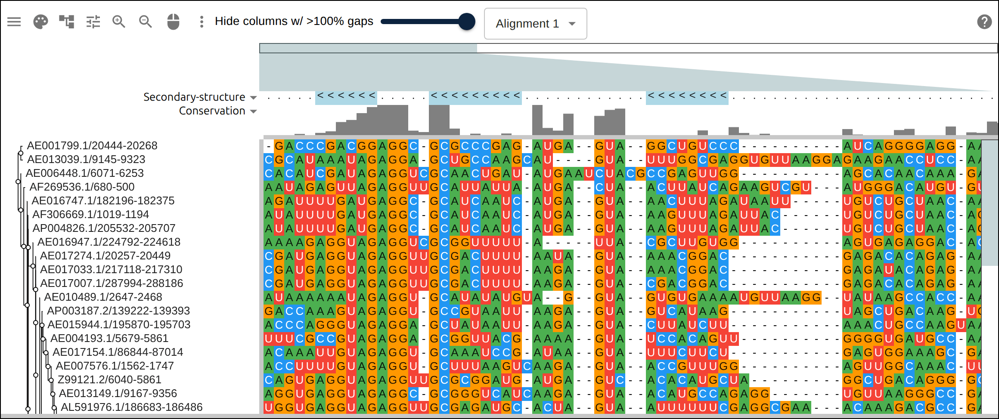

# JBrowseMSA user guide

JBrowseMSA (the `react-msaview` package) renders a phylogenetic tree alongside a
protein or nucleotide alignment on HTML5 canvas, tiled so it stays responsive on
very large inputs (up to the 230k-node UCSC SARS-CoV-2 sample tree). Everything
runs in the browser — nothing is uploaded.

This guide tours the [live app](https://gmod.org/JBrowseMSA/demo/). **Every
figure below links to the app in that exact state** via the `?data=` URL
parameter — click any screenshot to open and explore it yourself.

## Getting started

Open the app and you land on the **import form**.

[][live-import-form]

The import form, with preloaded examples — a 230k-node COVID tree from UCSC,
CLUSTAL-formatted alignments, RNA and protein Stockholm files, and a large
tree+MSA generated by MAFFT. Click any example to load it, or supply your own
data with the file/URL/paste inputs below.

You can load an alignment on its own, a tree on its own, or both together. When
both are present, rows are ordered and connected to match the tree.

## Loading your own data

The import form accepts a pasted string, a local file, or a remote URL for each
of the alignment, the tree, and (optionally) a domain-annotation track. If you
do not have those files yet, the
[tutorials](https://gmod.org/JBrowseMSA/tutorials) build them from scratch —
sequences to alignment to tree to annotations, with the commands to run.

| Input         | Formats                                                                                                                             |
| ------------- | ----------------------------------------------------------------------------------------------------------------------------------- |
| **Alignment** | FASTA (gaps already inserted), Stockholm (`.stock`, single or multi-alignment, may embed a tree and SS), Clustal (`.aln`), A3M, EMF |
| **Tree**      | Newick (`.nh`), or the tree embedded in a Stockholm/EMF file                                                                        |
| **Domains**   | InterProScan GFF3 (generate it with the [CLI](https://gmod.org/JBrowseMSA/cli))                                                     |

Stockholm files may carry both the tree and a secondary-structure annotation
inline, so a single file can populate the whole view. A "multi-Stockholm" file
with several alignments is supported too.

## A tour of the viewer

Once data is loaded the view has four parts:

- **Tree panel** (left) — the phylogeny, with clickable branch nodes.
- **Alignment panel** (right) — the residues, colored by the active scheme.
- **Header** (top) — menu buttons for files, color schemes, and tree/MSA
  settings, plus zoom controls.
- **Minimap & tracks** — an overview ruler above the alignment for fast
  navigation, and a strip of per-column tracks sharing the alignment's columns
  (see [Tracks](#tracks)).

Hovering a column highlights the corresponding position across rows (and on the
tree), making it easy to read a single site down the whole family.

## Navigating

- **Pan** by click-dragging the alignment, or scroll vertically/horizontally.
- **Zoom** with the magnifier buttons in the header, or enable **scroll zoom**
  (MSA settings menu) to zoom with the mouse wheel.
- **Fit** the alignment to the window — fit both axes, horizontally, or
  vertically — from the zoom controls, and **Reset zoom** returns to defaults.
- Set tiny row height / column width to "zoom out" far enough to see big-picture
  patterns across a large alignment at a glance.

## Color schemes

Open the palette menu in the header to switch schemes live.

[][live-color-scheme-menu]

The color-scheme menu, with protein and nucleotide palettes (the
[embedding guide](https://gmod.org/JBrowseMSA/embedding#color-schemes) lists
them all).

Two schemes are **dynamic** — they color each column from statistics about the
residues in that column rather than from a fixed per-letter table:

[][live-colorscheme-clustalx]

`clustalx_protein_dynamic` — ClustalX-style coloring driven by per-column
composition.

[][live-colorscheme-pid]

`percent_identity_dynamic` — columns shaded by their percent identity, so
conserved sites stand out.

## Working with the tree

Click a branch node to **collapse** that subtree. Collapsing also hides any
alignment columns that consist only of gaps introduced by the collapsed rows, so
the alignment tightens up as you fold clades away.

[][live-tree-collapse]

A collapsed subtree, drawn as a triangle labeled with its tip count (here 3).
The rows beneath it are hidden and the gap-only columns they introduced are
removed.

The tree settings menu toggles branch-length rendering, right-aligned vs
tree-adjacent labels, and clickable branch bubbles. **Advanced → Calculate
neighbor joining tree (BLOSUM62)** builds a quick tree from an alignment that
arrived without one, up to 500 rows — past that the calculation is a main-thread
freeze of several seconds or more, and the menu item says so instead of running.
Build a tree that size with FastTree or IQ-TREE and open it beside the
alignment; the
[protein family tutorial](https://gmod.org/JBrowseMSA/tutorials/protein_family)
covers the whole path.

## Protein domains

Load a GFF3 annotation file from the import form, or from **Annotations → Open
InterProScan results...**, to overlay domains on the alignment. Any GFF3 works —
InterProScan output is the common case, not a requirement — and the same overlay
draws exon and gene models. Each row's annotation coordinates are translated
into MSA coordinate space, so they line up across the family even where
alignment gaps shift the underlying sequence positions.

Building that file is a job for the [CLI](https://gmod.org/JBrowseMSA/cli):
`react-msaview-cli interpro` reads InterPro's precomputed matches for UniProt
accessions in seconds, and `interproscan` scans sequences InterPro has not seen.
The
[protein family tutorial](https://gmod.org/JBrowseMSA/tutorials/protein_family)
walks through both, and **Annotations → How to get a domain file...** opens it
from the app.

[][live-real-domains]

A real Src-family kinase family (SRC, YES, FYN, FGR, HCK, LYN, LCK, BLK) with
its tree and real InterProScan domains generated by
`react-msaview-cli interproscan`. Zoomed out to full length, the shared SH3,
SH2, and tyrosine-kinase catalytic domain architecture lines up across every
member.

### Why the overlay is column-locked

Translating into MSA coordinate space is the whole point, and the difference is
easiest to see by taking it away. Both panels below are the same twelve NLRP1
orthologs, the same domain GFF, the same component and palette, and the same
tree — the only difference is whether the input was aligned.


In the top panel there are no alignment gaps, so column N is residue N and each
protein's domains sit at its own residue positions. The shared domains scatter
into a staircase, because the proteins differ in length and in what they carry
at the N terminus. In the bottom panel the same domains land in the same
columns: NACHT starts at residue 328 in human and residue 93 in hamster — 235
residues apart — and the two are drawn in alignment columns 371 and 372.

That is what makes a domain overlay comparable across a family rather than a row
of independent cartoons.

[][live-domain-loss-closeup]

The same alignment at base resolution. The five rows with a pyrin (PYD) domain
carry it over real sequence; the rows without one are not empty there — cow,
pig, horse and zebrafish have residues in those columns with no PYD called over
them, and only the rodents are mostly gap. An overview zoomed out to whole-
protein scale cannot distinguish "no domain annotated" from "no sequence", which
is what the base-resolution view is for.

## Viewing metadata

Alignment file headers and per-sequence information are available from the
**Metadata** dialog (file menu).

[][live-metadata-dialog]

The metadata dialog showing the CLUSTAL header and the raw sequences, with
options to copy them and to show/hide gaps.

## Sharing and exporting

- **Share a session** by copying the page URL — the view state (colors, zoom,
  collapsed clades, highlights) is encoded in it, so a collaborator who opens
  the link sees exactly what you see. The data travels too, but only up to about
  50 kB of it: a file you opened from your own computer is inlined into the
  link, and anything larger than that is left out rather than turned into a
  megabyte-long URL. The header says **Not in the link** when that happens.
  Serve the file over HTTP and open it by URL instead, and the link carries the
  address rather than the file, at any size.
- **Point at something** before you share. The snapshot carries labeled
  highlights: a residue of a named sequence, a column range, or a set of rows,
  each with a note that draws beside it. They are written into the view state
  (see the [layers reference](https://gmod.org/JBrowseMSA/layers)), so a link
  can open on "R248, conserved in 651 of 658 orthologs" rather than on a bare
  column.
- **Export an image** with **Export SVG** (file menu) for a crisp, scalable
  figure of the current viewport or the entire alignment, optionally including
  the minimap and annotation tracks.

[][live-export-svg-dialog]

The Export SVG dialog — choose the whole alignment or just the current viewport,
and whether to include the minimap and tracks.

## Link to a view

Copying the URL is the everyday way to share a view, and a script can also build
one. The app reads one query parameter, `?data=`, holding the URL-encoded JSON
of the view:

```js
const view = {
  type: 'MsaView',
  msaFilehandle: { uri: 'https://example.org/kinase.aln' },
  colorSchemeName: 'clustalx_protein_dynamic',
  highlights: [{ row: 'SRC_HUMAN', start: 530, end: 530, label: 'Y530' }],
}
const url = `https://gmod.org/JBrowseMSA/demo/?data=${encodeURIComponent(JSON.stringify(view))}`
```

Either that bare `MsaView` snapshot or the `{"msaview": {...}}` wrapper the app
writes back to the address bar works. Every field is listed in the
[layers reference](https://gmod.org/JBrowseMSA/layers) and the
[model API docs](https://github.com/GMOD/JBrowseMSA/blob/main/packages/lib/apidocs/MsaView.md);
a snapshot the app cannot read opens on an error naming the problem, not on the
import form.

Three things decide whether the link works for the person who opens it:

- **Where the files live.** A `uri` is resolved against the app's own address,
  so `data/kinase.aln` means `gmod.org/JBrowseMSA/demo/data/kinase.aln` — fine
  for the hosted examples, wrong for a link you send. Use an absolute URL.
- **CORS.** The browser fetches those URLs from `gmod.org`, so the server
  holding them has to send `Access-Control-Allow-Origin`. GitHub Pages, S3 with
  a CORS rule, and the public EBI/NCBI/PDBe APIs do; most institutional web
  servers and Google Drive do not, and the view then opens on a fetch error.
- **Size.** A pasted or locally-opened file travels inside the link, but only up
  to 50 kB of it. Past that the alignment stays in the running viewer and leaves
  the snapshot rather than turning the link into a megabyte of URL, the header
  says **Not in the link**, and the app drops the parameter instead of writing a
  URL that opens empty. Serve the file over HTTP and open it by URL, and the
  link carries the address rather than the file, at any size.

## Tracks

Strips drawn above the alignment, sharing its columns and its horizontal scroll.
The **Tracks** submenu at the top of the MSA settings menu lists every one and
turns it on or off; a track's own dropdown arrow, on its label at the left, also
closes it and shows its details.

- **Conservation** — a per-column histogram of how conserved the column is, from
  Shannon entropy, scaled down by how gappy the column is. On by default.
- **Property conservation** — the same idea over physicochemical property class
  rather than exact identity, so it surfaces sites held constant by conservative
  substitution that identity-based conservation reads as variable. Protein
  alignments only, on by default.
- **Sequence logo** — the residues of each column stacked by the information
  they carry, tallest on top, each letter's height its share of the column's
  total. Off by default. Column height is information content in bits, so it
  tops out at log2(20) for protein and log2(4) for nucleotide, and a column
  whose residues are evenly split draws nothing at all. Frequencies come from
  the non-gap residues, then the whole stack is scaled by the column's occupancy
  — a column that is mostly gaps stays short even when the few residues left in
  it agree.
- **Secondary structure** and other annotation rows carried inline by a
  Stockholm file appear as text tracks, colored by the active scheme.
- **Base pairs** — the same `#=GC SS_cons` annotation drawn as arcs joining the
  columns that pair, on whenever a Stockholm file carries one. A pseudoknot
  takes its own color: WUSS writes those pairs as `A`/`a` rather than brackets
  precisely because they cross a helix instead of nesting inside it, and the
  crossing is visible in the arcs and invisible in the characters.

[][live-sequence-logo]

The sequence logo over the IL2RA alignment. The tall single letters are the
columns the family holds constant, the short stacks are the columns it varies,
and the gap-only stretch in the middle draws nothing — matching the run of `-`
in the rows below it.

Tracks are included in an SVG export when you check "include tracks" in the
export dialog.

A track can also arrive as data instead of being computed here. A `columnTracks`
entry in the shared URL or session carries per-column values drawn as bars, a
per-column string drawn like a Stockholm annotation line, or pairs of positions
drawn as arcs, so something computed outside the viewer — per column, per
residue of one row, or between two of them — lands above the alignment with a
name, a color, and its own menu entry. Arcs are how a pairing reaches the
viewer: a disulfide bond, a residue contact from a structure, a base pair the
file does not already annotate. The
[layers reference](https://gmod.org/JBrowseMSA/layers) lists the fields.

## Settings reference

Layout options live in two dropdowns in the header: **MSA settings** and **tree
settings**, beside the color-scheme palette.

[][live-settings-menu]

The MSA settings menu — the Tracks submenu, draw letters, color letters instead
of tile backgrounds, show per-column statistics on hover, and enable hiding
gappy columns. The tree settings menu beside it carries the branch-length, label
and clickable-bubble toggles.

## Scaling to large data

Both axes are tiled, so memory and draw time scale with what's on screen rather
than with the size of the file.

[][live-large-tree]

A real ~60-sequence ncRNA family (the Rfam Lysine riboswitch, RF00168) rendered
with its full inferred tree and secondary-structure annotation, both extracted
straight from the Stockholm file — the canvas tiling holds up well past toy-
sized data.

## Embedding and related projects

- [Embedding guide](https://gmod.org/JBrowseMSA/embedding) — React, UMD-in-HTML,
  and the R package.
- [Gallery](https://gmod.org/JBrowseMSA/gallery#jbrowse) — the viewer as a view
  inside JBrowse 2, connected to a genome view and 3D structure.
- [jbrowse-plugin-msaview](https://github.com/GMOD/jbrowse-plugin-msaview) — the
  JBrowse 2 plugin ([demo](https://jbrowse.org/demos/app)).
- [ProteinBrowser](https://github.com/GMOD/proteinbrowser) — a fuller
  protein-analysis suite built on this viewer.

<!-- live-demo links (generated by genGuideLinks.mjs) -->

[live-import-form]: https://gmod.org/JBrowseMSA/demo/
[live-color-scheme-menu]:
  https://gmod.org/JBrowseMSA/demo/?data=%7B%22msaview%22%3A%7B%22type%22%3A%22MsaView%22%2C%22height%22%3A185%2C%22treeAreaWidth%22%3A250%2C%22data%22%3A%7B%22msa%22%3A%22CLUSTAL%20O(1.2.3)%20multiple%20sequence%20alignment%5CnUniProt%7CP26898%7CIL2RA_SHEEP%20%20%20%20%20%20MEPSLLMWRFFVFIVVPGCVTEACHDDPPSLRNA----------MFKVLRYE----VGTM%5CnUniProt%7CP01590%7CIL2RA_MOUSE%20%20%20%20%20%20MEPRLLMLGFLSLTIVPSCRAELCLYDPPEVPNA----------TFKALSYK----NGTI%5CnUniProt%7CP41690%7CIL2RA_FELCA%20%20%20%20%20%20MEPSLLLWGILTFVVVHGHVTELCDENPPDIQHA----------TFKALTYK----TGTM%5CnUniProt%7CP01589%7CIL2RA_HUMAN%20%20%20%20%20%20MDSYLLMWGLLTFIMVPGCQAELCDDDPPEIPHA----------TFKAMAYK----EGTM%5CnUniProt%7CQ5MNY4%7CIL2RA_MACMU%20%20%20%20%20%20MDPYLLMWGLLTFITVPGCQAELCDDDPPKITHA----------TFKAVAYK----EGTM%5CnUniProt%7CP26896%7CIL2RB_RAT%20%20%20%20%20%20%20%20MATVDLSWRLPLYILLLLLATT--------------------------------WVSAAV%5Cn%22%2C%22tree%22%3A%22(((UniProt%7CP26898%7CIL2RA_SHEEP%3A0.24%2C(UniProt%7CP41690%7CIL2RA_FELCA%3A0.18%2C(UniProt%7CP01589%7CIL2RA_HUMAN%3A0.04%2CUniProt%7CQ5MNY4%7CIL2RA_MACMU%3A0.04)%3A0.13)%3A0.05)%3A0.02%2CUniProt%7CP01590%7CIL2RA_MOUSE%3A0.23)%3A0.07%2CUniProt%7CP26896%7CIL2RB_RAT%3A0.34)%3B%22%7D%2C%22colorSchemeName%22%3A%22clustal%22%7D%7D
[live-colorscheme-clustalx]:
  https://gmod.org/JBrowseMSA/demo/?data=%7B%22msaview%22%3A%7B%22type%22%3A%22MsaView%22%2C%22height%22%3A185%2C%22treeAreaWidth%22%3A250%2C%22data%22%3A%7B%22msa%22%3A%22CLUSTAL%20O(1.2.3)%20multiple%20sequence%20alignment%5CnUniProt%7CP26898%7CIL2RA_SHEEP%20%20%20%20%20%20MEPSLLMWRFFVFIVVPGCVTEACHDDPPSLRNA----------MFKVLRYE----VGTM%5CnUniProt%7CP01590%7CIL2RA_MOUSE%20%20%20%20%20%20MEPRLLMLGFLSLTIVPSCRAELCLYDPPEVPNA----------TFKALSYK----NGTI%5CnUniProt%7CP41690%7CIL2RA_FELCA%20%20%20%20%20%20MEPSLLLWGILTFVVVHGHVTELCDENPPDIQHA----------TFKALTYK----TGTM%5CnUniProt%7CP01589%7CIL2RA_HUMAN%20%20%20%20%20%20MDSYLLMWGLLTFIMVPGCQAELCDDDPPEIPHA----------TFKAMAYK----EGTM%5CnUniProt%7CQ5MNY4%7CIL2RA_MACMU%20%20%20%20%20%20MDPYLLMWGLLTFITVPGCQAELCDDDPPKITHA----------TFKAVAYK----EGTM%5CnUniProt%7CP26896%7CIL2RB_RAT%20%20%20%20%20%20%20%20MATVDLSWRLPLYILLLLLATT--------------------------------WVSAAV%5Cn%22%2C%22tree%22%3A%22(((UniProt%7CP26898%7CIL2RA_SHEEP%3A0.24%2C(UniProt%7CP41690%7CIL2RA_FELCA%3A0.18%2C(UniProt%7CP01589%7CIL2RA_HUMAN%3A0.04%2CUniProt%7CQ5MNY4%7CIL2RA_MACMU%3A0.04)%3A0.13)%3A0.05)%3A0.02%2CUniProt%7CP01590%7CIL2RA_MOUSE%3A0.23)%3A0.07%2CUniProt%7CP26896%7CIL2RB_RAT%3A0.34)%3B%22%7D%2C%22colorSchemeName%22%3A%22clustalx_protein_dynamic%22%7D%7D
[live-colorscheme-pid]:
  https://gmod.org/JBrowseMSA/demo/?data=%7B%22msaview%22%3A%7B%22type%22%3A%22MsaView%22%2C%22height%22%3A185%2C%22treeAreaWidth%22%3A250%2C%22data%22%3A%7B%22msa%22%3A%22CLUSTAL%20O(1.2.3)%20multiple%20sequence%20alignment%5CnUniProt%7CP26898%7CIL2RA_SHEEP%20%20%20%20%20%20MEPSLLMWRFFVFIVVPGCVTEACHDDPPSLRNA----------MFKVLRYE----VGTM%5CnUniProt%7CP01590%7CIL2RA_MOUSE%20%20%20%20%20%20MEPRLLMLGFLSLTIVPSCRAELCLYDPPEVPNA----------TFKALSYK----NGTI%5CnUniProt%7CP41690%7CIL2RA_FELCA%20%20%20%20%20%20MEPSLLLWGILTFVVVHGHVTELCDENPPDIQHA----------TFKALTYK----TGTM%5CnUniProt%7CP01589%7CIL2RA_HUMAN%20%20%20%20%20%20MDSYLLMWGLLTFIMVPGCQAELCDDDPPEIPHA----------TFKAMAYK----EGTM%5CnUniProt%7CQ5MNY4%7CIL2RA_MACMU%20%20%20%20%20%20MDPYLLMWGLLTFITVPGCQAELCDDDPPKITHA----------TFKAVAYK----EGTM%5CnUniProt%7CP26896%7CIL2RB_RAT%20%20%20%20%20%20%20%20MATVDLSWRLPLYILLLLLATT--------------------------------WVSAAV%5Cn%22%2C%22tree%22%3A%22(((UniProt%7CP26898%7CIL2RA_SHEEP%3A0.24%2C(UniProt%7CP41690%7CIL2RA_FELCA%3A0.18%2C(UniProt%7CP01589%7CIL2RA_HUMAN%3A0.04%2CUniProt%7CQ5MNY4%7CIL2RA_MACMU%3A0.04)%3A0.13)%3A0.05)%3A0.02%2CUniProt%7CP01590%7CIL2RA_MOUSE%3A0.23)%3A0.07%2CUniProt%7CP26896%7CIL2RB_RAT%3A0.34)%3B%22%7D%2C%22colorSchemeName%22%3A%22percent_identity_dynamic%22%7D%7D
[live-tree-collapse]:
  https://gmod.org/JBrowseMSA/demo/?data=%7B%22msaview%22%3A%7B%22type%22%3A%22MsaView%22%2C%22height%22%3A185%2C%22treeAreaWidth%22%3A250%2C%22data%22%3A%7B%22msa%22%3A%22CLUSTAL%20O(1.2.3)%20multiple%20sequence%20alignment%5CnUniProt%7CP26898%7CIL2RA_SHEEP%20%20%20%20%20%20MEPSLLMWRFFVFIVVPGCVTEACHDDPPSLRNA----------MFKVLRYE----VGTM%5CnUniProt%7CP01590%7CIL2RA_MOUSE%20%20%20%20%20%20MEPRLLMLGFLSLTIVPSCRAELCLYDPPEVPNA----------TFKALSYK----NGTI%5CnUniProt%7CP41690%7CIL2RA_FELCA%20%20%20%20%20%20MEPSLLLWGILTFVVVHGHVTELCDENPPDIQHA----------TFKALTYK----TGTM%5CnUniProt%7CP01589%7CIL2RA_HUMAN%20%20%20%20%20%20MDSYLLMWGLLTFIMVPGCQAELCDDDPPEIPHA----------TFKAMAYK----EGTM%5CnUniProt%7CQ5MNY4%7CIL2RA_MACMU%20%20%20%20%20%20MDPYLLMWGLLTFITVPGCQAELCDDDPPKITHA----------TFKAVAYK----EGTM%5CnUniProt%7CP26896%7CIL2RB_RAT%20%20%20%20%20%20%20%20MATVDLSWRLPLYILLLLLATT--------------------------------WVSAAV%5Cn%22%2C%22tree%22%3A%22(((UniProt%7CP26898%7CIL2RA_SHEEP%3A0.24%2C(UniProt%7CP41690%7CIL2RA_FELCA%3A0.18%2C(UniProt%7CP01589%7CIL2RA_HUMAN%3A0.04%2CUniProt%7CQ5MNY4%7CIL2RA_MACMU%3A0.04)%3A0.13)%3A0.05)%3A0.02%2CUniProt%7CP01590%7CIL2RA_MOUSE%3A0.23)%3A0.07%2CUniProt%7CP26896%7CIL2RB_RAT%3A0.34)%3B%22%7D%2C%22collapsed%22%3A%5B%22node-0-0-1-0-2-1-3%22%5D%7D%7D
[live-real-domains]:
  https://gmod.org/JBrowseMSA/demo/?data=%7B%22msaview%22%3A%7B%22type%22%3A%22MsaView%22%2C%22height%22%3A360%2C%22treeAreaWidth%22%3A175%2C%22colWidth%22%3A2%2C%22colorSchemeName%22%3A%22clustalx_protein_dynamic%22%2C%22msaFilehandle%22%3A%7B%22uri%22%3A%22data%2Fkinase.aln%22%7D%2C%22treeFilehandle%22%3A%7B%22uri%22%3A%22data%2Fkinase.nh%22%7D%2C%22gffFilehandle%22%3A%7B%22uri%22%3A%22data%2Fkinase-domains.gff%22%7D%7D%7D
[live-domain-loss-closeup]:
  https://gmod.org/JBrowseMSA/demo/?data=%7B%22msaview%22%3A%7B%22type%22%3A%22MsaView%22%2C%22height%22%3A520%2C%22treeAreaWidth%22%3A150%2C%22colWidth%22%3A14%2C%22rowHeight%22%3A20%2C%22scrollX%22%3A-476%2C%22colorSchemeName%22%3A%22clustalx_protein_dynamic%22%2C%22msaFilehandle%22%3A%7B%22uri%22%3A%22data%2Fnlrp1.aln%22%7D%2C%22treeFilehandle%22%3A%7B%22uri%22%3A%22data%2Fnlrp1.nh%22%7D%2C%22gffFilehandle%22%3A%7B%22uri%22%3A%22data%2Fnlrp1-domains.gff%22%7D%7D%7D
[live-metadata-dialog]:
  https://gmod.org/JBrowseMSA/demo/?data=%7B%22msaview%22%3A%7B%22type%22%3A%22MsaView%22%2C%22height%22%3A185%2C%22treeAreaWidth%22%3A250%2C%22data%22%3A%7B%22msa%22%3A%22CLUSTAL%20O(1.2.3)%20multiple%20sequence%20alignment%5CnUniProt%7CP26898%7CIL2RA_SHEEP%20%20%20%20%20%20MEPSLLMWRFFVFIVVPGCVTEACHDDPPSLRNA----------MFKVLRYE----VGTM%5CnUniProt%7CP01590%7CIL2RA_MOUSE%20%20%20%20%20%20MEPRLLMLGFLSLTIVPSCRAELCLYDPPEVPNA----------TFKALSYK----NGTI%5CnUniProt%7CP41690%7CIL2RA_FELCA%20%20%20%20%20%20MEPSLLLWGILTFVVVHGHVTELCDENPPDIQHA----------TFKALTYK----TGTM%5CnUniProt%7CP01589%7CIL2RA_HUMAN%20%20%20%20%20%20MDSYLLMWGLLTFIMVPGCQAELCDDDPPEIPHA----------TFKAMAYK----EGTM%5CnUniProt%7CQ5MNY4%7CIL2RA_MACMU%20%20%20%20%20%20MDPYLLMWGLLTFITVPGCQAELCDDDPPKITHA----------TFKAVAYK----EGTM%5CnUniProt%7CP26896%7CIL2RB_RAT%20%20%20%20%20%20%20%20MATVDLSWRLPLYILLLLLATT--------------------------------WVSAAV%5Cn%22%2C%22tree%22%3A%22(((UniProt%7CP26898%7CIL2RA_SHEEP%3A0.24%2C(UniProt%7CP41690%7CIL2RA_FELCA%3A0.18%2C(UniProt%7CP01589%7CIL2RA_HUMAN%3A0.04%2CUniProt%7CQ5MNY4%7CIL2RA_MACMU%3A0.04)%3A0.13)%3A0.05)%3A0.02%2CUniProt%7CP01590%7CIL2RA_MOUSE%3A0.23)%3A0.07%2CUniProt%7CP26896%7CIL2RB_RAT%3A0.34)%3B%22%7D%7D%7D
[live-export-svg-dialog]:
  https://gmod.org/JBrowseMSA/demo/?data=%7B%22msaview%22%3A%7B%22type%22%3A%22MsaView%22%2C%22height%22%3A185%2C%22treeAreaWidth%22%3A250%2C%22data%22%3A%7B%22msa%22%3A%22CLUSTAL%20O(1.2.3)%20multiple%20sequence%20alignment%5CnUniProt%7CP26898%7CIL2RA_SHEEP%20%20%20%20%20%20MEPSLLMWRFFVFIVVPGCVTEACHDDPPSLRNA----------MFKVLRYE----VGTM%5CnUniProt%7CP01590%7CIL2RA_MOUSE%20%20%20%20%20%20MEPRLLMLGFLSLTIVPSCRAELCLYDPPEVPNA----------TFKALSYK----NGTI%5CnUniProt%7CP41690%7CIL2RA_FELCA%20%20%20%20%20%20MEPSLLLWGILTFVVVHGHVTELCDENPPDIQHA----------TFKALTYK----TGTM%5CnUniProt%7CP01589%7CIL2RA_HUMAN%20%20%20%20%20%20MDSYLLMWGLLTFIMVPGCQAELCDDDPPEIPHA----------TFKAMAYK----EGTM%5CnUniProt%7CQ5MNY4%7CIL2RA_MACMU%20%20%20%20%20%20MDPYLLMWGLLTFITVPGCQAELCDDDPPKITHA----------TFKAVAYK----EGTM%5CnUniProt%7CP26896%7CIL2RB_RAT%20%20%20%20%20%20%20%20MATVDLSWRLPLYILLLLLATT--------------------------------WVSAAV%5Cn%22%2C%22tree%22%3A%22(((UniProt%7CP26898%7CIL2RA_SHEEP%3A0.24%2C(UniProt%7CP41690%7CIL2RA_FELCA%3A0.18%2C(UniProt%7CP01589%7CIL2RA_HUMAN%3A0.04%2CUniProt%7CQ5MNY4%7CIL2RA_MACMU%3A0.04)%3A0.13)%3A0.05)%3A0.02%2CUniProt%7CP01590%7CIL2RA_MOUSE%3A0.23)%3A0.07%2CUniProt%7CP26896%7CIL2RB_RAT%3A0.34)%3B%22%7D%7D%7D
[live-sequence-logo]:
  https://gmod.org/JBrowseMSA/demo/?data=%7B%22msaview%22%3A%7B%22type%22%3A%22MsaView%22%2C%22height%22%3A260%2C%22treeAreaWidth%22%3A250%2C%22data%22%3A%7B%22msa%22%3A%22CLUSTAL%20O(1.2.3)%20multiple%20sequence%20alignment%5CnUniProt%7CP26898%7CIL2RA_SHEEP%20%20%20%20%20%20MEPSLLMWRFFVFIVVPGCVTEACHDDPPSLRNA----------MFKVLRYE----VGTM%5CnUniProt%7CP01590%7CIL2RA_MOUSE%20%20%20%20%20%20MEPRLLMLGFLSLTIVPSCRAELCLYDPPEVPNA----------TFKALSYK----NGTI%5CnUniProt%7CP41690%7CIL2RA_FELCA%20%20%20%20%20%20MEPSLLLWGILTFVVVHGHVTELCDENPPDIQHA----------TFKALTYK----TGTM%5CnUniProt%7CP01589%7CIL2RA_HUMAN%20%20%20%20%20%20MDSYLLMWGLLTFIMVPGCQAELCDDDPPEIPHA----------TFKAMAYK----EGTM%5CnUniProt%7CQ5MNY4%7CIL2RA_MACMU%20%20%20%20%20%20MDPYLLMWGLLTFITVPGCQAELCDDDPPKITHA----------TFKAVAYK----EGTM%5CnUniProt%7CP26896%7CIL2RB_RAT%20%20%20%20%20%20%20%20MATVDLSWRLPLYILLLLLATT--------------------------------WVSAAV%5Cn%22%2C%22tree%22%3A%22(((UniProt%7CP26898%7CIL2RA_SHEEP%3A0.24%2C(UniProt%7CP41690%7CIL2RA_FELCA%3A0.18%2C(UniProt%7CP01589%7CIL2RA_HUMAN%3A0.04%2CUniProt%7CQ5MNY4%7CIL2RA_MACMU%3A0.04)%3A0.13)%3A0.05)%3A0.02%2CUniProt%7CP01590%7CIL2RA_MOUSE%3A0.23)%3A0.07%2CUniProt%7CP26896%7CIL2RB_RAT%3A0.34)%3B%22%7D%2C%22colorSchemeName%22%3A%22maeditor%22%2C%22turnedOffTracks%22%3A%7B%22sequence-logo%22%3Afalse%2C%22conservation%22%3Atrue%7D%7D%7D
[live-settings-menu]:
  https://gmod.org/JBrowseMSA/demo/?data=%7B%22msaview%22%3A%7B%22type%22%3A%22MsaView%22%2C%22height%22%3A185%2C%22treeAreaWidth%22%3A250%2C%22data%22%3A%7B%22msa%22%3A%22CLUSTAL%20O(1.2.3)%20multiple%20sequence%20alignment%5CnUniProt%7CP26898%7CIL2RA_SHEEP%20%20%20%20%20%20MEPSLLMWRFFVFIVVPGCVTEACHDDPPSLRNA----------MFKVLRYE----VGTM%5CnUniProt%7CP01590%7CIL2RA_MOUSE%20%20%20%20%20%20MEPRLLMLGFLSLTIVPSCRAELCLYDPPEVPNA----------TFKALSYK----NGTI%5CnUniProt%7CP41690%7CIL2RA_FELCA%20%20%20%20%20%20MEPSLLLWGILTFVVVHGHVTELCDENPPDIQHA----------TFKALTYK----TGTM%5CnUniProt%7CP01589%7CIL2RA_HUMAN%20%20%20%20%20%20MDSYLLMWGLLTFIMVPGCQAELCDDDPPEIPHA----------TFKAMAYK----EGTM%5CnUniProt%7CQ5MNY4%7CIL2RA_MACMU%20%20%20%20%20%20MDPYLLMWGLLTFITVPGCQAELCDDDPPKITHA----------TFKAVAYK----EGTM%5CnUniProt%7CP26896%7CIL2RB_RAT%20%20%20%20%20%20%20%20MATVDLSWRLPLYILLLLLATT--------------------------------WVSAAV%5Cn%22%2C%22tree%22%3A%22(((UniProt%7CP26898%7CIL2RA_SHEEP%3A0.24%2C(UniProt%7CP41690%7CIL2RA_FELCA%3A0.18%2C(UniProt%7CP01589%7CIL2RA_HUMAN%3A0.04%2CUniProt%7CQ5MNY4%7CIL2RA_MACMU%3A0.04)%3A0.13)%3A0.05)%3A0.02%2CUniProt%7CP01590%7CIL2RA_MOUSE%3A0.23)%3A0.07%2CUniProt%7CP26896%7CIL2RB_RAT%3A0.34)%3B%22%7D%2C%22colorSchemeName%22%3A%22maeditor%22%7D%7D
[live-large-tree]:
  https://gmod.org/JBrowseMSA/demo/?data=%7B%22msaview%22%3A%7B%22type%22%3A%22MsaView%22%2C%22height%22%3A480%2C%22treeAreaWidth%22%3A300%2C%22colorSchemeName%22%3A%22nucleotide%22%2C%22msaFilehandle%22%3A%7B%22uri%22%3A%22data%2Flysine.stock%22%7D%7D%7D
