# JBrowseMSA user guide

JBrowseMSA (the `react-msaview` package) renders a phylogenetic tree alongside a
protein or nucleotide alignment on HTML5 canvas, tiled so it stays responsive on
very large inputs (up to the 230k-node UCSC SARS-CoV-2 sample tree). The viewer
runs entirely in the browser and uploads nothing.

This guide tours the [live app](https://gmod.org/JBrowseMSA/demo/). **Every
figure below links to the app in that exact state** through the `#data=` URL
fragment, so clicking a screenshot opens the same view to explore.

## Getting started

Open the app and you land on the **import form**.

[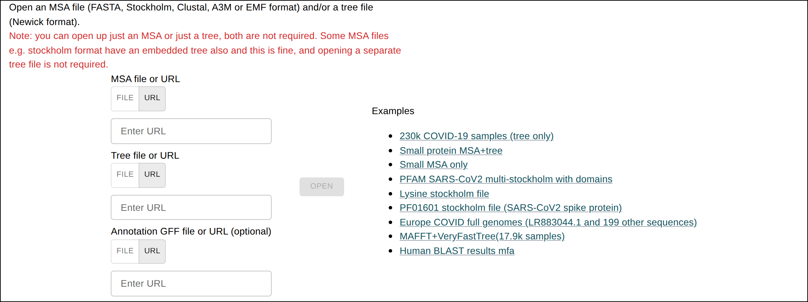][live-import-form]

The import form lists preloaded examples: a 230k-node COVID tree from UCSC,
CLUSTAL-formatted alignments, RNA and protein Stockholm files, and a large
tree+MSA generated by MAFFT. Click an example to load it, or supply your own
data with the file and URL inputs below.

You can load an alignment on its own, a tree on its own, or both together. When
both are present, rows are ordered and connected to match the tree.

## Loading your own data

The import form accepts a local file or a remote URL for each of the alignment,
the tree, and (optionally) a domain-annotation track. If you do not have those
files yet, the [tutorials](https://gmod.org/JBrowseMSA/tutorials) build them
from sequences, with the commands for the alignment, the tree and the
annotations.

| Input         | Formats                                                                                                                             |
| ------------- | ----------------------------------------------------------------------------------------------------------------------------------- |
| **Alignment** | FASTA (gaps already inserted), Stockholm (`.stock`, single or multi-alignment, may embed a tree and SS), Clustal (`.aln`), A3M, EMF |
| **Tree**      | Newick (`.nh`), or the tree embedded in a Stockholm/EMF file                                                                        |
| **Domains**   | GFF3, such as InterProScan output (generate it with the [CLI](https://gmod.org/JBrowseMSA/cli))                                     |

Stockholm files may carry both the tree and a secondary-structure annotation
inline, so a single file can populate the whole view. A "multi-Stockholm" file
with several alignments is supported too.

## A tour of the viewer

Once data is loaded the view has four parts:

- **Tree panel** (left): the phylogeny, with clickable branch nodes.
- **Alignment panel** (right): the residues, colored by the active scheme.
- **Header** (top): menu buttons for files, color schemes, and tree/MSA
  settings, plus zoom controls.
- **Minimap & tracks**: an overview ruler above the alignment for navigation,
  and a strip of per-column tracks sharing the alignment's columns (see
  [Tracks](#tracks)).

Hovering a column highlights that position down every row of the alignment, so
you can read one site down the whole family.

## Navigating

- **Pan** by click-dragging the alignment, or scroll vertically/horizontally.
- **Go to** a row, a column or a residue from the box in the header: a row name,
  which completes as you type, a column number as the ruler reads it, or
  `name:N` for residue N of that row. The view centers on the target and lights
  it, and an entry that names nothing turns the box red.
- **Keyboard**: click the alignment, then the arrow keys move one cell (a page
  with shift), `+` and `-` zoom, and Home and End jump to the first and last
  column.
- **Select** a block of cells by holding shift and dragging across the
  alignment, or a range of columns across every row by dragging along a track,
  such as the Position ruler. The header then shows the block's size, such as
  "12 columns × 3 rows", as a button whose menu copies the block as FASTA, zooms
  to it, or clears it. Escape clears it too. The selection travels in the
  `#data=` link.
- **Zoom** with the magnifier buttons in the header. Ctrl+wheel zooms at the
  cursor whatever the wheel is set to do.
- **Mouse wheel**: the mouse button in the header opens a menu with the four
  things the plain wheel can do: scroll the alignment, zoom both axes, zoom
  columns only, or zoom rows only. Zooming columns only holds the row height, so
  the labels stay at their size while the alignment compresses; rows only holds
  the column width. The button's icon shows the mode in force. Hold shift to pan
  while the wheel zooms.
- **Fit** the alignment to the window on both axes, horizontally or vertically
  from the zoom controls. **Reset zoom** returns to the defaults.
- Set a small row height and column width to zoom out far enough to see a whole
  large alignment at once.

## Color schemes

Open the palette menu in the header to switch schemes live.

[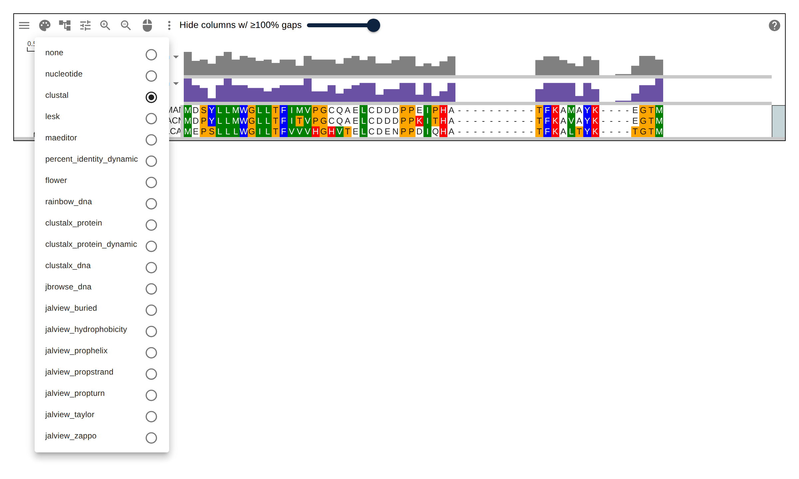][live-color-scheme-menu]

The color-scheme menu, with protein and nucleotide palettes (the
[embedding guide](https://gmod.org/JBrowseMSA/embedding#color-schemes) lists
them all).

Two schemes are **dynamic**: they color each column from statistics about the
residues in that column, where the other schemes use a fixed color per letter.

[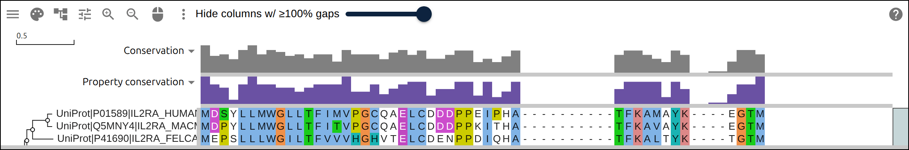][live-colorscheme-clustalx]

`clustalx_protein_dynamic` colors residues ClustalX-style from the composition
of each column.

[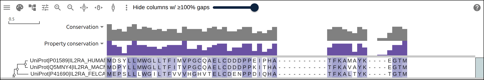][live-colorscheme-pid]

`percent_identity_dynamic` shades each column by its percent identity, so
conserved sites stand out.

A link can also color letters from its own
[map](https://gmod.org/JBrowseMSA/layers#customcolorscheme) of residue letter to
color. The menu then shows a checked **Custom** entry, and picking a scheme
replaces the map.

## Working with the tree

Click a branch node to **collapse** that subtree. Collapsing also hides any
alignment column that holds only gaps once the collapsed rows are gone, so the
alignment narrows as you fold clades away.

[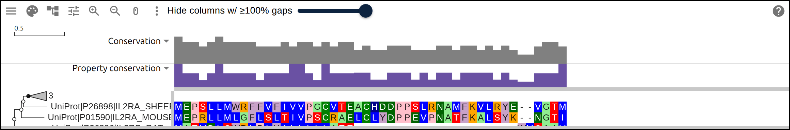][live-tree-collapse]

A collapsed subtree, drawn as a triangle labeled with its tip count (here 3).
The rows beneath it are hidden and the gap-only columns they introduced are
removed.

A branch node's menu also has **Show only this node**, which narrows the view to
that subtree: the rows below it are the whole alignment until **Disable show
only this node** puts the rest back.

**Rotate this node** swaps the clades below a branch node, the way ggtree's
`rotate` does, and the alignment rows move with the tips. A second click puts
them back, and **Tree settings → Order → Undo rotations** clears every rotation.
The same Order submenu sets the child order for the whole tree: by branch length
(the default), as the file writes it, or ladderized with the small or the large
clades first.

**Reroot here**, on any node but the root, roots the tree halfway along the
branch above that node. **Tree settings → Root → Midpoint** roots it halfway
along the longest path between two tips, which suits the unrooted trees
FastTree, IQ-TREE and neighbor joining write. Rerooting renumbers the nodes, so
it expands collapsed clades, clears rotations and leaves the show-only view.
**File → Export tree (Newick)** saves the tree with the root, order and
rotations on screen, collapsed clades included.
[Data layers](https://gmod.org/JBrowseMSA/layers#treeorder-and-treeroot) covers
`treeOrder` and `treeRoot`, the properties behind these menus.

**Tree settings → Show tree overview** puts the whole tree in a band above the
tree panel, small enough that a few hundred tips fit in 120 pixels, with the
focused subtree drawn as a box on it and the `clades` highlights in place. A
click on the band focuses the deepest subtree covering the rows under the
pointer, and a click inside the box clears the focus, so the band reaches a
clade of a tree far taller than the screen in one click. The overview keeps
drawing every tip while the view shows a subtree, so it shows where the focused
clade sits in the whole tree. The SVG export draws the band too.

With branch lengths on, a scale bar sits in the gutter above the tree: a round
number of substitutions per site, drawn to the same scale as the branches. The
scale bar is hidden in cladogram mode, where horizontal position shows topology
rather than branch length. The SVG export carries the bar too, so a published
figure states the scale its branches are drawn to.

The tree settings menu sets the child order and the root, and toggles
branch-length rendering, right-aligned vs tree-adjacent labels, and clickable
branch bubbles. **Advanced → Calculate neighbor joining tree (BLOSUM62)** builds
a quick tree for an alignment loaded without one, up to 500 rows. On a larger
alignment the calculation would freeze the page for several seconds or more, so
the menu item explains the limit and does not run. Build a tree that size with
FastTree or IQ-TREE and open it beside the alignment; the
[protein family tutorial](https://gmod.org/JBrowseMSA/tutorials/protein_family)
covers the whole path.

## Protein domains

Load a GFF3 annotation file from the import form, or from **Annotations → Open
annotation file...**, to overlay domains on the alignment. The overlay accepts
any GFF3, including exon and gene models; InterProScan output is the most common
input. The dialog also takes the JSON an InterProScan run returns and converts
it to GFF3 as it loads. Either way the annotations travel in the shared link
with the rest of the view. The viewer translates each row's annotation
coordinates into alignment columns, so they line up across the family even where
gaps shift the underlying sequence positions.

The [CLI](https://gmod.org/JBrowseMSA/cli) builds the file:
`react-msaview-cli interpro` reads InterPro's precomputed matches for UniProt
accessions in seconds, and `interproscan` scans sequences InterPro has not seen.
The
[protein family tutorial](https://gmod.org/JBrowseMSA/tutorials/protein_family)
walks through both, and **Annotations → How to get a domain file...** opens it
from the app.

[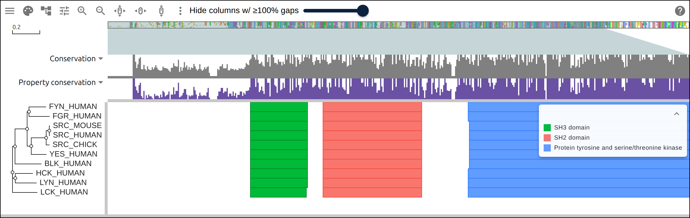][live-real-domains]

A real Src-family kinase family (SRC, YES, FYN, FGR, HCK, LYN, LCK, BLK) with
its tree and real InterProScan domains generated by
`react-msaview-cli interproscan`. Zoomed out to full length, the shared SH3,
SH2, and tyrosine-kinase catalytic domain architecture lines up across every
member.

### Why the overlay is column-locked

The two panels below show what the translation into alignment columns changes.
Both hold the same twelve NLRP1 orthologs, domain GFF, component, palette and
tree; only the bottom panel's input was aligned.

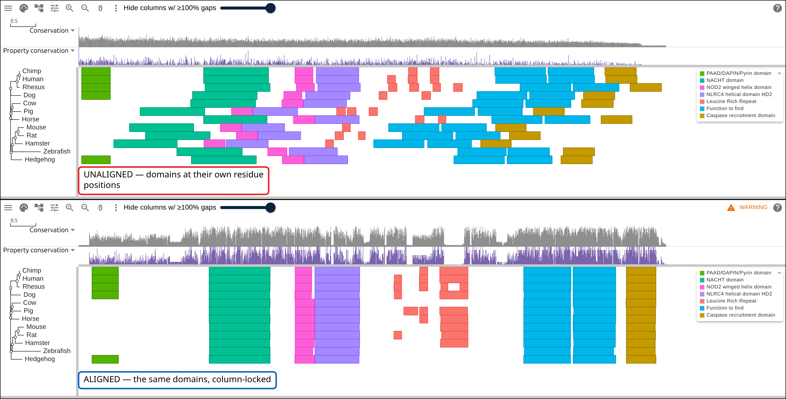

In the top panel there are no alignment gaps, so column N is residue N and each
protein's domains sit at its own residue positions. The shared domains scatter
into a staircase, because the proteins differ in length and in what they carry
at the N terminus. In the bottom panel the same domains land in the same
columns: NACHT starts at residue 328 in human and residue 93 in hamster, 235
residues apart, and the viewer draws the two in alignment columns 371 and 372.
Because the overlay uses the alignment's columns, you can compare a domain
across the whole family in one column range.

[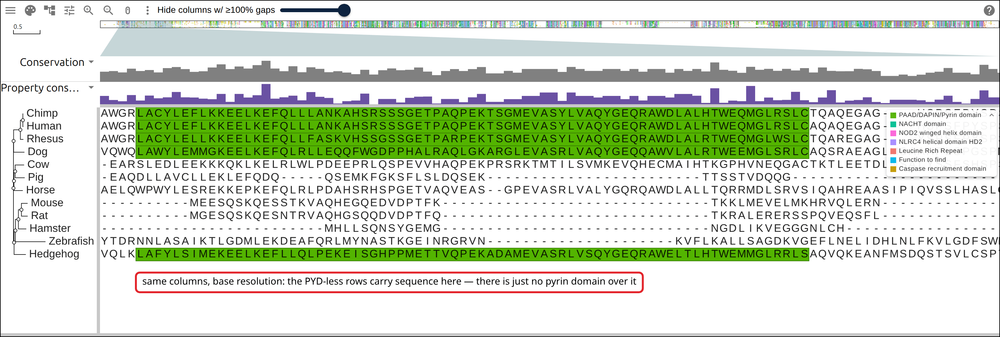][live-domain-loss-closeup]

The same alignment at base resolution. The five rows with a pyrin (PYD) domain
carry it over real sequence. The rows without one still have sequence there:
cow, pig, horse and zebrafish have residues in those columns with no PYD called
over them, and only the rodents are mostly gap. At whole-protein zoom the two
cases look alike, so zoom to base resolution to tell "no domain annotated" from
"no sequence".

## Viewing metadata

Alignment file headers and per-sequence information are available from the
**Metadata** dialog (file menu).

[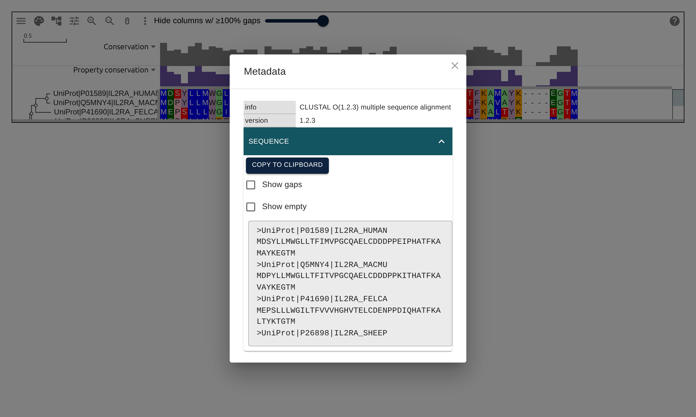][live-metadata-dialog]

The metadata dialog showing the CLUSTAL header and the raw sequences, with
options to copy them and to show/hide gaps.

## Sharing and exporting

- **Share a session** with **Copy link** above the viewer, which copies the page
  URL as of the click. The URL encodes the view state (colors, zoom, collapsed
  clades, highlights), so a collaborator who opens the link sees the same view.
  A file you opened from your own computer goes into the link too, up to a size
  limit described under [Link to a view](#link-to-a-view).
- **Point at something** before you share. The snapshot carries labeled
  highlights: a residue of a named sequence, a column range, or a set of rows,
  each with a note drawn beside it. The view state stores them (see the
  [layers reference](https://gmod.org/JBrowseMSA/layers)), so a link can open on
  a band labeled "R248, conserved in 651 of 658 orthologs".
- **Export an image** with **Export SVG** (file menu): a vector figure of the
  current viewport or the entire alignment, optionally with the minimap and
  annotation tracks.

[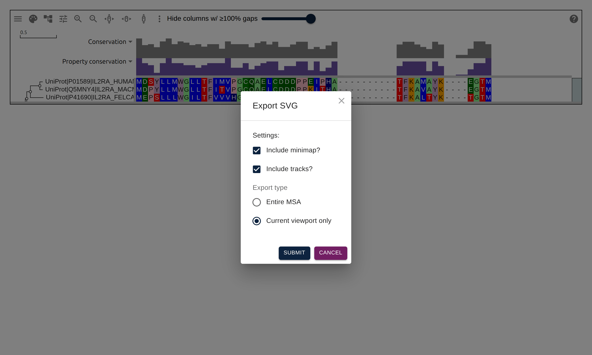][live-export-svg-dialog]

The Export SVG dialog, with a choice between the whole alignment and the current
viewport, and checkboxes for the minimap and tracks.

## Link to a view

Besides **Copy link**, a script can build a link. The app reads the view from
the URL's fragment, `#data=`, holding the URL-encoded JSON of the view. A link
written with the `?data=` query parameter, as older links were, opens too, and
the app moves it into the fragment.

```js
const view = {
  type: 'MsaView',
  msaFilehandle: { uri: 'https://example.org/kinase.aln' },
  colorSchemeName: 'clustalx_protein_dynamic',
  highlights: [{ row: 'SRC_HUMAN', start: 530, end: 530, label: 'Y530' }],
}
const url = `https://gmod.org/JBrowseMSA/demo/#data=${encodeURIComponent(JSON.stringify(view))}`
```

Either that bare `MsaView` snapshot or the `{"msaview": {...}}` wrapper the app
writes back to the address bar works. The
[layers reference](https://gmod.org/JBrowseMSA/layers) and the
[model API docs](https://github.com/GMOD/JBrowseMSA/blob/main/packages/lib/apidocs/MsaView.md)
list every field. When the app cannot read a snapshot, it opens on an error
naming the problem, not on the import form.

Three things decide whether the link works for the person who opens it:

- **Where the files live.** The app resolves a `uri` against its own address, so
  `data/kinase.aln` means `gmod.org/JBrowseMSA/demo/data/kinase.aln`. That works
  for the hosted examples and fails for a link you send, so use an absolute URL.
- **CORS.** The browser fetches those URLs from `gmod.org`, so the server
  holding them has to send `Access-Control-Allow-Origin`. GitHub Pages, S3 with
  a CORS rule, and the public EBI/NCBI/PDBe APIs send it. Most institutional web
  servers and Google Drive do not, and the view then opens on a fetch error.
- **Size.** The browser never sends a URL's fragment to the server, so the
  length of a `#data=` link is up to the browser: Chrome and Firefox both open
  one of 1,000,000 characters. The app gzips the snapshot and inlines a pasted
  or locally opened file up to 1 MB; a 400 kB protein alignment encodes to about
  305,000 characters. A larger file stays in the running viewer but leaves the
  snapshot, and the header shows **Not in the link**. When a file is too large,
  or the whole view still encodes past 1,000,000 characters, the app removes
  `#data=` so the address bar never holds a URL that opens empty, and **Copy
  link** turns off and says why. To share a larger file, serve it over HTTP and
  open it by URL; the link then stores the address, which works at any file
  size. The same 1 MB limit applies to a
  [data track](https://gmod.org/JBrowseMSA/layers#columntracks).

## Tracks

Tracks are strips drawn above the alignment, sharing its columns and its
horizontal scroll. The **Tracks** submenu at the top of the MSA settings menu
lists every track and turns each on or off. The dropdown arrow on a track's
label, at the left, also closes it and shows its details.

Hovering a track reads out what it draws at that column: the two conservation
scores, the sequence logo's information content and residue composition, the
columns an arc joins, the letter on a text track. **Show track values on hover**
in the MSA settings menu turns the readout off. Over the alignment itself, the
tooltip carries the domains and insertions under the cursor, and the header
reads out the hovered row, residue and position.

- **Conservation**: a per-column histogram of how conserved the column is, from
  Shannon entropy, scaled down by the column's gap fraction. On by default.
- **Property conservation**: the same measure over physicochemical property
  class instead of exact identity. It shows sites held constant by conservative
  substitution, which identity-based conservation counts as variable. Protein
  alignments only, on by default.
- **Sequence logo**: the residues of each column stacked by the information they
  carry, tallest on top, each letter's height its share of the column's total.
  Off by default. Column height is information content in bits, so it tops out
  at log2(20) for protein and log2(4) for nucleotide, and a column whose
  residues are evenly split draws nothing at all. Frequencies come from the
  non-gap residues, and the track then scales the whole stack by the column's
  occupancy, so a column that is mostly gaps stays short even when its few
  residues agree.
- **Position**: column numbers with a tick under each, at whatever spacing the
  zoom leaves room for. Off by default. The track counts alignment columns. When
  the view is drawn relative to a row (**Indicate differences from this row** in
  a row's menu), it counts that row's residues and skips the columns where the
  row has a gap.
- **Secondary structure** and the other annotation rows a Stockholm file carries
  inline appear as text tracks, colored by the active scheme. Every `#=GC` line
  gets one: `SS_cons`, `seq_cons`, Rfam's `RF` and motif lines. Every `#=GR`
  line gets one too, named `<row> <tag>`, but starts hidden, since a Pfam seed
  carries a couple of per-row active-site lines and an Rfam family carries a
  structure line per row with a PDB entry. Turn them on from Settings → Tracks.
- **Base pairs**: the same `#=GC SS_cons` annotation drawn as arcs joining the
  columns that pair, shown whenever a Stockholm file carries one. Pseudoknot
  pairs get their own color. WUSS writes those pairs as `A`/`a` because they
  cross a helix and brackets can only nest; the arcs show the crossing.

[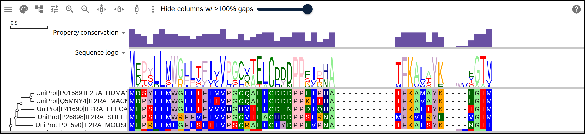][live-sequence-logo]

The sequence logo over the IL2RA alignment. Tall single letters mark the columns
the family holds constant, short stacks mark the columns that vary, and the
gap-only stretch in the middle is blank, matching the run of `-` in the rows
below it.

Check "Include tracks?" in the export dialog to include tracks in an SVG export.

A host can also supply a track as data. A `columnTracks` entry in the shared URL
or session carries per-column values drawn as bars, a per-column string drawn
like a Stockholm annotation line, or pairs of positions drawn as arcs. Values
can index alignment columns or the residues of one row, and each track gets a
name, a color and its own menu entry. Use an arc track for a pairing: a
disulfide bond, a residue contact from a structure, a base pair the file does
not already annotate. The [layers reference](https://gmod.org/JBrowseMSA/layers)
lists the fields.

## Settings reference

Layout options live in two dropdowns in the header: **MSA settings** and **tree
settings**, beside the color-scheme palette.

[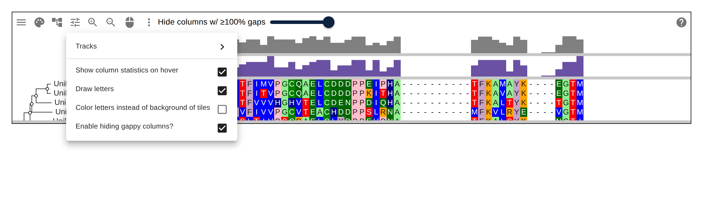][live-settings-menu]

The MSA settings menu holds the Tracks submenu and the toggles **Draw letters**,
**Color letters, not cells**, **Show track values on hover** and **Hide gappy
columns**. The tree settings menu beside it holds the Order and Root submenus
and the branch-length, label and clickable-bubble toggles.

## Scaling to large data

The viewer tiles both axes, so memory and draw time grow with the visible area,
not with the size of the file.

[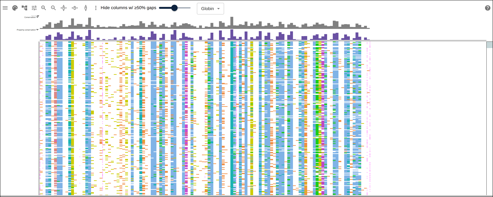][live-pfam-scale]

The whole Globin family from Pfam (PF00042) as the InterPro API serves it:
20,705 sequences over 672 columns, 20 MB of Stockholm behind a 3 MB gzipped
response. The first column paints about four seconds after the link opens. After
that the canvas draws only the tiles on screen, so scrolling and zooming stay
interactive.

## Embedding and related projects

- [Embedding guide](https://gmod.org/JBrowseMSA/embedding): React, UMD-in-HTML,
  and the R package.
- [JBrowse 2 integration](https://gmod.org/JBrowseMSA/tutorials/jbrowse_integration):
  the viewer as a view inside JBrowse 2, connected to a genome view and 3D
  structure.
- [jbrowse-plugin-msaview](https://github.com/GMOD/jbrowse-plugin-msaview): the
  JBrowse 2 plugin ([demo](https://jbrowse.org/demos/app)).
- [ProteinBrowser](https://github.com/GMOD/proteinbrowser): a protein-analysis
  suite built on this viewer.

<!-- live-demo links (generated by genGuideLinks.mjs) -->

[live-import-form]: https://gmod.org/JBrowseMSA/demo/
[live-color-scheme-menu]:
  https://gmod.org/JBrowseMSA/demo/#data=%7B%22msaview%22%3A%7B%22type%22%3A%22MsaView%22%2C%22height%22%3A185%2C%22treeAreaWidth%22%3A250%2C%22data%22%3A%7B%22msa%22%3A%22CLUSTAL%20O(1.2.3)%20multiple%20sequence%20alignment%5CnUniProt%7CP26898%7CIL2RA_SHEEP%20%20%20%20%20%20MEPSLLMWRFFVFIVVPGCVTEACHDDPPSLRNA----------MFKVLRYE----VGTM%5CnUniProt%7CP01590%7CIL2RA_MOUSE%20%20%20%20%20%20MEPRLLMLGFLSLTIVPSCRAELCLYDPPEVPNA----------TFKALSYK----NGTI%5CnUniProt%7CP41690%7CIL2RA_FELCA%20%20%20%20%20%20MEPSLLLWGILTFVVVHGHVTELCDENPPDIQHA----------TFKALTYK----TGTM%5CnUniProt%7CP01589%7CIL2RA_HUMAN%20%20%20%20%20%20MDSYLLMWGLLTFIMVPGCQAELCDDDPPEIPHA----------TFKAMAYK----EGTM%5CnUniProt%7CQ5MNY4%7CIL2RA_MACMU%20%20%20%20%20%20MDPYLLMWGLLTFITVPGCQAELCDDDPPKITHA----------TFKAVAYK----EGTM%5CnUniProt%7CP26896%7CIL2RB_RAT%20%20%20%20%20%20%20%20MATVDLSWRLPLYILLLLLATT--------------------------------WVSAAV%5Cn%22%2C%22tree%22%3A%22(((UniProt%7CP26898%7CIL2RA_SHEEP%3A0.24%2C(UniProt%7CP41690%7CIL2RA_FELCA%3A0.18%2C(UniProt%7CP01589%7CIL2RA_HUMAN%3A0.04%2CUniProt%7CQ5MNY4%7CIL2RA_MACMU%3A0.04)%3A0.13)%3A0.05)%3A0.02%2CUniProt%7CP01590%7CIL2RA_MOUSE%3A0.23)%3A0.07%2CUniProt%7CP26896%7CIL2RB_RAT%3A0.34)%3B%22%7D%2C%22colorSchemeName%22%3A%22clustal%22%7D%7D
[live-colorscheme-clustalx]:
  https://gmod.org/JBrowseMSA/demo/#data=%7B%22msaview%22%3A%7B%22type%22%3A%22MsaView%22%2C%22height%22%3A185%2C%22treeAreaWidth%22%3A250%2C%22data%22%3A%7B%22msa%22%3A%22CLUSTAL%20O(1.2.3)%20multiple%20sequence%20alignment%5CnUniProt%7CP26898%7CIL2RA_SHEEP%20%20%20%20%20%20MEPSLLMWRFFVFIVVPGCVTEACHDDPPSLRNA----------MFKVLRYE----VGTM%5CnUniProt%7CP01590%7CIL2RA_MOUSE%20%20%20%20%20%20MEPRLLMLGFLSLTIVPSCRAELCLYDPPEVPNA----------TFKALSYK----NGTI%5CnUniProt%7CP41690%7CIL2RA_FELCA%20%20%20%20%20%20MEPSLLLWGILTFVVVHGHVTELCDENPPDIQHA----------TFKALTYK----TGTM%5CnUniProt%7CP01589%7CIL2RA_HUMAN%20%20%20%20%20%20MDSYLLMWGLLTFIMVPGCQAELCDDDPPEIPHA----------TFKAMAYK----EGTM%5CnUniProt%7CQ5MNY4%7CIL2RA_MACMU%20%20%20%20%20%20MDPYLLMWGLLTFITVPGCQAELCDDDPPKITHA----------TFKAVAYK----EGTM%5CnUniProt%7CP26896%7CIL2RB_RAT%20%20%20%20%20%20%20%20MATVDLSWRLPLYILLLLLATT--------------------------------WVSAAV%5Cn%22%2C%22tree%22%3A%22(((UniProt%7CP26898%7CIL2RA_SHEEP%3A0.24%2C(UniProt%7CP41690%7CIL2RA_FELCA%3A0.18%2C(UniProt%7CP01589%7CIL2RA_HUMAN%3A0.04%2CUniProt%7CQ5MNY4%7CIL2RA_MACMU%3A0.04)%3A0.13)%3A0.05)%3A0.02%2CUniProt%7CP01590%7CIL2RA_MOUSE%3A0.23)%3A0.07%2CUniProt%7CP26896%7CIL2RB_RAT%3A0.34)%3B%22%7D%2C%22colorSchemeName%22%3A%22clustalx_protein_dynamic%22%7D%7D
[live-colorscheme-pid]:
  https://gmod.org/JBrowseMSA/demo/#data=%7B%22msaview%22%3A%7B%22type%22%3A%22MsaView%22%2C%22height%22%3A185%2C%22treeAreaWidth%22%3A250%2C%22data%22%3A%7B%22msa%22%3A%22CLUSTAL%20O(1.2.3)%20multiple%20sequence%20alignment%5CnUniProt%7CP26898%7CIL2RA_SHEEP%20%20%20%20%20%20MEPSLLMWRFFVFIVVPGCVTEACHDDPPSLRNA----------MFKVLRYE----VGTM%5CnUniProt%7CP01590%7CIL2RA_MOUSE%20%20%20%20%20%20MEPRLLMLGFLSLTIVPSCRAELCLYDPPEVPNA----------TFKALSYK----NGTI%5CnUniProt%7CP41690%7CIL2RA_FELCA%20%20%20%20%20%20MEPSLLLWGILTFVVVHGHVTELCDENPPDIQHA----------TFKALTYK----TGTM%5CnUniProt%7CP01589%7CIL2RA_HUMAN%20%20%20%20%20%20MDSYLLMWGLLTFIMVPGCQAELCDDDPPEIPHA----------TFKAMAYK----EGTM%5CnUniProt%7CQ5MNY4%7CIL2RA_MACMU%20%20%20%20%20%20MDPYLLMWGLLTFITVPGCQAELCDDDPPKITHA----------TFKAVAYK----EGTM%5CnUniProt%7CP26896%7CIL2RB_RAT%20%20%20%20%20%20%20%20MATVDLSWRLPLYILLLLLATT--------------------------------WVSAAV%5Cn%22%2C%22tree%22%3A%22(((UniProt%7CP26898%7CIL2RA_SHEEP%3A0.24%2C(UniProt%7CP41690%7CIL2RA_FELCA%3A0.18%2C(UniProt%7CP01589%7CIL2RA_HUMAN%3A0.04%2CUniProt%7CQ5MNY4%7CIL2RA_MACMU%3A0.04)%3A0.13)%3A0.05)%3A0.02%2CUniProt%7CP01590%7CIL2RA_MOUSE%3A0.23)%3A0.07%2CUniProt%7CP26896%7CIL2RB_RAT%3A0.34)%3B%22%7D%2C%22colorSchemeName%22%3A%22percent_identity_dynamic%22%7D%7D
[live-tree-collapse]:
  https://gmod.org/JBrowseMSA/demo/#data=%7B%22msaview%22%3A%7B%22type%22%3A%22MsaView%22%2C%22height%22%3A185%2C%22treeAreaWidth%22%3A250%2C%22data%22%3A%7B%22msa%22%3A%22CLUSTAL%20O(1.2.3)%20multiple%20sequence%20alignment%5CnUniProt%7CP26898%7CIL2RA_SHEEP%20%20%20%20%20%20MEPSLLMWRFFVFIVVPGCVTEACHDDPPSLRNA----------MFKVLRYE----VGTM%5CnUniProt%7CP01590%7CIL2RA_MOUSE%20%20%20%20%20%20MEPRLLMLGFLSLTIVPSCRAELCLYDPPEVPNA----------TFKALSYK----NGTI%5CnUniProt%7CP41690%7CIL2RA_FELCA%20%20%20%20%20%20MEPSLLLWGILTFVVVHGHVTELCDENPPDIQHA----------TFKALTYK----TGTM%5CnUniProt%7CP01589%7CIL2RA_HUMAN%20%20%20%20%20%20MDSYLLMWGLLTFIMVPGCQAELCDDDPPEIPHA----------TFKAMAYK----EGTM%5CnUniProt%7CQ5MNY4%7CIL2RA_MACMU%20%20%20%20%20%20MDPYLLMWGLLTFITVPGCQAELCDDDPPKITHA----------TFKAVAYK----EGTM%5CnUniProt%7CP26896%7CIL2RB_RAT%20%20%20%20%20%20%20%20MATVDLSWRLPLYILLLLLATT--------------------------------WVSAAV%5Cn%22%2C%22tree%22%3A%22(((UniProt%7CP26898%7CIL2RA_SHEEP%3A0.24%2C(UniProt%7CP41690%7CIL2RA_FELCA%3A0.18%2C(UniProt%7CP01589%7CIL2RA_HUMAN%3A0.04%2CUniProt%7CQ5MNY4%7CIL2RA_MACMU%3A0.04)%3A0.13)%3A0.05)%3A0.02%2CUniProt%7CP01590%7CIL2RA_MOUSE%3A0.23)%3A0.07%2CUniProt%7CP26896%7CIL2RB_RAT%3A0.34)%3B%22%7D%2C%22collapsed%22%3A%5B%22node-0-0-1-0-2-1-3%22%5D%7D%7D
[live-real-domains]:
  https://gmod.org/JBrowseMSA/demo/#data=%7B%22msaview%22%3A%7B%22type%22%3A%22MsaView%22%2C%22height%22%3A360%2C%22treeAreaWidth%22%3A175%2C%22colWidth%22%3A2%2C%22colorSchemeName%22%3A%22clustalx_protein_dynamic%22%2C%22msaFilehandle%22%3A%7B%22uri%22%3A%22data%2Fkinase.aln%22%7D%2C%22treeFilehandle%22%3A%7B%22uri%22%3A%22data%2Fkinase.nh%22%7D%2C%22gffFilehandle%22%3A%7B%22uri%22%3A%22data%2Fkinase-domains.gff%22%7D%7D%7D
[live-domain-loss-closeup]:
  https://gmod.org/JBrowseMSA/demo/#data=%7B%22msaview%22%3A%7B%22type%22%3A%22MsaView%22%2C%22height%22%3A520%2C%22treeAreaWidth%22%3A150%2C%22colWidth%22%3A14%2C%22rowHeight%22%3A20%2C%22scrollX%22%3A-476%2C%22colorSchemeName%22%3A%22clustalx_protein_dynamic%22%2C%22msaFilehandle%22%3A%7B%22uri%22%3A%22data%2Fnlrp1.aln%22%7D%2C%22treeFilehandle%22%3A%7B%22uri%22%3A%22data%2Fnlrp1.nh%22%7D%2C%22gffFilehandle%22%3A%7B%22uri%22%3A%22data%2Fnlrp1-domains.gff%22%7D%7D%7D
[live-metadata-dialog]:
  https://gmod.org/JBrowseMSA/demo/#data=%7B%22msaview%22%3A%7B%22type%22%3A%22MsaView%22%2C%22height%22%3A185%2C%22treeAreaWidth%22%3A250%2C%22data%22%3A%7B%22msa%22%3A%22CLUSTAL%20O(1.2.3)%20multiple%20sequence%20alignment%5CnUniProt%7CP26898%7CIL2RA_SHEEP%20%20%20%20%20%20MEPSLLMWRFFVFIVVPGCVTEACHDDPPSLRNA----------MFKVLRYE----VGTM%5CnUniProt%7CP01590%7CIL2RA_MOUSE%20%20%20%20%20%20MEPRLLMLGFLSLTIVPSCRAELCLYDPPEVPNA----------TFKALSYK----NGTI%5CnUniProt%7CP41690%7CIL2RA_FELCA%20%20%20%20%20%20MEPSLLLWGILTFVVVHGHVTELCDENPPDIQHA----------TFKALTYK----TGTM%5CnUniProt%7CP01589%7CIL2RA_HUMAN%20%20%20%20%20%20MDSYLLMWGLLTFIMVPGCQAELCDDDPPEIPHA----------TFKAMAYK----EGTM%5CnUniProt%7CQ5MNY4%7CIL2RA_MACMU%20%20%20%20%20%20MDPYLLMWGLLTFITVPGCQAELCDDDPPKITHA----------TFKAVAYK----EGTM%5CnUniProt%7CP26896%7CIL2RB_RAT%20%20%20%20%20%20%20%20MATVDLSWRLPLYILLLLLATT--------------------------------WVSAAV%5Cn%22%2C%22tree%22%3A%22(((UniProt%7CP26898%7CIL2RA_SHEEP%3A0.24%2C(UniProt%7CP41690%7CIL2RA_FELCA%3A0.18%2C(UniProt%7CP01589%7CIL2RA_HUMAN%3A0.04%2CUniProt%7CQ5MNY4%7CIL2RA_MACMU%3A0.04)%3A0.13)%3A0.05)%3A0.02%2CUniProt%7CP01590%7CIL2RA_MOUSE%3A0.23)%3A0.07%2CUniProt%7CP26896%7CIL2RB_RAT%3A0.34)%3B%22%7D%7D%7D
[live-export-svg-dialog]:
  https://gmod.org/JBrowseMSA/demo/#data=%7B%22msaview%22%3A%7B%22type%22%3A%22MsaView%22%2C%22height%22%3A185%2C%22treeAreaWidth%22%3A250%2C%22data%22%3A%7B%22msa%22%3A%22CLUSTAL%20O(1.2.3)%20multiple%20sequence%20alignment%5CnUniProt%7CP26898%7CIL2RA_SHEEP%20%20%20%20%20%20MEPSLLMWRFFVFIVVPGCVTEACHDDPPSLRNA----------MFKVLRYE----VGTM%5CnUniProt%7CP01590%7CIL2RA_MOUSE%20%20%20%20%20%20MEPRLLMLGFLSLTIVPSCRAELCLYDPPEVPNA----------TFKALSYK----NGTI%5CnUniProt%7CP41690%7CIL2RA_FELCA%20%20%20%20%20%20MEPSLLLWGILTFVVVHGHVTELCDENPPDIQHA----------TFKALTYK----TGTM%5CnUniProt%7CP01589%7CIL2RA_HUMAN%20%20%20%20%20%20MDSYLLMWGLLTFIMVPGCQAELCDDDPPEIPHA----------TFKAMAYK----EGTM%5CnUniProt%7CQ5MNY4%7CIL2RA_MACMU%20%20%20%20%20%20MDPYLLMWGLLTFITVPGCQAELCDDDPPKITHA----------TFKAVAYK----EGTM%5CnUniProt%7CP26896%7CIL2RB_RAT%20%20%20%20%20%20%20%20MATVDLSWRLPLYILLLLLATT--------------------------------WVSAAV%5Cn%22%2C%22tree%22%3A%22(((UniProt%7CP26898%7CIL2RA_SHEEP%3A0.24%2C(UniProt%7CP41690%7CIL2RA_FELCA%3A0.18%2C(UniProt%7CP01589%7CIL2RA_HUMAN%3A0.04%2CUniProt%7CQ5MNY4%7CIL2RA_MACMU%3A0.04)%3A0.13)%3A0.05)%3A0.02%2CUniProt%7CP01590%7CIL2RA_MOUSE%3A0.23)%3A0.07%2CUniProt%7CP26896%7CIL2RB_RAT%3A0.34)%3B%22%7D%7D%7D
[live-sequence-logo]:
  https://gmod.org/JBrowseMSA/demo/#data=%7B%22msaview%22%3A%7B%22type%22%3A%22MsaView%22%2C%22height%22%3A260%2C%22treeAreaWidth%22%3A250%2C%22data%22%3A%7B%22msa%22%3A%22CLUSTAL%20O(1.2.3)%20multiple%20sequence%20alignment%5CnUniProt%7CP26898%7CIL2RA_SHEEP%20%20%20%20%20%20MEPSLLMWRFFVFIVVPGCVTEACHDDPPSLRNA----------MFKVLRYE----VGTM%5CnUniProt%7CP01590%7CIL2RA_MOUSE%20%20%20%20%20%20MEPRLLMLGFLSLTIVPSCRAELCLYDPPEVPNA----------TFKALSYK----NGTI%5CnUniProt%7CP41690%7CIL2RA_FELCA%20%20%20%20%20%20MEPSLLLWGILTFVVVHGHVTELCDENPPDIQHA----------TFKALTYK----TGTM%5CnUniProt%7CP01589%7CIL2RA_HUMAN%20%20%20%20%20%20MDSYLLMWGLLTFIMVPGCQAELCDDDPPEIPHA----------TFKAMAYK----EGTM%5CnUniProt%7CQ5MNY4%7CIL2RA_MACMU%20%20%20%20%20%20MDPYLLMWGLLTFITVPGCQAELCDDDPPKITHA----------TFKAVAYK----EGTM%5CnUniProt%7CP26896%7CIL2RB_RAT%20%20%20%20%20%20%20%20MATVDLSWRLPLYILLLLLATT--------------------------------WVSAAV%5Cn%22%2C%22tree%22%3A%22(((UniProt%7CP26898%7CIL2RA_SHEEP%3A0.24%2C(UniProt%7CP41690%7CIL2RA_FELCA%3A0.18%2C(UniProt%7CP01589%7CIL2RA_HUMAN%3A0.04%2CUniProt%7CQ5MNY4%7CIL2RA_MACMU%3A0.04)%3A0.13)%3A0.05)%3A0.02%2CUniProt%7CP01590%7CIL2RA_MOUSE%3A0.23)%3A0.07%2CUniProt%7CP26896%7CIL2RB_RAT%3A0.34)%3B%22%7D%2C%22colorSchemeName%22%3A%22maeditor%22%2C%22turnedOffTracks%22%3A%7B%22sequence-logo%22%3Afalse%2C%22conservation%22%3Atrue%7D%7D%7D
[live-settings-menu]:
  https://gmod.org/JBrowseMSA/demo/#data=%7B%22msaview%22%3A%7B%22type%22%3A%22MsaView%22%2C%22height%22%3A185%2C%22treeAreaWidth%22%3A250%2C%22data%22%3A%7B%22msa%22%3A%22CLUSTAL%20O(1.2.3)%20multiple%20sequence%20alignment%5CnUniProt%7CP26898%7CIL2RA_SHEEP%20%20%20%20%20%20MEPSLLMWRFFVFIVVPGCVTEACHDDPPSLRNA----------MFKVLRYE----VGTM%5CnUniProt%7CP01590%7CIL2RA_MOUSE%20%20%20%20%20%20MEPRLLMLGFLSLTIVPSCRAELCLYDPPEVPNA----------TFKALSYK----NGTI%5CnUniProt%7CP41690%7CIL2RA_FELCA%20%20%20%20%20%20MEPSLLLWGILTFVVVHGHVTELCDENPPDIQHA----------TFKALTYK----TGTM%5CnUniProt%7CP01589%7CIL2RA_HUMAN%20%20%20%20%20%20MDSYLLMWGLLTFIMVPGCQAELCDDDPPEIPHA----------TFKAMAYK----EGTM%5CnUniProt%7CQ5MNY4%7CIL2RA_MACMU%20%20%20%20%20%20MDPYLLMWGLLTFITVPGCQAELCDDDPPKITHA----------TFKAVAYK----EGTM%5CnUniProt%7CP26896%7CIL2RB_RAT%20%20%20%20%20%20%20%20MATVDLSWRLPLYILLLLLATT--------------------------------WVSAAV%5Cn%22%2C%22tree%22%3A%22(((UniProt%7CP26898%7CIL2RA_SHEEP%3A0.24%2C(UniProt%7CP41690%7CIL2RA_FELCA%3A0.18%2C(UniProt%7CP01589%7CIL2RA_HUMAN%3A0.04%2CUniProt%7CQ5MNY4%7CIL2RA_MACMU%3A0.04)%3A0.13)%3A0.05)%3A0.02%2CUniProt%7CP01590%7CIL2RA_MOUSE%3A0.23)%3A0.07%2CUniProt%7CP26896%7CIL2RB_RAT%3A0.34)%3B%22%7D%2C%22colorSchemeName%22%3A%22maeditor%22%7D%7D
[live-pfam-scale]:
  https://gmod.org/JBrowseMSA/demo/#data=%7B%22msaview%22%3A%7B%22type%22%3A%22MsaView%22%2C%22height%22%3A620%2C%22treeAreaWidth%22%3A120%2C%22colWidth%22%3A9%2C%22rowHeight%22%3A2%2C%22allowedGappyness%22%3A50%2C%22colorSchemeName%22%3A%22clustalx_protein_dynamic%22%2C%22msaFilehandle%22%3A%7B%22uri%22%3A%22https%3A%2F%2Fwww.ebi.ac.uk%2Finterpro%2Fapi%2Fentry%2Fpfam%2FPF00042%2F%3Fannotation%3Dalignment%3Afull%22%7D%7D%7D
