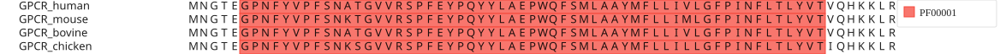

# react-msaview-cli

Command-line tools for [react-msaview](../) (JBrowseMSA), including batch
InterProScan processing for multiple sequence alignments.

Uses
[msa-parsers](https://github.com/GMOD/JBrowseMSA/tree/main/packages/msa-parsers)
for file format support.

## Installation

```bash
# From the monorepo root
pnpm install
pnpm --filter react-msaview-cli build

# Or install globally (after publishing)
pnpm add -g react-msaview-cli
```

## Commands

### interproscan

Run InterProScan on all sequences in an MSA file and output results as GFF3.

```bash
react-msaview-cli interproscan <input-msa> [options]
```

#### Options

| Option                       | Description                                            | Default                                 |
| ---------------------------- | ------------------------------------------------------ | --------------------------------------- |
| `-o, --output <file>`        | Output GFF file path                                   | `domains.gff`                           |
| `--local`                    | Use a local InterProScan installation instead of EBI   | `false`                                 |
| `--docker`                   | Run InterProScan via the `interpro/interproscan` image | `false`                                 |
| `--singularity`              | Run InterProScan via a Singularity/Apptainer container | `false`                                 |
| `--singularity-image `  | Singularity image to use                               | `docker://interpro/interproscan:latest` |
| `--interproscan-path <path>` | Path to local interproscan.sh                          | `interproscan.sh`                       |
| `--programs <list>`          | Comma-separated list of InterProScan programs          | `PfamA,CDD`                             |
| `--email <email>`            | Email for EBI API (used only for EBI API runs)         | `user@example.com`                      |
| `-h, --help`                 | Show help message                                      |                                         |

By default (no backend flag) the CLI submits sequences to the EBI InterProScan
REST API one at a time. `--local`, `--docker`, and `--singularity` instead run
InterProScan on the whole alignment locally, which is much faster for large
datasets.

#### Supported MSA formats

The CLI automatically detects the input format:

- **FASTA** (`.fasta`, `.fa`, `.faa`)
- **Clustal** (`.clustal`, `.aln`)
- **Stockholm** (`.sto`, `.stockholm`)
- **A3M** (`.a3m`) - AlphaFold/ColabFold format
- **EMF** (`.emf`) - Ensembl Multi Format

#### Available InterProScan programs

When using `--programs`, you can specify any combination of:

- `PfamA` - Protein families (part of the `PfamA,CDD` default)
- `SMART` - Simple Modular Architecture Research Tool
- `SUPERFAMILY` - Structural and functional annotation
- `Gene3D` - Structural domain assignments
- `CDD` - Conserved Domain Database
- `PANTHER` - Protein Analysis Through Evolutionary Relationships
- `TIGRFAM` - TIGR protein families
- `Hamap` - High-quality Automated Annotation of Microbial Proteomes
- `ProSiteProfiles` - PROSITE profiles
- `ProSitePatterns` - PROSITE patterns
- `PRINTS` - Protein fingerprints
- `PIRSF` - PIR SuperFamily
- `MobiDBLite` - Disorder prediction

### interpro

Build a domain GFF from InterPro's **precomputed** matches for UniProtKB
accessions, instead of submitting sequences to a live InterProScan job. Every
UniProtKB sequence already has InterPro matches computed and served by the EBI
InterPro API, so for inputs that are real UniProt accessions this is instant,
deterministic, and version-pinnable — no email or rate-limited job submission.
Prefer this over `interproscan` whenever your rows are UniProt accessions.

```bash
react-msaview-cli interpro <accessions.tsv> [options]
```

The input is one accession per line, optionally followed by a tab- or
space-separated row label; lines starting with `#` are ignored. The output GFF
is byte-for-byte compatible with the `interproscan` command.

#### Options

| Option                | Description                | Default       |
| --------------------- | -------------------------- | ------------- |
| `-o, --output <file>` | Output GFF file path       | `domains.gff` |
| `--database <name>`   | InterPro member db to read | `pfam`        |

```bash
react-msaview-cli interpro accessions.tsv -o domains.gff
react-msaview-cli interpro accessions.tsv -o domains.gff --database cdd
```

### genestructure

Build a **gene-structure GFF** for a coding-sequence alignment from a RefSeq
transcript, overlaid in react-msaview the same way InterProScan domains are. The
exon model is fetched from the NCBI Datasets v2 API; each species' Nth exon is
named `exon-N`, so a given exon is the same color in every row and the exon
architecture reads straight down the alignment.

```bash
react-msaview-cli genestructure <input-msa> --gene <symbol> --ref <rowname> [options]
```

The exon boundaries of the chosen transcript are mapped onto the reference row's
columns, then projected into every other row's own ungapped coordinates — so an
exon that picks up a frameshifting indel in one lineage gets shorter on exactly
that row while staying column-aligned with the rest. The reference row must be
the transcript's coding sequence (the CLI warns if its length doesn't match).

#### Options

| Option                | Description                                   | Default             |
| --------------------- | --------------------------------------------- | ------------------- |
| `--gene <symbol>`     | Gene symbol to look up in RefSeq (e.g. `F12`) |                     |
| `--taxon <name\|id>`  | Taxon for `--gene`                            | `human`             |
| `--gene-id <id>`      | NCBI GeneID, instead of `--gene`              |                     |
| `--transcript <acc>`  | Specific transcript accession                 | MANE/RefSeq Select  |
| `--ref <rowname>`     | Reference row = the transcript's CDS          | first row           |
| `-o, --output <file>` | Output GFF file path                          | `genestructure.gff` |

```bash
# F12 coding alignment -> 14-exon overlay (MANE Select transcript, human row)
react-msaview-cli genestructure f12-cds.stock --gene F12 --ref human -o exons.gff

# pin a specific transcript
react-msaview-cli genestructure aln.fa --transcript NM_000505.4 --ref human
```

### export-svg

Render an alignment (with an optional tree and domain overlay) straight to a
standalone SVG — no browser required. This is what the R package shells out to
for vector export.

```bash
react-msaview-cli export-svg --msa <file> [options]
```

#### Options

| Option                   | Description                             | Default         |
| ------------------------ | --------------------------------------- | --------------- |
| `--msa <file>`           | MSA file (FASTA, Stockholm, or Clustal) | _required_      |
| `--tree <file>`          | Newick tree file                        |                 |
| `--gff <file>`           | InterProScan domain GFF file            |                 |
| `-o, --output <file>`    | Output SVG file path                    | `alignment.svg` |
| `--color-scheme <name>`  | Color scheme                            | `maeditor`      |
| `--width <px>`           | Canvas width in pixels                  | `1200`          |
| `--height <px>`          | Canvas height in pixels                 | `600`           |
| `--tree-area-width <px>` | Tree panel width in pixels              |                 |

```bash
react-msaview-cli export-svg --msa alignment.fasta -o alignment.svg
react-msaview-cli export-svg --msa alignment.fasta --tree tree.nwk -o alignment.svg
react-msaview-cli export-svg --msa alignment.fasta --gff domains.gff \
  --color-scheme clustalx_protein_dynamic -o alignment.svg
```

## Examples

### Using the EBI API (recommended for small datasets)

```bash
# Basic usage - runs the default PfamA + CDD analysis
react-msaview-cli interproscan alignment.fasta -o domains.gff --email your@email.com

# Multiple programs
react-msaview-cli interproscan alignment.fasta -o domains.gff \
  --programs PfamA,SMART,Gene3D \
  --email your@email.com
```

### Using local InterProScan

For large datasets or frequent usage, install InterProScan locally:

```bash
# With interproscan.sh in PATH
react-msaview-cli interproscan alignment.fasta -o domains.gff --local

# With custom path
react-msaview-cli interproscan alignment.fasta -o domains.gff \
  --local \
  --interproscan-path /opt/interproscan/interproscan.sh

# With specific programs
react-msaview-cli interproscan alignment.fasta -o domains.gff \
  --local \
  --programs PfamA,SMART
```

### Using Docker

No local InterProScan install needed — just Docker:

```bash
react-msaview-cli interproscan alignment.fasta -o domains.gff --docker
```

This mounts a temp directory into the `interpro/interproscan` container, runs
the scan on the whole alignment at once, and reads the JSON back out.

### Using Singularity / Apptainer

On HPC clusters where Docker is unavailable:

```bash
# Pull from Docker Hub (requires network)
react-msaview-cli interproscan alignment.fasta -o domains.gff --singularity

# Or use a pre-pulled .sif image
react-msaview-cli interproscan alignment.fasta -o domains.gff \
  --singularity \
  --singularity-image /path/to/interproscan.sif
```

### Different input formats

```bash
# Clustal format
react-msaview-cli interproscan alignment.clustal -o domains.gff

# Stockholm format
react-msaview-cli interproscan PF00001.stockholm -o domains.gff

# A3M format (from ColabFold/AlphaFold)
react-msaview-cli interproscan colabfold.a3m -o domains.gff
```

## Worked example

```console
$ react-msaview-cli interproscan gpcrs.fasta -o domains.gff --docker
Reading MSA from gpcrs.fasta...
Found 4 sequences
Processing 4 non-empty sequences...
Running InterProScan via Docker...
  Running InterProScan via Docker on 4 sequences (image: interpro/interproscan:latest)...
  docker run --rm -v /tmp/interproscan-Xyz12:/data interpro/interproscan:latest -i /data/input.fasta -o /data/output.json -f JSON -appl PfamA,CDD
Converting results to GFF...
Writing output to domains.gff...
Done!
```

## Output format

The output is standard GFF3, with one `protein_match` line per domain hit.
`start`/`end` are 1-based positions in the **ungapped** sequence (gaps are
stripped before scanning), and the attributes carry the signature accession,
name, and description:

```gff
##gff-version 3
seq1	InterProScan	protein_match	10	150	.	.	.	Name=PF00001;signature_desc=7tm_1;description=7 transmembrane receptor (rhodopsin family)
seq1	InterProScan	protein_match	200	350	.	.	.	Name=PF00002;signature_desc=7tm_2;description=7 transmembrane receptor (Secretin family)
seq2	InterProScan	protein_match	5	120	.	.	.	Name=PF00001;signature_desc=7tm_1;description=7 transmembrane receptor (rhodopsin family)
```

## Loading results in react-msaview

After generating the GFF file, you can load it in react-msaview:

- Open your MSA file in react-msaview
- Go to **Menu > Open domains...** and select the generated GFF file
- Domains appear as colored boxes on the alignment

In the React component, pass it inline as the `gff` prop (see the "Protein
domains" example in `packages/examples`):

```jsx
<MSAViewer msa={msaText} gff={domainsGff} />
```

From R, pass the file (or string) as the `gff` argument:

```r
msaview(msa = "alignment.fasta", gff = "domains.gff")
```

The domains render as labeled boxes over the matching rows:



## Troubleshooting

### EBI API timeout

If you get timeout errors with the EBI API:

- Use `--local`, `--docker`, or `--singularity` to run InterProScan yourself
- Check your internet connection
- For large datasets, a local/container backend is much faster than the API

### Local InterProScan not found

```
Error: Failed to run Local: spawn interproscan.sh ENOENT. Is interproscan.sh installed and on PATH?
```

Make sure InterProScan is installed and specify the full path:

```bash
--interproscan-path /full/path/to/interproscan-5.xx/interproscan.sh
```

### No results in output

- Check that your sequences are protein sequences (not nucleotide)
- Try different programs (some may not have hits for your sequences)
- Verify the input file is valid MSA format

## API rate limits

The EBI InterProScan API has usage limits:

- Sequences are submitted one at a time, sequentially, to avoid overwhelming the
  server
- For large datasets (>100 sequences), use `--local`, `--docker`, or
  `--singularity` instead

## License

MIT
