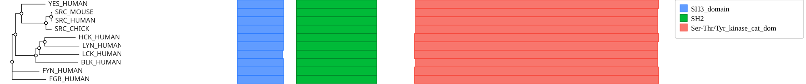
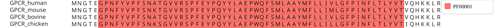
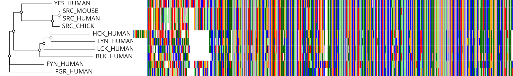
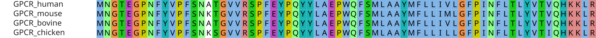

# react-msaview-cli

Annotate a multiple sequence alignment and render it to a publication figure,
from the command line, with no browser in the loop.

Two things live here, and they compose:

- **Annotate** — build a domain or exon GFF for an alignment, from InterPro's
  precomputed matches (`interpro`), a live InterProScan run (`interproscan`), or
  a RefSeq transcript's exon model (`genestructure`).
- **Render** — draw the alignment, its tree, and those annotations to a
  standalone SVG (`export-svg`). This is the same renderer the web viewer uses,
  driven headlessly, so the figure matches what the app shows.

## Prerequisites

- NodeJS v22+

Nothing else for `export-svg` and `interpro`. `interproscan` needs a backend to
scan with — the EBI web API (the default, no install), or Docker, Singularity,
or a local InterProScan (see [interproscan](#interproscan)).

## Setup

```bash
npm install -g react-msaview-cli
```

From a clone of the monorepo instead:

```bash
pnpm install
pnpm --filter react-msaview-cli build
```

## Quickstart

An Src-family kinase alignment with its tree and Pfam domains, rendered in two
commands. The first asks InterPro for the domains of each row; the second draws
the figure.

```bash
react-msaview-cli interpro accessions.tsv -o domains.gff

react-msaview-cli export-svg --msa kinases.aln --tree kinases.nwk \
  --gff domains.gff --col-width 1.6 --row-height 14 --tree-area-width 200 \
  -o kinases.svg
```



The domain architecture reads straight down the alignment — SH3, then SH2, then
the catalytic domain — because every row is drawn in the alignment's own column
space. The key on the right is generated from the domains actually present.

Every figure on this page is `export-svg` output, drawn from the Src-kinase and
GPCR examples in
[packages/examples](https://github.com/GMOD/JBrowseMSA/tree/main/packages/examples/src/examples/exampleData.ts).

## Rendering figures

```bash
react-msaview-cli export-svg --msa <file> [options]
```

| Option                   | Description                                  | Default         |
| ------------------------ | -------------------------------------------- | --------------- |
| `--msa <file>`           | MSA file (FASTA, Stockholm, Clustal, A3M)    | _required_      |
| `--tree <file>`          | Newick tree file                             |                 |
| `--gff <file>`           | Domain or exon GFF (from the commands below) |                 |
| `-o, --output <file>`    | Output SVG file path                         | `alignment.svg` |
| `--color-scheme <name>`  | Color scheme                                 | `maeditor`      |
| `--col-width <px>`       | Width of one alignment column                | `12`            |
| `--row-height <px>`      | Height of one alignment row                  | `16`            |
| `--width <px>`           | Viewport width, which sets the tree area     | `1200`          |
| `--height <px>`          | Viewport height                              | `600`           |
| `--tree-area-width <px>` | Tree panel width in pixels                   |                 |

### Sizing the figure

`export-svg` always draws the **entire** alignment, so the output is as wide as
the alignment is long — `--width` and `--height` size the viewport the model
lays out in, not the figure. What scales the figure is `--col-width` and
`--row-height`:

```bash
## a 90-column alignment at the default 12px columns: letters are legible
react-msaview-cli export-svg --msa gpcrs.fa -o gpcrs.svg
```



```bash
## an 856-column alignment at 1.4px columns: an overview, no letters
react-msaview-cli export-svg --msa kinases.aln --tree kinases.nwk \
  --col-width 1.4 --row-height 16 --tree-area-width 280 -o overview.svg
```



Residue letters draw only where there is room for them — columns at least 5px
wide and wider than half the row height, rows at least 8px tall — which is the
same rule the app applies as you zoom out. Below that you get the colored
overview above, and for a whole-alignment figure that is usually what you want:
the conserved blocks and the gaps are the signal at that scale, and the letters
would be unreadable ink.

### Color schemes

```bash
react-msaview-cli export-svg --msa gpcrs.fa \
  --color-scheme clustalx_protein_dynamic -o gpcrs.svg
```



`maeditor` (the default), `clustal`, `clustalx_protein`, `lesk`, `flower`,
`cinema`, and the `jalview_*` family (`jalview_zappo`, `jalview_taylor`,
`jalview_hydrophobicity`, `jalview_buried`, `jalview_prophelix`,
`jalview_propstrand`, `jalview_propturn`) color each residue by identity. The
two `_dynamic` schemes — `clustalx_protein_dynamic` and
`percent_identity_dynamic` — color by what the column actually contains, so
conservation shows up as color rather than as something you have to read off.
`nucleotide`, `clustalx_dna`, `jbrowse_dna` and `rainbow_dna` are for DNA;
`none` turns background color off.

### Output

The SVG is pure vector: every cell is its own rectangle, so it scales without
limit but grows with the alignment. A 10-row by 856-column figure is about
700KB. Converting to PNG or PDF for a journal:

```bash
rsvg-convert -w 2000 alignment.svg -o alignment.png
inkscape alignment.svg --export-filename=alignment.pdf
```

Exports are reproducible — the same input gives the same bytes, so a figure can
be regenerated in CI and diffed.

## Annotating

### interpro

Build a domain GFF from InterPro's **precomputed** matches for UniProtKB
accessions, instead of submitting sequences to a live InterProScan job. Every
UniProtKB sequence already has InterPro matches computed and served by the EBI
InterPro API, so for inputs that are real UniProt accessions this is instant,
deterministic, and version-pinnable — no email or rate-limited job submission.
Prefer this over `interproscan` whenever your rows are UniProt accessions.

```bash
react-msaview-cli interpro <accessions.tsv> [options]
```

The input is one accession per line, optionally followed by a tab- or
space-separated row label; lines starting with `#` are ignored. The output GFF
is byte-for-byte compatible with the `interproscan` command.

| Option                | Description                       | Default       |
| --------------------- | --------------------------------- | ------------- |
| `-o, --output <file>` | Output GFF file path              | `domains.gff` |
| `--database <name>`   | InterPro member db to read        | `pfam`        |
| `--no-cache`          | Re-fetch, ignoring the disk cache | off           |

```bash
react-msaview-cli interpro accessions.tsv -o domains.gff
react-msaview-cli interpro accessions.tsv -o domains.gff --database cdd
```

#### Caching

The InterPro API serves one protein per request — there is no batch endpoint —
so the request count is fixed at one per distinct accession. To keep that from
being paid twice, every response is cached on disk under
`$XDG_CACHE_HOME/react-msaview-cli/interpro` (override with
`REACT_MSAVIEW_CACHE`), keyed by InterPro release so a new release misses
cleanly rather than serving coordinates computed against the old one. Proteins
with no matches are cached too, so they are not re-fetched every run.

A re-run of the same dataset therefore makes one request — the release lookup —
and answers the rest from disk. That also makes a failed run resumable: retries
are automatic with backoff, and if the API is still unreachable the accessions
already fetched stay cached, so re-running picks up where it stopped instead of
asking EBI for all of them again.

### interproscan

Run InterProScan on all sequences in an MSA file and output results as GFF3. Use
this when the rows are not UniProt accessions — a de novo assembly, predicted
proteins, anything InterPro has not already scanned.

```bash
react-msaview-cli interproscan <input-msa> [options]
```

| Option                       | Description                                            | Default                                 |
| ---------------------------- | ------------------------------------------------------ | --------------------------------------- |
| `-o, --output <file>`        | Output GFF file path                                   | `domains.gff`                           |
| `--local`                    | Use a local InterProScan installation instead of EBI   | `false`                                 |
| `--docker`                   | Run InterProScan via the `interpro/interproscan` image | `false`                                 |
| `--singularity`              | Run InterProScan via a Singularity/Apptainer container | `false`                                 |
| `--singularity-image `  | Singularity image to use                               | `docker://interpro/interproscan:latest` |
| `--interproscan-path <path>` | Path to local interproscan.sh                          | `interproscan.sh`                       |
| `--programs <list>`          | Comma-separated list of InterProScan programs          | `PfamA,CDD`                             |
| `--email <email>`            | Email for EBI API (used only for EBI API runs)         | `user@example.com`                      |

By default (no backend flag) the CLI submits sequences to the EBI InterProScan
REST API one at a time. `--local`, `--docker`, and `--singularity` instead run
InterProScan on the whole alignment locally, which is much faster for large
datasets.

#### Choosing a backend

```bash
## EBI web API — no install, but one sequential submission per sequence
react-msaview-cli interproscan alignment.fasta -o domains.gff --email you@example.com

## Docker — no InterProScan install, whole alignment in one run
react-msaview-cli interproscan alignment.fasta -o domains.gff --docker

## a local install
react-msaview-cli interproscan alignment.fasta -o domains.gff \
  --local --interproscan-path /opt/interproscan/interproscan.sh

## Singularity/Apptainer, for HPC clusters without Docker
react-msaview-cli interproscan alignment.fasta -o domains.gff \
  --singularity --singularity-image /path/to/interproscan.sif
```

Docker mounts a temp directory into the `interpro/interproscan` container, runs
the scan on the whole alignment at once, and reads the JSON back out.

The EBI API has usage limits: sequences go one at a time, sequentially, to avoid
overwhelming the server. Past about 100 sequences, use a local or container
backend.

#### InterProScan programs

`--programs` takes any combination of `PfamA` (in the default), `CDD` (in the
default), `SMART`, `SUPERFAMILY`, `Gene3D`, `PANTHER`, `TIGRFAM`, `Hamap`,
`ProSiteProfiles`, `ProSitePatterns`, `PRINTS`, `PIRSF`, and `MobiDBLite`.

```bash
react-msaview-cli interproscan alignment.fasta -o domains.gff \
  --programs PfamA,SMART,Gene3D --email you@example.com
```

### genestructure

Build a **gene-structure GFF** for a coding-sequence alignment from a RefSeq
transcript, overlaid the same way InterProScan domains are. The exon model is
fetched from the NCBI Datasets v2 API; each species' Nth exon is named `exon-N`,
so a given exon is the same color in every row and the exon architecture reads
straight down the alignment.

```bash
react-msaview-cli genestructure <input-msa> --gene <symbol> --ref <rowname> [options]
```

The exon boundaries of the chosen transcript are mapped onto the reference row's
columns, then projected into every other row's own ungapped coordinates — so an
exon that picks up a frameshifting indel in one lineage gets shorter on exactly
that row while staying column-aligned with the rest. The reference row must be
the transcript's coding sequence (the CLI warns if its length doesn't match).

| Option                | Description                                   | Default             |
| --------------------- | --------------------------------------------- | ------------------- |
| `--gene <symbol>`     | Gene symbol to look up in RefSeq (e.g. `F12`) |                     |
| `--taxon <name\|id>`  | Taxon for `--gene`                            | `human`             |
| `--gene-id <id>`      | NCBI GeneID, instead of `--gene`              |                     |
| `--transcript <acc>`  | Specific transcript accession                 | MANE/RefSeq Select  |
| `--ref <rowname>`     | Reference row = the transcript's CDS          | first row           |
| `-o, --output <file>` | Output GFF file path                          | `genestructure.gff` |

```bash
## F12 coding alignment -> 14-exon overlay (MANE Select transcript, human row)
react-msaview-cli genestructure f12-cds.stock --gene F12 --ref human -o exons.gff

## pin a specific transcript
react-msaview-cli genestructure aln.fa --transcript NM_000505.4 --ref human
```

## Input formats

The CLI detects the MSA format from the file:

- **FASTA** (`.fasta`, `.fa`, `.faa`)
- **Clustal** (`.clustal`, `.aln`)
- **Stockholm** (`.sto`, `.stockholm`)
- **A3M** (`.a3m`) — AlphaFold/ColabFold
- **EMF** (`.emf`) — Ensembl Multi Format

## Annotation output format

The annotation commands write standard GFF3, one `protein_match` line per hit.
`start`/`end` are 1-based positions in the **ungapped** sequence (gaps are
stripped before scanning), and the attributes carry the signature accession,
name, and description:

```gff
##gff-version 3
seq1	InterProScan	protein_match	10	150	.	.	.	Name=PF00001;signature_desc=7tm_1;description=7 transmembrane receptor (rhodopsin family)
seq1	InterProScan	protein_match	200	350	.	.	.	Name=PF00002;signature_desc=7tm_2;description=7 transmembrane receptor (Secretin family)
seq2	InterProScan	protein_match	5	120	.	.	.	Name=PF00001;signature_desc=7tm_1;description=7 transmembrane receptor (rhodopsin family)
```

A worked run:

```console
$ react-msaview-cli interproscan gpcrs.fasta -o domains.gff --docker
Reading MSA from gpcrs.fasta...
Found 4 sequences
Processing 4 non-empty sequences...
Running InterProScan via Docker...
  Running InterProScan via Docker on 4 sequences (image: interpro/interproscan:latest)...
  docker run --rm -v /tmp/interproscan-Xyz12:/data interpro/interproscan:latest -i /data/input.fasta -o /data/output.json -f JSON -appl PfamA,CDD
Converting results to GFF...
Writing output to domains.gff...
Done!
```

## Using the GFF elsewhere

The same file the CLI writes loads into every other front end.

In the web viewer, select it in the import form's **Annotation GFF file or URL**
field. (The **Annotations > Open InterProScan results...** menu item takes
InterProScan JSON rather than GFF, so use the import form for the file generated
above.)

In the React component, pass it inline as the `gff` prop:

```jsx
<MSAViewer msa={msaText} gff={domainsGff} />
```

From R:

```r
msaview(msa = "alignment.fasta", gff = "domains.gff")
```

## Troubleshooting

**EBI API timeout.** Use `--local`, `--docker`, or `--singularity` to run
InterProScan yourself. For large datasets those are much faster than the API
regardless.

**Local InterProScan not found.**

```
Error: Failed to run Local: spawn interproscan.sh ENOENT. Is interproscan.sh installed and on PATH?
```

Give the full path:
`--interproscan-path /full/path/to/interproscan-5.xx/interproscan.sh`

**No results in the output.** Check that the sequences are protein, not
nucleotide; try other `--programs`; verify the input parses as one of the
formats above.

**The exported figure is enormous.** `export-svg` draws the whole alignment at
`--col-width` per column. Drop `--col-width` until it fits — below ~8px the
residue letters stop drawing, which is most of the file size.

## Uses

[msa-parsers](https://github.com/GMOD/JBrowseMSA/tree/main/packages/msa-parsers)
for file format support, and
[react-msaview](https://github.com/GMOD/JBrowseMSA/tree/main/packages/lib) for
rendering.

## License

MIT
