# react-msaview examples

A lightweight Vite site demonstrating different ways to use `react-msaview`.
Each example renders a live viewer alongside its own source code.

Deployed at https://jbrowse.org/storybook/msa/

### Protein alignment with a tree


### Nucleotide alignment

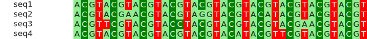

### Protein domains (InterProScan GFF)


### Real domains: Src-family kinases

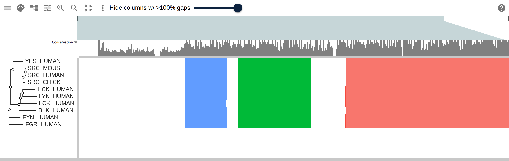

A real Src-family kinase family with its tree and real InterProScan annotations
— the signature SH3 + SH2 + kinase domains generated by
`react-msaview-cli interproscan`.

### Large tree: Lysine riboswitch

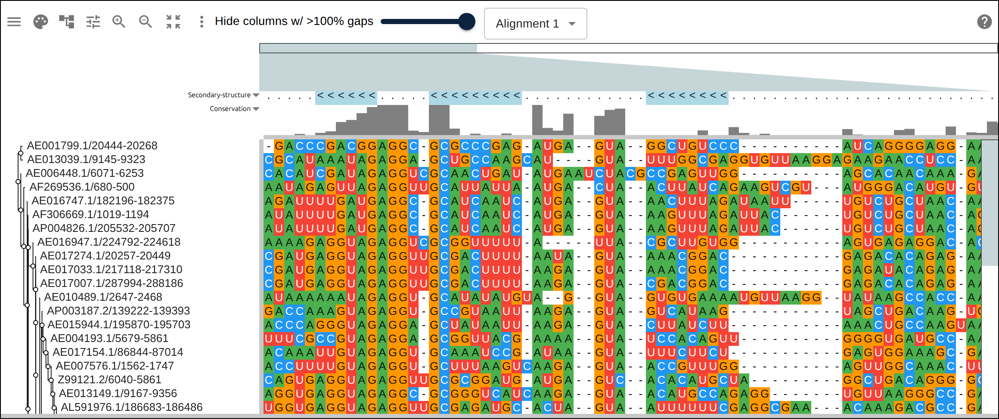

A real ~60 sequence ncRNA family (Rfam Lysine riboswitch) with its full
inferred tree, showing the canvas tiling holds up past toy data.

### Reference dots: MyD88 across bats

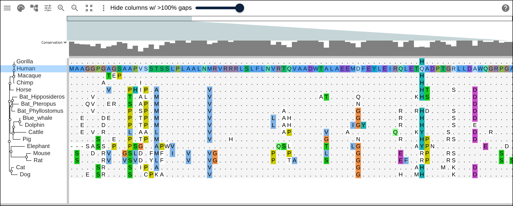

MyD88 across mammals (including three bats), diffed against human with
`relativeTo` so identical residues render as dots and only the lineage-specific
substitutions show as letters, beside the inferred tree.

### Gene duplication: globin family

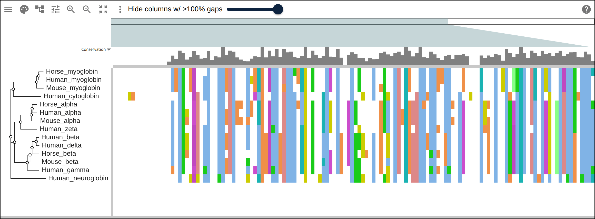

Hemoglobin α/β, myoglobin, neuroglobin and cytoglobin — the inferred tree groups
sequences by globin **type**, not by species, the signature of gene duplication.

### Host range: ACE2 (SARS-CoV-2 receptor)

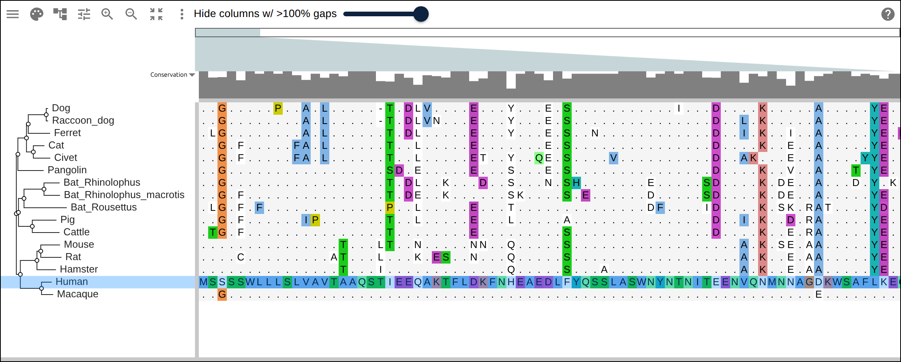

ACE2 across mammals (bats, civet, pangolin, resistant rodents) diffed against
human, so the few divergent spike-contact positions that drive viral
susceptibility stand out of the otherwise-conserved protein.

### Color vision: opsin duplications

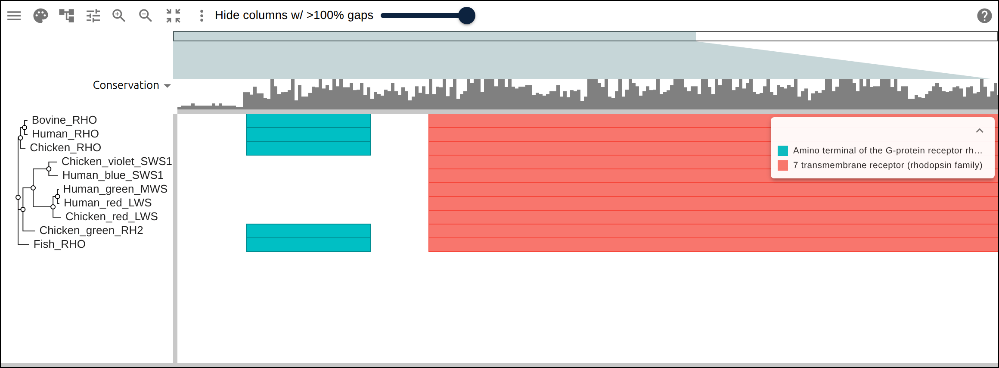

Vertebrate visual pigments sorted by opsin class (rhodopsins vs cone opsins),
with a real InterProScan 7TM-GPCR domain overlay.

### Extreme conservation: histone H4

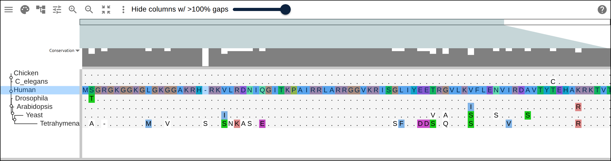

H4 across eukaryotes (human to chicken, fly, worm, plant, yeast, ciliate) diffed
against human — one of the most conserved proteins known is almost entirely
dots, the opposite extreme from a fast-evolving protein.

### Deep phylogeny: cytochrome c

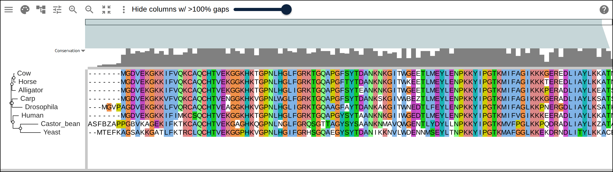

Cytochrome c from mammals through reptile, fish and insect to plant and fungus
in one short alignment — the inferred tree spans over a billion years.

### Convergent evolution: prestin / echolocation

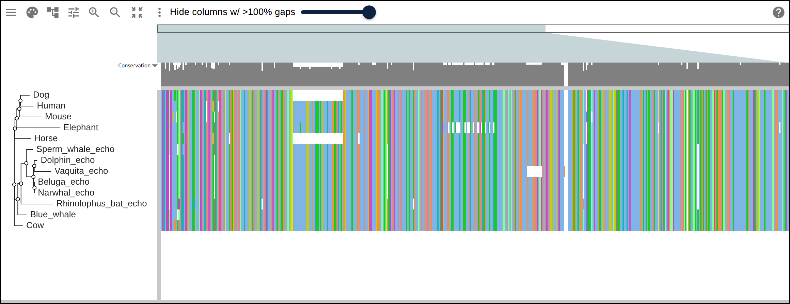

Prestin (SLC26A5): echolocating bats and toothed whales convergently evolved
shared substitutions, so the `_echo` species cluster together in the tree
against the species tree.

### Conservation within a protein: p53

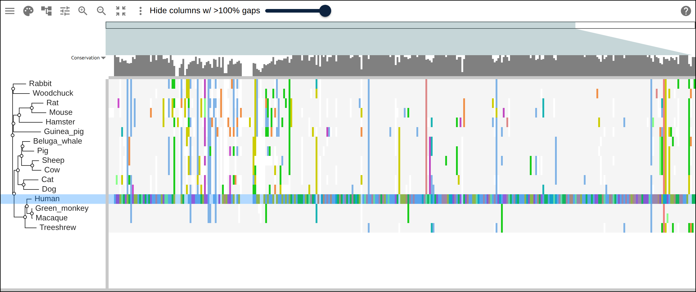

p53 diffed against human — the central DNA-binding domain (where cancer
mutations fall) collapses to dots while the variable N/C-termini stay full of
letters, showing where selection acts within one protein.

> The vector figures above are generated headlessly from the viewer's own SVG
> export via `pnpm figures` (see `packages/lib/scripts/generateFigures.tsx`).
> The real-data examples are PNG screenshots from `pnpm screenshots` (their
> full-length vector export would be many MB), see
> `scripts/screenshots/specs.mjs`. The protein-family alignments and trees are
> built reproducibly from UniProt with ClustalW — see
> `scripts/examples-gen/README.md`.

## Develop

```sh
pnpm --filter examples dev
```

## Build

```sh
pnpm --filter examples build
```

Outputs a static site to `dist/` (relative `base`, so it works under the
`/storybook/msa/` subpath).

## Deploy

CI deploys automatically on pushes to `main` (see `.github/workflows/push.yml`).
To deploy manually:

```sh
pnpm --filter examples build
aws s3 sync --delete packages/examples/dist s3://jbrowse.org/storybook/msa
aws cloudfront create-invalidation --distribution-id E13LGELJOT4GQO --paths "/storybook/msa/*"
```

## Adding an example

Add a `src/examples/MyExample.tsx` that default-exports a component, then
register it in `src/examples/index.ts` (the `?raw` import shows its source in
the UI).
