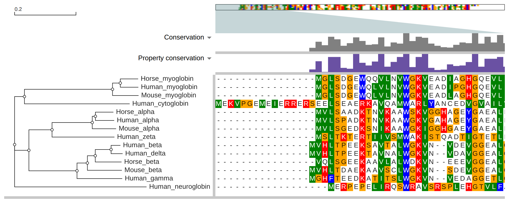
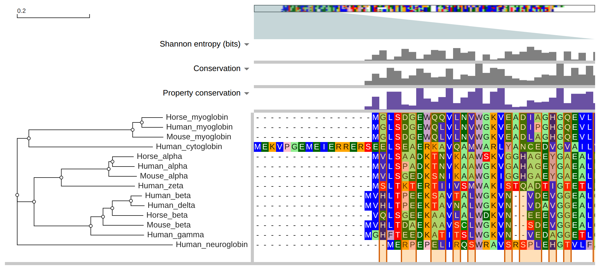

# msaview-widget

A notebook widget for [react-msaview](https://github.com/GMOD/JBrowseMSA): a
multiple sequence alignment beside its phylogenetic tree, in JupyterLab, Jupyter
Notebook, VS Code and any other host [anywidget](https://anywidget.dev)
supports. The distribution is `msaview-widget` and the import is `msaview`,
because the name `msaview` on PyPI belongs to another project.



## Install

The wheel ships the widget's JavaScript, which a checkout builds first:

```sh
pnpm install
pnpm --filter msaview-widget build
pip install packages/python
```

## Quick start

```python
from msaview import MSAView

view = MSAView(msa="globin.aln", tree="globin.nh", hide_header=True)
view
```

Setting a trait updates the widget in place and keeps its scroll and zoom:

```python
view.color_scheme = "clustal"
view.highlights = [{"row": "Human_beta", "start": 64, "end": 64, "label": "distal His"}]
```

## Traits

The traits are the `MSAViewer` props in
[USAGE.md](https://github.com/GMOD/JBrowseMSA/blob/main/USAGE.md), in snake
case. `highlights` and `column_tracks` take the JSON shapes in
[docs/layers.md](https://github.com/GMOD/JBrowseMSA/blob/main/docs/layers.md).

| Trait                            | Value                                                           |
| -------------------------------- | --------------------------------------------------------------- |
| `msa`, `tree`, `gff`             | document text or a file path                                    |
| `msa_url`, `tree_url`, `gff_url` | a URL the viewer fetches                                        |
| `color_scheme`                   | a scheme name, such as `"clustal"` or `"nucleotide"`            |
| `height`                         | pixels                                                          |
| `col_width`, `row_height`        | pixels per column and per row                                   |
| `highlights`                     | list of `{start, end}`, `{row, start, end}` or `{rows}`         |
| `highlight_columns`              | columns (1-based) under a persistent overlay                    |
| `residue_mappings`               | which structure residue each row residue is                     |
| `column_tracks`                  | list of bar, text or arc tracks                                 |
| `relative_to`                    | a row name; other rows draw as their differences from it        |
| `region`                         | `{start, end}` columns or `{row, start, end}` residues          |
| `allowed_gappyness`              | hide columns at least this percent gaps (default 100)           |
| `draw_tree`, `show_branch_len`   | booleans, default `True`                                        |
| `tree_area_width`                | pixels; `auto_tree_area_width` sizes it to the labels           |
| `residue_encoding`               | `"fill"` (default) paints the cell; `"color"` paints the letter |
| `hide_header`                    | boolean, default `False`                                        |
| `theme`                          | `"auto"` (default), `"light"`, `"dark"` or MUI theme options    |

`theme="auto"` follows JupyterLab's and Notebook 7's `data-jp-theme-light`
attribute, then VS Code's `data-vscode-theme-kind`, then the browser's
`prefers-color-scheme`, and switches when the host does.

The widget sets two traits from the browser:

- `clicked`: the cell a click pinned, `{column, row, residue, letter}`, or
  `None` after a click clears it
- `viewport`: the columns on screen, `{startColumn, endColumn}`, once a scroll
  or zoom settles

Both are 1-based. `column` counts every column of the alignment, and `residue`
counts the clicked row's own letters. The widget keeps hover in the browser,
since a comm message per pointer move would flood the kernel.

```python
view.observe(lambda change: print(change["new"]), "clicked")
```

## Python inputs

The package converts only what JSON cannot carry:

- `msa=` takes a `dict` of name to aligned sequence, a Biopython
  `MultipleSeqAlignment`, or a `Bio.Align.Alignment`
- `tree=` takes a `Bio.Phylo` tree
- `msa=`, `tree=` and `gff=` take a `pathlib.Path` or a filename string
- a column track's `values` takes a numpy array or pandas Series, and a NaN in
  it draws no bar

## Examples

[examples/01_quickstart.ipynb](https://github.com/GMOD/JBrowseMSA/blob/main/packages/python/examples/01_quickstart.ipynb)
opens the globin alignment from `packages/examples/data`.
[examples/02_entropy_and_clicks.ipynb](https://github.com/GMOD/JBrowseMSA/blob/main/packages/python/examples/02_entropy_and_clicks.ipynb)
draws per-column Shannon entropy as a bar track, highlights the columns above an
ipywidgets slider's threshold, and prints the letter each row has at a clicked
column.



[Influenza drift in a notebook](https://gmod.org/JBrowseMSA/tutorials/notebook_flu_drift)
is the long version: 25 H3N2 vaccine strains from NCBI, aligned, with a
per-column count of how often each column changed and a band on each antigenic
site.

`scripts/run_examples.py` executes both notebooks in a kernel, and
`scripts/screenshot_examples.mjs` renders the widgets they built into `images/`:

```sh
pip install -e "packages/python[examples]"
python packages/python/scripts/run_examples.py
```

## Development

```sh
pip install -e "packages/python[dev]"
pytest packages/python/tests
pnpm vitest run packages/python
```
