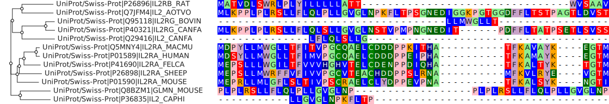
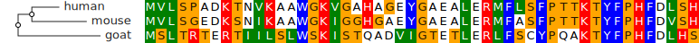
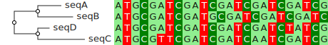
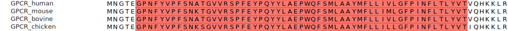

# msaviewr

Interactive multiple sequence alignment viewer for R, powered by
[react-msaview](https://github.com/GMOD/react-msaview). Renders as an htmlwidget
in RStudio, R Markdown, Quarto, and Shiny.



## Installation

```r
# Install from the local package
devtools::install("packages/r-msaview")

# Or install dependencies and load directly
install.packages("htmlwidgets")
```

For Bioconductor interop:

```r
BiocManager::install(c("Biostrings", "ggtree", "treeio"))
```

## Quick start

```r
library(msaviewr)

msaview(
  msa = ">human\nMVLSPADKTNVKAAWGKVGAHAGEYGAEALERMFLSFPTTKTYFPHFDLSH\n>mouse\nMVLSGEDKSNIKAAWGKIGGHGAEYGAEALERMFASFPTTKTYFPHFDVSH\n>goat\nMSLTRTERTIILSLWSKISTQADVIGTETLERLFSCYPQAKTYFPHFDLHS",
  tree = "((human:0.1,mouse:0.2):0.05,goat:0.3);"
)
```



## Examples

### Named character vector

```r
seqs <- c(
  human = "MVLSPADKTNVKAAWGKVGAHAGEYGAEALERMFLSFPTTKTYFPHFDLSH",
  mouse = "MVLSGEDKSNIKAAWGKIGGHGAEYGAEALERMFASFPTTKTYFPHFDVSH",
  goat  = "MSLTRTERTIILSLWSKISTQADVIGTETLERLFSCYPQAKTYFPHFDLHS"
)
msaview(msa = seqs, tree = "((human:0.1,mouse:0.2):0.05,goat:0.3);")
```

### From files

```r
msaview(msa = "alignment.stock")
msaview(msa = "alignment.fa", tree = "tree.nwk")
```

### With ape

```r
library(ape)

tree <- rtree(15)
seqs <- setNames(
  replicate(15, paste0(sample(c("A","C","G","T"), 300, TRUE), collapse = "")),
  tree$tip.label
)
msaview(msa = seqs, tree = tree, color_scheme = "nucleotide")
```



### Cladogram (no branch lengths)

```r
msaview(msa = seqs, tree = tree, show_branch_len = FALSE)
```

### With Biostrings

```r
library(Biostrings)

# DNAStringSet
dna <- DNAStringSet(c(
  seq1 = "ATGCGATCGATCGATCG--ATCG",
  seq2 = "ATGCGATCGATCGATCGATCGATCG",
  seq3 = "ATGCG--CGATCGATCGATCGATCG",
  seq4 = "ATGCGATCGATCGATCG--ATCG"
))
msaview(msa = dna, color_scheme = "nucleotide")

# AAStringSet
aa <- AAStringSet(c(
  human = "MVLSPADKTNVKAAWGKVGAHAGEYGAEALERMFLSFPTTKTYFPHFDLSH",
  mouse = "MVLSGEDKSNIKAAWGKIGGHGAEYGAEALERMFASFPTTKTYFPHFDVSH",
  goat  = "MSLTRTERTIILSLWSKISTQADVIGTETLERLFSCYPQAKTYFPHFDLHS"
))
msaview(msa = aa, color_scheme = "clustal")

# DNAMultipleAlignment
aln <- DNAMultipleAlignment(c(
  "ATGCGATCGATCGATCG--ATCG",
  "ATGCGATCGATCGATCGATCGATCG",
  "ATGCG--CGATCGATCGATCGATCG"
), rowmask = as(IRanges(), "NormalIRanges"))
msaview(msa = aln)
```

### After running the msa package

```r
library(msa)
library(Biostrings)

unaligned <- readAAStringSet("proteins.fasta")
aligned <- msa(unaligned, method = "ClustalOmega")
msaview(msa = as(aligned, "AAStringSet"))
```

### Domain annotations

Overlay InterProScan-style protein domains as boxes on the alignment. The `gff`
argument accepts a file path, a GFF3 string, or a data frame. This pairs with
the [CLI](../cli/), which writes domains as GFF3:

```sh
react-msaview-cli interproscan proteins.fasta -o domains.gff
```

```r
seqs <- c(
  GPCR_human  = "MNGTEGPNFYVPFSNATGVVRSPFEYPQYYLAEPWQFSMLAAYMFLLIVLGFPINFLTLYVTVQHKKLR",
  GPCR_mouse  = "MNGTEGPNFYVPFSNKTGVVRSPFEYPQYYLAEPWQFSMLAAYMFLLIMLGFPINFLTLYVTVQHKKLR",
  GPCR_bovine = "MNGTEGPNFYVPFSNATGVVRSPFEYPQYYLAEPWQFSMLAAYMFLLIVLGFPINFLTLYVTVQHKKLR"
)

# from a CLI-generated GFF file
msaview(msa = seqs, gff = "domains.gff")

# or from a data frame (columns: seqname, start, end, name, description)
domains <- data.frame(
  seqname     = names(seqs),
  start       = 6,
  end         = 62,
  name        = "PF00001",
  description = "7tm receptor (rhodopsin family)"
)
msaview(msa = seqs, gff = domains, color_scheme = "clustalx_protein_dynamic")
```



### With ggtree

Pass a ggtree plot object directly as the `tree` argument. The phylogenetic
topology is extracted automatically.

```r
library(ggtree)
library(ape)

tree <- rtree(20)
p <- ggtree(tree) + geom_tiplab()

seqs <- setNames(
  replicate(20, paste0(sample(c("A","C","G","T"), 200, TRUE), collapse = "")),
  tree$tip.label
)

# pass the ggtree plot object directly
msaview(msa = seqs, tree = p, color_scheme = "nucleotide")
```

### ggtree with annotations

Annotated ggtree plots work too. Only the tree topology is extracted;
ggtree-specific annotations (colors, labels, metadata) stay in ggtree.

```r
metadata <- data.frame(
  label = tree$tip.label,
  group = sample(c("A", "B", "C"), 20, replace = TRUE)
)
p2 <- ggtree(tree) %<+% metadata +
  geom_tiplab(aes(color = group)) +
  theme(legend.position = "right")

msaview(msa = seqs, tree = p2)
```

### With treeio

```r
library(treeio)

# treedata objects from read.beast, read.raxml, etc.
beast_tree <- read.beast("beast_output.tree")
msaview(tree = beast_tree)

# or convert from phylo
td <- as.treedata(tree)
msaview(msa = seqs, tree = td)
```

### In Shiny

```r
library(shiny)
library(msaviewr)

ui <- fluidPage(
  titlePanel("MSA Viewer"),
  sidebarLayout(
    sidebarPanel(
      fileInput("msa_file", "Upload alignment",
                accept = c(".fa", ".fasta", ".stock", ".sto", ".aln")),
      fileInput("tree_file", "Upload tree (optional)",
                accept = c(".nwk", ".nh", ".newick")),
      selectInput("color_scheme", "Color scheme",
                  choices = c("maeditor", "clustal", "lesk", "cinema",
                              "flower", "nucleotide", "purine_pyrimidine",
                              "clustalx_protein_dynamic",
                              "percent_identity_dynamic"),
                  selected = "maeditor"),
      actionButton("example_btn", "Load example data")
    ),
    mainPanel(
      msaviewOutput("msa_viewer", height = "600px")
    )
  )
)

server <- function(input, output, session) {
  msa_data <- reactiveVal(NULL)
  tree_data <- reactiveVal(NULL)

  observeEvent(input$msa_file, {
    msa_data(input$msa_file$datapath)
  })

  observeEvent(input$tree_file, {
    tree_data(input$tree_file$datapath)
  })

  observeEvent(input$example_btn, {
    msa_data(paste0(
      ">human\nMVLSPADKTNVKAAWGKVGAHAGEYGAEALERMFLSFPTTKTYFPHFDLSH\n",
      ">mouse\nMVLSGEDKSNIKAAWGKIGGHGAEYGAEALERMFASFPTTKTYFPHFDVSH\n",
      ">goat\nMSLTRTERTIILSLWSKISTQADVIGTETLERLFSCYPQAKTYFPHFDLHS"
    ))
    tree_data("((human:0.1,mouse:0.2):0.05,goat:0.3);")
  })

  output$msa_viewer <- renderMsaview({
    req(msa_data())
    msaview(
      msa = msa_data(),
      tree = tree_data(),
      color_scheme = input$color_scheme
    )
  })
}

shinyApp(ui, server)
```

## Supported inputs

| Parameter | Accepted types                                                                                                                                                    |
| --------- | ----------------------------------------------------------------------------------------------------------------------------------------------------------------- |
| `msa`     | File path, FASTA/Stockholm/Clustal string, named `character` vector, `DNAStringSet`, `AAStringSet`, `RNAStringSet`, `DNAMultipleAlignment`, `AAMultipleAlignment` |
| `tree`    | File path, Newick string, `ape::phylo`, `treeio::treedata`, `ggtree` plot object                                                                                  |

## Color schemes

Protein: `maeditor`, `clustal`, `lesk`, `cinema`, `flower`, `buried`, `taylor`,
`hydrophobicity`, `helix`, `strand`, `turn`

Nucleotide: `nucleotide`, `purine_pyrimidine`, `rainbow_dna`, `rainbow_rna`

Dynamic (computed per-column): `clustalx_protein_dynamic`,
`percent_identity_dynamic`

## License

MIT
