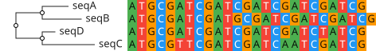

# msaviewr

Interactive multiple sequence alignment viewer for R, powered by
[react-msaview](https://github.com/GMOD/JBrowseMSA). Renders as an htmlwidget in
RStudio, R Markdown, Quarto, and Shiny.


## Installation

The only hard dependency is `htmlwidgets`:

```r
remotes::install_github("GMOD/JBrowseMSA", subdir = "packages/r-msaview")
```

From a clone of the repository, `devtools::install("packages/r-msaview")`
installs the checked-out version instead.

For Bioconductor interop:

```r
BiocManager::install(c("Biostrings", "ggtree", "treeio"))
```

## Quick start

```r
library(msaviewr)

widget <- msaview(
  msa = ">human\nMVLSPADKTNVKAAWGKVGAHAGEYGAEALERMFLSFPTTKTYFPHFDLSH\n>mouse\nMVLSGEDKSNIKAAWGKIGGHGAEYGAEALERMFASFPTTKTYFPHFDVSH\n>goat\nMSLTRTERTIILSLWSKISTQADVIGTETLERLFSCYPQAKTYFPHFDLHS",
  tree = "((human:0.1,mouse:0.2):0.05,goat:0.3);"
)
widget
# htmlwidgets::saveWidget(widget, "alignment.html")                     # self-contained HTML
# webshot2::webshot("alignment.html", "alignment.png")                  # PNG (requires webshot2)

# SVG via the CLI (requires react-msaview-cli installed via npm/npx):
# writeLines(widget$x$props$msa, "alignment.fasta")
# system2("react-msaview-cli", c("export-svg", "--msa", "alignment.fasta", "--output", "alignment.svg"))
# Or with tree: system2("react-msaview-cli", c("export-svg", "--msa", "alignment.fasta", "--tree", "tree.nwk", "--output", "alignment.svg"))
```


## Examples

[A protease family in R](https://gmod.org/JBrowseMSA/tutorials/r_protease_triad)
is the long version: fourteen UniProt accessions cut to their peptidase S1
domain, aligned with DECIPHER, and drawn with a BLOSUM62 track, disulfide arcs
and a band on each catalytic residue.

### Layers, composed with `+`

Every argument of `msaview()` is also a layer, added the way ggplot2 and ggtree
add a geom. Each layer reads a data frame, so a table of variants or per-column
numbers goes in as it already sits in your session.

```r
library(msaviewr)

variants <- data.frame(
  row   = c("Human", "Human"),
  start = c(248, 273),
  end   = c(248, 273),
  label = c("R248Q", "R273H")
)

msaview(msa = "p53.aln", tree = "p53.nh") +
  geom_msa_domains("p53-domains.gff") +
  geom_msa_highlight(variants) +
  geom_msa_track(data.frame(value = conservation), name = "Conservation") +
  scale_residue_color("clustal", encoding = "color") +
  stat_msa_diff("Human") +
  coord_msa(100, 288, row = "Human") +
  theme_msa("dark", col_width = 14)
```

| Layer                   | What it adds                                            |
| ----------------------- | ------------------------------------------------------- |
| `geom_msa_domains()`    | a GFF3 file, URL, text or data frame of annotations     |
| `geom_msa_highlight()`  | a data frame of spans, or one span from its arguments   |
| `geom_msa_track()`      | a track of your numbers, text or arcs                   |
| `geom_msa_clade()`      | a rectangle behind the rows of a clade of the tree      |
| `geom_msa_structure()`  | which structure residue each row residue is             |
| `geom_msa_rowdata()`    | a data frame of extra fields per row                    |
| `geom_msa_strip()`      | a color strip beside the tree from one of those fields  |
| `geom_msa_features()`   | the GFF's spans per row in a panel beside the tree      |
| `scale_row_color()`     | colors a tip label or a row tint by one of those fields |
| `scale_residue_color()` | the color scheme, and the channel it paints             |
| `stat_msa_diff()`       | draws every row as its differences from one row         |
| `coord_msa()`           | the span the viewer opens on                            |
| `theme_msa()`           | cell size, tree gutter, toolbar, light or dark          |

`geom_msa_highlight()`, `geom_msa_clade()`, `geom_msa_track()`,
`geom_msa_structure()`, `geom_msa_strip()`, `geom_msa_features()` and
`scale_row_color()` accumulate, so calling one twice adds two. The others
replace what an earlier layer set.

A layer builds the same props the matching `msaview()` argument does, so the two
styles mix freely and produce the same viewer. `msa` and `tree` are the viewer
itself and stay arguments; every other argument has a layer, which
`test-layer-coverage.R` checks.

### Named character vector

```r
seqs <- c(
  human = "MVLSPADKTNVKAAWGKVGAHAGEYGAEALERMFLSFPTTKTYFPHFDLSH",
  mouse = "MVLSGEDKSNIKAAWGKIGGHGAEYGAEALERMFASFPTTKTYFPHFDVSH",
  goat  = "MSLTRTERTIILSLWSKISTQADVIGTETLERLFSCYPQAKTYFPHFDLHS"
)
msaview(msa = seqs, tree = "((human:0.1,mouse:0.2):0.05,goat:0.3);")
```

### From files

```r
msaview(msa = "alignment.stock")
msaview(msa = "alignment.fa", tree = "tree.nwk")
```

### With ape

```r
library(ape)

tree <- rtree(15)
seqs <- setNames(
  replicate(15, paste0(sample(c("A","C","G","T"), 300, TRUE), collapse = "")),
  tree$tip.label
)
msaview(msa = seqs, tree = tree, color_scheme = "nucleotide")
```



### Cladogram (no branch lengths)

```r
msaview(msa = seqs, tree = tree, show_branch_len = FALSE)
```

### With Biostrings

```r
library(Biostrings)

# DNAStringSet
dna <- DNAStringSet(c(
  seq1 = "ATGCGATCGATCGATCG--ATCG",
  seq2 = "ATGCGATCGATCGATCGATCGATCG",
  seq3 = "ATGCG--CGATCGATCGATCGATCG",
  seq4 = "ATGCGATCGATCGATCG--ATCG"
))
msaview(msa = dna, color_scheme = "nucleotide")

# AAStringSet
aa <- AAStringSet(c(
  human = "MVLSPADKTNVKAAWGKVGAHAGEYGAEALERMFLSFPTTKTYFPHFDLSH",
  mouse = "MVLSGEDKSNIKAAWGKIGGHGAEYGAEALERMFASFPTTKTYFPHFDVSH",
  goat  = "MSLTRTERTIILSLWSKISTQADVIGTETLERLFSCYPQAKTYFPHFDLHS"
))
msaview(msa = aa, color_scheme = "clustal")

# DNAMultipleAlignment
# Biostrings rejects a MultipleAlignment whose rows differ in length
aln <- DNAMultipleAlignment(c(
  seq1 = "ATGCGATCGATCGATCG--ATCG",
  seq2 = "ATGCGATCGATCGATCGATCGAC",
  seq3 = "ATGCG--CGATCGATCGATCGAC"
))
msaview(msa = aln)
```

### After running the msa package

```r
library(msa)
library(Biostrings)

unaligned <- readAAStringSet("proteins.fasta")
aligned <- msa(unaligned, method = "ClustalOmega")
msaview(msa = as(aligned, "AAStringSet"))
```

### Domain annotations

Overlay InterProScan-style protein domains as boxes on the alignment. The `gff`
argument accepts a file path, a GFF3 string, or a data frame. This pairs with
the [CLI](../cli/), which writes domains as GFF3:

```sh
react-msaview-cli interpro accessions.tsv -o domains.gff
```

```r
seqs <- c(
  GPCR_human  = "MNGTEGPNFYVPFSNATGVVRSPFEYPQYYLAEPWQFSMLAAYMFLLIVLGFPINFLTLYVTVQHKKLR",
  GPCR_mouse  = "MNGTEGPNFYVPFSNKTGVVRSPFEYPQYYLAEPWQFSMLAAYMFLLIMLGFPINFLTLYVTVQHKKLR",
  GPCR_bovine = "MNGTEGPNFYVPFSNATGVVRSPFEYPQYYLAEPWQFSMLAAYMFLLIVLGFPINFLTLYVTVQHKKLR"
)

# from a CLI-generated GFF file
msaview(msa = seqs, gff = "domains.gff")

# or from a data frame (columns: seqname, start, end, name, description)
domains <- data.frame(
  seqname     = names(seqs),
  start       = 6,
  end         = 62,
  name        = "PF00001",
  description = "7tm receptor (rhodopsin family)"
)
msaview(msa = seqs, gff = domains, color_scheme = "clustalx_protein_dynamic")
```


### Labeled highlights

Mark a residue, a column range, or a set of rows, with a label saved in the
widget. Coordinates are 1-based and inclusive; `row` makes `start` and `end`
residues of that sequence, projected through the alignment's gaps.

```r
msaview(
  msa = seqs,
  highlights = list(
    list(row = "GPCR_human", start = 20, end = 26, label = "ligand pocket"),
    list(rows = c("GPCR_mouse"), label = "knockout", color = "rgba(0,120,255,0.2)")
  )
)
```

### A track from your own numbers

`column_tracks` draws values you compute per column, or per residue of one
sequence, as a track above the alignment. The viewer scales bars by `max`
(default 1). When `row` names a sequence, the viewer places each value on that
sequence's residues and skips the columns where the sequence has a gap.

```r
hydropathy <- c(I = 4.5, V = 4.2, L = 3.8, F = 2.8, C = 2.5, M = 1.9, A = 1.8,
                G = -0.4, T = -0.7, S = -0.8, W = -0.9, Y = -1.3, P = -1.6,
                H = -3.2, E = -3.5, Q = -3.5, D = -3.5, N = -3.5, K = -3.9,
                R = -4.5)
residues <- strsplit(gsub("-", "", seqs[["GPCR_human"]]), "")[[1]]

msaview(
  msa = seqs,
  column_tracks = list(
    list(id = "kd", name = "Hydropathy (human)", kind = "bar",
         values = hydropathy[residues] + 4.5, max = 9, row = "GPCR_human",
         color = "#6a51a3")
  )
)
```

A `kind = "text"` track takes `data`, one character per column, and an optional
`colors` map from character to color. Every field is listed in the
[layers reference](https://gmod.org/JBrowseMSA/layers).

### With ggtree

Pass a ggtree plot object directly as the `tree` argument, and `msaview` reads
the tree out of it.

```r
library(ggtree)
library(ape)

tree <- rtree(20)
p <- ggtree(tree) + geom_tiplab()

seqs <- setNames(
  replicate(20, paste0(sample(c("A","C","G","T"), 200, TRUE), collapse = "")),
  tree$tip.label
)

# pass the ggtree plot object directly
msaview(msa = seqs, tree = p, color_scheme = "nucleotide")
```

### ggtree with annotations

Annotated ggtree plots work too. `msaview` takes only the tree; the colors,
labels and metadata stay in the ggtree plot.

```r
metadata <- data.frame(
  label = tree$tip.label,
  group = sample(c("A", "B", "C"), 20, replace = TRUE)
)
p2 <- ggtree(tree) %<+% metadata +
  geom_tiplab(aes(color = group)) +
  theme(legend.position = "right")

msaview(msa = seqs, tree = p2)
```

### With treeio

```r
library(treeio)

# treedata objects from read.beast, read.raxml, etc.
beast_tree <- read.beast("beast_output.tree")
msaview(tree = beast_tree)

# or convert from phylo
td <- as.treedata(tree)
msaview(msa = seqs, tree = td)
```

### In Shiny

The widget sets two inputs named after its output id. `input$<id>_click` holds
the cell a click pinned: `column` is the 1-based column of the file, `row` the
row name, `residue` the 1-based position in that row's sequence (absent on a
gap), and `letter` the character. It is `NULL` after a click clears it.
`input$<id>_viewport` holds the columns on screen as `startColumn` and
`endColumn`. A re-render that keeps the same alignment keeps the reader's scroll
and zoom, so changing `color_scheme` below restyles the view in place.

```r
library(shiny)
library(msaviewr)

ui <- fluidPage(
  titlePanel("MSA Viewer"),
  sidebarLayout(
    sidebarPanel(
      fileInput("msa_file", "Upload alignment",
                accept = c(".fa", ".fasta", ".stock", ".sto", ".aln")),
      fileInput("tree_file", "Upload tree (optional)",
                accept = c(".nwk", ".nh", ".newick")),
      selectInput("color_scheme", "Color scheme",
                  choices = c("maeditor", "clustal", "lesk", "cinema",
                              "flower", "nucleotide", "jbrowse_dna",
                              "clustalx_protein_dynamic",
                              "percent_identity_dynamic"),
                  selected = "maeditor"),
      actionButton("example_btn", "Load example data")
    ),
    mainPanel(
      msaviewOutput("msa_viewer", height = "600px"),
      verbatimTextOutput("clicked")
    )
  )
)

server <- function(input, output, session) {
  msa_data <- reactiveVal(NULL)
  tree_data <- reactiveVal(NULL)

  observeEvent(input$msa_file, {
    msa_data(input$msa_file$datapath)
  })

  observeEvent(input$tree_file, {
    tree_data(input$tree_file$datapath)
  })

  observeEvent(input$example_btn, {
    msa_data(paste0(
      ">human\nMVLSPADKTNVKAAWGKVGAHAGEYGAEALERMFLSFPTTKTYFPHFDLSH\n",
      ">mouse\nMVLSGEDKSNIKAAWGKIGGHGAEYGAEALERMFASFPTTKTYFPHFDVSH\n",
      ">goat\nMSLTRTERTIILSLWSKISTQADVIGTETLERLFSCYPQAKTYFPHFDLHS"
    ))
    tree_data("((human:0.1,mouse:0.2):0.05,goat:0.3);")
  })

  output$msa_viewer <- renderMsaview({
    req(msa_data())
    msaview(
      msa = msa_data(),
      tree = tree_data(),
      color_scheme = input$color_scheme
    )
  })

  output$clicked <- renderPrint(input$msa_viewer_click)
}

shinyApp(ui, server)
```

## Supported inputs

| Parameter | Accepted types                                                                                                                                                    |
| --------- | ----------------------------------------------------------------------------------------------------------------------------------------------------------------- |
| `msa`     | File path, FASTA/Stockholm/Clustal string, named `character` vector, `DNAStringSet`, `AAStringSet`, `RNAStringSet`, `DNAMultipleAlignment`, `AAMultipleAlignment` |
| `tree`    | File path, Newick string, `ape::phylo`, `treeio::treedata`, `ggtree` plot object                                                                                  |

## Color schemes

Protein: `maeditor`, `clustal`, `lesk`, `cinema`, `flower`, `clustalx_protein`,
`jalview_taylor`, `jalview_zappo`, `jalview_hydrophobicity`, `jalview_buried`,
`jalview_prophelix`, `jalview_propstrand`, `jalview_propturn`

Nucleotide: `nucleotide`, `jbrowse_dna`, `rainbow_dna`, `clustalx_dna`

Dynamic (computed per-column): `clustalx_protein_dynamic`,
`percent_identity_dynamic`

## Development

The widget's JavaScript is `inst/htmlwidgets/lib/react-msaview.umd.js`, a
generated bundle. Installing an R package runs no Node, so the package commits
the built file. `scripts/release.js` refreshes the bundle from the build it just
made, so every release ships matching JavaScript, and CI fails when the
committed bundle's version stamp differs from `packages/lib`. To refresh the
bundle by hand from the repo root:

```sh
pnpm build && pnpm sync:r-bundle
```

## License

MIT
